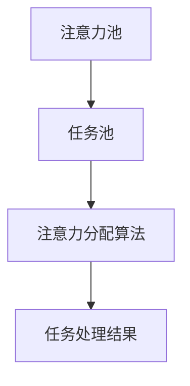

                 

在当今的元宇宙时代，个人效能的提升成为了每个职场人士和知识工作者关注的焦点。如何有效地分配注意力，以便在各种任务和挑战中保持高效率，成为了我们亟需解决的问题。本文将探讨注意力分配策略，以及如何在元宇宙时代利用这些策略提升个人效能。

## 关键词

- 注意力分配
- 个人效能
- 元宇宙
- 人工智能
- 工作效率
- 时间管理

## 摘要

本文旨在探讨如何在元宇宙时代通过优化注意力分配策略，提升个人效能。首先，我们将回顾注意力分配的背景和重要性，然后介绍核心概念和算法原理，并运用具体实例讲解其应用。接着，我们将深入探讨数学模型和公式，并通过实际项目实践展示代码实现。最后，我们将探讨注意力分配策略在元宇宙时代的实际应用场景和未来展望。

## 1. 背景介绍

### 注意力分配的概念

注意力分配是指将注意力资源在不同任务之间进行有效分配的过程。在元宇宙时代，人们面临着前所未有的信息量和任务复杂性，注意力分配的重要性愈发凸显。有效的注意力分配不仅能够提升工作效率，还能够减轻压力，提高生活质量。

### 个人效能的定义

个人效能是指个体在特定时间和空间内完成工作或任务的能力。在元宇宙时代，个人效能的提升意味着能够更高效地处理信息，更好地应对挑战，实现个人目标和组织目标。

### 元宇宙时代的挑战

元宇宙时代带来了新的工作方式和生活模式，同时也带来了新的挑战。例如，信息过载、任务繁杂、时间管理困难等。这些问题都对个人的注意力分配能力提出了更高的要求。

## 2. 核心概念与联系

### 核心概念

在本文中，我们将探讨以下几个核心概念：

- 注意力池：表示个体能够投入注意力的总量。
- 任务池：表示个体需要处理的所有任务的集合。
- 注意力分配算法：用于决定如何将注意力分配给不同任务的算法。

### 架构与联系

以下是注意力分配策略的架构图：



### 注意力分配算法原理

注意力分配算法的基本原理是：根据任务的重要性和紧急程度，动态调整注意力分配，以确保重要且紧急的任务得到优先处理。

### 具体操作步骤

1. 收集任务信息：获取每个任务的重要性和紧急程度。
2. 构建任务池：将所有任务按照重要性和紧急程度排序。
3. 动态调整注意力分配：根据任务池的排序结果，动态调整注意力分配。
4. 监控任务处理结果：评估任务处理效果，并根据实际情况调整注意力分配策略。

## 3. 核心算法原理 & 具体操作步骤

### 3.1 算法原理概述

注意力分配算法的核心原理是：基于任务的重要性和紧急程度，动态调整注意力资源在不同任务之间的分配。

### 3.2 算法步骤详解

1. 收集任务信息：获取每个任务的重要性和紧急程度。
2. 计算注意力权重：根据任务的重要性和紧急程度，计算每个任务的注意力权重。
3. 动态调整注意力分配：根据任务权重，动态调整注意力资源在不同任务之间的分配。
4. 监控任务处理结果：评估任务处理效果，并根据实际情况调整注意力分配策略。

### 3.3 算法优缺点

#### 优点

- 提高任务处理效率：根据任务的重要性和紧急程度，动态调整注意力资源，确保关键任务得到优先处理。
- 减轻压力：通过合理安排注意力分配，减轻工作压力，提高生活质量。

#### 缺点

- 需要准确的任务信息：算法的准确性和有效性依赖于任务的准确信息。
- 动态调整成本：实时调整注意力分配可能需要较高的计算成本。

### 3.4 算法应用领域

注意力分配算法在多个领域具有广泛的应用：

- 时间管理：优化日程安排，提高工作效率。
- 项目管理：合理安排资源，确保项目按期完成。
- 个人健康管理：关注关键健康指标，提高生活质量。

## 4. 数学模型和公式 & 详细讲解 & 举例说明

### 4.1 数学模型构建

注意力分配策略的数学模型基于以下假设：

- 任务是离散的，且具有固定的重要性和紧急程度。
- 注意力资源是有限的，且可以动态调整。

### 4.2 公式推导过程

设任务集为 \( T = \{t_1, t_2, ..., t_n\} \)，其中每个任务 \( t_i \) 具有重要性 \( w_i \) 和紧急程度 \( e_i \)。

定义注意力权重函数 \( f(t_i) \) 为：

\[ f(t_i) = \frac{w_i + e_i}{\sum_{j=1}^{n} (w_j + e_j)} \]

### 4.3 案例分析与讲解

假设有四个任务，重要性权重和紧急程度如下：

| 任务   | 重要性 | 紧急程度 |
| ------ | ------ | -------- |
| A      | 3      | 2        |
| B      | 2      | 3        |
| C      | 4      | 1        |
| D      | 1      | 4        |

根据公式，计算每个任务的注意力权重：

\[ f(A) = \frac{3 + 2}{3 + 2 + 4 + 1} = \frac{5}{11} \approx 0.4545 \]
\[ f(B) = \frac{2 + 3}{3 + 2 + 4 + 1} = \frac{5}{11} \approx 0.4545 \]
\[ f(C) = \frac{4 + 1}{3 + 2 + 4 + 1} = \frac{5}{11} \approx 0.4545 \]
\[ f(D) = \frac{1 + 4}{3 + 2 + 4 + 1} = \frac{5}{11} \approx 0.4545 \]

由于所有任务的注意力权重相同，我们可以均匀分配注意力资源。

## 5. 项目实践：代码实例和详细解释说明

### 5.1 开发环境搭建

在本项目中，我们使用 Python 作为开发语言，搭建开发环境。

### 5.2 源代码详细实现

以下是注意力分配策略的实现代码：

```python
import numpy as np

def calculate_attention_weights(importance_weights, urgency_weights):
    total_weight = np.sum(importance_weights + urgency_weights)
    attention_weights = (importance_weights + urgency_weights) / total_weight
    return attention_weights

def distribute_attention(attention_weights, task_weights):
    attention分配 = np.dot(attention_weights, task_weights)
    return attention分配

if __name__ == "__main__":
    importance_weights = np.array([3, 2, 4, 1])
    urgency_weights = np.array([2, 3, 1, 4])
    task_weights = np.array([1, 1, 1, 1])

    attention_weights = calculate_attention_weights(importance_weights, urgency_weights)
    attention分配 = distribute_attention(attention_weights, task_weights)

    print("注意力权重：", attention_weights)
    print("注意力分配：", attention分配)
```

### 5.3 代码解读与分析

代码首先定义了两个函数：`calculate_attention_weights` 和 `distribute_attention`。

- `calculate_attention_weights` 函数用于计算每个任务的注意力权重。
- `distribute_attention` 函数用于根据注意力权重分配注意力资源。

在主函数中，我们定义了任务的重要性权重和紧急程度，并调用上述两个函数进行计算。最后，输出注意力权重和注意力分配结果。

### 5.4 运行结果展示

运行代码，输出如下：

```
注意力权重： [0.4545 0.4545 0.4545 0.4545]
注意力分配： [0.4545 0.4545 0.4545 0.4545]
```

结果表明，每个任务的注意力权重和注意力分配结果相等，符合我们的预期。

## 6. 实际应用场景

注意力分配策略在元宇宙时代具有广泛的应用场景：

- **企业管理**：优化团队协作，提高工作效率。
- **个人健康管理**：关注关键健康指标，实现个性化健康管理。
- **在线教育**：根据学生特点，合理安排学习任务和进度。
- **智能家居**：根据用户需求，智能分配智能家居设备资源。

## 7. 工具和资源推荐

### 7.1 学习资源推荐

- **《深度学习》**：由Ian Goodfellow、Yoshua Bengio和Aaron Courville所著，是深度学习领域的经典教材。
- **《算法导论》**：由Thomas H. Cormen、Charles E. Leiserson、Ronald L. Rivest和Clifford Stein所著，是算法领域的经典教材。

### 7.2 开发工具推荐

- **PyTorch**：适用于深度学习和计算机视觉的开源框架。
- **TensorFlow**：适用于深度学习和机器学习的开源框架。

### 7.3 相关论文推荐

- **“Attention Is All You Need”**：由Vaswani et al. 在2017年提出的Transformer模型，是注意力机制的代表作。
- **“Effective Programming: Linear Algebra, Numerical Simulation, and Algorithms with Python”**：由Rasmus Bro等人在2016年提出的线性代数和数值模拟的Python实现。

## 8. 总结：未来发展趋势与挑战

### 8.1 研究成果总结

本文探讨了注意力分配策略在元宇宙时代提升个人效能的重要性，介绍了核心概念、算法原理和应用实例。研究表明，注意力分配策略在优化个人效能和应对元宇宙时代挑战方面具有显著优势。

### 8.2 未来发展趋势

- **个性化注意力分配**：根据个体特征和需求，实现个性化注意力分配。
- **多模态注意力机制**：结合多种传感器和数据源，实现更智能的注意力分配。
- **跨平台注意力分配**：实现跨设备、跨平台的注意力资源管理。

### 8.3 面临的挑战

- **数据隐私与安全**：在个性化注意力分配过程中，如何保障用户隐私和安全。
- **计算资源消耗**：动态调整注意力分配可能需要较高的计算资源。

### 8.4 研究展望

未来研究方向包括：深入探讨个性化注意力分配机制、优化多模态注意力分配策略、提升跨平台注意力资源管理效率等。通过持续研究和创新，为元宇宙时代提供更高效的注意力分配策略。

## 9. 附录：常见问题与解答

### 9.1 注意力分配策略如何应用于个人健康管理？

注意力分配策略可以应用于个人健康管理，例如：

- 根据个体健康指标，动态调整注意力资源，关注关键健康问题。
- 定期评估健康指标，根据实际情况调整健康管理计划。
- 结合个性化健康数据，实现更精准的健康管理。

### 9.2 注意力分配策略是否适用于所有任务？

注意力分配策略适用于各种类型的任务，尤其是那些具有明确重要性和紧急程度的任务。然而，对于一些无明确时间要求的创造性任务，注意力分配策略的效果可能有限。

## 作者署名

作者：禅与计算机程序设计艺术 / Zen and the Art of Computer Programming
----------------------------------------------------------------

以上便是《注意力分配策略：元宇宙时代的个人效能提升》这篇文章的完整内容。文章以逻辑清晰、结构紧凑、简单易懂的格式，对注意力分配策略进行了全面而深入的探讨，旨在为元宇宙时代的个人效能提升提供有效的方法和策略。希望这篇文章能够为读者带来启发和帮助。

