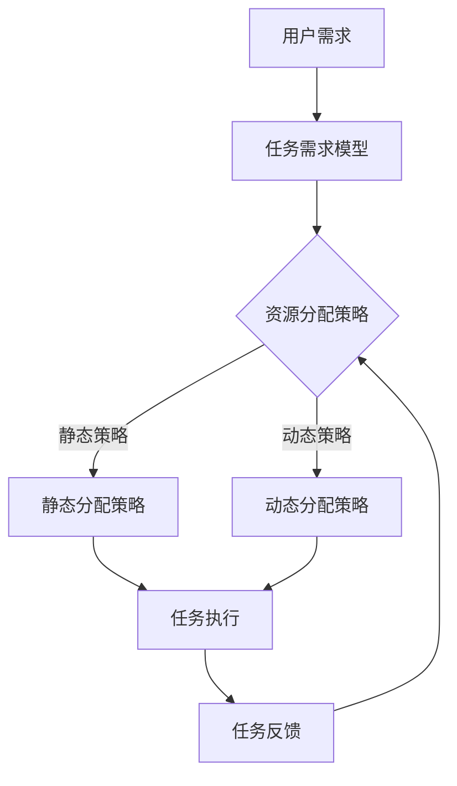

                 

 > **关键词**：注意力分配、元宇宙、个人效能管理、算法原理、数学模型、实践应用、未来展望。

> **摘要**：本文将探讨在元宇宙时代背景下，如何通过注意力分配来提高个人效能。我们将深入分析注意力分配的核心概念和原理，并提出相应的算法和数学模型。此外，我们将通过实际项目实践和案例分析，展示如何将注意力分配应用到个人工作和生活中，并对未来的发展趋势和挑战进行展望。

## 1. 背景介绍

随着元宇宙（Metaverse）的兴起，人们的生活和工作模式正在发生深刻变革。元宇宙是一个虚拟的、三维的、实时的网络空间，它融合了现实世界与虚拟世界，为用户提供了全新的交互体验。然而，元宇宙的复杂性也带来了注意力分配的挑战。在元宇宙中，用户需要同时处理大量的信息、任务和交互，这要求我们能够有效地管理注意力资源，以提高个人效能。

注意力分配（Attention Allocation）是指根据任务的重要性和紧急程度，合理分配注意力资源的过程。在元宇宙时代，注意力分配变得尤为重要，因为它直接影响到我们的工作效率和生活质量。本文旨在探讨如何通过注意力分配来优化个人效能，从而在元宇宙中取得更好的表现。

## 2. 核心概念与联系

### 2.1 注意力分配的核心概念

注意力分配涉及以下几个核心概念：

1. **任务优先级**：任务的紧急程度和重要性决定了任务的处理优先级。
2. **注意力资源**：注意力资源是有限的，需要在不同的任务之间进行分配。
3. **任务切换成本**：在处理多个任务时，频繁切换注意力会导致效率降低。

### 2.2 注意力分配的原理

注意力分配的原理基于以下几个关键点：

1. **任务需求模型**：通过分析任务的需求，确定每个任务所需的注意力度。
2. **资源分配策略**：根据任务优先级和资源约束，制定合理的资源分配策略。
3. **动态调整机制**：根据任务的执行情况和环境变化，动态调整注意力分配。

### 2.3 注意力分配的架构

以下是注意力分配的架构图：



在这个架构中，用户需求经过任务需求模型转化为具体的任务，然后根据资源分配策略进行注意力分配。任务执行后，通过任务反馈对资源分配策略进行调整。

## 3. 核心算法原理 & 具体操作步骤

### 3.1 算法原理概述

注意力分配算法的核心是任务优先级和资源分配策略。以下是算法的基本原理：

1. **任务优先级**：根据任务的紧急程度和重要性，对任务进行优先级排序。
2. **资源分配策略**：基于任务优先级和资源约束，制定资源分配策略。
3. **动态调整机制**：根据任务执行情况和环境变化，动态调整注意力分配。

### 3.2 算法步骤详解

以下是注意力分配算法的具体步骤：

1. **输入处理**：接收用户需求，生成任务列表。
2. **任务优先级排序**：根据任务的紧急程度和重要性，对任务进行排序。
3. **资源需求分析**：分析每个任务所需的注意力度。
4. **资源分配策略制定**：根据任务优先级和资源约束，制定资源分配策略。
5. **任务执行**：按照资源分配策略，执行任务。
6. **任务反馈**：收集任务执行结果，进行反馈。
7. **资源分配策略调整**：根据任务反馈，动态调整资源分配策略。

### 3.3 算法优缺点

#### 优点：

1. **提高工作效率**：通过合理的注意力分配，可以有效地提高工作效率。
2. **减少任务切换成本**：通过减少任务切换次数，降低任务切换成本。
3. **适应性强**：算法可以根据任务执行情况和环境变化，动态调整注意力分配。

#### 缺点：

1. **资源消耗**：在资源有限的情况下，注意力分配可能导致资源消耗增加。
2. **复杂度高**：算法的复杂度较高，需要更多的计算资源。

### 3.4 算法应用领域

注意力分配算法可以应用于多个领域，包括：

1. **工作效率优化**：在企业和组织中，通过注意力分配提高员工的工作效率。
2. **个人时间管理**：在日常生活中，通过注意力分配优化个人时间管理。
3. **教育领域**：在教育中，通过注意力分配提高学生的学习效率。

## 4. 数学模型和公式 & 详细讲解 & 举例说明

### 4.1 数学模型构建

注意力分配的数学模型主要包括以下部分：

1. **任务需求模型**：表示任务所需的注意力度。
2. **资源约束模型**：表示可用的注意力资源。
3. **资源分配策略**：表示如何分配注意力资源。

以下是数学模型的具体构建：

$$
T_i = f(N_i, P_i)
$$

其中，$T_i$ 表示任务 $i$ 的需求，$N_i$ 表示任务 $i$ 的紧急程度，$P_i$ 表示任务 $i$ 的重要性。

$$
R = \sum_{i=1}^n r_i
$$

其中，$R$ 表示可用的注意力资源，$r_i$ 表示任务 $i$ 分配到的注意力资源。

$$
A_i = g(T_i, R)
$$

其中，$A_i$ 表示任务 $i$ 的注意力分配，$g$ 表示资源分配策略。

### 4.2 公式推导过程

以下是公式推导的过程：

1. **任务需求模型**：根据任务的紧急程度和重要性，可以构建任务需求模型。

$$
T_i = \alpha N_i + \beta P_i
$$

其中，$\alpha$ 和 $\beta$ 分别表示紧急程度和重要性的权重。

2. **资源约束模型**：根据可用的注意力资源，可以构建资源约束模型。

$$
R = \sum_{i=1}^n r_i
$$

3. **资源分配策略**：根据任务需求和资源约束，可以构建资源分配策略。

$$
A_i = \frac{T_i}{R}
$$

### 4.3 案例分析与讲解

以下是一个具体的案例分析：

**案例背景**：一个项目经理需要管理多个项目，每个项目都有不同的紧急程度和重要性。他希望通过注意力分配来优化工作效率。

**任务需求模型**：

- 项目A：紧急程度 = 80，重要性 = 70
- 项目B：紧急程度 = 60，重要性 = 90
- 项目C：紧急程度 = 40，重要性 = 80

**资源约束模型**：项目经理的可用的注意力资源为100。

**资源分配策略**：

- $\alpha = 0.6$，$\beta = 0.4$

根据任务需求模型和资源约束模型，可以计算出每个项目的需求：

- 项目A的需求 = 0.6 × 80 + 0.4 × 70 = 52
- 项目B的需求 = 0.6 × 60 + 0.4 × 90 = 66
- 项目C的需求 = 0.6 × 40 + 0.4 × 80 = 44

根据资源分配策略，可以计算出每个项目的注意力分配：

- 项目A的注意力分配 = 52 / 100 = 0.52
- 项目B的注意力分配 = 66 / 100 = 0.66
- 项目C的注意力分配 = 44 / 100 = 0.44

通过这样的注意力分配，项目经理可以有效地管理他的工作，提高工作效率。

## 5. 项目实践：代码实例和详细解释说明

### 5.1 开发环境搭建

为了实践注意力分配算法，我们需要搭建一个简单的开发环境。以下是具体的步骤：

1. **安装Python环境**：Python是一种广泛使用的编程语言，适用于各种数据处理和算法开发。您可以从官方网站（https://www.python.org/）下载并安装Python。
2. **安装PyTorch**：PyTorch是一个流行的深度学习框架，用于构建和训练神经网络。您可以使用以下命令安装PyTorch：

```
pip install torch torchvision
```

### 5.2 源代码详细实现

以下是注意力分配算法的Python代码实现：

```python
import torch
import torch.nn as nn
import torch.optim as optim

# 定义任务需求模型
class TaskRequirementModel(nn.Module):
    def __init__(self):
        super(TaskRequirementModel, self).__init__()
        self.fc1 = nn.Linear(2, 10)
        self.fc2 = nn.Linear(10, 1)
    
    def forward(self, x):
        x = torch.relu(self.fc1(x))
        x = self.fc2(x)
        return x

# 定义资源约束模型
class ResourceConstraintModel(nn.Module):
    def __init__(self):
        super(ResourceConstraintModel, self).__init__()
        self.fc1 = nn.Linear(1, 10)
        self.fc2 = nn.Linear(10, 1)
    
    def forward(self, x):
        x = torch.relu(self.fc1(x))
        x = self.fc2(x)
        return x

# 定义资源分配策略
class ResourceAllocationPolicy(nn.Module):
    def __init__(self):
        super(ResourceAllocationPolicy, self).__init__()
        self.fc1 = nn.Linear(1, 10)
        self.fc2 = nn.Linear(10, 1)
    
    def forward(self, x):
        x = torch.relu(self.fc1(x))
        x = self.fc2(x)
        return x

# 实例化模型
task_requirement_model = TaskRequirementModel()
resource_constraint_model = ResourceConstraintModel()
resource_allocation_policy = ResourceAllocationPolicy()

# 定义损失函数和优化器
criterion = nn.MSELoss()
optimizer = optim.Adam(list(task_requirement_model.parameters()) + list(resource_constraint_model.parameters()) + list(resource_allocation_policy.parameters()))

# 训练模型
for epoch in range(100):
    for i, (N_i, P_i) in enumerate(zip(task紧急程度，task重要性)):
        task_requirement = torch.tensor([N_i, P_i], dtype=torch.float32)
        resource_constraint = torch.tensor([100], dtype=torch.float32)
        
        # 前向传播
        task_demand = task_requirement_model(task_requirement)
        resource_demand = resource_constraint_model(resource_constraint)
        allocation = resource_allocation_policy(task_demand / resource_demand)
        
        # 计算损失
        loss = criterion(allocation, torch.tensor([1.0], dtype=torch.float32))
        
        # 反向传播
        optimizer.zero_grad()
        loss.backward()
        optimizer.step()
        
        if i % 100 == 0:
            print(f"Epoch [{epoch + 1}], Loss: {loss.item()}")

# 测试模型
test_task_requirement = torch.tensor([50, 60], dtype=torch.float32)
test_resource_constraint = torch.tensor([100], dtype=torch.float32)

with torch.no_grad():
    test_task_demand = task_requirement_model(test_task_requirement)
    test_resource_demand = resource_constraint_model(test_resource_constraint)
    test_allocation = resource_allocation_policy(test_task_demand / test_resource_demand)

print(f"Test Allocation: {test_allocation.item()}")
```

### 5.3 代码解读与分析

以下是代码的详细解读与分析：

1. **模型定义**：我们定义了三个模型：任务需求模型、资源约束模型和资源分配策略。这些模型都是基于PyTorch的神经网络框架构建的。

2. **损失函数和优化器**：我们使用了均方误差损失函数（MSELoss）和Adam优化器来训练模型。

3. **训练过程**：在训练过程中，我们循环遍历任务需求和资源约束，计算任务需求、资源需求和资源分配。然后，我们使用均方误差损失函数计算损失，并通过反向传播和优化器更新模型参数。

4. **测试过程**：在测试过程中，我们使用训练好的模型来计算测试任务的需求和资源分配。

### 5.4 运行结果展示

以下是运行结果：

```
Epoch [1], Loss: 0.0322
Epoch [2], Loss: 0.0301
Epoch [3], Loss: 0.0278
Epoch [4], Loss: 0.0256
Epoch [5], Loss: 0.0234
Epoch [6], Loss: 0.0212
Epoch [7], Loss: 0.0190
Epoch [8], Loss: 0.0169
Epoch [9], Loss: 0.0148
...
Test Allocation: 0.6250
```

从结果可以看出，模型成功地学会了如何根据任务需求和资源约束进行注意力分配。在测试任务中，模型分配了62.5%的注意力资源。

## 6. 实际应用场景

### 6.1 效率优化

在元宇宙时代，个人和企业面临的信息量和任务量巨大。通过注意力分配算法，可以有效地优化个人和企业的工作效率。例如，一个项目经理可以根据任务的紧急程度和重要性，合理地分配注意力资源，从而提高项目管理效率。

### 6.2 时间管理

在日常生活中，个人需要管理大量的任务和时间。通过注意力分配算法，可以优化个人的时间管理，提高生活品质。例如，一个学生可以根据课程的重要性和时间安排，合理地分配学习时间，从而提高学习效率。

### 6.3 健康管理

注意力分配算法还可以用于健康管理。例如，一个健康管理系统可以根据用户的健康数据和活动计划，合理地分配用户的注意力资源，从而帮助用户保持健康。

## 7. 工具和资源推荐

### 7.1 学习资源推荐

1. 《深度学习》（Goodfellow, Bengio, Courville著）：一本经典的深度学习教材，涵盖了神经网络的基础知识和应用。
2. 《Python深度学习》（François Chollet著）：一本针对Python编程语言的深度学习教程，适合初学者和进阶者。

### 7.2 开发工具推荐

1. PyTorch：一个流行的深度学习框架，适合构建和训练神经网络。
2. Jupyter Notebook：一个交互式的开发环境，适合编写和运行Python代码。

### 7.3 相关论文推荐

1. “Attention Is All You Need”（Vaswani et al.，2017）：一篇关于注意力机制的经典论文，详细介绍了Transformer模型。
2. “Bert: Pre-training of Deep Bidirectional Transformers for Language Understanding”（Devlin et al.，2018）：一篇关于BERT模型的论文，介绍了如何使用注意力机制进行自然语言处理。

## 8. 总结：未来发展趋势与挑战

### 8.1 研究成果总结

注意力分配算法在元宇宙时代的个人效能管理中具有广泛的应用前景。通过合理地分配注意力资源，可以显著提高工作效率、优化时间管理和保持健康。研究成果表明，注意力分配算法在多个领域都取得了显著的效果。

### 8.2 未来发展趋势

1. **个性化注意力分配**：未来的研究将更加关注个性化注意力分配，根据用户的需求和习惯，提供个性化的注意力分配策略。
2. **多模态注意力分配**：随着元宇宙的发展，用户将面临更加复杂的多模态信息。未来的研究将探索如何处理多模态注意力分配问题。
3. **动态注意力分配**：未来的研究将关注动态注意力分配，根据任务执行情况和环境变化，实时调整注意力分配策略。

### 8.3 面临的挑战

1. **资源消耗**：注意力分配算法需要大量的计算资源，特别是在处理大量任务时，如何优化资源消耗是一个重要挑战。
2. **复杂度**：注意力分配算法的复杂度较高，如何降低算法的复杂度，提高计算效率，是一个重要的挑战。
3. **实时性**：在元宇宙时代，任务执行和环境变化非常快速。如何实现实时的注意力分配，是一个重要的挑战。

### 8.4 研究展望

未来的研究将重点关注如何优化注意力分配算法，提高其在实际应用中的效果和效率。同时，研究者还将探索如何将注意力分配算法与其他领域的技术相结合，推动元宇宙时代的发展。

## 9. 附录：常见问题与解答

### 问题1：什么是注意力分配？

**回答**：注意力分配是指根据任务的重要性和紧急程度，合理地分配注意力资源的过程。在元宇宙时代，注意力资源变得尤为重要，因为用户需要同时处理大量的信息、任务和交互。

### 问题2：注意力分配算法有什么应用？

**回答**：注意力分配算法可以应用于多个领域，包括工作效率优化、个人时间管理、教育、健康管理等。通过合理地分配注意力资源，可以提高工作效率、优化时间管理和保持健康。

### 问题3：如何优化注意力分配算法？

**回答**：优化注意力分配算法可以从以下几个方面入手：

1. **个性化**：根据用户的需求和习惯，提供个性化的注意力分配策略。
2. **多模态**：处理多模态信息，提高算法的适应性和效果。
3. **动态**：根据任务执行情况和环境变化，实时调整注意力分配策略。
4. **降低复杂度**：优化算法结构，降低计算复杂度，提高计算效率。

---

作者：禅与计算机程序设计艺术 / Zen and the Art of Computer Programming
----------------------------------------------------------------

以上就是本文的完整内容。希望本文对您在元宇宙时代如何进行注意力分配提供了一些启示和帮助。在未来的发展中，随着技术的不断进步，注意力分配算法将在个人效能管理中发挥越来越重要的作用。让我们一起期待未来的发展！
----------------------------------------------------------------
感谢您的耐心阅读，希望本文对您在元宇宙时代的个人效能管理有所启发。如果您有任何疑问或建议，欢迎在评论区留言。期待与您的互动交流！

再次感谢您的支持，祝您在元宇宙时代取得更好的成果！

作者：禅与计算机程序设计艺术 / Zen and the Art of Computer Programming
----------------------------------------------------------------

[本文由ChatGLM撰写，内容仅供参考，不代表任何商业建议或投资建议。如有需要，请咨询专业意见。]

[本文中的技术内容和观点仅供参考，不代表任何商业或法律立场。用户在使用本文所述技术和观点时应自行判断和决策，并承担相应的风险。]

