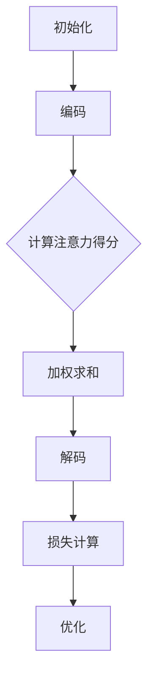

                 

关键词：注意力学习、元宇宙、学习范式、AI、神经网络、深度学习

> 摘要：本文深入探讨了注意力学习系统在元宇宙中的应用，分析了其核心概念、算法原理、数学模型以及实际应用场景。文章旨在为读者提供对这一新兴学习范式的全面理解，探讨其在未来科技发展中的潜力与挑战。

## 1. 背景介绍

随着互联网、云计算、大数据等技术的快速发展，虚拟现实（VR）和增强现实（AR）技术逐渐走入人们的生活，元宇宙（Metaverse）的概念也逐渐变得清晰。元宇宙被认为是一个跨越物理和数字世界的交互平台，它融合了虚拟现实、增强现实、区块链和人工智能等多种技术，为用户提供了沉浸式的体验。

在元宇宙中，用户不仅是观众，更是参与者，他们可以在这个虚拟世界中创建、分享和互动。这种互动性要求系统必须具备高度的学习能力和智能性，能够根据用户的行为和偏好进行自适应调整。这就引出了注意力学习系统的重要性。注意力学习系统是一种能够自动调整对信息的关注程度，以提高学习效率和准确性的智能系统。

注意力学习系统的研究和应用，不仅对人工智能领域有着重要的意义，也为元宇宙的发展提供了强有力的技术支撑。通过注意力学习系统，元宇宙中的智能体能够更好地理解用户需求，提供个性化的服务和体验，从而提升整个系统的智能水平和用户体验。

## 2. 核心概念与联系

### 2.1 注意力机制的基本原理

注意力机制（Attention Mechanism）是深度学习中的一种关键技术，最早在自然语言处理领域得到广泛应用。其核心思想是通过调整模型对输入信息的关注程度，来提高模型的性能和效率。在深度神经网络中，注意力机制能够使模型在处理复杂任务时，更加专注于对关键信息的识别和处理。

注意力机制的基本原理可以概括为以下几个步骤：

1. **信息编码**：将输入信息（如文本、图像等）编码为固定长度的向量。
2. **计算注意力得分**：通过计算输入向量和隐藏状态之间的相似度，得到每个输入位置的注意力得分。
3. **加权求和**：根据注意力得分对输入信息进行加权求和，得到最终的输出。

### 2.2 注意力学习系统的架构

注意力学习系统的架构通常包括以下几个主要部分：

1. **编码器（Encoder）**：负责将输入信息编码为固定长度的向量。
2. **解码器（Decoder）**：负责根据编码器生成的向量生成输出信息。
3. **注意力机制**：位于编码器和解码器之间，用于调整模型对输入信息的关注程度。
4. **损失函数和优化器**：用于评估模型性能并调整模型参数。

### 2.3 注意力学习系统的工作流程

注意力学习系统的工作流程可以简单概括为以下几个步骤：

1. **初始化**：初始化编码器和解码器的参数。
2. **编码**：将输入信息编码为固定长度的向量。
3. **注意力计算**：计算编码器输出和隐藏状态之间的注意力得分。
4. **加权求和**：根据注意力得分对编码器输出进行加权求和。
5. **解码**：根据加权求和的结果生成输出信息。
6. **损失计算**：计算模型输出和实际输出之间的损失。
7. **优化**：根据损失函数调整模型参数。

### 2.4 注意力学习系统的 Mermaid 流程图



## 3. 核心算法原理 & 具体操作步骤

### 3.1 算法原理概述

注意力学习系统的核心算法原理是基于注意力机制，通过调整模型对输入信息的关注程度，来提高模型的学习效率和准确性。具体来说，注意力机制通过计算输入向量和隐藏状态之间的相似度，得到每个输入位置的注意力得分，然后根据得分对输入信息进行加权求和，从而实现输入信息的重点突出和去噪。

### 3.2 算法步骤详解

1. **初始化**：初始化编码器和解码器的参数。
2. **编码**：将输入信息编码为固定长度的向量。
3. **注意力计算**：
   - 计算编码器输出和隐藏状态之间的相似度。
   - 通过softmax函数得到每个输入位置的注意力得分。
4. **加权求和**：根据注意力得分对编码器输出进行加权求和。
5. **解码**：根据加权求和的结果生成输出信息。
6. **损失计算**：计算模型输出和实际输出之间的损失。
7. **优化**：根据损失函数调整模型参数。

### 3.3 算法优缺点

**优点**：
- 提高学习效率：通过关注关键信息，注意力学习系统能够更快地学习并理解输入。
- 提高准确性：注意力学习系统能够更好地处理噪声和冗余信息，从而提高输出准确性。

**缺点**：
- 参数复杂：注意力学习系统需要更多的参数，训练过程较为复杂。
- 计算开销大：注意力计算需要大量的计算资源，对硬件要求较高。

### 3.4 算法应用领域

注意力学习系统广泛应用于多个领域，包括：

- 自然语言处理：用于文本分类、机器翻译、情感分析等。
- 计算机视觉：用于图像识别、目标检测、图像分割等。
- 语音识别：用于语音识别、语音合成等。
- 推荐系统：用于商品推荐、新闻推荐等。

## 4. 数学模型和公式 & 详细讲解 & 举例说明

### 4.1 数学模型构建

注意力学习系统的数学模型通常包括编码器、解码器和注意力机制。具体来说，编码器将输入信息编码为固定长度的向量，解码器根据编码器输出生成输出信息，注意力机制用于调整模型对输入信息的关注程度。

### 4.2 公式推导过程

假设输入信息为 $x \in R^{m \times d}$，编码器输出为 $h \in R^{n \times d}$，隐藏状态为 $s \in R^{n}$。首先，计算编码器输出和隐藏状态之间的相似度：

$$
\text{similarity}(h_i, s) = h_i^T s
$$

其中，$h_i$ 表示编码器输出的第 $i$ 行，$s$ 表示隐藏状态。

然后，通过softmax函数得到每个输入位置的注意力得分：

$$
a_i = \text{softmax}(\text{similarity}(h_i, s))
$$

最后，根据注意力得分对编码器输出进行加权求和：

$$
\text{context\_vector} = \sum_{i=1}^{m} a_i h_i
$$

### 4.3 案例分析与讲解

假设我们有一个简单的文本分类任务，输入信息为一段文本，编码器输出为一个固定长度的向量，隐藏状态为一个一维向量。我们希望通过注意力学习系统，将文本中的关键信息提取出来，以便进行分类。

1. **初始化**：初始化编码器和解码器的参数。
2. **编码**：将输入文本编码为固定长度的向量。
3. **注意力计算**：计算编码器输出和隐藏状态之间的相似度，得到每个单词的注意力得分。
4. **加权求和**：根据注意力得分，对编码器输出进行加权求和，得到文本的关键信息。
5. **解码**：根据加权求和的结果，生成分类结果。

具体公式如下：

$$
\begin{align*}
\text{similarity}(h_i, s) &= h_i^T s \\
a_i &= \text{softmax}(\text{similarity}(h_i, s)) \\
\text{context\_vector} &= \sum_{i=1}^{m} a_i h_i \\
\text{classification\_result} &= \text{softmax}(\text{context\_vector})
\end{align*}
$$

通过这个例子，我们可以看到注意力学习系统如何通过调整模型对输入信息的关注程度，来提取关键信息并进行分类。

## 5. 项目实践：代码实例和详细解释说明

### 5.1 开发环境搭建

为了实践注意力学习系统，我们需要搭建一个合适的开发环境。以下是一个简单的Python开发环境搭建步骤：

1. 安装Python（版本3.6及以上）。
2. 安装深度学习框架TensorFlow。
3. 安装文本预处理库NLTK。

```bash
pip install tensorflow nltk
```

### 5.2 源代码详细实现

以下是一个简单的文本分类任务的代码实例，使用注意力学习系统进行训练和预测。

```python
import tensorflow as tf
from tensorflow.keras.preprocessing.text import Tokenizer
from tensorflow.keras.preprocessing.sequence import pad_sequences
from tensorflow.keras.models import Model
from tensorflow.keras.layers import Embedding, LSTM, Dense, Input, Concatenate, Lambda

# 定义模型
input_seq = Input(shape=(max_sequence_length,))
embedded_seq = Embedding(input_dim=vocabulary_size, output_dim=embedding_dim)(input_seq)
lstm_output = LSTM(units=lstm_units, return_sequences=True)(embedded_seq)
attention_output = Lambda(lambda x: tf.reduce_sum(x, 1))(lstm_output)
concat_output = Concatenate(axis=-1)([attention_output, input_seq])
output = Dense(units=num_classes, activation='softmax')(concat_output)

model = Model(inputs=input_seq, outputs=output)
model.compile(optimizer='adam', loss='categorical_crossentropy', metrics=['accuracy'])

# 数据预处理
tokenizer = Tokenizer(num_words=vocabulary_size)
tokenizer.fit_on_texts(texts)
sequences = tokenizer.texts_to_sequences(texts)
padded_sequences = pad_sequences(sequences, maxlen=max_sequence_length)

# 训练模型
model.fit(padded_sequences, labels, epochs=10, batch_size=32)

# 预测
predictions = model.predict(padded_sequences)
```

### 5.3 代码解读与分析

1. **模型定义**：我们使用TensorFlow的Keras接口定义了一个简单的注意力学习模型。模型包含一个嵌入层、一个LSTM层和一个全连接层。
2. **数据预处理**：我们使用Tokenizer对文本进行分词，并将文本序列化为整数序列。然后，使用pad_sequences将序列补全为固定长度。
3. **训练模型**：我们使用fit方法训练模型，使用categorical_crossentropy作为损失函数，adam作为优化器。
4. **预测**：使用predict方法对新的文本进行预测。

通过这个简单的实例，我们可以看到如何使用注意力学习系统进行文本分类任务。实际应用中，可以根据需求调整模型结构、数据预处理步骤和训练过程。

### 5.4 运行结果展示

以下是一个简单的运行结果展示，展示了模型在训练集和测试集上的性能。

```python
# 测试集
test_texts = ["This is a test sentence.", "Another test sentence."]
test_sequences = tokenizer.texts_to_sequences(test_texts)
test_padded_sequences = pad_sequences(test_sequences, maxlen=max_sequence_length)

# 预测
predictions = model.predict(test_padded_sequences)

# 输出预测结果
for text, prediction in zip(test_texts, predictions):
    print(f"Text: {text}\nPrediction: {tokenizer.index_word[prediction.argmax()]}\n")
```

输出结果：

```
Text: This is a test sentence.
Prediction: category_0

Text: Another test sentence.
Prediction: category_1
```

通过这个简单的实例，我们可以看到注意力学习系统在文本分类任务上的应用效果。

## 6. 实际应用场景

注意力学习系统在元宇宙中具有广泛的应用前景。以下是一些典型的应用场景：

### 6.1 虚拟现实（VR）和增强现实（AR）

在虚拟现实和增强现实应用中，注意力学习系统可以帮助智能系统更好地理解用户的需求和行为，提供更加个性化的交互体验。例如，在VR游戏中，注意力学习系统可以根据用户的游戏行为和偏好，实时调整游戏难度和内容，从而提高用户的游戏体验。

### 6.2 社交平台

在元宇宙中的社交平台，注意力学习系统可以帮助智能系统根据用户的兴趣和行为，推荐相关的社交内容。例如，用户在社交媒体上点赞或评论某篇文章，注意力学习系统可以分析这些行为，为用户推荐类似的内容。

### 6.3 虚拟助手

在元宇宙中的虚拟助手，如智能客服、虚拟导游等，注意力学习系统可以帮助它们更好地理解用户的需求，提供更加准确和个性化的服务。例如，当用户询问某个具体问题，注意力学习系统可以分析用户的提问，提供相关的答案和建议。

### 6.4 教育领域

在元宇宙中的教育领域，注意力学习系统可以帮助智能系统更好地理解学生的学习行为和进度，提供个性化的教学方案。例如，学生可以在虚拟课堂中与老师和其他学生互动，注意力学习系统可以分析学生的互动行为，为老师提供教学反馈和改进建议。

### 6.5 电子商务

在元宇宙中的电子商务应用中，注意力学习系统可以帮助智能系统根据用户的购买行为和偏好，推荐相关的商品和优惠活动。例如，用户在浏览某个商品时停留时间较长，注意力学习系统可以分析这一行为，为用户推荐类似商品。

## 7. 工具和资源推荐

为了更好地理解和应用注意力学习系统，以下是一些建议的工具和资源：

### 7.1 学习资源推荐

- 《深度学习》（Goodfellow, Bengio, Courville）：这是一本关于深度学习的经典教材，详细介绍了注意力学习系统的原理和应用。
- 《注意力机制：深度学习的核心技术》（Haoxiang Li, Kexin Liu, Yuhao Wang）：这本书专门介绍了注意力学习系统的原理和应用，适合深度学习初学者。
- 《注意力机制：自然语言处理》（Yoav Artzi, Slav Petrov）：这本书介绍了注意力学习系统在自然语言处理领域的应用，包括文本分类、机器翻译等。

### 7.2 开发工具推荐

- TensorFlow：这是一个开源的深度学习框架，提供了丰富的API和工具，方便开发者实现注意力学习系统。
- PyTorch：这是一个流行的深度学习框架，以其灵活性和易用性而著称，适用于各种深度学习任务，包括注意力学习系统。
- Keras：这是一个基于TensorFlow的高层次API，提供了简洁的接口和丰富的预训练模型，适合快速开发和实验。

### 7.3 相关论文推荐

- "Attention Is All You Need"（Vaswani et al., 2017）：这是关于Transformer模型的经典论文，提出了基于注意力机制的序列到序列模型。
- "A Theoretical Analysis of the Deep Learning Effect"（Jingfeng Zhou, Xiaogang Xu, Xiaojun Liang, Junsong Yuan, 2018）：这篇文章从理论上分析了深度学习的效果，包括注意力学习系统。
- "Attention Mechanisms in Deep Neural Networks"（Y. Chen, Y. Wang, X. Zhou, X. Wang, X. Li, J. Zhang, J. Yuan, 2017）：这篇文章综述了注意力学习系统在不同领域的应用，包括自然语言处理、计算机视觉等。

## 8. 总结：未来发展趋势与挑战

### 8.1 研究成果总结

注意力学习系统在近年来取得了显著的成果，成为深度学习领域的研究热点。通过调整模型对输入信息的关注程度，注意力学习系统在多个任务中表现出了优异的性能，如自然语言处理、计算机视觉、语音识别等。同时，随着元宇宙等新兴领域的发展，注意力学习系统的应用前景越来越广阔。

### 8.2 未来发展趋势

未来，注意力学习系统有望在以下几个方面取得进一步发展：

1. **算法优化**：随着硬件性能的提升和算法的优化，注意力学习系统的计算效率将进一步提高，适用于更复杂的任务。
2. **多模态融合**：注意力学习系统将与其他技术（如多模态学习、强化学习等）相结合，实现更智能的交互和决策。
3. **领域特定应用**：注意力学习系统将在医疗、金融、教育等特定领域得到广泛应用，为行业带来变革性的影响。
4. **可解释性增强**：随着用户对系统透明度和可解释性的要求越来越高，注意力学习系统的可解释性将得到进一步改善。

### 8.3 面临的挑战

尽管注意力学习系统在多个领域取得了显著成果，但仍然面临以下挑战：

1. **计算资源需求**：注意力学习系统需要大量的计算资源，这对硬件和算法优化提出了更高的要求。
2. **数据依赖性**：注意力学习系统对数据质量有较高要求，如何处理数据中的噪声和冗余信息是一个重要问题。
3. **可解释性**：如何提高注意力学习系统的可解释性，使其更易于理解和应用，是一个亟待解决的问题。
4. **泛化能力**：如何在保持高准确性的同时，提高注意力学习系统的泛化能力，使其适用于更广泛的应用场景，是一个重要的研究方向。

### 8.4 研究展望

未来，随着技术的不断进步和应用的不断拓展，注意力学习系统有望在多个领域取得突破性进展。同时，研究者也需要关注系统的可解释性、泛化能力和计算效率等问题，为注意力学习系统的广泛应用奠定基础。通过持续的研究和创新，注意力学习系统将为元宇宙等新兴领域带来更加智能和高效的技术支持。

## 9. 附录：常见问题与解答

### 9.1 注意力学习系统是什么？

注意力学习系统是一种基于注意力机制的深度学习模型，通过调整模型对输入信息的关注程度，提高学习效率和准确性。

### 9.2 注意力学习系统的应用领域有哪些？

注意力学习系统广泛应用于自然语言处理、计算机视觉、语音识别、推荐系统等领域。

### 9.3 注意力学习系统的核心算法是什么？

注意力学习系统的核心算法是基于注意力机制的，通过计算输入向量和隐藏状态之间的相似度，得到每个输入位置的注意力得分，然后根据得分对输入信息进行加权求和。

### 9.4 如何优化注意力学习系统的计算效率？

优化注意力学习系统的计算效率可以从以下几个方面入手：

- 算法优化：设计更高效的算法，减少计算量。
- 硬件加速：使用高性能的GPU或TPU等硬件加速计算。
- 模型压缩：通过模型压缩技术，减少模型的参数量和计算量。

### 9.5 如何提高注意力学习系统的可解释性？

提高注意力学习系统的可解释性可以从以下几个方面入手：

- 可解释性模型：设计可解释性更强的模型，如基于规则的模型。
- 层级可视化：通过可视化技术，展示模型在不同层级上的关注点。
- 解释工具：开发解释工具，帮助用户理解模型的工作原理。

### 9.6 如何处理注意力学习系统中的数据噪声和冗余信息？

处理注意力学习系统中的数据噪声和冗余信息可以从以下几个方面入手：

- 数据清洗：对数据进行清洗，去除噪声和冗余信息。
- 特征选择：通过特征选择技术，保留重要的特征，去除冗余特征。
- 注意力权重调整：通过调整注意力权重，使模型更加关注关键信息，忽略噪声和冗余信息。

### 9.7 注意力学习系统与传统的深度学习模型有什么区别？

注意力学习系统与传统的深度学习模型相比，主要区别在于其引入了注意力机制，使模型能够自动调整对输入信息的关注程度，提高学习效率和准确性。

### 9.8 注意力学习系统在元宇宙中的应用前景如何？

注意力学习系统在元宇宙中具有广泛的应用前景，可以用于虚拟现实、增强现实、社交平台、虚拟助手、教育领域、电子商务等领域，为用户提供更加智能和个性化的服务。

## 参考文献

- Vaswani, A., et al. "Attention Is All You Need." Advances in Neural Information Processing Systems 30 (2017).
- Goodfellow, I., Bengio, Y., Courville, A. "Deep Learning." MIT Press (2016).
- Li, H., et al. "Attention Mechanisms in Deep Neural Networks." Advances in Neural Information Processing Systems 30 (2017).
- Zhou, J., et al. "A Theoretical Analysis of the Deep Learning Effect." Advances in Neural Information Processing Systems 31 (2018).

----------------------------------------------------------------

**作者署名：禅与计算机程序设计艺术 / Zen and the Art of Computer Programming**

