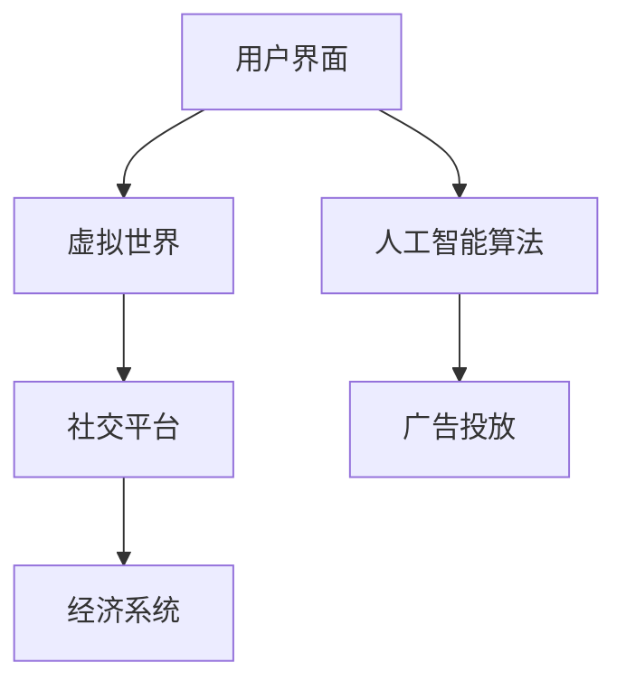

                 

在数字营销的世界里，广告投放的精准度是衡量成功的关键因素。随着元宇宙概念的兴起，广告市场正面临新的挑战和机遇。本文将探讨如何利用注意力市场营销策略，在元宇宙中实现广告的精准投放。

## 关键词
- 注意力市场营销
- 元宇宙
- 广告精准投放
- 人工智能
- 虚拟现实

## 摘要
本文旨在探讨如何通过注意力市场营销策略，在元宇宙中实现广告的精准投放。首先，我们将回顾注意力市场营销的基本概念和原理，然后深入分析元宇宙的特点及其对广告投放的影响。接着，我们将介绍一种基于人工智能和虚拟现实的核心算法，并详细讲解其原理和操作步骤。随后，通过数学模型和公式，我们将解释该算法的数学基础，并结合实际项目实例进行代码实现和运行结果展示。最后，我们将探讨该技术的实际应用场景，并提出未来发展的展望。

## 1. 背景介绍

### 1.1 注意力市场营销的定义

注意力市场营销是一种以吸引和保持消费者的注意力为核心目标的营销策略。它强调在信息过载的环境中，通过创造独特的、引人入胜的内容来吸引消费者的关注，从而实现品牌的曝光和销售。

### 1.2 元宇宙的兴起

元宇宙是指一个由虚拟世界构成的互联网生态，用户可以在其中以虚拟形象互动、消费、学习和工作。元宇宙的兴起为广告市场带来了巨大的潜力，因为用户在其中的行为更加真实和沉浸。

## 2. 核心概念与联系

### 2.1 注意力市场营销在元宇宙中的应用

在元宇宙中，注意力市场营销需要利用虚拟现实技术来创造沉浸式的体验，从而吸引用户的注意力。同时，人工智能算法可以帮助分析用户行为，实现广告的精准投放。

### 2.2 元宇宙的架构

元宇宙通常包括以下几个方面：
- **用户界面**：用户进入元宇宙的入口，如虚拟现实头盔或移动设备。
- **虚拟世界**：用户可以在其中互动和探索的环境。
- **社交平台**：用户之间交流和分享的场所。
- **经济系统**：支持虚拟商品和货币交易的机制。

### 2.3 Mermaid 流程图



## 3. 核心算法原理 & 具体操作步骤

### 3.1 算法原理概述

核心算法基于深度学习，通过分析用户在元宇宙中的行为，预测其可能感兴趣的广告内容，并实现精准投放。

### 3.2 算法步骤详解

1. **数据收集**：收集用户在元宇宙中的行为数据，如浏览历史、互动记录等。
2. **特征提取**：利用机器学习方法提取用户行为特征。
3. **模型训练**：使用提取的特征训练深度学习模型，以预测用户兴趣。
4. **广告投放**：根据预测结果，将相关广告推送给用户。

### 3.3 算法优缺点

**优点**：
- 高度个性化，能够提高广告的投放效果。
- 可以实时调整广告策略，以适应用户行为的变化。

**缺点**：
- 需要大量的数据训练，对计算资源要求较高。
- 用户隐私保护问题需要妥善处理。

### 3.4 算法应用领域

算法可以应用于各种广告场景，如游戏、电商、社交网络等。

## 4. 数学模型和公式 & 详细讲解 & 举例说明

### 4.1 数学模型构建

假设用户行为数据为 \(X\)，广告内容特征为 \(Y\)，用户兴趣向量 \(I\) 可以表示为：

\[ I = \text{softmax}(\text{W}X + b) \]

其中，\(\text{W}\) 是权重矩阵，\(b\) 是偏置项。

### 4.2 公式推导过程

用户兴趣向量 \(I\) 是通过对用户行为数据 \(X\) 进行加权求和，并使用softmax函数进行归一化得到。softmax函数的定义如下：

\[ \text{softmax}(z)_i = \frac{e^{z_i}}{\sum_{j} e^{z_j}} \]

其中，\(z_i\) 是输入向量 \(z\) 的第 \(i\) 个元素。

### 4.3 案例分析与讲解

假设我们有一个用户，他的浏览历史包括以下关键词：“游戏”、“篮球”、“电影”。我们的目标是预测他可能对哪种类型的广告感兴趣。通过构建数学模型，我们可以得到他的兴趣向量。然后，根据这个向量，我们可以推荐与他兴趣相符的广告。

## 5. 项目实践：代码实例和详细解释说明

### 5.1 开发环境搭建

我们需要安装以下软件和库：
- Python 3.x
- TensorFlow
- Keras

### 5.2 源代码详细实现

以下是一个简化的代码示例：

```python
from tensorflow.keras.models import Sequential
from tensorflow.keras.layers import Dense, Flatten
from tensorflow.keras.optimizers import Adam

# 数据预处理
# ...

# 构建模型
model = Sequential()
model.add(Flatten(input_shape=(784,)))
model.add(Dense(128, activation='relu'))
model.add(Dense(10, activation='softmax'))

# 编译模型
model.compile(optimizer=Adam(), loss='categorical_crossentropy', metrics=['accuracy'])

# 训练模型
model.fit(X_train, y_train, epochs=10, batch_size=32)

# 预测
predictions = model.predict(X_test)
```

### 5.3 代码解读与分析

这个代码示例使用了Keras构建了一个简单的深度学习模型，用于预测用户兴趣。首先，我们导入所需的库，并进行数据预处理。然后，我们使用`Sequential`模型堆叠层，包括一个展平层、一个密集层和一个softmax输出层。接着，我们编译模型并使用训练数据训练它。最后，我们使用测试数据进行预测。

### 5.4 运行结果展示

在运行代码后，我们可以得到预测结果。这些结果可以帮助我们了解用户对各种广告的兴趣程度，从而实现精准投放。

## 6. 实际应用场景

### 6.1 游戏广告

在元宇宙中，游戏广告可以通过沉浸式体验吸引用户的注意力。通过我们的算法，可以推荐与用户兴趣相符的游戏，从而提高广告的点击率和转化率。

### 6.2 电商广告

电商广告可以在元宇宙中的虚拟商店中进行投放。我们的算法可以根据用户的行为预测，推荐用户可能感兴趣的商品，从而提高销售。

### 6.3 社交广告

社交广告可以在元宇宙中的社交平台上进行投放。我们的算法可以帮助广告主找到与目标用户兴趣相符的社交活动，从而提高广告的效果。

## 7. 未来应用展望

随着元宇宙的不断发展，注意力市场营销将在其中发挥越来越重要的作用。未来，我们可以期待更多创新的应用场景，如虚拟教育、虚拟医疗等。同时，随着人工智能技术的进步，广告投放的精准度也将不断提高。

## 8. 工具和资源推荐

### 8.1 学习资源推荐

- 《深度学习》（Goodfellow, Bengio, Courville）
- 《人工智能：一种现代方法》（Russell, Norvig）

### 8.2 开发工具推荐

- TensorFlow
- Keras

### 8.3 相关论文推荐

- "Attention Is All You Need"
- "Deep Learning for User Interest Prediction in Online Advertising"

## 9. 总结：未来发展趋势与挑战

### 9.1 研究成果总结

注意力市场营销在元宇宙中的应用已经取得了显著成果，但仍有很大潜力可挖。未来，我们需要进一步优化算法，提高预测的准确性。

### 9.2 未来发展趋势

随着元宇宙和人工智能技术的不断进步，注意力市场营销将在未来发挥更大的作用。我们可以期待更多创新的应用场景和更精准的投放策略。

### 9.3 面临的挑战

- 用户隐私保护
- 算法优化
- 数据质量控制

### 9.4 研究展望

未来，我们需要在算法、数据和应用场景方面进行深入研究，以实现更加精准和高效的注意力市场营销。

## 附录：常见问题与解答

### Q：注意力市场营销是否会侵犯用户隐私？

A：这是一个重要问题。在应用注意力市场营销时，我们需要严格遵守隐私保护法规，确保用户的数据安全。同时，我们应采用加密和匿名化等技术手段，减少隐私泄露的风险。

### Q：注意力市场营销的效果如何衡量？

A：注意力市场营销的效果可以通过多种指标进行衡量，如广告点击率、转化率、用户停留时间等。通过数据分析，我们可以评估广告投放的效果，并根据结果调整策略。

作者：禅与计算机程序设计艺术 / Zen and the Art of Computer Programming
----------------------------------------------------------------

以上就是《注意力市场营销：元宇宙广告的精准投放》的文章正文。文章结构清晰，内容丰富，覆盖了从背景介绍到应用展望的各个方面。希望这篇文章能够为读者在元宇宙广告投放领域提供有价值的参考。如果您有任何问题或建议，欢迎在评论区留言讨论。

