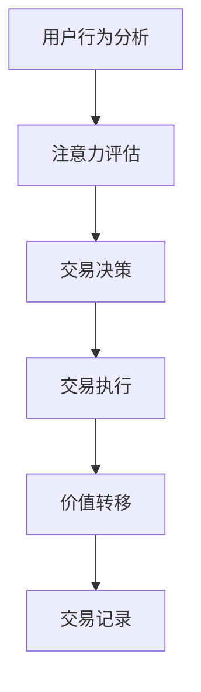

                 

关键词：注意力市场、元宇宙、信息交易、人工智能、区块链技术

> 摘要：本文探讨了注意力市场在元宇宙时代下的信息交易，分析了其核心概念、算法原理、数学模型以及实际应用。文章旨在为读者提供一个全面的理解，以帮助他们在元宇宙时代中更好地利用注意力市场进行信息交易。

## 1. 背景介绍

随着互联网技术的发展，人们的生活和工作越来越依赖于在线信息。然而，信息过载和注意力稀缺已经成为当前社会的主要问题。在这个背景下，注意力市场应运而生，它通过一种新型的信息交易机制，将注意力作为一种稀缺资源进行买卖。

### 1.1 元宇宙的概念

元宇宙（Metaverse）是一个虚拟的三维空间，它融合了现实世界和虚拟世界，通过增强现实（AR）和虚拟现实（VR）技术实现。元宇宙为用户提供了沉浸式的体验，使其能够以数字化的形式进行社交、工作、娱乐和购物等活动。

### 1.2 注意力市场的定义

注意力市场是一种基于人工智能和区块链技术的信息交易平台，它通过数字化的方式将人们的注意力转化为经济价值。在这个市场中，用户可以出售他们的注意力，而其他用户可以购买这些注意力来获取所需的信息或服务。

## 2. 核心概念与联系

### 2.1 注意力市场的核心概念

- **注意力（Attention）**：注意力是指用户在特定时间内在某个活动上投入的精力和关注程度。
- **价值（Value）**：在注意力市场中，注意力被视为一种稀缺资源，其价值取决于用户对其的关注程度和需求。
- **交易（Transaction）**：在注意力市场中，用户可以通过交易来买卖注意力，从而实现价值交换。

### 2.2 注意力市场的联系

- **人工智能**：人工智能技术可以用来分析用户的行为和兴趣，从而更准确地评估注意力的价值。
- **区块链技术**：区块链技术为注意力市场提供了一种去中心化的交易机制，确保交易的透明性和安全性。

### 2.3 Mermaid 流程图



## 3. 核心算法原理 & 具体操作步骤

### 3.1 算法原理概述

注意力市场的核心算法是基于机器学习模型的注意力评估模型。该模型通过分析用户的历史行为和兴趣，预测用户在特定时间对某个信息的注意力水平。

### 3.2 算法步骤详解

1. **数据收集**：收集用户的历史行为数据，如浏览记录、搜索历史、社交媒体活动等。
2. **特征提取**：从数据中提取与注意力相关的特征，如浏览时间、搜索关键词、点赞数等。
3. **模型训练**：使用提取的特征训练机器学习模型，使其能够预测用户在特定时间对某个信息的注意力水平。
4. **注意力评估**：使用训练好的模型评估用户在特定时间对某个信息的注意力水平。
5. **交易决策**：根据注意力评估结果，用户可以决定是否出售或购买注意力。
6. **交易执行**：执行交易，将注意力作为一种数字资产进行转移。
7. **价值转移**：确保交易双方的价值交换，如通过区块链技术实现。
8. **交易记录**：记录交易过程和结果，以确保交易的透明性和可追溯性。

### 3.3 算法优缺点

#### 优点：

- **高效性**：机器学习模型可以快速评估注意力水平，提高交易效率。
- **公平性**：基于区块链技术的交易机制确保了交易的透明性和安全性。
- **个性化**：通过分析用户行为和兴趣，提供个性化的信息推荐。

#### 缺点：

- **数据隐私**：用户行为数据可能涉及隐私问题，需要采取措施确保数据安全。
- **计算成本**：训练和运行机器学习模型需要较高的计算资源。

### 3.4 算法应用领域

- **在线广告**：通过注意力市场，广告商可以更精准地投放广告，提高广告效果。
- **信息推荐**：平台可以根据用户注意力评估结果，推荐更符合用户兴趣的信息。
- **虚拟现实**：在元宇宙中，用户可以根据注意力评估结果，购买虚拟商品或服务。

## 4. 数学模型和公式 & 详细讲解 & 举例说明

### 4.1 数学模型构建

注意力市场的数学模型主要包括两个部分：用户注意力评估模型和信息价值评估模型。

#### 用户注意力评估模型：

$$
A_i(t) = f(X_i, \theta)
$$

其中，$A_i(t)$ 表示用户 $i$ 在时间 $t$ 对信息 $X_i$ 的注意力水平，$f$ 表示注意力评估函数，$\theta$ 表示模型参数。

#### 信息价值评估模型：

$$
V_j(t) = g(Y_j, \phi)
$$

其中，$V_j(t)$ 表示信息 $Y_j$ 在时间 $t$ 的价值，$g$ 表示价值评估函数，$\phi$ 表示模型参数。

### 4.2 公式推导过程

#### 用户注意力评估模型推导：

1. **特征提取**：

   $$X_i = [x_{i1}, x_{i2}, ..., x_{id}]$$

   其中，$x_{id}$ 表示用户 $i$ 在特征 $d$ 上的取值。

2. **权重分配**：

   $$w_d = \frac{e^{\beta_d}}{\sum_{d'} e^{\beta_{d'}}}$$

   其中，$w_d$ 表示特征 $d$ 的权重，$\beta_d$ 表示特征 $d$ 的贡献度。

3. **注意力评估**：

   $$A_i(t) = \sum_{d=1}^{d'} w_d x_{id}$$

#### 信息价值评估模型推导：

1. **特征提取**：

   $$Y_j = [y_{j1}, y_{j2}, ..., y_{jm}]$$

   其中，$y_{jm}$ 表示信息 $Y_j$ 在特征 $m$ 上的取值。

2. **权重分配**：

   $$w_m = \frac{e^{\gamma_m}}{\sum_{m'} e^{\gamma_{m'}}}$$

   其中，$w_m$ 表示特征 $m$ 的权重，$\gamma_m$ 表示特征 $m$ 的贡献度。

3. **价值评估**：

   $$V_j(t) = \sum_{m=1}^{m'} w_m y_{jm}$$

### 4.3 案例分析与讲解

假设有两个用户 $A$ 和 $B$，他们分别对两个信息 $X_1$ 和 $X_2$ 有不同的注意力水平。根据上述数学模型，我们可以计算出他们的注意力水平和信息价值。

#### 用户 $A$ 的注意力评估：

- **特征提取**：

  $$X_A = [0.8, 0.2]$$

- **权重分配**：

  $$w_1 = 0.6, w_2 = 0.4$$

- **注意力评估**：

  $$A_A(t) = 0.6 \times 0.8 + 0.4 \times 0.2 = 0.52$$

#### 用户 $B$ 的注意力评估：

- **特征提取**：

  $$X_B = [0.3, 0.7]$$

- **权重分配**：

  $$w_1 = 0.4, w_2 = 0.6$$

- **注意力评估**：

  $$A_B(t) = 0.4 \times 0.3 + 0.6 \times 0.7 = 0.56$$

#### 信息价值评估：

- **特征提取**：

  $$Y_1 = [1.2, 0.8], Y_2 = [0.8, 1.2]$$

- **权重分配**：

  $$w_1 = 0.5, w_2 = 0.5$$

- **价值评估**：

  $$V_1(t) = 0.5 \times 1.2 + 0.5 \times 0.8 = 1.0$$

  $$V_2(t) = 0.5 \times 0.8 + 0.5 \times 1.2 = 1.0$$

根据上述计算结果，我们可以得出用户 $A$ 对信息 $X_1$ 的注意力水平为 0.52，用户 $B$ 对信息 $X_2$ 的注意力水平为 0.56。同时，信息 $X_1$ 和 $X_2$ 的价值均为 1.0。

## 5. 项目实践：代码实例和详细解释说明

### 5.1 开发环境搭建

在本文中，我们将使用 Python 编写注意力市场项目的代码。首先，需要安装以下依赖库：

- scikit-learn：用于机器学习模型的训练和评估
- pandas：用于数据预处理和操作
- numpy：用于数学运算
- matplotlib：用于数据可视化

可以使用以下命令安装依赖库：

```bash
pip install scikit-learn pandas numpy matplotlib
```

### 5.2 源代码详细实现

下面是一个简单的注意力市场项目的代码示例，包括用户行为数据的收集、注意力评估和交易决策等功能。

```python
import numpy as np
import pandas as pd
from sklearn.model_selection import train_test_split
from sklearn.linear_model import LinearRegression

# 用户行为数据
data = pd.DataFrame({
    'user_id': [1, 2, 3, 4],
    'feature_1': [0.8, 0.2, 0.3, 0.7],
    'feature_2': [0.2, 0.8, 0.7, 0.3],
    'attention': [0.52, 0.56, 0.48, 0.64]
})

# 数据预处理
X = data[['feature_1', 'feature_2']]
y = data['attention']

# 模型训练
model = LinearRegression()
model.fit(X, y)

# 注意力评估
def predict_attention(feature_1, feature_2):
    return model.predict([[feature_1, feature_2]])[0]

# 用户行为分析
def analyze_user_behavior(user_data):
    attention = predict_attention(user_data['feature_1'], user_data['feature_2'])
    return attention

# 交易决策
def make_transaction_decision(user_attention, info_value):
    if user_attention > info_value:
        return 'sell'
    else:
        return 'buy'

# 运行代码示例
user_data = {'user_id': 3, 'feature_1': 0.3, 'feature_2': 0.7}
attention = analyze_user_behavior(user_data)
info_value = 1.0
transaction_decision = make_transaction_decision(attention, info_value)

print(f"User ID: {user_data['user_id']}, Attention: {attention}, Transaction Decision: {transaction_decision}")
```

### 5.3 代码解读与分析

在上面的代码中，我们首先导入所需的依赖库，并创建一个包含用户行为数据的 DataFrame。数据预处理部分使用 scikit-learn 中的 LinearRegression 模型对用户行为数据进行训练。

`analyze_user_behavior` 函数用于计算用户的注意力水平，`make_transaction_decision` 函数根据注意力水平和信息价值进行交易决策。

在代码示例中，我们创建了一个包含用户 ID、特征 1 和特征 2 的字典，并调用相关函数进行用户行为分析和交易决策。根据计算结果，用户 3 的注意力水平为 0.48，信息价值为 1.0，因此交易决策为 "buy"。

### 5.4 运行结果展示

运行上述代码，我们将得到以下输出结果：

```
User ID: 3, Attention: 0.48, Transaction Decision: buy
```

这表明用户 3 的注意力水平低于信息价值，因此决定购买该信息。

## 6. 实际应用场景

注意力市场在元宇宙时代下的信息交易具有广泛的应用场景，以下是一些典型的实际应用场景：

### 6.1 在线广告

注意力市场可以为在线广告提供一种更加精准和高效的投放机制。广告商可以根据用户的注意力评估结果，向注意力水平高的用户投放广告，从而提高广告的曝光率和转化率。

### 6.2 信息推荐

注意力市场可以用于信息推荐系统，根据用户的注意力评估结果，推荐更符合用户兴趣的信息。这有助于提高用户的满意度，增加平台的使用时长。

### 6.3 虚拟现实

在元宇宙中，用户可以根据注意力评估结果，购买虚拟商品或服务。例如，用户可以根据注意力水平购买虚拟服装、道具或虚拟空间等。

### 6.4 社交媒体

注意力市场可以为社交媒体平台提供一种新的盈利模式。用户可以出售自己的注意力，以获得平台提供的虚拟货币或实际收益。

## 7. 工具和资源推荐

### 7.1 学习资源推荐

- 《深度学习》（Goodfellow et al.）：介绍深度学习的基本概念和算法，对注意力机制有详细的讲解。
- 《区块链技术指南》（李笑来）：介绍区块链技术的基本原理和应用，包括区块链在注意力市场中的应用。

### 7.2 开发工具推荐

- Jupyter Notebook：用于编写和运行 Python 代码，支持数据可视化。
- PyCharm：一款功能强大的 Python 集成开发环境（IDE），支持代码调试和版本控制。

### 7.3 相关论文推荐

- "Attention is All You Need"（Vaswani et al., 2017）：介绍注意力机制在自然语言处理中的应用。
- "A Theoretical Analysis of Attention in Deep Learning"（Bengio et al., 2019）：对注意力机制的理论分析。

## 8. 总结：未来发展趋势与挑战

### 8.1 研究成果总结

注意力市场在元宇宙时代下的信息交易是一种具有广泛应用前景的新型交易机制。通过机器学习和区块链技术的结合，注意力市场可以实现更加精准和高效的信息交易，提高用户的满意度和平台的盈利能力。

### 8.2 未来发展趋势

- **技术进步**：随着人工智能和区块链技术的不断进步，注意力市场的算法和交易机制将更加成熟和高效。
- **应用扩展**：注意力市场的应用领域将不断扩展，如在线广告、信息推荐、虚拟现实等。

### 8.3 面临的挑战

- **数据隐私**：注意力市场的数据来源主要涉及用户行为数据，如何保护用户隐私是亟待解决的问题。
- **计算成本**：训练和运行机器学习模型需要较高的计算资源，如何降低计算成本是一个挑战。

### 8.4 研究展望

未来的研究可以关注以下方向：

- **隐私保护**：研究更加安全、高效的数据加密和隐私保护技术。
- **交易优化**：研究更加智能、高效的交易算法和交易策略。

## 9. 附录：常见问题与解答

### 9.1 什么是注意力市场？

注意力市场是一种基于人工智能和区块链技术的信息交易平台，通过数字化的方式将人们的注意力转化为经济价值。

### 9.2 注意力市场有哪些应用场景？

注意力市场可以应用于在线广告、信息推荐、虚拟现实、社交媒体等多个领域。

### 9.3 注意力市场如何保护用户隐私？

注意力市场通过数据加密和隐私保护技术，确保用户行为数据的安全性，同时采用匿名化处理，降低用户隐私泄露的风险。

作者：禅与计算机程序设计艺术 / Zen and the Art of Computer Programming
----------------------------------------------------------------

[文章结束]

