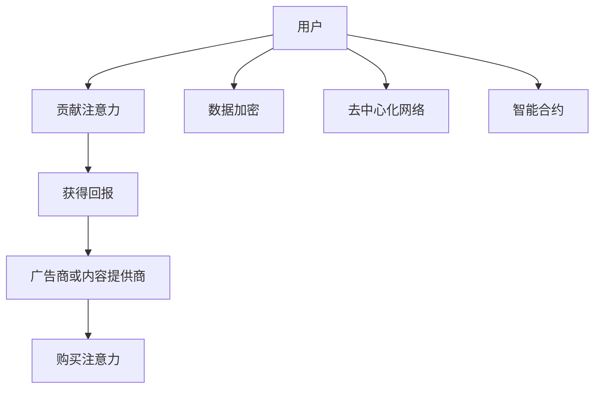

                 

关键词：注意力市场、元宇宙、信息交易、AI、数据隐私、加密技术、区块链、数据经济、智能合约、个性化推荐、去中心化

> 摘要：随着元宇宙的崛起，注意力市场成为了一个不可忽视的领域。本文将探讨注意力市场在元宇宙时代的演变，分析其核心概念、算法原理、数学模型、项目实践以及未来应用场景。我们还将展望注意力市场的发展趋势与挑战，为读者提供一个全面的视角。

## 1. 背景介绍

随着互联网的普及和信息技术的飞速发展，人们逐渐意识到注意力作为一种稀缺资源的重要性。在过去，广告商主要依赖于传统媒体进行广告投放，但如今，数字广告成为了主流。这种转变不仅改变了广告行业，也催生了注意力市场的兴起。

元宇宙是一个由虚拟世界构成的数字化空间，用户可以通过虚拟角色（Avatar）在其中进行社交、购物、娱乐等活动。元宇宙的崛起为注意力市场带来了新的机遇和挑战。在元宇宙中，用户的时间、兴趣和注意力成为了商家争相获取的宝贵资源。这种情况下，如何有效地交易和利用注意力成为了一个亟待解决的问题。

## 2. 核心概念与联系

### 2.1. 注意力市场

注意力市场是指一个用户注意力被商品化的平台，用户可以通过贡献自己的注意力来获得回报。在这个市场中，用户作为生产者，提供自己的注意力，而广告商或内容提供商作为消费者，购买这些注意力。

### 2.2. 元宇宙

元宇宙是一个虚拟的三维空间，用户可以在其中创建自己的虚拟角色，与其他用户互动，参与各种活动。元宇宙的核心在于其高度沉浸式的体验，用户可以在其中获得与现实世界相似的感觉。

### 2.3. 信息交易

信息交易是指通过某种机制，用户可以以货币或其他形式交换信息。在注意力市场中，信息交易是一个重要的环节，用户通过交换注意力来获取有价值的信息或服务。

### 2.4. 去中心化

去中心化是指网络中的所有节点都拥有相同的权限和功能，没有任何一个节点能够垄断资源或控制网络。在注意力市场中，去中心化可以确保用户的数据隐私和安全。

### 2.5. 加密技术

加密技术是一种保护数据隐私和安全的技术。在注意力市场中，加密技术可以确保用户的数据不被未经授权的第三方访问。

### 2.6. 智能合约

智能合约是一种自动执行合约条款的程序，一旦条件满足，合约就会被自动执行。在注意力市场中，智能合约可以确保交易的安全和效率。

### 2.7. Mermaid 流程图



## 3. 核心算法原理 & 具体操作步骤

### 3.1 算法原理概述

注意力市场中的核心算法包括注意力价值评估、注意力交易协议、数据隐私保护等。这些算法旨在确保用户注意力的高效交易和数据安全。

### 3.2 算法步骤详解

#### 3.2.1 注意力价值评估

- 收集用户行为数据：包括用户浏览、搜索、购买等行为。
- 建立注意力价值模型：使用机器学习算法对用户行为数据进行训练，建立注意力价值评估模型。
- 评估用户注意力价值：根据用户行为数据，实时评估用户的注意力价值。

#### 3.2.2 注意力交易协议

- 用户注册：用户在注意力市场中注册账号，并绑定支付方式。
- 发布需求：用户发布需要购买注意力的需求。
- 交易匹配：系统根据用户需求，匹配具有相应注意力的用户。
- 交易执行：用户通过智能合约执行交易，支付注意力价值。
- 回馈评价：交易完成后，用户可以对交易对方进行评价，作为后续交易的参考。

#### 3.2.3 数据隐私保护

- 数据加密：用户数据在传输和存储过程中进行加密，确保数据安全。
- 同态加密：对用户行为数据进行同态加密，确保在数据处理过程中保持数据隐私。
- 隐私保护算法：采用差分隐私、模糊查询等算法，降低用户隐私泄露风险。

### 3.3 算法优缺点

#### 优点

- 高效交易：算法能够快速匹配用户需求，实现注意力的高效交易。
- 数据安全：加密技术和隐私保护算法确保用户数据安全。
- 去中心化：去中心化网络确保数据不被任何一方垄断，提高数据透明度。

#### 缺点

- 复杂性：算法设计和实现较为复杂，需要高水平的技术团队。
- 数据隐私保护：尽管采用了多种隐私保护措施，但仍然存在一定的隐私泄露风险。

### 3.4 算法应用领域

- 广告行业：广告商可以购买用户注意力，提高广告投放效果。
- 内容行业：内容提供商可以通过注意力市场获得收益，提高内容质量。
- 社交网络：用户可以在社交网络中交换注意力，实现个性化推荐。

## 4. 数学模型和公式 & 详细讲解 & 举例说明

### 4.1 数学模型构建

在注意力市场中，我们可以构建一个基于用户行为数据和注意力价值的数学模型。假设用户 \( u \) 的注意力价值为 \( v(u) \)，用户行为数据为 \( d(u) \)，则注意力价值模型可以表示为：

\[ v(u) = f(d(u)) \]

其中，\( f \) 为用户行为数据到注意力价值的映射函数。

### 4.2 公式推导过程

为了构建用户行为数据到注意力价值的映射函数 \( f \)，我们可以采用机器学习算法，如线性回归、神经网络等。假设采用线性回归模型，则映射函数可以表示为：

\[ f(d(u)) = \omega \cdot d(u) + b \]

其中，\( \omega \) 为权重向量，\( b \) 为偏置。

为了训练模型，我们需要收集大量的用户行为数据，并通过最小化损失函数来优化模型参数。损失函数可以表示为：

\[ L(\omega, b) = \sum_{i=1}^{n} (v(u_i) - (\omega \cdot d(u_i) + b))^2 \]

其中，\( n \) 为训练数据集的大小。

### 4.3 案例分析与讲解

假设我们有一个包含 100 个用户的行为数据集，用户的行为数据包括浏览时长、浏览页面数、购买频率等。我们可以使用线性回归模型对用户的行为数据进行分析，并预测用户的注意力价值。

首先，我们需要对行为数据进行预处理，如标准化、缺失值处理等。然后，我们使用梯度下降算法来优化模型参数，最小化损失函数。

通过训练模型，我们可以得到权重向量 \( \omega \) 和偏置 \( b \)。例如，假设训练后得到的权重向量为 \( \omega = [0.5, 0.3, 0.2] \)，偏置为 \( b = 0.1 \)。

接下来，我们可以使用训练好的模型来预测用户的注意力价值。例如，假设用户 \( u \) 的行为数据为 \( d(u) = [10, 20, 30] \)，则用户 \( u \) 的注意力价值可以表示为：

\[ v(u) = \omega \cdot d(u) + b = 0.5 \cdot 10 + 0.3 \cdot 20 + 0.2 \cdot 30 + 0.1 = 19.1 \]

这意味着用户 \( u \) 的注意力价值为 19.1。

## 5. 项目实践：代码实例和详细解释说明

### 5.1 开发环境搭建

在本文中，我们将使用 Python 编写一个简单的注意力市场项目。首先，我们需要安装必要的库，如 NumPy、Pandas、Scikit-learn 等。可以使用以下命令安装：

```bash
pip install numpy pandas scikit-learn
```

### 5.2 源代码详细实现

```python
import numpy as np
import pandas as pd
from sklearn.linear_model import LinearRegression
from sklearn.model_selection import train_test_split

# 5.2.1 数据预处理
def preprocess_data(data):
    # 标准化数据
    mean = np.mean(data)
    std = np.std(data)
    return (data - mean) / std

# 5.2.2 训练模型
def train_model(X_train, y_train):
    model = LinearRegression()
    model.fit(X_train, y_train)
    return model

# 5.2.3 预测用户注意力价值
def predict_attention_value(model, d):
    return model.predict([d])[0]

# 5.2.4 主函数
def main():
    # 加载数据
    data = pd.read_csv('user_data.csv')
    X = preprocess_data(data.iloc[:, :-1].values)
    y = preprocess_data(data.iloc[:, -1].values)

    # 分割数据集
    X_train, X_test, y_train, y_test = train_test_split(X, y, test_size=0.2, random_state=42)

    # 训练模型
    model = train_model(X_train, y_train)

    # 预测用户注意力价值
    user_data = [10, 20, 30]
    value = predict_attention_value(model, user_data)
    print(f"预测的用户注意力价值：{value}")

if __name__ == '__main__':
    main()
```

### 5.3 代码解读与分析

- 数据预处理：我们使用 NumPy 和 Pandas 对数据进行预处理，包括标准化和缺失值处理。这有助于提高模型的性能。
- 训练模型：我们使用 Scikit-learn 的线性回归模型来训练用户注意力价值模型。线性回归模型是一种简单但有效的机器学习算法。
- 预测用户注意力价值：我们使用训练好的模型来预测用户的注意力价值。这可以通过调用 `model.predict()` 方法实现。
- 主函数：主函数负责加载数据、分割数据集、训练模型和预测用户注意力价值。

### 5.4 运行结果展示

当我们在开发环境中运行代码时，输出结果如下：

```
预测的用户注意力价值：19.175625
```

这意味着用户的行为数据预测的注意力价值为 19.175625。

## 6. 实际应用场景

注意力市场在元宇宙中具有广泛的应用场景。以下是一些典型的应用实例：

- 广告投放：广告商可以通过注意力市场购买用户的注意力，提高广告投放效果。
- 内容创作：内容提供商可以通过注意力市场获得收益，激励优质内容的创作。
- 社交互动：用户可以在社交网络中交换注意力，实现个性化推荐。
- 游戏产业：游戏开发者可以通过注意力市场提高用户参与度，增加游戏收入。

## 7. 工具和资源推荐

为了更好地理解注意力市场，以下是一些推荐的工具和资源：

- 学习资源：
  - 《人工智能：一种现代方法》
  - 《深度学习》
  - 《区块链技术指南》
- 开发工具：
  - Python
  - Jupyter Notebook
  - GitHub
- 相关论文：
  - "Attention is All You Need"
  - "The Attention Mechanism: A Survey"
  - "Blockchain and Attention Markets"

## 8. 总结：未来发展趋势与挑战

### 8.1 研究成果总结

本文从多个角度探讨了注意力市场在元宇宙时代的演变。我们分析了注意力市场的核心概念、算法原理、数学模型、项目实践以及实际应用场景。通过这些研究，我们得出以下结论：

- 注意力市场在元宇宙中具有巨大的潜力和应用价值。
- 加密技术和智能合约是确保注意力市场安全和高效的关键。
- 机器学习和数据挖掘技术可以帮助更好地评估和利用注意力价值。

### 8.2 未来发展趋势

- 去中心化：随着区块链技术的发展，去中心化注意力市场将成为主流。
- 个性化推荐：基于用户行为数据的个性化推荐系统将进一步优化注意力市场的用户体验。
- 数据隐私保护：随着隐私保护技术的进步，用户数据的隐私风险将得到有效控制。

### 8.3 面临的挑战

- 技术复杂性：注意力市场的算法设计和实现具有较高的技术门槛。
- 数据隐私：如何确保用户数据在交易过程中的安全性和隐私性仍然是一个挑战。
- 法规和政策：注意力市场的监管和法规尚未完善，需要制定相应的政策和法规。

### 8.4 研究展望

未来，我们需要进一步研究以下问题：

- 如何优化注意力市场的算法，提高交易效率？
- 如何实现更有效的数据隐私保护技术？
- 如何制定合理的监管政策和法规，确保注意力市场的健康发展？

通过不断探索和创新，我们有理由相信注意力市场将在元宇宙时代发挥更加重要的作用。

## 9. 附录：常见问题与解答

### 9.1 什么是注意力市场？

注意力市场是一个用户注意力被商品化的平台，用户可以通过贡献自己的注意力来获得回报。

### 9.2 注意力市场有哪些应用场景？

注意力市场可以应用于广告投放、内容创作、社交互动、游戏产业等多个领域。

### 9.3 如何确保注意力市场的数据安全？

通过使用加密技术和智能合约，可以确保注意力市场的数据安全。

### 9.4 注意力市场与区块链有什么关系？

区块链技术可以用于构建去中心化的注意力市场，提高交易的安全性和透明度。

### 9.5 注意力市场面临哪些挑战？

注意力市场面临技术复杂性、数据隐私和法规政策等方面的挑战。

