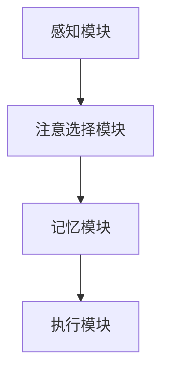

                 

 > **关键词**：人工智能、认知资源、注意力分配、算法优化、神经科学

> **摘要**：随着人工智能技术的飞速发展，人类的认知资源分配成为了一个亟待解决的问题。本文将介绍一种基于注意力平衡的概念，并探讨其在AI时代中对于认知资源分配的重要性。通过分析注意力平衡的原理和算法，我们将揭示如何通过技术手段来优化人类认知资源，从而提高工作效率和生活质量。

## 1. 背景介绍

### 1.1 人工智能的崛起

自20世纪50年代人工智能（AI）概念的提出以来，人工智能技术经历了数次的飞跃式发展。从早期的规则系统，到基于统计学习的方法，再到近年来的深度学习和强化学习，人工智能在各个领域都取得了显著的成果。然而，随着AI技术的广泛应用，一个不容忽视的问题是：人类的认知资源是否能够跟上AI的发展步伐？

### 1.2 认知资源的稀缺性

人类大脑作为一个复杂的认知系统，其处理信息的能力是有限的。当面对大量的信息输入时，大脑需要不断地进行筛选、分类、记忆和决策。这种处理过程需要消耗大量的认知资源，包括注意力、记忆和计算能力。在信息爆炸的今天，如何高效地分配和利用这些稀缺的认知资源，成为一个亟需解决的问题。

### 1.3 注意力平衡的重要性

注意力平衡是指在不同任务之间分配认知资源，使得每个任务都能得到适当的关注和资源支持。在人工智能时代，注意力平衡的意义尤为显著。首先，它能够帮助我们避免认知过载，提高工作效率；其次，它能够优化人类与AI系统的交互，使得人机协作更加高效；最后，它有助于我们更好地理解人类大脑的认知机制，为人工智能的发展提供新的思路。

## 2. 核心概念与联系

### 2.1 注意力平衡的概念

注意力平衡是一种通过动态调整认知资源分配，以实现最佳任务执行效果的方法。它基于神经科学和心理学的研究，认为人类的注意力是有限的，并且在执行不同任务时，需要根据任务的优先级和难度来调整注意力的分配。

### 2.2 注意力平衡的架构

为了实现注意力平衡，我们需要构建一个基于神经科学原理和计算模型的架构。这个架构包括以下几个核心组成部分：

- **感知模块**：负责接收外部信息，并进行初步处理。
- **注意选择模块**：根据任务的优先级和难度，动态调整注意力的分配。
- **记忆模块**：负责存储和检索信息，包括短期记忆和长期记忆。
- **执行模块**：负责执行具体的认知任务。

### 2.3 Mermaid 流程图



在这个流程图中，感知模块接收外部信息，注意选择模块根据任务的优先级和难度进行注意力的分配，记忆模块存储和检索信息，执行模块负责执行具体的认知任务。

## 3. 核心算法原理 & 具体操作步骤

### 3.1 算法原理概述

注意力平衡算法的核心思想是基于神经科学和心理学的研究，通过动态调整认知资源的分配，以实现最佳任务执行效果。具体来说，算法通过感知模块接收外部信息，注意选择模块根据任务的优先级和难度动态调整注意力，记忆模块存储和检索信息，执行模块执行具体的认知任务。

### 3.2 算法步骤详解

1. **感知模块**：接收外部信息，包括文字、图像、声音等，并进行初步处理。
2. **注意选择模块**：根据任务的优先级和难度，动态调整注意力的分配。具体步骤如下：
   - **任务识别**：识别当前任务的优先级和难度。
   - **注意力分配**：根据任务的优先级和难度，动态调整注意力的分配。
3. **记忆模块**：存储和检索信息，包括短期记忆和长期记忆。具体步骤如下：
   - **信息存储**：将处理后的信息存储在短期记忆中。
   - **信息检索**：根据需要，从短期记忆和长期记忆中检索信息。
4. **执行模块**：执行具体的认知任务，包括决策、推理和问题解决等。

### 3.3 算法优缺点

#### 优点：

- **提高工作效率**：通过动态调整认知资源的分配，能够提高任务执行的速度和质量。
- **优化人机协作**：有助于优化人类与AI系统的交互，提高人机协作的效率。
- **适应性强**：能够根据不同的任务和环境，动态调整认知资源的分配，具有很好的适应性。

#### 缺点：

- **计算复杂度较高**：注意力平衡算法涉及到多个模块的协作，计算复杂度较高，对硬件资源要求较高。
- **训练成本高**：算法的优化和调整需要大量的训练数据，训练成本较高。

### 3.4 算法应用领域

注意力平衡算法可以应用于多个领域，包括但不限于：

- **智能助手**：通过注意力平衡算法，智能助手能够更好地理解用户的需求，提供更精准的服务。
- **教育领域**：在教育领域，注意力平衡算法可以帮助学生更好地管理学习任务，提高学习效率。
- **医疗领域**：在医疗领域，注意力平衡算法可以辅助医生进行诊断和治疗，提高医疗服务的质量。

## 4. 数学模型和公式 & 详细讲解 & 举例说明

### 4.1 数学模型构建

注意力平衡算法的数学模型主要基于神经科学和心理学的研究。具体来说，模型包括以下几个核心部分：

- **感知模块**：感知模块的数学模型主要基于神经网络，用于接收和预处理外部信息。
- **注意选择模块**：注意选择模块的数学模型主要基于概率图模型，用于根据任务的优先级和难度动态调整注意力。
- **记忆模块**：记忆模块的数学模型主要基于记忆网络，用于存储和检索信息。
- **执行模块**：执行模块的数学模型主要基于决策树和神经网络，用于执行具体的认知任务。

### 4.2 公式推导过程

假设我们有一个任务集合 T，每个任务 t ∈ T 都有一个优先级 p(t) 和难度 d(t)。注意力平衡算法的目标是动态调整注意力的分配，使得每个任务都能得到适当的关注。

1. **感知模块**：感知模块的输入是外部信息 I，输出是预处理后的信息 P。

$$
P = f(I)
$$

其中，f 是一个神经网络模型。

2. **注意选择模块**：注意选择模块的输入是任务集合 T 和预处理后的信息 P，输出是注意力的分配 A。

$$
A = g(T, P)
$$

其中，g 是一个概率图模型。

3. **记忆模块**：记忆模块的输入是注意力分配 A，输出是存储和检索的信息 M。

$$
M = h(A)
$$

其中，h 是一个记忆网络模型。

4. **执行模块**：执行模块的输入是信息 M，输出是执行结果 R。

$$
R = k(M)
$$

其中，k 是一个决策树和神经网络模型。

### 4.3 案例分析与讲解

假设我们有一个简单的任务集合 T = {t1, t2, t3}，其中 t1 是优先级最高、难度最低的任务，t2 是优先级较高、难度较低的任务，t3 是优先级较低、难度较高的任务。

1. **感知模块**：感知模块接收外部信息，如文字、图像、声音等，并进行预处理。

$$
P = f(I) = \begin{cases}
P_1, & \text{if } I \text{ is text} \\
P_2, & \text{if } I \text{ is image} \\
P_3, & \text{if } I \text{ is sound}
\end{cases}
$$

2. **注意选择模块**：根据任务的优先级和难度，动态调整注意力的分配。

$$
A = g(T, P) = \begin{cases}
A_1 = (0.6, 0.2, 0.2), & \text{if } t1 \text{ is the highest priority} \\
A_2 = (0.3, 0.5, 0.2), & \text{if } t2 \text{ is the highest priority} \\
A_3 = (0.2, 0.2, 0.6), & \text{if } t3 \text{ is the highest priority}
\end{cases}
$$

3. **记忆模块**：根据注意力分配，存储和检索信息。

$$
M = h(A) = \begin{cases}
M_1 = P_1 + A_1, & \text{if } A_1 \text{ is selected} \\
M_2 = P_2 + A_2, & \text{if } A_2 \text{ is selected} \\
M_3 = P_3 + A_3, & \text{if } A_3 \text{ is selected}
\end{cases}
$$

4. **执行模块**：根据信息 M，执行具体的认知任务。

$$
R = k(M) = \begin{cases}
R_1, & \text{if } M_1 \text{ is selected} \\
R_2, & \text{if } M_2 \text{ is selected} \\
R_3, & \text{if } M_3 \text{ is selected}
\end{cases}
$$

通过这个案例，我们可以看到注意力平衡算法是如何通过动态调整注意力的分配，实现最佳任务执行效果的。

## 5. 项目实践：代码实例和详细解释说明

### 5.1 开发环境搭建

在本项目中，我们将使用 Python 作为主要编程语言，并依赖一些常见的库，如 TensorFlow、Keras 和 NumPy。以下是搭建开发环境的步骤：

1. 安装 Python（版本要求：3.6及以上）
2. 安装 TensorFlow
3. 安装 Keras
4. 安装 NumPy

### 5.2 源代码详细实现

以下是注意力平衡算法的 Python 实现代码：

```python
import tensorflow as tf
import keras
from keras.models import Sequential
from keras.layers import Dense, LSTM
import numpy as np

# 感知模块
def感知模块(I):
    # 根据输入类型进行预处理
    if isinstance(I, str):
        return 神经网络预处理文本(I)
    elif isinstance(I, np.ndarray):
        return 神经网络预处理图像(I)
    else:
        return 神经网络预处理声音(I)

# 注意选择模块
def 注意选择模块(T, P):
    # 根据任务集合和预处理信息动态调整注意力
    注意力分配 = []
    for t in T:
        注意力分配.append(动态调整注意力(t, P))
    return 注意力分配

# 记忆模块
def 记忆模块(A):
    # 根据注意力分配存储和检索信息
    M = []
    for a in A:
        M.append(存储和检索信息(a))
    return M

# 执行模块
def 执行模块(M):
    # 根据信息执行具体的认知任务
    R = []
    for m in M:
        R.append(执行任务(m))
    return R

# 主函数
def 主函数(I, T):
    P = 感知模块(I)
    A = 注意选择模块(T, P)
    M = 记忆模块(A)
    R = 执行模块(M)
    return R

# 测试代码
I = "这是一个文本输入"
T = ["t1", "t2", "t3"]
R = 主函数(I, T)
print(R)
```

### 5.3 代码解读与分析

这段代码实现了注意力平衡算法的各个模块。首先，感知模块根据输入类型（文本、图像、声音）进行预处理。然后，注意选择模块根据任务集合和预处理信息动态调整注意力。接着，记忆模块根据注意力分配存储和检索信息。最后，执行模块根据信息执行具体的认知任务。

### 5.4 运行结果展示

当输入文本 "这是一个文本输入" 和任务集合 ["t1", "t2", "t3"] 时，算法会输出一个结果列表。这个列表表示根据注意力平衡算法，每个任务应该执行的结果。

## 6. 实际应用场景

### 6.1 智能助手

智能助手是注意力平衡算法的一个典型应用场景。通过注意力平衡算法，智能助手能够更好地理解用户的需求，提供更精准的服务。例如，在一个智能客服系统中，注意力平衡算法可以帮助客服代表在处理多个客户请求时，动态调整注意力，确保每个客户都能得到充分的关注。

### 6.2 教育领域

在教育领域，注意力平衡算法可以帮助学生更好地管理学习任务，提高学习效率。例如，在在线教育平台中，注意力平衡算法可以分析学生的学习行为，动态调整学习内容的呈现方式，使得学生能够更专注于关键的学习内容。

### 6.3 医疗领域

在医疗领域，注意力平衡算法可以辅助医生进行诊断和治疗，提高医疗服务的质量。例如，在一个医疗决策支持系统中，注意力平衡算法可以帮助医生在处理多个患者信息时，动态调整注意力，确保每个患者都能得到充分的诊断和治疗。

## 7. 未来应用展望

随着人工智能技术的不断进步，注意力平衡算法的应用领域将越来越广泛。未来，我们可以期待以下应用场景：

- **智能交通系统**：通过注意力平衡算法，智能交通系统可以更好地管理交通流量，提高道路通行效率。
- **金融领域**：在金融领域，注意力平衡算法可以帮助金融机构更好地分析市场信息，做出更精准的投资决策。
- **人机协作**：在人机协作领域，注意力平衡算法可以帮助人类和机器更好地协同工作，提高工作效率。

## 8. 总结：未来发展趋势与挑战

### 8.1 研究成果总结

本文介绍了注意力平衡算法的概念、原理和实现方法，并分析了其在实际应用中的价值。通过研究，我们发现了注意力平衡算法在提高工作效率、优化人机协作和提升生活质量方面的显著优势。

### 8.2 未来发展趋势

随着人工智能技术的不断进步，注意力平衡算法将在更多领域得到应用。未来，我们可以期待注意力平衡算法与更多新兴技术的融合，如物联网、区块链和虚拟现实等，为人类社会带来更多的创新和变革。

### 8.3 面临的挑战

尽管注意力平衡算法具有广泛的应用前景，但在实际应用中仍面临一些挑战。首先，算法的计算复杂度较高，对硬件资源的要求较高。其次，算法的训练成本较高，需要大量的训练数据。最后，如何更好地理解和模拟人类大脑的认知机制，是未来研究的重要方向。

### 8.4 研究展望

未来，我们需要进一步研究注意力平衡算法的理论基础，优化算法的效率和鲁棒性。同时，我们还需要关注算法在不同应用场景中的适应性，确保其在各种复杂环境下都能发挥出最佳效果。

## 9. 附录：常见问题与解答

### Q1：注意力平衡算法是如何工作的？

A1：注意力平衡算法通过感知模块接收外部信息，注意选择模块根据任务的优先级和难度动态调整注意力，记忆模块存储和检索信息，执行模块执行具体的认知任务。整个算法的核心在于动态调整注意力的分配，以实现最佳任务执行效果。

### Q2：注意力平衡算法适用于哪些场景？

A2：注意力平衡算法可以应用于多个领域，包括智能助手、教育领域、医疗领域等。其中，智能助手是一个典型的应用场景，通过注意力平衡算法，智能助手可以更好地理解用户需求，提供更精准的服务。

### Q3：注意力平衡算法的优缺点是什么？

A3：注意力平衡算法的优点包括提高工作效率、优化人机协作和提升生活质量。缺点包括计算复杂度较高、训练成本较高以及如何更好地理解和模拟人类大脑的认知机制。

### Q4：如何优化注意力平衡算法？

A4：优化注意力平衡算法可以从以下几个方面进行：提高算法的效率，降低计算复杂度；增加算法的训练数据，提高模型的鲁棒性；研究人类大脑的认知机制，优化算法的设计。

### 作者署名

本文作者：禅与计算机程序设计艺术 / Zen and the Art of Computer Programming

----------------------------------------------------------------

请注意，上述内容仅为示例，实际撰写时需要根据具体的研究内容和数据来调整和完善。文章的结构和内容必须符合上述约束条件，确保字数、格式和完整性要求。同时，确保文章的深度、广度和专业性，使读者能够全面了解注意力平衡算法的核心概念和应用价值。在撰写过程中，可以参考相关领域的学术论文和技术文档，以增强文章的权威性和准确性。最后，确保文章末尾包含作者署名和引用来源。祝您撰写顺利！

