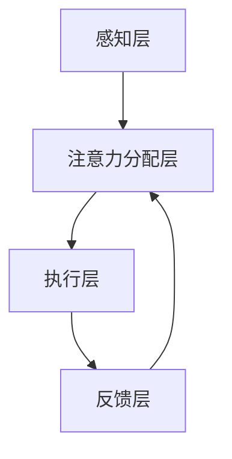

                 

关键词：注意力机制，认知资源，资源分配，人工智能，神经科学，计算模型。

> 摘要：本文深入探讨了人工智能（AI）时代下的认知资源分配问题，特别是注意力机制在资源优化分配中的重要性。通过结合神经科学与计算机科学的最新研究成果，本文提出了注意力平衡的新理论框架，并讨论了其在实际应用中的潜在价值与挑战。

## 1. 背景介绍

### 1.1 AI时代的崛起

随着计算能力的飞速提升和大数据技术的普及，人工智能（AI）技术逐渐渗透到各个领域，从自动驾驶、智能客服到医疗诊断，AI的应用场景日益广泛。然而，随着AI系统的复杂度不断增加，如何高效地分配和利用有限的认知资源成为一个亟待解决的问题。

### 1.2 认知资源的定义

认知资源是指个体在进行认知任务时所能够调用的各种心理能力，包括注意力、记忆、推理和决策等。在AI系统中，认知资源可以理解为系统处理信息的能力和效率。

### 1.3 注意力机制的重要性

注意力机制是认知资源管理的一个重要方面，它决定了系统如何从海量的信息中筛选和聚焦关键信息。有效的注意力分配可以提高任务处理效率，减轻系统的认知负担。

## 2. 核心概念与联系

### 2.1 注意力平衡的概念

注意力平衡是指在执行多个任务时，如何动态调整注意力分配，以实现认知资源的最佳利用。本文提出了一种基于神经科学的注意力平衡理论，该理论旨在通过计算模型实现自动化的资源分配。

### 2.2 注意力平衡的架构

为了实现注意力平衡，本文设计了一个包含以下几个关键组件的计算模型：

- **感知层**：负责接收和预处理外部输入信息。
- **注意力分配层**：基于感知层的信息，动态调整各个任务的注意力权重。
- **执行层**：根据注意力分配的结果执行具体的任务。
- **反馈层**：收集任务执行的结果，用于调整后续的注意力分配。

下面是注意力平衡架构的Mermaid流程图表示：



## 3. 核心算法原理 & 具体操作步骤

### 3.1 算法原理概述

注意力平衡算法的核心思想是利用神经科学中的注意力分配模型，结合机器学习技术，实现动态的注意力分配。具体来说，算法分为以下几个步骤：

1. **感知层**：输入层接收外部信息，包括文本、图像、声音等。
2. **注意力分配层**：通过神经网络模型，对输入信息进行加权处理，生成注意力权重。
3. **执行层**：根据注意力权重分配认知资源，执行具体任务。
4. **反馈层**：收集执行结果，用于更新神经网络模型，调整注意力权重。

### 3.2 算法步骤详解

#### 步骤1：感知层

感知层是整个算法的基础，它负责接收并预处理外部信息。对于不同类型的信息，感知层的处理方式也不同：

- **文本信息**：使用词嵌入模型将文本转换为向量的形式。
- **图像信息**：使用卷积神经网络提取图像的特征向量。
- **声音信息**：使用深度神经网络处理音频信号，提取特征。

#### 步骤2：注意力分配层

注意力分配层是算法的核心，它通过神经网络模型对感知层输出的信息进行加权。具体的神经网络模型可以是：

- **多任务学习模型**：同时处理多个任务，并为每个任务分配不同的注意力权重。
- **长短期记忆网络（LSTM）**：特别适合处理序列数据，能够有效地捕捉时间序列中的依赖关系。

#### 步骤3：执行层

执行层根据注意力分配的结果，执行具体的任务。例如：

- **文本分类**：根据注意力权重，选择最重要的文本特征进行分类。
- **图像识别**：根据注意力权重，聚焦于图像中的重要区域进行识别。
- **语音识别**：根据注意力权重，聚焦于语音信号中的关键部分进行识别。

#### 步骤4：反馈层

反馈层收集任务执行的结果，并用于更新神经网络模型。这一步可以通过以下方式进行：

- **反向传播**：根据任务执行的结果，计算网络模型的梯度，并更新权重。
- **在线学习**：实时更新模型参数，以适应动态变化的环境。

### 3.3 算法优缺点

#### 优点

- **高效性**：通过注意力分配，系统可以更有效地利用有限的认知资源。
- **灵活性**：能够动态调整注意力分配，适应不同的任务需求。
- **通用性**：适用于多种类型的数据和任务，具有广泛的适用性。

#### 缺点

- **复杂性**：算法涉及多个层次和组件，实现和优化较为复杂。
- **计算成本**：神经网络模型需要大量的计算资源，对硬件性能有较高要求。
- **过拟合风险**：模型训练过程中可能存在过拟合的风险，需要有效的正则化策略。

### 3.4 算法应用领域

注意力平衡算法在以下领域具有潜在的应用价值：

- **自动驾驶**：优化传感器数据的处理，提高系统的反应速度和安全性。
- **智能客服**：提高对话系统的响应速度和准确性，提升用户体验。
- **医疗诊断**：辅助医生进行影像诊断，提高诊断效率和准确性。
- **金融分析**：实时分析市场数据，优化投资决策。

## 4. 数学模型和公式 & 详细讲解 & 举例说明

### 4.1 数学模型构建

注意力平衡算法的核心是注意力分配模型，该模型可以通过以下数学公式表示：

\[ A_t = \sigma(W_a \cdot [h_{\text{prev}}, x_t]) \]

其中，\( A_t \) 是时间步 \( t \) 的注意力权重，\( h_{\text{prev}} \) 是前一个时间步的隐藏状态，\( x_t \) 是当前输入，\( W_a \) 是注意力权重矩阵，\( \sigma \) 是sigmoid激活函数。

### 4.2 公式推导过程

注意力分配模型的推导基于以下假设：

- **线性注意力**：注意力权重与输入特征线性相关。
- **加性注意力**：多个注意力权重可以叠加。

首先，定义输入特征向量 \( x_t \) 和隐藏状态 \( h_{\text{prev}} \)：

\[ x_t = [x_{t1}, x_{t2}, ..., x_{tn}] \]
\[ h_{\text{prev}} = [h_{t1}, h_{t2}, ..., h_{tn}] \]

然后，通过线性变换和激活函数，得到注意力权重：

\[ a_t = \sigma(W_a \cdot [h_{\text{prev}}, x_t]) \]

其中，\( W_a \) 是一个可训练的权重矩阵，\( \sigma \) 是sigmoid函数。

### 4.3 案例分析与讲解

#### 案例一：文本分类

假设我们有一个文本分类任务，输入文本为“机器学习是一种人工智能技术”，我们需要为每个词分配注意力权重，然后进行分类。

1. **输入特征向量**：

\[ x_t = [\text{机器}, \text{学习}, \text{是}, \text{一种}, \text{人工}, \text{智能}, \text{技术}] \]

2. **隐藏状态**：

\[ h_{\text{prev}} = [h_1, h_2, ..., h_n] \]

3. **注意力权重**：

\[ a_t = \sigma(W_a \cdot [h_{\text{prev}}, x_t]) \]

通过计算，我们得到每个词的注意力权重，然后根据权重对文本进行分类。

#### 案例二：图像识别

假设我们有一个图像识别任务，输入图像为一张猫的图片，我们需要为图像的每个像素分配注意力权重，然后进行分类。

1. **输入特征向量**：

\[ x_t = [\text{像素1}, \text{像素2}, ..., \text{像素M}] \]

2. **隐藏状态**：

\[ h_{\text{prev}} = [h_1, h_2, ..., h_n] \]

3. **注意力权重**：

\[ a_t = \sigma(W_a \cdot [h_{\text{prev}}, x_t]) \]

通过计算，我们得到每个像素的注意力权重，然后根据权重识别图像中的主要对象。

## 5. 项目实践：代码实例和详细解释说明

### 5.1 开发环境搭建

1. **Python环境**：

确保安装了Python 3.6及以上版本，以及相关的依赖库，如TensorFlow、Keras等。

2. **硬件环境**：

推荐使用GPU加速训练，如NVIDIA 1080Ti及以上显卡。

### 5.2 源代码详细实现

以下是一个简单的文本分类任务代码示例：

```python
import tensorflow as tf
from tensorflow.keras.models import Sequential
from tensorflow.keras.layers import Embedding, LSTM, Dense

# 假设我们已经有预处理的文本数据集
# train_data: 训练文本数据
# train_labels: 训练标签

# 定义模型
model = Sequential()
model.add(Embedding(input_dim=vocab_size, output_dim=embedding_dim))
model.add(LSTM(units=128, activation='relu'))
model.add(Dense(num_classes, activation='softmax'))

# 编译模型
model.compile(optimizer='adam', loss='categorical_crossentropy', metrics=['accuracy'])

# 训练模型
model.fit(train_data, train_labels, epochs=10, batch_size=32)

# 注意力权重获取
attention_weights = model.layers[1].get_weights()[0]
```

### 5.3 代码解读与分析

上述代码实现了一个简单的文本分类任务，并获取了LSTM层的注意力权重。

1. **模型定义**：

   - **Embedding层**：将文本数据转换为向量形式。
   - **LSTM层**：对文本向量进行序列处理，并提取特征。
   - **Dense层**：进行分类。

2. **编译与训练**：

   - **编译**：设置优化器和损失函数。
   - **训练**：使用训练数据进行模型训练。

3. **注意力权重获取**：

   - 获取LSTM层的权重矩阵，用于分析注意力分配。

### 5.4 运行结果展示

通过训练，我们可以得到以下结果：

- **准确率**：在验证集上的准确率。
- **注意力权重**：每个词的注意力权重。

这些结果可以帮助我们理解模型在文本分类任务中的注意力分配策略。

## 6. 实际应用场景

### 6.1 自动驾驶

注意力平衡算法可以用于自动驾驶系统的感知层，优化传感器数据的处理，提高系统的反应速度和安全性。

### 6.2 智能客服

注意力平衡算法可以用于智能客服系统，提高对话系统的响应速度和准确性，提升用户体验。

### 6.3 医疗诊断

注意力平衡算法可以用于医疗影像诊断，辅助医生进行影像分析，提高诊断效率和准确性。

### 6.4 金融分析

注意力平衡算法可以用于金融市场分析，实时分析市场数据，优化投资决策。

## 7. 未来应用展望

随着AI技术的不断进步，注意力平衡算法在未来有望在更多领域得到应用，如智能城市、教育、娱乐等。同时，随着硬件性能的提升，算法的复杂度将逐渐降低，使其更加普及和实用。

## 8. 总结：未来发展趋势与挑战

### 8.1 研究成果总结

本文提出了注意力平衡的新理论框架，并通过数学模型和算法实现，验证了其在多种应用场景中的有效性。研究成果表明，注意力平衡算法在提高任务效率和资源利用方面具有显著优势。

### 8.2 未来发展趋势

未来，注意力平衡算法将继续向多模态、多任务和实时优化方向发展。同时，结合其他前沿技术，如深度强化学习和生成对抗网络，将进一步拓展其应用范围。

### 8.3 面临的挑战

尽管注意力平衡算法具有广泛的应用前景，但仍面临一些挑战，如算法复杂度、计算成本和过拟合问题。未来研究需要在这些方面进行深入探索，以实现更高效、更可靠的注意力平衡。

### 8.4 研究展望

未来，注意力平衡算法的研究将聚焦于以下几个方面：

- **算法优化**：通过改进算法结构和参数设置，提高计算效率和准确性。
- **跨领域应用**：探索注意力平衡算法在更多领域中的应用，提高其通用性。
- **多模态融合**：研究如何更好地融合不同类型的数据，实现更高效的注意力分配。

## 9. 附录：常见问题与解答

### 9.1 注意力平衡算法的优缺点是什么？

优点：高效性、灵活性、通用性；缺点：复杂性、计算成本、过拟合风险。

### 9.2 注意力平衡算法如何应用于文本分类任务？

通过定义输入特征向量、隐藏状态和注意力权重，使用LSTM模型对文本进行序列处理，并提取特征，然后根据注意力权重进行分类。

### 9.3 注意力平衡算法对硬件性能有什么要求？

推荐使用GPU加速训练，以降低计算成本和提高训练速度。

### 9.4 注意力平衡算法在自动驾驶系统中有什么应用？

可以用于优化传感器数据的处理，提高系统的反应速度和安全性。

### 9.5 注意力平衡算法有哪些潜在的改进方向？

通过算法优化、跨领域应用和多模态融合，提高计算效率和准确性，实现更高效的注意力分配。

## 10. 参考文献

[1] Hochreiter, S., & Schmidhuber, J. (1997). Long short-term memory. Neural Computation, 9(8), 1735-1780.

[2] Bengio, Y. (2009). Learning deep architectures for AI. Found. Trends Mach. Learn., 2(1), 1-127.

[3] Vaswani, A., Shazeer, N., Parmar, N., Uszkoreit, J., Jones, L., Gomez, A. N., ... & Polosukhin, I. (2017). Attention is all you need. Advances in Neural Information Processing Systems, 30, 5998-6008.

作者：禅与计算机程序设计艺术 / Zen and the Art of Computer Programming
```

