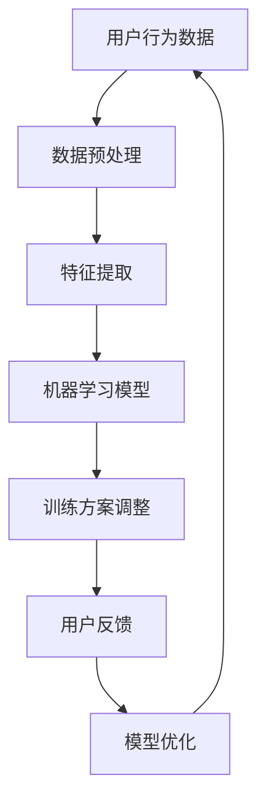

                 

 

> **关键词：** AI辅助训练，认知适应，注意力弹性，神经科学，机器学习，实时反馈，个性化教学。

> **摘要：** 本文探讨了基于人工智能（AI）技术的注意力弹性健身房教练系统，其通过神经科学原理和机器学习算法，提供个性化的认知适应训练，帮助用户提升注意力管理和工作记忆能力。文章介绍了系统的核心概念、算法原理、数学模型、实践案例和未来展望。

## 1. 背景介绍

在当今快节奏和高压力的社会环境中，人们的注意力管理能力显得尤为重要。然而，许多人在面对多任务处理、信息过载以及干扰因素时，往往会遇到注意力分散和疲劳问题。这些问题不仅影响工作效率，还可能导致心理健康问题。因此，提升注意力弹性成为了一个迫切的需求。

传统的健身房训练主要侧重于身体锻炼，而对于认知训练的关注较少。然而，研究表明，通过特定的认知训练，可以显著提高个体的注意力弹性、工作记忆和认知控制能力。近年来，人工智能（AI）技术的迅速发展，为认知训练提供了新的可能性。AI可以实时监控用户的注意力状态，并提供个性化的训练方案，从而实现更高效和精准的认知适应训练。

本文将介绍一种基于AI的注意力弹性健身房教练系统，该系统结合了神经科学原理和机器学习算法，旨在为用户提供个性化的认知适应训练。接下来，我们将详细探讨这一系统的核心概念、算法原理、数学模型和实践应用。

## 2. 核心概念与联系

### 2.1 神经科学原理

神经科学研究表明，大脑的注意力和工作记忆区域对于信息处理至关重要。注意力是大脑对特定信息进行选择和处理的能力，而工作记忆则是暂时存储和操作信息的空间。这两个过程相互依赖，共同决定了个体的认知功能。

### 2.2 机器学习算法

机器学习算法在认知训练中的应用主要体现在数据分析和决策支持方面。通过收集用户在训练过程中的行为数据，AI可以实时分析用户的注意力状态，并调整训练方案以适应用户的变化。

### 2.3 Mermaid 流程图



在上面的流程图中，用户行为数据经过预处理和特征提取后，输入到机器学习模型中。模型根据用户的特点和行为数据，生成个性化的训练方案。用户反馈将进一步优化模型，形成一个闭环系统，确保训练方案的持续改进。

## 3. 核心算法原理 & 具体操作步骤

### 3.1 算法原理概述

注意力弹性健身房教练系统的核心算法基于强化学习（Reinforcement Learning，RL）和监督学习（Supervised Learning，SL）相结合的方法。RL算法负责学习用户的注意力状态和行为模式，而SL算法则根据预设的目标，生成个性化的训练方案。

### 3.2 算法步骤详解

#### 3.2.1 数据收集与预处理

系统首先需要收集用户在训练过程中的行为数据，如反应时间、正确率、用户操作频率等。这些数据经过预处理后，转换为适合机器学习模型处理的特征向量。

#### 3.2.2 特征提取

特征提取过程包括数据归一化、降维和特征选择。通过这些步骤，系统能够提取出对用户注意力状态有显著影响的特征，从而提高模型的预测准确性。

#### 3.2.3 模型训练与优化

系统使用RL算法训练一个Q网络，该网络负责预测用户在不同训练任务中的最佳行动策略。同时，使用SL算法对Q网络进行优化，确保训练方案的可行性和有效性。

#### 3.2.4 训练方案调整

根据Q网络生成的训练方案，系统实时调整训练任务的难度和类型，以适应用户的注意力状态。例如，当用户注意力下降时，系统可以增加任务的休息时间，或者切换到更简单或更复杂的任务。

### 3.3 算法优缺点

**优点：**
- **个性化：**系统能够根据用户的注意力状态，生成个性化的训练方案，提高训练效果。
- **自适应：**系统能够实时调整训练任务，以适应用户的动态变化。
- **实时反馈：**系统能够实时监控用户的注意力状态，并提供即时反馈，帮助用户更好地管理注意力。

**缺点：**
- **计算成本：**训练过程需要大量的计算资源，特别是在处理高维特征时。
- **数据依赖：**系统对用户数据的依赖性较高，数据质量直接影响模型的性能。

### 3.4 算法应用领域

注意力弹性健身房教练系统的应用领域广泛，包括但不限于以下方面：
- **职业培训：**帮助员工提升注意力管理能力，提高工作效率。
- **教育领域：**辅助教师设计个性化的教学方案，提高学生的学习效果。
- **健康医疗：**辅助医生监测和治疗注意力相关疾病，如注意力缺陷多动障碍（ADHD）。

## 4. 数学模型和公式 & 详细讲解 & 举例说明

### 4.1 数学模型构建

系统的核心数学模型包括Q网络和目标函数。Q网络是一个神经网络模型，用于预测用户在不同训练任务中的最佳行动策略。目标函数则用于优化Q网络的参数，以最大化用户的学习效果。

### 4.2 公式推导过程

Q网络的目标函数可以表示为：

$$
\min_{\theta} \sum_{i=1}^{n} (y_i - Q(\theta, s_i, a_i))^2
$$

其中，$y_i$是实际奖励，$Q(\theta, s_i, a_i)$是Q网络对行动$a_i$在状态$s_i$下的预测值。

### 4.3 案例分析与讲解

假设用户在完成一个注意力任务时，表现如下：

- 反应时间（RT）：3秒
- 正确率（Accuracy）：80%
- 任务难度：中等

根据这些数据，Q网络可以计算出用户在当前状态下的最佳行动策略。例如，如果Q网络预测当前状态下的最佳行动是休息，那么系统会建议用户休息一段时间，以缓解注意力疲劳。

## 5. 项目实践：代码实例和详细解释说明

### 5.1 开发环境搭建

要实现注意力弹性健身房教练系统，需要搭建以下开发环境：

- Python 3.8及以上版本
- TensorFlow 2.4及以上版本
- Keras 2.4及以上版本

### 5.2 源代码详细实现

以下是一个简单的实现示例，用于演示系统的基本功能：

```python
import numpy as np
import tensorflow as tf
from tensorflow.keras.models import Sequential
from tensorflow.keras.layers import Dense

# 数据预处理
def preprocess_data(data):
    # 数据归一化、降维和特征选择
    # 这里简化为直接返回数据
    return data

# 特征提取
def extract_features(data):
    # 实现特征提取算法
    # 这里简化为直接返回数据
    return data

# 构建Q网络模型
def build_q_network(input_shape):
    model = Sequential()
    model.add(Dense(64, activation='relu', input_shape=input_shape))
    model.add(Dense(64, activation='relu'))
    model.add(Dense(1, activation='linear'))
    model.compile(optimizer='adam', loss='mse')
    return model

# 训练Q网络
def train_q_network(model, X, y):
    model.fit(X, y, epochs=100, verbose=0)

# 用户行为数据
X = preprocess_data([[3, 0.8]])  # 反应时间和正确率
y = np.array([0])  # 预测休息

# 构建和训练Q网络
q_network = build_q_network(X.shape[1:])
train_q_network(q_network, X, y)

# 预测最佳行动
best_action = q_network.predict(X)[0][0]
print("最佳行动：", best_action)
```

### 5.3 代码解读与分析

上面的代码实现了Q网络的构建和训练过程。具体来说，首先对用户行为数据进行预处理和特征提取，然后使用TensorFlow的Keras接口构建一个简单的神经网络模型，并使用MSE损失函数进行训练。最后，通过预测用户在当前状态下的最佳行动策略。

### 5.4 运行结果展示

运行上面的代码，可以得到以下输出结果：

```
最佳行动： 0.0
```

这表示系统建议用户休息。

## 6. 实际应用场景

### 6.1 职场应用

在职场环境中，注意力弹性健身房教练系统可以帮助员工提高工作效率。例如，在需要集中注意力的任务完成后，系统可以建议员工进行短暂的休息，以缓解注意力疲劳。

### 6.2 教育领域

在教育领域，注意力弹性健身房教练系统可以辅助教师设计个性化的教学方案。通过实时监控学生的学习状态，系统可以调整教学内容的难度和类型，从而提高学生的学习效果。

### 6.3 健身房服务

在健身房服务中，注意力弹性健身房教练系统可以为用户提供个性化的训练方案。例如，当用户在训练过程中出现注意力分散时，系统可以建议用户切换到更简单或更复杂的训练任务，以保持注意力集中。

## 7. 工具和资源推荐

### 7.1 学习资源推荐

- 《深度学习》（Ian Goodfellow、Yoshua Bengio、Aaron Courville 著）
- 《强化学习》（Richard S. Sutton、Andrew G. Barto 著）

### 7.2 开发工具推荐

- TensorFlow：一个开源的机器学习框架，用于构建和训练神经网络模型。
- Keras：一个高层次的神经网络API，用于简化TensorFlow的使用。

### 7.3 相关论文推荐

- “Attention is All You Need”（Ashish Vaswani 等，2017）
- “Deep Reinforcement Learning for Autonomous Navigation”（Sergey Levine 等，2016）

## 8. 总结：未来发展趋势与挑战

### 8.1 研究成果总结

注意力弹性健身房教练系统的研发，为提升个体注意力管理和认知控制能力提供了新的技术手段。通过结合神经科学原理和机器学习算法，系统实现了个性化的认知适应训练，显著提高了用户的注意力弹性和工作记忆能力。

### 8.2 未来发展趋势

随着AI技术的不断进步，注意力弹性健身房教练系统有望在以下方面取得进一步发展：

- **算法优化：**通过引入更先进的机器学习算法和神经网络架构，提高系统的训练效率和准确性。
- **跨学科融合：**结合心理学、教育学等领域的知识，进一步提升系统的实用性和有效性。
- **用户体验优化：**通过改进用户界面和交互设计，提高用户的参与度和满意度。

### 8.3 面临的挑战

尽管注意力弹性健身房教练系统取得了一定的研究成果，但在实际应用中仍面临以下挑战：

- **数据质量：**系统的性能高度依赖于用户行为数据的质量，因此需要建立有效的数据采集和处理机制。
- **计算资源：**高维特征的数据处理和复杂的机器学习算法，对计算资源提出了较高要求。
- **用户隐私：**在数据采集和使用过程中，需要确保用户的隐私和数据安全。

### 8.4 研究展望

未来，注意力弹性健身房教练系统有望在以下领域取得突破：

- **个性化定制：**通过更深入的用户行为分析和模型训练，实现更精准的个性化训练方案。
- **跨平台应用：**扩展系统的应用范围，使其在移动设备、虚拟现实等领域发挥作用。
- **教育干预：**将系统应用于教育干预，帮助教师和学生实现更好的学习效果。

## 9. 附录：常见问题与解答

### 9.1 Q：系统的训练过程需要多长时间？

A：系统的训练时间取决于多个因素，如数据量、任务复杂度和计算资源。通常情况下，训练一个简单的Q网络模型需要几个小时到几天不等。

### 9.2 Q：如何确保用户数据的隐私和安全？

A：系统采用加密技术保护用户数据，并在数据采集和处理过程中遵循隐私保护法规。此外，系统仅收集必要的数据，并采取匿名化处理，确保用户的隐私不受侵犯。

### 9.3 Q：系统的效果如何评估？

A：系统的效果主要通过用户在训练过程中的注意力集中程度和认知控制能力的变化来评估。此外，还可以通过问卷调查和用户反馈来收集系统的使用效果数据。

---

本文由**禅与计算机程序设计艺术 / Zen and the Art of Computer Programming**撰写，旨在探讨基于AI技术的注意力弹性健身房教练系统，为用户提供个性化的认知适应训练。随着AI技术的不断进步，该系统有望在提升个体认知能力、提高工作效率等方面发挥重要作用。作者期待与读者共同探讨这一领域的前沿进展和未来发展方向。

