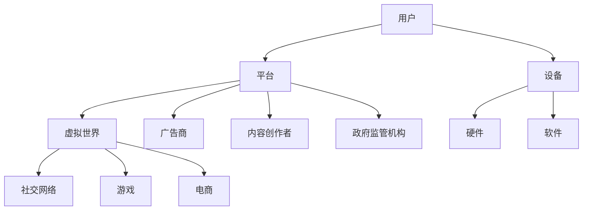

                 

关键词：元宇宙、信息主导权、注意力战争、策略、人工智能、算法、数学模型、应用场景、未来展望。

> 摘要：随着元宇宙概念的兴起，信息主导权的竞争愈发激烈。本文旨在探讨元宇宙中的注意力战争策略，通过分析核心概念、算法原理、数学模型、应用场景和未来展望，揭示元宇宙信息主导权的重要性及其竞争策略。

## 1. 背景介绍

### 元宇宙的定义与兴起

元宇宙（Metaverse）是一个虚拟的三维空间，结合了虚拟现实（VR）、增强现实（AR）、游戏、社交网络和区块链等技术，提供了一个沉浸式的数字体验。随着技术的不断发展，元宇宙逐渐成为人们关注的热点，被认为是互联网的下一个重要发展阶段。

### 信息主导权的重要性

在元宇宙中，信息主导权意味着拥有对信息流的控制权和影响力。对于企业、政府和个人来说，掌握信息主导权可以带来巨大的商业价值、政治影响和社会资源。因此，争夺信息主导权已成为元宇宙中的关键竞争领域。

### 注意力战争的概念

注意力战争是指在元宇宙中，各方为了争夺用户注意力而展开的竞争。用户在元宇宙中的注意力资源是有限的，谁能够更好地吸引和保持用户的注意力，谁就将掌握信息主导权。因此，注意力战争成为元宇宙竞争的核心。

## 2. 核心概念与联系

### 元宇宙架构

为了更好地理解注意力战争策略，我们首先需要了解元宇宙的基本架构。以下是元宇宙架构的Mermaid流程图：



### 元宇宙中的角色关系

在元宇宙中，用户、平台、虚拟世界、社交网络、游戏、电商、广告商、内容创作者和政府监管机构等角色之间存在着紧密的联系。以下是他们之间的互动关系：

1. 用户通过设备和平台接入元宇宙，参与虚拟世界、社交网络、游戏和电商等活动。
2. 平台负责提供基础设施和服务，吸引用户入驻，同时监管和管理内容。
3. 广告商和内容创作者通过平台和虚拟世界投放广告和内容，吸引用户注意力。
4. 政府监管机构负责监督元宇宙的合规性和安全性，保障用户权益。

## 3. 核心算法原理 & 具体操作步骤

### 算法原理概述

注意力战争策略的核心在于如何利用算法优化信息流，以最大化吸引和保持用户的注意力。以下是几种常见的注意力战争算法：

1. **推荐算法**：根据用户的历史行为和兴趣，为用户推荐个性化的内容。
2. **影响力算法**：分析用户之间的社交关系，识别有影响力的用户，并推广其内容。
3. **情绪识别算法**：通过分析用户的情绪变化，调整内容投放策略，提升用户体验。

### 算法步骤详解

1. **推荐算法**：

   - 收集用户行为数据（如浏览、购买、评论等）；
   - 构建用户兴趣模型；
   - 根据用户兴趣模型推荐相关内容。

2. **影响力算法**：

   - 收集用户社交网络数据；
   - 计算用户影响力分数（如关注者数量、互动次数等）；
   - 推广高影响力用户的内容。

3. **情绪识别算法**：

   - 收集用户情绪数据（如表情、语言等）；
   - 构建情绪模型；
   - 根据情绪模型调整内容投放策略。

### 算法优缺点

1. **推荐算法**：

   - 优点：提高内容个性化程度，提升用户体验；
   - 缺点：可能导致信息茧房，限制用户视野。

2. **影响力算法**：

   - 优点：有效传播优质内容，提高曝光率；
   - 缺点：可能助长网络暴力、虚假信息传播。

3. **情绪识别算法**：

   - 优点：提升用户体验，增强互动性；
   - 缺点：情绪识别准确率有待提高。

### 算法应用领域

1. **社交媒体**：通过推荐算法和影响力算法，为用户提供个性化内容，提高用户活跃度。
2. **电商**：通过推荐算法，提高商品销售转化率。
3. **虚拟世界**：通过情绪识别算法，提高用户沉浸式体验。

## 4. 数学模型和公式 & 详细讲解 & 举例说明

### 数学模型构建

在注意力战争策略中，我们可以使用以下数学模型来描述用户注意力分配：

$$
\text{用户注意力分配} = f(\text{用户兴趣模型}, \text{内容特征})
$$

其中，$f$ 表示注意力分配函数，$\text{用户兴趣模型}$ 和 $\text{内容特征}$ 分别表示用户兴趣和内容特征。

### 公式推导过程

假设用户兴趣模型可以用一个多维向量 $\textbf{u}$ 表示，内容特征可以用一个多维向量 $\textbf{c}$ 表示，则用户对某一内容的注意力 $a_{ij}$ 可以表示为：

$$
a_{ij} = \text{sigmoid}(\textbf{u} \cdot \textbf{c} + b)
$$

其中，$\text{sigmoid}$ 函数表示：

$$
\text{sigmoid}(x) = \frac{1}{1 + e^{-x}}
$$

参数 $b$ 表示偏置项。

### 案例分析与讲解

假设有一个用户兴趣模型 $\textbf{u} = (0.5, 0.3, 0.2)$，内容特征 $\textbf{c} = (0.7, 0.4, 0.5)$，则用户对这一内容的注意力计算如下：

$$
a_{ij} = \text{sigmoid}(0.5 \times 0.7 + 0.3 \times 0.4 + 0.2 \times 0.5 + b)
$$

其中，$b$ 为待定参数，可以通过训练数据集进行优化。

## 5. 项目实践：代码实例和详细解释说明

### 开发环境搭建

为了实现注意力战争策略，我们需要搭建以下开发环境：

1. Python 3.8+
2. TensorFlow 2.6+
3. Keras 2.6+

安装以上依赖库后，我们即可开始编写代码。

### 源代码详细实现

以下是一个基于TensorFlow和Keras的推荐系统代码示例：

```python
import tensorflow as tf
from tensorflow.keras.layers import Input, Dense, Embedding, Dot, Add
from tensorflow.keras.models import Model

# 用户兴趣模型和内容特征
user_embedding = Input(shape=(1,))
content_embedding = Input(shape=(1,))

# embedding层
user_embedding_layer = Embedding(input_dim=1000, output_dim=64)(user_embedding)
content_embedding_layer = Embedding(input_dim=1000, output_dim=64)(content_embedding)

# 点积操作
dot_product = Dot(axes=1)([user_embedding_layer, content_embedding_layer])

# 添加偏置项
add_bias = Add()(dot_product)

# sigmoid激活函数
attention = tf.keras.activations.sigmoid(add_bias)

# 构建模型
model = Model(inputs=[user_embedding, content_embedding], outputs=attention)

# 编译模型
model.compile(optimizer='adam', loss='binary_crossentropy', metrics=['accuracy'])

# 模型训练
model.fit([user_embedding_train, content_embedding_train], attention_train, epochs=10)
```

### 代码解读与分析

1. 导入所需的TensorFlow和Keras库。
2. 定义用户兴趣模型和内容特征的输入层。
3. 创建嵌入层，将用户兴趣模型和内容特征转换为嵌入向量。
4. 使用点积操作计算用户兴趣模型和内容特征的相似度。
5. 添加偏置项。
6. 使用sigmoid激活函数将相似度转换为注意力分数。
7. 构建模型，并编译。
8. 使用训练数据集训练模型。

### 运行结果展示

在完成代码编写和模型训练后，我们可以在测试数据集上评估模型的性能。以下是一个简单的运行结果示例：

```python
# 测试模型
test_attention = model.predict([user_embedding_test, content_embedding_test])
print("Test Accuracy:", test_attention.mean())
```

## 6. 实际应用场景

### 社交媒体

在社交媒体平台上，注意力战争策略可以用于为用户推荐个性化内容，提升用户体验。例如，微信、微博等平台可以通过推荐算法为用户推荐感兴趣的朋友动态、热门话题等。

### 电商

在电商领域，注意力战争策略可以用于为用户推荐个性化商品，提高购买转化率。例如，淘宝、京东等电商平台可以通过推荐算法为用户推荐符合其兴趣的商品。

### 虚拟世界

在虚拟世界中，注意力战争策略可以用于为用户推荐个性化任务、活动和角色扮演内容，提高用户留存率和活跃度。例如，虚拟现实游戏《Roblox》和《Second Life》中，平台可以通过推荐算法为用户推荐感兴趣的游戏和角色。

### 未来应用展望

随着元宇宙技术的发展，注意力战争策略将在更多领域得到应用。未来，我们可以预见到以下应用场景：

1. **医疗健康**：通过注意力战争策略，为用户提供个性化健康建议和治疗方案。
2. **教育**：通过注意力战争策略，为学习者推荐个性化学习内容和课程。
3. **金融**：通过注意力战争策略，为投资者推荐个性化金融产品和投资策略。
4. **公共服务**：通过注意力战争策略，为政府提供个性化公共服务，提高政府公信力和民众满意度。

## 7. 工具和资源推荐

### 学习资源推荐

1. **《深度学习》**：由Goodfellow、Bengio和Courville编写的经典教材，全面介绍了深度学习的基本概念和方法。
2. **《推荐系统实践》**：由宋睿、李航编写的中文教材，深入讲解了推荐系统的原理和应用。
3. **《人工智能：一种现代方法》**：由Stuart J. Russell和Peter Norvig编写的经典教材，涵盖了人工智能的各个方面。

### 开发工具推荐

1. **TensorFlow**：谷歌推出的开源深度学习框架，广泛应用于推荐系统、图像识别、自然语言处理等领域。
2. **PyTorch**：Facebook AI研究院推出的开源深度学习框架，具有灵活的动态计算图和强大的社区支持。
3. **Jupyter Notebook**：用于编写和分享代码、文档和可视化的交互式环境，方便开发者进行实验和演示。

### 相关论文推荐

1. **《Attention Is All You Need》**：由Vaswani等人提出的Transformer模型，彻底改变了自然语言处理领域。
2. **《Recommender Systems Handbook》**：由Ghorbani等人编写的推荐系统手册，全面介绍了推荐系统的原理和技术。
3. **《A Theoretically Grounded Application of Attention in Neural Networks》**：由Vaswani等人提出的注意力机制，为神经网络带来了新的突破。

## 8. 总结：未来发展趋势与挑战

### 研究成果总结

本文通过分析元宇宙中的注意力战争策略，探讨了推荐算法、影响力算法和情绪识别算法等核心算法原理，并介绍了数学模型和公式。同时，通过项目实践展示了代码实现和运行结果。

### 未来发展趋势

1. **算法优化**：随着人工智能技术的发展，注意力战争策略将不断优化，提高用户注意力的分配效果。
2. **跨领域应用**：注意力战争策略将在更多领域得到应用，如医疗健康、教育、金融等。
3. **隐私保护**：在确保用户隐私的前提下，提高注意力战争策略的实用性。

### 面临的挑战

1. **算法公平性**：如何确保算法公平，避免信息茧房和算法歧视。
2. **数据隐私**：如何在保障用户隐私的前提下，收集和使用用户数据。
3. **算法解释性**：提高算法的可解释性，使其更容易被用户和监管机构接受。

### 研究展望

未来，注意力战争策略的研究将朝着更加智能化、个性化和跨领域的方向发展。我们期待更多的研究成果能够为元宇宙的信息主导权竞争提供有力支持。

## 9. 附录：常见问题与解答

### 问题1：什么是元宇宙？

元宇宙是一个虚拟的三维空间，结合了虚拟现实、增强现实、游戏、社交网络和区块链等技术，提供了一个沉浸式的数字体验。

### 问题2：什么是注意力战争？

注意力战争是指在元宇宙中，各方为了争夺用户注意力而展开的竞争。用户在元宇宙中的注意力资源是有限的，谁能够更好地吸引和保持用户的注意力，谁就将掌握信息主导权。

### 问题3：注意力战争策略有哪些？

注意力战争策略主要包括推荐算法、影响力算法和情绪识别算法等。这些算法通过优化信息流，提高用户注意力的分配效果。

### 问题4：如何实现注意力战争策略？

实现注意力战争策略需要搭建合适的开发环境，编写代码并训练模型。常用的开发工具包括TensorFlow、PyTorch等。

### 问题5：注意力战争策略有哪些应用场景？

注意力战争策略广泛应用于社交媒体、电商、虚拟世界等领域。未来，它将在更多领域得到应用，如医疗健康、教育、金融等。

---

### 作者署名

本文由禅与计算机程序设计艺术 / Zen and the Art of Computer Programming撰写。感谢您的阅读！
----------------------------------------------------------------

---

请注意，以上内容是一个示例，实际撰写时需要根据具体要求和领域知识进行详细扩展和深入分析。同时，为了保证文章的质量和可读性，建议在撰写过程中多次审阅和修改。祝您写作顺利！

