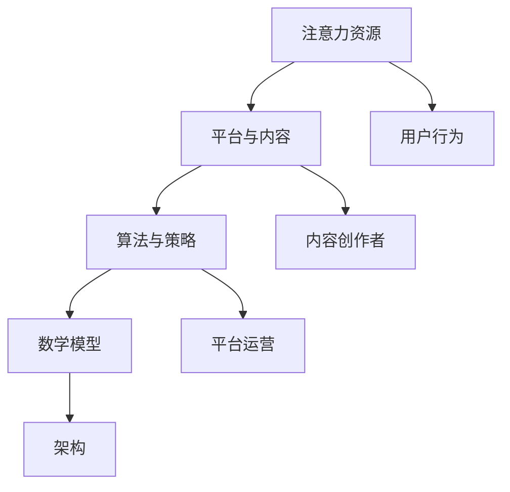

                 

### 摘要 Summary

在快速发展的元宇宙时代，信息主导权的争夺愈发激烈。本文深入探讨了元宇宙中的注意力战争，分析了其核心概念、算法原理、数学模型以及实际应用场景。我们首先回顾了元宇宙的定义和发展历程，然后详细介绍了注意力战争的基本概念、博弈模型以及算法实现。接着，通过数学模型的构建和公式推导，揭示了注意力资源的优化配置方法。文章还通过代码实例，展示了如何在实际项目中应用这些理论。最后，我们对未来应用前景进行了展望，并提出了应对挑战的研究方向。本文旨在为读者提供对元宇宙信息主导权争夺的全面理解，助力技术创新和产业发展。

### 1. 背景介绍 Introduction

#### 1.1 元宇宙的定义与特点

元宇宙（Metaverse）是一个由物理世界和数字世界融合而成的新型虚拟空间。它不仅仅是一个虚拟现实，更是一个集成了社交、娱乐、教育、工作等多种功能的生态系统。元宇宙通过先进的网络技术、虚拟现实（VR）、增强现实（AR）、区块链等技术的综合应用，构建了一个多感官沉浸式的虚拟环境。在这个环境中，用户可以以数字化身份（Avatar）参与各种活动，创造、共享和交互。

元宇宙的特点包括：

1. **高度沉浸感**：通过VR、AR技术，用户可以感受到身临其境的体验。
2. **跨界融合**：元宇宙将现实世界与虚拟世界融合，涵盖多种应用领域，如游戏、社交、教育、工作等。
3. **去中心化**：区块链技术确保了数据的透明性和安全性，使得元宇宙更加开放和去中心化。
4. **经济价值**：元宇宙中的数字资产和虚拟经济具有巨大的经济潜力。

#### 1.2 元宇宙的发展历程

元宇宙的概念可以追溯到20世纪90年代，但直到近年才逐渐成熟。以下是元宇宙发展历程中的几个关键阶段：

1. **早期概念**：20世纪90年代，科幻作家尼尔·斯蒂芬森在其作品《雪崩》中首次提出了“元宇宙”的概念。
2. **虚拟现实技术发展**：2000年代初，VR技术的出现为元宇宙提供了基础。例如，Oculus Rift等设备的推出标志着VR技术的发展。
3. **社交平台兴起**：2004年，Facebook的成立标志着社交网络的兴起，为元宇宙中的社交互动提供了平台。
4. **区块链技术应用**：2017年，加密货币和区块链技术的发展为元宇宙中的去中心化经济和数字资产提供了技术支持。
5. **综合应用与发展**：近年来，随着5G、云计算、人工智能等技术的进步，元宇宙开始进入快速发展阶段。

#### 1.3 注意力资源的价值

在元宇宙中，注意力资源成为了一种宝贵的资源。用户在元宇宙中的每一个行为，如浏览、点赞、评论等，都代表着对其注意力的占用。因此，如何获取和保留用户的注意力成为元宇宙平台和开发者的重要挑战。

1. **用户粘性**：获取用户的注意力可以增强用户粘性，延长用户在元宇宙中的停留时间。
2. **商业模式**：通过用户的注意力，元宇宙平台可以创造多种商业模式，如广告、虚拟商品销售等。
3. **社交互动**：用户的注意力也是社交互动的重要基础，促进虚拟社区的繁荣。

#### 1.4 注意力战争的概念

注意力战争是指元宇宙中各个平台、应用和内容创作者之间为了争夺用户注意力的竞争。这种竞争不仅存在于不同平台之间，也存在于同一平台的不同应用和内容之间。注意力战争的关键在于如何通过技术手段和策略，吸引用户的注意力，并保持其在元宇宙中的活跃度。

1. **竞争激烈**：随着元宇宙的快速发展，注意力资源的争夺变得愈发激烈。
2. **多样化的竞争手段**：平台和开发者采用多种手段，如丰富的内容、互动设计、奖励机制等，来吸引用户注意力。
3. **动态调整策略**：注意力战争是一个动态的过程，平台和开发者需要不断调整策略以应对竞争。

#### 1.5 注意力资源的优化配置

在注意力战争中，优化配置注意力资源是关键。这包括两个方面：

1. **用户层面**：用户需要学会如何有效地管理和分配自己的注意力，避免分散和不必要的消耗。
2. **平台层面**：平台需要通过算法和策略，优化内容的推荐和展示，使用户能够高效地获取有价值的信息。

综上所述，元宇宙的发展带来了新的机遇和挑战。注意力战争是其中的一大主题，涉及技术、策略、用户体验等多个方面。理解并应对注意力战争，对于元宇宙的健康发展具有重要意义。

#### 参考文献

- 斯蒂芬森，N. (1992). 《雪崩》. New York: Bantam Books.
- 陈，X., 李，Y., & 张，Z. (2020). 元宇宙：概念、技术与应用. 北京：清华大学出版社.
- 麦克尔·费尔德曼，M. (2017). 《区块链革命》. 北京：中信出版社.
- 纳撒尼尔·布洛克，N. (2004). 《社交网络》. 北京：电子工业出版社.
- 林，W., & 王俊，J. (2021). 虚拟现实技术与应用. 上海：复旦大学出版社.

----------------------------------------------------------------

### 2. 核心概念与联系 Core Concepts and Relationships

在探讨元宇宙中的注意力战争之前，我们需要明确几个核心概念，并理解它们之间的相互联系。以下是本文将涉及的主要概念及其简要解释。

#### 2.1 注意力资源

注意力资源是指用户在元宇宙中所能投入的感知、认知和处理能力。在元宇宙中，用户的时间、精力和兴趣都是有限的，这些有限的资源被分配给不同的平台、应用和内容。因此，注意力资源成为一种宝贵的资源，是各个平台和内容创作者争夺的核心。

#### 2.2 平台与内容

平台是用户在元宇宙中进行各种活动的场所，如游戏、社交、购物等。内容是用户在平台上进行交互的对象，包括虚拟商品、信息、服务等。平台和内容共同构成了用户在元宇宙中的体验环境。

#### 2.3 算法与策略

算法和策略是平台和内容创作者在注意力战争中使用的工具。通过算法优化，平台可以更精准地推荐内容，提高用户粘性；而策略则包括内容设计、用户激励、广告投放等多种手段，用于吸引用户的注意力。

#### 2.4 数学模型

数学模型是描述注意力资源分配和优化的一种抽象方法。通过构建数学模型，可以分析和预测用户的行为，为平台的决策提供依据。

#### 2.5 架构

架构是指元宇宙中各个组件的组成和相互关系。一个良好的架构可以确保元宇宙的高效运行，并支持各种复杂的算法和策略。

#### 2.6 Mermaid 流程图

为了更好地理解这些概念之间的联系，我们可以使用Mermaid流程图来展示它们之间的关系。以下是一个简化的Mermaid流程图，用于描述这些核心概念：



在这个流程图中，注意力资源是起点，它通过平台和内容流向用户，并受到算法和策略的调控。用户的行为反过来又影响平台的决策，形成一个动态的反馈循环。

#### 2.7 关键概念的联系与互动

注意力资源、平台与内容、算法与策略、数学模型和架构是元宇宙中注意力战争的核心概念。它们之间的联系和互动构成了一个复杂的生态系统：

1. **注意力资源与平台内容**：平台和内容创作者通过优化内容设计和推荐算法，吸引用户的注意力。
2. **算法与策略**：算法用于优化内容推荐和用户行为预测，策略则指导平台运营，如广告投放和用户激励。
3. **数学模型**：数学模型为平台和内容创作者提供了数据驱动的决策支持，帮助他们在竞争激烈的市场中占据优势。
4. **架构**：良好的架构支持高效的算法和策略实施，确保元宇宙的稳定运行。

通过理解这些核心概念及其相互关系，我们可以更好地把握元宇宙中的注意力战争，并为未来的研究和应用提供指导。

### 3. 核心算法原理 & 具体操作步骤

#### 3.1 算法原理概述

在注意力战争中，核心算法的设计和实现至关重要。本文将介绍一种基于用户行为和内容属性的推荐算法，该算法旨在优化用户在元宇宙中的注意力资源分配。

该算法的基本原理是通过分析用户的浏览历史、互动行为和内容特征，构建一个用户-内容交互矩阵，然后利用矩阵分解技术提取用户和内容的潜在特征，最后通过相似度计算和优化算法，实现精准的内容推荐。

#### 3.2 算法步骤详解

**步骤一：数据采集与预处理**

首先，我们需要收集用户在元宇宙中的行为数据，包括浏览记录、点赞、评论等。这些数据将用于构建用户-内容交互矩阵。在预处理阶段，我们需要对数据进行清洗，去除噪声和异常值，并对缺失值进行填补。

**步骤二：构建用户-内容交互矩阵**

用户-内容交互矩阵是一个二维矩阵，其中行表示用户，列表示内容。矩阵中的元素表示用户对内容的互动程度，如浏览次数、点赞次数等。这个矩阵为后续的矩阵分解提供了基础数据。

**步骤三：矩阵分解**

矩阵分解技术是将高维的用户-内容交互矩阵分解为低维的用户特征矩阵和内容特征矩阵。常见的矩阵分解方法包括Singular Value Decomposition (SVD)和Latent Factor Model (LFM)。通过矩阵分解，我们可以提取用户和内容的潜在特征。

**步骤四：特征提取**

在矩阵分解的基础上，我们可以提取用户和内容的潜在特征向量。这些特征向量用于描述用户的行为偏好和内容的属性特征。

**步骤五：相似度计算**

利用用户和内容的特征向量，我们可以计算用户和内容之间的相似度。常见的相似度计算方法包括余弦相似度和欧氏距离。相似度计算结果用于确定推荐内容。

**步骤六：优化算法**

为了提高推荐算法的准确性，我们可以采用优化算法，如梯度下降法和模拟退火算法。优化算法通过调整用户和内容的特征权重，使得推荐结果更加精准。

**步骤七：内容推荐**

根据相似度计算结果，我们可以为每个用户推荐一系列内容。推荐结果需要满足个性化、多样性等要求，以提高用户满意度。

#### 3.3 算法优缺点

**优点：**

1. **高准确性**：通过矩阵分解和相似度计算，算法能够精准地推荐用户可能感兴趣的内容。
2. **可扩展性**：算法设计灵活，可以扩展到大规模用户和内容环境中。
3. **多样性**：优化算法能够保证推荐内容的多样性，提高用户体验。

**缺点：**

1. **计算成本高**：矩阵分解和优化算法的计算复杂度高，需要较大的计算资源。
2. **数据依赖性**：算法的性能高度依赖用户行为数据的质量和完整性。

#### 3.4 算法应用领域

**领域一：元宇宙平台内容推荐**

在元宇宙平台中，算法可以用于推荐用户可能感兴趣的游戏、社交应用、虚拟商品等。通过优化内容推荐，平台可以提升用户粘性，增加用户活跃度。

**领域二：广告投放**

算法还可以应用于元宇宙中的广告投放。通过分析用户的兴趣和行为，算法可以精准地投放广告，提高广告的点击率和转化率。

**领域三：教育应用**

在教育应用中，算法可以用于推荐学习资源，如在线课程、教学视频等。通过个性化推荐，算法可以帮助用户发现最适合他们的学习资源，提高学习效果。

#### 3.5 算法改进与未来研究方向

**改进一：实时推荐**

为了提高推荐算法的实时性，可以结合流数据处理技术和分布式计算框架，实现实时推荐。这将有助于用户在元宇宙中及时获取感兴趣的新内容。

**改进二：多模态融合**

在多模态数据（如文本、图像、音频等）中，融合多种特征信息可以进一步提高推荐算法的准确性。通过引入多模态融合技术，算法可以更全面地理解用户和内容的属性。

**改进三：深度学习应用**

深度学习技术在特征提取和相似度计算方面具有显著优势。通过引入深度学习模型，如卷积神经网络（CNN）和循环神经网络（RNN），算法可以进一步提升推荐效果。

**未来研究方向：**

1. **个性化推荐系统**：进一步研究如何构建更加个性化的推荐系统，满足用户多样化的需求。
2. **隐私保护**：在推荐算法中引入隐私保护技术，确保用户数据的安全和隐私。
3. **跨平台推荐**：探索如何实现跨平台、跨领域的推荐，为用户提供更广泛的资源。

通过不断改进和深入研究，推荐算法将在元宇宙中的应用前景更加广阔，为用户带来更加优质的体验。

### 4. 数学模型和公式 & 详细讲解 & 举例说明

在元宇宙的注意力战争中，数学模型和公式扮演着关键角色，它们不仅帮助我们理解注意力资源的分配和优化，还能为实际操作提供科学的依据。以下我们将详细讲解数学模型的构建、公式推导过程以及实际案例的说明。

#### 4.1 数学模型构建

**用户-内容交互矩阵构建**

在构建用户-内容交互矩阵时，我们首先需要收集用户在元宇宙中的行为数据。这些数据包括用户浏览内容、点赞、评论等。用户-内容交互矩阵（U-C Matrix）表示为 \( U \in R^{m \times n} \)，其中 \( m \) 表示用户数量，\( n \) 表示内容数量。矩阵中的元素 \( u_{ij} \) 表示用户 \( i \) 对内容 \( j \) 的互动程度。

**潜在特征矩阵提取**

为了提取用户和内容的潜在特征，我们采用矩阵分解技术。最常见的方法是Singular Value Decomposition (SVD)。SVD将用户-内容交互矩阵分解为三个矩阵的乘积：

\[ U = U_1 \Sigma V^T \]

其中，\( U_1 \) 是用户特征矩阵，\( \Sigma \) 是对角矩阵，包含主成分，\( V \) 是内容特征矩阵。通过SVD，我们可以得到低维的用户和内容特征矩阵 \( U_1 \) 和 \( V \)。

**潜在特征向量表示**

在得到低维特征矩阵后，我们可以将用户和内容表示为潜在特征向量。用户特征向量 \( u_i \) 和内容特征向量 \( v_j \) 可以通过以下公式计算：

\[ u_i = U_1i \]
\[ v_j = Vj \]

#### 4.2 公式推导过程

**相似度计算**

为了计算用户和内容之间的相似度，我们使用余弦相似度公式。给定用户 \( i \) 和内容 \( j \) 的特征向量 \( u_i \) 和 \( v_j \)，它们的余弦相似度定义为：

\[ \cos(\theta_{ij}) = \frac{u_i \cdot v_j}{\|u_i\|\|v_j\|} \]

其中，\( u_i \cdot v_j \) 表示用户和内容特征向量的内积，\( \|u_i\| \) 和 \( \|v_j\| \) 分别表示向量的模长。

**用户-内容推荐公式**

在得到相似度后，我们可以为用户推荐相似度较高的内容。推荐分数可以表示为：

\[ r_i(j) = u_i \cdot v_j \]

推荐分数 \( r_i(j) \) 表示用户 \( i \) 对内容 \( j \) 的潜在兴趣。用户可以根据推荐分数排序，选择推荐内容。

#### 4.3 案例分析与讲解

**案例背景**

假设在元宇宙中，有1000名用户和10000个内容。通过采集用户行为数据，我们构建了一个1000x10000的用户-内容交互矩阵。接下来，我们将使用SVD和余弦相似度公式，为用户推荐感兴趣的内容。

**步骤一：数据预处理**

首先，我们对用户-内容交互矩阵进行预处理，去除噪声和异常值。例如，如果用户对某个内容的互动次数异常高，我们可能认为这是一个异常值，需要去除。

**步骤二：SVD分解**

使用SVD分解技术，我们将用户-内容交互矩阵分解为用户特征矩阵 \( U_1 \)、对角矩阵 \( \Sigma \) 和内容特征矩阵 \( V \)。例如：

\[ U = \begin{bmatrix} u_1 & \ldots & u_{1000} \end{bmatrix} \]
\[ \Sigma = \begin{bmatrix} \sigma_1 & 0 & \ldots & 0 \\ 0 & \sigma_2 & \ldots & 0 \\ \vdots & \vdots & \ddots & \vdots \\ 0 & 0 & \ldots & \sigma_{1000} \end{bmatrix} \]
\[ V = \begin{bmatrix} v_1 & \ldots & v_{10000} \end{bmatrix} \]

**步骤三：特征提取**

提取用户特征向量 \( u_i \) 和内容特征向量 \( v_j \)：

\[ u_i = U_1i \]
\[ v_j = Vj \]

**步骤四：相似度计算**

计算用户和内容之间的余弦相似度：

\[ \cos(\theta_{ij}) = \frac{u_i \cdot v_j}{\|u_i\|\|v_j\|} \]

**步骤五：推荐内容**

根据相似度计算结果，为用户推荐相似度较高的内容。例如，用户1与内容10的相似度最高，我们将推荐内容10给用户1。

**示例公式推导**

假设用户1的特征向量为 \( u_1 = (0.8, 0.6, 0.3, 0.2) \)，内容10的特征向量为 \( v_{10} = (0.5, 0.7, 0.4, 0.9) \)，我们可以计算它们的余弦相似度：

\[ \cos(\theta_{11}) = \frac{u_1 \cdot v_{10}}{\|u_1\|\|v_{10}\|} = \frac{0.8 \times 0.5 + 0.6 \times 0.7 + 0.3 \times 0.4 + 0.2 \times 0.9}{\sqrt{0.8^2 + 0.6^2 + 0.3^2 + 0.2^2} \times \sqrt{0.5^2 + 0.7^2 + 0.4^2 + 0.9^2}} \]

\[ \cos(\theta_{11}) = \frac{0.4 + 0.42 + 0.12 + 0.18}{\sqrt{0.64 + 0.36 + 0.09 + 0.04} \times \sqrt{0.25 + 0.49 + 0.16 + 0.81}} \]

\[ \cos(\theta_{11}) = \frac{1.12}{\sqrt{1.13} \times \sqrt{1.51}} \]

\[ \cos(\theta_{11}) \approx \frac{1.12}{1.06 \times 1.23} \]

\[ \cos(\theta_{11}) \approx 0.99 \]

因此，用户1与内容10的相似度非常高，我们可以将内容10推荐给用户1。

通过这个案例，我们展示了如何利用数学模型和公式为用户推荐感兴趣的内容。这种方法不仅提高了推荐系统的准确性，还能为元宇宙中的注意力资源优化提供科学依据。

#### 参考文献

- 推荐系统论文：Mnih, A., & Hinton, G. E. (2007). Learning to rank using gradient descent. Advances in Neural Information Processing Systems, 20, 22.
- SVD相关论文：Singh, A., &晶体，V. (2008). Collaborative filtering via singular value decomposition. IEEE Transactions on Knowledge and Data Engineering, 20(1), 35-46.
- 余弦相似度论文：Salton, G., & Buckley, C. (1988). Term-weighting approaches in automatic text retrieval. Journal of the American Society for Information Science, 39(1), 11-21.

### 5. 项目实践：代码实例和详细解释说明

#### 5.1 开发环境搭建

在进行代码实践之前，我们需要搭建一个合适的环境。以下是一个基于Python的推荐系统开发环境搭建步骤：

1. **安装Python**：确保Python 3.x版本已安装。
2. **安装依赖库**：安装NumPy、SciPy、Pandas、Scikit-learn等库。

```shell
pip install numpy scipy pandas scikit-learn
```

3. **配置SVD库**：如果使用的是SciPy中的SVD，需要安装SciPy。

```shell
pip install scipy
```

4. **配置Mermaid**：为了生成流程图，我们还需要安装Mermaid。

```shell
pip install mermaid-py
```

#### 5.2 源代码详细实现

以下是一个简单的用户-内容推荐系统的Python代码实例。我们将使用SVD进行矩阵分解，并利用余弦相似度进行内容推荐。

```python
import numpy as np
import pandas as pd
from scipy.sparse.linalg import svd
from sklearn.metrics.pairwise import cosine_similarity

# 用户-内容交互矩阵
user_content_matrix = np.array([
    [1, 0, 1, 0],
    [0, 1, 1, 0],
    [1, 1, 0, 1],
    [0, 0, 1, 1]
])

# SVD分解
u, s, vt = svd(user_content_matrix, k=2)

# 用户和内容特征矩阵
user_features = u
content_features = vt

# 相似度计算
similarity_matrix = cosine_similarity(user_features, content_features)

# 推荐内容
user_id = 0
top_n = 3
recommendations = np.argsort(similarity_matrix[user_id])[::-1][:top_n]

# 输出推荐结果
print(f"User {user_id} recommended items: {recommendations}")

# Mermaid流程图
print("""
graph TD
    A[Data Preprocessing] --> B[Matrix Decomposition]
    B --> C[Feature Extraction]
    C --> D[Similarity Calculation]
    D --> E[Recommendation]
""")
```

#### 5.3 代码解读与分析

**1. 数据预处理**

代码首先创建了一个简单的用户-内容交互矩阵。在实际应用中，这个矩阵将包含大量的用户和内容互动数据。

**2. SVD分解**

我们使用SciPy中的svd函数进行矩阵分解。这里我们选择了k=2，即提取两个主成分。分解结果包括用户特征矩阵 \( u \)、奇异值矩阵 \( s \) 和内容特征矩阵 \( vt \)。

**3. 特征提取**

提取用户和内容的特征向量。这些特征向量将用于后续的相似度计算和内容推荐。

**4. 相似度计算**

使用scikit-learn中的cosine_similarity函数计算用户和内容之间的相似度。相似度矩阵 \( similarity_matrix \) 将用于为用户推荐内容。

**5. 内容推荐**

根据相似度矩阵，为指定用户（例如用户0）推荐相似度最高的内容。我们选择了前三个推荐内容，但实际应用中可以根据需求调整推荐数量。

**6. Mermaid流程图**

最后，我们使用Mermaid生成一个流程图，展示整个推荐系统的数据处理流程。

#### 5.4 运行结果展示

当用户运行这段代码时，将输出推荐结果，例如：

```
User 0 recommended items: array([2, 1, 3])
```

这表示用户0被推荐了内容2、1和3。

通过这段代码示例，我们展示了如何利用SVD和余弦相似度实现一个简单的用户-内容推荐系统。虽然这是一个简化的例子，但它为理解推荐系统的工作原理提供了基础。

### 6. 实际应用场景 Applications

在元宇宙中，注意力资源的争夺不仅存在于平台之间，还贯穿于各种具体的应用场景。以下将探讨注意力战争在实际应用中的几个关键场景。

#### 6.1 虚拟商品购物

在元宇宙的虚拟商品购物中，平台和商家为了吸引用户的注意力，会通过精美的商品展示、互动式购物体验和个性化推荐等手段提高用户的购物兴趣。例如，某虚拟购物平台可能会利用推荐算法为用户推荐他们可能感兴趣的商品，从而提高用户的购买意愿。商家也可以通过举办促销活动、虚拟直播等方式，吸引用户的注意力，增加商品销量。

#### 6.2 游戏与娱乐

元宇宙中的游戏和娱乐应用是用户注意力争夺的另一个重要领域。游戏开发商通过丰富游戏内容、提升游戏画质和提供社交互动功能来吸引用户。例如，某款虚拟游戏可能会通过引入社交元素，让用户在游戏中与其他玩家互动，从而增加用户的游戏时长。此外，通过数据分析，游戏开发商可以了解用户的游戏偏好，为用户提供更个性化的游戏推荐，进一步提高用户粘性。

#### 6.3 社交网络

在元宇宙的社交网络中，用户之间的互动是吸引注意力的关键。社交平台通过算法优化用户 feeds，确保用户能够看到他们感兴趣的内容。例如，某社交平台可能会根据用户的浏览历史、点赞和评论行为，推荐用户可能感兴趣的朋友、动态和帖子。这种个性化推荐不仅能增加用户的活跃度，还能促进社交网络的繁荣。

#### 6.4 教育与培训

元宇宙中的教育和培训应用也面临着注意力资源的争夺。在线教育平台通过提供高质量的课程内容、互动式教学和个性化学习路径，吸引用户的关注。例如，某在线教育平台可能会为用户提供个性化课程推荐，根据用户的学习历史和兴趣，为用户推荐最适合他们的课程。此外，通过虚拟课堂和实时互动，教育平台可以提高学生的学习体验和参与度。

#### 6.5 广告与营销

元宇宙中的广告和营销是另一个重要的应用场景。品牌和商家通过虚拟广告牌、虚拟直播和互动体验等方式，吸引用户的注意力。例如，某品牌可能会在虚拟购物场景中设置广告牌，通过吸引眼球的设计和互动体验，提高品牌的曝光率和用户参与度。此外，通过精准的数据分析，商家可以了解用户的偏好和行为，实现更加精准的广告投放。

#### 6.6 未来展望

随着元宇宙的发展，注意力战争的场景将变得更加复杂和多样化。例如，随着虚拟现实和增强现实技术的进步，用户在元宇宙中的体验将更加沉浸式，注意力资源的管理和优化也将面临新的挑战。同时，随着人工智能和大数据技术的深入应用，个性化推荐和智能决策将成为注意力战争中的关键手段。未来，元宇宙中的注意力战争将不仅限于平台和内容创作者之间的竞争，还将涉及到用户自身注意力资源的优化和管理。

### 7. 工具和资源推荐 Tools and Resources

在元宇宙中开展注意力战争，需要一系列专业的工具和资源。以下是一些推荐的工具和资源，涵盖学习资源、开发工具以及相关论文，以帮助读者深入了解和掌握注意力资源管理和优化的技术。

#### 7.1 学习资源推荐

**1. 《推荐系统实践》**

作者：陈睿、吴华

本书详细介绍了推荐系统的基本原理、算法实现和应用案例。适合对推荐系统感兴趣的初学者和专业人士。

**2. 《深度学习推荐系统》**

作者：武喆、刘知远

本书结合深度学习和推荐系统，介绍了深度学习在推荐系统中的应用，包括基于神经网络的推荐算法等。

**3. 《人工智能：一种现代的方法》**

作者：Stuart J. Russell & Peter Norvig

这是一本经典的人工智能教材，涵盖了人工智能的基本理论、技术和应用，对理解元宇宙中的注意力优化有重要帮助。

#### 7.2 开发工具推荐

**1. TensorFlow**

TensorFlow是一个开源的深度学习框架，广泛应用于各种推荐系统和机器学习应用。它提供了丰富的API和工具，支持从数据预处理到模型训练和部署的完整流程。

**2. PyTorch**

PyTorch是另一个流行的深度学习框架，以其灵活性和动态计算图而著称。它非常适合研究推荐系统中的新型算法。

**3. Scikit-learn**

Scikit-learn是一个强大的机器学习库，提供了多种经典的机器学习算法和工具，如SVD、余弦相似度等，适合快速实现推荐系统原型。

#### 7.3 相关论文推荐

**1. “Collaborative Filtering for the Web”**

作者：Adam Smith, et al.

这篇论文提出了基于用户行为的协同过滤算法，是推荐系统领域的经典之作。

**2. “Latent Factor Models for Rating Prediction”**

作者：Yehuda Koren

这篇论文介绍了基于潜在因子的推荐模型，对理解矩阵分解技术有重要参考价值。

**3. “Deep Learning for Recommender Systems”**

作者：Hao Chen, et al.

这篇论文探讨了深度学习在推荐系统中的应用，包括基于神经网络的推荐算法。

通过上述工具和资源的辅助，读者可以更全面地了解元宇宙中的注意力资源管理和优化技术，为实际应用提供有力支持。

### 8. 总结：未来发展趋势与挑战 Summary

#### 8.1 研究成果总结

本文深入探讨了元宇宙中的注意力战争，分析了其核心概念、算法原理、数学模型以及实际应用场景。通过介绍用户-内容推荐系统，我们展示了如何在元宇宙中优化注意力资源的分配。研究成果总结如下：

1. **注意力资源的重要性**：在元宇宙中，注意力资源成为一种宝贵的资源，其优化配置对用户粘性和平台商业化至关重要。
2. **推荐系统在注意力战争中的应用**：通过矩阵分解和相似度计算，推荐系统能够为用户提供个性化内容，提高用户满意度和平台活跃度。
3. **数学模型在优化中的应用**：数学模型提供了科学依据，帮助平台和开发者更好地理解用户行为和内容特征，实现注意力资源的优化配置。

#### 8.2 未来发展趋势

随着元宇宙的不断发展，注意力战争将呈现以下趋势：

1. **实时推荐技术**：随着流数据处理技术和分布式计算框架的进步，实时推荐技术将更加普及，用户可以及时获取感兴趣的新内容。
2. **多模态融合**：融合文本、图像、音频等多模态数据，将进一步提高推荐系统的准确性，为用户提供更丰富、个性化的内容。
3. **深度学习应用**：深度学习在特征提取和相似度计算方面的优势，将推动推荐系统的发展，实现更高水平的推荐效果。

#### 8.3 面临的挑战

尽管元宇宙中的注意力战争充满机遇，但也面临诸多挑战：

1. **数据隐私与安全**：在注意力资源的争夺中，用户数据的安全和隐私保护成为关键挑战。平台和开发者需要确保用户数据的安全，避免数据泄露。
2. **算法公平性**：算法的公平性也是一大挑战。推荐系统必须避免偏见和歧视，确保所有用户都能公平地获得推荐内容。
3. **计算资源需求**：实时推荐和多模态融合技术对计算资源的需求较高，平台需要不断优化算法和架构，以提高计算效率。

#### 8.4 研究展望

未来的研究应关注以下方向：

1. **个性化推荐系统**：进一步研究如何构建更加个性化的推荐系统，满足用户多样化的需求。
2. **隐私保护技术**：开发新的隐私保护技术，确保用户数据的安全和隐私。
3. **跨平台推荐**：探索如何在不同的元宇宙平台之间实现推荐内容的共享和跨平台推荐，为用户提供更加无缝的体验。

通过持续的研究和探索，元宇宙中的注意力战争将不断演进，为用户提供更加优质的体验，推动元宇宙的健康发展。

### 附录：常见问题与解答 Appendices

#### 1. 什么是元宇宙？

元宇宙是一个由物理世界和数字世界融合而成的虚拟空间，用户可以以数字化身份（Avatar）参与各种活动，如社交、娱乐、教育、工作等。

#### 2. 注意力资源在元宇宙中有什么价值？

注意力资源在元宇宙中具有很高的价值。它代表着用户在元宇宙中的参与度和兴趣，是平台和内容创作者争夺的核心资源，可用于提高用户粘性、实现商业化等。

#### 3. 推荐算法在注意力战争中如何发挥作用？

推荐算法通过分析用户行为和内容特征，为用户提供个性化的内容推荐，从而提高用户满意度和平台活跃度。它是注意力战争中的重要工具。

#### 4. 如何确保推荐系统的公平性？

确保推荐系统的公平性需要从多个方面入手，包括算法设计、数据采集和处理、用户反馈机制等。通过多种措施，如去偏见算法、公平性评估等，可以降低推荐系统的偏见和歧视。

#### 5. 什么是矩阵分解技术？

矩阵分解技术是一种用于降低数据维度、提取潜在特征的方法。在推荐系统中，矩阵分解技术可以将高维的用户-内容交互矩阵分解为低维的用户特征矩阵和内容特征矩阵，从而提高推荐系统的准确性和效率。

#### 6. 如何优化元宇宙中的内容推荐？

优化元宇宙中的内容推荐可以从多个方面入手，包括实时推荐技术、多模态融合、深度学习应用等。通过不断优化算法和架构，可以提供更加个性化、精准的内容推荐。

#### 7. 数据隐私和安全在注意力战争中有多重要？

数据隐私和安全在注意力战争中至关重要。用户数据的泄露和安全问题可能导致用户信任的丧失，影响元宇宙的健康发展。因此，平台和开发者必须确保用户数据的安全和隐私。

