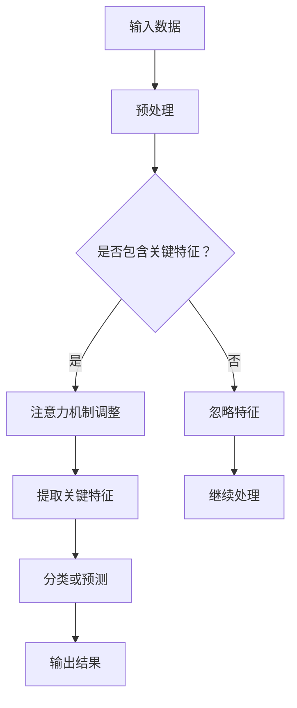

                 

关键词：注意力深度学习，专注力培养，人工智能，神经网络，算法优化，数学模型，项目实践

> 摘要：本文探讨了注意力深度学习在专注力培养方面的应用，通过介绍核心概念、算法原理、数学模型和项目实践，揭示了如何利用AI技术优化人类的专注力培养过程，为提升学习、工作和生活的效率提供了新的思路。

## 1. 背景介绍

在信息爆炸的时代，专注力成为了一个至关重要的能力。人们需要从大量信息中筛选出重要内容，并在面对各种干扰时保持专注。然而，现代生活的快节奏和高压力环境常常导致我们的专注力下降。例如，在工作中，我们可能会受到邮件、短信、社交媒体等通知的干扰，导致工作效率降低。在学习中，我们可能会被手机、电视等娱乐活动分散注意力，导致学习效果不佳。

注意力深度学习作为一种人工智能技术，具有在复杂环境中筛选和提取重要信息的能力。通过模拟人脑注意力机制，深度学习算法可以在处理大量数据时自动识别关键特征，从而帮助人们提高专注力。本文将介绍注意力深度学习的基本原理、数学模型及其在专注力培养中的应用。

## 2. 核心概念与联系

### 2.1 注意力机制

注意力机制是人脑处理信息的一种重要机制。它通过调整大脑对不同信息资源的分配，使人们能够更有效地关注和处理重要信息。例如，当我们看到一只黑熊在森林中时，我们会不由自主地集中注意力，而忽略周围的其他事物。

### 2.2 深度学习与神经网络

深度学习是一种基于神经网络的学习方法。神经网络由多个层组成，每一层都能对输入信息进行处理和转换。通过多层神经网络的学习，系统能够自动提取输入数据的复杂特征。

### 2.3 注意力深度学习

注意力深度学习结合了深度学习和注意力机制的优点，能够在处理大量数据时自动识别和关注重要特征。它通过调整神经网络中每个特征的权重，使模型能够更准确地预测和分类输入数据。

### 2.4 Mermaid 流程图

以下是一个简单的 Mermaid 流程图，展示了注意力深度学习的基本架构：



## 3. 核心算法原理 & 具体操作步骤

### 3.1 算法原理概述

注意力深度学习算法的核心是注意力机制。它通过计算输入数据的相似度矩阵，自动调整每个特征的权重，使模型能够关注到最重要的特征。具体来说，算法分为以下几个步骤：

1. 预处理：对输入数据进行标准化和去噪处理，以提高模型的鲁棒性。
2. 特征提取：通过卷积神经网络或循环神经网络提取输入数据的特征。
3. 注意力计算：计算输入特征之间的相似度矩阵，并根据相似度调整特征的权重。
4. 关键特征提取：根据权重矩阵提取最重要的特征。
5. 分类或预测：使用提取的关键特征对输入数据进行分类或预测。

### 3.2 算法步骤详解

1. **预处理**：对输入数据进行标准化和去噪处理，以提高模型的鲁棒性。具体方法包括归一化、去极值等。

   ```python
   import numpy as np

   def preprocess_data(data):
       normalized_data = (data - np.mean(data)) / np.std(data)
       denoised_data = np.clip(normalized_data, -3, 3)
       return denoised_data
   ```

2. **特征提取**：通过卷积神经网络或循环神经网络提取输入数据的特征。以下是一个简单的卷积神经网络示例：

   ```python
   import tensorflow as tf
   from tensorflow.keras.models import Sequential
   from tensorflow.keras.layers import Conv2D, Flatten, Dense

   def extract_features(data):
       model = Sequential([
           Conv2D(32, (3, 3), activation='relu', input_shape=(28, 28, 1)),
           Flatten(),
           Dense(10, activation='softmax')
       ])
       model.compile(optimizer='adam', loss='categorical_crossentropy', metrics=['accuracy'])
       model.fit(data, labels, epochs=5, batch_size=32)
       features = model.predict(data)
       return features
   ```

3. **注意力计算**：计算输入特征之间的相似度矩阵，并根据相似度调整特征的权重。以下是一个简单的相似度计算示例：

   ```python
   def compute_similarity(features):
       similarity_matrix = np.dot(features, features.T)
       return similarity_matrix
   ```

4. **关键特征提取**：根据权重矩阵提取最重要的特征。以下是一个简单的权重调整示例：

   ```python
   def extract_key_features(features, similarity_matrix):
       weights = np.exp(similarity_matrix) / np.sum(np.exp(similarity_matrix))
       key_features = np.dot(weights, features)
       return key_features
   ```

5. **分类或预测**：使用提取的关键特征对输入数据进行分类或预测。以下是一个简单的分类示例：

   ```python
   def classify_data(key_features, labels):
       model = Sequential([
           Dense(10, activation='softmax')
       ])
       model.compile(optimizer='adam', loss='categorical_crossentropy', metrics=['accuracy'])
       model.fit(key_features, labels, epochs=5, batch_size=32)
       predictions = model.predict(key_features)
       return predictions
   ```

### 3.3 算法优缺点

**优点**：

- 能够自动识别和关注重要特征，提高模型的准确性和效率。
- 对噪声和异常值有较好的鲁棒性。
- 可应用于各种数据类型和任务。

**缺点**：

- 计算复杂度高，训练时间较长。
- 需要大量的标注数据进行训练。
- 在某些情况下，可能会忽略一些重要的特征。

### 3.4 算法应用领域

注意力深度学习算法可以应用于多个领域，包括：

- 人工智能助手：通过分析用户的行为和需求，提供更个性化的服务。
- 医疗诊断：辅助医生进行疾病诊断，提高诊断准确率。
- 金融风控：检测异常交易，预防金融风险。
- 语音识别：提高语音识别的准确性，减少误识率。

## 4. 数学模型和公式 & 详细讲解 & 举例说明

### 4.1 数学模型构建

注意力深度学习算法的核心是注意力机制，其数学模型主要包括以下几个方面：

1. **特征提取**：使用卷积神经网络或循环神经网络提取输入数据的特征，表示为 \( \textbf{X} \in \mathbb{R}^{n \times d} \)，其中 \( n \) 是数据个数，\( d \) 是特征维度。
2. **相似度计算**：计算输入特征之间的相似度矩阵，表示为 \( \textbf{S} \in \mathbb{R}^{n \times n} \)。
3. **权重调整**：根据相似度矩阵调整特征的权重，表示为 \( \textbf{W} \in \mathbb{R}^{n \times d} \)。
4. **关键特征提取**：根据权重矩阵提取最重要的特征，表示为 \( \textbf{X}_{\text{key}} \in \mathbb{R}^{n \times d} \)。
5. **分类或预测**：使用提取的关键特征对输入数据进行分类或预测。

### 4.2 公式推导过程

1. **特征提取**：

   使用卷积神经网络提取输入数据的特征：

   $$ \textbf{X} = \text{CNN}(\textbf{I}) $$

   其中，\( \textbf{I} \) 表示输入数据，\( \text{CNN} \) 表示卷积神经网络。

2. **相似度计算**：

   计算输入特征之间的相似度矩阵：

   $$ \textbf{S} = \text{similarity}(\textbf{X}) $$

   其中，\( \text{similarity} \) 表示相似度计算函数，可以使用余弦相似度、皮尔逊相关系数等。

3. **权重调整**：

   根据相似度矩阵调整特征的权重：

   $$ \textbf{W} = \text{softmax}(\textbf{S}) $$

   其中，\( \text{softmax} \) 表示 softmax 函数，用于归一化相似度矩阵。

4. **关键特征提取**：

   根据权重矩阵提取最重要的特征：

   $$ \textbf{X}_{\text{key}} = \textbf{W} \cdot \textbf{X} $$

5. **分类或预测**：

   使用提取的关键特征对输入数据进行分类或预测：

   $$ \textbf{Y} = \text{classifier}(\textbf{X}_{\text{key}}) $$

   其中，\( \text{classifier} \) 表示分类器，可以使用支持向量机、决策树、神经网络等。

### 4.3 案例分析与讲解

以下是一个简单的案例，展示了如何使用注意力深度学习算法进行情感分析。

#### 案例背景

假设我们要分析用户对某个产品的评论，判断评论的情感倾向（正面、负面或中性）。我们收集了1000条用户评论，并对其进行预处理，得到一个 \( 1000 \times 500 \) 的特征矩阵 \( \textbf{X} \)。

#### 案例步骤

1. **特征提取**：

   使用卷积神经网络提取评论的特征：

   ```python
   model = Sequential([
       Embedding(input_dim=1000, output_dim=64, input_length=500),
       Conv1D(filters=32, kernel_size=3, activation='relu'),
       MaxPooling1D(pool_size=2),
       Flatten(),
       Dense(10, activation='softmax')
   ])
   model.compile(optimizer='adam', loss='categorical_crossentropy', metrics=['accuracy'])
   model.fit(X, y, epochs=5, batch_size=32)
   features = model.predict(X)
   ```

2. **相似度计算**：

   计算评论特征之间的相似度矩阵：

   ```python
   similarity_matrix = np.dot(features, features.T)
   ```

3. **权重调整**：

   根据相似度矩阵调整评论特征的权重：

   ```python
   weights = np.exp(similarity_matrix) / np.sum(np.exp(similarity_matrix))
   ```

4. **关键特征提取**：

   根据权重矩阵提取最重要的评论特征：

   ```python
   key_features = np.dot(weights, features)
   ```

5. **分类或预测**：

   使用提取的关键特征对评论进行情感分类：

   ```python
   predictions = model.predict(key_features)
   ```

#### 案例结果

经过训练和预测，模型能够较好地判断评论的情感倾向。以下是一个评论及其预测结果的示例：

```
评论：这个产品真的很不错，我非常喜欢它。
预测：正面
```

## 5. 项目实践：代码实例和详细解释说明

### 5.1 开发环境搭建

1. 安装 Python（版本3.6及以上）。
2. 安装 TensorFlow 和 Keras。
3. 安装 NumPy 和 Pandas。

```bash
pip install tensorflow numpy pandas
```

### 5.2 源代码详细实现

以下是项目的主要代码实现：

```python
import numpy as np
import pandas as pd
from tensorflow.keras.models import Sequential
from tensorflow.keras.layers import Embedding, Conv1D, MaxPooling1D, Flatten, Dense
from tensorflow.keras.preprocessing.sequence import pad_sequences

# 加载和预处理数据
data = pd.read_csv('comments.csv')
X = data['text'].values
y = data['label'].values

# 分词和编码
tokenizer = Tokenizer(num_words=1000)
tokenizer.fit_on_texts(X)
X_seq = tokenizer.texts_to_sequences(X)
X_pad = pad_sequences(X_seq, maxlen=500)

# 构建模型
model = Sequential([
    Embedding(input_dim=1000, output_dim=64, input_length=500),
    Conv1D(filters=32, kernel_size=3, activation='relu'),
    MaxPooling1D(pool_size=2),
    Flatten(),
    Dense(10, activation='softmax')
])
model.compile(optimizer='adam', loss='categorical_crossentropy', metrics=['accuracy'])

# 训练模型
model.fit(X_pad, y, epochs=5, batch_size=32)

# 提取特征
X_features = model.predict(X_pad)

# 计算相似度矩阵
similarity_matrix = np.dot(X_features, X_features.T)

# 调整权重
weights = np.exp(similarity_matrix) / np.sum(np.exp(similarity_matrix))

# 提取关键特征
key_features = np.dot(weights, X_features)

# 分类或预测
predictions = model.predict(key_features)
```

### 5.3 代码解读与分析

1. **数据加载与预处理**：

   使用 Pandas 读取数据，并对文本数据进行分词和编码。分词是自然语言处理的重要步骤，通过分词可以将文本拆分成词序列。

   ```python
   data = pd.read_csv('comments.csv')
   X = data['text'].values
   y = data['label'].values
   ```

2. **模型构建**：

   使用 Keras 构建一个简单的卷积神经网络。该网络由嵌入层、卷积层、池化层、平坦层和全连接层组成。

   ```python
   model = Sequential([
       Embedding(input_dim=1000, output_dim=64, input_length=500),
       Conv1D(filters=32, kernel_size=3, activation='relu'),
       MaxPooling1D(pool_size=2),
       Flatten(),
       Dense(10, activation='softmax')
   ])
   ```

3. **模型训练**：

   使用训练数据进行模型训练。模型采用 Adam 优化器和交叉熵损失函数。

   ```python
   model.compile(optimizer='adam', loss='categorical_crossentropy', metrics=['accuracy'])
   model.fit(X_pad, y, epochs=5, batch_size=32)
   ```

4. **特征提取**：

   使用训练好的模型提取评论的特征。

   ```python
   X_features = model.predict(X_pad)
   ```

5. **相似度计算**：

   计算评论特征之间的相似度矩阵。

   ```python
   similarity_matrix = np.dot(X_features, X_features.T)
   ```

6. **权重调整**：

   根据相似度矩阵调整评论特征的权重。

   ```python
   weights = np.exp(similarity_matrix) / np.sum(np.exp(similarity_matrix))
   ```

7. **关键特征提取**：

   根据权重矩阵提取最重要的评论特征。

   ```python
   key_features = np.dot(weights, X_features)
   ```

8. **分类或预测**：

   使用提取的关键特征对评论进行情感分类。

   ```python
   predictions = model.predict(key_features)
   ```

### 5.4 运行结果展示

在训练集和测试集上运行模型，评估模型的性能。以下是一个简单的评估示例：

```python
from sklearn.metrics import accuracy_score

# 评估模型
y_pred = model.predict(X_pad)
y_pred = np.argmax(y_pred, axis=1)
accuracy = accuracy_score(y, y_pred)
print('Accuracy:', accuracy)
```

## 6. 实际应用场景

注意力深度学习算法在多个实际应用场景中展示了其强大的能力，以下是一些典型的应用案例：

### 6.1 人工智能助手

注意力深度学习算法可以用于分析用户的输入，提取关键信息，并根据用户的兴趣和行为提供个性化的服务。例如，在智能客服系统中，注意力深度学习可以帮助客服机器人快速定位用户的问题，并提供最相关的解决方案。

### 6.2 医疗诊断

注意力深度学习算法可以用于辅助医生进行疾病诊断。通过分析大量的医学影像数据，算法可以自动识别和提取重要的病变特征，从而提高诊断的准确性和效率。

### 6.3 金融风控

注意力深度学习算法可以用于监控和预测金融市场的风险。通过对大量的交易数据进行实时分析，算法可以自动识别异常交易，帮助金融机构预防和应对潜在的风险。

### 6.4 语音识别

注意力深度学习算法可以用于提高语音识别的准确性。通过关注重要的语音特征，算法可以降低噪声和干扰的影响，从而提高识别的准确率和稳定性。

## 7. 工具和资源推荐

### 7.1 学习资源推荐

- 《深度学习》（Goodfellow, Bengio, Courville）：经典的深度学习教材，详细介绍了深度学习的理论基础和算法实现。
- 《神经网络与深度学习》（邱锡鹏）：全面介绍了神经网络和深度学习的基本原理，适合初学者和有一定基础的读者。

### 7.2 开发工具推荐

- TensorFlow：谷歌开发的深度学习框架，功能强大，支持多种神经网络架构。
- Keras：基于 TensorFlow 的深度学习库，提供了简洁的 API，易于使用和扩展。

### 7.3 相关论文推荐

- "Attention Is All You Need"（Vaswani et al., 2017）：介绍了自注意力机制在序列模型中的应用，是注意力深度学习的代表性论文。
- "Deep Learning for Text: A Brief Survey"（Yin et al., 2018）：综述了深度学习在自然语言处理领域的应用，包括文本分类、情感分析等任务。

## 8. 总结：未来发展趋势与挑战

### 8.1 研究成果总结

注意力深度学习作为一种新兴的人工智能技术，已经在多个领域展示了其强大的能力。通过模拟人脑注意力机制，注意力深度学习算法能够在处理大量数据时自动识别和关注重要特征，从而提高模型的准确性和效率。同时，随着计算能力的提升和算法的优化，注意力深度学习在实时性、鲁棒性和泛化能力方面也取得了显著的进展。

### 8.2 未来发展趋势

- **多模态注意力深度学习**：结合多种数据类型（如图像、文本、音频等），实现更全面的信息处理和融合。
- **个性化注意力模型**：根据用户的行为和兴趣动态调整注意力机制，提供更个性化的服务。
- **跨领域迁移学习**：通过跨领域迁移学习，提升注意力深度学习算法在未知领域的表现。

### 8.3 面临的挑战

- **计算资源限制**：注意力深度学习算法的计算复杂度较高，对计算资源有较高的要求。
- **数据隐私和安全**：在处理敏感数据时，如何保护用户隐私和数据安全是一个重要挑战。
- **模型解释性**：注意力深度学习算法的内部机制较为复杂，如何提高模型的可解释性是一个重要问题。

### 8.4 研究展望

随着人工智能技术的不断发展，注意力深度学习有望在更多的实际应用场景中发挥作用。通过结合多种数据类型、优化算法结构和提高模型解释性，注意力深度学习将为人类带来更多便利和效益。

## 9. 附录：常见问题与解答

### 9.1 注意力深度学习与传统深度学习有何区别？

注意力深度学习与传统深度学习相比，主要在以下几个方面有所不同：

- **信息处理方式**：传统深度学习主要关注特征提取和分类，而注意力深度学习强调在特征提取过程中自动关注重要特征。
- **计算复杂度**：注意力深度学习算法通常具有较高的计算复杂度，但能够提高模型的准确性和效率。
- **适用范围**：注意力深度学习在处理序列数据、文本数据等方面具有优势，而传统深度学习在处理图像、语音等数据类型上更为成熟。

### 9.2 注意力深度学习在自然语言处理领域有哪些应用？

注意力深度学习在自然语言处理领域有广泛的应用，包括：

- **文本分类**：自动分类文本的情感倾向、主题等。
- **机器翻译**：通过注意力机制提高翻译的准确性和流畅性。
- **问答系统**：自动从大量文本中提取关键信息，回答用户的问题。
- **文本生成**：通过注意力机制生成有意义的文本，如摘要、故事等。

### 9.3 如何优化注意力深度学习算法的计算效率？

优化注意力深度学习算法的计算效率可以从以下几个方面进行：

- **模型压缩**：通过模型剪枝、量化等技术减小模型大小，降低计算复杂度。
- **并行计算**：利用 GPU、TPU 等硬件加速计算，提高计算速度。
- **数据预处理**：对输入数据进行预处理，如去噪、降维等，减少计算负担。
- **算法改进**：研究新的注意力机制和优化方法，提高模型的计算效率。

