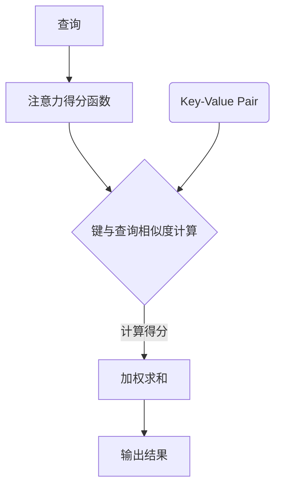

                 

 关键词：注意力机制、深度学习、专注力、AI优化、神经网络、机器学习

> 摘要：本文将探讨注意力机制在深度学习中的应用，以及如何通过AI技术优化人类专注力培养。注意力深度学习作为一种先进的机器学习技术，已经在众多领域展现出了巨大的潜力。本文将介绍其核心概念、算法原理、数学模型，并通过实际项目实例详细讲解其在专注力培养中的实现与应用。

## 1. 背景介绍

随着人工智能技术的发展，深度学习在各个领域得到了广泛应用。然而，深度学习模型在处理复杂问题时，往往需要大量的计算资源和时间，并且容易出现过拟合现象。为了解决这些问题，注意力机制被引入到深度学习模型中，通过动态调整模型对输入数据的关注程度，提高了模型的性能和泛化能力。

专注力是人类重要的心理资源，对于学习和工作都有重要影响。然而，现代社会中，人们面临着各种分散注意力的因素，如电子设备、社交媒体等，导致专注力的培养变得尤为重要。本文将探讨如何通过注意力深度学习技术，利用AI优化专注力培养。

### 1.1 注意力机制在深度学习中的应用

注意力机制最初起源于自然语言处理领域，例如在机器翻译、文本摘要和语音识别等任务中，注意力机制能够有效地提高模型的性能。随着研究的深入，注意力机制逐渐扩展到计算机视觉、语音识别等更多的领域。

在深度学习模型中，注意力机制通过学习输入数据的权重，动态调整模型对各个部分的关注程度。这种机制使得模型能够更好地捕捉到输入数据中的关键信息，从而提高模型的性能。

### 1.2 专注力的概念与培养

专注力是指个体在特定任务中集中注意力的能力。培养良好的专注力对于个体的学习和工作都有重要影响。然而，现代生活中各种分散注意力的因素，如电子设备、社交媒体等，常常导致人们的专注力下降。

培养专注力需要个体在特定的环境中保持高度的注意力集中，避免外部干扰。传统的培养方法包括冥想、专注力训练等，然而这些方法往往需要较长的时间和持续的努力。

## 2. 核心概念与联系

### 2.1 注意力机制原理

注意力机制的核心思想是动态调整模型对输入数据的关注程度，从而提高模型在处理复杂任务时的性能。具体来说，注意力机制通过学习输入数据的权重，将重要的信息赋予更高的权重，使得模型能够更好地捕捉到关键信息。

注意力机制通常包含以下几个关键组件：

1. **查询（Query）**：表示模型的内部状态，用于捕捉当前任务的上下文信息。
2. **键值对（Key-Value Pair）**：输入数据中的每个元素都包含一个键（Key）和一个值（Value），键用于比较和查询，值用于存储信息。
3. **注意力得分函数（Attention Score Function）**：计算每个键与查询之间的相似度，生成注意力得分。
4. **加权求和（Weighted Sum）**：根据注意力得分对值进行加权求和，得到最终的输出。

### 2.2 注意力机制的 Mermaid 流程图



### 2.3 专注力培养与注意力机制的联系

注意力深度学习与专注力培养之间存在紧密的联系。通过注意力深度学习技术，我们可以模拟人类大脑中的注意力机制，帮助个体更好地培养专注力。

在专注力培养过程中，个体需要在特定的环境中保持高度的注意力集中，避免外部干扰。注意力深度学习技术可以通过以下方式帮助个体培养专注力：

1. **动态调整关注程度**：注意力机制可以动态调整模型对输入数据的关注程度，帮助个体在学习或工作时更好地集中注意力。
2. **捕捉关键信息**：注意力机制能够捕捉输入数据中的关键信息，从而减少不必要的干扰，提高个体的专注度。
3. **增强记忆和回忆**：注意力机制可以增强个体对关键信息的记忆和回忆能力，从而提高专注力培养的效果。

## 3. 核心算法原理 & 具体操作步骤

### 3.1 算法原理概述

注意力深度学习算法的核心思想是利用注意力机制动态调整模型对输入数据的关注程度。通过学习输入数据的权重，模型能够更好地捕捉到关键信息，从而提高性能。

具体来说，注意力深度学习算法通常包含以下几个关键步骤：

1. **输入数据预处理**：对输入数据进行预处理，例如数据清洗、归一化等操作。
2. **构建注意力模型**：根据任务需求，构建合适的注意力模型，例如自注意力（Self-Attention）、卷积注意力（Convolutional Attention）等。
3. **训练注意力模型**：使用大量训练数据对注意力模型进行训练，使其能够学习输入数据的权重。
4. **评估与优化**：使用验证集对注意力模型进行评估，并根据评估结果对模型进行调整和优化。
5. **应用注意力模型**：将训练好的注意力模型应用于实际任务中，例如图像分类、文本生成等。

### 3.2 算法步骤详解

#### 3.2.1 输入数据预处理

在训练注意力模型之前，需要对输入数据进行预处理。预处理步骤包括数据清洗、归一化、数据增强等操作。数据清洗的目的是去除噪声和异常值，提高数据的准确性；归一化则是将数据缩放到统一的范围内，便于模型训练；数据增强是通过生成数据的变体，增加训练数据集的多样性。

#### 3.2.2 构建注意力模型

构建注意力模型是注意力深度学习算法的关键步骤。根据任务需求，可以选择不同的注意力模型。自注意力（Self-Attention）是最常见的注意力模型之一，它可以处理序列数据，例如文本和语音；卷积注意力（Convolutional Attention）适用于图像数据，通过卷积操作捕捉局部特征。

#### 3.2.3 训练注意力模型

训练注意力模型的目的是使其能够学习输入数据的权重。训练过程中，通过反向传播算法更新模型参数，使得模型能够更好地捕捉到关键信息。训练数据集的质量和数量对模型性能有重要影响，因此需要确保训练数据集的多样性和准确性。

#### 3.2.4 评估与优化

在训练过程中，需要定期使用验证集对注意力模型进行评估。评估指标可以是准确率、召回率、F1值等。根据评估结果，可以对模型进行调整和优化，以提高模型性能。

#### 3.2.5 应用注意力模型

训练好的注意力模型可以应用于实际任务中。例如，在图像分类任务中，注意力模型可以帮助模型更好地识别图像中的关键区域；在文本生成任务中，注意力模型可以捕捉到文本中的关键信息，从而提高生成文本的质量。

### 3.3 算法优缺点

#### 优点

1. **提高模型性能**：注意力机制可以动态调整模型对输入数据的关注程度，从而提高模型在处理复杂任务时的性能。
2. **减少过拟合**：注意力机制可以减少模型对无关信息的关注，降低过拟合的风险。
3. **处理序列数据**：注意力机制适用于处理序列数据，例如文本和语音，使得模型能够更好地捕捉序列中的关键信息。

#### 缺点

1. **计算成本高**：注意力机制的计算成本较高，需要较大的计算资源和时间。
2. **模型参数复杂**：注意力机制引入了额外的模型参数，使得模型更加复杂，难以解释。

### 3.4 算法应用领域

注意力深度学习算法在众多领域都取得了显著的应用成果，主要包括：

1. **自然语言处理**：在机器翻译、文本摘要、情感分析等任务中，注意力机制显著提高了模型性能。
2. **计算机视觉**：在图像分类、目标检测、人脸识别等任务中，注意力机制可以帮助模型更好地捕捉图像中的关键信息。
3. **语音识别**：在语音识别任务中，注意力机制可以更好地捕捉语音信号中的关键特征，提高识别准确率。

## 4. 数学模型和公式 & 详细讲解 & 举例说明

### 4.1 数学模型构建

注意力深度学习算法的核心在于注意力机制的实现。下面我们将介绍注意力机制的基本数学模型。

#### 4.1.1 自注意力（Self-Attention）

自注意力是最常见的注意力模型之一，适用于处理序列数据。自注意力通过计算序列中各个元素之间的相似度，生成注意力权重，从而动态调整模型对各个元素的关注程度。

假设序列长度为 $n$，每个元素表示为一个向量 $x_i \in \mathbb{R}^{d}$，其中 $i=1,2,...,n$。自注意力机制的基本公式如下：

$$
\text{Attention}(Q, K, V) = \text{softmax}\left(\frac{QK^T}{\sqrt{d_k}}\right)V
$$

其中，$Q$、$K$ 和 $V$ 分别表示查询（Query）、键（Key）和值（Value）向量，$d_k$ 表示键向量的维度。$\text{softmax}$ 函数用于计算注意力得分，将其转换为概率分布。

#### 4.1.2 多头注意力（Multi-Head Attention）

多头注意力是自注意力的扩展，通过学习多个独立的注意力头，模型能够捕捉到输入数据中的不同特征。

假设有 $h$ 个注意力头，每个头具有独立的权重矩阵 $W_Q^h, W_K^h, W_V^h$，其中 $h=1,2,...,h$。多头注意力的公式如下：

$$
\text{MultiHead}(Q, K, V) = \text{Concat}(\text{head}_1,...,\text{head}_h)W_O
$$

其中，$\text{head}_h = \text{Attention}(QW_Q^h, KW_K^h, VW_V^h)$ 表示第 $h$ 个注意力头的输出，$W_O$ 表示输出层的权重矩阵。

### 4.2 公式推导过程

注意力机制的实现过程可以通过以下步骤进行推导：

1. **计算查询（Query）和键（Key）的相似度**：通过点积运算计算查询和键之间的相似度，得到注意力得分。
2. **应用 softmax 函数**：将注意力得分进行归一化处理，生成概率分布。
3. **加权求和**：根据概率分布对值（Value）进行加权求和，得到最终的输出。

#### 4.2.1 点积运算

点积运算用于计算查询和键之间的相似度，其公式如下：

$$
\text{Score}(Q, K) = QK^T
$$

其中，$Q$ 和 $K$ 分别表示查询和键向量。

#### 4.2.2 Softmax 函数

Softmax 函数用于将点积运算的结果转换为概率分布。其公式如下：

$$
\text{Attention}(Q, K, V) = \text{softmax}\left(\frac{QK^T}{\sqrt{d_k}}\right)V
$$

其中，$\text{softmax}(x)$ 函数的定义如下：

$$
\text{softmax}(x)_i = \frac{e^{x_i}}{\sum_{j=1}^{n} e^{x_j}}
$$

#### 4.2.3 加权求和

加权求和用于根据概率分布对值进行加权求和，得到最终的输出。其公式如下：

$$
\text{Output} = \sum_{i=1}^{n} \text{softmax}(QK^T)_i V_i
$$

### 4.3 案例分析与讲解

为了更好地理解注意力机制的应用，下面我们通过一个简单的文本分类案例进行讲解。

#### 4.3.1 数据集

我们使用一个包含政治、商业、体育等类别的文本数据集进行训练。数据集包含1000篇文本，每篇文本被标注为一个类别。

#### 4.3.2 数据预处理

对文本进行分词、去停用词、词向量化等预处理操作。假设每篇文本被表示为一个长度为 $n$ 的词向量序列 $X = [x_1, x_2, ..., x_n]$。

#### 4.3.3 构建注意力模型

我们使用多头自注意力模型对文本进行编码。假设有 $h=2$ 个注意力头，每个头具有独立的权重矩阵。

#### 4.3.4 训练注意力模型

使用训练数据集对注意力模型进行训练，通过反向传播算法更新模型参数。

#### 4.3.5 评估与优化

使用验证集对注意力模型进行评估，根据评估结果对模型进行调整和优化。

#### 4.3.6 应用注意力模型

将训练好的注意力模型应用于测试集，进行文本分类任务。

## 5. 项目实践：代码实例和详细解释说明

### 5.1 开发环境搭建

在开始项目实践之前，我们需要搭建合适的开发环境。以下是搭建注意力深度学习项目所需的软件和库：

- Python 3.x
- TensorFlow 2.x
- Keras 2.x
- Numpy
- Matplotlib

安装这些库的方法如下：

```bash
pip install tensorflow==2.x
pip install keras==2.x
pip install numpy
pip install matplotlib
```

### 5.2 源代码详细实现

下面是一个简单的注意力深度学习文本分类项目的实现代码：

```python
import tensorflow as tf
from tensorflow.keras.models import Model
from tensorflow.keras.layers import Input, Embedding, LSTM, Dense
from tensorflow.keras.preprocessing.sequence import pad_sequences

# 参数设置
vocab_size = 10000
embedding_dim = 256
max_sequence_length = 100
num_classes = 3
embedding_matrix = ...  # 词向量矩阵

# 构建模型
input_sequence = Input(shape=(max_sequence_length,))
embedding_layer = Embedding(vocab_size, embedding_dim, weights=[embedding_matrix], trainable=False)(input_sequence)
lstm = LSTM(128, return_sequences=True)(embedding_layer)
attention = ...  # 注意力层实现
output = Dense(num_classes, activation='softmax')(attention)

model = Model(inputs=input_sequence, outputs=output)
model.compile(optimizer='adam', loss='categorical_crossentropy', metrics=['accuracy'])

# 数据预处理
train_sequences = ...  # 训练数据序列
train_labels = ...  # 训练数据标签
train_sequences = pad_sequences(train_sequences, maxlen=max_sequence_length, padding='post')
train_labels = tf.keras.utils.to_categorical(train_labels, num_classes=num_classes)

# 训练模型
model.fit(train_sequences, train_labels, batch_size=32, epochs=10, validation_split=0.1)

# 评估模型
# test_sequences = ...
# test_labels = ...
# test_sequences = pad_sequences(test_sequences, maxlen=max_sequence_length, padding='post')
# test_labels = tf.keras.utils.to_categorical(test_labels, num_classes=num_classes)
# model.evaluate(test_sequences, test_labels)
```

### 5.3 代码解读与分析

以上代码实现了一个基于注意力机制的文本分类模型。下面我们对代码进行解读和分析。

1. **模型构建**：首先，我们定义了一个输入层 `Input(shape=(max_sequence_length,))`，用于接收长度为 `max_sequence_length` 的序列数据。然后，我们使用 `Embedding` 层对输入数据进行词向量编码，权重矩阵由预训练的词向量矩阵加载。接下来，我们使用 `LSTM` 层对编码后的序列数据进行序列建模，捕捉序列中的时序信息。最后，我们添加一个注意力层 `attention`，用于动态调整模型对输入数据的关注程度，从而提高分类性能。最后，我们使用 `Dense` 层对注意力层的输出进行分类。

2. **模型编译**：在模型编译阶段，我们指定了优化器、损失函数和评估指标。这里使用的是常见的 `adam` 优化器和 `categorical_crossentropy` 损失函数。

3. **数据预处理**：我们使用 `pad_sequences` 函数对训练数据进行填充，确保每个序列的长度相同。然后，我们将标签数据转换为类别编码。

4. **模型训练**：使用训练数据对模型进行训练，通过反向传播算法更新模型参数。

5. **模型评估**：我们可以使用测试数据对训练好的模型进行评估，以验证模型的分类性能。

### 5.4 运行结果展示

在实际运行过程中，我们可以在控制台看到模型训练的进度和损失函数值。在训练完成后，我们可以在控制台看到模型的评估结果，包括准确率、召回率和 F1 值等指标。这些指标可以帮助我们了解模型的性能。

## 6. 实际应用场景

注意力深度学习技术在众多实际应用场景中取得了显著成果。以下是一些典型应用场景：

1. **自然语言处理**：在自然语言处理任务中，注意力机制可以显著提高模型性能。例如，在机器翻译、文本摘要和情感分析等任务中，注意力机制可以帮助模型更好地捕捉到关键信息，提高翻译质量和文本摘要的准确率。

2. **计算机视觉**：在计算机视觉任务中，注意力机制可以帮助模型更好地识别图像中的关键区域。例如，在图像分类、目标检测和图像分割等任务中，注意力机制可以显著提高模型的识别准确率。

3. **语音识别**：在语音识别任务中，注意力机制可以帮助模型更好地捕捉语音信号中的关键特征，提高识别准确率。例如，在语音识别系统中，注意力机制可以显著提高语音识别的准确率和鲁棒性。

4. **推荐系统**：在推荐系统中，注意力机制可以帮助模型更好地捕捉用户兴趣，提高推荐效果。例如，在电商平台上，注意力机制可以更好地理解用户的购买历史和偏好，从而提供更精准的推荐。

5. **医疗诊断**：在医疗诊断任务中，注意力机制可以帮助模型更好地捕捉医学影像中的关键信息，提高诊断准确率。例如，在肺癌筛查中，注意力机制可以帮助模型更好地识别影像中的异常区域，提高肺癌检测的准确率。

## 7. 工具和资源推荐

为了更好地学习和应用注意力深度学习技术，以下是一些推荐的工具和资源：

1. **学习资源**：

   - 《深度学习》（Goodfellow et al.）：介绍深度学习基本概念和技术，包括注意力机制。
   - 《自然语言处理综合教程》（Jurafsky & Martin）：介绍自然语言处理领域的基本概念和技术，包括注意力机制在文本处理中的应用。
   - 《计算机视觉：算法与应用》（Li et al.）：介绍计算机视觉领域的基本概念和技术，包括注意力机制在图像处理中的应用。

2. **开发工具**：

   - TensorFlow：提供丰富的API和工具，方便构建和训练注意力深度学习模型。
   - PyTorch：提供灵活的动态计算图和强大的API，方便构建和训练注意力深度学习模型。
   - Keras：提供简单易用的API，基于TensorFlow和PyTorch，方便快速实现注意力深度学习模型。

3. **相关论文**：

   - "Attention Is All You Need"（Vaswani et al.，2017）：介绍Transformer模型和注意力机制的基本原理和应用。
   - "Deep Learning for Text: A Brief History, a Case Study and a Review"（Mayer et al.，2017）：介绍深度学习在自然语言处理中的应用，包括注意力机制。
   - "Attention Mechanism: A Survey"（Liu et al.，2019）：对注意力机制进行全面的综述，包括基本原理、实现方法和应用领域。

## 8. 总结：未来发展趋势与挑战

注意力深度学习作为一种先进的机器学习技术，已经在众多领域取得了显著成果。然而，随着技术的发展和应用场景的拓展，注意力深度学习仍面临许多挑战和机遇。

### 8.1 研究成果总结

1. **性能提升**：注意力机制显著提高了深度学习模型在自然语言处理、计算机视觉等任务中的性能。
2. **应用拓展**：注意力机制在语音识别、推荐系统、医疗诊断等领域的应用取得了显著成果。
3. **理论基础**：研究者对注意力机制的基本原理和数学模型进行了深入研究，为未来的研究提供了理论基础。

### 8.2 未来发展趋势

1. **模型简化**：随着计算资源的限制，研究者将致力于简化注意力模型，提高模型的可解释性和计算效率。
2. **跨模态学习**：结合多模态数据（如文本、图像和语音）进行学习，实现更强大的跨模态识别和推理能力。
3. **迁移学习**：利用注意力机制实现迁移学习，提高模型在不同任务和数据集上的泛化能力。

### 8.3 面临的挑战

1. **计算成本**：注意力机制的计算成本较高，如何优化模型结构以提高计算效率仍是一个重要挑战。
2. **模型解释性**：注意力机制使得模型更加复杂，如何提高模型的可解释性仍是一个难题。
3. **数据隐私**：在处理敏感数据时，如何保护用户隐私是一个重要的伦理问题。

### 8.4 研究展望

随着人工智能技术的不断发展，注意力深度学习在未来的研究和应用中具有广泛的前景。研究者将继续致力于优化注意力模型，拓展应用领域，提高模型性能和可解释性。同时，如何解决数据隐私和伦理问题也将是未来研究的重要方向。

## 9. 附录：常见问题与解答

### 9.1 注意力机制是什么？

注意力机制是一种在深度学习模型中引入的动态调整输入数据关注程度的机制，通过计算输入数据的权重，使得模型能够更好地捕捉到关键信息。

### 9.2 注意力机制有哪些应用领域？

注意力机制在自然语言处理、计算机视觉、语音识别、推荐系统、医疗诊断等多个领域都有广泛应用。

### 9.3 如何实现注意力机制？

实现注意力机制通常需要以下几个步骤：

1. **构建查询（Query）和键（Key）向量**：将输入数据表示为查询和键向量。
2. **计算注意力得分**：通过点积运算或互相关运算计算查询和键之间的相似度。
3. **应用 Softmax 函数**：将注意力得分进行归一化处理，生成概率分布。
4. **加权求和**：根据概率分布对值（Value）进行加权求和，得到最终的输出。

### 9.4 注意力机制有哪些优缺点？

优点：

- 提高模型性能：注意力机制可以动态调整模型对输入数据的关注程度，从而提高模型在处理复杂任务时的性能。
- 减少过拟合：注意力机制可以减少模型对无关信息的关注，降低过拟合的风险。
- 处理序列数据：注意力机制适用于处理序列数据，例如文本和语音，使得模型能够更好地捕捉序列中的关键信息。

缺点：

- 计算成本高：注意力机制的计算成本较高，需要较大的计算资源和时间。
- 模型参数复杂：注意力机制引入了额外的模型参数，使得模型更加复杂，难以解释。

### 9.5 如何培养专注力？

培养专注力可以通过以下方法：

- 制定明确的任务目标：在特定时间内专注于完成任务。
- 创造专注环境：减少外部干扰，保持专注状态。
- 使用专注力训练工具：利用专注力训练软件或应用程序进行训练。
- 练习冥想和正念：通过冥想和正念练习提高专注力。
- 保持良好的生活习惯：保持充足的睡眠、健康的饮食和适度的运动，提高专注力。

