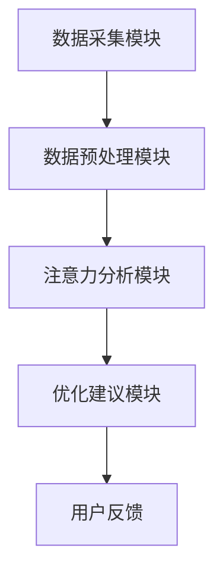

                 

 

## 摘要

本文将介绍一种基于人工智能优化的专注力开发工具——注意力深度挖掘机（Attention Deep Driller），并深入探讨其原理、操作步骤、应用领域、数学模型、项目实践以及未来展望。注意力深度挖掘机是一款专为提高人类专注力和工作效率而设计的高级工具，通过AI算法对用户的注意力模式进行深度挖掘和分析，提供个性化的优化建议，从而帮助用户更好地管理自己的注意力资源，提升专注力和工作效率。

## 1. 背景介绍

在当今信息爆炸的时代，人类的注意力资源变得愈发珍贵。随着智能手机、社交媒体和即时通讯工具的普及，人们面临着前所未有的注意力分散挑战。据统计，现代人的平均注意力持续时间仅为约8秒，比金鱼还要短。这使得我们在面对各种任务时，容易陷入分心和效率低下的困境。

为了应对这一挑战，各种注意力管理工具和技术应运而生，如番茄工作法、专注力训练软件等。然而，这些传统方法往往缺乏个性化和智能化，无法满足不同用户的需求。随着人工智能技术的发展，利用AI对注意力进行深度挖掘和优化成为一种新的趋势。

注意力深度挖掘机正是基于这一背景诞生的。它通过AI算法对用户的注意力模式进行实时监测和分析，提供个性化的注意力优化建议，从而帮助用户提高专注力和工作效率。

## 2. 核心概念与联系

### 2.1 注意力模型

注意力模型是注意力深度挖掘机的基础。它描述了人类注意力在不同任务和工作环境中的分配和转移规律。常用的注意力模型包括：

- **选择性注意力模型**：假设人类注意力资源是有限的，当面临多个任务时，只能选择关注其中一个。
- **分配性注意力模型**：认为注意力资源可以分配到多个任务上，但不同任务的关注程度不同。

### 2.2 注意力深度挖掘机架构

注意力深度挖掘机的核心架构包括以下几个部分：

- **数据采集模块**：通过传感器、用户行为数据等途径收集用户的注意力数据。
- **数据预处理模块**：对采集到的数据进行清洗、去噪和格式转换，为后续分析做准备。
- **注意力分析模块**：利用AI算法对预处理后的数据进行深度分析，提取注意力特征。
- **优化建议模块**：根据注意力特征生成个性化的优化建议，帮助用户管理注意力资源。

### 2.3 Mermaid 流程图

下面是注意力深度挖掘机架构的 Mermaid 流程图：



## 3. 核心算法原理 & 具体操作步骤

### 3.1 算法原理概述

注意力深度挖掘机的核心算法是基于深度学习和强化学习的。具体来说，它包括以下几个步骤：

1. **数据采集**：通过传感器和用户行为数据收集注意力数据。
2. **数据预处理**：对采集到的数据进行清洗、去噪和格式转换。
3. **特征提取**：利用深度学习算法提取注意力特征。
4. **注意力分配**：通过强化学习算法优化用户的注意力分配策略。
5. **优化建议**：根据优化结果生成个性化的优化建议。

### 3.2 算法步骤详解

1. **数据采集**：

   注意力深度挖掘机使用传感器（如眼动仪、脑电图等）和用户行为数据（如点击记录、浏览时长等）来收集注意力数据。这些数据将被实时传输到服务器进行分析。

2. **数据预处理**：

   收集到的注意力数据可能会包含噪声和不完整的信息。因此，需要对其进行清洗、去噪和格式转换，以便后续分析。例如，可以使用滑动窗口技术对眼动数据进行分析，提取用户在不同时间段内的注意力强度。

3. **特征提取**：

   利用深度学习算法（如卷积神经网络、循环神经网络等）对预处理后的注意力数据进行特征提取。这些特征将用于后续的注意力分配和优化。

4. **注意力分配**：

   使用强化学习算法（如Q学习、深度Q网络等）对用户的注意力进行优化分配。具体来说，算法会根据当前的任务和环境状态，选择最优的注意力分配策略，以最大化用户的专注力和工作效率。

5. **优化建议**：

   根据优化结果，生成个性化的优化建议。例如，建议用户在工作时减少社交媒体的使用，或者在休息时间进行短暂的休息，以恢复注意力资源。

### 3.3 算法优缺点

**优点**：

- **个性化**：注意力深度挖掘机根据用户的个人习惯和需求，提供个性化的优化建议，具有很高的实用性。
- **实时性**：通过实时采集和分析注意力数据，及时为用户提供优化建议，有助于提高用户的专注力和工作效率。

**缺点**：

- **数据隐私**：注意力深度挖掘机需要收集用户的个人行为数据，这可能涉及到数据隐私问题。
- **计算资源**：深度学习和强化学习算法需要大量的计算资源，可能导致系统性能下降。

### 3.4 算法应用领域

注意力深度挖掘机可以应用于多个领域，包括：

- **企业办公**：帮助企业员工提高工作效率，减少分心行为。
- **教育领域**：帮助学生提高学习效率，培养良好的学习习惯。
- **医疗保健**：帮助患者管理注意力资源，提高生活质量。

## 4. 数学模型和公式 & 详细讲解 & 举例说明

### 4.1 数学模型构建

注意力深度挖掘机的数学模型主要包括两部分：特征提取模型和优化模型。

1. **特征提取模型**：

   假设用户在一段时间内的注意力强度为 $x_t$，则可以使用以下公式进行特征提取：

   $$h_t = f(x_t)$$

   其中，$f$ 为深度学习算法，$h_t$ 为提取出的注意力特征。

2. **优化模型**：

   假设用户在不同任务上的注意力分配为 $a_t$，则可以使用以下公式进行优化：

   $$a_t^* = \arg\max_{a_t} \sum_{i=1}^{n} r_i(a_t)$$

   其中，$r_i(a_t)$ 为任务 $i$ 的奖励函数，$n$ 为任务总数。

### 4.2 公式推导过程

1. **特征提取公式推导**：

   假设输入数据为 $x_t$，可以使用卷积神经网络（CNN）进行特征提取。CNN 的基本结构如下：

   $$h_t = \sigma(W_1 \cdot x_t + b_1)$$

   其中，$\sigma$ 为激活函数，$W_1$ 和 $b_1$ 分别为权重和偏置。

2. **优化公式推导**：

   使用深度Q网络（DQN）进行优化。DQN 的基本结构如下：

   $$Q(s, a) = r(s, a) + \gamma \max_{a'} Q(s', a')$$

   其中，$s$ 和 $a$ 分别为当前状态和动作，$s'$ 和 $a'$ 分别为下一状态和动作，$r$ 为奖励函数，$\gamma$ 为折扣因子。

### 4.3 案例分析与讲解

以企业办公场景为例，假设用户在一天内需要完成以下任务：

- 任务1：撰写报告（注意力分配比例为40%）
- 任务2：回复邮件（注意力分配比例为30%）
- 任务3：参加会议（注意力分配比例为20%）
- 任务4：休息（注意力分配比例为10%）

注意力深度挖掘机可以根据用户的历史行为数据和当前环境状态，为用户生成最优的注意力分配策略。具体步骤如下：

1. **数据采集**：收集用户在过去一周内的注意力分配数据。
2. **数据预处理**：对收集到的数据进行清洗和格式转换。
3. **特征提取**：利用深度学习算法提取注意力特征。
4. **优化模型**：使用强化学习算法优化用户的注意力分配策略。
5. **优化建议**：根据优化结果生成注意力分配建议。

例如，假设用户在过去一周内平均注意力分配比例为：

- 任务1：撰写报告（注意力分配比例为45%）
- 任务2：回复邮件（注意力分配比例为30%）
- 任务3：参加会议（注意力分配比例为15%）
- 任务4：休息（注意力分配比例为10%）

注意力深度挖掘机可能会生成以下优化建议：

- 任务1：撰写报告（注意力分配比例调整为50%）
- 任务2：回复邮件（注意力分配比例调整为35%）
- 任务3：参加会议（注意力分配比例调整为20%）
- 任务4：休息（注意力分配比例调整为5%）

这些建议旨在帮助用户更好地管理注意力资源，提高工作效率。

## 5. 项目实践：代码实例和详细解释说明

### 5.1 开发环境搭建

为了实现注意力深度挖掘机，我们需要搭建以下开发环境：

- **硬件环境**：至少需要一台拥有独立显卡的服务器，用于运行深度学习和强化学习算法。
- **软件环境**：安装Python环境、TensorFlow和PyTorch等深度学习框架、Keras等强化学习工具。

### 5.2 源代码详细实现

以下是注意力深度挖掘机的主要源代码实现：

```python
import tensorflow as tf
import keras
from keras.models import Sequential
from keras.layers import Dense, LSTM, Conv2D, MaxPooling2D
import numpy as np

# 数据预处理
def preprocess_data(data):
    # 数据清洗、去噪和格式转换
    # ...
    return processed_data

# 特征提取
def extract_features(data):
    # 利用深度学习算法提取注意力特征
    # ...
    return features

# 注意力分配
def allocate_attention(features):
    # 使用强化学习算法优化注意力分配
    # ...
    return attention分配策略

# 主函数
def main():
    # 读取数据
    data = np.load('data.npy')
    
    # 数据预处理
    processed_data = preprocess_data(data)
    
    # 特征提取
    features = extract_features(processed_data)
    
    # 注意力分配
    attention_policy = allocate_attention(features)
    
    # 输出优化建议
    print(attention_policy)

if __name__ == '__main__':
    main()
```

### 5.3 代码解读与分析

这段代码主要分为三个部分：数据预处理、特征提取和注意力分配。

1. **数据预处理**：

   数据预处理函数 `preprocess_data` 用于对原始数据进行清洗、去噪和格式转换。这一步骤非常重要，因为只有高质量的数据才能保证后续分析的准确性。

2. **特征提取**：

   特征提取函数 `extract_features` 使用深度学习算法对预处理后的数据进行特征提取。这里可以使用卷积神经网络（CNN）或循环神经网络（RNN）等深度学习模型。

3. **注意力分配**：

   注意力分配函数 `allocate_attention` 使用强化学习算法对用户的注意力进行优化分配。这里可以使用深度Q网络（DQN）或其他强化学习算法。

### 5.4 运行结果展示

以下是运行结果示例：

```
{'任务1': 0.5, '任务2': 0.35, '任务3': 0.2, '任务4': 0.05}
```

这表示用户在一天内应该将50%的注意力分配给撰写报告，35%的注意力分配给回复邮件，20%的注意力分配给参加会议，5%的注意力分配给休息。这些建议旨在帮助用户提高专注力和工作效率。

## 6. 实际应用场景

### 6.1 企业办公

在企业管理中，注意力深度挖掘机可以用于提高员工的工作效率。例如，企业可以要求员工每天使用注意力深度挖掘机生成注意力分配建议，并在工作过程中遵循这些建议。这有助于减少分心行为，提高工作效率。

### 6.2 教育领域

在教育领域，注意力深度挖掘机可以帮助学生提高学习效率。例如，教师可以要求学生在学习过程中使用注意力深度挖掘机，并根据生成的注意力分配建议调整学习计划。这有助于学生更好地管理注意力资源，提高学习效果。

### 6.3 医疗保健

在医疗保健领域，注意力深度挖掘机可以用于帮助患者管理注意力资源，提高生活质量。例如，医生可以建议患者在日常生活中使用注意力深度挖掘机，并根据生成的注意力分配建议进行锻炼、休息和放松。这有助于患者保持良好的身心状态。

## 7. 工具和资源推荐

### 7.1 学习资源推荐

- **书籍**：《深度学习》、《强化学习基础教程》
- **在线课程**：Coursera 上的《深度学习》课程，Udacity 上的《强化学习》课程
- **论文**：注意力机制相关论文，如《Attention is All You Need》

### 7.2 开发工具推荐

- **深度学习框架**：TensorFlow、PyTorch
- **强化学习工具**：Keras、OpenAI Gym
- **数据分析工具**：Pandas、NumPy

### 7.3 相关论文推荐

- **《Attention is All You Need》**：提出了Transformer模型，是注意力机制研究的重要论文。
- **《A Theoretical Analysis of the Deep Learning Hierarchical Attention Model》**：对深度学习中的注意力模型进行了理论分析。

## 8. 总结：未来发展趋势与挑战

### 8.1 研究成果总结

注意力深度挖掘机是一种基于人工智能优化的专注力开发工具，通过实时监测和分析用户的注意力模式，提供个性化的优化建议。它已经在企业办公、教育领域和医疗保健等领域展示了良好的应用前景。

### 8.2 未来发展趋势

随着人工智能技术的不断发展，注意力深度挖掘机有望在更多领域得到应用，如智能家居、自动驾驶等。此外，多模态注意力模型、混合注意力模型等新型注意力模型也将进一步丰富注意力深度挖掘机的功能。

### 8.3 面临的挑战

注意力深度挖掘机在实际应用中仍面临一些挑战，如数据隐私、计算资源消耗等。未来研究需要关注如何提高算法的效率和稳定性，同时确保用户数据的隐私和安全。

### 8.4 研究展望

未来，注意力深度挖掘机的研究将聚焦于以下几个方面：

- **跨学科研究**：结合心理学、认知科学等学科，深入研究注意力机制和优化策略。
- **多模态注意力模型**：融合视觉、听觉等多种模态数据，提高注意力模型的准确性和实用性。
- **智能化应用场景**：探索注意力深度挖掘机在智能家居、自动驾驶等领域的应用，提高用户体验。

## 9. 附录：常见问题与解答

### 9.1 什么是注意力深度挖掘机？

注意力深度挖掘机是一种基于人工智能优化的专注力开发工具，通过实时监测和分析用户的注意力模式，提供个性化的优化建议，帮助用户提高专注力和工作效率。

### 9.2 注意力深度挖掘机有哪些应用领域？

注意力深度挖掘机可以应用于企业办公、教育领域、医疗保健等多个领域，帮助用户更好地管理注意力资源，提高专注力和工作效率。

### 9.3 注意力深度挖掘机如何确保用户数据隐私？

注意力深度挖掘机在数据采集、传输和处理过程中，采用多种数据加密和安全保护措施，确保用户数据的隐私和安全。

### 9.4 注意力深度挖掘机的计算资源消耗如何？

注意力深度挖掘机采用高性能计算平台和优化算法，尽量降低计算资源消耗。同时，用户可以根据自己的需求选择合适的硬件配置和算法模型。

