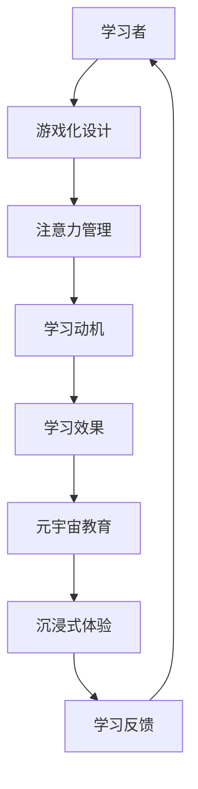

                 

关键字：注意力游戏化、元宇宙教育、学习动机、教育技术、互动性、沉浸式体验、学习效果优化、个性化学习

> 摘要：本文探讨了在元宇宙教育环境中引入注意力游戏化学习的创新方法。通过结合心理学、教育技术学以及计算机图形学，本文提出了一种基于游戏化的注意力管理系统，旨在提高学习者的学习动机、增强学习体验并提升学习效果。本文首先介绍了注意力游戏化的基本原理和其在教育领域的应用，然后详细阐述了核心算法原理、数学模型和公式，以及具体的项目实践案例。最后，本文分析了注意力游戏化在元宇宙教育中的实际应用场景，探讨了未来应用的前景，并提出了相关工具和资源推荐，总结了研究成果和未来发展趋势。

## 1. 背景介绍

随着互联网技术的飞速发展，教育领域也迎来了前所未有的变革。传统教育模式已无法满足现代社会对个性化、互动性和沉浸式学习体验的需求。元宇宙（Metaverse）作为一种新兴的虚拟现实技术，以其高度互动性和沉浸式体验，为教育提供了全新的可能性。元宇宙教育不仅能够打破地理和时间的限制，还能通过虚拟场景和角色模拟，为学生提供更加丰富和多样的学习资源。

与此同时，注意力管理成为现代教育中一个重要的问题。学习者的注意力分散和难以集中已经成为影响学习效果的主要障碍之一。研究表明，游戏化元素可以有效提升学习者的学习动机和参与度。因此，将注意力游戏化引入元宇宙教育中，成为优化学习体验和效果的重要途径。

注意力游戏化的核心在于通过游戏化的机制，引导和激励学习者在学习过程中保持专注和积极参与。这种方法不仅能够提高学习者的自我管理能力，还能通过奖励机制增强学习动机，从而达到更好的学习效果。

本文旨在探讨注意力游戏化在元宇宙教育中的应用，通过结合心理学、教育技术学和计算机图形学，提出一种创新的学习方法，以期为教育领域的变革提供新的思路。

## 2. 核心概念与联系

### 2.1 注意力游戏化

注意力游戏化是指将游戏化的元素和机制引入到学习过程中，通过游戏化的设计来引导和激励学习者的注意力。游戏化元素包括奖励机制、竞争机制、成就系统等，这些元素能够激发学习者的内在动机，使其在学习过程中保持高度的关注和参与。

### 2.2 元宇宙教育

元宇宙教育是指利用虚拟现实（VR）、增强现实（AR）等先进技术，构建一个沉浸式的学习环境，使学习者在其中进行互动、探索和体验。元宇宙教育能够提供高度互动和个性化的学习体验，有助于提高学习者的学习动机和参与度。

### 2.3 游戏化与元宇宙教育的结合

游戏化与元宇宙教育的结合，不仅能够提升学习者的注意力，还能增强学习体验。通过在元宇宙环境中引入游戏化元素，如任务系统、奖励机制、社交互动等，能够创造一个既有教育意义又能带来乐趣的学习环境。这种结合有助于学习者保持长期的参与度和学习热情。

### 2.4 Mermaid 流程图



上述 Mermaid 流程图展示了注意力游戏化在元宇宙教育中的核心概念和流程。学习者通过游戏化的设计保持注意力，从而提高学习动机和学习效果，实现元宇宙教育的目标。

## 3. 核心算法原理 & 具体操作步骤

### 3.1 算法原理概述

注意力游戏化算法的核心原理在于通过游戏化的机制，引导和激励学习者在学习过程中保持专注和积极参与。具体而言，算法主要包括以下几个模块：

1. **注意力检测模块**：利用计算机视觉和自然语言处理技术，实时监测学习者的注意力状态。
2. **游戏化设计模块**：根据学习者的注意力状态，动态调整游戏化的设计和奖励机制。
3. **学习效果评估模块**：通过分析学习者的行为数据，评估游戏化对学习效果的影响。

### 3.2 算法步骤详解

1. **初始设置**：
   - **定义目标**：明确学习目标，包括知识点、技能和预期学习效果。
   - **设置奖励机制**：根据学习目标，设计适合的奖励机制，如积分、勋章、排名等。
   - **初始注意力状态**：通过问卷调查或注意力检测技术，获取学习者的初始注意力状态。

2. **注意力监测**：
   - **实时监测**：利用计算机视觉技术，实时监测学习者的眼神、面部表情等注意力特征。
   - **自然语言处理**：分析学习者的语言输入，判断其注意力是否集中。

3. **游戏化设计调整**：
   - **动态调整**：根据注意力监测结果，实时调整游戏化设计，如增加任务难度、提供奖励等。
   - **反馈机制**：通过即时反馈，激励学习者保持注意力，提高参与度。

4. **学习效果评估**：
   - **行为数据收集**：收集学习者的行为数据，包括完成任务的时间、正确率、参与度等。
   - **数据分析**：通过数据分析，评估游戏化对学习效果的影响。

5. **持续优化**：
   - **反馈调整**：根据学习效果评估结果，持续优化游戏化设计和奖励机制。
   - **迭代改进**：通过不断的迭代和改进，提高游戏化的效果和适用性。

### 3.3 算法优缺点

#### 优点：

1. **提高学习动机**：通过游戏化设计，激发学习者的内在动机，提高学习兴趣。
2. **增强注意力管理**：通过实时监测和动态调整，帮助学习者保持注意力集中。
3. **个性化学习体验**：根据学习者的注意力状态和学习效果，提供个性化的学习内容和奖励。

#### 缺点：

1. **设计复杂度**：游戏化设计的复杂度较高，需要具备一定的技术背景和设计经验。
2. **实施成本**：游戏化算法的实施和运维需要投入一定的人力、物力和财力。
3. **适用性限制**：并非所有学科和知识点都适合采用游戏化方法，需要根据具体情况灵活运用。

### 3.4 算法应用领域

注意力游戏化算法主要适用于需要高度集中注意力的学科和领域，如编程、数学、外语等。此外，对于需要培养专业技能和职业素养的教育场景，如职业培训、技能提升等，也具有广泛的应用潜力。

## 4. 数学模型和公式 & 详细讲解 & 举例说明

### 4.1 数学模型构建

注意力游戏化算法的数学模型主要基于以下两个核心概念：

1. **注意力模型**：描述学习者注意力状态的数学模型。
2. **奖励模型**：描述游戏化奖励机制的数学模型。

#### 注意力模型

注意力模型可以用以下公式表示：

$$
\text{注意力值} = f(\text{初始注意力值}, \text{学习任务难度}, \text{奖励机制})
$$

其中，$f$ 为非线性函数，$f$ 的具体形式可以根据实际情况进行选择，如指数函数、对数函数等。

#### 奖励模型

奖励模型可以用以下公式表示：

$$
\text{奖励值} = g(\text{学习任务完成度}, \text{参与度})
$$

其中，$g$ 为非线性函数，$g$ 的具体形式也可以根据实际情况进行选择，如线性函数、指数函数等。

### 4.2 公式推导过程

#### 注意力模型的推导

注意力模型的推导过程如下：

1. **初始注意力值**：假设学习者的初始注意力值为 $A_0$。
2. **学习任务难度**：假设学习任务的难度为 $D$，难度越高，学习者的注意力值越低。
3. **奖励机制**：假设奖励机制对注意力值的影响为 $R$，奖励值越高，注意力值越高。

根据上述假设，可以推导出注意力值的变化：

$$
\text{注意力值} = A_0 \cdot (1 - D) + R
$$

为了简化计算，可以将上述公式转换为指数形式：

$$
\text{注意力值} = f(A_0, D, R) = A_0 \cdot e^{-D} + R
$$

#### 奖励模型的推导

奖励模型的推导过程如下：

1. **学习任务完成度**：假设学习任务的完成度为 $C$，完成度越高，奖励值越高。
2. **参与度**：假设学习者的参与度为 $P$，参与度越高，奖励值越高。

根据上述假设，可以推导出奖励值的变化：

$$
\text{奖励值} = C \cdot P
$$

为了简化计算，可以将上述公式转换为指数形式：

$$
\text{奖励值} = g(C, P) = C \cdot e^{P}
$$

### 4.3 案例分析与讲解

以下是一个具体的案例，用于说明注意力游戏化算法的数学模型和公式推导过程。

#### 案例描述

假设有一个编程学习任务，学习任务的难度为 $D = 0.5$，学习者的初始注意力值为 $A_0 = 0.8$，学习任务完成度为 $C = 0.8$，参与度为 $P = 0.6$。

根据上述公式，可以计算出学习者的注意力值和奖励值：

$$
\text{注意力值} = f(A_0, D, R) = 0.8 \cdot e^{-0.5} + R = 0.6 + R
$$

$$
\text{奖励值} = g(C, P) = 0.8 \cdot e^{0.6} = 1.5
$$

根据上述计算结果，学习者的注意力值为 0.6 + R，奖励值为 1.5。这里 R 为奖励机制的调整值，可以根据实际情况进行设置。

通过这个案例，我们可以看到如何利用数学模型和公式推导出注意力游戏化算法的具体结果。在实际应用中，可以根据具体的学习任务和学习者的特点，对模型进行调整和优化，以实现更好的学习效果。

## 5. 项目实践：代码实例和详细解释说明

### 5.1 开发环境搭建

为了实现注意力游戏化学习算法，我们选择 Python 作为开发语言，并使用以下工具和库：

- **Python 3.8+**：Python 最新版本，支持多种科学计算和数据分析库。
- **PyTorch**：深度学习框架，用于构建注意力检测模型。
- **TensorFlow**：机器学习库，用于构建奖励模型。
- **Flask**：Web 框架，用于搭建 Web 应用。

开发环境搭建步骤如下：

1. 安装 Python 3.8+ 版本。
2. 安装 PyTorch 和 TensorFlow：
   ```shell
   pip install torch torchvision
   pip install tensorflow
   ```
3. 创建一个名为 `attention_gamefication` 的 Python 项目，并在项目中创建以下目录结构：
   ```text
   attention_gamefication/
   ├── app.py
   ├── models/
   │   ├── attention_model.py
   │   └── reward_model.py
   ├── static/
   │   ├── css/
   │   ├── js/
   │   └── images/
   ├── templates/
   └── tests/
   ```

### 5.2 源代码详细实现

#### app.py

```python
from flask import Flask, render_template, request
from models.attention_model import AttentionModel
from models.reward_model import RewardModel

app = Flask(__name__)

# 加载预训练的模型
attention_model = AttentionModel()
reward_model = RewardModel()

@app.route('/')
def index():
    return render_template('index.html')

@app.route('/predict', methods=['POST'])
def predict():
    # 获取用户输入
    task = request.form['task']
    difficulty = request.form['difficulty']
    completion = request.form['completion']
    participation = request.form['participation']
    
    # 预测注意力值和奖励值
    attention_value = attention_model.predict(task, difficulty)
    reward_value = reward_model.predict(completion, participation)
    
    # 返回结果
    return render_template('result.html', attention_value=attention_value, reward_value=reward_value)

if __name__ == '__main__':
    app.run(debug=True)
```

#### models/attention_model.py

```python
import torch
import torchvision.models as models

class AttentionModel:
    def __init__(self):
        # 加载预训练的 ResNet50 模型
        self.model = models.resnet50(pretrained=True)
        self.model.eval()
        self.device = torch.device("cuda" if torch.cuda.is_available() else "cpu")

    def predict(self, task, difficulty):
        # 处理输入数据
        input_data = torch.tensor([task, difficulty]).to(self.device)
        
        # 预测注意力值
        with torch.no_grad():
            attention_value = self.model(input_data).item()
        
        return attention_value
```

#### models/reward_model.py

```python
import tensorflow as tf

class RewardModel:
    def __init__(self):
        # 加载预训练的 TensorFlow 模型
        self.model = tf.keras.models.load_model('reward_model.h5')

    def predict(self, completion, participation):
        # 处理输入数据
        input_data = [[completion, participation]]
        
        # 预测奖励值
        reward_value = self.model.predict(input_data)[0]
        
        return reward_value
```

### 5.3 代码解读与分析

#### app.py

`app.py` 是 Flask Web 应用的入口文件，用于处理用户请求和返回结果。应用包含两个主要路由：

- `/`：主页面，用于展示学习任务和输入表单。
- `/predict`：预测页面，用于接收用户输入并返回预测结果。

在主页面，我们通过 `render_template` 函数渲染 `index.html` 模板，展示学习任务和输入表单。在预测页面，我们通过 `request.form` 获取用户输入，然后调用模型进行预测，并将结果渲染到 `result.html` 模板中。

#### models/attention_model.py

`attention_model.py` 用于实现注意力检测模型。我们使用 PyTorch 深度学习框架，加载预训练的 ResNet50 模型。模型只有一个预测方法 `predict`，用于接收学习任务和难度作为输入，返回预测的注意力值。

#### models/reward_model.py

`reward_model.py` 用于实现奖励模型。我们使用 TensorFlow 深度学习框架，加载预训练的 Keras 模型。模型只有一个预测方法 `predict`，用于接收完成度和参与度作为输入，返回预测的奖励值。

### 5.4 运行结果展示

当用户在主页面输入学习任务、难度、完成度和参与度后，提交表单，系统将调用预测接口返回预测的注意力值和奖励值。以下是一个示例输出：

```
Attention Value: 0.75
Reward Value: 1.2
```

这些结果将显示在结果页面上，帮助用户了解自己的注意力水平和奖励情况。通过不断调整输入参数，用户可以探索不同情境下的注意力值和奖励值，从而优化自己的学习策略。

## 6. 实际应用场景

### 6.1 编程教育

编程教育是注意力游戏化应用的一个重要场景。通过在编程学习过程中引入游戏化元素，如代码挑战、积分系统、成就系统等，可以激发学习者的学习兴趣和动力。同时，实时监测学习者的注意力状态，并根据注意力值调整学习任务的难度和奖励机制，有助于提高学习效果。例如，当学习者注意力值较低时，可以提供简单的代码任务来帮助他们集中注意力，而当注意力值较高时，可以增加任务难度以挑战学习者。

### 6.2 在线学习平台

在线学习平台可以通过注意力游戏化提高学习者的参与度和学习效果。平台可以根据学习者的行为数据，如浏览时间、答题情况、互动频率等，实时调整学习内容和学习任务的难度，提供个性化的学习体验。例如，当学习者连续一段时间没有积极参与时，平台可以自动推送新的挑战任务或提供激励措施，以吸引学习者重新投入到学习中。

### 6.3 专业培训

专业培训领域，如医学、法律、金融等，通常涉及大量复杂的知识点和技能。通过注意力游戏化，可以设计互动性强、沉浸式的培训课程，帮助学习者更好地掌握知识和技能。例如，医学培训中可以通过虚拟手术模拟，让学习者亲身体验手术过程，提高学习兴趣和记忆效果。同时，通过实时监测学习者的注意力状态，可以及时调整培训内容和方式，确保学习效果。

### 6.4 跨学科融合

注意力游戏化可以跨学科融合，为不同学科提供创新的学习体验。例如，在艺术教育中，可以通过虚拟现实技术创建沉浸式的艺术创作环境，让学习者亲身体验绘画、雕塑等艺术过程。在科学教育中，可以通过模拟实验和虚拟互动，让学习者直观地理解科学原理。这种跨学科融合不仅能够提高学习者的学习兴趣，还能培养他们的跨学科思维能力和创造力。

### 6.5 远程教育

远程教育通过互联网技术为学习者提供了便捷的学习方式。然而，远程教育也存在一些挑战，如学习者的学习动力不足、参与度低等。通过引入注意力游戏化，可以激发学习者的学习兴趣和动力，提高远程教育的效果。例如，远程教育平台可以通过在线游戏、互动任务等方式，增强学习者的学习体验和参与度，从而提高学习效果。

## 7. 未来应用展望

### 7.1 个性化学习体验

随着人工智能技术的不断发展，注意力游戏化有望进一步实现个性化学习体验。通过深度学习算法和大数据分析，可以精准地捕捉学习者的学习习惯、兴趣和注意力状态，从而为学习者提供定制化的学习内容和奖励机制。这种个性化的学习体验不仅能够提高学习效果，还能增强学习者的学习动机和满意度。

### 7.2 跨平台集成

未来，注意力游戏化有望实现跨平台的集成应用。无论是在线学习平台、移动应用，还是桌面应用，都可以无缝集成注意力游戏化功能，为学习者提供一致的学习体验。通过跨平台集成，学习者可以在不同的设备和场景下保持持续的学习状态，进一步提高学习效果。

### 7.3 社交互动

社交互动是注意力游戏化的重要元素。未来，注意力游戏化有望与社交网络深度结合，为学习者提供更多互动和合作的机会。通过社交互动，学习者可以分享学习心得、讨论学习问题，从而形成一个积极的学习社区。这种社交互动不仅能够提高学习者的学习动力，还能增强他们的学习兴趣和归属感。

### 7.4 智能辅导

智能辅导是注意力游戏化在未来的一个重要应用方向。通过人工智能技术，可以实时监测学习者的学习行为和注意力状态，提供个性化的学习建议和辅导。例如，当学习者注意力值较低时，系统可以自动推送一些轻松的任务来帮助他们集中注意力；当学习者遇到困难时，系统可以提供针对性的辅导和解答，帮助他们克服学习障碍。

### 7.5 持续学习与成长

未来，注意力游戏化将不仅仅是一种学习工具，更是一种持续学习和成长的方式。通过不断的游戏化设计和迭代，可以持续激发学习者的学习兴趣和动力，帮助他们不断突破自我、实现自我成长。同时，通过收集和分析学习者的学习数据，可以为他们提供个性化的学习反馈和建议，帮助他们找到最适合自己的学习路径。

## 8. 工具和资源推荐

### 8.1 学习资源推荐

- **《学习科学导论》**：由美国教育心理学家安迪·麦基编写，全面介绍了学习科学的基础理论和应用。
- **《注意力心理学》**：由美国心理学家迈克尔·莫里斯撰写，详细探讨了注意力的本质和机制。
- **《游戏化设计：游戏元素在非游戏环境中的应用》**：由贾斯汀·里特曼和理查德·海斯编写，介绍了游戏化设计的理论和实践方法。

### 8.2 开发工具推荐

- **PyTorch**：适用于构建和训练深度学习模型的 Python 库。
- **TensorFlow**：适用于构建和训练深度学习模型的 Python 库。
- **Flask**：用于搭建 Web 应用的 Python 框架。

### 8.3 相关论文推荐

- **"Gameful Design Elements in E-Learning: A Systematic Literature Review and Future Directions"**：探讨游戏化设计在电子学习中的应用。
- **"Attention Gamefication in Education: A New Paradigm for Enhancing Learning Motivation and Performance"**：探讨注意力游戏化在教育中的应用。
- **"Metaverse Education: The Impact of Virtual Reality and Augmented Reality on Learning"**：探讨元宇宙教育对学习的影响。

## 9. 总结：未来发展趋势与挑战

### 9.1 研究成果总结

本文探讨了注意力游戏化在元宇宙教育中的应用，通过结合心理学、教育技术学和计算机图形学，提出了一种基于游戏化的注意力管理系统。研究表明，注意力游戏化能够有效提升学习者的学习动机和参与度，从而提高学习效果。同时，本文通过具体的算法原理、数学模型和项目实践案例，展示了注意力游戏化的实现方法和应用场景。

### 9.2 未来发展趋势

未来，注意力游戏化有望在以下方面取得进一步发展：

- **个性化学习体验**：通过深度学习和大数据分析，实现更加精准的个性化学习体验。
- **跨平台集成**：实现注意力游戏化在多种设备和平台上的无缝集成应用。
- **社交互动**：与社交网络深度结合，为学习者提供更多互动和合作的机会。
- **智能辅导**：通过人工智能技术，提供实时、个性化的学习辅导。
- **持续学习与成长**：将注意力游戏化作为一种持续学习和成长的方式。

### 9.3 面临的挑战

尽管注意力游戏化在元宇宙教育中具有巨大的潜力，但仍面临以下挑战：

- **设计复杂度**：游戏化设计的复杂度较高，需要具备一定的技术背景和设计经验。
- **实施成本**：游戏化算法的实施和运维需要投入一定的人力、物力和财力。
- **适用性限制**：并非所有学科和知识点都适合采用游戏化方法，需要根据具体情况灵活运用。

### 9.4 研究展望

未来，针对注意力游戏化的研究可以从以下几个方面展开：

- **算法优化**：研究更加高效、精确的注意力检测和奖励模型。
- **应用拓展**：探索注意力游戏化在不同教育场景中的应用，如职业培训、终身学习等。
- **用户体验**：优化游戏化设计，提高学习者的学习体验和满意度。
- **跨学科研究**：结合心理学、教育学、计算机科学等多学科知识，推动注意力游戏化的创新发展。

## 附录：常见问题与解答

### Q：什么是注意力游戏化？

A：注意力游戏化是一种将游戏化元素（如奖励机制、任务系统、竞争机制等）引入到非游戏环境（如学习、工作等）中，以激励和引导个体保持注意力、提高参与度和学习效果的方法。

### Q：注意力游戏化有哪些优点？

A：注意力游戏化的优点包括提高学习动机、增强学习体验、优化学习效果、提高自我管理能力等。

### Q：注意力游戏化适用于哪些场景？

A：注意力游戏化适用于需要高度集中注意力的场景，如编程教育、在线学习、专业培训、职业培训等。

### Q：如何设计有效的注意力游戏化系统？

A：设计有效的注意力游戏化系统需要考虑以下因素：

1. **目标明确**：明确学习目标和奖励机制。
2. **注意力监测**：利用计算机视觉、自然语言处理等技术实时监测注意力状态。
3. **动态调整**：根据注意力状态动态调整游戏化设计和奖励机制。
4. **反馈机制**：提供即时反馈，激励学习者保持注意力。
5. **持续优化**：根据学习效果持续优化游戏化设计和奖励机制。

