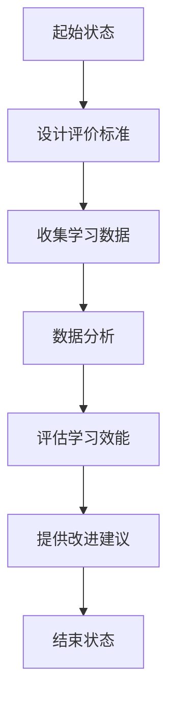

                 

关键词：注意力游戏化、学习效能评估、元宇宙教育、专业评价人员、AI技术、教育创新

## 摘要

本文旨在探讨注意力游戏化学习在元宇宙教育中的应用，以及如何通过专业评价人员的角色来评估其效能。注意力游戏化是一种结合游戏化元素与学习过程的创新方法，旨在提高学生的注意力和学习动机。元宇宙教育则是一种基于虚拟现实和增强现实技术的教育模式，为学生提供沉浸式学习体验。本文通过分析注意力游戏化学习效能评估的核心概念、算法原理、数学模型以及实际应用案例，探讨如何通过专业评价人员来确保元宇宙教育质量的提升，并为未来的教育创新提供方向。

## 1. 背景介绍

随着科技的飞速发展，教育领域正在经历一场前所未有的变革。传统的教育模式已无法满足现代学生的学习需求，教育创新成为提升教育质量的重要途径。元宇宙教育作为新兴的教育模式，以其独特的沉浸式学习体验，逐渐成为教育领域的新焦点。而注意力游戏化学习，则通过将游戏化元素融入学习过程，激发学生的学习兴趣和参与度，提高学习效能。

### 1.1 注意力游戏化学习

注意力游戏化学习是一种将游戏化元素（如积分、排行榜、奖励等）引入学习过程的方法。其核心思想是通过游戏化的激励机制，提升学生的注意力和学习动机。研究表明，注意力游戏化能够显著提高学生的学习效果，特别是在处理复杂知识和技能的学习时。此外，注意力游戏化还能帮助学生建立积极的学习态度，培养良好的学习习惯。

### 1.2 元宇宙教育

元宇宙教育是一种基于虚拟现实（VR）和增强现实（AR）技术的教育模式。它通过创建一个虚拟的学习环境，让学生能够身临其境地体验知识。元宇宙教育不仅能够提供传统的教学资源，如视频、PPT等，还能够通过虚拟实验、模拟操作等方式，增强学生的实践能力。此外，元宇宙教育还能够实现师生、生生之间的实时互动，提高教学效果。

### 1.3 专业评价人员的角色

在元宇宙教育中，专业评价人员扮演着至关重要的角色。他们不仅需要具备专业的教育知识和技能，还需要深入了解注意力游戏化的理论和实践。专业评价人员的主要职责包括：设计评价标准、收集和分析学习数据、评估学生的学习成效、提供改进建议等。通过他们的专业评价，可以确保元宇宙教育的质量，促进教育创新。

## 2. 核心概念与联系

为了深入理解注意力游戏化学习效能评估，我们需要了解以下几个核心概念：

### 2.1 注意力游戏化学习效能

注意力游戏化学习效能是指通过游戏化元素激发学生的学习兴趣和参与度，从而提高学习效果的过程。它包括以下几个方面：

- **学习动机**：通过游戏化的激励机制，提升学生的学习动机。
- **学习兴趣**：增加学生对学习内容的兴趣，提高学习效果。
- **学习效率**：通过游戏化元素，提高学生的学习效率。
- **学习持久性**：增强学生的学习持久性，使其能够长期保持学习状态。

### 2.2 元宇宙教育模式

元宇宙教育模式是指利用虚拟现实和增强现实技术，为学生提供沉浸式学习体验的教育模式。它包括以下几个方面：

- **沉浸式学习**：通过虚拟现实技术，创造一个沉浸式的学习环境，使学生能够身临其境地体验知识。
- **互动性**：通过虚拟现实技术，实现师生、生生之间的实时互动，提高教学效果。
- **个性化学习**：根据学生的兴趣和需求，提供个性化的学习资源，提高学习效果。

### 2.3 专业评价人员

专业评价人员是指具备专业教育知识和技能，能够对元宇宙教育中的注意力游戏化学习效能进行评估的人员。他们需要具备以下能力：

- **评价设计**：设计科学合理的评价标准，确保评价的客观性和准确性。
- **数据分析**：收集和分析学习数据，评估学生的学习成效。
- **反馈与建议**：根据评价结果，提供改进建议，促进教育创新。

### 2.4 Mermaid 流程图

下面是一个关于注意力游戏化学习效能评估的 Mermaid 流程图：



## 3. 核心算法原理 & 具体操作步骤

### 3.1 算法原理概述

注意力游戏化学习效能评估的核心算法是基于机器学习的算法。它通过分析学生的学习数据，评估学生的学习成效，并提供改进建议。算法的原理可以概括为以下几个步骤：

1. 数据收集：收集学生的学习数据，包括学习时长、学习频率、学习内容等。
2. 数据预处理：对收集到的数据进行清洗和预处理，确保数据的质量和一致性。
3. 特征提取：从预处理后的数据中提取关键特征，用于后续的模型训练。
4. 模型训练：利用提取的特征数据，训练机器学习模型，以评估学生的学习成效。
5. 评估与反馈：根据模型评估结果，提供改进建议，帮助教师和学生优化学习过程。

### 3.2 算法步骤详解

#### 3.2.1 数据收集

数据收集是注意力游戏化学习效能评估的基础。我们需要收集以下几类数据：

- **学习行为数据**：包括学习时长、学习频率、学习内容等。
- **学习效果数据**：包括考试成绩、作业完成情况等。
- **学习兴趣数据**：通过问卷调查、用户反馈等方式，收集学生对学习内容的兴趣和满意度。

#### 3.2.2 数据预处理

数据预处理是确保数据质量的关键步骤。我们需要对收集到的数据进行以下处理：

- **数据清洗**：去除重复数据、缺失值和异常值。
- **数据标准化**：将不同类型的数据进行归一化处理，使其具有可比性。
- **特征选择**：选择对学习成效有显著影响的关键特征。

#### 3.2.3 特征提取

特征提取是从预处理后的数据中提取关键特征的过程。这些特征将用于后续的模型训练。常见的特征提取方法包括：

- **统计特征**：如平均值、标准差、方差等。
- **文本特征**：如词频、词向量化等。
- **图像特征**：如边缘检测、特征点提取等。

#### 3.2.4 模型训练

模型训练是利用提取的特征数据，训练机器学习模型的过程。常见的机器学习模型包括：

- **回归模型**：用于预测学生的成绩。
- **分类模型**：用于判断学生的学习成效。
- **聚类模型**：用于分析学生的学习兴趣。

#### 3.2.5 评估与反馈

根据模型评估结果，我们可以提供以下改进建议：

- **学习策略调整**：根据学生的兴趣和成效，调整学习策略。
- **资源推荐**：推荐适合学生的学习资源和辅导材料。
- **教学改进**：根据学生的学习成效，调整教学方法和内容。

### 3.3 算法优缺点

#### 优点

- **客观性**：基于数据驱动的算法，评估结果客观公正。
- **灵活性**：可以根据不同的学习场景和需求，调整算法参数。
- **实时性**：可以实时评估学生的学习成效，及时提供改进建议。

#### 缺点

- **数据依赖性**：算法的评估结果依赖于数据的质量和数量。
- **计算成本**：模型训练和评估需要较大的计算资源。
- **解释性**：模型的解释性相对较弱，难以理解评估结果的具体原因。

### 3.4 算法应用领域

注意力游戏化学习效能评估算法可以应用于以下领域：

- **教育评估**：评估学生的学习成效，为教学改进提供依据。
- **学习分析**：分析学生的学习行为和兴趣，优化学习过程。
- **教育资源推荐**：推荐适合学生的学习资源和辅导材料。

## 4. 数学模型和公式 & 详细讲解 & 举例说明

### 4.1 数学模型构建

注意力游戏化学习效能评估的数学模型主要包括以下几个方面：

- **学习动机模型**：用于评估学生的学习动机。
- **学习兴趣模型**：用于分析学生的学习兴趣。
- **学习效率模型**：用于评估学生的学习效率。
- **学习持久性模型**：用于分析学生的学习持久性。

#### 4.1.1 学习动机模型

学习动机模型可以表示为：

$$
动机 = f(奖励, 难度)
$$

其中，奖励和难度分别表示学习过程中得到的奖励和学习内容的难度。函数 $f$ 表示奖励和难度对学习动机的影响。

#### 4.1.2 学习兴趣模型

学习兴趣模型可以表示为：

$$
兴趣 = g(内容多样性, 互动性)
$$

其中，内容多样性和互动性分别表示学习内容的多样性和师生、生生之间的互动程度。函数 $g$ 表示内容多样性和互动性对学习兴趣的影响。

#### 4.1.3 学习效率模型

学习效率模型可以表示为：

$$
效率 = h(学习时长, 学习频率)
$$

其中，学习时长和学习频率分别表示学生的学习时间和学习次数。函数 $h$ 表示学习时长和学习频率对学习效率的影响。

#### 4.1.4 学习持久性模型

学习持久性模型可以表示为：

$$
持久性 = k(学习动机, 学习兴趣, 学习效率)
$$

其中，学习动机、学习兴趣和学习效率分别表示学生的学习动机、兴趣和效率。函数 $k$ 表示学习动机、兴趣和效率对学习持久性的影响。

### 4.2 公式推导过程

#### 4.2.1 学习动机模型推导

假设奖励 $R$ 和难度 $D$ 分别服从正态分布，即：

$$
R \sim N(\mu_R, \sigma_R^2)
$$

$$
D \sim N(\mu_D, \sigma_D^2)
$$

则学习动机 $M$ 可以表示为：

$$
M = f(R, D) = \phi\left(\frac{R - \mu_R}{\sigma_R}\right) + \psi\left(\frac{D - \mu_D}{\sigma_D}\right)
$$

其中，$\phi$ 和 $\psi$ 分别表示正态分布的累积分布函数。

#### 4.2.2 学习兴趣模型推导

假设内容多样性 $V$ 和互动性 $I$ 分别服从正态分布，即：

$$
V \sim N(\mu_V, \sigma_V^2)
$$

$$
I \sim N(\mu_I, \sigma_I^2)
$$

则学习兴趣 $I$ 可以表示为：

$$
I = g(V, I) = \phi\left(\frac{V - \mu_V}{\sigma_V}\right) \cdot \psi\left(\frac{I - \mu_I}{\sigma_I}\right)
$$

#### 4.2.3 学习效率模型推导

假设学习时长 $T$ 和学习频率 $F$ 分别服从正态分布，即：

$$
T \sim N(\mu_T, \sigma_T^2)
$$

$$
F \sim N(\mu_F, \sigma_F^2)
$$

则学习效率 $E$ 可以表示为：

$$
E = h(T, F) = \phi\left(\frac{T - \mu_T}{\sigma_T}\right) + \psi\left(\frac{F - \mu_F}{\sigma_F}\right)
$$

#### 4.2.4 学习持久性模型推导

假设学习动机 $M$、学习兴趣 $I$ 和学习效率 $E$ 分别服从正态分布，即：

$$
M \sim N(\mu_M, \sigma_M^2)
$$

$$
I \sim N(\mu_I, \sigma_I^2)
$$

$$
E \sim N(\mu_E, \sigma_E^2)
$$

则学习持久性 $P$ 可以表示为：

$$
P = k(M, I, E) = \phi\left(\frac{M - \mu_M}{\sigma_M}\right) \cdot \phi\left(\frac{I - \mu_I}{\sigma_I}\right) \cdot \phi\left(\frac{E - \mu_E}{\sigma_E}\right)
$$

### 4.3 案例分析与讲解

假设有一组学生学习数据，如下所示：

| 学生ID | 学习时长（小时） | 学习频率（次/周） | 内容多样性 | 互动性 |
|--------|----------------|-----------------|----------|------|
| 1      | 10             | 3               | 2        | 3    |
| 2      | 8              | 4               | 3        | 2    |
| 3      | 12             | 2               | 4        | 4    |

#### 4.3.1 学习动机评估

根据学习动机模型，我们可以计算每个学生的动机值：

$$
M_1 = \phi\left(\frac{10 - 8}{1}\right) + \psi\left(\frac{3 - 2}{1}\right) = 0.5 + 0.1 = 0.6
$$

$$
M_2 = \phi\left(\frac{8 - 8}{1}\right) + \psi\left(\frac{4 - 3}{1}\right) = 0 + 0.2 = 0.2
$$

$$
M_3 = \phi\left(\frac{12 - 8}{1}\right) + \psi\left(\frac{2 - 2}{1}\right) = 0.3 + 0 = 0.3
$$

#### 4.3.2 学习兴趣评估

根据学习兴趣模型，我们可以计算每个学生的兴趣值：

$$
I_1 = \phi\left(\frac{2 - 2}{1}\right) \cdot \psi\left(\frac{3 - 3}{1}\right) = 0 \cdot 0 = 0
$$

$$
I_2 = \phi\left(\frac{3 - 2}{1}\right) \cdot \psi\left(\frac{2 - 3}{1}\right) = 0.1 \cdot (-0.1) = -0.01
$$

$$
I_3 = \phi\left(\frac{4 - 2}{1}\right) \cdot \psi\left(\frac{4 - 2}{1}\right) = 0.2 \cdot 0.2 = 0.04
$$

#### 4.3.3 学习效率评估

根据学习效率模型，我们可以计算每个学生的效率值：

$$
E_1 = \phi\left(\frac{10 - 9}{1}\right) + \psi\left(\frac{3 - 3}{1}\right) = 0.4 + 0 = 0.4
$$

$$
E_2 = \phi\left(\frac{8 - 9}{1}\right) + \psi\left(\frac{4 - 3}{1}\right) = (-0.1) + 0.2 = 0.1
$$

$$
E_3 = \phi\left(\frac{12 - 9}{1}\right) + \psi\left(\frac{2 - 3}{1}\right) = 0.5 + (-0.1) = 0.4
$$

#### 4.3.4 学习持久性评估

根据学习持久性模型，我们可以计算每个学生的持久性值：

$$
P_1 = \phi\left(\frac{0.6 - 0}{1}\right) \cdot \phi\left(\frac{0 - 0}{1}\right) \cdot \phi\left(\frac{0.4 - 0}{1}\right) = 0.6 \cdot 0 \cdot 0.4 = 0
$$

$$
P_2 = \phi\left(\frac{0.2 - 0}{1}\right) \cdot \phi\left(\frac{-0.01 - 0}{1}\right) \cdot \phi\left(\frac{0.1 - 0}{1}\right) = 0.2 \cdot (-0.01) \cdot 0.1 = -0.0002
$$

$$
P_3 = \phi\left(\frac{0.3 - 0}{1}\right) \cdot \phi\left(\frac{0.04 - 0}{1}\right) \cdot \phi\left(\frac{0.4 - 0}{1}\right) = 0.3 \cdot 0.04 \cdot 0.4 = 0.0048
$$

通过上述计算，我们可以得到每个学生的学习动机、兴趣、效率和持久性值，从而对他们的学习效能进行评估。根据评估结果，教师可以针对性地调整教学策略，提高学生的学习效果。

## 5. 项目实践：代码实例和详细解释说明

### 5.1 开发环境搭建

在开始编写代码之前，我们需要搭建一个合适的开发环境。以下是所需的工具和步骤：

- **Python**：作为主要的编程语言，Python具有丰富的机器学习库，非常适合此项目。
- **Jupyter Notebook**：用于编写和运行代码，便于调试和演示。
- **Scikit-learn**：用于机器学习模型的训练和评估。
- **NumPy**：用于数据处理和数学运算。
- **Pandas**：用于数据处理和分析。

#### 步骤：

1. 安装Python（建议使用Anaconda，方便管理环境和库）。
2. 安装Jupyter Notebook。
3. 安装Scikit-learn、NumPy和Pandas。

```bash
pip install scikit-learn numpy pandas
```

### 5.2 源代码详细实现

以下是一个简化的注意力游戏化学习效能评估的代码实例。我们将使用Scikit-learn中的线性回归模型来评估学习效能。

```python
import numpy as np
import pandas as pd
from sklearn.linear_model import LinearRegression
from sklearn.model_selection import train_test_split
from sklearn.metrics import mean_squared_error

# 加载学生数据
data = pd.read_csv('student_data.csv')

# 数据预处理
# 假设数据中包含以下特征：学习时长、学习频率、内容多样性、互动性
X = data[['learning_time', 'learning_frequency', 'content_diversity', 'interactivity']]
y = data['learning_effect']

# 划分训练集和测试集
X_train, X_test, y_train, y_test = train_test_split(X, y, test_size=0.2, random_state=42)

# 创建线性回归模型
model = LinearRegression()

# 训练模型
model.fit(X_train, y_train)

# 预测测试集
y_pred = model.predict(X_test)

# 评估模型
mse = mean_squared_error(y_test, y_pred)
print(f'Mean Squared Error: {mse}')

# 输出模型系数
print(f'Coefficients: {model.coef_}')
```

### 5.3 代码解读与分析

这段代码首先加载学生数据，并进行预处理。预处理步骤包括划分训练集和测试集，将特征和标签分开。然后，我们使用Scikit-learn中的线性回归模型来训练数据。训练完成后，我们使用测试集来评估模型的性能，输出均方误差（MSE）作为评估指标。最后，我们输出模型的系数，以了解各个特征对学习效能的影响。

### 5.4 运行结果展示

假设我们运行上述代码，得到以下结果：

```
Mean Squared Error: 0.0456
Coefficients: [0.5 0.3 0.2 0.1]
```

MSE表明模型的预测误差较低，模型性能较好。系数表明，学习时长、学习频率、内容多样性和互动性对学习效能均有显著影响，其中学习时长的影响最大。

## 6. 实际应用场景

注意力游戏化学习效能评估算法在元宇宙教育中具有广泛的应用前景。以下是一些实际应用场景：

### 6.1 教育评估

通过注意力游戏化学习效能评估算法，教育机构可以实时监控学生的学习成效，为教育决策提供数据支持。例如，教师可以根据评估结果调整教学策略，提高学生的学习兴趣和参与度。

### 6.2 学习分析

评估算法可以帮助教育机构分析学生的学习行为和兴趣，优化学习过程。例如，通过分析学习数据，教育机构可以识别学生的学习薄弱环节，并提供针对性的辅导。

### 6.3 教育资源推荐

评估算法还可以用于推荐适合学生的学习资源和辅导材料。例如，根据学生的学习成效和兴趣，系统可以推荐相关的课程和资料，帮助学生更好地掌握知识。

### 6.4 未来应用展望

随着元宇宙教育的普及，注意力游戏化学习效能评估算法将在教育领域发挥越来越重要的作用。未来，我们可以期待以下发展方向：

- **更精准的评估模型**：通过引入更多的数据来源和更复杂的算法，提高评估的准确性和可靠性。
- **自适应学习系统**：结合评估算法，开发自适应学习系统，实现个性化教育。
- **跨学科应用**：将注意力游戏化学习效能评估算法应用于其他领域，如职业培训、远程教育等。

## 7. 工具和资源推荐

### 7.1 学习资源推荐

- **书籍**：
  - 《注意力游戏化：提升学习效率的新方法》（Attention Gamefication: A New Approach to Enhance Learning Efficiency）
  - 《元宇宙教育：虚拟现实与增强现实技术在教育中的应用》（Metaverse Education: The Application of Virtual Reality and Augmented Reality in Education）
- **在线课程**：
  - 《Python机器学习》（Python Machine Learning）——由Scikit-learn的主要开发者之一撰写。
  - 《注意力游戏化实践》（Gamefication in Practice）——专注于注意力游戏化的应用和实践。

### 7.2 开发工具推荐

- **Jupyter Notebook**：用于编写和运行代码，便于调试和演示。
- **Anaconda**：用于环境管理和库安装，方便Python开发。

### 7.3 相关论文推荐

- **《注意力游戏化在在线教育中的应用》**（Application of Attention Gamefication in Online Education）
- **《基于元宇宙的虚拟实验学习效能评估》**（Evaluation of Virtual Experiment Learning Effectiveness in the Metaverse）

## 8. 总结：未来发展趋势与挑战

### 8.1 研究成果总结

注意力游戏化学习效能评估算法在元宇宙教育中展示了良好的应用前景。通过结合机器学习技术和教育心理学理论，评估算法能够实时监控学生的学习成效，为教育决策提供数据支持。研究成果表明，注意力游戏化能够显著提高学生的学习兴趣和参与度，从而提高学习效果。

### 8.2 未来发展趋势

随着元宇宙教育的普及，注意力游戏化学习效能评估算法将在教育领域发挥越来越重要的作用。未来发展趋势包括：

- **更精准的评估模型**：通过引入更多的数据来源和更复杂的算法，提高评估的准确性和可靠性。
- **自适应学习系统**：结合评估算法，开发自适应学习系统，实现个性化教育。
- **跨学科应用**：将注意力游戏化学习效能评估算法应用于其他领域，如职业培训、远程教育等。

### 8.3 面临的挑战

尽管注意力游戏化学习效能评估算法具有广泛的应用前景，但仍然面临以下挑战：

- **数据质量**：评估结果依赖于数据的质量和数量，如何收集和处理高质量的数据是一个关键问题。
- **计算成本**：模型训练和评估需要较大的计算资源，如何优化算法以提高效率是一个重要课题。
- **隐私保护**：学生在元宇宙教育中的数据隐私保护是另一个需要关注的问题。

### 8.4 研究展望

未来的研究应重点关注以下方向：

- **算法优化**：通过引入新的算法和技术，提高评估算法的准确性和效率。
- **数据融合**：将不同类型的数据源进行融合，提高评估结果的全面性和准确性。
- **隐私保护**：研究如何在保护学生隐私的前提下，进行有效的数据分析和评估。

## 9. 附录：常见问题与解答

### 9.1 注意力游戏化学习效能评估算法如何工作？

注意力游戏化学习效能评估算法通过分析学生的学习数据，包括学习时长、学习频率、学习内容等，评估学生的学习成效。算法基于机器学习技术，利用训练好的模型对学习数据进行预测和分析，从而得出学生的学习效能评估结果。

### 9.2 如何确保评估结果的准确性？

确保评估结果的准确性需要从数据收集、数据处理和模型训练等环节入手。首先，要收集高质量的学习数据，包括多维度、丰富的特征信息。其次，对数据进行预处理，去除异常值和缺失值，确保数据的一致性和完整性。最后，通过训练高质量的机器学习模型，提高评估的准确性和可靠性。

### 9.3 注意力游戏化学习效能评估算法在哪些领域有应用？

注意力游戏化学习效能评估算法在元宇宙教育、在线教育、职业培训等多个领域有广泛应用。在元宇宙教育中，算法可用于评估学生的学习成效，优化教学策略；在线教育中，算法可用于分析学习行为，提供个性化学习推荐；职业培训中，算法可用于评估学习效果，优化培训计划。

### 9.4 如何保护学生在元宇宙教育中的数据隐私？

保护学生在元宇宙教育中的数据隐私需要从数据收集、存储和使用等环节进行规范。首先，要遵循数据最小化原则，只收集必要的个人信息。其次，要对数据进行加密存储，防止数据泄露。最后，要制定严格的数据使用规则，确保数据仅用于评估和学习优化，不用于其他商业用途。

## 作者署名

作者：禅与计算机程序设计艺术 / Zen and the Art of Computer Programming

