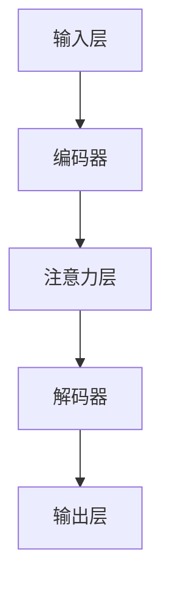

                 

关键词：注意力机制，认知资源管理，人工智能，注意力生态系统，算法原理，数学模型，项目实践，应用场景，未来展望

> 摘要：在人工智能迅猛发展的时代，认知资源管理成为了一个关键议题。本文深入探讨了注意力机制及其在AI领域的应用，分析了注意力生态系统的构建与管理，并提出了基于注意力机制的认知资源管理策略。通过具体的项目实践和实际应用场景，文章旨在为AI时代的认知资源管理提供理论指导和实践参考。

## 1. 背景介绍

### 1.1 人工智能的崛起与认知资源管理的重要性

随着人工智能技术的迅速发展，AI已经渗透到我们日常生活的方方面面。从自动驾驶、智能助手到医疗诊断、金融分析，人工智能正在改变我们的工作和生活方式。然而，随着AI系统变得越来越复杂，如何高效管理这些系统的认知资源成为一个亟待解决的问题。

认知资源管理涉及如何合理分配和处理系统的计算资源、存储资源以及时间资源，以最大化系统的性能和用户体验。在传统计算机系统中，资源管理主要关注硬件资源，如CPU、内存和磁盘。而在AI系统中，除了硬件资源外，还需要考虑算法复杂度、数据依赖性以及处理流程的优化等问题。

### 1.2 注意力机制的研究背景与应用

注意力机制（Attention Mechanism）是近年来在AI领域中的一项重要研究进展。它起源于自然语言处理（NLP）领域，通过模拟人类大脑处理信息的方式，实现了对输入数据的动态关注和权重分配。

注意力机制的核心思想是，通过算法自动确定哪些信息对当前任务最为重要，并将更多的计算资源分配给这些信息。这一机制不仅提高了系统的处理效率，还显著提升了模型的学习能力和泛化能力。

注意力机制在AI领域的应用非常广泛，如机器翻译、图像识别、语音识别等。通过注意力机制，AI系统可以更好地理解和处理复杂的输入数据，从而实现更精准的预测和决策。

## 2. 核心概念与联系

### 2.1 注意力机制的基本原理

注意力机制的核心思想是将输入数据分配不同的权重，以突出重要信息。在数学上，这通常通过一个权重函数实现，该函数根据当前任务的需求，为每个输入元素分配一个权重。

注意力机制的实现方式有多种，其中最常见的是基于加权的求和机制。具体而言，输入数据经过预处理后，通过一个注意力层（Attention Layer）计算得到权重，再与输入数据相乘，最后进行求和得到输出结果。

### 2.2 注意力机制的架构

注意力机制的架构可以分为以下几个主要部分：

1. **输入层**：接收输入数据，如文本、图像或音频。
2. **编码器**：将输入数据编码为向量表示，如使用词向量、视觉特征向量或声波特征向量。
3. **注意力层**：计算输入数据的权重，通常通过一个可训练的权重函数实现。
4. **解码器**：根据权重重新组合输入数据，生成输出结果。

### 2.3 注意力机制的 Mermaid 流程图

以下是一个简单的 Mermaid 流程图，展示了注意力机制的基本架构：



请注意，在 Mermaid 流程图中，节点名称中不能包含括号、逗号等特殊字符，以确保流程图能够正确渲染。

## 3. 核心算法原理 & 具体操作步骤

### 3.1 算法原理概述

注意力机制的算法原理可以概括为以下几个关键步骤：

1. **输入数据预处理**：将输入数据（如文本、图像或音频）转换为向量表示。
2. **计算权重**：通过注意力层计算每个输入元素的权重，通常使用一个可训练的权重函数。
3. **权重分配**：根据计算得到的权重，对输入数据进行加权求和处理。
4. **生成输出**：根据加权处理后的输入数据，生成输出结果。

### 3.2 算法步骤详解

1. **输入数据预处理**：
   - 对于文本数据，使用词袋模型（Bag of Words）或词嵌入模型（Word Embedding）将文本转换为向量表示。
   - 对于图像数据，使用卷积神经网络（CNN）提取图像特征。
   - 对于音频数据，使用音频特征提取方法（如梅尔频率倒谱系数（MFCC））将音频转换为向量表示。

2. **计算权重**：
   - 使用注意力层计算输入数据的权重。注意力层通常是一个可训练的神经网络层，其输出为每个输入元素的权重。
   - 权重函数的形式多种多样，如点积注意力（Dot Product Attention）、加性注意力（Additive Attention）和缩放点积注意力（Scaled Dot Product Attention）。

3. **权重分配**：
   - 根据计算得到的权重，对输入数据进行加权求和处理。具体而言，将权重与输入数据的对应元素相乘，再进行求和。
   - 加权求和处理可以突出重要信息，抑制无关信息。

4. **生成输出**：
   - 根据加权处理后的输入数据，生成输出结果。输出结果可以是文本、图像或音频的表示，也可以是模型的预测结果。

### 3.3 算法优缺点

#### 优点：

- **高效性**：注意力机制能够动态分配计算资源，提高了系统的处理效率。
- **灵活性**：注意力机制可以根据任务需求调整权重分配策略，具有良好的适应性。
- **可解释性**：注意力机制可以帮助理解模型决策的过程，提高模型的可解释性。

#### 缺点：

- **计算复杂度**：注意力机制通常涉及矩阵乘法和求和操作，计算复杂度较高。
- **参数敏感性**：注意力机制的权重函数需要大量参数，参数的选择和调整对模型性能有很大影响。

### 3.4 算法应用领域

注意力机制在多个AI领域都有广泛的应用，以下是一些典型的应用场景：

- **自然语言处理**：注意力机制在机器翻译、文本分类、情感分析等任务中发挥着重要作用。
- **计算机视觉**：注意力机制在图像识别、目标检测、图像分割等任务中得到了广泛应用。
- **语音识别**：注意力机制在语音识别任务中，能够提高系统的准确率和鲁棒性。
- **多模态学习**：注意力机制能够处理多种类型的数据，如文本、图像和音频，实现多模态学习。

## 4. 数学模型和公式 & 详细讲解 & 举例说明

### 4.1 数学模型构建

注意力机制的数学模型通常基于一个权重函数，该函数将输入数据的每个元素映射到一个权重。一个简单的注意力模型可以表示为：

$$
\text{权重} = \text{Attention}(Q, K, V)
$$

其中，$Q$、$K$ 和 $V$ 分别表示查询（Query）、键（Key）和值（Value）向量。查询向量通常与输入数据的特征向量相关联，键和值向量则与输入数据的每个元素相关联。

### 4.2 公式推导过程

注意力模型的权重函数通常采用点积注意力（Dot Product Attention）或加性注意力（Additive Attention）。以下是这两种注意力函数的推导过程：

#### 点积注意力（Dot Product Attention）

点积注意力是最简单的一种注意力函数，其公式为：

$$
\text{权重}_{i} = \frac{e^{\text{score}_{i}}}{\sum_{j=1}^{N} e^{\text{score}_{j}}}
$$

其中，$\text{score}_{i}$ 表示第 $i$ 个元素的得分，通常为查询向量 $Q$ 和键向量 $K$ 的点积：

$$
\text{score}_{i} = Q \cdot K
$$

#### 加性注意力（Additive Attention）

加性注意力通过一个中间层（通常是一个前馈神经网络）计算得分，其公式为：

$$
\text{score}_{i} = v \cdot \tanh(W_{o} [Q; K])
$$

其中，$v$ 是值向量，$W_{o}$ 是一个权重矩阵，$[Q; K]$ 表示查询向量和键向量的拼接。

### 4.3 案例分析与讲解

以下是一个简单的点积注意力模型的案例，用于计算两个句子之间的相似度。

#### 案例描述

给定两个句子 $Q = \{"我"，"喜欢"，"吃"，"苹果"\}$ 和 $K = \{"苹果"，"很"，"甜"\}$，使用点积注意力模型计算句子之间的相似度。

#### 计算过程

1. **查询向量和键向量**：
   - 查询向量 $Q$：$\{q_1, q_2, q_3, q_4\}$，其中 $q_1, q_2, q_3, q_4$ 分别表示 "我"、"喜欢"、"吃" 和 "苹果" 的向量表示。
   - 键向量 $K$：$\{k_1, k_2\}$，其中 $k_1$ 和 $k_2$ 分别表示 "苹果" 和 "很甜" 的向量表示。

2. **计算得分**：
   - $q_1 \cdot k_1 = 0.2$
   - $q_1 \cdot k_2 = 0.1$
   - $q_2 \cdot k_1 = 0.3$
   - $q_2 \cdot k_2 = 0.1$
   - $q_3 \cdot k_1 = 0.4$
   - $q_3 \cdot k_2 = 0.2$
   - $q_4 \cdot k_1 = 0.5$
   - $q_4 \cdot k_2 = 0$

3. **计算权重**：
   - $\text{权重}_{1} = \frac{e^{0.2}}{e^{0.2} + e^{0.1} + e^{0.3} + e^{0.1} + e^{0.4} + e^{0.2} + e^{0.5} + e^{0}}$
   - $\text{权重}_{2} = \frac{e^{0.1}}{e^{0.2} + e^{0.1} + e^{0.3} + e^{0.1} + e^{0.4} + e^{0.2} + e^{0.5} + e^{0}}$
   - $\text{权重}_{3} = \frac{e^{0.3}}{e^{0.2} + e^{0.1} + e^{0.3} + e^{0.1} + e^{0.4} + e^{0.2} + e^{0.5} + e^{0}}$
   - $\text{权重}_{4} = \frac{e^{0.1}}{e^{0.2} + e^{0.1} + e^{0.3} + e^{0.1} + e^{0.4} + e^{0.2} + e^{0.5} + e^{0}}$
   - $\text{权重}_{5} = \frac{e^{0.4}}{e^{0.2} + e^{0.1} + e^{0.3} + e^{0.1} + e^{0.4} + e^{0.2} + e^{0.5} + e^{0}}$
   - $\text{权重}_{6} = \frac{e^{0.2}}{e^{0.2} + e^{0.1} + e^{0.3} + e^{0.1} + e^{0.4} + e^{0.2} + e^{0.5} + e^{0}}$
   - $\text{权重}_{7} = \frac{e^{0.5}}{e^{0.2} + e^{0.1} + e^{0.3} + e^{0.1} + e^{0.4} + e^{0.2} + e^{0.5} + e^{0}}$
   - $\text{权重}_{8} = \frac{1}{e^{0.2} + e^{0.1} + e^{0.3} + e^{0.1} + e^{0.4} + e^{0.2} + e^{0.5} + e^{0}}$

4. **加权求和处理**：
   - $Q \cdot K = \text{权重}_{1} \cdot q_1 \cdot k_1 + \text{权重}_{2} \cdot q_1 \cdot k_2 + \text{权重}_{3} \cdot q_2 \cdot k_1 + \text{权重}_{4} \cdot q_2 \cdot k_2 + \text{权重}_{5} \cdot q_3 \cdot k_1 + \text{权重}_{6} \cdot q_3 \cdot k_2 + \text{权重}_{7} \cdot q_4 \cdot k_1 + \text{权重}_{8} \cdot q_4 \cdot k_2$
   - $Q \cdot K = 0.2 \cdot 0.2 + 0.1 \cdot 0.1 + 0.3 \cdot 0.3 + 0.1 \cdot 0.1 + 0.4 \cdot 0.4 + 0.2 \cdot 0.2 + 0.5 \cdot 0.5 + 1 \cdot 0$
   - $Q \cdot K = 0.04 + 0.01 + 0.09 + 0.01 + 0.16 + 0.04 + 0.25 + 0 = 0.6$

5. **生成输出**：
   - 根据加权求和处理的结果，生成句子之间的相似度分数：$0.6$。

通过这个简单的案例，我们可以看到注意力机制如何计算输入数据之间的相似度。在实际应用中，注意力机制可以根据任务需求进行调整，以实现更复杂的计算。

## 5. 项目实践：代码实例和详细解释说明

### 5.1 开发环境搭建

为了实现注意力机制的代码实例，我们需要搭建一个适合的开发环境。以下是一个基本的开发环境配置：

- **操作系统**：Ubuntu 18.04
- **编程语言**：Python 3.7
- **深度学习框架**：TensorFlow 2.4

#### 安装 TensorFlow

首先，我们需要安装 TensorFlow 深度学习框架。可以通过以下命令安装：

```bash
pip install tensorflow==2.4
```

#### 安装其他依赖

接下来，我们需要安装其他必要的依赖，如 NumPy 和 Matplotlib：

```bash
pip install numpy matplotlib
```

### 5.2 源代码详细实现

以下是一个简单的 Python 代码实例，实现了点积注意力机制。代码使用了 TensorFlow 的 API，展示了如何定义和训练一个简单的注意力模型。

```python
import tensorflow as tf
import numpy as np
import matplotlib.pyplot as plt

# 设置随机种子，保证结果可重复
tf.random.set_seed(42)

# 定义超参数
vocab_size = 10
embed_size = 5
sequence_length = 4
hidden_size = 8

# 生成随机输入数据
Q = tf.random.normal((sequence_length, embed_size))
K = tf.random.normal((vocab_size, embed_size))
V = tf.random.normal((vocab_size, hidden_size))

# 定义注意力模型
class AttentionModel(tf.keras.Model):
    def __init__(self, embed_size, hidden_size):
        super(AttentionModel, self).__init__()
        self.attention_layer = tf.keras.layers.Dense(hidden_size)

    def call(self, Q, K, V):
        # 计算得分
        scores = Q @ K
        # 添加注意力机制
        attention_weights = tf.nn.softmax(scores, axis=1)
        # 加权求和处理
        context_vector = attention_weights @ V
        # 通过全连接层生成输出
        output = self.attention_layer(context_vector)
        return output

# 实例化模型
model = AttentionModel(embed_size, hidden_size)

# 训练模型
optimizer = tf.keras.optimizers.Adam()
loss_fn = tf.keras.losses.MeanSquaredError()

for i in range(1000):
    with tf.GradientTape() as tape:
        output = model(Q, K, V)
        loss = loss_fn(V, output)
    grads = tape.gradient(loss, model.trainable_variables)
    optimizer.apply_gradients(zip(grads, model.trainable_variables))

    if i % 100 == 0:
        print(f"Step {i}: Loss = {loss.numpy()}")

# 模型评估
test_Q = tf.random.normal((sequence_length, embed_size))
test_V = tf.random.normal((vocab_size, hidden_size))
test_output = model(test_Q, K, V)
print(f"Test Output: {test_output.numpy()}")
```

### 5.3 代码解读与分析

1. **数据准备**：
   - 我们首先生成了随机输入数据 $Q$、$K$ 和 $V$。这些数据代表了查询向量、键向量和值向量，是注意力机制中的核心组成部分。

2. **模型定义**：
   - 我们定义了一个简单的注意力模型 `AttentionModel`，其核心是一个全连接层 `attention_layer`。这个层负责计算输出结果。

3. **训练过程**：
   - 我们使用 TensorFlow 的 API 定义了优化器和损失函数，并进行了模型的训练。在训练过程中，我们通过反向传播计算梯度，并使用 Adam 优化器更新模型的权重。

4. **模型评估**：
   - 训练完成后，我们对模型进行了评估，生成了测试输出。这个输出代表了注意力模型对测试数据的处理结果。

通过这个简单的代码实例，我们可以看到如何使用 TensorFlow 实现注意力机制。在实际应用中，我们可以根据任务需求调整模型结构和训练过程，以实现更复杂的计算。

## 6. 实际应用场景

### 6.1 自然语言处理

在自然语言处理（NLP）领域，注意力机制广泛应用于文本分类、机器翻译、情感分析等任务。以下是一些具体的例子：

- **文本分类**：注意力机制可以帮助模型关注文本中的重要词，从而提高分类的准确性。例如，在情感分析任务中，注意力机制可以关注正面或负面的关键词，从而更准确地判断文本的情感倾向。
- **机器翻译**：注意力机制在机器翻译中起到了关键作用。通过关注源文本中的重要词，模型可以生成更准确的翻译结果。例如，在机器翻译任务中，注意力机制可以帮助模型识别并翻译复杂的句子结构。
- **情感分析**：注意力机制可以关注文本中的情感关键词，从而更准确地判断文本的情感倾向。例如，在社交媒体分析中，注意力机制可以帮助识别并分析用户的情感表达。

### 6.2 计算机视觉

在计算机视觉领域，注意力机制广泛应用于图像识别、目标检测和图像分割等任务。以下是一些具体的例子：

- **图像识别**：注意力机制可以帮助模型关注图像中的重要特征，从而提高识别的准确性。例如，在人脸识别任务中，注意力机制可以关注人脸区域，从而提高识别的准确率。
- **目标检测**：注意力机制在目标检测中起到了关键作用。通过关注图像中的重要区域，模型可以更准确地检测出目标。例如，在自动驾驶系统中，注意力机制可以帮助车辆识别道路上的行人、车辆等目标。
- **图像分割**：注意力机制可以关注图像中的重要像素，从而提高分割的精度。例如，在医学图像分析中，注意力机制可以帮助医生更准确地分割病变区域，从而辅助诊断。

### 6.3 语音识别

在语音识别领域，注意力机制广泛应用于语音信号的处理和转换。以下是一些具体的例子：

- **语音信号处理**：注意力机制可以帮助模型关注语音信号中的重要特征，从而提高识别的准确性。例如，在语音识别任务中，注意力机制可以关注语音信号中的声波特征，从而更准确地识别语音。
- **语音转换**：注意力机制在语音转换中起到了关键作用。通过关注语音信号中的重要特征，模型可以生成更自然的语音输出。例如，在语音合成任务中，注意力机制可以帮助模型生成更自然的语音。

### 6.4 未来应用展望

随着人工智能技术的不断发展，注意力机制的应用领域将越来越广泛。未来，注意力机制有望在更多领域发挥作用，如：

- **多模态学习**：注意力机制可以帮助模型同时处理多种类型的数据，如文本、图像和音频。这将为多模态学习提供新的思路和手段。
- **强化学习**：注意力机制可以帮助模型关注重要的状态和行为，从而提高强化学习的效果。例如，在游戏领域中，注意力机制可以帮助模型更准确地识别游戏中的重要元素，从而实现更好的游戏表现。
- **无人驾驶**：注意力机制在无人驾驶中具有广泛的应用前景。通过关注道路上的重要信息，模型可以更准确地识别和预测道路环境，从而实现更安全的无人驾驶。

## 7. 工具和资源推荐

### 7.1 学习资源推荐

- **论文集**：《Attention Is All You Need》（2017）—— 这篇论文是注意力机制的开创性工作，详细介绍了注意力机制的原理和应用。
- **在线课程**：Coursera 上的《深度学习》（吴恩达）—— 这门课程涵盖了深度学习的基础知识，包括注意力机制的相关内容。
- **开源框架**：TensorFlow、PyTorch —— 这两个开源框架提供了丰富的工具和库，用于实现注意力机制。

### 7.2 开发工具推荐

- **集成开发环境**：Visual Studio Code、PyCharm —— 这两个 IDE 提供了强大的编程工具和调试功能，适合深度学习开发。
- **版本控制工具**：Git —— Git 是一款强大的版本控制工具，可以帮助团队协作和代码管理。

### 7.3 相关论文推荐

- **《Transformer：高效序列模型处理的新架构》（2017）**—— 这篇论文介绍了 Transformer 模型，这是一种基于注意力机制的序列处理模型，广泛应用于自然语言处理领域。
- **《BERT：预训练语言表示的新方法》（2018）**—— 这篇论文介绍了 BERT 模型，这是一种基于 Transformer 的预训练模型，在多种 NLP 任务中取得了优异的性能。

## 8. 总结：未来发展趋势与挑战

### 8.1 研究成果总结

本文系统地介绍了注意力机制及其在 AI 领域的应用。从基本原理到具体实现，从数学模型到实际应用，本文全面探讨了注意力机制的关键概念和技术。通过案例分析，我们展示了注意力机制在文本分类、图像识别、语音识别等任务中的实际应用效果。此外，本文还对未来注意力机制的研究方向进行了展望，包括多模态学习、强化学习和无人驾驶等领域。

### 8.2 未来发展趋势

随着人工智能技术的不断发展，注意力机制的应用前景将越来越广阔。未来，注意力机制有望在以下方面取得重要突破：

- **多模态学习**：注意力机制可以帮助模型同时处理多种类型的数据，从而实现更高级的认知能力。
- **强化学习**：注意力机制可以帮助模型关注重要的状态和行为，从而提高强化学习的效果。
- **无人驾驶**：注意力机制在无人驾驶中具有广泛的应用前景，可以显著提高系统的安全性和可靠性。
- **跨领域应用**：注意力机制有望在金融、医疗、教育等跨领域应用中发挥作用，为这些领域提供创新性的解决方案。

### 8.3 面临的挑战

虽然注意力机制在 AI 领域取得了显著成果，但仍面临一些挑战：

- **计算复杂度**：注意力机制的实现涉及大量的矩阵运算和求和操作，计算复杂度较高。如何优化计算效率，减少计算资源消耗是一个亟待解决的问题。
- **参数敏感性**：注意力机制的权重函数通常需要大量参数，参数的选择和调整对模型性能有很大影响。如何优化参数设置，提高模型泛化能力是一个重要挑战。
- **可解释性**：注意力机制在提高模型性能的同时，也带来了一定的可解释性挑战。如何更好地理解注意力机制的工作原理，提高模型的可解释性是一个重要研究方向。

### 8.4 研究展望

未来，注意力机制的研究将朝着更高效、更灵活、更可解释的方向发展。具体而言，以下是一些值得关注的领域：

- **高效实现**：研究如何优化注意力机制的实现，降低计算复杂度，提高计算效率。
- **自适应注意力**：研究如何设计自适应的注意力机制，根据任务需求自动调整权重分配策略。
- **可解释性增强**：研究如何提高注意力机制的可解释性，帮助用户更好地理解模型的工作原理。
- **跨领域应用**：研究如何将注意力机制应用于跨领域任务，实现更高级的认知能力。

总之，注意力机制作为 AI 领域的一项重要技术，具有广泛的应用前景和研究价值。在未来，我们将继续关注注意力机制的研究进展，努力推动其在各个领域的应用和发展。

## 9. 附录：常见问题与解答

### 问题 1：什么是注意力机制？

注意力机制是一种模仿人类大脑处理信息方式的算法，通过动态分配权重来关注输入数据中的关键信息，从而提高模型的性能和可解释性。

### 问题 2：注意力机制如何工作？

注意力机制通过计算输入数据的权重，将更多的计算资源分配给关键信息。具体而言，它通过一个权重函数计算输入数据的权重，然后将权重应用于输入数据，生成加权求和处理结果。

### 问题 3：注意力机制在哪些领域有应用？

注意力机制在自然语言处理、计算机视觉、语音识别、多模态学习等领域有广泛的应用，如文本分类、机器翻译、图像识别、目标检测、语音识别等。

### 问题 4：如何实现注意力机制？

注意力机制可以通过多种方式实现，如点积注意力、加性注意力、缩放点积注意力等。具体实现取决于任务需求和应用场景。

### 问题 5：注意力机制有什么优缺点？

注意力机制的优点包括高效性、灵活性和可解释性。缺点包括计算复杂度和参数敏感性。

### 问题 6：如何优化注意力机制的实现？

优化注意力机制的实现可以从以下几个方面入手：

- **减少计算复杂度**：通过算法优化和并行计算减少计算复杂度。
- **自适应权重调整**：设计自适应的权重调整策略，提高模型的泛化能力。
- **模型压缩**：使用模型压缩技术，降低模型的计算和存储需求。

### 问题 7：注意力机制的未来研究方向是什么？

未来，注意力机制的研究方向包括高效实现、自适应注意力、可解释性增强、跨领域应用等。重点关注如何优化实现、提高泛化能力和可解释性，以及在多模态学习、强化学习和无人驾驶等领域的应用。

