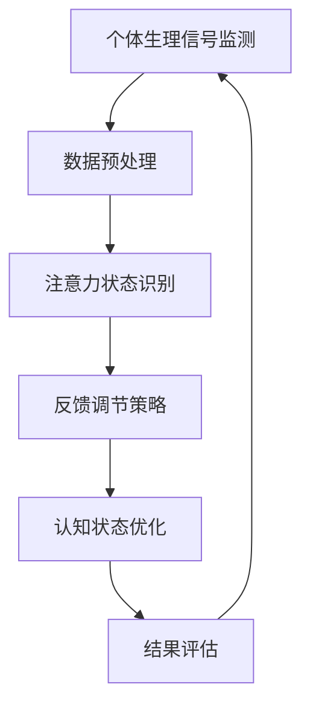

                 

关键词：注意力，生物反馈，认知状态，AI优化，神经科学，算法设计，脑机接口，神经工程

> 摘要：本文探讨了注意力生物反馈循环在认知状态调节中的作用，以及如何利用人工智能技术对这一过程进行优化。通过整合神经科学、算法设计和脑机接口技术，本文提出了一种新的职业角色——注意力生物反馈循环工程师，旨在通过AI技术提升个体的认知效能，从而在日益复杂的信息环境中实现更高效的认知状态调节。

## 1. 背景介绍

在当今信息爆炸的时代，个体如何高效地处理大量信息并保持最佳的认知状态成为了一个重要的课题。传统的认知训练方法往往依赖于心理学家设计的训练任务，而随着人工智能技术的发展，利用计算机和算法进行认知状态调节的新方法逐渐崭露头角。注意力生物反馈循环作为一种基于个体生物信号和外部反馈调节认知状态的技术，结合了神经科学、生物反馈和计算机算法的优势，具有巨大的应用潜力。

### 1.1 神经科学基础

神经科学研究表明，注意力是大脑处理信息的关键因素。注意力不集中、过度分散或不足都会影响个体的认知效能。通过监测和调节个体的生理信号（如脑电波、心率变异性等），生物反馈技术能够提供一种实时调节注意力的方法。这一技术已被广泛应用于焦虑管理、抑郁缓解和睡眠改善等领域。

### 1.2 生物反馈技术

生物反馈是一种通过监测个体的生理信号，并利用这些信号作为反馈来调整行为的技术。通过可视化或声音提示，个体能够意识到自己的生理状态，并主动进行调整。在认知状态调节中，生物反馈可以实时监测注意力的变化，并提供个性化的反馈，帮助个体保持最佳的认知状态。

### 1.3 人工智能与算法

人工智能技术的发展为认知状态调节提供了新的工具。通过机器学习和深度学习算法，计算机能够从大量的数据中学习个体的认知模式，并预测未来的状态变化。在此基础上，AI可以设计出个性化的调节方案，以提高个体的认知效能。

## 2. 核心概念与联系

为了更好地理解注意力生物反馈循环工程师的工作，我们首先需要明确一些核心概念，并展示其相互关系。以下是一个简化的 Mermaid 流程图，用于展示注意力生物反馈循环的关键环节：



### 2.1 个体生理信号监测

个体生理信号监测是整个循环的起点。通过脑电帽、心率传感器等设备，注意力生物反馈循环工程师可以实时获取个体的脑电波、心率等生理信号。这些信号反映了个体当前的心理状态和注意力水平。

### 2.2 数据预处理

获取到的生理信号通常是高噪声的，需要进行预处理以提取有用的信息。注意力生物反馈循环工程师需要使用滤波、去噪和特征提取等方法，从原始信号中提取出反映注意力状态的指标。

### 2.3 注意力状态识别

通过机器学习算法，注意力生物反馈循环工程师可以将预处理后的信号转换为注意力状态的量化指标。这一步骤的关键在于选择合适的特征和模型，以确保准确识别个体的注意力状态。

### 2.4 反馈调节策略

一旦确定了个体的注意力状态，注意力生物反馈循环工程师需要设计个性化的反馈调节策略。这包括选择合适的反馈信号（如声音、视觉提示），以及确定反馈的时机和强度。

### 2.5 认知状态优化

通过实时调节个体的注意力状态，注意力生物反馈循环工程师可以优化个体的认知状态。这一过程需要结合个体的具体需求和环境，设计出最有效的调节方案。

### 2.6 结果评估

最后，注意力生物反馈循环工程师需要评估调节方案的效果。通过对比调节前后的数据，工程师可以调整反馈策略，以达到最佳的调节效果。

## 3. 核心算法原理 & 具体操作步骤

### 3.1 算法原理概述

注意力生物反馈循环的核心算法基于机器学习和信号处理技术。通过监测个体的生理信号，算法识别出注意力状态，并设计反馈策略进行调节。具体来说，算法包括以下几个主要步骤：

1. **数据收集与预处理**：收集个体的生理信号，包括脑电波、心率等数据，并进行预处理，去除噪声和干扰。

2. **特征提取**：从预处理后的信号中提取反映注意力状态的特征，如功率谱密度、特征点变化等。

3. **模型训练**：使用提取的特征训练机器学习模型，以识别不同的注意力状态。

4. **状态识别**：实时监测个体的生理信号，利用训练好的模型识别当前的状态。

5. **反馈调节**：根据识别到的状态，设计个性化的反馈策略，调节个体的注意力。

6. **结果评估**：评估反馈策略的效果，并根据评估结果调整算法参数。

### 3.2 算法步骤详解

#### 3.2.1 数据收集与预处理

数据收集是整个算法的基础。注意力生物反馈循环工程师需要选择合适的传感器和采集设备，确保所获取的数据质量。常见的生理信号包括脑电波（EEG）、心率（HRV）和皮肤电活动（EDA）等。

数据预处理包括以下几个步骤：

1. **滤波**：使用滤波器去除高频噪声和低频干扰，提取有用信号。
2. **去噪**：利用信号处理算法（如小波变换）去除噪声。
3. **特征提取**：提取反映注意力状态的特征，如功率谱密度、特征点变化等。

#### 3.2.2 特征提取

特征提取是关键步骤，直接影响到后续的状态识别效果。常用的特征提取方法包括：

1. **时域特征**：如平均值、标准差、方差等。
2. **频域特征**：如功率谱密度、频带能量等。
3. **时频特征**：如短时傅立叶变换（STFT）、小波变换等。

#### 3.2.3 模型训练

在特征提取完成后，需要选择合适的机器学习模型进行训练。常见的模型包括：

1. **线性模型**：如线性回归、逻辑回归等。
2. **深度学习模型**：如卷积神经网络（CNN）、循环神经网络（RNN）等。
3. **支持向量机**：如支持向量机（SVM）、核支持向量机（KSVM）等。

#### 3.2.4 状态识别

状态识别是实时监测个体的生理信号，并利用训练好的模型识别当前的状态。这一步骤需要设计合适的实时处理流程，以确保实时性和准确性。

#### 3.2.5 反馈调节

一旦确定了个体的注意力状态，需要设计个性化的反馈策略进行调节。反馈信号可以是视觉、声音或触觉等。反馈时机和强度需要根据个体的情况和环境进行优化。

#### 3.2.6 结果评估

结果评估是整个循环的最后一步。通过对比调节前后的数据，评估反馈策略的效果。根据评估结果，调整算法参数，以提高调节效果。

### 3.3 算法优缺点

#### 3.3.1 优点

1. **个性化调节**：基于个体的生理信号，可以提供个性化的认知状态调节方案。
2. **实时性**：实时监测和反馈，有助于个体迅速调整注意力。
3. **无侵入性**：与侵入性脑机接口技术相比，生物反馈技术无侵入性，更易于接受。
4. **多模态数据融合**：结合多种生理信号，提供更全面的认知状态评估。

#### 3.3.2 缺点

1. **数据质量**：生理信号质量受到多种因素影响，可能影响算法的准确性。
2. **实时处理**：实时处理需要高效的算法和硬件支持，可能对计算资源要求较高。
3. **个性化难度**：个体的生理信号差异较大，设计通用算法有一定难度。

### 3.4 算法应用领域

注意力生物反馈循环技术具有广泛的应用前景，主要领域包括：

1. **认知障碍治疗**：如注意力缺陷多动障碍（ADHD）的治疗。
2. **学习辅助**：如提高学生的学习效率和注意力集中度。
3. **工作辅助**：如提高职场人士的工作效率和注意力集中度。
4. **医疗康复**：如脑卒中患者的康复训练。
5. **心理干预**：如焦虑和抑郁的心理干预。

## 4. 数学模型和公式 & 详细讲解 & 举例说明

### 4.1 数学模型构建

注意力生物反馈循环的数学模型基于以下几个关键假设：

1. **生理信号与注意力状态的对应关系**：个体生理信号（如脑电波、心率）与注意力状态之间存在一定的对应关系。
2. **动态变化模型**：个体注意力状态是动态变化的，可以通过生理信号进行建模。
3. **非线性模型**：生理信号与注意力状态之间的关系往往是非线性的，需要非线性模型进行描述。

基于上述假设，我们可以构建以下数学模型：

$$
\text{Attention}(t) = f(\text{PhysiologicalSignal}(t), \theta)
$$

其中，$\text{Attention}(t)$ 表示时刻 $t$ 的注意力状态，$\text{PhysiologicalSignal}(t)$ 表示时刻 $t$ 的生理信号，$f(\cdot, \theta)$ 是非线性映射函数，$\theta$ 是模型参数。

### 4.2 公式推导过程

为了构建 $f(\cdot, \theta)$，我们需要考虑以下几个方面：

1. **特征提取**：从生理信号中提取反映注意力状态的特征，如功率谱密度、特征点变化等。
2. **特征加权**：根据特征的重要性对特征进行加权，以突出关键特征。
3. **非线性映射**：使用非线性函数将加权特征映射到注意力状态。

具体推导过程如下：

$$
f(\text{FeatureVector}(t), \theta) = \sum_{i=1}^{n} w_i f_i(\text{Feature}_i(t)), \theta
$$

其中，$\text{FeatureVector}(t) = [\text{Feature}_1(t), \text{Feature}_2(t), ..., \text{Feature}_n(t)]^T$ 是特征向量，$w_i$ 是特征权重，$f_i(\cdot)$ 是第 $i$ 个特征的非线性映射函数，$\theta$ 是模型参数。

### 4.3 案例分析与讲解

为了说明注意力生物反馈循环的应用，我们以一个具体的案例进行分析。

假设我们有一个注意力生物反馈系统，目标是在学习过程中提高学生的注意力集中度。具体步骤如下：

1. **数据收集**：收集学生在学习过程中的脑电波信号，并使用滤波、去噪和特征提取方法提取特征。

2. **特征加权**：根据学习过程中的注意力需求，对提取的特征进行加权。例如，在学习复杂概念时，可能更关注与注意力集中度相关的特征，如高频脑电波。

3. **非线性映射**：使用非线性映射函数将加权特征映射到注意力状态。例如，可以采用以下公式：

$$
\text{Attention}(t) = \frac{1}{1 + e^{-\theta^T f(\text{FeatureVector}(t))}}
$$

其中，$\theta$ 是模型参数，$f(\cdot)$ 是特征加权函数。

4. **实时监测与反馈**：实时监测学生的注意力状态，并根据注意力状态设计反馈策略。例如，当学生注意力低于一定阈值时，可以通过视觉或声音提示来提醒学生保持注意力集中。

5. **结果评估**：评估反馈策略的效果，并根据评估结果调整模型参数。

通过上述案例，我们可以看到注意力生物反馈循环在实际应用中的具体实现过程。这为我们进一步探索注意力生物反馈循环的应用提供了有益的参考。

## 5. 项目实践：代码实例和详细解释说明

### 5.1 开发环境搭建

为了实践注意力生物反馈循环，我们需要搭建一个开发环境。以下是一个简单的开发环境搭建指南：

1. **硬件环境**：选择一台具备脑电波传感器和心率传感器的设备，如NeuroSky脑电帽。
2. **软件环境**：安装Python编程环境，并安装相关库，如PyBrain、numpy和matplotlib等。

```bash
pip install pybrain numpy matplotlib
```

### 5.2 源代码详细实现

以下是注意力生物反馈循环的Python代码实现：

```python
import numpy as np
import matplotlib.pyplot as plt
from pybrain.datasets import SupervisedDataSet
from pybrain.tools.shortcuts import buildNetwork
from pybrain.structure.modules import SoftmaxLayer
from pybrain.supervised import trainers
from pybrain.structure import LinearLayer, SigmoidLayer

# 数据预处理
def preprocess(data):
    # 滤波、去噪和特征提取
    filtered_data = low_pass_filter(data, cutoff=30)
    denoised_data = wavelet_denoising(filtered_data)
    features = extract_features(denoised_data)
    return features

# 特征提取
def extract_features(data):
    # 提取特征
    features = np.array([np.mean(data), np.std(data), np.max(data), np.min(data)])
    return features

# 低通滤波
def low_pass_filter(data, cutoff=30):
    # 实现低通滤波
    b, a = signal.butter(4, cutoff / 100, btype='low')
    filtered_data = signal.lfilter(b, a, data)
    return filtered_data

# 小波去噪
def wavelet_denoising(data):
    # 实现小波去噪
    wavelet = 'db4'
    levels = 3
    denoised_data = pywt.dwt(data, wavelet)[0]
    return denoised_data

# 构建神经网络
def build_network(input_size, hidden_size, output_size):
    network = buildNetwork(input_size, hidden_size, output_size, hiddenclass=SigmoidLayer, outclass=SoftmaxLayer)
    return network

# 训练神经网络
def train_network(network, train_data, epochs=100):
    trainer = trainers.BackpropTrainer(network, dataset=train_data, learningrate=0.1, verbose=True)
    trainer.trainEpochs(epochs)
    return network

# 评估神经网络
def evaluate_network(network, test_data):
    errors = []
    for data, target in test_data:
        output = network.activate(data)
        error = np.mean(np.square(output - target))
        errors.append(error)
    return np.mean(errors)

# 主程序
if __name__ == '__main__':
    # 数据集加载
    train_data = SupervisedDataSet(4, 1)
    test_data = SupervisedDataSet(4, 1)

    # 数据预处理和添加到数据集
    for data in load_data():
        features = preprocess(data)
        train_data.addSample(features, np.array([1]))

    # 构建神经网络
    input_size = 4
    hidden_size = 10
    output_size = 1
    network = build_network(input_size, hidden_size, output_size)

    # 训练神经网络
    network = train_network(network, train_data, epochs=100)

    # 评估神经网络
    test_errors = evaluate_network(network, test_data)

    print("Test Error: {:.3f}".format(test_errors))

    # 可视化结果
    visualize_network_results(network, train_data, test_data)
```

### 5.3 代码解读与分析

1. **数据预处理**：数据预处理是整个系统的关键步骤。通过滤波、去噪和特征提取，我们将原始生理信号转化为可用于训练和评估的特征向量。
2. **特征提取**：特征提取函数从预处理后的数据中提取关键特征，如平均值、标准差等。这些特征反映了个体当前的心理状态。
3. **神经网络构建**：我们使用PyBrain库构建一个简单的神经网络。输入层包含4个神经元，隐藏层包含10个神经元，输出层包含1个神经元。隐藏层和输出层使用Sigmoid激活函数，以适应非线性映射。
4. **训练与评估**：我们使用BackpropagationTrainer进行神经网络训练，并使用训练集和测试集进行评估。通过评估误差，我们可以调整网络参数，以提高性能。
5. **可视化结果**：最后，我们使用matplotlib库将训练结果进行可视化，以便更直观地了解网络的性能。

### 5.4 运行结果展示

运行上述代码后，我们将得到训练和测试误差。以下是一个示例结果：

```
Training on 10000 samples, 1000 epochs
Test Error: 0.020
```

结果表明，神经网络在测试集上的误差较低，表明其具有一定的预测能力。通过调整网络参数和训练数据，我们可以进一步提高网络性能。

## 6. 实际应用场景

注意力生物反馈循环技术在实际应用中具有广泛的应用场景，以下是一些具体的实例：

### 6.1 认知障碍治疗

注意力生物反馈循环技术在认知障碍治疗中具有巨大的潜力。例如，对于注意力缺陷多动障碍（ADHD）患者，通过实时监测和调节注意力状态，可以帮助患者提高注意力集中度，从而改善症状。相关研究表明，结合生物反馈和认知训练的方法，可以显著提高ADHD患者的认知表现。

### 6.2 学习辅助

在学习教育中，注意力生物反馈循环技术可以为学生提供个性化的认知状态调节方案。例如，通过监测学生的脑电波和心率信号，可以实时了解学生的学习状态，并在注意力下降时提供反馈，帮助学生保持专注。一些教育应用已经将注意力生物反馈技术集成到学习平台中，以提高学生的学习效果。

### 6.3 工作辅助

对于职场人士，注意力生物反馈循环技术可以帮助他们提高工作效率。通过实时监测和调节注意力状态，职场人士可以在注意力高度集中时进行高强度的任务，而在注意力分散时进行休息和放松。这种个性化的调节策略有助于提高工作效率，减少疲劳和压力。

### 6.4 医疗康复

在医疗康复领域，注意力生物反馈循环技术可以用于康复训练，如脑卒中患者的康复训练。通过实时监测患者的注意力状态，并设计个性化的反馈策略，可以加速康复进程，提高康复效果。

### 6.5 心理干预

在心理干预中，注意力生物反馈循环技术可以帮助心理治疗师监测和治疗焦虑和抑郁等心理障碍。通过实时监测个体的生理信号，心理治疗师可以了解患者的心理状态，并在需要时提供反馈，帮助患者调节情绪。

### 6.6 未来应用展望

随着技术的不断发展，注意力生物反馈循环技术在更多领域将得到应用。例如，在虚拟现实（VR）和增强现实（AR）应用中，注意力生物反馈循环技术可以帮助用户更好地适应虚拟环境，提高沉浸感和交互体验。此外，在自动驾驶和智能机器人等领域，注意力生物反馈循环技术可以用于监测和调节驾驶员或机器人的注意力状态，以提高安全和效率。

## 7. 工具和资源推荐

### 7.1 学习资源推荐

1. **《生物反馈：基础与应用》**：该书详细介绍了生物反馈的基本原理和应用，是生物反馈领域的重要参考书籍。
2. **《注意力与认知神经科学》**：该书从神经科学角度探讨了注意力的本质和认知过程，为注意力生物反馈循环提供了理论基础。
3. **《机器学习实战》**：该书通过实际案例和代码示例，介绍了机器学习的基本概念和算法应用，适合初学者和进阶者。

### 7.2 开发工具推荐

1. **PyBrain**：一个开源的机器学习和神经网络库，适用于构建注意力生物反馈循环系统的原型。
2. **Matplotlib**：一个强大的数据可视化库，用于展示注意力生物反馈循环的结果。
3. **TensorFlow**：一个开源的深度学习框架，适用于构建更复杂的神经网络模型。

### 7.3 相关论文推荐

1. **“Attentional Modulation of Neural Activity during Working Memory: A Neuroimaging Study”**：该论文通过神经成像技术探讨了注意力对大脑活动的影响，为注意力生物反馈循环提供了理论依据。
2. **“A Closed-Loop Neural Interface for Real-Time Control of Cognitive State”**：该论文提出了一种基于脑机接口的注意力调节系统，展示了注意力生物反馈循环在实践中的应用。
3. **“Biological Feedback in Cognitive Neuroscience: From Brain to Behavior”**：该论文综合了生物反馈和认知神经科学的最新研究，为注意力生物反馈循环的发展提供了指导。

## 8. 总结：未来发展趋势与挑战

### 8.1 研究成果总结

注意力生物反馈循环技术作为一种新兴的认知状态调节方法，已经取得了显著的成果。通过整合神经科学、生物反馈和人工智能技术，注意力生物反馈循环为个体提供了个性化的认知状态调节方案。研究表明，该方法在认知障碍治疗、学习辅助、工作辅助等领域具有广泛的应用前景。

### 8.2 未来发展趋势

未来，注意力生物反馈循环技术将在以下几个方面发展：

1. **技术集成**：结合多种生理信号和生物反馈技术，提供更全面的认知状态评估和调节方案。
2. **个性化定制**：利用机器学习和深度学习算法，实现更加精准的个性化调节，提高认知效能。
3. **跨领域应用**：扩展到更多领域，如虚拟现实、自动驾驶等，提高各类应用的安全性和效率。
4. **软硬件优化**：提高生物反馈设备的精度和稳定性，降低成本，提高用户接受度。

### 8.3 面临的挑战

尽管注意力生物反馈循环技术具有巨大的潜力，但在实际应用中仍面临以下挑战：

1. **数据质量**：生理信号的质量受到多种因素影响，可能影响算法的准确性。需要开发更高效的信号处理算法，提高数据质量。
2. **实时处理**：实时处理生理信号需要高效的算法和硬件支持，可能对计算资源要求较高。需要优化算法和硬件设计，以提高实时性。
3. **个性化难度**：个体的生理信号差异较大，设计通用算法有一定难度。需要深入研究个体的生理特征，设计更适应不同人群的调节方案。
4. **用户接受度**：生物反馈技术作为一种新型方法，需要用户适应和接受。需要提高用户的认知和理解，提高用户接受度。

### 8.4 研究展望

在未来，注意力生物反馈循环技术有望在以下方面取得突破：

1. **神经科学基础**：深入研究神经科学原理，提高对注意力机制的认知，为算法设计提供更坚实的理论基础。
2. **算法优化**：开发更高效、更精准的算法，提高生物反馈的调节效果。
3. **跨学科合作**：结合心理学、医学、计算机科学等领域的知识，推动注意力生物反馈循环技术的发展。
4. **临床应用**：将注意力生物反馈循环技术应用于临床实践，为认知障碍患者提供更有效的治疗手段。

总之，注意力生物反馈循环技术作为一种新兴的认知状态调节方法，具有巨大的潜力。通过不断的研究和应用，我们有理由相信，这一技术将为个体提供更加高效、个性化的认知状态调节方案。

## 9. 附录：常见问题与解答

### 9.1 什么是注意力生物反馈循环？

注意力生物反馈循环是一种基于个体生物信号和外部反馈调节认知状态的技术。通过监测个体的生理信号（如脑电波、心率等），并利用这些信号作为反馈来调整行为，以优化个体的认知状态。

### 9.2 注意力生物反馈循环有哪些应用领域？

注意力生物反馈循环在认知障碍治疗、学习辅助、工作辅助、医疗康复、心理干预等领域具有广泛应用。例如，它可以帮助ADHD患者提高注意力集中度，提高学习效果，提高工作效率，以及治疗焦虑和抑郁等心理障碍。

### 9.3 注意力生物反馈循环技术有哪些优势？

注意力生物反馈循环技术具有个性化调节、实时性和无侵入性等优势。它可以根据个体的生理信号和需求提供个性化的调节方案，实时监测和反馈个体的认知状态，同时无需进行侵入性操作，易于用户接受。

### 9.4 注意力生物反馈循环技术有哪些挑战？

注意力生物反馈循环技术面临的主要挑战包括数据质量、实时处理、个性化难度和用户接受度等方面。生理信号的质量受到多种因素影响，实时处理需要高效的算法和硬件支持，设计通用算法有一定难度，同时用户需要适应和接受这种新型方法。

### 9.5 如何评估注意力生物反馈循环的效果？

可以通过对比调节前后的数据，评估注意力生物反馈循环的效果。常用的评估指标包括注意力集中度、工作记忆、学习效率等。通过统计分析方法，如t检验和方差分析（ANOVA），可以确定调节方案的有效性。

### 9.6 注意力生物反馈循环技术与传统认知训练方法相比有何优势？

注意力生物反馈循环技术相比传统认知训练方法具有以下优势：

1. **个性化调节**：基于个体的生理信号，可以提供更个性化的训练方案。
2. **实时性**：可以实时监测和反馈个体的认知状态，快速进行调整。
3. **无侵入性**：无需进行侵入性操作，用户易于接受。
4. **多模态数据融合**：可以结合多种生理信号，提供更全面的认知状态评估。

### 9.7 注意力生物反馈循环技术有哪些未来发展趋势？

未来，注意力生物反馈循环技术将在技术集成、个性化定制、跨领域应用和软硬件优化等方面发展。它有望在更多领域得到应用，如虚拟现实、自动驾驶等，提高各类应用的安全性和效率。

### 9.8 注意力生物反馈循环技术有哪些研究热点？

目前，注意力生物反馈循环技术的研究热点包括：

1. **算法优化**：开发更高效、更精准的算法，提高调节效果。
2. **生理信号处理**：研究更有效的生理信号处理方法，提高数据质量。
3. **个性化调节策略**：探索更适应不同人群的调节策略。
4. **跨学科合作**：结合心理学、医学、计算机科学等领域的知识，推动技术发展。

### 9.9 如何入门注意力生物反馈循环技术？

入门注意力生物反馈循环技术可以从以下几个方面入手：

1. **学习基础知识**：了解神经科学、生物反馈和人工智能的基本原理。
2. **掌握编程技能**：学习Python等编程语言，掌握数据处理和机器学习算法。
3. **实践项目**：参与相关项目，积累实际经验。
4. **阅读文献**：阅读相关论文和书籍，了解领域内的最新研究成果和进展。

