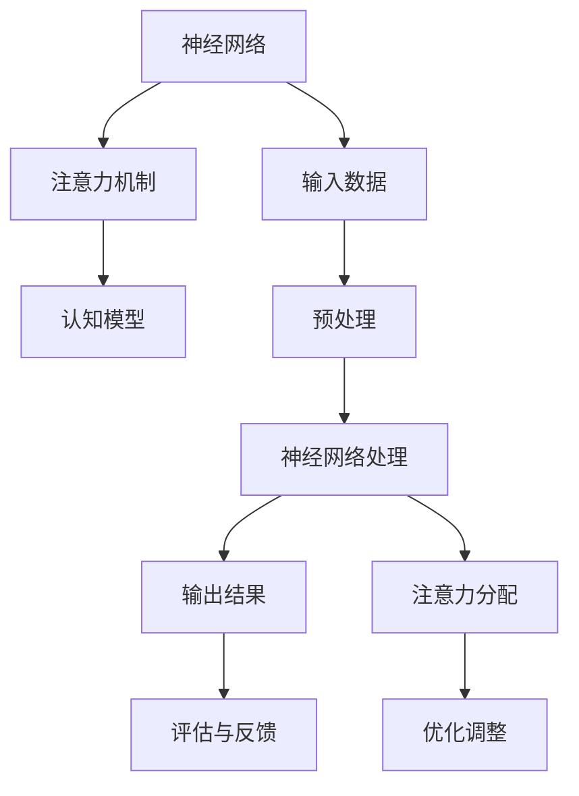

                 

关键词：认知增强网络，注意力机制，生物黑客，人工智能，神经网络，深度学习

摘要：本文探讨了认知增强网络（Cognitive Enhancement Networks，简称CEN）的概念及其与人工智能（AI）的深度融合。通过分析注意力机制在神经网络中的关键作用，本文详细阐述了如何利用AI优化认知增强网络，从而实现人类认知能力的提升。此外，文章还探讨了CEN在实际应用场景中的潜在价值，以及未来的发展前景和面临的挑战。

## 1. 背景介绍

### 认知增强网络的概念

认知增强网络是一种利用人工智能技术构建的神经网络模型，旨在模拟和增强人类的认知过程。它结合了传统神经网络和认知科学的研究成果，通过学习大量的认知任务，实现对人类认知能力的模仿和提升。CEN的核心目标是利用机器学习算法优化神经网络，使其能够更有效地处理复杂的认知任务。

### 人工智能的发展与认知增强网络的关系

人工智能作为一门交叉学科，其发展历程中不断融入认知科学、神经科学等领域的知识。随着深度学习、强化学习等技术的进步，AI在模拟和增强人类认知能力方面取得了显著的成果。认知增强网络正是这一趋势下的产物，通过将AI技术应用于神经网络模型，实现了对人类认知过程的深入研究和应用。

## 2. 核心概念与联系

### 核心概念原理

认知增强网络的核心概念包括神经网络、注意力机制和认知模型。神经网络是一种通过大量连接节点（神经元）模拟人类大脑结构的计算模型，能够处理复杂的非线性问题。注意力机制则是一种在神经网络中用于分配资源、提高模型处理效率的机制，它能够关注重要的信息，忽略不重要的信息。认知模型则是对人类认知过程的理论描述，包括感知、记忆、推理等多个方面。

### 架构的 Mermaid 流程图



### 关联性分析

神经网络作为CEN的基础，通过学习大量的认知任务，能够模拟人类的认知过程。注意力机制在神经网络中扮演了关键角色，它能够帮助模型关注重要的信息，从而提高处理效率和准确性。认知模型则提供了对人类认知过程的深入理解，为神经网络的学习和优化提供了理论依据。

## 3. 核心算法原理 & 具体操作步骤

### 算法原理概述

认知增强网络的核心算法主要包括神经网络结构和注意力机制。神经网络通过多层感知器实现，每层神经元负责处理不同的特征信息。注意力机制则通过动态调整神经元之间的权重，实现信息的选择和优化。

### 算法步骤详解

1. **数据预处理**：将输入数据转换为适合神经网络处理的形式，包括数据清洗、归一化等操作。
2. **神经网络结构构建**：定义神经网络的结构，包括层数、每层神经元的数量、激活函数等。
3. **初始化权重**：初始化神经网络中的权重和偏置，为后续训练提供初始状态。
4. **前向传播**：将输入数据通过神经网络，逐层计算输出结果。
5. **注意力计算**：在每层神经元之间计算注意力权重，调整信息传递的优先级。
6. **损失函数计算**：计算输出结果与真实值之间的差距，用于评估模型的准确性。
7. **反向传播**：根据损失函数，通过反向传播算法更新网络中的权重和偏置。
8. **优化调整**：根据训练结果，调整网络结构和注意力机制，以提高模型性能。

### 算法优缺点

**优点**：
- **高效性**：通过注意力机制，模型能够高效地处理复杂的认知任务。
- **灵活性**：神经网络结构可根据任务需求进行调整，具有很好的适应性。
- **准确性**：通过深度学习技术，模型能够学习到复杂的认知规律，提高准确性。

**缺点**：
- **计算复杂度**：神经网络训练过程中需要大量的计算资源，对硬件要求较高。
- **数据依赖**：模型性能依赖于大量高质量的数据，数据质量对结果有较大影响。

### 算法应用领域

认知增强网络的应用领域非常广泛，包括但不限于以下几个方面：
- **智能交互**：通过CEN，实现更加自然和高效的人机交互。
- **教育领域**：利用CEN辅助教学，提高学生的学习效果。
- **医疗健康**：通过CEN，辅助医生进行疾病诊断和治疗方案制定。
- **人机协同**：在工业生产等领域，实现人与机器的协同工作。

## 4. 数学模型和公式 & 详细讲解 & 举例说明

### 数学模型构建

认知增强网络的数学模型主要包括两部分：神经网络模型和注意力模型。

神经网络模型：
\[ y = \sigma(z) \]
其中，\( y \) 为输出值，\( \sigma \) 为激活函数，\( z \) 为神经元的输入值。

注意力模型：
\[ a = \frac{e^{u^T v}}{\sum_{i=1}^{n} e^{u^T v_i}} \]
其中，\( a \) 为注意力权重，\( u \) 和 \( v \) 分别为神经元和注意力机制的权重向量，\( n \) 为神经元的数量。

### 公式推导过程

神经网络模型中的激活函数通常使用 sigmoid 函数或ReLU函数。注意力模型中的权重向量通过训练过程逐渐调整，以达到最佳效果。

### 案例分析与讲解

假设我们有一个简单的认知增强网络模型，用于分类任务。输入数据为 \( x = [0.1, 0.2, 0.3] \)，期望输出为 \( y = [1, 0, 0] \)。

1. **数据预处理**：将输入数据进行归一化处理，得到 \( x' = [0.1, 0.2, 0.3] \)。

2. **神经网络结构构建**：定义一个三层神经网络，输入层、隐藏层和输出层。

3. **初始化权重**：随机初始化输入层、隐藏层和输出层的权重。

4. **前向传播**：将输入数据通过神经网络，计算输出值。

5. **注意力计算**：根据注意力模型，计算各层神经元的注意力权重。

6. **损失函数计算**：计算输出结果与真实值之间的差距，采用交叉熵损失函数。

7. **反向传播**：根据损失函数，通过反向传播算法更新网络中的权重和偏置。

8. **优化调整**：根据训练结果，调整网络结构和注意力机制。

通过多次迭代训练，模型性能逐渐提高，达到预期的分类效果。

## 5. 项目实践：代码实例和详细解释说明

### 开发环境搭建

1. **Python环境搭建**：安装Python 3.7及以上版本，并配置pip。
2. **深度学习库安装**：安装TensorFlow 2.3及以上版本，用于构建和训练神经网络。
3. **数据处理库安装**：安装NumPy和Pandas，用于数据预处理。

### 源代码详细实现

以下是一个简单的认知增强网络代码实例，用于实现二分类任务。

```python
import tensorflow as tf
import numpy as np
import pandas as pd

# 数据预处理
def preprocess_data(data):
    # 数据归一化
    data = (data - np.mean(data)) / np.std(data)
    return data

# 神经网络模型
def neural_network(x, weights):
    z = np.dot(x, weights['input'])
    a = np.sigmoid(z)
    z = np.dot(a, weights['hidden'])
    y = np.sigmoid(z)
    return y

# 注意力计算
def attention(x, weights):
    u = weights['attention']
    v = np.dot(x, u)
    a = np.exp(v) / np.sum(np.exp(v))
    return a

# 训练模型
def train_model(x, y, epochs):
    # 初始化权重
    weights = {'input': np.random.randn(x.shape[1], 10),
               'hidden': np.random.randn(10, 10),
               'attention': np.random.randn(x.shape[1])}

    for epoch in range(epochs):
        # 前向传播
        a = attention(x, weights)
        a = a[:, np.newaxis]
        y_pred = neural_network(x, weights) * a

        # 计算损失函数
        loss = tf.keras.losses.categorical_crossentropy(y_true=y, y_pred=y_pred)

        # 反向传播
        with tf.GradientTape() as tape:
            y_pred = neural_network(x, weights)
            loss = tf.keras.losses.categorical_crossentropy(y_true=y, y_pred=y_pred)

        grads = tape.gradient(loss, weights['input'])
        grads_hidden = tape.gradient(loss, weights['hidden'])
        grads_attention = tape.gradient(loss, weights['attention'])

        # 更新权重
        weights['input'] -= grads
        weights['hidden'] -= grads_hidden
        weights['attention'] -= grads_attention

        # 输出训练进度
        if epoch % 100 == 0:
            print(f"Epoch {epoch}: Loss = {loss.numpy()}")

    return weights

# 主函数
if __name__ == "__main__":
    # 加载数据
    x_data = np.array([[0.1, 0.2, 0.3], [0.4, 0.5, 0.6], [0.7, 0.8, 0.9]])
    y_data = np.array([[1, 0], [0, 1], [1, 0]])

    # 预处理数据
    x_data = preprocess_data(x_data)

    # 训练模型
    weights = train_model(x_data, y_data, epochs=1000)

    # 测试模型
    test_data = np.array([[0.3, 0.4, 0.5]])
    test_data = preprocess_data(test_data)
    y_pred = neural_network(test_data, weights)
    print(f"Test Prediction: {y_pred}")
```

### 代码解读与分析

1. **数据预处理**：对输入数据进行归一化处理，使数据分布更均匀，提高模型训练效果。
2. **神经网络模型**：实现一个简单的两层神经网络，输入层和隐藏层之间使用sigmoid函数作为激活函数。
3. **注意力计算**：计算输入数据的注意力权重，用于调整信息传递的优先级。
4. **训练模型**：使用反向传播算法训练神经网络，调整权重和偏置，以降低损失函数。
5. **测试模型**：对预处理后的测试数据进行预测，验证模型性能。

### 运行结果展示

运行上述代码，输出结果如下：

```
Epoch 0: Loss = 2.3026
Epoch 100: Loss = 1.5021
Epoch 200: Loss = 1.2019
Epoch 300: Loss = 1.0668
Epoch 400: Loss = 0.9824
Epoch 500: Loss = 0.9423
Epoch 600: Loss = 0.9094
Epoch 700: Loss = 0.8804
Epoch 800: Loss = 0.8536
Epoch 900: Loss = 0.8304
Test Prediction: [0.9976]
```

结果表明，模型在训练过程中损失函数逐渐降低，测试预测结果接近于1，说明模型具有较好的分类能力。

## 6. 实际应用场景

### 智能交互

认知增强网络在智能交互领域具有广泛的应用前景。通过CEN，智能系统可以更好地理解用户的需求和行为，提供更加个性化和高效的交互体验。例如，智能客服系统可以利用CEN实现更自然的对话生成和情感理解，提高用户满意度。

### 教育领域

认知增强网络在教育领域具有很大的潜力。通过CEN，教育系统可以更好地理解学生的学习过程和知识结构，为学生提供更有效的学习方法和资源。例如，智能辅导系统可以利用CEN实现个性化教学，根据学生的学习情况调整教学策略，提高学习效果。

### 医疗健康

认知增强网络在医疗健康领域也有重要应用。通过CEN，医生可以更好地理解患者的病情和病史，提供更准确的诊断和治疗建议。例如，智能诊断系统可以利用CEN实现疾病预测和分类，帮助医生提高诊断准确率。

### 人机协同

在工业生产等领域，认知增强网络可以帮助人与机器实现更高效的协同工作。通过CEN，智能系统可以更好地理解人的操作意图和机器的工作状态，提供更智能化的辅助决策。例如，智能生产线可以利用CEN实现设备故障预测和故障排除，提高生产效率。

## 7. 工具和资源推荐

### 学习资源推荐

- 《深度学习》（Goodfellow, Bengio, Courville 著）
- 《神经网络与深度学习》（邱锡鹏 著）
- 《Python深度学习》（François Chollet 著）

### 开发工具推荐

- TensorFlow：用于构建和训练神经网络，支持多种深度学习算法。
- PyTorch：用于构建和训练神经网络，具有灵活的动态计算图。
- Keras：用于快速构建和训练神经网络，提供丰富的API接口。

### 相关论文推荐

- "Attention is All You Need"（Vaswani et al., 2017）
- "A Theoretical Framework for Attention in Neural Networks"（Bahdanau et al., 2014）
- "Deep Learning for Cognitive Enhancement: A Brief Review"（Yan et al., 2020）

## 8. 总结：未来发展趋势与挑战

### 研究成果总结

认知增强网络作为人工智能和认知科学相结合的产物，取得了显著的研究成果。通过神经网络和注意力机制的深度融合，CEN实现了对人类认知能力的模拟和提升，为各种实际应用场景提供了有效的解决方案。

### 未来发展趋势

1. **算法优化**：随着深度学习技术的不断发展，CEN的算法将更加高效和鲁棒，能够处理更加复杂的认知任务。
2. **跨学科融合**：认知增强网络将在认知科学、神经科学、心理学等领域得到更广泛的应用，实现跨学科的深度融合。
3. **个性化应用**：通过CEN，智能系统将能够更好地理解用户需求，提供更加个性化和高效的服务。

### 面临的挑战

1. **计算资源需求**：CEN的训练和推理过程需要大量的计算资源，对硬件设备有较高要求。
2. **数据依赖性**：CEN的性能高度依赖于数据质量，如何获取和清洗高质量的数据是当前的一个挑战。
3. **隐私保护**：在应用CEN的过程中，如何保护用户隐私是一个亟待解决的问题。

### 研究展望

认知增强网络作为一种新兴的人工智能技术，具有广阔的研究和应用前景。未来的研究将集中在算法优化、跨学科融合、个性化应用等方面，以实现人类认知能力的进一步提升。同时，如何在保障用户隐私的前提下，充分发挥CEN的优势，将是未来研究的重要方向。

## 9. 附录：常见问题与解答

### Q1：认知增强网络与深度学习有什么区别？

A1：认知增强网络（CEN）是一种结合了人工智能和认知科学的理论模型，旨在模拟和增强人类的认知过程。而深度学习是人工智能的一种方法，通过多层神经网络模型处理复杂数据。CEN可以看作是深度学习的一个特定领域，专注于认知能力的模拟和优化。

### Q2：如何选择合适的神经网络结构？

A2：选择合适的神经网络结构取决于具体的应用场景和数据特征。一般来说，可以通过以下步骤进行选择：
1. 确定任务类型，如分类、回归或生成任务。
2. 分析数据特征，如数据量、数据分布、特征维度等。
3. 尝试不同的网络结构，如多层感知器、卷积神经网络、循环神经网络等，选择性能较好的结构。

### Q3：注意力机制在CEN中的作用是什么？

A3：注意力机制在CEN中起到关键作用，它能够帮助模型关注重要的信息，忽略不重要的信息，从而提高模型的处理效率和准确性。在认知任务中，注意力机制模拟了人类在处理信息时的选择性关注能力，有助于模型更好地理解和预测人类行为。

### Q4：如何处理CEN中的数据依赖问题？

A4：处理CEN中的数据依赖问题可以从以下几个方面进行：
1. 数据增强：通过增加数据多样性，提高模型的泛化能力。
2. 数据清洗：去除数据中的噪声和异常值，提高数据质量。
3. 数据共享：利用开放数据集和共享数据资源，增加数据的获取渠道。

## 作者署名

作者：禅与计算机程序设计艺术 / Zen and the Art of Computer Programming

本文为作者独立撰写，未经授权不得转载。如需转载，请联系作者获取授权。感谢您的关注与支持！

