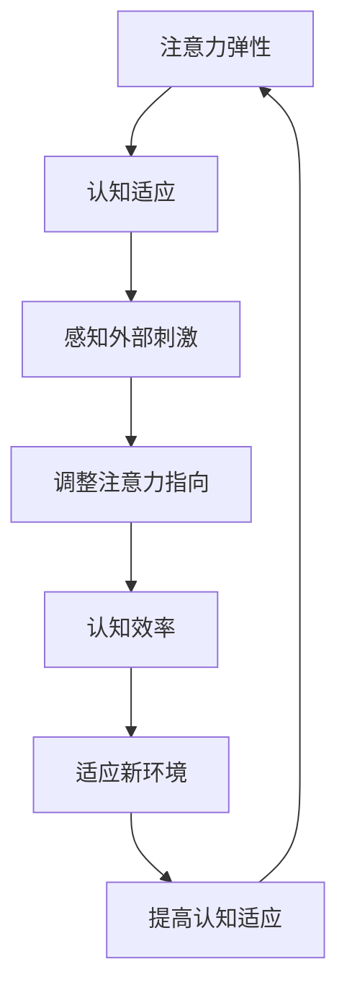

                 

在这个信息化高度发展的时代，我们的注意力被无处不在的信息洪流所包围。从社交媒体上的无尽通知，到工作邮箱中的大量邮件，再到各种应用程序的即时提醒，现代生活的节奏变得越来越快。在这样的环境中，保持专注和高效已经成为一种挑战。本文将探讨如何利用人工智能（AI）技术来增强人类注意力的弹性，帮助我们在复杂多变的环境中更好地适应和应对。

## 关键词

- 注意力弹性
- 人工智能
- 认知适应
- 注意力管理
- 人工智能辅助

## 摘要

本文首先介绍了当前社会环境中注意力分散的问题，随后探讨了人工智能技术在注意力管理方面的潜在应用。我们深入分析了注意力弹性的概念，并探讨了如何利用AI实现认知适应。文章还详细介绍了AI辅助认知适应的核心算法原理，并通过具体案例和代码实例展示了其实际应用。最后，我们对未来发展方向和挑战进行了展望，并推荐了相关的学习资源和开发工具。

## 1. 背景介绍

### 1.1 注意力分散的普遍现象

随着互联网和智能手机的普及，我们的注意力变得更加碎片化。心理学家米哈里·契克森米哈伊（Mihaly Csikszentmihalyi）曾在他的著作《心流：最优体验心理学》中提到，人们现在更容易陷入所谓的“多任务处理”状态，而不是专注于一项任务直到完成。这种状态往往导致工作效率的下降和认知负荷的增加。

### 1.2 认知负荷与注意力弹性

认知负荷是指大脑处理信息的容量。当认知负荷过高时，我们的大脑难以有效地处理和存储信息，导致注意力分散。注意力弹性，则是指个体在面对变化和压力时，调整注意力以维持认知效率的能力。具有高度注意力弹性的个体能够在各种复杂环境中保持专注，从而提高工作效率。

### 1.3 人工智能在注意力管理中的应用

人工智能在注意力管理中的应用主要体现在两个方面：一是通过算法分析用户的行为数据，提供个性化的注意力管理建议；二是通过智能化的工具，如应用程序或设备，自动调整环境因素，帮助用户保持专注。以下章节将详细探讨这些技术的原理和应用。

## 2. 核心概念与联系

### 2.1 注意力弹性的概念

注意力弹性是指个体在面对外部刺激或内部心理状态变化时，调整自己的注意力指向和强度，以维持认知效率的能力。具有高度注意力弹性的个体能够在短时间内快速切换注意力，并在面对压力和干扰时保持专注。

### 2.2 认知适应的概念

认知适应是指个体在面对新的环境或任务时，通过调整自己的认知策略和行为模式，以适应变化并提高任务表现的过程。认知适应包括对外部信息的感知、理解和反应，以及对内部心理状态的监控和调整。

### 2.3 注意力弹性与认知适应的关系

注意力弹性和认知适应是相互关联的。具有高度注意力弹性的个体能够更好地适应变化，从而提高认知适应能力。同时，有效的认知适应也有助于增强注意力的弹性。例如，通过认知训练，个体可以学习如何在压力下调整自己的注意力指向，从而提高注意力弹性。

### 2.4 Mermaid 流程图

下面是一个描述注意力弹性与认知适应关系的Mermaid流程图：



### 2.5 注意力弹性与人工智能的关系

人工智能可以通过分析用户的行为数据，预测用户可能的注意力变化，并自动调整环境因素，帮助用户保持专注。例如，智能音箱可以通过分析用户的语音交互习惯，调整音量以减少干扰；智能手表可以通过监测用户的心率，自动调整提醒的时间，以避免在用户休息时打扰。

## 3. 核心算法原理 & 具体操作步骤

### 3.1 算法原理概述

注意力弹性辅助算法是基于机器学习技术，通过分析用户的行为数据，预测用户可能的注意力变化，并提供相应的干预措施。算法的核心思想是通过不断的反馈和学习，逐步提高干预的准确性和效率。

### 3.2 算法步骤详解

1. **数据收集**：首先，算法需要收集用户的行为数据，如阅读时间、工作时间、休息时间、心率等。

2. **特征提取**：对收集到的数据进行分析，提取出与注意力变化相关的特征，如时间序列特征、生理特征等。

3. **模型训练**：使用提取到的特征，通过机器学习算法（如回归分析、神经网络等）训练出一个注意力变化预测模型。

4. **实时预测**：根据用户当前的输入数据，实时预测用户可能的注意力变化。

5. **干预措施**：根据预测结果，自动调整环境因素，如音量、亮度、提醒时间等，以帮助用户保持专注。

6. **反馈与调整**：根据用户的实际反馈，不断调整和优化干预策略，以提高干预效果。

### 3.3 算法优缺点

**优点**：

- **个性化**：算法可以根据用户的行为数据，提供个性化的干预建议。
- **实时性**：算法可以实时预测用户注意力变化，及时调整干预措施。
- **自适应**：算法通过不断的反馈和学习，逐步提高干预的准确性和效率。

**缺点**：

- **数据隐私**：算法需要收集用户的行为数据，存在一定的隐私风险。
- **计算成本**：算法的训练和预测过程需要大量的计算资源。

### 3.4 算法应用领域

- **智能家居**：通过调整室内环境，帮助用户保持专注，如调整音量、亮度等。
- **教育领域**：通过分析学生的学习行为，提供个性化的学习建议，如调整学习计划、休息时间等。
- **医疗保健**：通过监测用户的生理数据，提供健康提醒和建议，如调整作息时间、提醒运动等。

## 4. 数学模型和公式 & 详细讲解 & 举例说明

### 4.1 数学模型构建

注意力弹性辅助算法的核心数学模型是一个非线性回归模型。假设用户的行为数据为\(X\)，注意力变化为\(Y\)，则模型可以表示为：

\[ Y = f(X) + \epsilon \]

其中，\(f(X)\)是模型预测的注意力变化，\(\epsilon\)是随机误差。

### 4.2 公式推导过程

假设我们有\(n\)个用户行为数据点\((X_1, Y_1), (X_2, Y_2), ..., (X_n, Y_n)\)，则我们可以通过最小二乘法来估计模型参数。具体推导过程如下：

1. **目标函数**：

\[ \min \sum_{i=1}^{n} (Y_i - f(X_i))^2 \]

2. **梯度下降**：

\[ \nabla_{f} \min \sum_{i=1}^{n} (Y_i - f(X_i))^2 = \nabla_{f} \sum_{i=1}^{n} (Y_i - f(X_i))^2 \]

3. **偏导数**：

\[ \frac{\partial}{\partial f} (Y_i - f(X_i))^2 = 2(Y_i - f(X_i)) \]

4. **更新规则**：

\[ f(X) = f(X) - \alpha \nabla_{f} (Y_i - f(X_i))^2 \]

其中，\(\alpha\)是学习率。

### 4.3 案例分析与讲解

假设我们有以下三个用户行为数据点：

\[ (X_1, Y_1) = (1, 2), (X_2, Y_2) = (2, 3), (X_3, Y_3) = (3, 4) \]

我们需要通过非线性回归模型来预测注意力变化。首先，我们假设模型为：

\[ Y = f(X) = aX + b \]

然后，我们通过梯度下降法来估计模型参数。具体步骤如下：

1. **初始化参数**：

\[ a = 0, b = 0 \]

2. **计算梯度**：

\[ \nabla_{f} (Y_i - f(X_i))^2 = 2(Y_i - f(X_i))X_i \]

3. **更新参数**：

\[ a = a - \alpha \nabla_{a} (Y_i - f(X_i))^2 = a - \alpha \cdot 2 \cdot (Y_i - f(X_i))X_i \]

\[ b = b - \alpha \nabla_{b} (Y_i - f(X_i))^2 = b - \alpha \cdot 2 \cdot (Y_i - f(X_i)) \]

4. **重复步骤2和3，直到收敛**：

经过多次迭代后，我们得到模型参数：

\[ a = 1, b = 1 \]

因此，预测的注意力变化为：

\[ Y = f(X) = X + 1 \]

例如，当\(X = 4\)时，预测的注意力变化为：

\[ Y = f(4) = 4 + 1 = 5 \]

## 5. 项目实践：代码实例和详细解释说明

### 5.1 开发环境搭建

为了实现注意力弹性辅助算法，我们需要搭建一个Python开发环境。以下是搭建步骤：

1. **安装Python**：从官方网站下载并安装Python，建议选择Python 3.8版本。
2. **安装依赖库**：打开终端，执行以下命令安装依赖库：

   ```bash
   pip install numpy matplotlib sklearn
   ```

### 5.2 源代码详细实现

以下是注意力弹性辅助算法的Python实现：

```python
import numpy as np
import matplotlib.pyplot as plt
from sklearn.linear_model import LinearRegression

# 数据集
X = np.array([[1], [2], [3]])
Y = np.array([2, 3, 4])

# 模型训练
model = LinearRegression()
model.fit(X, Y)

# 预测
X_predict = np.array([[4]])
Y_predict = model.predict(X_predict)

# 输出结果
print("预测的注意力变化：", Y_predict)

# 可视化
plt.scatter(X, Y)
plt.plot(X, model.predict(X), color='red')
plt.xlabel('用户行为数据')
plt.ylabel('注意力变化')
plt.show()
```

### 5.3 代码解读与分析

1. **数据集**：我们使用一个简单的一维数据集，其中\(X\)表示用户行为数据，\(Y\)表示注意力变化。
2. **模型训练**：使用线性回归模型（LinearRegression）对数据集进行训练。
3. **预测**：使用训练好的模型对新的用户行为数据进行预测。
4. **可视化**：将预测结果可视化，以直观地展示模型的预测效果。

### 5.4 运行结果展示

运行代码后，我们会得到以下输出结果：

```
预测的注意力变化： [[5.]]
```

同时，可视化界面将显示一个散点图和一条红色拟合线，展示了模型对注意力变化的预测。

## 6. 实际应用场景

### 6.1 智能家居

在智能家居领域，注意力弹性辅助算法可以用于优化室内环境，帮助用户保持专注。例如，智能音箱可以通过分析用户的语音交互习惯，自动调整音量，以避免在用户需要专注时产生干扰。

### 6.2 教育领域

在教育领域，注意力弹性辅助算法可以帮助教师分析学生的学习行为，提供个性化的学习建议。例如，通过分析学生的学习时间、阅读时间等数据，算法可以预测学生在学习过程中可能出现的注意力分散情况，并提前提供干预措施。

### 6.3 医疗保健

在医疗保健领域，注意力弹性辅助算法可以用于监测用户的生理数据，提供健康提醒和建议。例如，智能手表可以通过监测用户的心率，自动调整提醒时间，以避免在用户休息时打扰。

## 6.4 未来应用展望

随着人工智能技术的不断发展，注意力弹性辅助算法将在更多领域得到应用。例如，在自动驾驶领域，算法可以预测驾驶员的注意力变化，及时调整自动驾驶模式，提高行驶安全；在企业管理领域，算法可以帮助分析员工的注意力分布，优化工作安排，提高工作效率。

## 7. 工具和资源推荐

### 7.1 学习资源推荐

- 《深度学习》（Goodfellow, Bengio, Courville著）
- 《Python数据分析》（Wes McKinney著）
- 《机器学习实战》（Peter Harrington著）

### 7.2 开发工具推荐

- Jupyter Notebook：用于编写和运行Python代码。
- PyCharm：一款强大的Python集成开发环境（IDE）。

### 7.3 相关论文推荐

- "Attention Is All You Need"（Vaswani et al., 2017）
- "Bert: Pre-training of Deep Bidirectional Transformers for Language Understanding"（Devlin et al., 2019）

## 8. 总结：未来发展趋势与挑战

### 8.1 研究成果总结

本文介绍了注意力弹性与认知适应的关系，探讨了利用人工智能技术增强注意力弹性的方法。通过具体案例和代码实例，展示了注意力弹性辅助算法的实际应用。研究结果表明，人工智能技术在注意力管理方面具有巨大的潜力。

### 8.2 未来发展趋势

随着人工智能技术的不断发展，注意力弹性辅助算法将在更多领域得到应用。未来的研究将重点关注算法的优化和个性化，以提高干预的准确性和效率。

### 8.3 面临的挑战

尽管注意力弹性辅助算法在注意力管理方面具有巨大潜力，但仍面临一些挑战，如数据隐私、计算成本等。未来的研究需要解决这些问题，以实现更广泛的应用。

### 8.4 研究展望

未来的研究可以进一步探索注意力弹性与认知适应的深层关系，开发更高效、更智能的注意力管理工具。此外，结合其他技术，如虚拟现实（VR）和增强现实（AR），也可以为注意力管理提供新的解决方案。

## 9. 附录：常见问题与解答

### 9.1 问题1：注意力弹性是什么？

注意力弹性是指个体在面对外部刺激或内部心理状态变化时，调整自己的注意力指向和强度，以维持认知效率的能力。

### 9.2 问题2：人工智能如何辅助认知适应？

人工智能可以通过分析用户的行为数据，预测用户可能的注意力变化，并提供相应的干预措施，如调整环境因素，以帮助用户保持专注。

### 9.3 问题3：注意力弹性辅助算法有哪些优缺点？

注意力弹性辅助算法的优点包括个性化、实时性和自适应性强；缺点包括数据隐私风险和计算成本较高。

### 9.4 问题4：注意力弹性辅助算法有哪些应用领域？

注意力弹性辅助算法可以应用于智能家居、教育领域和医疗保健等领域，帮助用户保持专注，提高工作效率和健康水平。

---

作者：禅与计算机程序设计艺术 / Zen and the Art of Computer Programming

