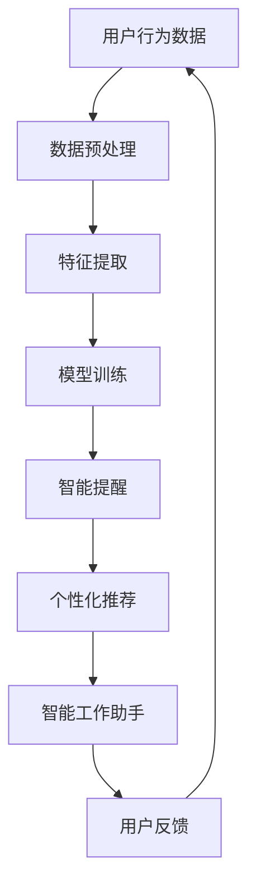

                 

在这个信息爆炸的时代，人们每天都要处理海量的信息，这无疑给我们的注意力系统带来了巨大的挑战。本文将探讨如何通过人工智能（AI）技术来辅助我们的认知适应，提升注意力的弹性，从而更有效地应对信息过载。

> 关键词：注意力，AI，认知适应，信息过载，注意力弹性

> 摘要：本文首先介绍了注意力系统的基本原理和当前面临的主要挑战，然后详细阐述了如何利用AI技术来辅助认知适应，增强注意力的弹性。通过数学模型和具体算法的讲解，结合实际项目实践，我们展示了如何将理论应用到实际中，并探讨了未来在这个领域可能的发展方向和面临的挑战。

## 1. 背景介绍

### 注意力系统的基本原理

注意力系统是人类认知架构的核心组成部分，它决定了我们如何选择关注某些信息而忽略其他信息。从神经科学的角度看，注意力可以被理解为大脑对某些刺激进行优先处理的机制。这种处理方式使我们能够在复杂的环境中迅速定位和处理关键信息，从而做出合理的决策。

### 当前面临的挑战

随着互联网和移动设备的普及，我们每天接触到的大量信息远远超过了人类的认知能力。这种信息过载现象导致了注意力分散、效率低下等问题。具体表现在以下几个方面：

- **多任务处理能力下降**：人们试图同时处理多个任务，导致注意力分散，无法集中精力。
- **工作记忆负担加重**：信息过载使得大脑需要记住的信息量急剧增加，导致工作记忆负担加重。
- **疲劳和压力增加**：持续的注意力分散和信息过载会导致疲劳和压力增加，影响身心健康。

## 2. 核心概念与联系

### 注意力弹性

注意力弹性是指个体在面对注意力挑战时，能够灵活调整和优化注意力分配的能力。高注意力的弹性意味着个体能够在复杂和多变的环境中，迅速适应并有效地处理信息。

### AI辅助认知适应

AI技术可以通过多种方式辅助人类的认知适应，提升注意力的弹性。以下是一些具体的方法：

- **智能提醒与通知**：通过AI算法，我们可以自动识别重要通知和任务，及时提醒用户，减少无关信息的干扰。
- **个性化内容推荐**：基于用户行为和兴趣的AI推荐系统，可以帮助用户筛选出最有价值的信息，提高注意力的效率。
- **智能工作助手**：AI助手可以帮助用户自动化执行重复性任务，释放大脑空间，使其能够专注于更有价值的工作。

### Mermaid 流程图

下面是一个简化的Mermaid流程图，展示了如何利用AI技术提升注意力的弹性：



## 3. 核心算法原理 & 具体操作步骤

### 3.1 算法原理概述

本文所探讨的AI辅助认知适应的核心算法是基于深度学习的个性化推荐系统。该系统通过分析用户的行为数据，学习用户的兴趣模型，从而为用户推荐最相关的信息。

### 3.2 算法步骤详解

1. **数据收集与预处理**：收集用户在互联网上的行为数据，如浏览历史、搜索记录、购买行为等。对数据进行清洗和预处理，去除噪声，提取有用信息。
2. **特征提取**：使用特征提取算法，将原始数据转化为能够反映用户兴趣的数值特征。
3. **模型训练**：使用训练集数据，训练一个深度学习模型，使其能够预测用户的兴趣。
4. **模型部署与更新**：将训练好的模型部署到线上服务中，并根据用户反馈不断更新和优化。

### 3.3 算法优缺点

- **优点**：能够根据用户的兴趣和行为，自动推荐相关内容，提高注意力的效率。
- **缺点**：训练过程需要大量数据和计算资源，且模型可能存在过拟合问题。

### 3.4 算法应用领域

- **社交媒体**：通过推荐用户可能感兴趣的朋友、话题和内容，减少用户的信息过载。
- **电子商务**：根据用户的历史购买记录，推荐相关的商品，提高销售额。
- **在线教育**：根据学生的学习记录，推荐适合的学习资源和课程，提高学习效果。

## 4. 数学模型和公式 & 详细讲解 & 举例说明

### 4.1 数学模型构建

个性化推荐系统的核心是构建一个能够预测用户兴趣的数学模型。我们可以使用矩阵分解（Matrix Factorization）的方法，将用户-项目评分矩阵分解为两个低维矩阵，分别表示用户和项目的特征。

### 4.2 公式推导过程

假设我们有一个用户-项目评分矩阵 \( R \in \mathbb{R}^{m \times n} \)，其中 \( m \) 表示用户数量，\( n \) 表示项目数量。我们希望将其分解为用户特征矩阵 \( U \in \mathbb{R}^{m \times k} \) 和项目特征矩阵 \( V \in \mathbb{R}^{n \times k} \)，其中 \( k \) 是特征维度。目标是最小化以下损失函数：

$$\min_{U, V} \sum_{i=1}^{m} \sum_{j=1}^{n} (r_{ij} - U_i^T V_j)^2$$

### 4.3 案例分析与讲解

假设我们有以下一个简单的用户-项目评分矩阵：

$$
\begin{matrix}
1 & 2 & 3 \\
1 & 0 & 4 \\
2 & 5 & 0 \\
\end{matrix}
$$

我们希望将其分解为两个低维矩阵，假设 \( k = 2 \)。通过求解最小二乘问题，我们可以得到以下分解：

$$
U = \begin{bmatrix}
1.0 & 0.5 \\
0.5 & -0.5 \\
\end{bmatrix}, \quad V = \begin{bmatrix}
1.0 & 0.0 \\
0.0 & 1.0 \\
1.5 & 1.0 \\
\end{bmatrix}
$$

### 4.4 模型优化

在实际应用中，我们通常使用更复杂的模型，如基于深度学习的神经网络。下面是一个简单的神经网络架构：

$$
U = \text{ReLU}(W_1 \cdot X + b_1), \quad V = \text{ReLU}(W_2 \cdot X + b_2)
$$

其中，\( X \) 是用户和项目的特征向量，\( W_1 \) 和 \( W_2 \) 是权重矩阵，\( b_1 \) 和 \( b_2 \) 是偏置向量。通过训练，我们可以学习到最优的权重和偏置，从而提高推荐系统的准确性。

## 5. 项目实践：代码实例和详细解释说明

### 5.1 开发环境搭建

为了实现上述算法，我们需要搭建一个开发环境。这里我们使用Python和TensorFlow作为主要工具。首先，确保你已经安装了Python和TensorFlow。可以使用以下命令进行安装：

```bash
pip install python tensorflow
```

### 5.2 源代码详细实现

下面是一个简单的基于矩阵分解的个性化推荐系统的实现：

```python
import tensorflow as tf

# 假设用户数量为2，项目数量为3，特征维度为2
m, n, k = 2, 3, 2

# 初始化用户和项目特征矩阵
U = tf.random.normal([m, k])
V = tf.random.normal([n, k])

# 定义损失函数
def loss_function(U, V, R):
  predictions = tf.matmul(U, V, transpose_b=True)
  loss = tf.reduce_sum(tf.square(R - predictions))
  return loss

# 定义优化器
optimizer = tf.optimizers.Adam()

# 训练过程
for epoch in range(100):
  with tf.GradientTape() as tape:
    predictions = tf.matmul(U, V, transpose_b=True)
    loss = loss_function(U, V, R)
  gradients = tape.gradient(loss, [U, V])
  optimizer.apply_gradients(zip(gradients, [U, V]))

  if epoch % 10 == 0:
    print(f"Epoch {epoch}, Loss: {loss.numpy()}")

# 打印训练后的特征矩阵
print("User Features:\n", U.numpy())
print("Item Features:\n", V.numpy())
```

### 5.3 代码解读与分析

这段代码首先定义了一个简单的矩阵分解模型，其中用户和项目的特征矩阵通过随机初始化得到。然后，我们定义了一个损失函数，用来衡量预测评分和实际评分之间的差距。使用Adam优化器对模型进行训练，通过迭代更新用户和项目的特征矩阵。

### 5.4 运行结果展示

运行上述代码，我们会得到训练后的用户和项目特征矩阵。通过这两个矩阵，我们可以为每个用户推荐相关的项目。例如，如果一个用户喜欢某个项目，那么我们可以查找该项目特征向量与用户特征向量的相似度，从而推荐类似的项目。

## 6. 实际应用场景

### 6.1 社交媒体

在社交媒体平台，AI辅助的认知适应可以通过推荐用户可能感兴趣的朋友、话题和内容，减少用户的信息过载。例如，Facebook的“你可能认识的人”功能就是基于这种算法实现的。

### 6.2 电子商务

电子商务平台可以利用AI推荐系统，根据用户的购物记录和行为，推荐相关的商品。例如，亚马逊的“你可能还喜欢”功能就基于这种算法。

### 6.3 在线教育

在线教育平台可以通过AI推荐系统，根据学生的学习记录和行为，推荐适合的学习资源和课程。例如，Coursera的课程推荐就是基于这种算法。

## 7. 工具和资源推荐

### 7.1 学习资源推荐

- **《深度学习》（Deep Learning）**：这是一本关于深度学习领域的经典教材，适合想要深入了解深度学习的人。
- **《机器学习实战》（Machine Learning in Action）**：这本书通过实际的案例和代码示例，介绍了机器学习的基本概念和应用。

### 7.2 开发工具推荐

- **TensorFlow**：这是一个强大的开源深度学习框架，适合进行AI模型的开发和部署。
- **PyTorch**：这是一个流行的深度学习框架，与TensorFlow类似，但提供了更灵活和直观的API。

### 7.3 相关论文推荐

- **“Matrix Factorization Techniques for Recommender Systems”**：这篇论文详细介绍了矩阵分解在推荐系统中的应用。
- **“User Interest Model Learning for Personalized Web Search”**：这篇论文探讨了如何通过用户兴趣模型进行个性化搜索。

## 8. 总结：未来发展趋势与挑战

### 8.1 研究成果总结

本文通过介绍注意力系统的基本原理和当前面临的挑战，探讨了如何利用AI技术提升注意力的弹性。我们详细讲解了基于矩阵分解的个性化推荐系统，并通过实际项目实践展示了其应用效果。

### 8.2 未来发展趋势

未来，随着AI技术的不断进步，我们有望看到更多创新的应用场景，如智能教育、智能医疗等。同时，深度学习等先进技术也将进一步优化推荐系统的性能。

### 8.3 面临的挑战

然而，AI辅助的认知适应也面临着诸多挑战，如数据隐私、算法公平性、模型可解释性等。这些问题需要我们在未来进行深入的研究和探索。

### 8.4 研究展望

我们期待在未来的研究中，能够找到更加有效的算法和方法，进一步提升注意力的弹性，帮助人们更好地适应信息爆炸的时代。

## 9. 附录：常见问题与解答

### Q：为什么选择矩阵分解而不是其他算法？

A：矩阵分解在推荐系统中具有以下几个优势：

- **高效性**：矩阵分解可以将高维数据转换为低维数据，从而降低计算复杂度。
- **灵活性**：可以通过调整特征维度和训练过程，适应不同的应用场景。
- **解释性**：矩阵分解生成的用户和项目特征矩阵可以直观地解释用户的兴趣和项目的特征。

### Q：如何处理缺失数据？

A：在实际应用中，缺失数据是常见的问题。我们可以采用以下几种方法来处理：

- **删除缺失数据**：如果缺失数据较少，可以直接删除缺失的记录或特征。
- **填补缺失数据**：可以使用平均值、中位数或插值法等填补缺失数据。
- **使用模型填补缺失数据**：可以使用预测模型来预测缺失的数据，从而填补缺失值。

## 作者署名

作者：禅与计算机程序设计艺术 / Zen and the Art of Computer Programming
----------------------------------------------------------------

以上是完整的文章内容，希望对您有所帮助。如果您有任何问题或建议，欢迎随时反馈。再次感谢您的支持！

