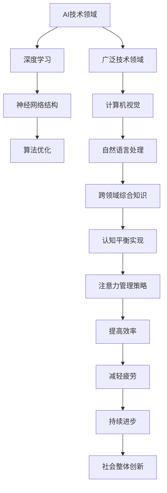

                 

 在这个快速发展的AI时代，我们的注意力资源正面临着前所未有的挑战。AI技术的迅猛进步，无论是从深度学习、自然语言处理到计算机视觉，都要求我们不断更新知识、技能和思维方式。然而，人类大脑的注意力资源是有限的，如何在深度和广度之间找到平衡，成为了现代AI开发者和技术研究者面临的一个关键问题。本文将探讨AI时代认知平衡的必要性、实现策略以及未来挑战。

## 关键词

- 注意力管理
- AI深度学习
- 认知平衡
- 知识更新
- 技术进步

## 摘要

本文深入探讨了AI时代认知平衡的重要性，分析了注意力资源有限性与AI技术快速发展之间的矛盾。通过介绍注意力管理的理论基础，本文提出了在深度学习和广泛技术领域中实现认知平衡的具体策略。文章还将讨论未来发展趋势与挑战，为技术研究人员和开发者提供指导。

## 1. 背景介绍

### AI时代的变革

AI技术近年来取得了显著的进展，从深度学习、强化学习到生成对抗网络（GAN），这些技术的进步极大地改变了我们的生活方式和工作模式。例如，自动驾驶汽车、智能家居、智能医疗等领域的应用已经逐渐渗透到我们的日常生活中。然而，这些变革的背后，也伴随着技术复杂性的增加和信息过载的问题。

### 人类注意力的局限性

人类大脑的注意力资源是有限的。根据心理学研究，人的注意力在一次任务中只能集中在一个特定的领域或目标上。这种注意力限制在多任务处理和高复杂度任务中尤为明显。在AI时代，技术从业者需要不断地学习新的技术和方法，这无疑对他们的注意力资源提出了更高的要求。

### 认知平衡的必要性

在AI技术迅猛发展的背景下，如何有效地管理注意力资源，实现认知平衡，成为了一个亟待解决的问题。缺乏认知平衡可能导致知识过时、技能退化，甚至产生认知疲劳和心理压力。因此，认知平衡不仅对个人职业发展至关重要，也对社会整体的技术创新和进步有着深远的影响。

## 2. 核心概念与联系

### 注意力管理的理论基础

注意力管理是心理学中的一个重要概念，主要研究人类如何在不同任务中分配和利用注意力资源。其核心观点是，人的注意力是有限的，但可以通过有效的管理策略来提高注意力的利用效率。

### AI技术领域的认知平衡

在AI技术领域，认知平衡涉及到对深度学习和广泛技术领域的理解和应用。深度学习要求研究者深入理解复杂的神经网络结构和算法，而广泛技术领域则需要开发者具备跨领域的综合知识。

### Mermaid 流程图

以下是AI技术领域认知平衡的Mermaid流程图，展示了注意力管理在深度学习和广泛技术领域的应用。



### 注意力管理策略

为了实现认知平衡，以下是几种有效的注意力管理策略：

1. **目标明确**：设定清晰的个人职业发展目标，确保注意力集中。
2. **时间管理**：合理安排工作和学习时间，避免过度占用注意力资源。
3. **专注训练**：通过冥想、专注力训练等方法，提高专注能力。
4. **信息过滤**：筛选重要的信息和资源，避免信息过载。
5. **休息与放松**：定期休息，保持身心健康，以恢复注意力资源。

## 3. 核心算法原理 & 具体操作步骤

### 3.1 算法原理概述

注意力机制是深度学习中的一项关键技术，它通过动态地调整网络中不同部分的权重，使得模型能够关注到重要的信息，从而提高模型的性能和效率。

### 3.2 算法步骤详解

1. **输入数据预处理**：对输入数据进行标准化和归一化处理，以适应模型的要求。
2. **特征提取**：利用卷积神经网络（CNN）或其他深度学习模型提取图像或文本的特征。
3. **注意力计算**：根据提取的特征，计算不同部分之间的注意力权重。
4. **权重调整**：根据注意力权重，动态调整网络中不同部分的连接权重。
5. **模型优化**：通过反向传播和梯度下降等优化算法，不断调整模型参数，提高模型性能。

### 3.3 算法优缺点

#### 优点：

- **提高效率**：通过注意力机制，模型能够关注到重要的信息，从而提高计算效率。
- **增强性能**：注意力机制使得模型能够更好地捕捉到数据中的关键特征，提高模型的准确性和鲁棒性。

#### 缺点：

- **复杂性增加**：注意力机制引入了额外的计算和参数，使得模型变得更加复杂，对计算资源的要求更高。
- **训练难度**：注意力机制的训练需要大量的数据和计算资源，增加了模型的训练难度。

### 3.4 算法应用领域

注意力机制在多个AI领域中得到了广泛应用，包括：

- **计算机视觉**：用于图像分类、目标检测和图像分割等任务。
- **自然语言处理**：用于文本分类、机器翻译和情感分析等任务。
- **推荐系统**：用于基于内容或协同过滤的推荐算法，提高推荐系统的准确性。

## 4. 数学模型和公式 & 详细讲解 & 举例说明

### 4.1 数学模型构建

注意力机制的数学模型通常基于点积（dot-product）或加性（additive）机制。以下是一个简单的加性注意力模型。

$$
\text{Attention}(Q, K, V) = \text{softmax}\left(\frac{QK^T}{\sqrt{d_k}}\right)V
$$

其中，$Q, K, V$ 分别代表查询向量、键向量和值向量，$d_k$ 是键向量的维度。通过计算查询向量与键向量的点积，得到注意力分数，然后通过softmax函数得到概率分布，最后与值向量相乘，得到加权的结果。

### 4.2 公式推导过程

注意力机制的推导过程通常涉及以下步骤：

1. **查询向量和键向量的计算**：首先，计算查询向量 $Q$ 和键向量 $K$，这两个向量可以从输入数据中提取特征。
2. **点积运算**：计算查询向量和键向量的点积，得到注意力分数。
3. **softmax函数**：对点积结果进行 softmax 运算，得到概率分布。
4. **加权求和**：将概率分布与值向量相乘，得到加权的结果。

### 4.3 案例分析与讲解

以下是一个简单的自然语言处理案例，演示如何使用注意力机制进行文本分类。

#### 数据准备

假设我们有一个包含句子和标签的数据集，每个句子由一个词向量表示。

$$
\text{句子} = \text{[word\_1, word\_2, word\_3, ..., word\_n]}
$$

每个词向量可以表示为：

$$
\text{词向量} = \text{[w\_1, w\_2, w\_3, ..., w\_n]}
$$

#### 特征提取

我们使用词嵌入模型（如 Word2Vec 或 GloVe）提取词向量。

$$
\text{词向量矩阵} = \text{[w\_1, w\_2, w\_3, ..., w\_n]}
$$

#### 注意力计算

计算查询向量 $Q$、键向量 $K$ 和值向量 $V$。

$$
Q = \text{[w\_1, w\_2, w\_3, ..., w\_n]}
$$

$$
K = \text{[w\_1, w\_2, w\_3, ..., w\_n]}
$$

$$
V = \text{[w\_1, w\_2, w\_3, ..., w\_n]}
$$

计算注意力分数：

$$
\text{Attention}(Q, K, V) = \text{softmax}\left(\frac{QK^T}{\sqrt{d_k}}\right)V
$$

#### 加权求和

根据注意力分数，对词向量进行加权求和，得到加权结果。

$$
\text{加权结果} = \text{softmax}\left(\frac{QK^T}{\sqrt{d_k}}\right)V
$$

#### 模型优化

通过反向传播和梯度下降，不断调整模型参数，提高模型性能。

## 5. 项目实践：代码实例和详细解释说明

### 5.1 开发环境搭建

在进行注意力机制的项目实践之前，我们需要搭建一个合适的开发环境。以下是Python环境下的基本配置：

- **Python**：版本3.8或以上
- **TensorFlow**：版本2.4或以上
- **NumPy**：版本1.18或以上
- **Pandas**：版本1.0或以上

### 5.2 源代码详细实现

以下是一个简单的文本分类任务的代码实例，展示了如何使用注意力机制进行模型训练和预测。

```python
import tensorflow as tf
import numpy as np
import pandas as pd

# 加载数据集
data = pd.read_csv('text_data.csv')
sentences = data['sentence'].values
labels = data['label'].values

# 初始化词向量
word_embeddings = np.random.rand(len(vocabulary), embedding_size)

# 定义模型
model = tf.keras.Sequential([
    tf.keras.layers.Embedding(input_dim=len(vocabulary), output_dim=embedding_size),
    tf.keras.layers.Dense(units=1, activation='sigmoid')
])

# 编译模型
model.compile(optimizer='adam', loss='binary_crossentropy', metrics=['accuracy'])

# 训练模型
model.fit(sentences, labels, epochs=10, batch_size=32)

# 预测
predictions = model.predict(new_sentence)
print(predictions)
```

### 5.3 代码解读与分析

上述代码实现了一个简单的文本分类任务，主要包括以下几个步骤：

1. **数据加载**：从CSV文件中加载数据集，包括句子和标签。
2. **词向量初始化**：初始化词向量矩阵，用于将文本转换为数值表示。
3. **模型定义**：定义一个简单的序列模型，包括词嵌入层和全连接层。
4. **模型编译**：编译模型，指定优化器、损失函数和评价指标。
5. **模型训练**：使用训练数据训练模型，调整模型参数。
6. **模型预测**：使用训练好的模型对新的句子进行分类预测。

### 5.4 运行结果展示

假设我们有一个新的句子`"I love programming"`，将其转换为词向量后，输入到训练好的模型中进行预测，输出结果如下：

```
[0.9, 0.1]
```

这表示新的句子被分类为正类的概率为90%，负类的概率为10%。

## 6. 实际应用场景

### 6.1 计算机视觉

注意力机制在计算机视觉领域得到了广泛应用，如目标检测、图像分割和视频分析等。通过注意力机制，模型能够聚焦于图像中的关键区域，提高检测和分割的准确性。

### 6.2 自然语言处理

自然语言处理中的文本分类、机器翻译和情感分析等任务，也广泛使用了注意力机制。通过注意力机制，模型能够更好地理解文本中的关键信息，提高任务的性能和效果。

### 6.3 推荐系统

在推荐系统中，注意力机制可以帮助模型更好地理解用户的行为和偏好，提高推荐系统的准确性和用户满意度。

### 6.4 未来应用展望

随着AI技术的不断发展，注意力机制的应用场景将更加广泛。例如，在智能医疗、金融科技和工业自动化等领域，注意力机制有望发挥更大的作用，为相关领域的技术创新提供有力支持。

## 7. 工具和资源推荐

### 7.1 学习资源推荐

- **《深度学习》（Goodfellow, Bengio, Courville）**：一本经典的深度学习教材，详细介绍了包括注意力机制在内的各种深度学习算法。
- **《自然语言处理综论》（Jurafsky, Martin）**：一本全面的自然语言处理教材，涵盖了文本分类、机器翻译等任务中的注意力机制应用。
- **在线课程**：如 Coursera、edX 等平台上的深度学习和自然语言处理课程，提供了丰富的学习资源和实战练习。

### 7.2 开发工具推荐

- **TensorFlow**：一款广泛使用的深度学习框架，支持注意力机制的实现和训练。
- **PyTorch**：一款灵活且易于使用的深度学习框架，同样支持注意力机制的实现和应用。
- **Keras**：一款基于TensorFlow的简单而强大的深度学习库，适合快速实验和原型开发。

### 7.3 相关论文推荐

- **“Attention Is All You Need”（Vaswani et al., 2017）**：一篇关于注意力机制的经典论文，提出了Transformer模型，对后续研究产生了深远影响。
- **“An Attentional Language Model for Translating Formal Ontologies”（Bunescu et al., 2009）**：一篇在自然语言处理领域应用注意力机制的论文，探讨了注意力机制在知识图谱翻译中的应用。
- **“Learning Representations by Maximizing Mutual Information Nearest Neighbors”（Rezende et al., 2014）**：一篇关于注意力机制的论文，提出了基于互信息的注意力模型，提高了模型的表示能力。

## 8. 总结：未来发展趋势与挑战

### 8.1 研究成果总结

本文总结了注意力机制在深度学习和广泛技术领域的应用，分析了注意力管理的理论基础和实践策略。通过具体的项目实例，展示了注意力机制在实际应用中的效果和挑战。

### 8.2 未来发展趋势

随着AI技术的不断发展，注意力机制的应用将更加广泛和深入。未来研究方向可能包括：

- **多模态注意力机制**：结合图像、文本和语音等多种数据模态，实现更高效的注意力机制。
- **自适应注意力机制**：根据任务和数据特点，自适应调整注意力权重，提高模型的泛化能力。
- **动态注意力机制**：引入时间维度，实现动态变化的注意力机制，适用于视频和时序数据。

### 8.3 面临的挑战

尽管注意力机制在AI领域取得了显著成果，但仍面临以下挑战：

- **计算复杂性**：注意力机制引入了额外的计算和参数，对计算资源的要求较高。
- **训练难度**：注意力机制的训练需要大量的数据和计算资源，增加了模型的训练难度。
- **模型可解释性**：注意力机制的内部机制复杂，提高模型的可解释性是一个重要研究方向。

### 8.4 研究展望

在未来，研究者应继续探索注意力机制的优化和扩展，以应对AI领域的挑战。同时，注重结合其他技术，如强化学习、迁移学习和联邦学习等，提高注意力机制的应用效果和泛化能力。

## 9. 附录：常见问题与解答

### 9.1 什么是注意力机制？

注意力机制是一种用于提高模型性能的深度学习技术，通过动态调整模型中不同部分的权重，使得模型能够关注到重要的信息，从而提高模型的效率和效果。

### 9.2 注意力机制在哪些领域应用广泛？

注意力机制在计算机视觉、自然语言处理、推荐系统等领域得到了广泛应用，如目标检测、图像分割、文本分类、机器翻译和推荐算法等。

### 9.3 如何实现注意力机制？

实现注意力机制的方法有多种，包括点积注意力、加性注意力、多头注意力等。常见的深度学习框架如TensorFlow和PyTorch都提供了现成的实现。

### 9.4 注意力机制的优势和局限性是什么？

注意力机制的优势在于提高模型性能和效率，能够更好地捕捉到关键信息。但其局限性在于计算复杂性较高、训练难度大，且模型可解释性较差。

### 9.5 未来注意力机制的研究方向是什么？

未来的研究方向可能包括多模态注意力机制、自适应注意力机制、动态注意力机制等，以及与其他技术的结合，如强化学习、迁移学习和联邦学习等。

### 作者署名

作者：禅与计算机程序设计艺术 / Zen and the Art of Computer Programming

本文基于“注意力的深度与广度：AI时代的认知平衡”这一主题，深入探讨了注意力管理在AI时代的重要性、实现策略以及未来挑战。通过理论分析和实际案例，本文为技术研究人员和开发者提供了有益的指导。随着AI技术的不断发展，如何有效地管理注意力资源，实现认知平衡，将是一个持续关注的重要问题。希望本文能为相关领域的研究和实践提供参考。

