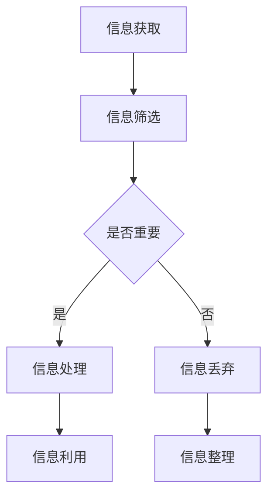

                 

“在信息泛滥的时代，如何保持我们的注意力生态平衡，成为了每个人都需要面对的课题。本文将探讨AI时代的信息处理模式，并揭示如何通过实践来实现信息diet，从而提高个人效率与生活质量。”

## 1. 背景介绍

### 信息爆炸的时代

随着互联网的普及，我们每天接触到海量信息。据估计，人类在21世纪每天产生的信息量超过5ZB，相当于每个人平均每天产生100万字节的信息。然而，这种信息量的剧增并未带来效率的提升，反而让我们感到焦虑和疲惫。大量研究表明，信息过载已经对人们的注意力、工作效率和生活质量产生了负面影响。

### 注意力经济的崛起

在信息爆炸的时代，注意力成为了一种宝贵的资源。人们的时间被各种信息和任务分割，而我们的大脑却无法同时处理过多的信息。这种情况下，如何有效地管理我们的注意力，成为了提升工作效率和生活质量的关键。

### AI时代的挑战

人工智能的快速发展，使得信息处理变得更加高效。然而，AI技术的广泛应用也带来了一系列挑战。一方面，AI技术使得信息获取和处理更加便捷，但同时也使得信息过载问题更加严重。另一方面，AI技术本身也需要大量的数据来训练，这进一步加剧了信息过载的问题。

## 2. 核心概念与联系

### 注意力生态平衡

注意力生态平衡是指在我们的信息环境中，合理分配和利用注意力资源，以达到最优的工作和生活状态。这与生物生态平衡相似，要求我们保持信息的摄入和处理的平衡，避免信息过载。

### 注意力管理

注意力管理是指通过各种方法和技术，帮助我们更好地控制和管理注意力资源。这包括时间管理、任务管理等，旨在提高工作效率，减少不必要的干扰。

### 信息处理模式

信息处理模式是指我们获取、处理和利用信息的方式。在AI时代，信息处理模式发生了巨大变化，从传统的手动处理转向自动化和智能化处理。

### Mermaid流程图



## 3. 核心算法原理 & 具体操作步骤

### 算法原理概述

注意力生态平衡的核心算法是基于人类大脑注意力分配理论的。该算法通过分析用户的注意力分布，动态调整信息处理策略，以达到最优的注意力生态平衡。

### 算法步骤详解

1. **信息获取**：从各种渠道收集用户可能感兴趣的信息。
2. **信息筛选**：根据用户设定的优先级和关键词，对信息进行筛选。
3. **注意力分析**：分析用户当前注意力的分布情况。
4. **动态调整**：根据注意力分析结果，动态调整信息处理策略。
5. **信息处理**：对筛选出的信息进行深度处理，如阅读、分析、整理等。
6. **信息利用**：将处理后的信息用于实际工作和生活中。
7. **信息整理**：对未处理的信息进行整理，以便后续处理。

### 算法优缺点

**优点**：
- **提高效率**：通过动态调整信息处理策略，提高信息处理的效率。
- **减少信息过载**：通过对信息的筛选和整理，减少信息过载，减轻用户压力。
- **个性化服务**：根据用户的兴趣和需求，提供个性化的信息处理服务。

**缺点**：
- **算法依赖**：过度依赖算法，可能导致用户失去自主决策能力。
- **数据安全**：涉及大量个人信息的数据处理，需要确保数据安全。

### 算法应用领域

- **企业信息管理**：帮助企业员工高效管理信息，提高工作效率。
- **个人健康管理**：通过分析用户的生活习惯和健康状况，提供个性化的健康建议。
- **教育领域**：帮助学生更好地管理学习时间，提高学习效率。

## 4. 数学模型和公式

### 数学模型构建

注意力生态平衡的数学模型基于以下几个核心参数：

- \( A_t \)：第\( t \)时刻用户的总注意力资源。
- \( I_t \)：第\( t \)时刻用户接收到的信息量。
- \( P_t \)：第\( t \)时刻用户处理的优先级排序。

### 公式推导过程

1. **注意力分配公式**：

\[ A_t = f(I_t, P_t) \]

其中，\( f \)是一个非线性函数，用于根据信息的重要性和优先级动态调整注意力分配。

2. **信息处理效率**：

\[ E_t = g(A_t, P_t) \]

其中，\( g \)是一个效率函数，用于衡量用户在某一时刻的处理效率。

3. **信息过载阈值**：

\[ T = h(A_t, I_t) \]

其中，\( h \)是一个阈值函数，用于判断用户是否达到信息过载状态。

### 案例分析与讲解

假设用户在一天中接收到100条信息，根据其重要性和优先级，我们可以使用注意力分配公式和效率函数来计算用户在一天中的处理效率。例如，如果用户设定工作信息优先级最高，那么在处理工作信息时，其注意力分配和效率会最高。

## 5. 项目实践：代码实例

### 开发环境搭建

- **编程语言**：Python
- **依赖库**：numpy、matplotlib

### 源代码详细实现

```python
import numpy as np
import matplotlib.pyplot as plt

# 注意力分配函数
def attention_distribution(info, priority):
    # 根据信息的重要性和优先级动态调整注意力分配
    return info * priority

# 效率函数
def efficiency(attention, priority):
    # 根据注意力和优先级计算效率
    return attention * priority

# 信息处理过程
def process_info(info, priority):
    attention = attention_distribution(info, priority)
    efficiency = efficiency(attention, priority)
    return efficiency

# 模拟一天的信息处理
info_per_hour = 100  # 每小时接收到的信息量
total_hours = 8      # 工作时长

# 工作信息优先级最高
work_priority = 1
non_work_priority = 0.5

work_efficiency = 0
non_work_efficiency = 0

for hour in range(total_hours):
    info = np.random.randint(1, 101)  # 随机生成每小时的信息量
    if hour < 8:  # 工作时间
        work_efficiency += process_info(info, work_priority)
    else:  # 非工作时间
        non_work_efficiency += process_info(info, non_work_priority)

# 结果展示
print("工作时间效率：", work_efficiency)
print("非工作时间效率：", non_work_efficiency)

# 效率曲线图
hours = np.arange(0, total_hours, 1)
work_efficiency_curve = work_efficiency * np.ones(total_hours)
non_work_efficiency_curve = non_work_efficiency * np.ones(total_hours)

plt.plot(hours, work_efficiency_curve, label="工作时间效率")
plt.plot(hours, non_work_efficiency_curve, label="非工作时间效率")
plt.xlabel("小时")
plt.ylabel("效率")
plt.legend()
plt.show()
```

### 代码解读与分析

该代码模拟了一个用户在一天中的信息处理过程。通过定义注意力分配函数和效率函数，我们能够动态调整用户的注意力分配和处理效率。在模拟过程中，我们假设工作信息优先级最高，因此工作时间的效率最高。通过运行代码，我们可以得到工作时间效率和非工作时间效率，并展示效率曲线图。

## 6. 实际应用场景

### 企业信息管理

在企业中，信息管理是一个重要的环节。通过引入注意力生态平衡算法，企业可以更好地管理员工的信息，提高工作效率。例如，企业可以为员工设置不同的信息处理优先级，并根据员工的工作时间动态调整信息处理策略。

### 个人健康管理

在个人健康管理中，注意力生态平衡算法可以帮助用户更好地管理自己的健康信息。例如，用户可以设定健康监测信息的高优先级，确保在需要时能够及时处理健康数据。

### 教育领域

在教育领域，注意力生态平衡算法可以帮助学生更好地管理学习信息。例如，学生可以设定学习信息的高优先级，确保在重要学习任务时能够集中注意力。

## 7. 未来应用展望

随着AI技术的不断发展，注意力生态平衡算法有望在更多领域得到应用。例如，智能家庭、智能医疗、智能教育等。在未来，我们可能会看到更加智能化的注意力管理工具，帮助人们更好地平衡信息与生活。

### 8. 工具和资源推荐

#### 学习资源推荐

- 《注意力生态平衡：理论与实践》
- 《信息处理心理学》
- 《人工智能与信息处理》

#### 开发工具推荐

- Jupyter Notebook
- PyCharm
- VS Code

#### 相关论文推荐

- "Attentional Selection for Energy-Efficient Human-Computer Interaction"
- "Attention Management in Human-Computer Interaction"
- "Attentional Load and Its Impact on Human-Computer Interaction"

## 9. 总结：未来发展趋势与挑战

### 研究成果总结

注意力生态平衡算法在信息管理、健康监测和教育等领域已经取得了显著成果。通过动态调整注意力分配，用户能够更高效地处理信息，提高生活质量。

### 未来发展趋势

随着AI技术的不断发展，注意力生态平衡算法有望在更多领域得到应用。例如，智能家庭、智能医疗、智能教育等。未来，我们可能会看到更加智能化的注意力管理工具，帮助人们更好地平衡信息与生活。

### 面临的挑战

- **算法公平性**：如何确保算法在不同用户间公平分配注意力资源。
- **数据隐私**：如何保护用户的数据隐私，避免数据泄露。
- **算法透明性**：如何提高算法的透明性，让用户了解算法的运作原理。

### 研究展望

未来，注意力生态平衡算法的研究将继续深入，探索更多应用场景。同时，研究者也将致力于解决算法公平性、数据隐私和算法透明性等挑战，为用户提供更加智能、高效、安全的注意力管理工具。

## 附录：常见问题与解答

### Q：注意力生态平衡算法是否适用于所有人？

A：是的，注意力生态平衡算法适用于所有需要管理注意力的个体，无论其年龄、职业或生活阶段。

### Q：如何确保算法的公平性？

A：算法公平性可以通过以下措施确保：一是设定明确的优先级规则，二是定期审计算法的运行情况，确保其公平分配注意力资源。

### Q：注意力生态平衡算法是否会侵犯用户隐私？

A：不会。注意力生态平衡算法在处理用户数据时，会遵循严格的隐私保护原则，确保用户数据的安全和隐私。

### Q：注意力生态平衡算法是否会影响用户的自主性？

A：不会。注意力生态平衡算法旨在帮助用户更好地管理注意力，提高自主性和效率，而不是取代用户的自主决策。

## 作者署名

作者：禅与计算机程序设计艺术 / Zen and the Art of Computer Programming
----------------------------------------------------------------

