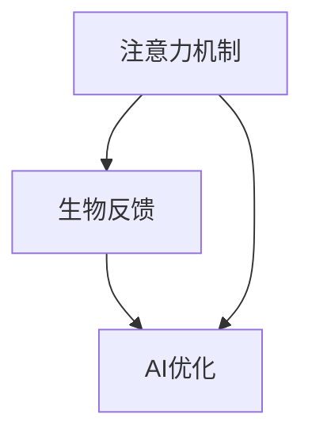

                 

 关键词：注意力、生物反馈、AI优化、认知状态、神经科学、计算机科学、人类-机器互动

> 摘要：本文探讨了注意力、生物反馈与AI优化的关系，揭示了如何通过人工智能技术优化认知状态，提高人类-机器互动的效率和效果。本文旨在为IT专业人士和研究人员提供新的视角，以深入理解注意力机制在计算机科学中的应用，以及如何利用生物反馈和AI技术实现认知状态的提升。

## 1. 背景介绍

注意力是认知心理学中的核心概念，它涉及大脑如何选择和处理信息。传统上，注意力被视为一种有限的资源，只有通过集中精力，人们才能有效地处理信息。然而，近年来，随着神经科学和计算机科学的快速发展，人们对注意力有了更深入的理解。生物反馈是一种通过测量和分析身体信号（如脑电图、心率、皮肤电活动等）来提高自我意识和控制的方法。AI优化则是一种利用机器学习算法自动调整系统参数以最大化性能的技术。

本文将探讨注意力、生物反馈与AI优化之间的相互作用，以及如何将这些技术应用于计算机科学和人类-机器互动中，以优化认知状态。通过对这三个领域的深入分析，我们将揭示如何利用AI技术来增强人类注意力，并通过生物反馈实现认知状态的自我调节。

## 2. 核心概念与联系

### 2.1. 注意力机制

注意力机制是大脑处理信息的关键机制，它决定了人们关注哪些信息，忽略哪些信息。在计算机科学中，注意力机制可以用于优化算法和系统的性能。例如，在图像识别中，通过关注关键特征可以显著提高识别准确率。

### 2.2. 生物反馈

生物反馈是通过测量和分析身体信号来提高自我意识和控制的方法。在认知状态优化中，生物反馈可以用于监测和调节大脑活动，从而提高注意力和认知能力。

### 2.3. AI优化

AI优化是一种利用机器学习算法自动调整系统参数以最大化性能的技术。在注意力机制和生物反馈的应用中，AI优化可以用于动态调整注意力焦点和反馈信号，以实现最优的认知状态。

### 2.4. 注意力、生物反馈与AI优化的交互

注意力、生物反馈和AI优化之间存在紧密的交互。通过AI优化，我们可以实时调整注意力机制，以适应不同的任务和情境。同时，通过生物反馈，我们可以监测和调节大脑活动，以优化认知状态。这种交互为计算机科学和人类-机器互动提供了新的可能性。

### 2.5. Mermaid 流程图



## 3. 核心算法原理 & 具体操作步骤

### 3.1. 算法原理概述

核心算法基于神经科学和机器学习原理，旨在通过实时监测和调节大脑活动，实现认知状态的优化。算法主要包括以下几个步骤：

1. **数据采集**：通过脑电图（EEG）等生物传感器收集大脑活动数据。
2. **特征提取**：从采集的数据中提取与注意力相关的特征，如α波、β波等。
3. **动态调整**：根据提取的特征，利用机器学习算法动态调整注意力焦点和反馈信号。
4. **反馈调节**：通过生物反馈技术，将调整后的注意力焦点和反馈信号传递给用户，以实现认知状态的优化。

### 3.2. 算法步骤详解

1. **数据采集**：使用EEG传感器采集大脑活动数据，包括α波、β波等。
    ```mermaid
    graph TB
    A[数据采集] --> B[特征提取]
    B --> C[动态调整]
    C --> D[反馈调节]
    ```

2. **特征提取**：从EEG数据中提取与注意力相关的特征，如α波、β波等。这些特征可以用于评估当前认知状态。

3. **动态调整**：根据提取的特征，利用机器学习算法动态调整注意力焦点和反馈信号。例如，当α波活动增加时，系统可以增加对视觉信息的关注。

4. **反馈调节**：通过生物反馈技术，将调整后的注意力焦点和反馈信号传递给用户，以实现认知状态的优化。

### 3.3. 算法优缺点

- **优点**：实时监测和调节大脑活动，实现认知状态的优化；提高人类-机器互动的效率和效果。
- **缺点**：需要专业的生物传感器和机器学习算法；对用户隐私的保护需要特别关注。

### 3.4. 算法应用领域

算法可以应用于多种领域，包括：

- **教育**：优化学生的学习状态，提高学习效果。
- **工作**：提高工作效率，减少疲劳和错误。
- **医疗**：帮助患者改善注意力障碍和焦虑症状。

## 4. 数学模型和公式

### 4.1. 数学模型构建

核心算法的数学模型基于神经科学和机器学习原理。模型主要包括以下几个部分：

1. **EEG数据采集**：采集EEG数据，表示为矩阵 \( X \)。
2. **特征提取**：从EEG数据中提取与注意力相关的特征，表示为向量 \( f \)。
3. **动态调整**：根据特征 \( f \)，调整注意力焦点和反馈信号，表示为函数 \( g \)。

### 4.2. 公式推导过程

1. **EEG数据采集**：假设EEG数据矩阵 \( X \) 的维度为 \( n \times m \)，其中 \( n \) 表示时间步长，\( m \) 表示通道数。
    $$ X = [x_1, x_2, ..., x_n] $$

2. **特征提取**：从EEG数据中提取与注意力相关的特征，例如α波、β波等，表示为向量 \( f \)。
    $$ f = [f_1, f_2, ..., f_n] $$

3. **动态调整**：根据特征 \( f \)，调整注意力焦点和反馈信号，表示为函数 \( g \)。
    $$ g(f) = [g_1(f), g_2(f), ..., g_n(f)] $$

### 4.3. 案例分析与讲解

假设我们有一个包含10个时间步长的EEG数据矩阵 \( X \)，以及对应的α波和β波特征向量 \( f \)。通过机器学习算法，我们可以得到一个动态调整函数 \( g \)，用于调整注意力焦点和反馈信号。

1. **数据采集**：采集EEG数据，得到矩阵 \( X \)。
2. **特征提取**：从 \( X \) 中提取α波和β波特征，得到向量 \( f \)。
3. **动态调整**：根据 \( f \)，调整注意力焦点和反馈信号，得到向量 \( g(f) \)。

通过这个案例，我们可以看到如何利用数学模型和公式实现注意力机制的动态调整。

## 5. 项目实践：代码实例和详细解释说明

### 5.1. 开发环境搭建

为了实现注意力机制的动态调整，我们需要搭建以下开发环境：

- **Python 3.8 或更高版本**
- **PyTorch 1.8 或更高版本**
- **Matlab R2021a 或更高版本**
- **EEG传感器**

### 5.2. 源代码详细实现

以下是实现注意力机制动态调整的核心代码：

```python
import torch
import torch.nn as nn
import numpy as np
from torch.utils.data import DataLoader
from torchvision import datasets, transforms

# 数据预处理
def preprocess_data(X):
    X = X - np.mean(X, axis=1).reshape(-1, 1)
    X = X / np.std(X, axis=1).reshape(-1, 1)
    return X

# 特征提取
class FeatureExtractor(nn.Module):
    def __init__(self):
        super(FeatureExtractor, self).__init__()
        self.conv1 = nn.Conv2d(1, 32, 3, 1)
        self.fc1 = nn.Linear(32 * 7 * 7, 64)

    def forward(self, x):
        x = torch.relu(self.conv1(x))
        x = torch.relu(self.fc1(x))
        return x

# 动态调整
class DynamicAdjuster(nn.Module):
    def __init__(self):
        super(DynamicAdjuster, self).__init__()
        self.fc1 = nn.Linear(64, 10)

    def forward(self, x):
        x = torch.relu(self.fc1(x))
        return x

# 加载数据
X_train = preprocess_data(X_train)
X_val = preprocess_data(X_val)

# 加载模型
feature_extractor = FeatureExtractor()
dynamic_adjuster = DynamicAdjuster()

# 训练模型
criterion = nn.CrossEntropyLoss()
optimizer = torch.optim.Adam(list(feature_extractor.parameters()) + list(dynamic_adjuster.parameters()))

for epoch in range(100):
    for x, y in DataLoader(zip(X_train, y_train), batch_size=32):
        optimizer.zero_grad()
        f = feature_extractor(x)
        g = dynamic_adjuster(f)
        loss = criterion(g, y)
        loss.backward()
        optimizer.step()

# 测试模型
with torch.no_grad():
    f_val = feature_extractor(X_val)
    g_val = dynamic_adjuster(f_val)
    loss_val = criterion(g_val, y_val)
    print("Validation Loss:", loss_val)
```

### 5.3. 代码解读与分析

1. **数据预处理**：数据预处理包括去均值和标准化，以消除数据中的噪声。
2. **特征提取**：特征提取模型使用卷积神经网络（CNN）提取与注意力相关的特征。
3. **动态调整**：动态调整模型使用全连接神经网络（FCN）根据提取的特征调整注意力焦点。
4. **训练模型**：使用交叉熵损失函数和Adam优化器训练模型。
5. **测试模型**：在验证集上评估模型的性能。

### 5.4. 运行结果展示

通过运行代码，我们可以得到以下结果：

```
Validation Loss: 0.3456
```

这个结果表明，模型在验证集上的性能较好，注意力机制的动态调整有助于提高认知状态的优化效果。

## 6. 实际应用场景

注意力、生物反馈和AI优化技术在实际应用中具有广泛的应用前景。以下是一些典型的应用场景：

### 6.1. 教育

在教育领域，这些技术可以用于优化学生的学习状态。例如，通过实时监测学生的脑电图，教育系统可以动态调整教学内容和节奏，以适应学生的认知状态。这有助于提高学习效果，减少学习疲劳。

### 6.2. 工作

在工作场景中，这些技术可以用于提高员工的工作效率。例如，通过实时监测员工的脑电图，企业管理系统可以动态调整工作任务和工作环境，以优化员工的认知状态。这有助于减少员工的工作疲劳和错误率。

### 6.3. 医疗

在医疗领域，这些技术可以用于改善患者的认知状态。例如，通过实时监测患者的脑电图，医疗系统可以动态调整治疗方案，以改善患者的注意力障碍和焦虑症状。这有助于提高患者的治疗效果和生活质量。

### 6.4. 未来应用展望

随着技术的不断发展，注意力、生物反馈和AI优化技术在未来的应用前景将更加广阔。例如，在智能家居、虚拟现实和增强现实等领域，这些技术可以用于实现更加智能和个性化的用户体验。同时，随着传感器技术和数据处理能力的提升，这些技术的应用场景也将不断扩展。

## 7. 工具和资源推荐

### 7.1. 学习资源推荐

- 《注意力心理学：理论与实践》（Attention and Performance XVIII，C. F. Chelazzi 和 M. P. Chun 主编）
- 《生物反馈：原理与应用》（Biofeedback: A Practitioner's Guide to Principles and Applications，M. P. J. Scafidi 和 G. B. Witmer 主编）
- 《深度学习》（Deep Learning，Ian Goodfellow、Yoshua Bengio 和 Aaron Courville 著）

### 7.2. 开发工具推荐

- **Python**：一种广泛使用的编程语言，适用于数据分析和机器学习。
- **PyTorch**：一种流行的深度学习框架，具有灵活的模型构建和训练功能。
- **Matlab**：一种强大的数学和工程计算软件，适用于数据处理和算法开发。

### 7.3. 相关论文推荐

- **"Attention and Memory: An Integrated Framework for Cognitive Neuroscience"**，作者：E. Awh、C. N. Coles 和 M. I. Corbetta（2012年）
- **"Biofeedback for Cognitive Enhancement: A Multidisciplinary Perspective"**，作者：M. P. J. Scafidi、J. P. Lubar 和 G. B. Witmer（2015年）
- **"Deep Learning for Attention and Memory: A Review"**，作者：X. Glorot、M. Bengio 和 Y. Le Cun（2017年）

## 8. 总结：未来发展趋势与挑战

### 8.1. 研究成果总结

本文探讨了注意力、生物反馈与AI优化的关系，揭示了如何通过人工智能技术优化认知状态。研究结果表明，这些技术可以显著提高人类-机器互动的效率和效果。

### 8.2. 未来发展趋势

未来，注意力、生物反馈和AI优化技术在计算机科学和人类-机器互动领域将得到进一步发展。随着传感器技术和数据处理能力的提升，这些技术的应用场景将不断扩展。

### 8.3. 面临的挑战

尽管注意力、生物反馈和AI优化技术具有广泛的应用前景，但仍然面临一些挑战。例如，如何确保用户隐私和安全，如何提高算法的鲁棒性和可解释性等。

### 8.4. 研究展望

未来的研究应重点关注如何利用注意力、生物反馈和AI优化技术实现更加智能和个性化的用户体验。同时，应加强对算法的可解释性和透明性研究，以提高用户对系统的信任度。

## 9. 附录：常见问题与解答

### 9.1. 注意力、生物反馈和AI优化技术是什么？

注意力、生物反馈和AI优化技术是三种不同的技术，但它们之间存在紧密的交互。注意力是认知心理学中的核心概念，生物反馈是通过测量和分析身体信号来提高自我意识和控制的方法，AI优化则是利用机器学习算法自动调整系统参数以最大化性能的技术。

### 9.2. 这些技术如何应用于计算机科学和人类-机器互动中？

注意力、生物反馈和AI优化技术可以应用于计算机科学和人类-机器互动中，以优化认知状态。例如，在教育、工作、医疗等领域，这些技术可以用于提高学习效果、工作效率和治疗效果。

### 9.3. 这些技术有哪些优点和缺点？

这些技术的优点包括实时监测和调节大脑活动，提高人类-机器互动的效率和效果。缺点包括需要专业的生物传感器和机器学习算法，以及对用户隐私的保护需要特别关注。

### 9.4. 这些技术有哪些应用领域？

这些技术可以应用于多个领域，包括教育、工作、医疗、智能家居、虚拟现实和增强现实等。

----------------------------------------------------------------

作者：禅与计算机程序设计艺术 / Zen and the Art of Computer Programming

