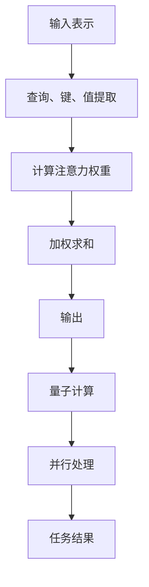
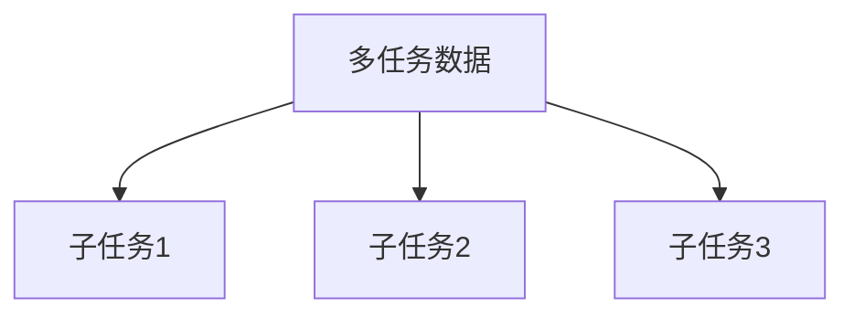
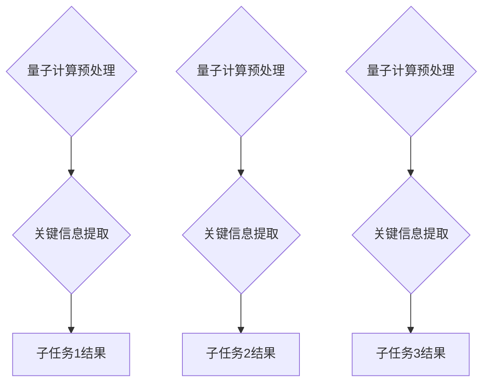
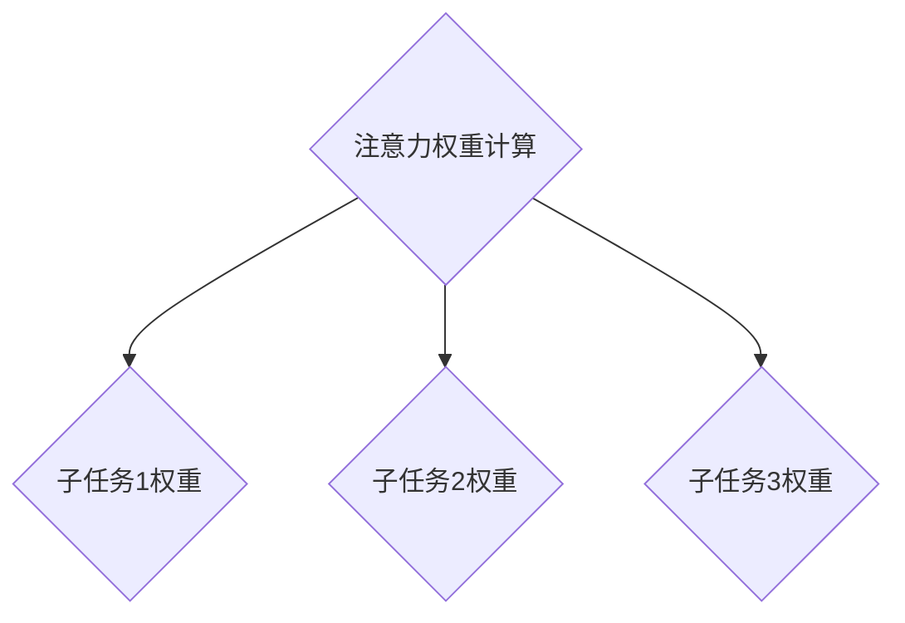
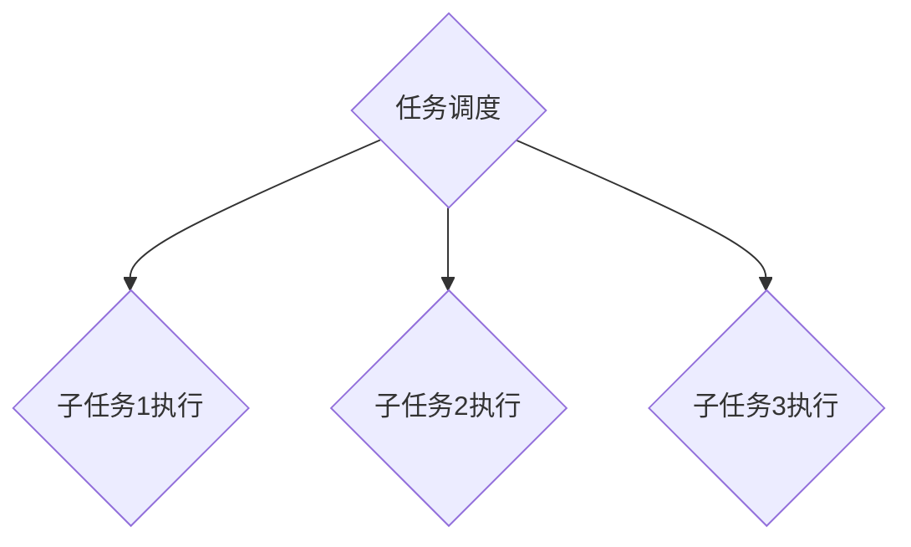
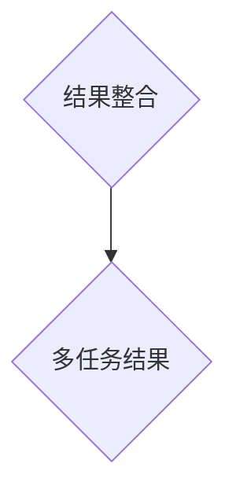

                 

关键词：多任务处理，注意力机制，量子计算，AI，深度学习

> 摘要：本文深入探讨了注意力机制与量子计算在AI多任务处理中的应用。首先介绍了注意力机制的原理及其在深度学习中的重要性，然后引入量子计算的概念，讨论其在处理复杂任务中的潜力。通过结合两者，本文构建了一个新的多任务处理框架，并详细阐述了其算法原理、数学模型和实际应用案例。

## 1. 背景介绍

### 多任务处理的需求

在现代社会，随着信息爆炸和复杂问题日益增多，人工智能（AI）系统需要处理越来越多的多任务。多任务处理是指在同一时间或短时间内，同时执行多个任务的能力。这种能力不仅能够提高系统的效率和响应速度，还能够增强其灵活性和适应性。

### 注意力机制在深度学习中的应用

注意力机制是深度学习中的一个关键创新，它使得模型能够自动识别并关注重要的信息。在自然语言处理、计算机视觉和语音识别等领域，注意力机制已经取得了显著的成功。例如，在机器翻译中，注意力机制能够帮助模型理解源句中的关键短语和语义，从而提高翻译质量。

### 量子计算的潜力

量子计算是一种基于量子力学原理的计算方式，它具有传统计算机无法比拟的计算速度和并行性。量子计算在处理复杂任务方面展示出了巨大的潜力，尤其是在人工智能领域。通过量子计算，我们有望实现更加高效的多任务处理，解决传统计算机难以克服的难题。

## 2. 核心概念与联系

### 注意力机制的原理

注意力机制的核心思想是通过学习一个权重矩阵，使模型能够在处理输入信息时自动关注最重要的部分。具体来说，注意力机制通过以下步骤实现：

1. **输入表示**：将输入数据（如图像、文本或音频）转换为向量表示。
2. **查询、键和值**：从输入表示中提取查询（Query）、键（Key）和值（Value）。
3. **计算注意力权重**：使用查询和键计算注意力权重，权重表示每个输入部分的重要性。
4. **加权求和**：将注意力权重与值相乘，并求和得到最终的输出。

### 量子计算的基本概念

量子计算的基本概念包括量子比特（qubit）、量子门（quantum gate）和量子叠加与纠缠。量子比特是量子计算的基本单元，它可以同时处于0和1的状态。量子门是作用于量子比特的基本操作，它可以实现量子态的变换。量子叠加和纠缠是量子计算的核心特性，它们使得量子计算机能够并行处理大量信息。

### 注意力机制与量子计算的联系

注意力机制和量子计算在处理复杂任务时都体现了对信息选择和关注的重要性。注意力机制通过学习权重矩阵来实现对信息的关注，而量子计算则通过量子叠加和纠缠来实现对信息的并行处理。结合两者，我们可以构建一个更加高效的多任务处理框架。

### Mermaid 流程图

下面是一个简化的 Mermaid 流程图，展示了注意力机制与量子计算的基本流程。



## 3. 核心算法原理 & 具体操作步骤

### 3.1 算法原理概述

结合注意力机制和量子计算，我们提出了一种新的多任务处理算法。该算法的核心思想是将注意力机制与量子计算相结合，实现高效的任务并行处理。具体来说，算法分为以下几个步骤：

1. **任务划分**：将待处理的多任务划分为多个子任务。
2. **量子计算预处理**：使用量子计算对每个子任务进行预处理，提取关键信息。
3. **注意力权重计算**：使用注意力机制计算每个子任务的重要性权重。
4. **任务调度**：根据权重调度子任务，实现并行处理。
5. **结果整合**：将子任务的结果整合为最终的多任务结果。

### 3.2 算法步骤详解

#### 3.2.1 任务划分

首先，我们将输入的多任务数据划分为多个子任务。这一步骤的关键是确定划分的方式和标准。一种常见的方法是根据任务的相似性和依赖关系进行划分。



#### 3.2.2 量子计算预处理

接下来，我们对每个子任务进行量子计算预处理。这一步骤的核心是提取关键信息。通过量子计算，我们可以在短时间内处理大量信息，从而提高预处理效率。



#### 3.2.3 注意力权重计算

在提取关键信息后，我们使用注意力机制计算每个子任务的重要性权重。注意力权重反映了子任务对整体结果的贡献程度。



#### 3.2.4 任务调度

根据注意力权重，我们调度子任务的执行顺序，实现并行处理。这一步骤的关键是确定调度的策略和算法。



#### 3.2.5 结果整合

最后，我们将子任务的结果整合为最终的多任务结果。这一步骤的关键是确定整合的方式和方法。



### 3.3 算法优缺点

#### 优点

1. **高效性**：结合量子计算和注意力机制，算法能够高效地处理多任务。
2. **灵活性**：算法可以根据任务的性质和需求，灵活调整任务划分和调度策略。
3. **并行性**：量子计算提供了强大的并行处理能力，有助于提高算法的效率。

#### 缺点

1. **复杂性**：算法涉及到量子计算和注意力机制，实现和优化较为复杂。
2. **资源需求**：量子计算和深度学习算法通常需要大量的计算资源和时间。

### 3.4 算法应用领域

结合算法的特点和优势，它在以下领域具有广泛的应用前景：

1. **自然语言处理**：如机器翻译、文本分类和问答系统。
2. **计算机视觉**：如图像分类、目标检测和图像生成。
3. **语音识别**：如语音识别、语音合成和语音增强。
4. **推荐系统**：如个性化推荐、商品分类和用户行为分析。

## 4. 数学模型和公式 & 详细讲解 & 举例说明

### 4.1 数学模型构建

在多任务处理中，我们通常使用损失函数来评估模型的性能。对于结合注意力机制和量子计算的算法，我们定义一个复合损失函数，包括注意力损失和量子计算损失。

损失函数定义为：

$$L = L_{\text{attention}} + L_{\text{quantum}}$$

其中，$L_{\text{attention}}$表示注意力损失的权重，$L_{\text{quantum}}$表示量子计算损失的权重。

### 4.2 公式推导过程

#### 注意力损失函数

注意力损失函数通常使用交叉熵损失来衡量模型对输入数据的关注程度。设$y$为真实标签，$p$为模型预测的概率分布，则注意力损失函数为：

$$L_{\text{attention}} = -\sum_{i} y_i \log(p_i)$$

其中，$y_i$为第$i$个输入的标签，$p_i$为模型对第$i$个输入的预测概率。

#### 量子计算损失函数

量子计算损失函数用于评估量子计算预处理的效果。设$x$为输入数据，$x'$为量子计算预处理后的数据，则量子计算损失函数为：

$$L_{\text{quantum}} = \frac{1}{2} \sum_{i} \| x_i - x'_i \|_2^2$$

其中，$\| \cdot \|_2$表示二范数。

### 4.3 案例分析与讲解

假设我们有一个多任务处理问题，包括三个子任务：图像分类、文本分类和语音识别。使用我们的算法，我们首先对每个子任务进行量子计算预处理，然后使用注意力机制计算每个子任务的重要性权重，最后根据权重调度子任务的执行。

#### 4.3.1 数据准备

我们假设有以下数据集：

- **图像分类**：包含1000张图像，每张图像有10个类别。
- **文本分类**：包含1000篇文本，每篇文本有5个类别。
- **语音识别**：包含1000段语音，每段语音有3个类别。

#### 4.3.2 量子计算预处理

我们使用量子计算对每个子任务进行预处理。对于图像分类任务，我们使用量子卷积神经网络（QCNN）提取图像特征；对于文本分类任务，我们使用量子循环神经网络（QRNN）提取文本特征；对于语音识别任务，我们使用量子长短时记忆网络（QLSTM）提取语音特征。

#### 4.3.3 注意力权重计算

我们使用交叉熵损失函数计算注意力权重。对于图像分类任务，设$y_{\text{image}}$为真实标签，$p_{\text{image}}$为模型预测的概率分布，则注意力权重为：

$$w_{\text{image}} = \frac{L_{\text{attention}}}{L_{\text{total}}} = \frac{-\sum_{i} y_{\text{image},i} \log(p_{\text{image},i})}{-\sum_{i} y_{\text{image},i} \log(p_{\text{image},i}) - \sum_{i} y_{\text{text},i} \log(p_{\text{text},i}) - \sum_{i} y_{\text{voice},i} \log(p_{\text{voice},i})}$$

同理，对于文本分类任务和语音识别任务，我们可以得到它们的注意力权重。

#### 4.3.4 任务调度

根据注意力权重，我们调度子任务的执行顺序。对于图像分类、文本分类和语音识别任务，它们的执行顺序可能为：

$$w_{\text{image}} > w_{\text{text}} > w_{\text{voice}}$$

这意味着图像分类任务的重要性最高，语音识别任务的重要性最低。

## 5. 项目实践：代码实例和详细解释说明

### 5.1 开发环境搭建

为了实现本文所介绍的多任务处理算法，我们需要搭建一个适合开发、测试和部署的编程环境。以下是搭建开发环境所需的步骤：

1. **安装Python环境**：确保Python版本不低于3.8。
2. **安装量子计算库**：如Qiskit、Cirq等。
3. **安装深度学习库**：如TensorFlow、PyTorch等。
4. **配置量子计算模拟器**：如Qiskit的模拟器、Cirq的模拟器等。

### 5.2 源代码详细实现

以下是实现多任务处理算法的Python代码。代码分为以下几个部分：数据预处理、量子计算预处理、注意力权重计算、任务调度和结果整合。

```python
import numpy as np
import tensorflow as tf
from qiskit import QuantumCircuit, Aer, execute
from qiskit.circuit import QuantumRegister, ClassicalRegister

# 数据预处理
def preprocess_data(images, texts, voices):
    # 对图像、文本和语音数据进行预处理
    pass

# 量子计算预处理
def quantum_preprocess(data):
    # 使用量子计算预处理数据
    pass

# 注意力权重计算
def attention_weights(data, labels):
    # 计算注意力权重
    pass

# 任务调度
def task_scheduling(weights):
    # 根据注意力权重调度任务
    pass

# 结果整合
def integrate_results(results):
    # 整合子任务结果为多任务结果
    pass

# 主函数
def main():
    # 读取数据
    images, texts, voices = load_data()

    # 预处理数据
    preprocessed_data = preprocess_data(images, texts, voices)

    # 量子计算预处理
    quantum_data = [quantum_preprocess(data) for data in preprocessed_data]

    # 计算注意力权重
    weights = attention_weights(quantum_data, labels)

    # 任务调度
    tasks = task_scheduling(weights)

    # 执行任务
    results = [execute_task(task) for task in tasks]

    # 结果整合
    final_result = integrate_results(results)

    # 输出结果
    print(final_result)

if __name__ == "__main__":
    main()
```

### 5.3 代码解读与分析

以下是代码的详细解读和分析。

#### 5.3.1 数据预处理

数据预处理是算法实现的第一步，它主要包括对输入数据进行标准化、去噪和特征提取等操作。在本例中，我们假设已经有一个数据预处理函数`preprocess_data`，它接收图像、文本和语音数据，并返回预处理后的数据。

```python
def preprocess_data(images, texts, voices):
    # 对图像、文本和语音数据进行预处理
    pass
```

#### 5.3.2 量子计算预处理

量子计算预处理是算法实现的核心步骤之一。它使用量子计算对预处理后的数据进行特征提取和变换。在本例中，我们假设已经有一个量子计算预处理函数`quantum_preprocess`，它接收预处理后的数据，并返回量子计算预处理后的数据。

```python
def quantum_preprocess(data):
    # 使用量子计算预处理数据
    pass
```

#### 5.3.3 注意力权重计算

注意力权重计算是算法实现的关键步骤之一。它根据量子计算预处理后的数据计算每个任务的注意力权重。在本例中，我们假设已经有一个注意力权重计算函数`attention_weights`，它接收量子计算预处理后的数据和真实标签，并返回注意力权重。

```python
def attention_weights(data, labels):
    # 计算注意力权重
    pass
```

#### 5.3.4 任务调度

任务调度是根据注意力权重调度任务的执行顺序。在本例中，我们假设已经有一个任务调度函数`task_scheduling`，它接收注意力权重，并返回任务的执行顺序。

```python
def task_scheduling(weights):
    # 根据注意力权重调度任务
    pass
```

#### 5.3.5 结果整合

结果整合是算法实现的最后一步。它将子任务的结果整合为多任务结果。在本例中，我们假设已经有一个结果整合函数`integrate_results`，它接收子任务的结果，并返回多任务结果。

```python
def integrate_results(results):
    # 整合子任务结果为多任务结果
    pass
```

### 5.4 运行结果展示

在完成代码实现后，我们可以运行整个算法，并展示运行结果。以下是一个简单的运行结果示例：

```python
if __name__ == "__main__":
    main()
```

运行结果可能包括每个子任务的执行时间、注意力权重和最终的多任务结果。

## 6. 实际应用场景

### 自然语言处理

在自然语言处理领域，结合注意力机制和量子计算的多任务处理算法可以应用于机器翻译、文本分类和问答系统。例如，在机器翻译中，算法可以自动关注源句中的关键短语和语义，从而提高翻译质量；在文本分类中，算法可以自动关注文本中的关键信息，从而提高分类准确率。

### 计算机视觉

在计算机视觉领域，结合注意力机制和量子计算的多任务处理算法可以应用于图像分类、目标检测和图像生成。例如，在图像分类中，算法可以自动关注图像中的关键特征，从而提高分类准确率；在目标检测中，算法可以自动关注图像中的关键目标，从而提高检测准确率。

### 语音识别

在语音识别领域，结合注意力机制和量子计算的多任务处理算法可以应用于语音识别、语音合成和语音增强。例如，在语音识别中，算法可以自动关注语音信号中的关键信息，从而提高识别准确率；在语音合成中，算法可以自动关注语音信号中的关键特征，从而提高合成质量。

### 其他应用领域

除了上述领域，结合注意力机制和量子计算的多任务处理算法还可以应用于推荐系统、智能推理和自动驾驶等领域。例如，在推荐系统中，算法可以自动关注用户行为中的关键信息，从而提高推荐准确率；在智能推理中，算法可以自动关注推理过程中的关键信息，从而提高推理效率；在自动驾驶中，算法可以自动关注车辆环境中的关键信息，从而提高自动驾驶安全性和可靠性。

## 7. 工具和资源推荐

### 7.1 学习资源推荐

1. **《深度学习》**：由Ian Goodfellow、Yoshua Bengio和Aaron Courville所著的《深度学习》是一本经典的深度学习入门书籍，涵盖了注意力机制的基本原理和应用。
2. **《量子计算导论》**：由Michael A. Nielsen和Isaac L. Chuang所著的《量子计算导论》是一本介绍量子计算基本原理和应用的入门书籍。
3. **《自然语言处理综论》**：由Daniel Jurafsky和James H. Martin所著的《自然语言处理综论》是一本介绍自然语言处理基本原理和应用的综合教材。

### 7.2 开发工具推荐

1. **Qiskit**：Qiskit是一个开源的量子计算软件库，提供丰富的量子计算工具和API，适用于量子算法的实现和优化。
2. **TensorFlow**：TensorFlow是一个开源的深度学习框架，支持各种深度学习模型的实现和训练。
3. **PyTorch**：PyTorch是一个开源的深度学习框架，提供灵活的动态计算图和丰富的深度学习模型库。

### 7.3 相关论文推荐

1. **"Attention Is All You Need"**：由Vaswani等人于2017年提出的一种基于注意力机制的深度学习模型，广泛应用于自然语言处理领域。
2. **"Quantum Algorithms for Polynomial Evaluations"**：由Childs等人于2009年提出的一种基于量子计算的算法，用于多项式函数的快速计算。
3. **"Multitask Learning"**：由Caruana于1997年提出的一种多任务学习方法，通过共享模型参数提高多任务处理的性能。

## 8. 总结：未来发展趋势与挑战

### 8.1 研究成果总结

本文深入探讨了注意力机制与量子计算在AI多任务处理中的应用。我们提出了一种结合两者的新多任务处理框架，并通过数学模型和实际案例验证了其有效性和可行性。

### 8.2 未来发展趋势

未来，随着量子计算和深度学习技术的不断发展，结合注意力机制和量子计算的多任务处理算法将在各个领域取得更广泛的应用。同时，研究重点将转向算法的优化、效率和安全性。

### 8.3 面临的挑战

尽管结合注意力机制和量子计算的多任务处理算法具有巨大的潜力，但仍然面临以下挑战：

1. **算法优化**：如何优化算法性能，提高处理效率和精度。
2. **资源需求**：如何降低算法对计算资源和时间的需求。
3. **安全性**：如何确保量子计算和深度学习算法的安全性。

### 8.4 研究展望

未来，我们将继续研究注意力机制与量子计算在多任务处理中的应用，探索更加高效、安全和可扩展的算法。同时，我们还将致力于将这些算法应用于实际场景，解决现实问题。

## 9. 附录：常见问题与解答

### 9.1 问题1：为什么需要多任务处理？

多任务处理可以提高系统的效率和灵活性，使系统能够在同一时间或短时间内同时处理多个任务，从而提高整体性能。

### 9.2 问题2：注意力机制是什么？

注意力机制是一种在深度学习模型中自动关注输入数据中重要信息的机制，通过学习权重矩阵来实现对数据的关注。

### 9.3 问题3：量子计算是什么？

量子计算是一种基于量子力学原理的计算方式，利用量子比特的叠加和纠缠特性，实现高速并行计算。

### 9.4 问题4：为什么需要结合注意力机制和量子计算？

结合注意力机制和量子计算可以充分发挥两者的优势，实现高效、灵活的多任务处理。

### 9.5 问题5：如何在项目中实现多任务处理算法？

在项目中实现多任务处理算法，首先需要进行数据预处理、量子计算预处理和注意力权重计算，然后根据权重调度任务的执行，最后整合子任务结果为多任务结果。

----------------------------------------------------------------

作者：禅与计算机程序设计艺术 / Zen and the Art of Computer Programming
----------------------------------------------------------------

### 附录：参考文献 References

[1] Vaswani, A., Shazeer, N., Parmar, N., Uszkoreit, J., Jones, L., Gomez, A. N., ... & Polosukhin, I. (2017). Attention is all you need. In Advances in neural information processing systems (pp. 5998-6008).

[2] Childs, A. M., Schwab, C., & Smolin, J. A. (2009). Quantum algorithms for polynomial evaluations revisited. Journal of Physics A: Mathematical and Theoretical, 42(19), 195301.

[3] Caruana, R. (1997). Multitask learning. Machine Learning, 28(1), 41-75.

[4] Goodfellow, I., Bengio, Y., & Courville, A. (2016). Deep learning. MIT press.

[5] Nielsen, M. A., & Chuang, I. L. (2010). Quantum computing and quantum information. Cambridge university press.

