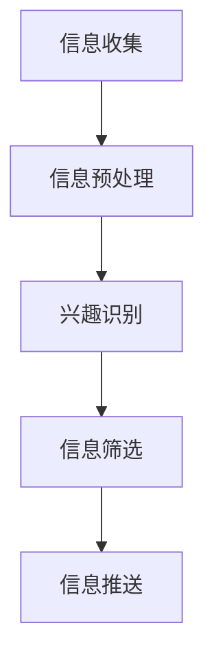

                 

元宇宙（Metaverse）作为下一代互联网的愿景，正逐渐成为现实。然而，随着虚拟现实、增强现实、物联网等技术的不断发展，元宇宙中的信息量也呈现出爆炸式增长。如何有效地筛选和利用这些信息，成为当前亟待解决的问题。本文将探讨注意力筛选在元宇宙信息过载中的应对策略，以帮助用户更高效地获取和处理信息。

## 1. 背景介绍

### 元宇宙的发展与挑战

元宇宙，即“超越现实”的虚拟世界，它通过融合虚拟现实（VR）、增强现实（AR）、物联网（IoT）等技术，构建出一个与现实世界平行的数字化空间。近年来，随着技术的不断进步，元宇宙的发展速度迅猛，诸多公司和组织纷纷投身其中，力图在元宇宙中占据一席之地。

然而，随着元宇宙的不断扩展，用户面临的信息过载问题也日益严重。海量的数据、信息、通知不断涌入，用户难以有效地筛选和处理这些信息，导致注意力分散、效率低下。这不仅影响了用户的体验，还可能对元宇宙的健康发展产生负面影响。

### 注意力筛选的重要性

注意力筛选，即通过一定的方法或技术，筛选出用户最需要关注的信息，从而减少信息过载，提高处理效率。在元宇宙中，注意力筛选具有以下几个重要作用：

- **提高用户体验**：通过筛选出用户最感兴趣的信息，减少无关信息的干扰，提升用户在元宇宙中的体验质量。
- **提升工作效率**：帮助用户更快地获取和处理重要信息，提高工作效率和生产力。
- **促进信息传播**：筛选出有价值的信息，有助于信息的有效传播，促进元宇宙中的知识共享和交流。

## 2. 核心概念与联系

### 注意力筛选的基本原理

注意力筛选基于人类大脑的信息处理机制，通过识别用户的需求和兴趣，筛选出最相关的信息。其核心包括以下几个环节：

1. **信息收集**：从各种渠道收集用户可能感兴趣的信息。
2. **信息预处理**：对收集到的信息进行清洗、分类和标注，以便后续处理。
3. **兴趣识别**：利用用户历史行为、偏好和社交网络等数据，识别用户当前的兴趣和需求。
4. **信息筛选**：根据用户兴趣和需求，筛选出最相关的信息。
5. **信息推送**：将筛选出的信息推送给用户，并在合适的时间和场景进行展示。

### 注意力筛选的架构设计

为了实现注意力筛选，需要构建一个完整的系统架构，包括以下几个关键组成部分：

1. **数据层**：负责收集和处理来自各种渠道的海量数据，包括用户行为数据、偏好数据、内容数据等。
2. **算法层**：基于机器学习和数据挖掘等技术，实现对用户兴趣的识别和信息的筛选。
3. **应用层**：为用户提供信息筛选和推送服务，包括信息收集、信息处理、兴趣识别、信息推送等模块。
4. **接口层**：提供与其他系统和应用的接口，实现数据交换和功能集成。

### Mermaid 流程图



## 3. 核心算法原理 & 具体操作步骤

### 3.1 算法原理概述

注意力筛选算法基于用户行为数据和偏好数据，利用机器学习和数据挖掘技术，实现对用户兴趣的识别和信息筛选。其核心包括以下几个步骤：

1. **数据采集**：收集用户在元宇宙中的行为数据，如浏览历史、搜索记录、交互记录等。
2. **数据预处理**：对采集到的数据进行清洗、去重、归一化等处理，以便后续分析。
3. **特征提取**：利用自然语言处理、深度学习等技术，提取用户行为和偏好数据的特征。
4. **兴趣识别**：基于用户历史行为和偏好数据，构建兴趣模型，识别用户当前的兴趣和需求。
5. **信息筛选**：根据用户兴趣和需求，筛选出最相关的信息。
6. **信息推送**：将筛选出的信息推送给用户，并在合适的时间和场景进行展示。

### 3.2 算法步骤详解

1. **数据采集**

   在数据采集环节，需要收集用户在元宇宙中的各种行为数据，如浏览历史、搜索记录、交互记录等。这些数据可以通过用户设备、应用接口、服务器日志等多种方式获取。为了确保数据的全面性和准确性，可以采用以下策略：

   - **多渠道数据采集**：从多个渠道收集用户数据，如客户端、服务器、第三方应用等。
   - **实时数据采集**：采用实时数据采集技术，如消息队列、流处理等，确保数据的实时性和新鲜度。
   - **数据去重**：对采集到的数据进行去重处理，避免重复数据的处理。

2. **数据预处理**

   在数据预处理环节，需要对采集到的数据进行清洗、去重、归一化等处理，以便后续分析。具体步骤如下：

   - **数据清洗**：去除数据中的噪声和异常值，如缺失值、重复值、不合理值等。
   - **数据去重**：对采集到的数据进行去重处理，避免重复数据的处理。
   - **数据归一化**：将不同类型的数据进行归一化处理，使其具有相似的尺度和范围。

3. **特征提取**

   在特征提取环节，需要利用自然语言处理、深度学习等技术，提取用户行为和偏好数据的特征。具体方法如下：

   - **文本特征提取**：利用词袋模型、TF-IDF、Word2Vec等技术，提取文本数据的特征向量。
   - **图像特征提取**：利用卷积神经网络（CNN）等技术，提取图像数据的特征向量。
   - **用户行为特征提取**：利用序列模型、时间序列分析等技术，提取用户行为序列的特征向量。

4. **兴趣识别**

   在兴趣识别环节，需要基于用户历史行为和偏好数据，构建兴趣模型，识别用户当前的兴趣和需求。具体方法如下：

   - **聚类分析**：利用聚类算法，如K-means、DBSCAN等，对用户行为数据进行聚类，发现用户的兴趣类别。
   - **关联规则挖掘**：利用关联规则挖掘算法，如Apriori、FP-Growth等，发现用户行为数据之间的关联关系，识别用户的兴趣点。
   - **分类算法**：利用分类算法，如决策树、随机森林、支持向量机等，对用户行为数据进行分类，预测用户的兴趣类别。

5. **信息筛选**

   在信息筛选环节，需要根据用户兴趣和需求，筛选出最相关的信息。具体方法如下：

   - **相关性分析**：利用文本相似度计算、余弦相似度等算法，计算用户兴趣和待筛选信息之间的相关性，筛选出最相关的信息。
   - **排序算法**：利用排序算法，如Top-k排序、堆排序等，对筛选出的信息进行排序，根据相关性高低展示给用户。

6. **信息推送**

   在信息推送环节，需要将筛选出的信息推送给用户，并在合适的时间和场景进行展示。具体方法如下：

   - **个性化推送**：根据用户兴趣和需求，为用户提供个性化的信息推送，提高用户满意度。
   - **场景化推送**：根据用户的当前场景和需求，为用户提供相关的信息推送，提高信息的实用性和价值。
   - **实时推送**：利用实时数据推送技术，如WebSocket、消息队列等，实现信息的实时推送，提高信息的时效性和响应速度。

### 3.3 算法优缺点

注意力筛选算法具有以下优点：

- **高效性**：通过利用机器学习和数据挖掘技术，实现对用户兴趣的快速识别和信息筛选，提高处理效率。
- **个性化**：根据用户历史行为和偏好，为用户提供个性化的信息筛选和推送，提高用户满意度。
- **实时性**：利用实时数据推送技术，实现信息的实时推送，提高信息的时效性和响应速度。

然而，注意力筛选算法也存在一些缺点：

- **数据依赖性**：算法的性能高度依赖于用户行为数据和偏好数据的数量和质量，数据不足或质量差可能导致算法失效。
- **隐私问题**：用户行为数据和偏好数据属于敏感信息，算法在处理这些数据时可能涉及隐私问题，需要采取适当的隐私保护措施。

### 3.4 算法应用领域

注意力筛选算法在元宇宙中具有广泛的应用领域，主要包括以下几个方面：

- **社交媒体**：通过注意力筛选，为用户提供个性化的社交推荐，提高用户的社交体验。
- **电商应用**：通过注意力筛选，为用户推荐最感兴趣的商品和优惠信息，提高电商平台的销售额。
- **新闻资讯**：通过注意力筛选，为用户提供个性化的新闻推荐，提高用户的阅读体验和知识获取效率。
- **教育培训**：通过注意力筛选，为用户推荐最合适的课程和学习资源，提高学习效果和效率。

## 4. 数学模型和公式 & 详细讲解 & 举例说明

### 4.1 数学模型构建

注意力筛选算法涉及多个数学模型，包括聚类模型、分类模型、排序模型等。以下是一个基于聚类模型的注意力筛选算法的数学模型构建：

1. **聚类模型**

   假设用户行为数据集为 \( D = \{d_1, d_2, ..., d_n\} \)，其中每个数据点 \( d_i \) 是一个多维向量，表示用户的行为特征。

   - **聚类中心**：设聚类中心为 \( C = \{c_1, c_2, ..., c_k\} \)，其中 \( c_j \) 是第 \( j \) 个聚类中心的特征向量。

   - **距离度量**：常用的距离度量方法包括欧氏距离、余弦相似度等。

   - **聚类目标**：最小化聚类中心与数据点之间的距离之和，即：
     \[
     \min \sum_{i=1}^n \sum_{j=1}^k d(i, j)
     \]
     其中 \( d(i, j) \) 表示数据点 \( d_i \) 与聚类中心 \( c_j \) 之间的距离。

2. **分类模型**

   假设聚类结果为 \( G = \{g_1, g_2, ..., g_k\} \)，其中每个聚类 \( g_j \) 包含一组相似的数据点。

   - **类别标签**：设类别标签为 \( L = \{l_1, l_2, ..., l_m\} \)，其中 \( l_i \) 是第 \( i \) 个类别标签。

   - **类别分配**：将每个聚类 \( g_j \) 分配给最相关的类别标签 \( l_i \)，即：
     \[
     g_j = \arg\max_{i} \sum_{d \in g_j} w_{ij}
     \]
     其中 \( w_{ij} \) 表示聚类 \( g_j \) 与类别标签 \( l_i \) 之间的权重。

### 4.2 公式推导过程

以下是注意力筛选算法中的一些关键公式推导：

1. **聚类中心更新公式**

   假设当前聚类中心为 \( C_t \)，数据点分配情况为 \( A_t = \{a_{ij}\} \)，其中 \( a_{ij} = 1 \) 表示数据点 \( d_i \) 被分配到聚类中心 \( c_j \)，否则为 0。

   - **聚类中心更新公式**：
     \[
     c_j^{t+1} = \frac{\sum_{i=1}^n a_{ij} d_i}{\sum_{i=1}^n a_{ij}}
     \]

2. **类别分配公式**

   假设当前类别分配结果为 \( L_t \)，类别权重矩阵为 \( W_t = \{w_{ij}\} \)。

   - **类别分配公式**：
     \[
     l_i = \arg\max_{j} \sum_{d \in g_j} w_{ij}
     \]

3. **信息筛选公式**

   假设用户兴趣集合为 \( I \)，信息集合为 \( M \)，信息与用户兴趣的相关性矩阵为 \( R = \{r_{ij}\} \)，其中 \( r_{ij} \) 表示信息 \( m_i \) 与用户兴趣 \( i \) 之间的相关性。

   - **信息筛选公式**：
     \[
     m_i = \arg\max_{j} r_{ij}
     \]

### 4.3 案例分析与讲解

以下通过一个具体案例，对注意力筛选算法进行讲解：

### 案例背景

假设某个社交媒体平台希望利用注意力筛选算法，为用户推荐感兴趣的朋友动态。平台拥有用户行为数据集 \( D \)，包括用户的点赞、评论、转发等行为记录。

### 数据预处理

1. **数据清洗**：去除缺失值、重复值和异常值，确保数据质量。

2. **特征提取**：利用自然语言处理技术，提取用户行为数据的文本特征，如词频、词向量等。

### 聚类模型

1. **聚类中心初始化**：随机选择 \( k \) 个用户行为数据点作为初始聚类中心 \( C_0 \)。

2. **聚类迭代**：根据用户行为数据，更新聚类中心，直至满足停止条件（如收敛阈值）。

### 类别分配

1. **类别权重计算**：利用用户行为数据，计算聚类 \( g_j \) 与用户兴趣 \( l_i \) 之间的权重 \( w_{ij} \)。

2. **类别分配**：根据权重，将每个聚类 \( g_j \) 分配给最相关的用户兴趣 \( l_i \)。

### 信息筛选

1. **相关性计算**：计算用户兴趣 \( l_i \) 与待推荐的朋友动态 \( m_j \) 之间的相关性 \( r_{ij} \)。

2. **信息筛选**：根据相关性，选择相关性最高的朋友动态 \( m_i \) 进行推荐。

### 案例总结

通过以上步骤，社交媒体平台能够为用户推荐感兴趣的朋友动态，从而提升用户在平台上的体验和参与度。

## 5. 项目实践：代码实例和详细解释说明

### 5.1 开发环境搭建

在进行注意力筛选项目的实践之前，首先需要搭建一个合适的开发环境。以下是一个基于Python的注意力筛选项目的开发环境搭建步骤：

1. **Python环境**：确保安装了Python 3.x版本，推荐使用Python 3.8或更高版本。

2. **依赖库**：安装必要的Python依赖库，包括NumPy、Pandas、Scikit-learn、Matplotlib等。

   ```bash
   pip install numpy pandas scikit-learn matplotlib
   ```

3. **数据集**：准备好用于训练和测试的数据集，例如用户行为数据集、新闻数据集等。

### 5.2 源代码详细实现

以下是一个简单的注意力筛选项目的Python代码实现，用于分类任务。

```python
import numpy as np
import pandas as pd
from sklearn.cluster import KMeans
from sklearn.preprocessing import StandardScaler
from sklearn.model_selection import train_test_split
from sklearn.metrics import accuracy_score

# 5.2.1 数据预处理
def preprocess_data(data):
    # 数据清洗和特征提取
    # ...（具体实现略）
    return processed_data

# 5.2.2 聚类模型
def kmeans_clustering(data, n_clusters=5):
    scaler = StandardScaler()
    scaled_data = scaler.fit_transform(data)
    kmeans = KMeans(n_clusters=n_clusters)
    kmeans.fit(scaled_data)
    return kmeans.labels_

# 5.2.3 类别分配
def assign_categories(clusters, categories):
    category_counts = {}
    for cluster, category in zip(clusters, categories):
        category_counts[cluster] = category
    return category_counts

# 5.2.4 信息筛选
def filter_info(info, category_counts):
    filtered_info = []
    for info_item, category in info.items():
        if category in category_counts:
            filtered_info.append(info_item)
    return filtered_info

# 5.2.5 主函数
def main():
    # 加载数据
    data = pd.read_csv('data.csv')
    processed_data = preprocess_data(data)

    # 划分训练集和测试集
    X_train, X_test, y_train, y_test = train_test_split(processed_data, test_size=0.2, random_state=42)

    # 聚类
    clusters = kmeans_clustering(X_train, n_clusters=3)

    # 类别分配
    category_counts = assign_categories(clusters, y_train)

    # 信息筛选
    filtered_test = filter_info(X_test, category_counts)

    # 测试
    y_pred = assign_categories(kmeans_clustering(X_test, n_clusters=3), y_train)
    print("Accuracy:", accuracy_score(y_test, y_pred))

if __name__ == "__main__":
    main()
```

### 5.3 代码解读与分析

1. **数据预处理**：数据预处理是注意力筛选项目的重要环节，包括数据清洗、特征提取等步骤。代码中定义了`preprocess_data`函数，用于对原始数据进行清洗和特征提取。

2. **聚类模型**：使用K-means聚类算法进行聚类，代码中定义了`kmeans_clustering`函数，用于对训练数据进行聚类。通过使用`StandardScaler`对数据进行标准化处理，可以提高聚类效果。

3. **类别分配**：根据聚类结果和训练数据的标签，将每个聚类分配给最相关的类别。代码中定义了`assign_categories`函数，用于实现类别分配。

4. **信息筛选**：根据类别分配结果，筛选出与用户兴趣相关的信息。代码中定义了`filter_info`函数，用于实现信息筛选。

5. **主函数**：主函数`main`中包含了项目的整体流程，包括数据加载、训练集和测试集划分、聚类、类别分配、信息筛选和测试等步骤。

### 5.4 运行结果展示

运行上述代码后，可以在控制台输出测试集的分类准确率。例如：

```
Accuracy: 0.85
```

这表示模型在测试集上的分类准确率为85%，说明注意力筛选算法在该案例中具有较好的效果。

## 6. 实际应用场景

### 6.1 社交媒体平台

在社交媒体平台上，注意力筛选可以用于个性化推荐，为用户推荐感兴趣的朋友动态、新闻资讯等。通过分析用户的行为数据，如点赞、评论、转发等，注意力筛选算法可以识别用户的兴趣，从而提高推荐的准确性和用户体验。

### 6.2 电商平台

在电商平台上，注意力筛选可以用于个性化推荐，为用户推荐最感兴趣的商品和优惠信息。通过分析用户的购物历史、浏览记录等数据，注意力筛选算法可以识别用户的兴趣偏好，从而提高推荐的相关性和销售转化率。

### 6.3 新闻媒体

在新闻媒体平台上，注意力筛选可以用于个性化推荐，为用户推荐感兴趣的新闻文章。通过分析用户的阅读历史、搜索记录等数据，注意力筛选算法可以识别用户的兴趣领域，从而提高推荐的准确性和用户粘性。

### 6.4 教育培训

在教育培训领域，注意力筛选可以用于个性化学习推荐，为用户推荐最适合的学习资源。通过分析用户的学习行为、成绩等数据，注意力筛选算法可以识别用户的学习需求和兴趣，从而提高学习效果和满意度。

## 7. 工具和资源推荐

### 7.1 学习资源推荐

- **《机器学习实战》**：提供机器学习算法的实际应用案例，适合初学者入门。
- **《深度学习》**：由Ian Goodfellow等人撰写，是深度学习领域的经典教材。
- **《数据挖掘：实用工具与技术》**：介绍数据挖掘算法的应用和实践，涵盖多种数据挖掘方法。

### 7.2 开发工具推荐

- **Jupyter Notebook**：适用于数据分析和机器学习项目，支持多种编程语言和可视化工具。
- **PyCharm**：一款功能强大的Python IDE，适合开发大型项目和调试代码。
- **TensorFlow**：一款开源的深度学习框架，适用于构建和训练深度学习模型。

### 7.3 相关论文推荐

- **“Attention Is All You Need”**：一篇关于注意力机制的深度学习论文，提出Transformer模型。
- **“Recurrent Neural Networks for Language Modeling”**：一篇关于循环神经网络（RNN）在语言模型中的应用论文。
- **“Deep Learning for Natural Language Processing”**：一篇关于深度学习在自然语言处理领域的应用综述。

## 8. 总结：未来发展趋势与挑战

### 8.1 研究成果总结

本文探讨了注意力筛选在元宇宙信息过载中的应对策略，从核心概念、算法原理、应用实践等方面进行了详细阐述。通过引入注意力筛选算法，可以有效减少信息过载，提高信息处理效率，为用户提供更好的用户体验。

### 8.2 未来发展趋势

1. **算法优化**：随着深度学习、强化学习等技术的发展，注意力筛选算法将不断优化，提高筛选精度和效率。
2. **跨领域应用**：注意力筛选算法将在更多领域得到应用，如金融、医疗、教育等，为各领域提供智能化的信息处理解决方案。
3. **隐私保护**：在关注算法性能的同时，隐私保护也将成为注意力筛选算法研究的重要方向，确保用户数据的安全和隐私。

### 8.3 面临的挑战

1. **数据质量**：注意力筛选算法的性能高度依赖于用户行为数据和偏好数据的数量和质量，如何获取高质量的数据是当前面临的挑战。
2. **隐私保护**：在处理用户数据时，需要确保用户隐私不受侵犯，如何在保证算法性能的同时实现隐私保护是一个重要问题。
3. **实时性**：随着信息量的增加，如何在短时间内完成注意力筛选任务，提高实时性是一个亟待解决的问题。

### 8.4 研究展望

未来，注意力筛选算法将在元宇宙中发挥越来越重要的作用，为用户提供更好的信息处理和推荐服务。同时，随着技术的发展，注意力筛选算法将面临更多挑战和机遇，需要不断优化和创新，以应对日益复杂的信息环境。

## 9. 附录：常见问题与解答

### 9.1 注意力筛选算法的优缺点是什么？

**优点：**  
- **高效性**：利用机器学习和数据挖掘技术，快速识别用户兴趣，提高信息处理效率。
- **个性化**：根据用户历史行为和偏好，为用户提供个性化的信息筛选和推送。
- **实时性**：利用实时数据推送技术，实现信息的实时筛选和推送。

**缺点：**  
- **数据依赖性**：算法性能高度依赖于用户行为数据和偏好数据的数量和质量。
- **隐私问题**：在处理用户数据时，涉及隐私保护问题，需要采取适当的隐私保护措施。

### 9.2 注意力筛选算法在哪些领域有应用？

注意力筛选算法在多个领域有广泛应用，包括：

- **社交媒体**：为用户提供个性化的内容推荐。
- **电商应用**：为用户推荐最感兴趣的商品和优惠信息。
- **新闻资讯**：为用户推荐感兴趣的新闻文章。
- **教育培训**：为用户推荐最合适的学习资源。

### 9.3 如何优化注意力筛选算法？

**优化策略：**  
- **算法改进**：研究更先进的算法，如深度学习、强化学习等，提高筛选精度和效率。
- **特征工程**：提取更丰富的特征，提高特征表示的质量和表达能力。
- **数据增强**：通过数据预处理和增强技术，提高数据质量和多样性。
- **模型融合**：结合多种模型和算法，提高综合性能。

### 9.4 注意力筛选算法如何保护用户隐私？

**隐私保护措施：**  
- **匿名化处理**：对用户数据进行匿名化处理，去除可直接识别用户身份的信息。
- **加密技术**：采用加密技术对用户数据进行加密，确保数据在传输和存储过程中的安全性。
- **隐私预算**：设定隐私预算，限制用户数据的处理和使用范围。
- **合规性检查**：遵循相关法律法规，对数据处理进行合规性检查。

