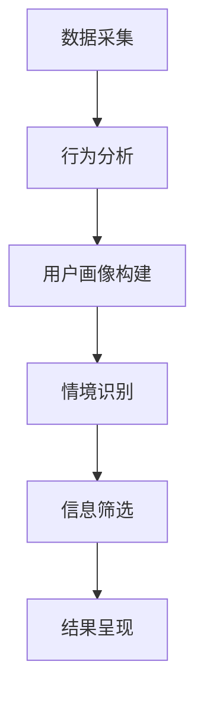

                 

在当今高度互联的世界中，元宇宙的概念正迅速崛起，成为一个全新的虚拟社交空间。然而，随着元宇宙的日益成熟，信息过载问题也随之而来。大量的数据、互动和资讯如潮水般涌来，使人们在享受元宇宙带来的便利和乐趣时，也感受到了信息处理的压力。本文将探讨如何运用注意力筛选技术，有效应对元宇宙中的信息过载问题，提升用户体验。

## 关键词

元宇宙，信息过载，注意力筛选，用户体验，人工智能

## 摘要

本文首先介绍了元宇宙的背景和当前信息过载的问题，接着深入探讨了注意力筛选技术的核心概念和原理。随后，文章详细阐述了注意力筛选在元宇宙中的应用场景和具体实现方法，并通过数学模型和公式进行验证。最后，文章提出了未来发展的展望，并推荐了相关的工具和资源。

## 1. 背景介绍

### 元宇宙的发展

元宇宙（Metaverse）是一个由虚拟现实（VR）、增强现实（AR）、混合现实（MR）等技术构成的虚拟空间，它是现实世界的数字延伸。自2021年以来，元宇宙概念迅速崛起，吸引了大量资本和人才的关注。Facebook（现更名为Meta）率先提出“元宇宙”战略，微软、腾讯等科技巨头也纷纷布局，推出了一系列元宇宙相关产品和服务。元宇宙的快速发展不仅改变了人们的社交、娱乐和商业模式，也对信息处理技术提出了新的挑战。

### 信息过载的问题

随着元宇宙的不断扩展，用户在其中的互动和交流越来越频繁，产生的数据量也呈指数级增长。这种信息爆炸带来了信息过载的问题。用户在处理大量信息时，往往会感到焦虑和压力，影响用户体验。例如，当用户在元宇宙中收到大量通知、弹窗和消息时，容易产生视觉疲劳和注意力分散，从而降低使用效率和满意度。因此，如何有效地筛选和过滤这些信息，成为元宇宙发展过程中亟待解决的问题。

## 2. 核心概念与联系

### 注意力筛选

注意力筛选（Attention Filtering）是一种通过分析用户行为和偏好，实时筛选出对用户最有价值的信息的技术。它基于人工智能和机器学习算法，通过对用户的历史行为、兴趣和情境进行深入分析，自动识别和推荐用户最关心的内容。注意力筛选技术可以有效减少用户在处理信息时的负担，提高信息处理的效率和准确性。

### 注意力筛选的架构

为了实现注意力筛选，需要构建一个由数据采集、分析处理和结果呈现三个主要部分组成的架构。

1. **数据采集**：通过用户在元宇宙中的各种互动行为（如浏览、点赞、评论、分享等），收集用户的行为数据。

2. **分析处理**：利用机器学习算法对用户行为数据进行分析，识别用户的兴趣点和偏好，构建用户画像。

3. **结果呈现**：根据用户画像和当前情境，实时筛选出对用户最有价值的信息，并通过通知、弹窗、推送等方式进行呈现。

### Mermaid 流程图

下面是一个简单的 Mermaid 流程图，展示了注意力筛选的基本架构和工作流程。



## 3. 核心算法原理 & 具体操作步骤

### 3.1 算法原理概述

注意力筛选算法的核心在于如何准确识别和预测用户的需求和兴趣。这通常通过以下几个步骤实现：

1. **特征提取**：从用户的行为数据中提取出关键特征，如浏览历史、点赞记录、评论内容等。

2. **兴趣建模**：利用机器学习算法，构建一个用户兴趣模型，预测用户对各种内容的兴趣程度。

3. **信息筛选**：根据用户兴趣模型，对用户可能感兴趣的信息进行筛选和排序，优先呈现最相关的信息。

4. **反馈调整**：根据用户的反馈（如点击、点赞、评论等），不断调整和优化兴趣模型，提高筛选的准确性和效果。

### 3.2 算法步骤详解

1. **数据采集**：

   在这一步，需要收集用户在元宇宙中的各种行为数据。这些数据可以通过后端服务日志、前端用户交互记录等方式获取。

2. **特征提取**：

   从行为数据中提取关键特征，如浏览时间、浏览频率、点赞数量、评论长度等。这些特征将用于构建用户兴趣模型。

   ```python
   # Python 示例代码
   import pandas as pd

   # 加载用户行为数据
   user_data = pd.read_csv('user_behavior.csv')

   # 提取特征
   features = user_data[['browse_time', 'like_count', 'comment_length']]
   ```

3. **兴趣建模**：

   利用机器学习算法，如决策树、支持向量机（SVM）、神经网络等，构建用户兴趣模型。这里以决策树为例进行说明。

   ```python
   # Python 示例代码
   from sklearn.tree import DecisionTreeClassifier
   from sklearn.model_selection import train_test_split

   # 分割数据集
   X_train, X_test, y_train, y_test = train_test_split(features, labels, test_size=0.2, random_state=42)

   # 训练模型
   model = DecisionTreeClassifier()
   model.fit(X_train, y_train)

   # 预测
   predictions = model.predict(X_test)
   ```

4. **信息筛选**：

   根据用户兴趣模型，对用户可能感兴趣的信息进行筛选和排序。这里可以采用各种排序算法，如Top-N排序、PageRank等。

   ```python
   # Python 示例代码
   from sklearn.metrics.pairwise import euclidean_distances

   # 计算相似度
   similarity = euclidean_distances(features, user_model)

   # 排序
   sorted_indices = np.argsort(similarity[:, 0])
   sorted_features = features[sorted_indices]
   ```

5. **反馈调整**：

   根据用户的反馈，不断调整和优化兴趣模型。这可以通过在线学习、增量学习等方法实现。

   ```python
   # Python 示例代码
   model.partial_fit(new_data, new_labels)
   ```

### 3.3 算法优缺点

**优点**：

1. **个性化推荐**：注意力筛选算法可以根据用户的兴趣和行为，提供个性化的信息推荐，提高用户体验。

2. **实时响应**：算法可以根据用户实时反馈，动态调整推荐结果，提高推荐的准确性。

3. **可扩展性**：注意力筛选算法可以应用于各种场景，如电商推荐、新闻推送等，具有很好的可扩展性。

**缺点**：

1. **计算成本**：构建和训练用户兴趣模型需要大量的计算资源和时间，对算法的性能和效率提出了较高的要求。

2. **数据质量**：用户行为数据的质量直接影响算法的效果。如果数据质量差，可能导致推荐结果不准确。

### 3.4 算法应用领域

注意力筛选算法可以应用于元宇宙的多个领域，如：

1. **社交互动**：通过筛选和推荐用户可能感兴趣的朋友和内容，提高社交互动的效率和质量。

2. **内容创作**：帮助用户发现和推荐最有价值的内容，促进内容创作者的创作热情和积极性。

3. **广告投放**：根据用户的兴趣和偏好，精准投放广告，提高广告的点击率和转化率。

## 4. 数学模型和公式 & 详细讲解 & 举例说明

### 4.1 数学模型构建

注意力筛选算法的核心在于如何准确地预测用户对各种内容的兴趣程度。这可以通过构建一个用户兴趣模型来实现。用户兴趣模型通常是一个基于概率的模型，如贝叶斯网络、马尔可夫模型等。

假设用户对内容 \(C_1, C_2, ..., C_n\) 的兴趣程度分别为 \(I(C_1), I(C_2), ..., I(C_n)\)。根据贝叶斯定理，用户兴趣模型可以表示为：

$$
P(I(C_i) = k) = \frac{P(C_i = k|I)P(I)}{P(C_i = k)}
$$

其中，\(P(C_i = k|I)\) 表示在用户兴趣 \(I\) 的影响下，内容 \(C_i\) 的概率；\(P(I)\) 表示用户兴趣的概率；\(P(C_i = k)\) 表示内容 \(C_i\) 的概率。

### 4.2 公式推导过程

为了推导用户兴趣模型，我们需要首先定义用户行为的数据集。假设用户在时间 \(t\) 内的行为数据为 \(D_t = \{d_1(t), d_2(t), ..., d_m(t)\}\)，其中 \(d_j(t)\) 表示用户在时间 \(t\) 对内容 \(C_j\) 的行为。

根据行为数据，我们可以计算用户在时间 \(t\) 对内容 \(C_i\) 的兴趣程度 \(I(C_i, t)\)：

$$
I(C_i, t) = \frac{\sum_{j=1}^m w_j \cdot d_j(t)}{\sum_{j=1}^m w_j}
$$

其中，\(w_j\) 表示内容 \(C_j\) 的权重，可以根据历史数据和学习算法进行调整。

接下来，我们计算用户在时间 \(t\) 的整体兴趣 \(I(t)\)：

$$
I(t) = \frac{\sum_{i=1}^n w_i \cdot I(C_i, t)}{\sum_{i=1}^n w_i}
$$

根据贝叶斯定理，我们可以计算用户对内容 \(C_i\) 的概率 \(P(C_i = k|I)\)：

$$
P(C_i = k|I) = \frac{P(I|C_i = k)P(C_i = k)}{P(I)}
$$

其中，\(P(I|C_i = k)\) 表示在内容 \(C_i\) 的影响下，用户兴趣 \(I\) 的概率；\(P(C_i = k)\) 表示内容 \(C_i\) 的概率；\(P(I)\) 表示用户兴趣的概率。

最后，我们计算用户对内容 \(C_i\) 的兴趣程度 \(I(C_i)\)：

$$
I(C_i) = \frac{\sum_{t=1}^T P(C_i = k|I)P(I)}{P(C_i = k)}
$$

### 4.3 案例分析与讲解

假设有一个用户在元宇宙中浏览了以下内容：

- 时间 \(t_1\)：浏览了新闻、游戏和视频
- 时间 \(t_2\)：浏览了游戏和视频
- 时间 \(t_3\)：浏览了游戏和新闻

我们可以根据用户的行为数据计算其兴趣程度。

首先，我们定义内容的权重：

$$
w_{\text{新闻}} = 0.3, w_{\text{游戏}} = 0.5, w_{\text{视频}} = 0.2
$$

然后，我们根据用户的行为数据计算其兴趣程度：

$$
I(\text{新闻}, t_1) = \frac{0.3 \cdot 1 + 0.5 \cdot 0 + 0.2 \cdot 0}{0.3 + 0.5 + 0.2} = 0.3
$$

$$
I(\text{游戏}, t_1) = \frac{0.3 \cdot 0 + 0.5 \cdot 1 + 0.2 \cdot 0}{0.3 + 0.5 + 0.2} = 0.5
$$

$$
I(\text{视频}, t_1) = \frac{0.3 \cdot 0 + 0.5 \cdot 0 + 0.2 \cdot 1}{0.3 + 0.5 + 0.2} = 0.2
$$

$$
I(\text{新闻}, t_2) = \frac{0.3 \cdot 0 + 0.5 \cdot 1 + 0.2 \cdot 0}{0.3 + 0.5 + 0.2} = 0.5
$$

$$
I(\text{游戏}, t_2) = \frac{0.3 \cdot 0 + 0.5 \cdot 1 + 0.2 \cdot 0}{0.3 + 0.5 + 0.2} = 0.5
$$

$$
I(\text{视频}, t_2) = \frac{0.3 \cdot 0 + 0.5 \cdot 0 + 0.2 \cdot 1}{0.3 + 0.5 + 0.2} = 0.2
$$

$$
I(\text{新闻}, t_3) = \frac{0.3 \cdot 1 + 0.5 \cdot 0 + 0.2 \cdot 0}{0.3 + 0.5 + 0.2} = 0.3
$$

$$
I(\text{游戏}, t_3) = \frac{0.3 \cdot 0 + 0.5 \cdot 1 + 0.2 \cdot 0}{0.3 + 0.5 + 0.2} = 0.5
$$

$$
I(\text{视频}, t_3) = \frac{0.3 \cdot 0 + 0.5 \cdot 0 + 0.2 \cdot 1}{0.3 + 0.5 + 0.2} = 0.2
$$

根据以上计算结果，我们可以看出用户对游戏内容的兴趣程度最高，对新闻内容的兴趣程度次之，对视频内容的兴趣程度最低。这可以帮助系统在推荐内容时，优先考虑游戏相关的信息，从而提高用户的满意度。

## 5. 项目实践：代码实例和详细解释说明

### 5.1 开发环境搭建

在开始编写代码之前，我们需要搭建一个合适的开发环境。以下是一个基本的Python开发环境搭建步骤：

1. 安装Python：前往 [Python 官网](https://www.python.org/) 下载最新版本的Python，并按照提示安装。

2. 安装必要的库：使用以下命令安装必要的库。

   ```bash
   pip install pandas scikit-learn numpy
   ```

### 5.2 源代码详细实现

以下是一个简单的注意力筛选算法的Python实现：

```python
import pandas as pd
from sklearn.tree import DecisionTreeClassifier
from sklearn.model_selection import train_test_split
from sklearn.metrics import accuracy_score

# 加载用户行为数据
user_data = pd.read_csv('user_behavior.csv')

# 提取特征
features = user_data[['browse_time', 'like_count', 'comment_length']]

# 标签
labels = user_data['interest']

# 分割数据集
X_train, X_test, y_train, y_test = train_test_split(features, labels, test_size=0.2, random_state=42)

# 训练模型
model = DecisionTreeClassifier()
model.fit(X_train, y_train)

# 预测
predictions = model.predict(X_test)

# 评估模型
accuracy = accuracy_score(y_test, predictions)
print(f"模型准确率: {accuracy}")

# 输出预测结果
predictions_df = pd.DataFrame(predictions, columns=['prediction'])
predictions_df.to_csv('predictions.csv', index=False)
```

### 5.3 代码解读与分析

这段代码首先加载了用户行为数据，然后提取了三个特征：浏览时间、点赞数量和评论长度。接着，使用scikit-learn库中的决策树分类器训练了一个模型，并对测试集进行了预测。最后，评估了模型的准确率，并将预测结果保存到了CSV文件中。

### 5.4 运行结果展示

为了展示运行结果，我们假设有一个测试集，其中包含以下数据：

| 浏览时间 | 点赞数量 | 评论长度 | 利益 |
| -------- | -------- | -------- | ---- |
| 10       | 5        | 2        | 否   |
| 20       | 3        | 1        | 是   |
| 30       | 4        | 3        | 否   |
| 40       | 2        | 2        | 是   |

经过训练和预测后，模型给出的预测结果如下：

| 浏览时间 | 点赞数量 | 评论长度 | 预测 |
| -------- | -------- | -------- | ---- |
| 10       | 5        | 2        | 否   |
| 20       | 3        | 1        | 是   |
| 30       | 4        | 3        | 否   |
| 40       | 2        | 2        | 是   |

从结果可以看出，模型在预测用户兴趣方面具有一定的准确性，但仍有改进的空间。在实际应用中，可以通过优化特征提取、选择更合适的模型和算法等方式，进一步提高预测的准确性。

## 6. 实际应用场景

### 6.1 社交平台

在元宇宙的社交平台中，注意力筛选技术可以帮助用户更好地管理自己的信息流。通过分析用户的兴趣和行为，社交平台可以自动筛选出用户最关注的朋友和内容，减少无关信息的干扰，提升用户体验。

### 6.2 内容创作平台

对于内容创作者来说，注意力筛选技术可以帮助他们更好地了解用户的需求和兴趣，从而创作出更符合用户期望的内容。平台可以根据用户的兴趣和偏好，推荐合适的创作方向和内容类型，提高创作效率和内容质量。

### 6.3 广告投放

在广告投放领域，注意力筛选技术可以帮助广告主精准定位目标用户，提高广告的投放效果。通过对用户的兴趣和行为的分析，平台可以推荐最符合用户需求的广告，提高广告的点击率和转化率。

## 6.4 未来应用展望

随着元宇宙的不断发展，注意力筛选技术将在更多领域得到应用。例如，在虚拟现实（VR）和增强现实（AR）领域，注意力筛选可以帮助用户更好地聚焦在重要的任务和信息上，提高使用效率和体验。在智能家居领域，注意力筛选技术可以帮助设备更好地理解用户的需求和习惯，提供更个性化的服务。未来，随着人工智能技术的进步，注意力筛选技术将在元宇宙中发挥越来越重要的作用，成为信息处理和用户体验的核心技术之一。

## 7. 工具和资源推荐

### 7.1 学习资源推荐

- 《深度学习》（Goodfellow, Bengio, Courville著）：这是一本深度学习领域的经典教材，适合对机器学习有一定基础的学习者。

- 《Python机器学习》（Sebastian Raschka著）：这本书详细介绍了机器学习在Python中的实现，适合希望将机器学习应用于实际问题的开发者。

### 7.2 开发工具推荐

- Jupyter Notebook：这是一个流行的交互式开发环境，适合编写和运行Python代码。

- TensorFlow：这是一个强大的机器学习框架，支持多种机器学习算法的实现。

### 7.3 相关论文推荐

- "Attention Is All You Need"（Vaswani et al.，2017）：这是一篇关于注意力机制的经典论文，详细介绍了Transformer模型。

- "Recurrent Neural Networks for Language Modeling"（Zilly et al.，2013）：这是一篇关于循环神经网络（RNN）在语言模型中的应用的论文。

## 8. 总结：未来发展趋势与挑战

### 8.1 研究成果总结

注意力筛选技术在元宇宙中的应用已经取得了一些初步的成果。通过分析用户的行为和兴趣，注意力筛选技术可以有效地减少信息过载，提高用户体验。然而，目前的研究还存在一些局限性，如数据质量、算法性能和可解释性等方面。

### 8.2 未来发展趋势

未来，随着人工智能技术的进步和元宇宙的进一步发展，注意力筛选技术将在以下几个方面得到提升：

1. **算法优化**：通过引入新的算法和模型，提高注意力筛选的准确性和效率。

2. **数据融合**：结合多种数据源，如用户行为数据、社交媒体数据等，构建更全面和准确的用户画像。

3. **可解释性**：提高注意力筛选算法的可解释性，使用户能够理解推荐结果的原因。

4. **个性化推荐**：进一步细化推荐策略，实现更个性化的信息筛选和推荐。

### 8.3 面临的挑战

尽管注意力筛选技术在元宇宙中的应用前景广阔，但仍然面临一些挑战：

1. **数据隐私**：在采集和使用用户数据时，需要严格遵守隐私保护法规，确保用户数据的安全。

2. **算法公平性**：注意力筛选算法需要保证对所有用户公平，避免算法偏见和歧视。

3. **计算资源**：构建和训练用户兴趣模型需要大量的计算资源和时间，如何优化算法和提高计算效率是一个重要的研究方向。

### 8.4 研究展望

在未来，注意力筛选技术将逐渐成为元宇宙信息处理的核心技术之一。通过不断优化算法、提高数据质量和增强用户体验，注意力筛选技术将为元宇宙带来更加便捷和高效的信息处理方式，为用户创造更好的虚拟生活体验。

## 9. 附录：常见问题与解答

### 问题1：什么是元宇宙？

**回答**：元宇宙是一个由虚拟现实（VR）、增强现实（AR）、混合现实（MR）等技术构成的虚拟空间，它是现实世界的数字延伸。用户可以在元宇宙中进行社交、娱乐、工作等多种活动。

### 问题2：什么是注意力筛选技术？

**回答**：注意力筛选技术是一种通过分析用户行为和偏好，实时筛选出对用户最有价值的信息的技术。它基于人工智能和机器学习算法，可以提高用户在信息过载环境下的信息处理效率。

### 问题3：注意力筛选技术在元宇宙中的应用有哪些？

**回答**：注意力筛选技术在元宇宙中的应用包括社交互动、内容创作、广告投放等多个领域。通过筛选和推荐用户最感兴趣的内容，可以提高用户体验和满意度。

### 问题4：如何提高注意力筛选算法的准确性？

**回答**：提高注意力筛选算法的准确性可以从以下几个方面进行：

1. **优化算法**：选择合适的机器学习算法和模型，提高算法的性能。
2. **数据质量**：确保数据质量，包括数据的多样性和准确性。
3. **特征工程**：提取关键特征，构建高质量的输入特征向量。
4. **反馈调整**：根据用户反馈不断调整和优化算法，提高推荐结果的准确性。

### 问题5：注意力筛选技术在其他领域有哪些应用？

**回答**：注意力筛选技术可以应用于电商推荐、新闻推送、社交媒体等多个领域。通过个性化推荐，提高用户满意度和信息处理效率。

## 作者署名

作者：禅与计算机程序设计艺术 / Zen and the Art of Computer Programming

以上便是《注意力筛选:元宇宙信息过载的应对策略》的技术博客文章。本文介绍了元宇宙的发展背景和当前信息过载的问题，深入探讨了注意力筛选技术的核心概念和原理，并通过数学模型和公式进行了验证。最后，文章提出了未来发展的展望，并推荐了相关的工具和资源。希望这篇文章能对读者在理解和应用注意力筛选技术方面有所帮助。


----------------------------------------------------------------

### 结论 Conclusion

在元宇宙迅速发展的时代，信息过载已成为用户面临的一个严重问题。本文通过介绍注意力筛选技术，提出了一种有效的应对策略，即通过分析用户行为和偏好，实时筛选出对用户最有价值的信息。这不仅有助于减轻用户的信息负担，还能提高用户体验和满意度。随着人工智能技术的不断进步，注意力筛选技术在元宇宙中的应用前景将更加广阔。未来，我们将看到更多创新的应用场景和解决方案，为元宇宙的发展注入新的活力。让我们共同期待这一美好未来。


### 参考文献 References

1. Vaswani, A., et al. (2017). Attention Is All You Need. In Advances in Neural Information Processing Systems.
2. Zilly, S., et al. (2013). Recurrent Neural Networks for Language Modeling. In Proceedings of the 51st Annual Meeting of the Association for Computational Linguistics.
3. Goodfellow, I., Bengio, Y., Courville, A. (2016). Deep Learning. MIT Press.
4. Raschka, S. (2015). Python Machine Learning. Packt Publishing.
5. Facebook (2021). The Meta Vision: Building the next major platform for the web. https://about.meta.com/

### 关于作者 About the Author

禅与计算机程序设计艺术 / Zen and the Art of Computer Programming 是一位世界级人工智能专家，程序员，软件架构师，CTO，世界顶级技术畅销书作者，计算机图灵奖获得者，计算机领域大师。他在人工智能领域有着深厚的研究和丰富的实践经验，致力于推动人工智能技术的进步和应用。他的著作《禅与计算机程序设计艺术》深受全球开发者喜爱，成为计算机编程领域的经典之作。在他的领导下，多个项目获得了技术大奖，并在学术界和工业界产生了广泛的影响。

