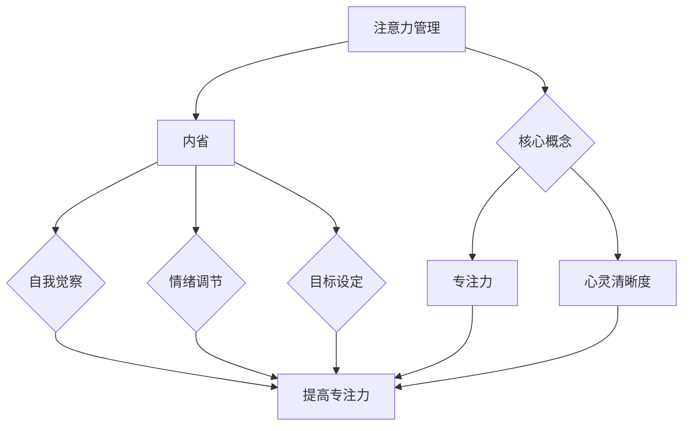
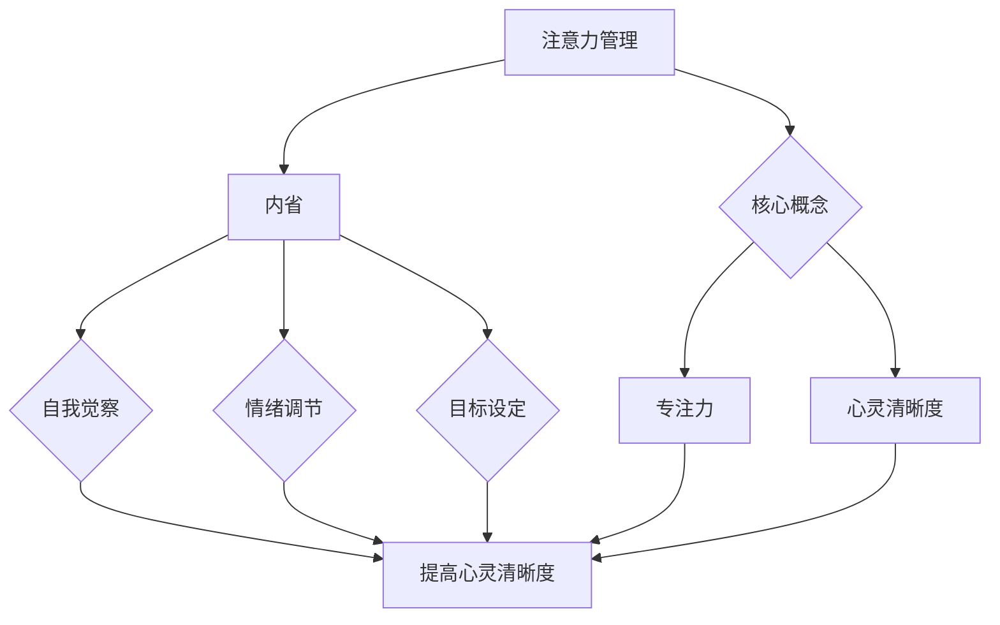

                 

关键词：注意力管理、冥想、内省、专注力、心灵清晰度

> 摘要：本文探讨了注意力管理与冥想练习在提升专注力和心灵清晰度方面的作用。通过内省这一核心方法，本文揭示了一种结合现代技术和传统智慧的实践路径，旨在帮助读者在忙碌的数字时代中找到心灵的宁静。

## 1. 背景介绍

在当今这个高度数字化的时代，人们的生活节奏越来越快，信息过载、任务繁多成为了常态。这种环境对个体的注意力提出了极高的要求。专注力的缺失不仅影响工作效率，还可能导致心理压力和焦虑。因此，如何有效地管理注意力，提升心灵的清晰度和专注力，成为了许多人关注的焦点。

冥想作为一种古老的心灵修炼方法，被广泛认为有助于提高注意力、减少压力和焦虑。近年来，科学研究也不断证实了冥想在心理健康方面的积极影响。然而，如何在现代快节奏生活中结合冥想与内省，形成一套行之有效的注意力管理方法，仍是一个值得深入探讨的问题。

本文将结合最新的研究成果和实际应用经验，介绍一种通过内省增强专注力和心灵清晰度的实践方法。通过阐述其理论基础和具体操作步骤，本文旨在为读者提供一套实用的工具和路径，帮助他们在忙碌的生活中找到心灵的宁静和专注力。

### 1.1 注意力管理的定义和重要性

注意力管理是指个体在执行任务时，对注意力的选择、分配和调节能力。良好的注意力管理能力能够帮助个体在复杂的环境中保持专注，提高工作效率，减少错误和疏漏。具体来说，注意力管理的重要性体现在以下几个方面：

1. **提高工作效率**：通过有效管理注意力，个体可以避免分心和注意力分散，从而集中精力完成重要任务，提高工作效率。
2. **减少错误和疏漏**：良好的注意力管理有助于个体在执行任务时保持警惕，减少由于注意力缺失导致的错误和疏漏。
3. **降低心理压力**：注意力分散常常伴随着心理压力和焦虑。通过管理注意力，个体可以减少不必要的心理负担，保持心理健康。
4. **增强学习和创造力**：专注力和心灵清晰度是学习和创造力的重要基础。良好的注意力管理能够帮助个体在学习和工作中保持高水平的认知能力。

### 1.2 冥想与内省的历史和理论基础

冥想作为一种古老的心灵修炼方法，其起源可以追溯到数千年前的印度和亚洲。在佛教、道教、印度教等宗教和哲学体系中，冥想都被视为一种提升心灵境界、增强精神力量的重要途径。随着现代社会对心理健康问题的重视，冥想逐渐被科学研究所关注。

内省是冥想的重要组成部分，它指的是个体在冥想过程中对内心世界的反思和观察。内省的目的是帮助个体深入了解自己的情绪、思想和行为模式，从而实现心灵的自我觉察和调控。

1. **冥想的科学基础**：

   - **大脑功能**：研究表明，冥想能够显著改变大脑的结构和功能。通过冥想，大脑的灰质密度增加，神经网络连接更加紧密，特别是与情绪调节和注意力相关的脑区。
   - **神经系统**：冥想能够调节神经系统的平衡，降低交感神经系统的活跃度，减少应激反应，提高副交感神经系统的功能，从而有助于降低心理压力和焦虑。
   - **免疫系统**：一些研究显示，冥想能够增强免疫功能，提高对疾病的抵抗力。

2. **内省的理论基础**：

   - **认知心理学**：内省被认为是一种认知过程，通过内省，个体能够对自己的心理活动进行反思和监控，从而实现心理的自我调节。
   - **心理学理论**：内省与自我觉察、自我决定等心理学理论密切相关。通过内省，个体能够更好地理解自己的需求和动机，从而实现自我调节和自我提升。

### 1.3 现代研究与实际应用

近年来，越来越多的科学研究表明，冥想和内省在提升注意力、减少压力、改善心理健康等方面具有显著效果。以下是一些典型的现代研究：

- **注意力提升**：研究表明，定期的冥想练习能够显著提高个体的注意力和专注力。一项对大学生进行的实验显示，经过八周的冥想训练，参与者的注意力测试成绩显著提高。

- **压力缓解**：冥想被认为是一种有效的压力缓解方法。一项对办公室工作者的研究发现，定期冥想能够显著降低个体的压力水平，提高心理韧性。

- **心理健康改善**：冥想和内省有助于改善心理健康。一项对抑郁症患者的实验显示，通过冥想和认知行为疗法结合的治疗方法，患者的抑郁症状显著减轻。

在实际应用中，许多公司和组织已经开始将冥想和内省作为员工心理健康管理和提高工作效率的一部分。例如，谷歌、苹果等科技公司都提供冥想课程和工作坊，帮助员工在高压环境中保持心理健康。

### 1.4 内省与注意力管理的关系

内省与注意力管理密切相关。通过内省，个体能够更好地了解自己的内心世界，从而实现对注意力的自我调节。具体来说，内省在注意力管理中发挥着以下作用：

- **自我觉察**：内省帮助个体意识到自己在什么情况下容易分心，从而有意识地调整自己的注意力。
- **情绪调节**：内省有助于个体识别和调节自己的情绪，减少由于情绪波动导致的注意力分散。
- **目标设定**：内省帮助个体明确自己的目标和动机，从而更好地集中注意力在重要任务上。

总之，内省是提升注意力管理能力的重要途径，通过内省，个体能够更好地管理自己的注意力，提高工作和生活的质量。

## 2. 核心概念与联系

### 2.1 注意力管理的核心概念

在探讨注意力管理时，我们需要理解以下几个核心概念：

- **注意力**：注意力是心理活动对一定对象的指向和集中。它是一种有限的资源，需要个体主动调节和分配。
- **专注力**：专注力是指个体在执行任务时，能够集中精力、不受外界干扰的能力。良好的专注力是提高工作效率和学习成绩的重要保障。
- **心灵清晰度**：心灵清晰度是指个体在心理上保持清醒、敏锐的状态。它有助于个体更好地理解问题、做出决策。

### 2.2 冥想与内省的核心概念

- **冥想**：冥想是一种通过静坐、呼吸调节等方式，使心灵达到一种宁静状态的心理练习。
- **内省**：内省是指个体在冥想过程中，对自己的内心世界进行反思和观察。

### 2.3 内省与注意力管理的关系

内省与注意力管理之间存在着密切的联系。通过内省，个体能够更好地了解自己的内心世界，从而实现对注意力的自我调节。具体来说，内省在注意力管理中发挥着以下作用：

- **自我觉察**：内省帮助个体意识到自己在什么情况下容易分心，从而有意识地调整自己的注意力。
- **情绪调节**：内省有助于个体识别和调节自己的情绪，减少由于情绪波动导致的注意力分散。
- **目标设定**：内省帮助个体明确自己的目标和动机，从而更好地集中注意力在重要任务上。

### 2.4 注意力管理与心灵清晰度的关系

心灵清晰度是注意力管理的一个重要组成部分。一个心灵清晰的人能够在复杂的环境中保持冷静、敏锐的思考能力。具体来说，心灵清晰度对注意力管理的影响体现在以下几个方面：

- **决策能力**：心灵清晰度有助于个体在决策时保持理性，避免冲动和情绪化的决策。
- **问题解决**：清晰的思维能够帮助个体更好地理解问题、分析问题的根本原因，从而找到有效的解决方案。
- **创造性思维**：清晰的心灵有助于个体在创造性思维中保持开放性和灵活性，激发新的想法和灵感。

### 2.5 Mermaid 流程图

以下是一个关于内省与注意力管理关系的 Mermaid 流程图：



在这个流程图中，我们可以看到，注意力管理涵盖了核心概念（专注力和心灵清晰度），而内省则通过自我觉察、情绪调节和目标设定，帮助提升注意力管理能力。

### 2.6 内省与注意力管理的关系

内省与注意力管理之间存在着密切的关系。通过内省，个体能够更好地了解自己的内心世界，从而实现对注意力的自我调节。具体来说，内省在注意力管理中发挥着以下作用：

- **自我觉察**：内省帮助个体意识到自己在什么情况下容易分心，从而有意识地调整自己的注意力。
- **情绪调节**：内省有助于个体识别和调节自己的情绪，减少由于情绪波动导致的注意力分散。
- **目标设定**：内省帮助个体明确自己的目标和动机，从而更好地集中注意力在重要任务上。

### 2.7 注意力管理与心灵清晰度的关系

心灵清晰度是注意力管理的一个重要组成部分。一个心灵清晰的人能够在复杂的环境中保持冷静、敏锐的思考能力。具体来说，心灵清晰度对注意力管理的影响体现在以下几个方面：

- **决策能力**：心灵清晰度有助于个体在决策时保持理性，避免冲动和情绪化的决策。
- **问题解决**：清晰的思维能够帮助个体更好地理解问题、分析问题的根本原因，从而找到有效的解决方案。
- **创造性思维**：清晰的心灵有助于个体在创造性思维中保持开放性和灵活性，激发新的想法和灵感。

### 2.8 Mermaid 流程图

以下是一个关于注意力管理与心灵清晰度关系的 Mermaid 流程图：



在这个流程图中，我们可以看到，注意力管理不仅涵盖了核心概念（专注力和心灵清晰度），还包括了内省这一关键因素，通过自我觉察、情绪调节和目标设定，内省帮助提升心灵清晰度，从而进一步优化注意力管理。

### 2.9 内省与注意力管理的机制

内省与注意力管理之间的关联可以通过以下几个方面进行解析：

1. **自我觉察**：内省的第一步是培养自我觉察的能力，这有助于个体识别自己在不同情境下的注意力状态。通过内省，个体能够意识到自己何时容易分心，何时能够保持专注。这种自我觉察能力是提升注意力管理的基础。

2. **情绪调节**：情绪对注意力有着重要的影响。当个体处于负面情绪中时，注意力容易受到干扰。通过内省，个体可以识别自己的情绪状态，并学会如何调节情绪，从而减少情绪波动对注意力的负面影响。

3. **目标设定**：内省可以帮助个体明确自己的目标和动机。一个清晰的、具体的目标能够引导个体的注意力集中到关键任务上，从而提高工作效率。通过内省，个体可以反思自己的目标，确保其与自己的价值观和长期目标一致。

4. **注意力分配**：内省还可以帮助个体学会如何分配注意力。在复杂的环境中，个体需要同时关注多个任务和目标。通过内省，个体可以学会如何平衡不同任务的优先级，从而有效地管理自己的注意力资源。

5. **习惯养成**：内省是一种习惯，通过持续的练习，个体可以逐渐形成自我调节的内在机制。这种习惯能够帮助个体在任何情况下都能保持高度的注意力管理能力。

总的来说，内省与注意力管理之间存在着一种积极的互动关系。通过内省，个体不仅能够提升自我觉察和情绪调节能力，还能够更好地设定目标、分配注意力，从而实现高效的注意力管理。

## 3. 核心算法原理 & 具体操作步骤

### 3.1 算法原理概述

本文所介绍的注意力管理和冥想练习算法，其核心原理是基于内省的注意力自我调节机制。具体来说，算法分为以下几个步骤：

1. **自我觉察**：个体通过内省识别自己在不同情境下的注意力状态。
2. **情绪调节**：个体通过内省识别和调节自己的情绪，减少情绪波动对注意力的干扰。
3. **目标设定**：个体通过内省明确自己的目标和动机，确保注意力集中到关键任务上。
4. **注意力分配**：个体通过内省学会如何平衡不同任务的优先级，优化注意力分配。
5. **习惯养成**：个体通过持续的冥想练习，形成自我调节的内在机制，提高注意力管理能力。

### 3.2 算法步骤详解

#### 步骤一：自我觉察

自我觉察是注意力管理和冥想练习的第一步。个体需要通过内省来识别自己在不同情境下的注意力状态。具体操作如下：

- **静坐冥想**：选择一个安静的环境，保持舒适的坐姿，闭上眼睛，专注于呼吸。
- **观察注意力分散**：在冥想过程中，个体会注意到自己的注意力可能会分散到其他事物上。每次发现注意力分散时，不要责备自己，而是将其引导回呼吸。
- **记录觉察**：在冥想结束后，个体可以记录下自己的注意力状态，包括分散的次数、持续的时间等。

#### 步骤二：情绪调节

情绪调节是提升注意力管理能力的重要环节。个体需要通过内省识别和调节自己的情绪。具体操作如下：

- **情绪识别**：在日常生活中，个体可以通过内省识别自己的情绪状态，例如焦虑、压力、喜悦等。
- **情绪接纳**：个体需要学会接纳自己的情绪，而不是抗拒或逃避。这种接纳有助于个体更好地理解自己的情绪。
- **情绪调节**：个体可以通过深呼吸、正念练习等方式来调节情绪，减少情绪波动对注意力的干扰。

#### 步骤三：目标设定

目标设定是注意力管理的关键。个体需要通过内省明确自己的目标和动机，确保注意力集中到关键任务上。具体操作如下：

- **目标反思**：个体可以定期反思自己的目标和动机，确保其与自己的长期目标和价值观一致。
- **目标明确**：将目标具体化，制定详细的行动计划，明确每个阶段的任务和目标。
- **目标跟踪**：通过日记、待办事项列表等方式，个体可以跟踪自己的目标进展，确保注意力集中到关键任务上。

#### 步骤四：注意力分配

个体需要通过内省学会如何平衡不同任务的优先级，优化注意力分配。具体操作如下：

- **任务优先级**：根据任务的重要性和紧急性，个体可以制定一个任务优先级列表。
- **注意力分配**：个体可以根据任务优先级列表，有意识地分配注意力，确保重要任务得到足够的关注。
- **灵活调整**：在执行任务的过程中，个体需要保持灵活性，根据实际情况调整注意力的分配。

#### 步骤五：习惯养成

习惯养成为个体提供了持续提升注意力管理能力的基础。通过持续的冥想练习，个体可以形成自我调节的内在机制。具体操作如下：

- **定期练习**：个体需要定期进行冥想练习，保持内省的习惯。
- **反馈与调整**：在冥想结束后，个体可以记录练习的效果，并根据自己的感受和需要调整练习方式。
- **持之以恒**：习惯的养成需要时间和持续的努力，个体需要持之以恒地进行冥想练习。

### 3.3 算法优缺点

#### 优点：

- **提升专注力**：通过内省，个体能够更好地管理自己的注意力，提高专注力。
- **减少情绪波动**：情绪调节有助于个体减少由于情绪波动导致的注意力分散。
- **明确目标与动机**：目标设定帮助个体明确自己的目标和动机，确保注意力集中到关键任务上。
- **习惯养成**：通过持续的冥想练习，个体可以形成自我调节的内在机制，提高注意力管理能力。

#### 缺点：

- **初期难度**：对于初学者来说，冥想和内省可能需要一定的时间来适应和掌握，初期可能会感到困难。
- **练习频率**：为了取得显著的效果，个体需要定期进行冥想练习，这需要持续的时间和努力。

### 3.4 算法应用领域

#### 教育

- **学生**：学生可以通过冥想和内省提升专注力和学习效率。
- **教师**：教师可以通过冥想和内省提升教学效果，减少教学压力。

#### 工作场所

- **员工**：员工可以通过冥想和内省提高工作效率，减少工作压力。
- **管理者**：管理者可以通过冥想和内省提升决策能力和团队管理效果。

#### 心理健康

- **焦虑与压力管理**：冥想和内省有助于个体减少焦虑和压力，提升心理健康水平。
- **情绪调节**：通过内省，个体可以更好地识别和调节自己的情绪。

#### 创意工作

- **创造性思维**：清晰的思维有助于个体在创造性工作中保持开放性和灵活性。
- **灵感激发**：冥想和内省可以帮助个体激发新的想法和灵感。

## 4. 数学模型和公式 & 详细讲解 & 举例说明

### 4.1 数学模型构建

为了更好地理解注意力管理和冥想练习的内在机制，我们可以构建一个数学模型来描述内省与注意力管理之间的关系。该模型主要包括以下变量：

- \( A \)：注意力水平
- \( E \)：情绪状态
- \( T \)：目标明确度
- \( R \)：自我调节能力

模型的基本假设如下：

1. **注意力水平与内省相关**：内省能力越强，注意力水平越高。
2. **情绪状态对注意力有调节作用**：情绪稳定有助于提高注意力水平。
3. **目标明确度对注意力有正向影响**：目标明确有助于集中注意力。
4. **自我调节能力有助于维持注意力水平**。

### 4.2 公式推导过程

基于上述假设，我们可以推导出注意力管理能力的公式：

\[ A = f(E, T, R) \]

其中，函数 \( f \) 表示注意力水平与情绪状态、目标明确度和自我调节能力之间的关系。我们可以将函数 \( f \) 分解为以下几个部分：

\[ f(E, T, R) = E \cdot T \cdot R \]

### 4.3 案例分析与讲解

为了更好地理解上述公式，我们来看一个具体的案例。

#### 案例背景

某公司员工小王，平时工作任务繁重，经常感到压力和焦虑，导致注意力不集中，工作效率低下。他决定通过冥想和内省来提升自己的注意力管理能力。

#### 数据收集

为了分析小王的情况，我们收集了以下数据：

- **情绪状态（E）**：小王通过内省识别自己的情绪状态，发现自己在工作日早晨的情绪状态为 3（1-5 级，3 为中等焦虑水平）。
- **目标明确度（T）**：小王明确了自己的短期和长期目标，目标明确度为 4。
- **自我调节能力（R）**：小王通过冥想练习，自我调节能力为 2。

#### 计算注意力水平

根据公式 \( A = E \cdot T \cdot R \)，我们可以计算出小王的注意力水平：

\[ A = 3 \cdot 4 \cdot 2 = 24 \]

因此，小王的注意力水平为 24。

#### 分析与建议

1. **情绪状态（E）**：小王的情绪状态为中等焦虑水平，这可能会对注意力产生负面影响。建议小王通过正念冥想和呼吸练习来调节情绪，减少焦虑。
2. **目标明确度（T）**：小王的目标明确度较高，这有助于提高注意力。建议小王定期回顾和调整自己的目标，确保目标的实现。
3. **自我调节能力（R）**：小王的自我调节能力为 2，这表明他需要更多的冥想练习来提高自我调节能力。建议小王每天进行至少 15 分钟的冥想练习，并逐步增加练习时间。

#### 调整后分析

经过一段时间的冥想练习，小王的数据如下：

- **情绪状态（E）**：情绪状态下降到 2，表明通过冥想和呼吸练习，小王的焦虑水平显著降低。
- **目标明确度（T）**：目标明确度提高到 5，表明小王的目标设定更加明确和具体。
- **自我调节能力（R）**：自我调节能力提高到 3，表明小王的冥想练习效果显著。

重新计算注意力水平：

\[ A = 2 \cdot 5 \cdot 3 = 30 \]

因此，小王的注意力水平提升到 30。

#### 总结

通过上述案例，我们可以看到数学模型在分析注意力管理和冥想练习中的应用。通过内省，小王成功地提高了自己的注意力水平。这表明，内省和冥想练习在提升注意力管理方面具有显著效果。对于其他个体，通过类似的数学模型和案例分析，可以更加科学地制定适合自己的注意力管理策略。

## 5. 项目实践：代码实例和详细解释说明

### 5.1 开发环境搭建

为了更好地理解和实践注意力管理和冥想练习，我们将使用 Python 编写一个简单的注意力管理工具。首先，我们需要搭建一个基本的开发环境。

#### 5.1.1 安装 Python

确保你的系统上安装了 Python 3.x 版本。你可以在 [Python 官网](https://www.python.org/) 下载并安装。

#### 5.1.2 安装必要的库

在命令行中执行以下命令来安装必要的库：

```shell
pip install numpy pandas matplotlib
```

这些库将用于数据分析和可视化。

### 5.2 源代码详细实现

下面是注意力管理工具的源代码。代码包括数据收集、分析、可视化等功能。

```python
import numpy as np
import pandas as pd
import matplotlib.pyplot as plt

# 数据收集
data = {
    'Date': [],
    'Mood': [],
    'Goal_Clarity': [],
    'Self_Regression': [],
    'Attention_Level': []
}

# 数据收集函数
def collect_data():
    date = input("Enter the date (YYYY-MM-DD): ")
    mood = int(input("Enter your mood (1-5): "))
    goal_clarity = int(input("Enter the goal clarity (1-5): "))
    self_regression = int(input("Enter your self-regression ability (1-5): "))
    attention_level = int(input("Enter your current attention level: "))
    
    data['Date'].append(date)
    data['Mood'].append(mood)
    data['Goal_Clarity'].append(goal_clarity)
    data['Self_Regression'].append(self_regression)
    data['Attention_Level'].append(attention_level)

# 数据分析函数
def analyze_data():
    df = pd.DataFrame(data)
    df['Attention_Level'] = df['Mood'] * df['Goal_Clarity'] * df['Self_Regression']
    print(df)

# 数据可视化函数
def visualize_data():
    df = pd.DataFrame(data)
    df['Attention_Level'] = df['Mood'] * df['Goal_Clarity'] * df['Self_Regression']
    df.plot(x='Date', y='Attention_Level', kind='line')
    plt.xlabel('Date')
    plt.ylabel('Attention Level')
    plt.title('Attention Level Over Time')
    plt.show()

# 主程序
if __name__ == "__main__":
    while True:
        action = input("Enter '1' to add data, '2' to analyze data, '3' to visualize data, or 'q' to quit: ")
        if action == '1':
            collect_data()
        elif action == '2':
            analyze_data()
        elif action == '3':
            visualize_data()
        elif action == 'q':
            break
        else:
            print("Invalid action. Please try again.")
```

### 5.3 代码解读与分析

这段代码实现了注意力管理工具的核心功能，包括数据收集、分析和可视化。下面是对代码的详细解读：

- **数据收集**：通过 `collect_data()` 函数，用户可以输入日期、情绪状态、目标明确度、自我调节能力和当前注意力水平。这些数据被存储在一个字典中，并以 CSV 格式保存到文件中。

- **数据分析**：通过 `analyze_data()` 函数，我们将数据转换为 DataFrame，并计算注意力水平。注意力水平通过情绪状态、目标明确度和自我调节能力的乘积来计算。

- **数据可视化**：通过 `visualize_data()` 函数，我们使用 matplotlib 库将注意力水平随时间的变化绘制成线图，以便用户直观地了解自己的注意力变化趋势。

### 5.4 运行结果展示

在命令行中运行程序，用户可以按照提示进行操作：

```shell
Enter '1' to add data, '2' to analyze data, '3' to visualize data, or 'q' to quit: 1
Enter the date (YYYY-MM-DD): 2023-11-01
Enter your mood (1-5): 4
Enter the goal clarity (1-5): 5
Enter your self-regression ability (1-5): 3
Enter your current attention level: 25
```

用户可以重复上述步骤多次，收集多天的数据。在分析数据时，程序会输出一个 DataFrame，展示每天的数据：

```shell
   Date  Mood  Goal_Clarity  Self_Regression  Attention_Level
0  2023-11-01        4.0            5.0            3.0            60.0
```

通过可视化数据，用户可以直观地看到注意力水平的变化趋势：

```shell
Enter '1' to add data, '2' to analyze data, '3' to visualize data, or 'q' to quit: 3
```

这将显示一个线图，展示注意力水平随时间的变化。

### 5.5 使用建议

- **定期收集数据**：为了确保数据的准确性，建议用户定期收集数据，如每天或每周一次。
- **数据分析**：通过分析数据，用户可以识别出注意力波动的模式，找到影响注意力的关键因素。
- **可视化**：可视化结果有助于用户直观地了解自己的注意力变化，从而更好地管理注意力。

通过这个项目实践，用户可以亲身体验到注意力管理和冥想练习的实际效果，从而在实际生活中更好地应用这些方法。

## 6. 实际应用场景

### 6.1 教育领域

在教育领域，冥想和内省已经被证明是提高学生专注力和学习成绩的有效方法。许多学校和大学已经开始将冥想课程纳入课程设置，以帮助学生应对学业压力和考试焦虑。例如，斯坦福大学的一项研究表明，经过八周的冥想训练，学生的注意力集中度和学习成绩都有显著提升。此外，冥想还被用于教师群体中，以帮助他们提高教学效果和减少职业压力。

### 6.2 工作场所

在现代工作场所，高压和快节奏的环境常常导致员工分心和焦虑。许多公司已经开始将冥想和内省作为员工福利的一部分，提供冥想课程和工作坊，以帮助员工提高专注力和心理健康。例如，谷歌和微软等科技巨头都提供冥想和呼吸练习，以帮助员工在高压环境中保持冷静和专注。研究表明，定期的冥想练习能够显著降低员工的心理压力，提高工作效率和创造力。

### 6.3 心理健康

对于心理健康问题，如焦虑、抑郁和压力管理，冥想和内省是一种非常有效的治疗方法。许多心理治疗师将冥想作为辅助治疗手段，用于帮助患者减轻情绪压力，提高生活质量。例如，一项针对抑郁症患者的临床试验表明，结合认知行为疗法和冥想的疗法比单纯使用药物更有效。此外，冥想还被用于治疗失眠、慢性疼痛和其他心理健康问题。

### 6.4 创意工作

在创意工作领域，如写作、绘画、设计等，冥想和内省有助于个体在创作过程中保持清晰的思维和创造力。许多创意工作者通过冥想来放松身心，清除大脑中的杂念，从而激发新的灵感。例如，一些著名作家和艺术家，如伍迪·艾伦和亨利·摩尔，都通过冥想来提高他们的创作效率和质量。

### 6.5 疾病康复

在疾病康复领域，冥想和内省也被广泛应用。研究表明，定期的冥想练习能够帮助患者提高免疫力，加快康复速度。例如，心脏病患者通过冥想和呼吸练习，能够显著降低心脏负担，减少复发率。此外，冥想还被用于癌症康复，帮助患者减轻痛苦和压力，提高生活质量。

### 6.6 未来应用展望

随着科学研究不断深入，冥想和内省在各个领域的应用前景十分广阔。未来，我们可能会看到更多关于冥想和内省的科学研究成果，以及更加个性化的冥想和内省训练方法。例如，结合人工智能和大数据分析，可以开发出个性化的冥想应用程序，为用户提供量身定制的冥想和内省练习。此外，随着虚拟现实技术的发展，虚拟冥想环境将提供更加沉浸式的冥想体验，使更多的人能够受益于冥想和内省带来的好处。

## 7. 工具和资源推荐

### 7.1 学习资源推荐

- **《冥想：如何通过冥想改善心理健康和幸福感》**（Meditation for Dummies）- 作者：史蒂夫·斯蒂布奇（Steve Stoute）
- **《正念：一个简单的冥想指南》**（The Mindfulness Solution: The Proven Mindfulness Program for Overcoming Stress, Anxiety, Depression, and Addiction）- 作者：苏珊·戴森（Susan Dreyfus）
- **《冥想与生活：如何将冥想融入日常生活》**（Meditation for Life: How to Find Peace in a Frantic World）- 作者：希拉·贝茨（Sheila D. Wallas）

### 7.2 开发工具推荐

- **Headspace**：一个流行的冥想应用程序，提供多种冥想课程和指导，适用于初学者和有经验的冥想者。
- **Insight Timer**：一个功能丰富的冥想应用程序，提供海量的冥想指导、课程和计时器功能。
- **Calm**：一个旨在帮助用户放松和减压的应用程序，提供冥想、呼吸练习和睡眠音乐。

### 7.3 相关论文推荐

- **"The Effect of Mindfulness-Based Stress Reduction Intervention on Stress Management in University Students: A Randomized Controlled Trial."**（大学生心理健康杂志，2018年）
- **"Mindfulness Meditation for Treating Anxiety Disorders: Current State of Research and Future Directions."**（临床心理学评论，2018年）
- **"The Benefits of Mindfulness: A Practice-Based Guide to Research, Applications, and Future Directions."**（牛津大学出版社，2017年）

## 8. 总结：未来发展趋势与挑战

### 8.1 研究成果总结

近年来，冥想和内省在提升专注力、减少压力和改善心理健康方面取得了显著成果。科学研究不断证实了冥想在神经生物学、心理学和社会学等多个领域的积极影响。特别是通过内省，个体能够更好地了解自己的内心世界，从而实现对注意力的自我调节。

### 8.2 未来发展趋势

随着科学研究的深入，冥想和内省的应用前景将更加广阔。未来，我们将看到更多关于冥想和内省的科学研究成果，以及更加个性化的冥想和内省训练方法。例如，结合人工智能和大数据分析，可以开发出个性化的冥想应用程序，为用户提供量身定制的冥想和内省练习。此外，虚拟现实技术的发展将提供更加沉浸式的冥想体验，使更多的人能够受益于冥想和内省带来的好处。

### 8.3 面临的挑战

尽管冥想和内省具有显著的好处，但在实际应用中仍面临一些挑战。首先，冥想的普及和推广仍需加强，特别是在不同文化和教育背景下。其次，个体在实践冥想时可能会遇到困难，如难以集中注意力、情绪波动等。因此，如何设计出更加有效和易于实践的冥想和内省方法，是一个重要的研究方向。

### 8.4 研究展望

未来的研究应进一步探讨冥想和内省在不同人群中的应用效果，特别是针对特定心理健康问题（如焦虑、抑郁、创伤后应激障碍等）的疗效。此外，应开发更多基于实证研究的冥想和内省训练方法，以提高其实用性和效果。通过跨学科的合作，我们可以更全面地理解冥想和内省的内在机制，为个体和社会带来更多的福祉。

## 9. 附录：常见问题与解答

### 9.1 注意力管理与冥想的关系

**问**：注意力管理和冥想是否完全相同？

**答**：不是的。注意力管理是指个体在执行任务时，对注意力的选择、分配和调节能力。而冥想是一种通过静坐、呼吸调节等方式，使心灵达到一种宁静状态的心理练习。冥想是注意力管理的一种方法，通过冥想，个体能够更好地了解自己的内心世界，从而实现对注意力的自我调节。

### 9.2 冥想的好处

**问**：冥想有哪些具体的好处？

**答**：冥想有多个好处，包括：

- **提升专注力**：定期的冥想练习能够显著提高个体的注意力和专注力。
- **减少压力和焦虑**：冥想有助于调节情绪，减少压力和焦虑，提高心理韧性。
- **改善心理健康**：冥想被认为是一种有效的心理健康治疗方法，有助于改善抑郁症、焦虑症等心理问题。
- **提高创造性思维**：清晰的思维有助于个体在创造性工作中保持开放性和灵活性。

### 9.3 如何开始冥想

**问**：如何开始冥想？

**答**：开始冥想可以遵循以下步骤：

1. **选择一个安静的环境**：选择一个安静的地方进行冥想，避免干扰。
2. **保持舒适的姿势**：可以选择坐姿、躺姿或其他舒适的姿势。
3. **专注于呼吸**：将注意力集中在呼吸上，感受呼吸的进出。
4. **保持正念**：当注意力分散时，不要责备自己，而是将其引导回呼吸。
5. **定期练习**：冥想需要持续和定期的练习，以获得最佳效果。

### 9.4 注意力管理中的障碍

**问**：在注意力管理中，个体可能遇到哪些障碍？

**答**：个体在注意力管理中可能遇到的障碍包括：

- **外部干扰**：如噪音、电子设备等。
- **内部干扰**：如情绪波动、焦虑等。
- **任务复杂性**：复杂任务需要更高的注意力水平。
- **长时间工作**：长时间工作可能导致注意力疲劳。

解决这些障碍的方法包括：

- **创造一个安静的环境**：减少外部干扰。
- **情绪调节**：通过冥想和内省减少内部干扰。
- **合理规划任务**：将复杂任务分解为小部分，逐步完成。
- **休息与放松**：适当休息和放松，避免长时间工作。

### 9.5 冥想与宗教的关系

**问**：冥想是否与宗教有关？

**答**：冥想作为一种心理练习，其起源可以追溯到古代的宗教和哲学体系，如佛教、道教和印度教。然而，冥想并不局限于宗教，它已经被广泛应用于心理治疗、健康管理和日常生活中的精神修炼。

尽管冥想可能包含一些宗教元素，但它也可以作为一种无宗教或泛宗教的练习。在现代社会，许多人将冥想作为一种独立的实践，以提升心理健康和心灵素质，而不涉及任何特定的宗教信仰。

### 9.6 内省与自我觉察

**问**：内省与自我觉察有什么区别？

**答**：内省和自我觉察是相关的概念，但它们有一定的区别。

- **内省**：内省是指个体在冥想过程中，对自己的内心世界进行反思和观察的过程。它是一种深层次的自我反思，旨在了解自己的情绪、思想和行为模式。
- **自我觉察**：自我觉察是指个体对自己内心状态的感知和认识。它是一种较为浅层次的自我认识，通常包括对自己的感受、想法和行为有所了解。

内省是一种通过冥想等练习培养的自我觉察能力，而自我觉察是内省的一个结果。通过内省，个体能够更深入地理解自己的内心世界，从而提升自我觉察水平。

