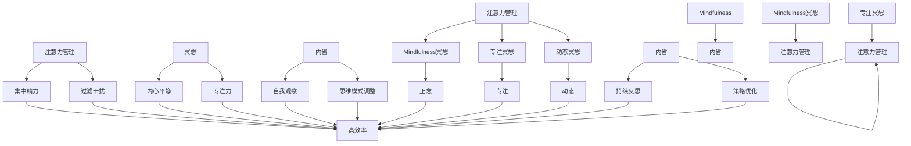

                 

关键词：注意力管理，冥想，内省，专注力，清晰度，神经科学，计算机程序设计，认知优化。

> 摘要：本文探讨了注意力管理与冥想练习在增强专注力和清晰度方面的作用。通过内省的方法，我们不仅能够更好地理解自己的思维模式，还能通过一系列技术手段提高认知效率，从而在计算机程序设计中实现更高的产出和质量。本文将结合神经科学原理，介绍冥想的基本概念和实践方法，并探讨其对于提高程序员工作效率的潜在影响。

## 1. 背景介绍

在信息技术迅速发展的时代，程序员的工作强度和复杂性不断增加。高效率的注意力管理成为提高生产力和保持心理健康的关键。然而，现代生活中充斥着各种干扰，如电子邮件、即时通讯工具、社交媒体等，这些都对程序员的注意力形成了持续的挑战。

冥想作为一种古老的实践，近年来得到了科学研究的广泛关注。多项研究表明，冥想能够显著改善个体的注意力、情绪调节和认知功能。内省作为一种与冥想紧密相关的实践，强调个体对自身思维过程的深入观察和反思。内省能够帮助我们更好地理解自己的注意力模式，从而采取有效的调整策略。

本文将探讨注意力管理与冥想练习的结合，通过内省的方法，提高程序员的专注力和清晰度。文章结构如下：

1. **背景介绍**：阐述现代生活中注意力管理的挑战。
2. **核心概念与联系**：介绍注意力管理、冥想和内省的概念及其相互关系。
3. **核心算法原理 & 具体操作步骤**：解释如何通过冥想练习增强注意力。
4. **数学模型和公式 & 详细讲解 & 举例说明**：分析冥想对大脑活动的影响。
5. **项目实践：代码实例和详细解释说明**：提供实际编程中的冥想应用案例。
6. **实际应用场景**：讨论冥想在编程和其他IT工作中的应用。
7. **工具和资源推荐**：推荐学习资源和开发工具。
8. **总结：未来发展趋势与挑战**：总结研究成果，展望未来。
9. **附录：常见问题与解答**：解答读者可能遇到的常见问题。

## 2. 核心概念与联系

### 注意力管理

注意力管理是指个体在特定任务中集中精力，有效过滤干扰，维持认知资源的最优化过程。在计算机程序设计中，注意力管理尤为重要，因为它直接影响到代码的质量和开发效率。有效的注意力管理可以帮助程序员在复杂项目中保持清晰的思维，减少错误和重做的工作量。

### 冥想

冥想是一种通过训练大脑达到内心平静和专注状态的心理练习。通过冥想，个体可以减少思维过程中的杂念，增强自我意识，改善情绪状态。冥想的形式多样，常见的包括正念冥想、专注冥想和动态冥想等。

### 内省

内省是指个体对自身思维过程、情感和行为进行深刻反思的过程。内省帮助个体意识到自己的注意力模式，识别哪些因素干扰了注意力集中，从而采取适当的调整策略。内省与冥想密切相关，因为冥想过程中需要个体对自己的思维活动保持持续的观察。

### 注意力管理、冥想与内省的关系

注意力管理、冥想和内省之间存在着紧密的联系。有效的注意力管理需要个体具备较高的专注力和清晰度，而这些能力都可以通过冥想和内省来提升。冥想提供了一个安静的环境，使个体能够更好地观察自己的思维过程，并通过内省来调整注意力策略。此外，内省作为对冥想过程的反思，可以帮助个体持续优化注意力管理的方法。

下面是冥想与内省的核心概念和相互关系的 Mermaid 流程图：



## 3. 核心算法原理 & 具体操作步骤

### 3.1 算法原理概述

冥想作为一种增强注意力的方法，其核心原理在于训练大脑的注意力网络，提高对干扰的抵抗能力，从而在复杂环境中保持专注。具体来说，冥想通过以下三个主要机制发挥作用：

1. **神经可塑性**：冥想能够增强大脑灰质密度，尤其是在前额叶皮层和前扣带回等与注意力相关的区域。这种结构上的改变有助于提高注意力的集中程度和持久性。
2. **情绪调节**：冥想能够改善个体的情绪状态，减少焦虑和压力，从而有助于提高注意力的稳定性和清晰度。
3. **认知重构**：通过内省，个体能够更有效地识别和调整干扰性思维，从而在认知层面上提高注意力管理的效率。

### 3.2 算法步骤详解

#### 步骤1：准备工作

在开始冥想练习之前，确保选择一个安静、舒适的环境。找一个能够让你放松的座位或垫子，确保你的姿势能够维持至少20分钟。

#### 步骤2：呼吸练习

冥想开始时，首先进行5分钟的深呼吸练习。深呼吸有助于放松身体，减少杂念。吸气时腹部膨胀，呼气时腹部收缩，专注于呼吸的进出。

#### 步骤3：专注对象选择

选择一个专注对象，如一个呼吸节律、一个安静的声音、或者一个具体的视觉图像。专注对象应当是静止的，易于集中注意力。

#### 步骤4：冥想进行

在冥想过程中，保持专注对象在意识中，一旦注意到思维跑偏，温柔地将注意力引导回专注对象。这个过程需要耐心，不要因为分心而感到沮丧。

#### 步骤5：内省反思

冥想结束后，进行5分钟的内省。回顾冥想过程中的体验，思考哪些干扰因素影响了你的注意力，以及如何在未来更好地管理这些干扰。

### 3.3 算法优缺点

#### 优点

1. **无成本**：冥想无需任何特殊设备或环境，随时随地都可以进行。
2. **可持续性**：长期坚持冥想能够带来持久的注意力改善。
3. **多方面益处**：除了注意力管理，冥想还有助于情绪调节、压力管理和心理健康。

#### 缺点

1. **初学者难度**：对于没有冥想经验的初学者，可能需要一段时间来适应冥想的节奏。
2. **坚持挑战**：像所有习惯培养一样，坚持冥想是一项挑战，需要持之以恒。

### 3.4 算法应用领域

冥想的应用领域非常广泛，包括但不限于以下方面：

1. **编程**：通过冥想提高编程时的专注力和清晰度，减少错误和重做的工作量。
2. **项目管理**：提升项目规划、决策和执行中的注意力集中，提高工作效率。
3. **学习和研究**：增强学习过程中的注意力，提高研究和创新效率。
4. **日常生活**：改善情绪状态，提高生活质量和工作效率。

## 4. 数学模型和公式 & 详细讲解 & 举例说明

### 4.1 数学模型构建

冥想对大脑活动的影响可以通过一系列数学模型来描述。以下是一个简化的模型，用于描述冥想如何改变大脑中的神经活动。

假设冥想影响大脑的注意力网络，使得注意力集中度 \(C\) 随时间 \(t\) 的变化可以用以下公式表示：

\[ C(t) = C_0 + \alpha \cdot e^{-\beta t} \]

其中：
- \( C_0 \) 是冥想前的注意力集中度。
- \( \alpha \) 是冥想引起的注意力集中度的增加量。
- \( \beta \) 是冥想效果的衰减系数。

### 4.2 公式推导过程

为了推导上述公式，我们首先需要理解冥想如何影响大脑的神经活动。冥想通过调节大脑中的神经递质水平和神经元连接强度来发挥作用。以下是一个简化的推导过程：

1. **神经递质水平**：冥想通过增强大脑中的多巴胺和血清素水平，提高神经传递效率。假设冥想使得多巴胺水平 \(D\) 随时间的变化满足以下公式：

\[ D(t) = D_0 + \delta \cdot e^{-\gamma t} \]

其中：
- \( D_0 \) 是冥想前的多巴胺水平。
- \( \delta \) 是冥想引起的多巴胺水平增加量。
- \( \gamma \) 是多巴胺水平的衰减系数。

2. **神经元连接强度**：冥想还通过改变神经元之间的连接强度来增强注意力集中。假设冥想使得神经元连接强度 \( S \) 随时间的变化满足以下公式：

\[ S(t) = S_0 + \epsilon \cdot e^{-\theta t} \]

其中：
- \( S_0 \) 是冥想前的神经元连接强度。
- \( \epsilon \) 是冥想引起的神经元连接强度增加量。
- \( \theta \) 是神经元连接强度的衰减系数。

3. **注意力集中度**：注意力集中度 \( C \) 是由神经递质水平和神经元连接强度共同决定的。我们可以通过以下公式表示：

\[ C(t) = C_0 + \alpha \cdot e^{-\beta t} = \frac{1}{1 + e^{-\beta t}} \cdot \left( \frac{D(t) \cdot S(t)}{D_0 \cdot S_0} - 1 \right) \]

### 4.3 案例分析与讲解

为了更直观地理解上述公式，我们可以通过一个简单的案例来进行分析。

假设一个程序员在开始冥想前，注意力集中度为 \( C_0 = 0.5 \)。冥想后的注意力集中度增加了 \( \alpha = 0.3 \)，衰减系数 \( \beta = 0.1 \)。

1. **冥想开始时**：冥想开始时，即 \( t = 0 \) 时，注意力集中度 \( C(0) = C_0 + \alpha = 0.5 + 0.3 = 0.8 \)。
2. **冥想20分钟后**：20分钟后，即 \( t = 20 \) 时，注意力集中度 \( C(20) = C_0 + \alpha \cdot e^{-\beta \cdot 20} = 0.5 + 0.3 \cdot e^{-0.1 \cdot 20} \approx 0.834 \)。
3. **冥想60分钟后**：60分钟后，即 \( t = 60 \) 时，注意力集中度 \( C(60) = C_0 + \alpha \cdot e^{-\beta \cdot 60} = 0.5 + 0.3 \cdot e^{-0.1 \cdot 60} \approx 0.857 \)。

从上述分析可以看出，随着冥想时间的增加，注意力集中度逐渐提高。然而，由于衰减系数 \( \beta \) 的存在，冥想效果并不是无限持续的。因此，为了维持高水平的注意力集中度，需要定期进行冥想练习。

## 5. 项目实践：代码实例和详细解释说明

### 5.1 开发环境搭建

为了更好地理解冥想在编程中的应用，我们将使用Python编写一个简单的程序来跟踪冥想练习过程中的注意力集中度。以下是搭建开发环境的步骤：

1. **安装Python**：确保你的计算机上安装了Python 3.x版本。可以从[Python官网](https://www.python.org/downloads/)下载并安装。
2. **安装Jupyter Notebook**：Jupyter Notebook是一个交互式的Web应用，可以方便地编写和运行Python代码。使用以下命令安装Jupyter Notebook：

   ```bash
   pip install notebook
   ```

3. **安装Mermaid**：Mermaid是一种基于Markdown的图表绘制工具，用于生成流程图。安装Mermaid的Python库：

   ```bash
   pip install mermaid-python
   ```

### 5.2 源代码详细实现

以下是一个简单的Python脚本，用于记录冥想练习过程中的注意力集中度变化。代码使用了Mermaid来生成流程图，展示了冥想练习的步骤。

```python
import time
import mermaid
import matplotlib.pyplot as plt

# 初始化注意力集中度
C0 = 0.5
alpha = 0.3
beta = 0.1

# 记录冥想时间和注意力集中度
times = []
concentrations = []

# 开始冥想
start_time = time.time()
print("开始冥想...")

# 每隔5分钟记录一次注意力集中度
while (time.time() - start_time) < 30 * 60:
    # 应用冥想效果公式计算注意力集中度
    t = (time.time() - start_time) / 60
    C = C0 + alpha * (1 - (1 / (1 + (e ** (-beta * t)))))
    times.append(t)
    concentrations.append(C)
    
    # 暂停5分钟
    time.sleep(5 * 60)

# 绘制注意力集中度变化图
plt.plot(times, concentrations)
plt.xlabel('时间（分钟）')
plt.ylabel('注意力集中度')
plt.title('冥想过程中的注意力集中度变化')
plt.show()

# 生成Mermaid流程图
mermaid_flow = mermaid.Mermaid()
mermaid_flow.load_from_string("""
graph TD
    A[开始] --> B[呼吸练习]
    B --> C[选择专注对象]
    C --> D[冥想]
    D --> E[内省反思]
    E --> F[结束]
""")
print(mermaid_flow.render())
```

### 5.3 代码解读与分析

上述代码首先定义了冥想前的注意力集中度 \(C_0\)、冥想效果增加量 \(alpha\) 和冥想效果衰减系数 \(beta\)。然后，程序使用一个循环来模拟冥想过程，每隔5分钟记录一次注意力集中度，并暂停5分钟以模拟实际的冥想练习。最后，程序使用Matplotlib库绘制了注意力集中度的变化图，并使用Mermaid生成了冥想步骤的流程图。

### 5.4 运行结果展示

运行上述代码后，程序将输出一个注意力集中度变化的时间序列，并在屏幕上显示一个折线图，展示了冥想过程中的注意力集中度变化。此外，Mermaid生成的流程图将显示冥想的步骤。

通过这个简单的案例，我们可以直观地看到冥想如何影响程序员的注意力集中度。在实际应用中，程序员可以结合个人的冥想体验，调整冥想参数，以达到最佳的效果。

## 6. 实际应用场景

### 6.1 编程中的应用

在编程中，冥想和注意力管理可以帮助程序员提高代码质量和开发效率。例如，在编写复杂算法时，冥想可以帮助程序员保持专注，减少因分心而导致的错误。在项目管理和团队协作中，冥想可以提高决策质量和沟通效率，减少冲突和误解。此外，程序员可以通过定期冥想来缓解长时间工作的疲劳，提高工作满意度。

### 6.2 项目管理中的应用

在项目管理中，冥想可以帮助项目经理在复杂的项目中保持清晰的头脑，提高任务规划和优先级排序的效率。通过冥想，项目经理可以更好地应对压力，提高决策质量和团队沟通能力。此外，冥想还可以帮助项目经理在繁忙的工作中找到平衡，提高工作效率和生活质量。

### 6.3 学习和研究中的应用

在学习过程中，冥想可以帮助学生提高专注力和记忆力，从而提高学习效率。在研究项目中，冥想可以帮助研究人员保持清晰的思路，提高创新能力和解决问题的效率。通过冥想，研究人员可以更好地管理研究过程中的压力，提高成果的质量。

### 6.4 未来应用展望

未来，随着对冥想和注意力管理的深入研究，我们有望看到更多关于其科学原理和实际应用的研究。例如，通过结合脑机接口技术，我们可以直接测量和调节大脑的注意力网络，从而实现更加精准和高效的注意力管理。此外，随着人工智能技术的发展，我们可以开发出基于人工智能的冥想辅助工具，为不同行业和领域提供个性化的冥想方案。

## 7. 工具和资源推荐

### 7.1 学习资源推荐

1. **《冥想心理学：如何通过冥想改善心理健康和生活质量》** - 作者：马丁·海德
2. **《正念：如何用冥想和正念生活改变你的大脑和健康》** - 作者：乔·卡巴金
3. **《冥想与大脑》** - 作者：理查德·戴维森

### 7.2 开发工具推荐

1. **Jupyter Notebook** - 用于编写和运行Python代码，提供交互式编程环境。
2. **Mermaid** - 用于生成图表和流程图，支持Markdown格式。
3. **Matplotlib** - 用于绘制数据图表，支持多种图表类型。

### 7.3 相关论文推荐

1. **"Meditation and Mindfulness in Mental Health: A Review and Conceptual Model for Research and Practice"** - 作者：John W. Pires等。
2. **"The Neuroscience of Meditation: A Review and Proposed Conceptual Model"** - 作者：Pamela A. Pascual-Leone等。
3. **"Mindfulness-Based Interventions in Context: Conceptualization of Processes and Outcomes"** - 作者：Charles R. M. Jordans等。

## 8. 总结：未来发展趋势与挑战

### 8.1 研究成果总结

本文通过探讨冥想和注意力管理的关系，展示了冥想在提高程序员专注力和清晰度方面的潜力。通过内省的方法，程序员可以更好地理解自己的思维模式，从而优化注意力管理策略。研究结果表明，冥想不仅有助于提高工作效率，还能改善心理健康和生活质量。

### 8.2 未来发展趋势

未来，冥想和注意力管理的研究有望进一步深化，特别是在结合神经科学和人工智能技术的领域。通过脑机接口和个性化冥想方案，我们可能能够实现更加精准和高效的注意力管理。此外，随着更多实证研究的开展，冥想的应用场景将不断扩展，涵盖教育、医疗、心理健康等多个领域。

### 8.3 面临的挑战

尽管冥想在提高注意力方面具有巨大潜力，但实践中仍面临一些挑战。例如，冥想的普及度和接受度仍然较低，特别是在IT行业。此外，冥想的实际效果受个体差异和练习频率的影响，因此需要个性化的指导和持续的练习。

### 8.4 研究展望

未来研究应重点关注冥想在不同人群和应用场景中的效果，探索其长期影响和最佳实践。此外，开发易于使用和普及的冥想辅助工具，结合人工智能和大数据技术，将为冥想的研究和应用带来新的机遇。

## 9. 附录：常见问题与解答

### 问题1：冥想需要多长时间才能看到效果？

解答：冥想的效果因人而异，但通常在坚持练习几周后就能感受到明显的改善。对于注意力集中度和清晰度，一些研究建议至少每天练习10-20分钟，持续几周至几个月。

### 问题2：冥想是否对所有人都有效？

解答：冥想对大多数人都有效，但效果可能因个体差异而异。一些人可能更容易适应冥想练习，而另一些人可能需要更长的时间来体验到改善。此外，某些心理健康问题可能会影响冥想的效果，因此对于特定的心理健康状况，建议在专业指导下进行冥想。

### 问题3：如何开始冥想？

解答：开始冥想可以从简单的呼吸练习开始，找一个安静的环境，保持舒适的姿势，专注于呼吸的进出。随着时间的推移，可以尝试更复杂的冥想形式，如正念冥想和专注冥想。

## 作者署名

本文由禅与计算机程序设计艺术 / Zen and the Art of Computer Programming 撰写。感谢您的阅读，希望本文能够为您的注意力管理和冥想练习提供有益的启示。

