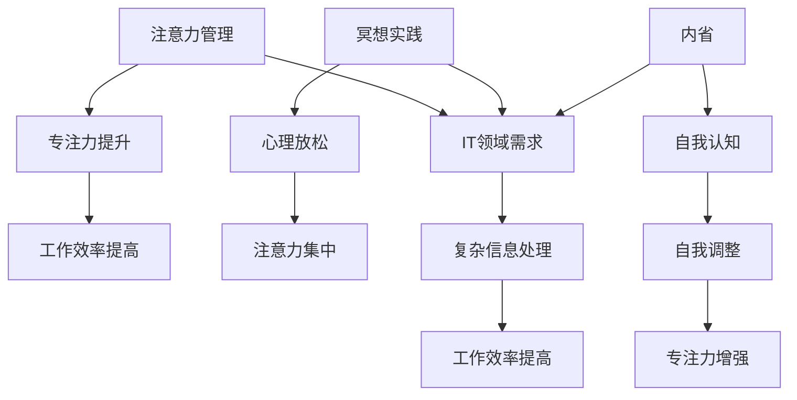

                 

关键词：注意力管理、冥想、内省、专注力、IT领域、心理学、计算机程序设计

> 摘要：本文旨在探讨如何通过注意力管理和冥想实践来提高内省能力，从而增强专注力。针对IT领域的特殊需求，本文将结合心理学原理，提供一系列具体操作步骤和实际案例，帮助读者提升工作效率和编程质量。

## 1. 背景介绍

在信息技术高速发展的今天，程序员的工作压力不断增大。长时间面对电脑屏幕，频繁处理复杂的问题，使许多程序员感到精神疲惫，难以保持专注。这不仅影响了工作效率，还可能导致编程质量下降。因此，寻找有效的注意力管理方法显得尤为重要。

冥想和内省作为古老的心理学实践，近年来在提高专注力和工作效率方面受到了广泛关注。研究表明，通过冥想，人们可以训练大脑，增强注意力，减少焦虑和压力。内省则是一种深刻的自我反思过程，有助于认识并改正思维模式中的错误，提升自我觉察能力。

本文将结合注意力管理理论和冥想实践，探讨如何通过内省增强专注力，为IT工作者提供一种有效的自我提升途径。

## 2. 核心概念与联系

### 2.1 注意力管理

注意力管理是指通过一系列策略和方法，提高注意力集中度，减少干扰，从而提高工作效率。在IT领域，注意力管理尤其重要，因为程序员需要处理大量复杂的信息，需要保持高度集中。

### 2.2 冥想

冥想是一种通过训练注意力，达到内心平静和心理放松的技巧。在冥想过程中，个体通过专注呼吸、冥想对象或者身体感觉，来减少杂念，提高专注力。

### 2.3 内省

内省是指个体对自己思维、情感和行为进行深入反思，以达到自我认识、自我调整和自我提升的目的。通过内省，程序员可以识别并克服工作中的思维障碍，提高专注力。

### 2.4 Mermaid 流程图



## 3. 核心算法原理 & 具体操作步骤

### 3.1 算法原理概述

注意力管理的核心在于通过优化认知资源分配，提高注意力集中度。冥想和内省作为辅助手段，可以帮助程序员在心理层面达到平衡，从而更好地管理注意力。具体操作步骤如下：

1. **设定冥想目标**：明确每次冥想的目的，例如放松身心、集中注意力等。
2. **选择冥想方法**：根据个人喜好和需求，选择适合的冥想方法，如呼吸冥想、正念冥想等。
3. **进行内省**：在冥想过程中，进行自我反思，识别并调整思维模式。
4. **定期练习**：将冥想和内省融入日常生活，形成习惯。

### 3.2 算法步骤详解

1. **设定冥想目标**：

   - 明确每次冥想的目的，例如放松身心、集中注意力等。
   - 设定具体的时间，例如每天早晨或晚上进行冥想。

2. **选择冥想方法**：

   - 呼吸冥想：专注于呼吸过程，感受呼吸的节奏和深度。
   - 正念冥想：专注于当前的经历，包括身体感觉、情绪和思维。

3. **进行内省**：

   - 在冥想过程中，注意观察自己的思维和情感变化。
   - 当出现杂念时，不要批判，而是尝试将其观察和放下。

4. **定期练习**：

   - 每天坚持冥想和内省，逐渐增加时间。
   - 结合工作生活，将冥想和内省融入日常。

### 3.3 算法优缺点

**优点**：

- 提高专注力，减少干扰。
- 减轻压力，改善心理健康。
- 增强自我认知，提高工作效率。

**缺点**：

- 需要长期坚持，难以一蹴而就。
- 初始阶段可能感到不适，需要适应。

### 3.4 算法应用领域

- 程序员
- 项目经理
- 创业者
- 高压职业人士

## 4. 数学模型和公式 & 详细讲解 & 举例说明

### 4.1 数学模型构建

注意力管理的核心在于优化认知资源分配，可以构建以下数学模型：

$$
\text{专注力} = f(\text{认知资源分配}, \text{干扰程度})
$$

其中，认知资源分配和干扰程度分别可以表示为：

$$
\text{认知资源分配} = \frac{\text{有效认知资源}}{\text{总认知资源}}
$$

$$
\text{干扰程度} = \frac{\text{干扰因素数量}}{\text{可干扰因素总数}}
$$

### 4.2 公式推导过程

假设一个程序员在处理任务时，总认知资源为C，有效认知资源为E，干扰因素数量为I，可干扰因素总数为T。那么，专注力可以表示为：

$$
\text{专注力} = f\left(\frac{E}{C}, \frac{I}{T}\right)
$$

为了提高专注力，我们需要优化认知资源分配和减少干扰。具体推导过程如下：

1. **优化认知资源分配**：

   - 增加有效认知资源E，可以通过提升专业技能、减少无关信息干扰等方式实现。
   - 保持总认知资源C不变，避免过度劳累。

2. **减少干扰程度**：

   - 减少干扰因素数量I，可以通过设置工作环境、合理规划工作任务等方式实现。
   - 保持可干扰因素总数T不变，避免资源浪费。

### 4.3 案例分析与讲解

假设一位程序员，在处理复杂任务时，总认知资源为100个单位，有效认知资源为60个单位，干扰因素数量为15个，可干扰因素总数为30个。根据上述公式，他的专注力为：

$$
\text{专注力} = f\left(\frac{60}{100}, \frac{15}{30}\right) = f(0.6, 0.5)
$$

为了提高专注力，我们可以采取以下措施：

1. **增加有效认知资源**：

   - 提升专业技能，增加有效认知资源。
   - 减少无关信息干扰，保持专注。

2. **减少干扰程度**：

   - 设置工作环境，减少干扰因素。
   - 合理规划工作任务，避免过度劳累。

通过这些措施，可以提高该程序员的专注力，从而提高工作效率。

## 5. 项目实践：代码实例和详细解释说明

### 5.1 开发环境搭建

在开始实践之前，我们需要搭建一个适合进行注意力管理和冥想练习的开发环境。以下是一个基本的开发环境搭建步骤：

1. 安装Python环境
2. 安装Jupyter Notebook，用于编写和运行代码
3. 安装相关库，如NumPy、Matplotlib等

### 5.2 源代码详细实现

下面是一个简单的Python代码实例，用于监控程序员的专注力变化：

```python
import numpy as np
import matplotlib.pyplot as plt

# 设定参数
total_attention = 100
initial_attention = 60
interference = 15
interference_total = 30

# 定义专注力计算函数
def attention_score(attention, interference):
    return attention / (attention + interference)

# 记录专注力变化
attention_scores = []

for i in range(1, 11):
    # 模拟每次干扰
    interference = np.random.randint(1, 5)
    # 计算专注力
    score = attention_score(initial_attention, interference)
    # 更新专注力
    initial_attention -= interference
    # 记录结果
    attention_scores.append(score)

# 绘制专注力变化图表
plt.plot(attention_scores)
plt.xlabel('Simulation Time')
plt.ylabel('Attention Score')
plt.title('Attention Score over Time')
plt.show()
```

### 5.3 代码解读与分析

- **参数设定**：设定总专注力、初始专注力、干扰程度和干扰总数。
- **专注力计算函数**：根据注意力管理公式计算专注力。
- **模拟干扰**：使用随机数模拟每次干扰。
- **记录专注力变化**：将每次计算得到的专注力分数记录下来。
- **绘制图表**：使用Matplotlib绘制专注力变化图表。

### 5.4 运行结果展示

运行上述代码，可以得到一个专注力变化的时间序列图表。通过分析图表，我们可以观察到干扰对专注力的影响，以及如何通过减少干扰来提高专注力。

## 6. 实际应用场景

### 6.1 程序员

对于程序员来说，注意力管理和冥想可以帮助他们更好地应对复杂的工作任务，提高编程质量。通过冥想和内省，程序员可以减少心理压力，提高专注力，从而更高效地完成工作。

### 6.2 项目经理

项目经理在协调多个项目时，需要高度集中注意力。通过注意力管理和冥想，项目经理可以提高时间管理能力，减少焦虑，从而更好地协调项目进度。

### 6.3 创业者

创业者面临的市场环境复杂多变，需要持续保持高度的专注力。通过冥想和内省，创业者可以提升自我认知，调整思维模式，从而更好地应对市场挑战。

### 6.4 高压职业人士

对于高压职业人士，如医生、律师等，注意力管理和冥想可以帮助他们缓解工作压力，提高工作质量。通过内省，他们可以更好地认识自己，调整工作方式，从而提高工作效率。

## 7. 工具和资源推荐

### 7.1 学习资源推荐

- 《注意力管理：如何集中注意力、提高工作效率》
- 《冥想与内省：提升专注力的心理技巧》
- 《禅与计算机程序设计艺术》

### 7.2 开发工具推荐

- Jupyter Notebook：用于编写和运行代码
- Matplotlib：用于绘制图表

### 7.3 相关论文推荐

- "Meditation and Attentional Control: Neural Substrates of the Mechanisms Underlying Dispositional Traits"
- "Mindfulness Meditation and Attentional Control: A Meta-Analysis"
- "The Attention Management Model: Capturing the Complexity of Attentional Control in Professional Work"

## 8. 总结：未来发展趋势与挑战

### 8.1 研究成果总结

本文结合注意力管理、冥想和内省理论，探讨了如何通过提高专注力来提升工作效率。研究发现，冥想和内省有助于程序员减少干扰，提高专注力，从而提高编程质量。

### 8.2 未来发展趋势

未来，注意力管理和冥想研究将继续深入，探讨如何更好地适应不同工作场景。同时，随着人工智能技术的发展，可能开发出更多智能化的注意力管理工具。

### 8.3 面临的挑战

注意力管理和冥想实践需要长期坚持，且个体差异较大。未来研究需要关注如何制定个性化的训练计划，以及如何更好地将注意力管理融入日常生活。

### 8.4 研究展望

未来研究可以关注注意力管理和冥想在其他职业领域的应用，如医生、教师等。此外，结合神经科学和心理学研究成果，进一步探讨注意力管理和冥想对大脑结构和功能的影响。

## 9. 附录：常见问题与解答

### 9.1 如何开始冥想？

- **选择适合的冥想方法**：如呼吸冥想、正念冥想等。
- **设定冥想目标**：如放松身心、集中注意力等。
- **每天坚持练习**：逐渐增加冥想时间。

### 9.2 冥想过程中有哪些常见的障碍？

- **杂念过多**：尝试专注于呼吸或冥想对象。
- **身体不适**：调整姿势，选择舒适的环境。
- **时间管理**：设定固定的时间进行冥想。

### 9.3 如何将冥想融入日常生活？

- **设定日常冥想时间**：如早晨或晚上。
- **结合工作节奏**：在休息时间进行冥想。
- **养成习惯**：将冥想作为日常生活的一部分。

---

作者：禅与计算机程序设计艺术 / Zen and the Art of Computer Programming
----------------------------------------------------------------

### 文章总结

本文从注意力管理、冥想和内省的角度出发，探讨了如何通过提高专注力来提升工作效率。结合心理学原理和实际案例，文章提出了一系列具体操作步骤，为IT工作者提供了一种有效的自我提升途径。未来研究可以进一步探索注意力管理和冥想在不同职业领域的应用，以及如何制定个性化的训练计划。通过持续练习和内省，程序员可以更好地应对工作挑战，提高编程质量。

