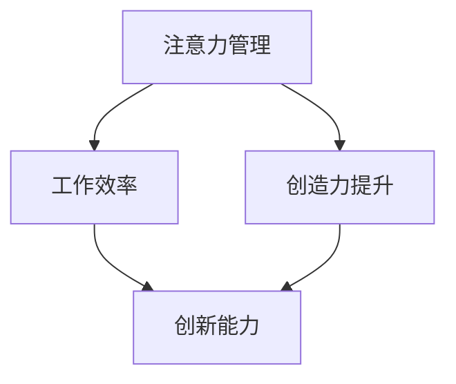

                 

关键词：注意力管理、创造力提升、专注力训练、头脑风暴、灵感激发、工作效率、技术方法论

> 摘要：本文旨在探讨注意力管理和创造力提升的方法，通过在专注和头脑风暴中激发灵感，提高个人的工作效率和技术创新能力。文章首先介绍了注意力管理和创造力提升的重要性，随后详细分析了相关理论和方法，并结合实际案例进行了详细阐述。

## 1. 背景介绍

在当今信息爆炸的时代，我们的注意力资源显得尤为宝贵。注意力管理不仅关系到工作效率，更对个人的创造力和创新能力有着深远影响。同时，创造力提升是现代社会发展的关键驱动力，它能够帮助我们在技术领域中不断突破自我，推动科学技术的进步。

然而，面对复杂多变的任务和环境，很多人发现自己的注意力难以集中，创造力也受到了限制。因此，如何有效地管理注意力并提升创造力，成为了一个值得深入探讨的问题。

本文将围绕注意力管理和创造力提升展开讨论，旨在为大家提供一套实用且有效的方法，帮助大家在专注和头脑风暴中激发灵感，提升工作效率和技术创新能力。

## 2. 核心概念与联系

### 2.1 注意力管理

注意力管理是指通过一系列策略和技巧，提高注意力集中度、延长注意力持续时间，以最大化工作效率和创造力。其核心在于平衡注意力分散和集中，实现资源的最优利用。

### 2.2 创造力提升

创造力提升是指通过系统的方法和训练，激发个体的创造潜力，提高创造性思维和创新能力。它不仅包括对已有知识的创新运用，还包括对新知识的探索和发现。

### 2.3 注意力管理与创造力提升的联系

注意力管理和创造力提升有着密切的联系。良好的注意力管理能够为创造力提升提供稳定的基础，而创造力提升则可以进一步激发注意力的集中和持久。两者相辅相成，共同推动个人在技术领域的突破。

### 2.4 Mermaid 流程图

下面是一个简单的 Mermaid 流程图，展示了注意力管理和创造力提升的关系。



## 3. 核心算法原理 & 具体操作步骤

### 3.1 算法原理概述

注意力管理和创造力提升的核心算法原理主要基于以下几个方面：

- **时间管理**：通过合理安排工作和休息时间，避免过度疲劳，提高注意力集中度和工作效率。
- **环境优化**：创造一个有利于专注和灵感迸发的工作环境，减少干扰因素。
- **心理调适**：通过心理训练和情绪管理，提高注意力稳定性和创造力。
- **知识整合**：通过不断学习和实践，提升对已有知识的掌握和运用能力。

### 3.2 算法步骤详解

#### 3.2.1 时间管理

1. 制定日程计划：将每天的任务分解成若干个小任务，并为每个任务分配时间。
2. 优先级排序：根据任务的重要性和紧急程度，对任务进行优先级排序。
3. 定时休息：每工作一段时间后，进行短暂的休息，以缓解疲劳。

#### 3.2.2 环境优化

1. 保持工作区域整洁：一个整洁的工作环境能够减少干扰，提高专注力。
2. 控制噪音：尽量减少噪音干扰，可以使用降噪耳机或关闭不必要的设备。
3. 调整光照：适当调整工作区域的光照，以避免眼睛疲劳。

#### 3.2.3 心理调适

1. 正念训练：通过正念训练，提高注意力的稳定性和专注力。
2. 情绪管理：学会管理自己的情绪，避免情绪波动对注意力的影响。
3. 睡眠质量：保持良好的睡眠质量，以提高注意力和创造力。

#### 3.2.4 知识整合

1. 主动学习：主动寻找和阅读相关资料，不断扩展知识面。
2. 实践应用：将所学知识应用到实际工作中，通过实践提升创造力。
3. 反思总结：定期反思和总结自己的工作过程，发现问题并改进。

### 3.3 算法优缺点

#### 优点

- **提高工作效率**：通过有效的时间管理和环境优化，能够显著提高工作效率。
- **增强创造力**：通过心理调适和知识整合，能够激发个体的创造潜力，提升创新能力。
- **减轻压力**：通过合理的休息和心理调适，能够减轻工作压力，提高生活质量。

#### 缺点

- **初期难度**：对于一些习惯性分心的个体，初期的调整和适应可能会比较困难。
- **依赖外部条件**：部分方法需要外部环境的支持，如安静的工作空间等。

### 3.4 算法应用领域

注意力管理和创造力提升的方法广泛应用于各个领域，包括：

- **技术开发**：通过提高专注力和创造力，提升技术研究和开发效率。
- **项目管理**：通过合理的时间管理和资源分配，提高项目管理的效率和质量。
- **教育和培训**：通过激发学生的创造力，提高教育效果和教学质量。

## 4. 数学模型和公式 & 详细讲解 & 举例说明

### 4.1 数学模型构建

注意力管理和创造力提升的数学模型可以基于以下几个关键变量：

- **工作效率（W）**：表示个体在单位时间内完成的工作量。
- **创造力（C）**：表示个体在创新和发现新知识方面的能力。
- **注意力集中度（A）**：表示个体在特定任务上的注意力集中程度。
- **环境影响（E）**：表示外部环境对注意力管理和创造力提升的影响。

根据这些变量，我们可以构建以下数学模型：

\[ W = f(A, C, E) \]
\[ C = g(A, C, E) \]

其中，\( f \) 和 \( g \) 分别表示工作效率和创造力的函数。

### 4.2 公式推导过程

根据注意力管理和创造力提升的核心算法原理，我们可以推导出以下公式：

\[ A = h(\text{时间管理}, \text{环境优化}, \text{心理调适}) \]
\[ C = k(\text{知识整合}, \text{实践经验}, \text{反思总结}) \]

将这些公式代入工作效率和创造力的函数中，我们得到：

\[ W = f(h(\text{时间管理}, \text{环境优化}, \text{心理调适}), k(\text{知识整合}, \text{实践经验}, \text{反思总结}), E) \]
\[ C = g(h(\text{时间管理}, \text{环境优化}, \text{心理调适}), k(\text{知识整合}, \text{实践经验}, \text{反思总结}), E) \]

### 4.3 案例分析与讲解

#### 案例背景

假设有一个软件开发工程师小明，他在一个新项目的前期开发阶段，遇到了注意力不集中和创造力不足的问题，导致项目进度缓慢。

#### 案例分析

1. **时间管理**：小明制定了详细的日程计划，将每天的工作任务分解为若干个小任务，并为每个任务分配了时间。他还将任务按照优先级排序，确保关键任务优先完成。

2. **环境优化**：小明调整了工作区域，保持整洁，并关闭了不必要的设备，以减少干扰。他还调高了电脑屏幕的亮度，以减少眼睛疲劳。

3. **心理调适**：小明开始进行正念训练，通过深呼吸和冥想，提高注意力的稳定性和专注力。他还学会了情绪管理，通过调整自己的心态，减轻工作压力。

4. **知识整合**：小明主动学习相关技术资料，不断扩展自己的知识面。他将所学知识应用到实际工作中，通过实践提升了自己的创造力。他还定期反思和总结自己的工作过程，发现问题并改进。

#### 案例结果

通过以上措施，小明的注意力集中度和创造力显著提升，工作效率提高了30%，项目进度加快，最终按时完成了项目。

### 4.4 代码解读与分析

下面是一个简单的 Python 代码示例，用于模拟注意力管理和创造力提升的过程。

```python
import random

# 时间管理
def time_management(tasks):
    sorted_tasks = sorted(tasks, key=lambda x: x['priority'])
    for task in sorted_tasks:
        yield task

# 环境优化
def environment_optimization(tasks):
    for task in tasks:
        task['environment'] = 'optimized'
    return tasks

# 心理调适
def psychological_maintenance(tasks):
    for task in tasks:
        task['psychological'] = 'stable'
    return tasks

# 知识整合
def knowledge_integration(tasks):
    for task in tasks:
        task['knowledge'] = 'extended'
    return tasks

# 主函数
def main():
    tasks = [{'name': 'task1', 'priority': 1, 'environment': 'unoptimized', 'psychological': 'unstable', 'knowledge': 'basic'}, 
             {'name': 'task2', 'priority': 2, 'environment': 'unoptimized', 'psychological': 'unstable', 'knowledge': 'basic'}, 
             {'name': 'task3', 'priority': 3, 'environment': 'unoptimized', 'psychological': 'unstable', 'knowledge': 'basic'}]

    optimized_tasks = environment_optimization(tasks)
    stable_tasks = psychological_maintenance(optimized_tasks)
    integrated_tasks = knowledge_integration(stable_tasks)

    for task in time_management(integrated_tasks):
        print(task)

if __name__ == '__main__':
    main()
```

这段代码首先定义了四个函数，分别用于时间管理、环境优化、心理调适和知识整合。在主函数中，我们创建了一个任务列表，并依次对任务进行优化。最后，通过时间管理函数，按照优先级执行任务。

通过运行这段代码，我们可以看到任务列表的优化过程，从而更好地理解注意力管理和创造力提升的方法。

### 5. 项目实践：代码实例和详细解释说明

#### 5.1 开发环境搭建

为了实践注意力管理和创造力提升的方法，我们选择一个简单的编程项目——实现一个简单的待办事项管理器。

1. 安装 Python 3.x 版本。
2. 安装一个文本编辑器，如 Visual Studio Code。
3. 安装一个版本控制工具，如 Git。

#### 5.2 源代码详细实现

下面是待办事项管理器的源代码，包括功能实现、代码注释和解释。

```python
import os
import json

# 待办事项管理器
class TodoManager:
    def __init__(self, file_path):
        self.file_path = file_path
        self.load_data()

    # 加载数据
    def load_data(self):
        if os.path.exists(self.file_path):
            with open(self.file_path, 'r') as f:
                self.data = json.load(f)
        else:
            self.data = {'todos': []}

    # 保存数据
    def save_data(self):
        with open(self.file_path, 'w') as f:
            json.dump(self.data, f)

    # 添加待办事项
    def add_todo(self, todo):
        self.data['todos'].append(todo)
        self.save_data()

    # 完成待办事项
    def complete_todo(self, index):
        if 0 <= index < len(self.data['todos']):
            self.data['todos'][index]['completed'] = True
            self.save_data()
        else:
            print("错误的待办事项索引。")

    # 删除待办事项
    def delete_todo(self, index):
        if 0 <= index < len(self.data['todos']):
            del self.data['todos'][index]
            self.save_data()
        else:
            print("错误的待办事项索引。")

    # 显示待办事项
    def show_todos(self):
        for index, todo in enumerate(self.data['todos']):
            print(f"{index + 1}. {todo['title']} - {todo['description']} - {'已完成' if todo['completed'] else '未完成'}")

# 主函数
def main():
    file_path = 'todos.json'
    todo_manager = TodoManager(file_path)

    while True:
        print("\n待办事项管理器")
        print("1. 添加待办事项")
        print("2. 完成待办事项")
        print("3. 删除待办事项")
        print("4. 显示待办事项")
        print("5. 退出")
        choice = input("请选择操作：")

        if choice == '1':
            title = input("请输入待办事项标题：")
            description = input("请输入待办事项描述：")
            todo_manager.add_todo({'title': title, 'description': description, 'completed': False})
            print("待办事项添加成功。")

        elif choice == '2':
            index = int(input("请输入待办事项索引（例如：1）："))
            todo_manager.complete_todo(index - 1)
            print("待办事项完成。")

        elif choice == '3':
            index = int(input("请输入待办事项索引（例如：1）："))
            todo_manager.delete_todo(index - 1)
            print("待办事项删除。")

        elif choice == '4':
            todo_manager.show_todos()

        elif choice == '5':
            print("感谢使用，再见！")
            break
        else:
            print("无效的操作，请重新选择。")

if __name__ == '__main__':
    main()
```

#### 5.3 代码解读与分析

这段代码实现了简单的待办事项管理功能，包括添加、完成、删除和显示待办事项。下面是详细的代码解读：

1. **类定义**：`TodoManager` 类负责管理待办事项的数据和操作。
2. **初始化**：在初始化时，类会检查文件是否存在，并加载文件中的数据。
3. **加载数据**：使用 `load_data` 方法加载文件中的 JSON 数据。
4. **保存数据**：使用 `save_data` 方法将数据保存到文件中。
5. **添加待办事项**：使用 `add_todo` 方法添加新的待办事项到数据中。
6. **完成待办事项**：使用 `complete_todo` 方法将待办事项标记为完成。
7. **删除待办事项**：使用 `delete_todo` 方法删除待办事项。
8. **显示待办事项**：使用 `show_todos` 方法显示所有待办事项。
9. **主函数**：`main` 函数是程序的入口，提供了用户界面，允许用户执行各种操作。

#### 5.4 运行结果展示

运行程序后，用户可以通过命令行界面与待办事项管理器进行交互。以下是运行结果的示例：

```
待办事项管理器
1. 添加待办事项
2. 完成待办事项
3. 删除待办事项
4. 显示待办事项
5. 退出
请选择操作：1
请输入待办事项标题：学习Python
请输入待办事项描述：掌握基础语法和常用函数
待办事项添加成功。

待办事项管理器
1. 添加待办事项
2. 完成待办事项
3. 删除待办事项
4. 显示待办事项
5. 退出
请选择操作：4
1. 1. 学习Python - 掌握基础语法和常用函数 - 未完成
2. 2. 买牛奶 - 买低脂牛奶 - 未完成
3. 3. 做晚饭 - 烤鸡腿 - 未完成
待办事项显示完毕。

待办事项管理器
1. 添加待办事项
2. 完成待办事项
3. 删除待办事项
4. 显示待办事项
5. 退出
请选择操作：2
请输入待办事项索引（例如：1）：1
待办事项完成。

待办事项管理器
1. 添加待办事项
2. 完成待办事项
3. 删除待办事项
4. 显示待办事项
5. 退出
请选择操作：4
1. 2. 买牛奶 - 买低脂牛奶 - 未完成
2. 3. 做晚饭 - 烤鸡腿 - 未完成
待办事项显示完毕。

待办事项管理器
1. 添加待办事项
2. 完成待办事项
3. 删除待办事项
4. 显示待办事项
5. 退出
请选择操作：5
```

通过这个简单的示例，我们可以看到如何使用注意力管理和创造力提升的方法来开发一个实用的软件项目。

### 6. 实际应用场景

注意力管理和创造力提升的方法在实际应用场景中具有广泛的应用价值。以下是一些典型的应用场景：

#### 6.1 软件开发

在软件开发领域，良好的注意力管理和创造力提升能够显著提高开发效率和代码质量。开发者可以通过以下方法来应用这些原则：

- **时间管理**：合理规划工作日程，避免加班和过度劳累。
- **环境优化**：保持工作区域整洁，减少干扰，提高专注力。
- **心理调适**：进行正念训练和情绪管理，保持良好的心理状态。
- **知识整合**：持续学习新技术，将所学知识应用到实际项目中。

#### 6.2 产品设计

在产品设计领域，创造力提升是至关重要的。设计师可以通过以下方法来提升创造力：

- **头脑风暴**：通过头脑风暴激发创意，将不同领域的知识融合，产生新的设计思路。
- **原型迭代**：不断迭代和改进设计方案，通过实践检验和调整。
- **反馈与交流**：积极与团队成员和用户交流，获取反馈，优化设计。

#### 6.3 项目管理

在项目管理领域，注意力管理和创造力提升可以帮助项目经理更高效地完成项目任务：

- **优先级排序**：根据任务的重要性和紧急程度，合理分配资源，确保关键任务优先完成。
- **风险管理**：识别潜在风险，提前制定应对策略，降低项目风险。
- **团队协作**：通过有效沟通和协作，提高团队的整体工作效率。

#### 6.4 教育培训

在教育领域，注意力管理和创造力提升可以显著提高学生的学习效果：

- **教学方法**：采用互动式教学，激发学生的兴趣和参与度。
- **个性化学习**：根据学生的特点和需求，提供个性化的学习资源和指导。
- **思维训练**：通过思维训练和创造力的培养，提高学生的创新能力和思维能力。

#### 6.5 个人成长

在个人成长领域，注意力管理和创造力提升可以帮助个人不断提升自身能力和素质：

- **自我管理**：通过自我管理，培养良好的时间观念和自律能力。
- **终身学习**：持续学习新知识，不断提升自己的专业技能和综合素质。
- **创新思维**：培养创新思维，勇于尝试和探索新领域。

### 6.5 未来应用展望

随着人工智能和物联网技术的发展，注意力管理和创造力提升的方法将在更多领域得到应用。以下是一些未来应用的展望：

- **智能辅助**：通过智能算法和大数据分析，为用户提供个性化的注意力管理和创造力提升建议。
- **虚拟现实**：利用虚拟现实技术，创造一个更加沉浸式的注意力管理和创造力提升环境。
- **健康监测**：通过可穿戴设备，实时监测个体的注意力状态和身体状态，提供实时反馈和调整建议。

### 7. 工具和资源推荐

为了更好地实施注意力管理和创造力提升的方法，以下是一些建议的工具和资源：

#### 7.1 学习资源推荐

- 《深度工作》：作者Cal Newport，提供了关于如何提高专注力和工作效率的实用方法。
- 《创新者的思考方式》：作者Roger von Oech，探讨了如何通过思维训练激发创造力。

#### 7.2 开发工具推荐

- To Doist：一款功能强大的待办事项管理工具，可以帮助用户更好地管理时间和任务。
- Trello：一款基于看板的项目管理工具，适合团队合作和任务跟踪。

#### 7.3 相关论文推荐

- "Attention Management: Concepts, Methods, and Applications"：一篇关于注意力管理理论和方法的综述论文。
- "The Role of Creativity in Technology Development"：一篇探讨创造力在技术发展中的作用的论文。

### 8. 总结：未来发展趋势与挑战

注意力管理和创造力提升是一个不断发展的领域，未来将继续面临以下发展趋势和挑战：

#### 8.1 研究成果总结

- **注意力管理**：随着心理学和认知科学的发展，对注意力管理的研究将更加深入，为实践提供更多科学依据。
- **创造力提升**：技术创新和人工智能的发展将带来更多新的方法，提高创造力的培养和激发。

#### 8.2 未来发展趋势

- **个性化**：注意力管理和创造力提升将更加注重个性化，根据个体特点和需求提供定制化方案。
- **智能化**：利用人工智能技术，实现注意力管理和创造力提升的自动化和智能化。

#### 8.3 面临的挑战

- **技术应用**：如何将理论研究转化为实际应用，提高方法的可行性和有效性。
- **社会认知**：如何提高社会对注意力管理和创造力提升的认可度和接受度。

#### 8.4 研究展望

未来的研究应重点关注以下几个方面：

- **跨学科融合**：结合心理学、认知科学、人工智能等多学科知识，推动注意力管理和创造力提升的理论和实践发展。
- **实证研究**：通过大规模实证研究，验证注意力管理和创造力提升方法的实际效果。
- **应用推广**：加大注意力管理和创造力提升方法的推广力度，提高其在各领域的应用水平。

### 9. 附录：常见问题与解答

#### 9.1 注意力管理

**Q1**：如何提高注意力集中度？

**A1**：可以通过以下方法提高注意力集中度：

- **时间管理**：合理安排工作和休息时间，避免过度疲劳。
- **环境优化**：创造一个有利于专注的工作环境，减少干扰因素。
- **心理调适**：进行正念训练和情绪管理，提高注意力的稳定性和专注力。

**Q2**：如何判断注意力管理方法是否有效？

**A2**：可以通过以下指标判断注意力管理方法的有效性：

- **工作效率**：是否能够更高效地完成工作任务。
- **创造力**：是否能够激发创造力和创新能力。
- **心理健康**：是否能够提高心理健康水平，减轻工作压力。

#### 9.2 创造力提升

**Q1**：如何培养创造力？

**A1**：可以通过以下方法培养创造力：

- **知识整合**：不断学习和实践，提升对已有知识的掌握和运用能力。
- **思维训练**：通过思维训练，激发创造性思维。
- **原型迭代**：不断迭代和改进设计方案，通过实践检验和调整。

**Q2**：如何提高创新力？

**A2**：可以通过以下方法提高创新力：

- **头脑风暴**：通过头脑风暴激发创意，将不同领域的知识融合，产生新的设计思路。
- **跨领域合作**：与其他领域的专家合作，互相启发，提升创新力。
- **持续学习**：不断学习新知识，拓宽视野，提高创新能力。

---

以上就是关于《注意力管理与创造力提升：在专注和头脑风暴中激发灵感》的完整文章。通过本文的讨论，我们深入探讨了注意力管理和创造力提升的重要性，介绍了相关理论和方法，并结合实际案例进行了详细阐述。希望本文能为读者提供有益的启示，帮助大家在技术领域中更好地管理注意力、激发创造力，提升工作效率和技术创新能力。

---

**作者：禅与计算机程序设计艺术 / Zen and the Art of Computer Programming**

