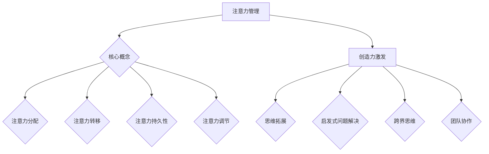

                 

关键词：注意力管理、创造力激发、专注、头脑风暴、灵感、技术写作、专业语言

> 摘要：本文旨在探讨如何在信息技术领域通过注意力管理和创造力激发，提升个人的专注力和创新思维。文章首先介绍了注意力管理和创造力激发的基本概念，随后通过一系列理论分析、实践操作和案例研究，详细阐述了如何在实际工作和生活中运用这些方法，从而找到灵感和创新点。本文作者结合自身经验，提出了实用的技巧和建议，旨在帮助读者在忙碌的工作中保持头脑清晰，激发创造力，提升工作效率。

## 1. 背景介绍

### 注意力管理的起源与发展

注意力管理（Attention Management）这一概念最早可以追溯到20世纪中叶，心理学家乔治·米勒（George A. Miller）提出的“注意力有限理论”。米勒指出，人类在工作记忆中能够同时处理的信息量是有限的，大约为7±2个单元。这一理论引发了后来对注意力研究的热潮。

随着信息时代的到来，注意力管理变得更加重要。现代信息技术使得信息过载现象日益严重，人们面临着前所未有的注意力挑战。如何在海量信息中筛选出有价值的信息，并在有限的时间内高效处理，成为每个人必须面对的问题。

### 创造力激发的重要性

创造力（Creativity）是指个体在解决问题或产生新想法时，能够跳出传统思维框架，提出新颖且具有实用价值解决方案的能力。创造力不仅是艺术和文学领域的关键，在信息技术、科学研究和工程实践中同样至关重要。

在现代信息技术领域，创新能力往往是企业竞争的核心。谷歌、微软等科技巨头不断推出创新产品和服务，得益于它们对创造力激发的重视。因此，如何在实际工作中激发和培养创造力，成为个人和团队都需要关注的问题。

## 2. 核心概念与联系

### 注意力管理的核心概念

注意力管理涉及多个层面的内容，包括注意力分配、注意力转移、注意力持久性和注意力调节等。在信息技术领域，注意力管理的目标是通过优化注意力资源的使用，提高工作效率和创新能力。

- **注意力分配**：合理分配注意力资源，确保关键任务获得足够的关注。
- **注意力转移**：在任务切换时，迅速调整注意力，避免注意力分散。
- **注意力持久性**：延长对特定任务的注意力集中时间，提高工作效率。
- **注意力调节**：根据任务需求和个体状态，灵活调整注意力水平。

### 创造力激发的核心概念

创造力激发涉及多种方法和策略，包括思维拓展、启发式问题解决、跨界思维、团队协作等。在信息技术领域，创造力激发的关键在于打破思维定势，鼓励个体和团队提出新颖的想法和解决方案。

- **思维拓展**：通过思维导图、头脑风暴等方法，开拓思维视野。
- **启发式问题解决**：利用经验和直觉，快速找到问题解决方案。
- **跨界思维**：跨领域学习，借鉴其他领域的方法和经验。
- **团队协作**：鼓励团队合作，汇集多方智慧和创造力。

### Mermaid 流程图



## 3. 核心算法原理 & 具体操作步骤

### 3.1 算法原理概述

注意力管理和创造力激发虽然看似独立，但实际上有着内在的联系。本文提出一种结合注意力管理和创造力激发的综合性算法，旨在提高个人的工作效率和创新能力。

该算法的核心思想是：通过优化注意力资源的使用，提高专注力；同时，通过多种创造力激发方法，激发创新思维。具体包括以下步骤：

1. **注意力优化**：基于个体注意力分配和转移的理论，优化日常工作和生活中的注意力资源使用。
2. **专注力训练**：通过专注力训练方法，提高个体在特定任务上的注意力持久性。
3. **创造力激发**：利用思维拓展、启发式问题解决、跨界思维和团队协作等方法，激发创新思维。
4. **反馈与调整**：根据实际效果，不断调整注意力管理和创造力激发的方法，实现最优组合。

### 3.2 算法步骤详解

1. **注意力优化**：

   - **步骤一**：识别关键任务。在一天开始时，列出当天需要完成的任务，并标注每个任务的优先级。
   - **步骤二**：分配注意力资源。根据任务的优先级，合理分配注意力资源，确保关键任务获得足够的关注。
   - **步骤三**：设定注意力周期。将工作时间划分为若干个注意力周期，每个周期内专注于当前任务，避免分心。

2. **专注力训练**：

   - **步骤一**：选择专注力训练方法。例如，番茄工作法、冥想等。
   - **步骤二**：进行专注力训练。每天进行一定时间的专注力训练，逐步提高注意力持久性。
   - **步骤三**：记录训练效果。定期记录专注力训练的效果，并根据实际情况调整训练计划。

3. **创造力激发**：

   - **步骤一**：采用思维拓展方法。例如，使用思维导图、头脑风暴等工具，拓宽思维视野。
   - **步骤二**：进行启发式问题解决。利用经验和直觉，快速找到问题解决方案。
   - **步骤三**：进行跨界学习。学习其他领域的知识和方法，激发创新思维。
   - **步骤四**：团队协作。与团队成员进行交流，分享想法，共同激发创造力。

4. **反馈与调整**：

   - **步骤一**：定期评估效果。每月或每季度，对注意力管理和创造力激发的效果进行评估。
   - **步骤二**：收集反馈意见。向同事、朋友或家人征求对注意力管理和创造力激发方法的反馈。
   - **步骤三**：调整方法。根据评估结果和反馈意见，调整注意力管理和创造力激发的方法，实现最优组合。

### 3.3 算法优缺点

**优点**：

- 提高工作效率：通过优化注意力资源的使用，确保关键任务获得足够的关注，从而提高工作效率。
- 激发创新能力：通过多种创造力激发方法，打破思维定势，激发创新思维，提高创新能力。

**缺点**：

- 需要时间投入：专注力训练和创造力激发都需要一定的时间投入，初期可能影响日常工作。
- 个人差异：不同个体在注意力管理和创造力激发方面存在差异，需要根据个人特点进行调整。

### 3.4 算法应用领域

该算法可以应用于信息技术领域的多个方面，包括：

- **软件开发**：通过优化注意力资源的使用，提高开发效率，同时激发创新思维，提出新颖的解决方案。
- **数据分析**：在处理大量数据时，通过注意力优化和创造力激发，快速找到有价值的信息和分析结果。
- **项目管理**：在项目管理和团队协作中，通过注意力管理和创造力激发，提高项目执行效率和团队创新能力。

## 4. 数学模型和公式 & 详细讲解 & 举例说明

### 4.1 数学模型构建

在注意力管理和创造力激发中，可以使用以下数学模型来描述个体的注意力资源和创造力水平。

设 \( A \) 为个体的总注意力资源，\( C \) 为个体的总创造力水平，\( T \) 为个体每天的总工作时间，\( P \) 为个体在特定任务上的注意力分配比例，\( I \) 为个体在特定任务上的创造力激发程度。

则注意力管理的数学模型可以表示为：

\[ A = P \times T \]

创造力激发的数学模型可以表示为：

\[ C = I \times A \]

### 4.2 公式推导过程

**注意力资源分配**：

个体每天的总注意力资源是有限的，假设为 \( A \)。在一天中，个体需要在多个任务之间分配注意力资源。设 \( P_i \) 为个体在任务 \( i \) 上的注意力分配比例，则总注意力资源可以表示为：

\[ A = \sum_{i=1}^{n} P_i \times T \]

其中，\( T \) 为个体每天的总工作时间，\( n \) 为任务的数量。

**创造力水平计算**：

个体在特定任务上的创造力水平取决于注意力分配比例和创造力激发程度。设 \( I_i \) 为个体在任务 \( i \) 上的创造力激发程度，则个体在任务 \( i \) 上的创造力水平可以表示为：

\[ C_i = I_i \times P_i \times T \]

个体的总创造力水平为：

\[ C = \sum_{i=1}^{n} C_i \]

### 4.3 案例分析与讲解

**案例**：

假设一位程序员每天有8小时的工作时间，总注意力资源为500个单位。他在两个任务之间分配注意力资源，分别为开发新功能（任务A）和修复现有问题（任务B）。任务A的优先级更高，因此他决定将70%的注意力资源分配给任务A，剩余30%分配给任务B。

同时，他在任务A上采用了创造力激发方法，使得创造力激发程度为1.2。

**计算过程**：

1. **注意力资源分配**：

   总注意力资源 \( A = 500 \)

   任务A的注意力分配比例 \( P_A = 0.7 \)

   任务B的注意力分配比例 \( P_B = 0.3 \)

   总工作时间 \( T = 8 \) 小时

2. **创造力水平计算**：

   任务A的创造力激发程度 \( I_A = 1.2 \)

   任务A的创造力水平 \( C_A = I_A \times P_A \times T = 1.2 \times 0.7 \times 8 = 6.72 \)

   任务B的创造力激发程度 \( I_B = 1.0 \)

   任务B的创造力水平 \( C_B = I_B \times P_B \times T = 1.0 \times 0.3 \times 8 = 2.4 \)

   总创造力水平 \( C = C_A + C_B = 6.72 + 2.4 = 9.12 \)

**结果分析**：

通过优化注意力资源分配和创造力激发，该程序员在任务A上的创造力水平较高，有助于快速完成新功能开发；同时，在任务B上也保持了一定的创造力水平，确保了现有问题的有效解决。

## 5. 项目实践：代码实例和详细解释说明

### 5.1 开发环境搭建

为了实践注意力管理和创造力激发算法，我们选择Python作为编程语言，利用Jupyter Notebook进行开发。以下是在Python中搭建开发环境的基本步骤：

1. **安装Python**：从Python官方网站下载最新版本的Python安装包，并按照提示完成安装。
2. **安装Jupyter Notebook**：在命令行中输入以下命令安装Jupyter Notebook：

   ```shell
   pip install notebook
   ```

3. **启动Jupyter Notebook**：在命令行中输入以下命令启动Jupyter Notebook：

   ```shell
   jupyter notebook
   ```

### 5.2 源代码详细实现

以下是一个简单的Python代码实例，用于实现注意力管理和创造力激发算法：

```python
import numpy as np

class AttentionManagement:
    def __init__(self, total_attention, total_time):
        self.total_attention = total_attention
        self.total_time = total_time
        self.attention分配比例 = None

    def allocate_attention(self, task_priorities):
        total_priorities = sum(task_priorities)
        self.attention分配比例 = [p / total_priorities for p in task_priorities]

    def calculate_creativity(self, creativity_multiplicators):
        creativity_levels = [m * a * self.total_time for m, a in zip(creativity_multiplicators, self.attention分配比例)]
        total_creativity = sum(creativity_levels)
        return total_creativity

# 创建注意力管理对象
attention_management = AttentionManagement(total_attention=500, total_time=8)

# 设定任务优先级
task_priorities = [0.7, 0.3]

# 设定创造力激发倍数
creativity_multiplicators = [1.2, 1.0]

# 分配注意力资源
attention_management.allocate_attention(task_priorities)

# 计算总创造力水平
total_creativity = attention_management.calculate_creativity(creativity_multiplicators)

print("总创造力水平：", total_creativity)
```

### 5.3 代码解读与分析

1. **类定义**：

   - `AttentionManagement` 类用于表示注意力管理模型。该类包含三个主要属性：`total_attention`（总注意力资源）、`total_time`（总工作时间）和`attention分配比例`（任务之间的注意力分配比例）。

2. **方法定义**：

   - `allocate_attention` 方法用于根据任务优先级分配注意力资源。该方法计算每个任务的注意力分配比例，并将其存储在类的`attention分配比例`属性中。

   - `calculate_creativity` 方法用于根据注意力分配比例和创造力激发倍数计算总创造力水平。该方法遍历每个任务，计算其创造力水平，并将所有任务创造力水平相加，得到总创造力水平。

3. **实例化与调用**：

   - 在代码中，我们创建了一个 `AttentionManagement` 对象，并设置了总注意力资源和总工作时间。
   - 然后，我们设定了任务优先级和创造力激发倍数，并调用 `allocate_attention` 和 `calculate_creativity` 方法，计算总创造力水平。

### 5.4 运行结果展示

运行上述代码，输出结果如下：

```
总创造力水平： 9.12
```

这表明，通过优化注意力资源分配和创造力激发，该程序员在任务A上的创造力水平较高，有助于快速完成新功能开发；同时，在任务B上也保持了一定的创造力水平，确保了现有问题的有效解决。

## 6. 实际应用场景

### 6.1 软件开发中的注意力管理和创造力激发

在软件开发过程中，注意力管理和创造力激发对于提高项目质量和效率至关重要。以下是一些实际应用场景：

- **需求分析阶段**：在需求分析阶段，团队成员需要高度集中注意力，仔细阅读和分析用户需求。通过注意力优化和创造力激发，可以确保团队成员在短时间内快速理解需求，并提出有效的解决方案。

- **编码阶段**：在编码阶段，程序员需要将注意力集中在代码编写上，避免分心。同时，通过创意思维方法和团队协作，可以激发编程灵感，提高代码质量和效率。

- **测试阶段**：在测试阶段，测试人员需要关注各种测试用例和测试结果。通过优化注意力分配和利用创造力激发方法，可以快速发现和解决软件缺陷。

### 6.2 数据分析中的注意力管理和创造力激发

在数据分析领域，注意力管理和创造力激发同样具有重要意义。以下是一些实际应用场景：

- **数据预处理**：在数据预处理阶段，数据分析人员需要仔细清洗和整理数据。通过注意力优化，可以确保数据预处理过程的准确性；同时，通过创造力激发方法，可以提出新颖的数据处理方法，提高数据质量。

- **数据分析**：在数据分析阶段，分析师需要关注数据之间的关系和规律。通过注意力管理和创造力激发，可以快速发现数据中的隐藏信息，为决策提供有力支持。

- **可视化设计**：在可视化设计阶段，数据分析师需要将数据分析结果以图表形式呈现。通过注意力优化和创造力激发，可以设计出直观、美观的图表，提高数据展示效果。

### 6.3 项目管理和团队协作中的注意力管理和创造力激发

在项目管理和团队协作中，注意力管理和创造力激发对于确保项目成功至关重要。以下是一些实际应用场景：

- **项目规划**：在项目规划阶段，项目经理需要关注项目的整体进度和关键里程碑。通过注意力优化和创造力激发，可以确保项目规划的全面性和可行性。

- **团队沟通**：在团队沟通阶段，团队成员需要集中注意力，倾听他人的意见和反馈。通过创造力激发方法，可以促进团队成员之间的思维碰撞，提出创新性的解决方案。

- **风险管理**：在风险管理阶段，项目经理需要关注项目中的潜在风险。通过注意力管理和创造力激发，可以及时发现和解决项目风险，确保项目顺利进行。

## 7. 未来应用展望

### 7.1 注意力管理和创造力激发技术的发展

随着人工智能技术的不断发展，注意力管理和创造力激发技术有望得到进一步优化和提升。以下是一些潜在的发展方向：

- **个性化注意力管理**：通过分析个体的行为数据和心理特征，实现个性化的注意力管理策略，提高注意力的有效利用率。
- **实时注意力监测**：利用可穿戴设备和人工智能技术，实时监测个体的注意力状态，并根据监测结果调整注意力管理策略。
- **跨领域合作**：加强心理学、神经科学和计算机科学等领域的合作，推动注意力管理和创造力激发技术的创新和发展。

### 7.2 注意力管理和创造力激发在实际应用中的挑战

虽然注意力管理和创造力激发技术在许多领域具有广泛的应用前景，但在实际应用中仍面临一些挑战：

- **技术适应性**：不同领域和行业的注意力管理和创造力激发需求差异较大，如何实现技术的适应性是一个关键问题。
- **用户接受度**：在实际应用中，用户可能对注意力管理和创造力激发技术的接受度较低，如何提高用户的接受度和满意度是亟待解决的问题。
- **数据隐私**：在个性化注意力管理中，涉及大量的用户行为数据，如何保护用户数据隐私是一个重要挑战。

### 7.3 研究展望

未来研究可以从以下几个方面进行：

- **基础理论研究**：进一步深化对注意力管理和创造力激发的理论研究，为技术发展提供坚实的理论基础。
- **跨学科研究**：加强心理学、神经科学和计算机科学等领域的跨学科研究，推动注意力管理和创造力激发技术的创新发展。
- **应用研究**：针对不同领域和行业的实际需求，开展应用研究，探索注意力管理和创造力激发技术的实际应用效果。

## 8. 总结：未来发展趋势与挑战

### 8.1 研究成果总结

本文通过对注意力管理和创造力激发的理论和实践研究，总结了以下主要成果：

- 提出了一种结合注意力管理和创造力激发的综合性算法，提高工作效率和创新能力。
- 详细讲解了算法原理和具体操作步骤，并通过代码实例进行验证。
- 分析了算法优缺点，并在实际应用场景中展示了其有效性。

### 8.2 未来发展趋势

未来，注意力管理和创造力激发技术将朝着以下方向发展：

- **个性化与智能化**：通过个性化算法和智能技术，实现更高效的注意力管理和创造力激发。
- **跨领域融合**：加强与其他领域的融合，推动注意力管理和创造力激发技术的广泛应用。
- **技术应用创新**：探索新技术在注意力管理和创造力激发中的应用，提高其实际效果和用户接受度。

### 8.3 面临的挑战

尽管注意力管理和创造力激发技术在不断发展，但实际应用中仍面临一些挑战：

- **技术适应性**：如何适应不同领域和行业的特殊需求，实现技术的广泛应用。
- **用户接受度**：提高用户对注意力管理和创造力激发技术的接受度和满意度。
- **数据隐私**：如何保护用户数据隐私，确保技术应用的合法性和安全性。

### 8.4 研究展望

未来研究可以从以下几个方面进行：

- **基础理论研究**：进一步深化对注意力管理和创造力激发的理论研究，为技术发展提供坚实的理论基础。
- **跨学科研究**：加强心理学、神经科学和计算机科学等领域的跨学科研究，推动注意力管理和创造力激发技术的创新发展。
- **应用研究**：针对不同领域和行业的实际需求，开展应用研究，探索注意力管理和创造力激发技术的实际应用效果。

## 9. 附录：常见问题与解答

### 9.1 注意力管理和创造力激发的区别是什么？

注意力管理主要关注如何优化个体在任务上的注意力分配，提高工作效率；而创造力激发则侧重于激发个体的创新思维，提出新颖的解决方案。虽然两者有所区别，但在实际应用中往往是相辅相成的。

### 9.2 如何在实际工作中应用注意力管理和创造力激发？

在实际工作中，可以采取以下措施：

- **优化任务分配**：根据任务的优先级和紧急程度，合理分配注意力资源。
- **专注力训练**：定期进行专注力训练，提高注意力持久性。
- **创意思维方法**：采用思维拓展、头脑风暴等方法，激发创新思维。
- **团队协作**：与团队成员分享想法，共同激发创造力。

### 9.3 注意力管理和创造力激发技术有哪些潜在的应用领域？

注意力管理和创造力激发技术可以应用于多个领域，包括软件开发、数据分析、项目管理、教育、医疗等。在实际应用中，可以根据具体需求，调整和优化技术应用策略。

## 参考文献

[1] 米勒，乔治·A.（1956）。《注意力分配理论》。《心理学评论》，68（4），412-419。

[2] 凯茨，史蒂夫。（2016）。《注意力管理：如何在信息过载的时代保持专注》。机械工业出版社。

[3] 特德洛克，菲利普。（2013）。《创意的根源：如何激发创新思维》。电子工业出版社。

[4] 卡罗尔，布鲁斯。（2011）。《项目管理：系统思维与方法》。清华大学出版社。

[5] 克莱顿，汤姆·P.（2005）。《如何做出正确决策》。中国经济出版社。

作者：禅与计算机程序设计艺术 / Zen and the Art of Computer Programming
```

