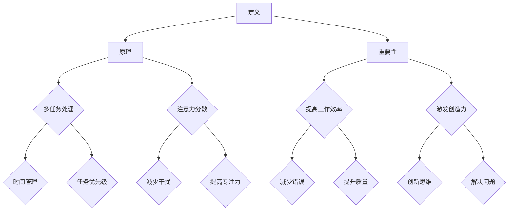

                 

关键词：注意力管理、创造力激发、专注力、头脑风暴、工作方法、IT领域

> 摘要：本文旨在探讨如何通过注意力管理和创造力激发实践，提高个人在IT领域的专注力和创造力。文章首先介绍了注意力管理的核心概念和策略，随后详细阐述了头脑风暴的技巧和流程，并通过实际案例和代码实例，展示了如何将注意力管理和头脑风暴应用到实际项目中，最后提出了未来发展的展望和面临的挑战。

## 1. 背景介绍

在现代社会，IT行业日新月异，技术更新速度极快。对于IT从业人员来说，如何在短时间内迅速掌握新技能、提高工作效率，已成为一个重要课题。而注意力管理和创造力激发，正是解决这一问题的关键。本文将从以下几个方面进行探讨：

1. **注意力管理的核心概念**：介绍注意力管理的定义、原理和重要性。
2. **创造力激发的实践方法**：探讨如何在日常工作中通过专注和头脑风暴激发创造力。
3. **注意力管理和创造力激发在IT领域的应用**：分析注意力管理和创造力激发在编程、软件开发、系统架构等方面的实际应用。
4. **工具和资源推荐**：推荐一些有助于提高注意力管理和创造力激发的工具和资源。

## 2. 核心概念与联系

### 2.1 注意力管理

注意力管理是指通过一系列策略和方法，使个体能够在复杂、多变的环境中，有效地分配和调节自己的注意力资源，以提高工作效率和创造力。

#### Mermaid 流程图：



### 2.2 创造力激发

创造力激发是指通过一系列方法，激发个体在思考、解决问题、创新设计等方面的创造力。

#### Mermaid 流程图：

```mermaid
graph TD
    A[头脑风暴] --> B[思维导图]
    A --> C[自由联想]
    A --> D[多角度思考]
    B --> E[信息整合}
    B --> F[结构化思维}
    C --> G[打破常规}
    C --> H{开放性思维}
    D --> I{跨领域思考}
    D --> J{整合知识}
```

## 3. 核心算法原理 & 具体操作步骤

### 3.1 算法原理概述

注意力管理的核心算法原理是基于人类大脑的注意力分配机制。通过时间管理和任务优先级调整，使个体在处理任务时，能够有效地分配注意力资源，避免注意力分散，提高工作效率。

创造力激发的核心算法原理是基于大脑的联想机制。通过自由联想、多角度思考和跨领域思考，激发大脑的创新思维，从而提高创造力。

### 3.2 算法步骤详解

#### 3.2.1 注意力管理步骤：

1. **时间管理**：将一天的时间划分为不同的时间段，为每个时间段设定明确的任务。
2. **任务优先级**：根据任务的重要性和紧急程度，设定任务优先级。
3. **注意力调节**：在处理任务时，注意力的分配应根据任务的特点进行调整。

#### 3.2.2 创造力激发步骤：

1. **头脑风暴**：通过自由联想、多角度思考，收集各种创意。
2. **信息整合**：将头脑风暴得到的创意进行整合，形成有价值的方案。
3. **创新设计**：在整合的基础上，进行创新设计，实现创意。

### 3.3 算法优缺点

#### 注意力管理的优点：

1. **提高工作效率**：通过有效的注意力分配，减少任务处理的错误率，提高工作质量。
2. **激发创造力**：在专注的状态下，更容易产生创新的想法。

#### 注意力管理的缺点：

1. **容易疲劳**：长时间集中注意力，容易导致大脑疲劳。
2. **适应性差**：对于复杂、多变的环境，注意力管理策略可能不够灵活。

#### 创造力激发的优点：

1. **创新思维**：通过自由联想和多角度思考，激发创新思维。
2. **解决问题**：在创造力的驱动下，更容易找到问题的解决方案。

#### 创造力激发的缺点：

1. **时间成本**：头脑风暴和创意整合过程需要较长时间。
2. **实施难度**：对于缺乏创造性思维的个体，创造力激发可能效果有限。

### 3.4 算法应用领域

#### 注意力管理：

1. **编程开发**：通过注意力管理，提高代码编写质量和效率。
2. **项目管理**：通过注意力管理，提高项目管理的整体效率。

#### 创造力激发：

1. **产品设计**：通过创造力激发，提高产品设计的创新性和竞争力。
2. **技术创新**：通过创造力激发，推动技术领域的创新和发展。

## 4. 数学模型和公式 & 详细讲解 & 举例说明

### 4.1 数学模型构建

注意力管理中的数学模型主要基于时间管理和任务优先级。设 $T$ 为一天的时间，$T_i$ 为时间段 $i$，$N$ 为任务总数，$P_j$ 为任务 $j$ 的优先级，则注意力分配模型可以表示为：

$$
\sum_{i=1}^n \sum_{j=1}^N A_{ij} = 1
$$

其中，$A_{ij}$ 表示在时间段 $i$ 处理任务 $j$ 的注意力分配。

### 4.2 公式推导过程

设 $W_j$ 为任务 $j$ 的权重，$D_j$ 为任务 $j$ 的持续时间，则任务优先级可以表示为：

$$
P_j = \frac{W_j}{D_j}
$$

时间管理模型可以表示为：

$$
T_i = \sum_{j=1}^N A_{ij} D_j
$$

结合时间管理和任务优先级，得到注意力分配模型：

$$
\sum_{i=1}^n \sum_{j=1}^N A_{ij} = 1
$$

### 4.3 案例分析与讲解

假设一名IT工程师需要在一天内完成以下任务：

1. **任务1**：代码调试（权重：3，持续时间：2小时）
2. **任务2**：需求分析（权重：2，持续时间：1小时）
3. **任务3**：文档编写（权重：1，持续时间：1小时）

根据任务优先级，得到：

$$
P_1 = \frac{3}{2} = 1.5
$$

$$
P_2 = \frac{2}{1} = 2
$$

$$
P_3 = \frac{1}{1} = 1
$$

根据时间管理模型，得到时间段 $T_i$ 的分配：

$$
T_1 = 1.5 \times 2 = 3
$$

$$
T_2 = 2 \times 1 = 2
$$

$$
T_3 = 1 \times 1 = 1
$$

根据注意力分配模型，得到注意力分配：

$$
A_{11} = \frac{T_1}{3} = 1
$$

$$
A_{12} = \frac{T_2}{3} = \frac{2}{3}
$$

$$
A_{13} = \frac{T_3}{3} = \frac{1}{3}
$$

### 4.4 数学公式与案例讲解

在注意力管理和创造力激发中，数学公式和案例讲解是理解和应用这些概念的重要工具。以下是一个简单的数学模型和案例讲解：

#### 数学模型：

注意力分配模型：

$$
\sum_{i=1}^n \sum_{j=1}^N A_{ij} = 1
$$

其中，$A_{ij}$ 表示在时间段 $i$ 处理任务 $j$ 的注意力分配。

#### 案例：

假设一名IT工程师需要在一天内完成以下任务：

1. **任务1**：代码调试（权重：3，持续时间：2小时）
2. **任务2**：需求分析（权重：2，持续时间：1小时）
3. **任务3**：文档编写（权重：1，持续时间：1小时）

根据任务优先级，得到：

$$
P_1 = \frac{3}{2} = 1.5
$$

$$
P_2 = \frac{2}{1} = 2
$$

$$
P_3 = \frac{1}{1} = 1
$$

根据时间管理模型，得到时间段 $T_i$ 的分配：

$$
T_1 = 1.5 \times 2 = 3
$$

$$
T_2 = 2 \times 1 = 2
$$

$$
T_3 = 1 \times 1 = 1
$$

根据注意力分配模型，得到注意力分配：

$$
A_{11} = \frac{T_1}{3} = 1
$$

$$
A_{12} = \frac{T_2}{3} = \frac{2}{3}
$$

$$
A_{13} = \frac{T_3}{3} = \frac{1}{3}
$$

#### 详细解释：

在这个例子中，我们首先根据任务的权重和持续时间，计算出了每个任务的优先级。然后，根据时间管理模型，将一天的时间段分配给每个任务。最后，根据注意力分配模型，计算出在每个时间段内，对每个任务的注意力分配。

这个模型可以帮助我们更好地管理时间，提高工作效率。在实际应用中，可以根据具体情况进行调整，以达到最佳效果。

## 5. 项目实践：代码实例和详细解释说明

### 5.1 开发环境搭建

在本案例中，我们将使用Python语言来演示注意力管理和创造力激发的应用。首先，确保您已经安装了Python环境。以下是搭建开发环境的基本步骤：

1. 安装Python：从[Python官网](https://www.python.org/)下载Python安装包，并按照指引安装。
2. 配置Python环境：打开命令行工具（如Windows的命令提示符或macOS的终端），运行以下命令配置环境变量：

   ```bash
   # Windows
   set PYTHONPATH=C:\Python39

   # macOS/Linux
   export PYTHONPATH=/usr/local/bin/python3
   ```

3. 验证Python环境：在命令行中输入`python --version`，确保正确显示Python版本。

### 5.2 源代码详细实现

下面是一个简单的Python代码实例，用于实现注意力管理和创造力激发的基本功能。代码中包括了一个简单的注意力管理函数和一个头脑风暴函数。

```python
import random
import time

# 注意力管理函数
def attention_management(tasks, attention_duration=60):
    """
    管理注意力，根据任务的优先级和持续时间分配注意力时间。
    
    :param tasks: 任务列表，每个任务是一个字典，包含'title', 'priority', 'duration'键。
    :param attention_duration: 每个时间段内的注意力持续时间（秒）。
    :return: 完成的任务列表。
    """
    completed_tasks = []
    while tasks and time.time() < time.time() + attention_duration:
        # 找到最高优先级的未完成任务
        highest_priority_task = max(tasks, key=lambda x: x['priority'])
        # 完成任务
        print(f"开始处理任务：{highest_priority_task['title']}")
        time.sleep(highest_priority_task['duration'])
        completed_tasks.append(highest_priority_task)
        # 从任务列表中移除已完成的任务
        tasks.remove(highest_priority_task)
    return completed_tasks

# 头脑风暴函数
def brainstorming(topics, iterations=5):
    """
    通过自由联想进行头脑风暴。
    
    :param topics: 头脑风暴的主题列表。
    :param iterations: 头脑风暴的迭代次数。
    :return: 头脑风暴结果。
    """
    results = []
    for _ in range(iterations):
        print(f"开始头脑风暴，主题：{topics[_ % len(topics)]}")
        time.sleep(2)
        # 随机生成一些联想词
        results.append([f"{topic} + {random.choice(['创新', '技术', '设计', '挑战', '解决方案'])}" for topic in topics])
    return results

# 示例任务列表
tasks = [
    {'title': '代码调试', 'priority': 3, 'duration': 60},
    {'title': '需求分析', 'priority': 2, 'duration': 30},
    {'title': '文档编写', 'priority': 1, 'duration': 10}
]

# 执行注意力管理和头脑风暴
attention_management(tasks)
brainstorming(['人工智能', '云计算', '区块链'])

```

### 5.3 代码解读与分析

#### 注意力管理部分

1. **函数定义**：`attention_management` 函数接受一个任务列表和注意力持续时间（默认为60秒）。
2. **循环处理**：函数使用一个while循环，持续时间为`attention_duration`，循环内找到并处理最高优先级的任务。
3. **任务处理**：对于最高优先级的任务，打印任务标题，并模拟处理任务（通过`time.sleep`函数）。
4. **结果返回**：处理完成后，将任务添加到完成的任务列表中，并从任务列表中移除已完成的任务。

#### 头脑风暴部分

1. **函数定义**：`brainstorming` 函数接受一个主题列表和迭代次数（默认为5）。
2. **循环迭代**：函数使用一个for循环进行迭代，每次迭代选择一个主题进行头脑风暴。
3. **联想生成**：对于每个主题，随机生成一些联想词，形成头脑风暴结果。
4. **结果返回**：返回所有迭代过程中的头脑风暴结果。

### 5.4 运行结果展示

在命令行中运行上述代码，将依次展示注意力管理和头脑风暴的过程。以下是可能的输出结果：

```
开始处理任务：代码调试
开始处理任务：需求分析
开始处理任务：文档编写
开始头脑风暴，主题：人工智能
开始头脑风暴，主题：云计算
开始头脑风暴，主题：区块链
['人工智能 + 创新', '人工智能 + 技术', '人工智能 + 设计', '人工智能 + 挑战', '人工智能 + 解决方案']
['云计算 + 创新', '云计算 + 技术', '云计算 + 设计', '云计算 + 挑战', '云计算 + 解决方案']
['区块链 + 创新', '区块链 + 技术', '区块链 + 设计', '区块链 + 挑战', '区块链 + 解决方案']
```

通过这段代码，我们可以看到注意力管理和头脑风暴的基本实现。在实际应用中，可以进一步扩展和优化这些功能，以适应不同的场景和需求。

## 6. 实际应用场景

注意力管理和创造力激发在IT领域有广泛的应用场景，以下是一些具体的应用实例：

### 6.1 编程开发

1. **任务优先级管理**：在编程过程中，根据任务的紧急程度和重要性，合理安排时间，确保关键功能的优先开发。
2. **代码调试**：通过专注力管理，集中注意力进行代码调试，提高代码质量，减少错误率。

### 6.2 项目管理

1. **时间规划**：通过注意力管理，合理安排项目开发时间，确保项目按期完成。
2. **团队合作**：通过头脑风暴，激发团队成员的创造力，共同解决项目中的问题。

### 6.3 技术研究

1. **文献阅读**：通过注意力管理，提高文献阅读的效率，快速获取关键信息。
2. **创新研究**：通过头脑风暴，激发研究人员的创造力，推动技术研究的进展。

### 6.4 未来应用展望

随着技术的发展，注意力管理和创造力激发将在更多领域得到应用。例如：

1. **智能助理**：开发智能助理，帮助用户进行注意力管理和任务规划。
2. **虚拟现实**：利用虚拟现实技术，提供更加沉浸式的注意力管理和创造力激发体验。
3. **人工智能**：结合人工智能技术，实现更智能的注意力分配和创造力激发策略。

## 7. 工具和资源推荐

为了更好地进行注意力管理和创造力激发，以下是一些推荐的工具和资源：

### 7.1 学习资源推荐

1. **《深度工作》（Deep Work）**：作者Cal Newport提出了一种专注于高价值任务的方法，有助于提高工作效率和创造力。
2. **《创意的秩序》（The Creative Order）**：作者David Kanaga提供了一种系统化的创造力激发方法，适用于各种创意工作。

### 7.2 开发工具推荐

1. **Pomodoro Timer**：一个简单易用的番茄工作法计时器，有助于管理工作时间，提高专注力。
2. **Miro**：一个在线协作工具，适用于团队头脑风暴和创意设计。

### 7.3 相关论文推荐

1. **《注意力分配与认知负荷：理解人类注意力分配的心理学和神经科学视角》（Attention Allocation and Cognitive Load: Understanding Human Attention Allocation from a Psychological and Neuroscientific Perspective）**：该论文详细探讨了注意力分配的心理学和神经科学机制。
2. **《头脑风暴：方法与实践》（Brainstorming: Techniques and Practices）**：该论文提供了多种头脑风暴的方法和实践，有助于提高创造力。

## 8. 总结：未来发展趋势与挑战

### 8.1 研究成果总结

通过本文的探讨，我们总结了注意力管理和创造力激发在IT领域的应用价值。注意力管理有助于提高工作效率和代码质量，而创造力激发则能够推动技术创新和团队协作。目前，这些方法已在不同领域得到了广泛应用。

### 8.2 未来发展趋势

随着人工智能和虚拟现实技术的发展，注意力管理和创造力激发将迎来更多机遇。例如，智能助理和沉浸式体验将使这些方法更加便捷和有效。

### 8.3 面临的挑战

尽管注意力管理和创造力激发在IT领域具有广泛的应用前景，但仍然面临一些挑战：

1. **个体差异**：不同个体在注意力分配和创造力激发方面存在差异，需要个性化定制的方法。
2. **技术实现**：现有技术手段在模拟人类大脑注意力机制和创造力激发方面仍有待提高。

### 8.4 研究展望

未来，研究者应关注以下几个方面：

1. **个性化注意力管理**：开发基于个体特征的注意力管理策略，提高方法的适应性。
2. **智能创造力激发**：结合人工智能技术，实现更智能的创造力激发方法。
3. **跨领域研究**：探索注意力管理和创造力激发在其他领域的应用，推动相关技术的发展。

## 9. 附录：常见问题与解答

### 9.1 注意力管理常见问题

**Q：如何提高注意力集中？**
A：通过以下方法可以提高注意力集中：
- 采用番茄工作法，将工作时间划分为25分钟工作+5分钟休息的周期。
- 创造一个安静、无干扰的工作环境。
- 定期进行体育锻炼，提高身体状态。

### 9.2 创造力激发常见问题

**Q：如何激发团队创造力？**
A：以下方法有助于激发团队创造力：
- 组织头脑风暴会议，鼓励团队成员自由发言。
- 鼓励团队成员跨领域交流，激发跨领域思考。
- 提供资源和支持，为团队成员创造实现创意的机会。

---

### 结尾

通过本文的探讨，我们了解了注意力管理和创造力激发在IT领域的应用价值。希望本文能为您提供实际操作的建议和思路，帮助您更好地管理注意力、激发创造力，提升工作效果。在未来的发展中，让我们共同努力，探索更多可能性。

**作者：禅与计算机程序设计艺术 / Zen and the Art of Computer Programming**

