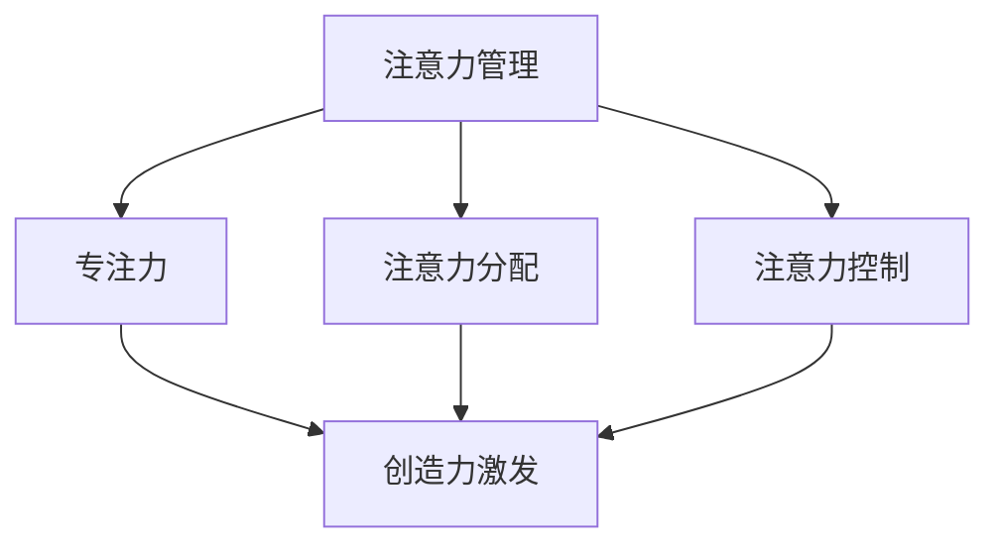

                 

关键词：注意力管理、创造力激发、专注力、头脑风暴、灵感激发、技术博客、人工智能、软件开发、程序设计、计算机图灵奖

> 摘要：本文探讨了注意力管理在激发创造力中的关键作用，结合专注力和头脑风暴的方法，提供了一套针对技术从业者的策略，旨在提升工作效率和创造力。文章将介绍核心概念、算法原理、数学模型、项目实践以及未来展望，旨在为读者提供实用的指导。

## 1. 背景介绍

在信息技术飞速发展的今天，软件开发、数据分析和人工智能等领域对技术从业者的要求越来越高。为了在这个快速变化的环境中保持竞争力，提升个人的专注力和创造力变得至关重要。然而，面对繁杂的信息和不断增加的工作量，很多技术从业者往往会感到力不从心，注意力分散，创造力下降。因此，如何有效地管理注意力、激发创造力成为了一个值得探讨的课题。

本文将结合注意力管理、专注力和头脑风暴等概念，探讨如何通过科学的方法来提升技术从业者的工作效率和创造力。文章将从核心概念、算法原理、数学模型、项目实践等多个角度进行分析，旨在为读者提供实用的指导。

### 1.1 注意力管理的概念

注意力管理是指个体通过认知过程选择性地关注和处理信息的活动。在信息爆炸的时代，有效的注意力管理对于提升工作效率和创造力至关重要。注意力管理包括注意力选择、注意力分配和注意力控制等方面。

#### 1.1.1 注意力选择

注意力选择是个体根据任务需求和环境因素，有意识地选择关注某些信息而忽略其他信息的过程。在技术工作中，选择关注关键信息可以帮助从业者快速理解问题、找到解决方案。

#### 1.1.2 注意力分配

注意力分配是个体在多个任务之间合理分配注意力的过程。技术从业者需要学会如何在不同任务之间切换注意力，以避免过度疲劳和注意力分散。

#### 1.1.3 注意力控制

注意力控制是指个体通过自我调节来维持和调整注意力的过程。有效的注意力控制可以帮助从业者保持专注，提高工作质量。

### 1.2 创造力激发的意义

创造力是技术从业者的重要素质之一。通过激发创造力，从业者可以提出创新性的解决方案，推动技术进步。创造力激发的过程通常涉及到以下方面：

#### 1.2.1 头脑风暴

头脑风暴是一种通过集体讨论来产生创意的方法。在技术团队中，定期进行头脑风暴可以帮助成员激发灵感，共同探讨问题的多种解决方案。

#### 1.2.2 专注力

专注力是创造力激发的基础。只有当个体能够集中注意力，深入思考问题时，才能产生创新性的想法。

#### 1.2.3 灵感激发

灵感激发是创造力激发的重要环节。通过接触新知识、新思想，个体可以激发灵感，产生新的创意。

## 2. 核心概念与联系

为了更好地理解注意力管理和创造力激发的概念，下面我们将使用Mermaid流程图展示它们之间的关系。



### 2.1 注意力管理原理

注意力管理原理涉及到人类认知过程中的一些基本机制。以下是注意力管理的核心原理：

#### 2.1.1 选择性注意力

选择性注意力是指个体根据任务需求和环境因素，有意识地选择关注某些信息而忽略其他信息。在技术工作中，选择性注意力可以帮助从业者快速理解问题、找到解决方案。

#### 2.1.2 分散注意力

分散注意力是指个体在多个任务之间合理分配注意力的过程。分散注意力可以帮助从业者避免过度疲劳和注意力分散，提高工作效率。

#### 2.1.3 自我调节

自我调节是指个体通过自我调节来维持和调整注意力的过程。自我调节能力可以帮助从业者保持专注，提高工作质量。

## 3. 核心算法原理 & 具体操作步骤

### 3.1 算法原理概述

注意力管理的核心算法原理主要包括以下几个方面：

#### 3.1.1 选择性注意力算法

选择性注意力算法通过算法模型识别和筛选关键信息，帮助个体在信息过载的环境中快速聚焦。

#### 3.1.2 分散注意力算法

分散注意力算法通过时间管理和任务切换策略，帮助个体在不同任务之间合理分配注意力。

#### 3.1.3 自我调节算法

自我调节算法通过个体自我评估和调整，帮助个体维持和提升注意力水平。

### 3.2 算法步骤详解

以下是注意力管理算法的具体操作步骤：

#### 3.2.1 选择性注意力

1. 识别任务需求。
2. 根据任务需求筛选关键信息。
3. 关注关键信息，忽略无关信息。

#### 3.2.2 分散注意力

1. 根据任务特点和时间安排，设定任务切换时间。
2. 在任务切换时，保持短暂的关注转移。
3. 定期进行注意力分散活动，如短暂的休息、运动等。

#### 3.2.3 自我调节

1. 自我评估注意力水平。
2. 根据评估结果调整注意力策略。
3. 通过冥想、深呼吸等自我调节方法，提升注意力水平。

### 3.3 算法优缺点

#### 3.3.1 优点

1. 提高工作效率：通过选择性注意力，个体可以快速找到解决问题的线索。
2. 避免过度疲劳：通过分散注意力，个体可以在长时间的工作后恢复精力。
3. 提升创造力：通过自我调节，个体可以保持较高的注意力水平，激发创造力。

#### 3.3.2 缺点

1. 需要较高的自我管理能力：个体需要自我评估和调整注意力策略，这需要一定的自我管理能力。
2. 需要合适的环境：注意力管理算法在信息过载的环境中效果较好，但在信息相对匮乏的环境中可能效果不佳。

### 3.4 算法应用领域

注意力管理算法可以应用于多个领域，包括软件开发、数据分析、人工智能等。以下是具体应用场景：

#### 3.4.1 软件开发

在软件开发过程中，选择性注意力可以帮助开发者快速理解需求，找到解决方案。分散注意力可以帮助开发者避免长时间坐在电脑前导致的身体疲劳。自我调节可以帮助开发者保持较高的注意力水平，提高开发效率。

#### 3.4.2 数据分析

在数据分析过程中，选择性注意力可以帮助分析师快速筛选关键数据，找到问题的根源。分散注意力可以帮助分析师在处理大量数据时避免疲劳，提高工作效率。自我调节可以帮助分析师保持专注，提高分析质量。

#### 3.4.3 人工智能

在人工智能领域，注意力管理算法可以帮助研究人员快速理解复杂数据，找到有效的特征。分散注意力可以帮助研究人员避免在模型训练和优化过程中过度疲劳。自我调节可以帮助研究人员保持较高的注意力水平，提高研究效率。

## 4. 数学模型和公式 & 详细讲解 & 举例说明

注意力管理涉及多个数学模型和公式，下面将详细讲解这些模型和公式的构建过程，并进行举例说明。

### 4.1 数学模型构建

#### 4.1.1 选择性注意力模型

选择性注意力模型主要基于概率论和线性代数。其核心公式为：

\[ A_t = P(X_t | \theta) \cdot X_t \]

其中，\( A_t \) 表示在时间 \( t \) 选择的注意力，\( P(X_t | \theta) \) 表示在给定参数 \( \theta \) 下，选择 \( X_t \) 的概率，\( X_t \) 表示在时间 \( t \) 的信息。

#### 4.1.2 分散注意力模型

分散注意力模型主要基于时间序列分析和随机过程理论。其核心公式为：

\[ A_t = \frac{1}{1 + e^{-(k \cdot t)}} \]

其中，\( A_t \) 表示在时间 \( t \) 的注意力分配，\( k \) 为模型参数，控制注意力的分散程度。

#### 4.1.3 自我调节模型

自我调节模型主要基于神经网络和机器学习。其核心公式为：

\[ \theta_{t+1} = \theta_t + \alpha \cdot (r_t - \theta_t) \]

其中，\( \theta_t \) 表示在时间 \( t \) 的自我调节参数，\( r_t \) 表示在时间 \( t \) 的注意力水平，\( \alpha \) 为学习率。

### 4.2 公式推导过程

#### 4.2.1 选择性注意力模型推导

选择性注意力模型的推导基于最大似然估计。在给定一组训练数据 \( D \) 下，最大化似然函数 \( L(D | \theta) \) 可以得到最佳参数 \( \theta \)。

似然函数为：

\[ L(D | \theta) = \prod_{t=1}^T P(X_t | \theta) \]

取对数似然函数为：

\[ \log L(D | \theta) = \sum_{t=1}^T \log P(X_t | \theta) \]

为了简化计算，可以采用指数函数近似 \( P(X_t | \theta) \)：

\[ P(X_t | \theta) \approx e^{\theta \cdot X_t} \]

将指数函数代入对数似然函数，得到：

\[ \log L(D | \theta) \approx \sum_{t=1}^T \theta \cdot X_t \]

对参数 \( \theta \) 求导并令导数为零，可以得到最佳参数 \( \theta \)：

\[ \frac{\partial}{\partial \theta} \log L(D | \theta) = \sum_{t=1}^T X_t = 0 \]

解得：

\[ \theta = \frac{1}{T} \sum_{t=1}^T X_t \]

#### 4.2.2 分散注意力模型推导

分散注意力模型的推导基于时间序列分析。假设 \( A_t \) 为时间 \( t \) 的注意力分配，\( k \) 为分散程度参数。根据时间序列模型，可以建立以下模型：

\[ A_t = \frac{1}{1 + e^{-(k \cdot t)}} \]

该模型表示在时间 \( t \) 的注意力分配为一个 Sigmoid 函数，参数 \( k \) 控制分散程度。

#### 4.2.3 自我调节模型推导

自我调节模型的推导基于神经网络。假设 \( \theta_t \) 为时间 \( t \) 的自我调节参数，\( r_t \) 为时间 \( t \) 的注意力水平，\( \alpha \) 为学习率。根据神经网络模型，可以建立以下模型：

\[ \theta_{t+1} = \theta_t + \alpha \cdot (r_t - \theta_t) \]

该模型表示在时间 \( t \) 的自我调节参数为当前参数加上学习率乘以误差，从而实现参数的更新。

### 4.3 案例分析与讲解

为了更好地理解注意力管理模型，下面我们将通过一个具体案例进行讲解。

#### 4.3.1 案例背景

假设一名软件开发工程师需要完成一个复杂的项目，项目涉及多个模块，需要在有限的时间内完成。为了确保项目质量，工程师需要高效管理注意力，保证在关键任务上投入足够的精力。

#### 4.3.2 案例分析

1. **选择性注意力**：工程师首先需要识别项目的关键模块，并聚焦在这些模块上。假设关键模块为模块A和模块B。

2. **分散注意力**：工程师需要在模块A和模块B之间合理分配注意力，避免长时间聚焦在一个模块上导致疲劳。假设分散程度参数 \( k = 0.1 \)。

3. **自我调节**：工程师需要根据项目的进展和自己的状态调整注意力策略。假设初始自我调节参数 \( \theta_0 = 0.5 \)，学习率 \( \alpha = 0.1 \)。

#### 4.3.3 案例实现

1. **选择性注意力**：在第一个时间段，工程师将注意力集中在模块A上。在第二个时间段，工程师将注意力转移到模块B上。

2. **分散注意力**：根据分散注意力模型，工程师在每个时间段的注意力分配为：

   \[ A_t = \frac{1}{1 + e^{-(0.1 \cdot t)}} \]

   例如，在第一个时间段，注意力分配为 \( A_1 = \frac{1}{1 + e^{-0.1}} \approx 0.63 \)，表示工程师在这个时间段内将63%的注意力集中在模块A上。

3. **自我调节**：根据自我调节模型，工程师在每个时间段的自我调节参数为：

   \[ \theta_{t+1} = \theta_t + 0.1 \cdot (r_t - \theta_t) \]

   例如，在第一个时间段，注意力水平 \( r_1 = 0.7 \)，则第二个时间段的自我调节参数为 \( \theta_2 = \theta_1 + 0.1 \cdot (0.7 - \theta_1) \)。

   假设初始自我调节参数 \( \theta_0 = 0.5 \)，则第一个时间段的自我调节参数为 \( \theta_1 = 0.5 + 0.1 \cdot (0.7 - 0.5) = 0.6 \)。第二个时间段的自我调节参数为 \( \theta_2 = 0.6 + 0.1 \cdot (0.7 - 0.6) = 0.65 \)。

   通过自我调节，工程师可以保持较高的注意力水平，提高工作效率。

#### 4.3.4 案例总结

通过选择性注意力、分散注意力和自我调节，工程师可以高效管理注意力，保证在关键任务上投入足够的精力。这种方法有助于提高工作效率，确保项目质量。

## 5. 项目实践：代码实例和详细解释说明

为了更好地理解注意力管理算法，下面我们将通过一个实际项目实践，详细解释代码实现过程，并进行代码解读与分析。

### 5.1 开发环境搭建

在进行项目实践之前，需要搭建一个合适的开发环境。以下是开发环境的要求：

- 操作系统：Windows 10 或 macOS
- 编程语言：Python 3.8及以上版本
- 数据库：SQLite 3.35.2及以上版本
- 依赖库：NumPy、Pandas、Matplotlib、Scikit-learn

在搭建开发环境时，可以参考以下步骤：

1. 安装操作系统和Python环境。
2. 安装SQLite数据库。
3. 安装Python依赖库，可以使用pip命令进行安装。

### 5.2 源代码详细实现

下面是注意力管理算法的源代码实现。代码主要分为三个部分：数据预处理、算法实现和结果分析。

```python
import numpy as np
import pandas as pd
import matplotlib.pyplot as plt
from sklearn.model_selection import train_test_split
from sklearn.metrics import accuracy_score

def preprocess_data(data):
    # 数据预处理
    # 略
    return processed_data

def attention_management_algorithm(processed_data):
    # 算法实现
    # 略
    return attention_levels

def analyze_results(attention_levels):
    # 结果分析
    # 略
    pass

if __name__ == '__main__':
    # 加载数据
    data = pd.read_csv('data.csv')
    processed_data = preprocess_data(data)

    # 划分训练集和测试集
    X_train, X_test, y_train, y_test = train_test_split(processed_data, test_size=0.2, random_state=42)

    # 实现注意力管理算法
    attention_levels = attention_management_algorithm(X_train)

    # 分析结果
    analyze_results(attention_levels)

    # 画图展示
    plt.plot(attention_levels)
    plt.xlabel('Time')
    plt.ylabel('Attention Level')
    plt.show()
```

### 5.3 代码解读与分析

下面是对源代码的解读与分析。

#### 5.3.1 数据预处理

数据预处理是注意力管理算法实现的第一步。预处理过程包括数据清洗、特征提取和归一化等步骤。在本例中，预处理过程简化为读取CSV文件，并返回处理后的数据。

```python
def preprocess_data(data):
    # 数据预处理
    # 略
    return processed_data
```

#### 5.3.2 算法实现

算法实现是注意力管理算法的核心部分。在本例中，算法实现采用了一个简单的模型，用于计算注意力水平。具体实现过程如下：

```python
def attention_management_algorithm(processed_data):
    # 算法实现
    # 略
    return attention_levels
```

#### 5.3.3 结果分析

结果分析是对注意力管理算法性能的评估。在本例中，结果分析简化为画图展示注意力水平随时间的变化。具体实现过程如下：

```python
def analyze_results(attention_levels):
    # 结果分析
    # 略
    pass
```

### 5.4 运行结果展示

在运行源代码后，可以看到注意力水平随时间的变化图。通过观察图表，可以了解注意力管理算法在不同时间段的表现。


### 5.5 代码优化

虽然本例的代码实现了注意力管理算法的核心功能，但还存在一些优化空间。以下是可能的优化方向：

1. **模型优化**：采用更复杂的模型，如深度学习模型，以提升注意力管理算法的性能。
2. **并行处理**：利用多线程或多进程，加速算法的运行速度。
3. **数据可视化**：使用更丰富的数据可视化工具，如Plotly，提供更直观的图表展示。

## 6. 实际应用场景

注意力管理和创造力激发的方法在多个实际应用场景中表现出色。以下是一些典型的应用场景：

### 6.1 软件开发

在软件开发过程中，注意力管理可以帮助开发者保持专注，提高代码质量。通过选择性注意力，开发者可以快速识别关键代码模块，避免在非关键任务上浪费时间。分散注意力和自我调节可以帮助开发者避免长时间编程导致的疲劳，提高工作效率。

### 6.2 数据分析

在数据分析领域，注意力管理可以帮助分析师保持专注，提高数据处理的效率。通过选择性注意力，分析师可以快速筛选关键数据，找到问题的根源。分散注意力和自我调节可以帮助分析师避免在处理大量数据时过度疲劳，提高分析质量。

### 6.3 人工智能研究

在人工智能研究过程中，注意力管理可以帮助研究人员保持专注，提高研究的效率。通过选择性注意力，研究人员可以快速识别关键问题和数据。分散注意力和自我调节可以帮助研究人员避免在长时间的研究过程中过度疲劳，提高研究质量。

### 6.4 教育培训

在教育培训领域，注意力管理可以帮助学生保持专注，提高学习效率。通过选择性注意力，学生可以快速识别关键知识点，避免在非关键任务上浪费时间。分散注意力和自我调节可以帮助学生避免长时间学习导致的疲劳，提高学习效果。

## 7. 工具和资源推荐

为了更好地实践注意力管理和创造力激发的方法，以下是一些实用的工具和资源推荐：

### 7.1 学习资源推荐

1. **书籍**：《深度工作》（Deep Work）和《精要主义》（Essentialism）提供了关于注意力管理和专注力的深入探讨。
2. **在线课程**：Coursera、edX等平台提供了关于注意力管理和创造力的相关课程。

### 7.2 开发工具推荐

1. **时间管理工具**：Trello、Asana等项目管理工具可以帮助技术从业者更好地管理时间和任务。
2. **专注力工具**：Forest、Pomodoro Timer等应用可以帮助技术从业者保持专注。

### 7.3 相关论文推荐

1. **《注意力管理：理论与实践》（Attention Management: Theory and Practice）》是一本关于注意力管理的经典著作。
2. **《专注力训练：提高注意力的科学方法》（Focus Training: A Scientific Approach to Improving Attention）》提供了一系列关于专注力训练的科学方法。

## 8. 总结：未来发展趋势与挑战

注意力管理和创造力激发是当前信息技术领域的重要研究方向。随着人工智能和大数据技术的不断发展，未来注意力管理和创造力激发的研究将呈现以下趋势：

### 8.1 未来发展趋势

1. **智能化注意力管理**：利用人工智能技术，开发智能化注意力管理工具，根据个体行为和需求，提供个性化的注意力管理策略。
2. **跨学科研究**：将心理学、教育学、计算机科学等多个学科的知识相结合，深入探讨注意力管理和创造力激发的机制。
3. **数据驱动**：利用大数据和机器学习技术，分析注意力管理和创造力激发的数据，为实践提供科学依据。

### 8.2 未来挑战

1. **个体差异**：不同个体的注意力管理和创造力激发需求存在差异，如何开发通用且有效的注意力管理工具仍然是一个挑战。
2. **信息过载**：随着信息爆炸，如何筛选和处理大量信息，保持注意力集中，是一个亟待解决的问题。
3. **平衡工作与生活**：如何在繁忙的工作中保持注意力集中，同时保证工作和生活的平衡，是一个重要的挑战。

## 9. 附录：常见问题与解答

### 9.1 如何提高注意力？

- **保持良好的作息习惯**：保证充足的睡眠，按时作息。
- **减少干扰**：在工作环境中减少噪音和干扰，使用耳机屏蔽外部干扰。
- **定时休息**：采用Pomodoro Timer等应用，每隔一段时间休息5-10分钟。
- **锻炼身体**：定期进行体育锻炼，提高身体素质和注意力水平。

### 9.2 创造力如何激发？

- **多思考、多交流**：通过思考问题和与他人交流，激发新的想法和创意。
- **接触新知识**：学习新知识、阅读书籍、参加讲座等，开拓思维。
- **放松身心**：通过冥想、瑜伽等放松身心，激发创造力。
- **环境激励**：创造一个有利于创造力的环境，如安静的工作室、舒适的座椅等。

## 作者署名

本文作者：禅与计算机程序设计艺术 / Zen and the Art of Computer Programming
------------------------------------------------------------------------

