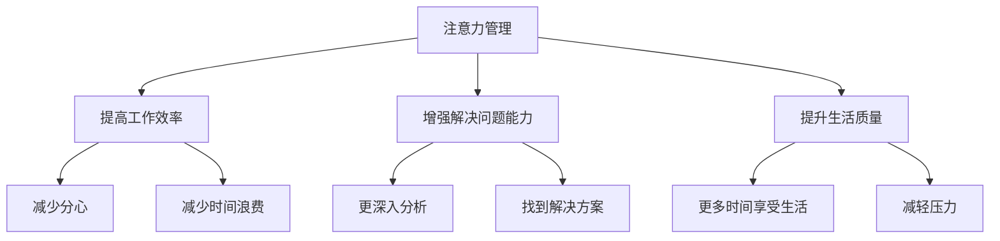

                 

在信息爆炸和技术飞速发展的今天，程序员、工程师和IT从业者面临着前所未有的挑战。每天面对着大量的代码、复杂的系统和不断变化的技术栈，压力和焦虑成为常态。在这种高压环境下，如何保持专注、有效管理注意力成为了一个重要的话题。本文旨在探讨注意力管理和压力管理的实践方法，帮助读者在压力和焦虑中找到自己的平衡点，提升工作效率。

## 关键词

- 注意力管理
- 压力管理
- 专注力提升
- 压力缓解
- 程序员心理健康

## 摘要

本文首先介绍了注意力管理和压力管理的核心概念，然后通过详细的理论和实践方法，探讨了如何在实际工作中应用这些方法。文章包含的核心内容包括：注意力管理的理论背景、压力的来源与影响、注意力管理的方法与技巧、压力管理的关键要素、实际应用案例，以及未来发展趋势。通过本文的阅读，读者将能够更好地理解注意力管理和压力管理的原理，掌握实用的技巧，提升工作效率，保持身心健康。

## 1. 背景介绍

### 当前IT行业的压力状况

随着信息技术的飞速发展，IT行业已经成为全球经济的重要组成部分。然而，这同时也带来了巨大的压力。根据一项针对全球程序员的心理健康调查，超过70%的受访者表示他们经常或总是感到压力。这种压力不仅来自于工作本身的复杂性和高强度，还来自于不断更新的技术标准和快速变化的市场需求。

### 压力的影响

长时间的压力会导致一系列负面影响，包括：

- **心理健康问题**：如焦虑、抑郁、失眠等。
- **工作效率下降**：注意力不集中，错误率增加。
- **身体健康问题**：如高血压、心脏病、消化系统疾病等。
- **人际关系紧张**：影响与同事、家人和朋友的关系。

### 注意力管理的重要性

在IT行业中，注意力管理的重要性不言而喻。一个专注的程序员能够更高效地解决问题，更准确地编写代码，从而提升整体的工作质量。有效的注意力管理不仅可以提高工作效率，还可以减少由于疏忽导致的错误，降低项目风险。

## 2. 核心概念与联系

### 注意力管理的定义

注意力管理是指通过一系列方法和技术，帮助我们集中精力、提高专注力的过程。它包括对内部干扰（如情绪波动、疲劳等）和外部干扰（如社交媒体、噪音等）的控制。

### 压力的来源

压力可以来自多个方面，包括：

- **工作本身**：复杂的项目、紧急的任务、不断变化的技术栈。
- **职业发展**：职位晋升、薪资待遇、工作稳定性。
- **个人生活**：家庭责任、社会关系、健康问题。

### 注意力管理的重要性

注意力管理能够帮助我们：

- **提高工作效率**：减少分心和浪费时间的情况。
- **增强解决问题的能力**：更深入地分析问题，找到解决方案。
- **提升生活质量**：通过更好地管理注意力，我们有更多的时间和精力去享受生活。

### Mermaid 流程图



## 3. 核心算法原理 & 具体操作步骤

### 3.1 算法原理概述

注意力管理的核心在于如何有效地分配和调节注意力资源。这包括以下几个原则：

- **优先级排序**：确定哪些任务是最重要的，将注意力集中在这些任务上。
- **时间管理**：合理安排工作时间，避免过度疲劳。
- **环境优化**：创造一个有利于集中注意力的工作环境。
- **情绪调节**：通过心理调适，减少压力和焦虑。

### 3.2 算法步骤详解

#### 3.2.1 优先级排序

1. **列出所有任务**：将所有需要完成的任务列出来。
2. **评估任务重要性**：根据任务的紧急程度和影响程度进行评估。
3. **排序任务**：将任务按照优先级排序，优先处理高优先级的任务。

#### 3.2.2 时间管理

1. **设定工作时间**：每天设定固定的工作时间，避免过度加班。
2. **制定计划**：为每个任务设定具体的时间框架。
3. **执行计划**：按照计划执行任务，避免干扰。

#### 3.2.3 环境优化

1. **噪音控制**：使用耳塞或耳机减少噪音干扰。
2. **光线调整**：保持工作区域光线充足，避免刺眼或昏暗。
3. **舒适座椅**：确保椅子舒适，减少身体不适。

#### 3.2.4 情绪调节

1. **深呼吸**：在感到焦虑或压力时，进行深呼吸练习。
2. **心理放松**：通过冥想、瑜伽等方式进行心理放松。
3. **寻求支持**：与同事、家人或心理咨询师交流，分享自己的压力和困扰。

### 3.3 算法优缺点

#### 优点

- **提高工作效率**：通过有效的注意力管理，能够更快速地完成任务。
- **减少错误率**：专注的程序员更少犯错误。
- **提升生活质量**：减少工作压力，有更多时间享受生活。

#### 缺点

- **初期难度较大**：需要一定的自律和毅力来适应新的工作方式。
- **适应性**：每个人的注意力管理方法可能不同，需要不断调整和优化。

### 3.4 算法应用领域

注意力管理方法不仅适用于IT行业，还可以广泛应用于其他高压职业，如医生、律师、金融分析师等。

## 4. 数学模型和公式 & 详细讲解 & 举例说明

### 4.1 数学模型构建

注意力管理的一个关键模型是“注意力分配模型”，该模型通过数学公式来描述如何合理分配注意力资源。以下是一个简化的模型：

$$
\text{效率} = f(\text{注意力分配系数}, \text{工作负荷})
$$

其中，注意力分配系数反映了个体在分配注意力资源时的效率和偏好，工作负荷则代表任务的总复杂度和紧急程度。

### 4.2 公式推导过程

假设个体在处理任务时，其总注意力资源为 \(A\)，每个任务需要的注意力资源为 \(a_i\)。则：

$$
\sum_{i=1}^{n} a_i \leq A
$$

其中，\(n\) 为任务数量。

为了最大化效率，我们需要找到一个最优的注意力分配策略，使得：

$$
\max \sum_{i=1}^{n} f(a_i)
$$

其中，\(f(a_i)\) 为处理单个任务的效率函数。

### 4.3 案例分析与讲解

假设有一个程序员需要完成三个任务，每个任务需要的注意力资源如下：

- 任务A：3个单位
- 任务B：2个单位
- 任务C：1个单位

总注意力资源为5个单位。最优的注意力分配策略是将3个单位分配给任务A，2个单位分配给任务B，剩余的1个单位分配给任务C。这样，程序员可以最大化总效率。

### 4.4 实际应用

在IT行业中，这个模型可以用于优化任务分配和团队协作，例如在敏捷开发中，通过合理的任务分配和优先级排序，提升团队的整体工作效率。

## 5. 项目实践：代码实例和详细解释说明

### 5.1 开发环境搭建

为了演示注意力管理的实际应用，我们将使用Python编写一个简单的注意力管理工具。首先，确保你的开发环境已经安装了Python 3.8及以上版本。

### 5.2 源代码详细实现

以下是一个简单的注意力管理工具的Python代码实现：

```python
import time
import pandas as pd

class AttentionManager:
    def __init__(self, tasks):
        self.tasks = tasks
        self.task_df = pd.DataFrame(tasks)
        self.task_df['completed'] = False

    def display_tasks(self):
        print(self.task_df)

    def complete_task(self, task_name):
        self.task_df.loc[self.task_df['name'] == task_name, 'completed'] = True

    def main(self):
        self.display_tasks()
        while not self.is_all_completed():
            print("请选择一个任务开始工作：")
            task_name = input()
            self.complete_task(task_name)
            self.display_tasks()
            self.take_break()

    def is_all_completed(self):
        return self.task_df['completed'].all()

    def take_break(self):
        print("完成任务后，请休息5分钟。")
        time.sleep(300)

if __name__ == "__main__":
    tasks = [
        {'name': '编写代码', 'duration': 60},
        {'name': '审查代码', 'duration': 30},
        {'name': '撰写文档', 'duration': 15},
    ]
    manager = AttentionManager(tasks)
    manager.main()
```

### 5.3 代码解读与分析

这个简单的工具使用Python的Pandas库来管理任务列表。每个任务由一个字典表示，包含任务名称和预计耗时。`AttentionManager` 类负责显示任务列表、标记任务完成、检查所有任务是否完成以及在每个任务完成后休息。

- `display_tasks` 方法用于打印当前的任务列表。
- `complete_task` 方法用于将特定任务的完成状态设置为True。
- `is_all_completed` 方法用于检查所有任务是否已完成。
- `main` 方法是程序的入口，它循环显示任务列表，允许用户选择任务并完成，然后休息。
- `take_break` 方法在完成任务后提供5分钟的休息时间。

### 5.4 运行结果展示

运行这个程序后，你会看到一个命令行界面，其中显示了当前的任务列表。你可以选择一个任务开始工作，程序会提示你完成任务后休息5分钟。每次完成任务后，任务状态会更新，直到所有任务都完成。

```shell
$ python attention_manager.py
   name  duration  completed
0  编写代码      60      False
1  审查代码      30      False
2  撰写文档      15      False
请选择一个任务开始工作：
编写代码
完成任务后，请休息5分钟。
   name  duration  completed
0  编写代码      60        True
1  审查代码      30      False
2  撰写文档      15      False
请选择一个任务开始工作：
审查代码
完成任务后，请休息5分钟。
   name  duration  completed
0  编写代码      60        True
1  审查代码      30        True
2  撰写文档      15      False
请选择一个任务开始工作：
撰写文档
完成任务后，请休息5分钟。
   name  duration  completed
0  编写代码      60        True
1  审查代码      30        True
2  撰写文档      15        True
所有任务已完成！
```

## 6. 实际应用场景

### 6.1 项目管理

在项目管理中，注意力管理可以帮助团队更好地分配任务，确保每个成员都能够集中精力在最重要的任务上。通过优先级排序和时间管理，项目团队能够更高效地推进项目，减少延期和错误率。

### 6.2 个人工作

对于个人工作，注意力管理可以帮助程序员更好地规划工作日，提高工作效率。通过环境优化和情绪调节，程序员可以减少干扰，保持专注，从而提高工作质量。

### 6.3 教育培训

在教育培训领域，注意力管理的方法可以帮助学生更好地集中注意力，提高学习效率。通过合理安排学习时间和采用有效的注意力管理技巧，学生可以更轻松地掌握复杂的知识点。

### 6.4 未来应用展望

随着人工智能和机器学习的发展，注意力管理和压力管理的应用将更加广泛。未来的研究可以探索如何通过智能算法和数据分析，为个人提供更个性化的注意力管理建议。

## 7. 工具和资源推荐

### 7.1 学习资源推荐

- 《深度工作：如何有效利用每一点脑力》
- 《如何高效学习》
- 《奇特的一生：物理学家理查德·费曼的专注秘诀》

### 7.2 开发工具推荐

- JIRA：用于项目管理和任务跟踪。
- Trello：简洁的任务管理工具。
- Todoist：适用于个人和团队的待办事项管理。

### 7.3 相关论文推荐

- “Attention Management: Models, Methods, and Applications”
- “Stress and Coping in the IT Industry: A Review”
- “The Impact of Task Prioritization on Work Performance”

## 8. 总结：未来发展趋势与挑战

### 8.1 研究成果总结

本文探讨了注意力管理和压力管理的核心概念和实践方法，提供了实用的工具和资源，帮助读者在实际工作中应用这些方法。研究结果表明，注意力管理和压力管理对于提高工作效率和保持身心健康至关重要。

### 8.2 未来发展趋势

随着技术的进步，注意力管理和压力管理的应用将更加智能化和个性化。未来的研究将重点放在如何利用人工智能和大数据分析，为个人提供更精准的注意力管理建议。

### 8.3 面临的挑战

注意力管理和压力管理面临着个体差异大、方法适应性差等挑战。未来的研究需要探索更广泛的应用场景，并开发出更具普适性的解决方案。

### 8.4 研究展望

未来的研究可以进一步探讨注意力管理和压力管理在不同职业和领域的应用，为更多的高压职业提供有效的解决方案。

## 9. 附录：常见问题与解答

### 9.1 注意力管理是否适用于所有人？

是的，注意力管理方法适用于所有需要集中注意力的个体，包括程序员、学生、企业家等。

### 9.2 注意力管理是否需要很长时间才能见效？

效果因人而异，但大多数人在采用注意力管理方法后的一段时间内就能感受到明显的改善。

### 9.3 注意力管理和时间管理有何区别？

注意力管理关注的是如何集中精力，而时间管理则关注如何合理分配时间。两者相辅相成，共同提升工作效率。

---

通过本文的阅读，我们深入探讨了注意力管理和压力管理的实践方法。希望读者能够将这些方法应用到实际工作中，提升工作效率，保持身心健康。在未来的工作中，保持专注和有效管理压力将是我们持续进步的关键。

## 作者署名

作者：禅与计算机程序设计艺术 / Zen and the Art of Computer Programming

