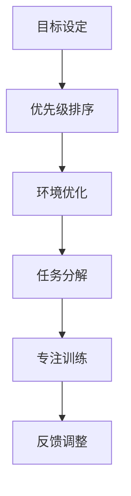
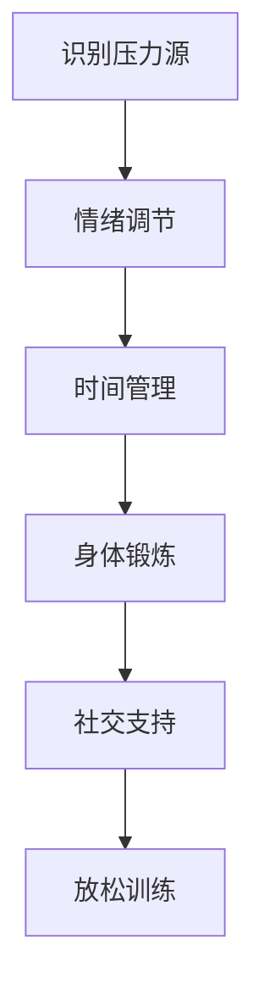
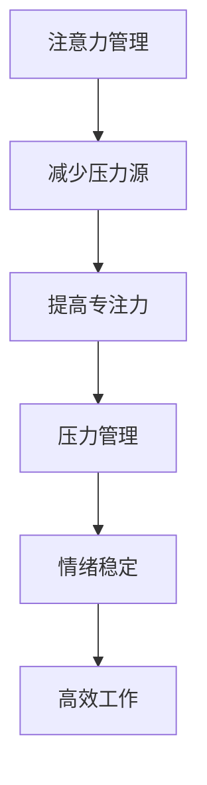

                 

 **关键词**：注意力管理、压力管理、专注、技术实践、心理健康

**摘要**：本文旨在探讨注意力管理与压力管理在实际生活中的应用，特别是在技术领域的工作环境中。通过深入分析注意力管理和压力管理的基本原理，结合实际案例，提供实用的方法和技巧，帮助读者在高压环境中保持专注，提高工作效率，同时促进个人心理健康。

## 1. 背景介绍

在信息技术高速发展的今天，程序员和工程师们面临着前所未有的工作压力。不断更新的技术、项目交付的时间紧迫性、团队协作的复杂性，以及个人职业发展的压力，使得许多技术从业者感到身心疲惫。注意力分散和压力过大成为普遍问题，直接影响工作效率和个人幸福感。

因此，本文将围绕注意力管理和压力管理展开讨论，结合最新的研究成果和实际经验，提供一套有效的策略和技巧，帮助技术从业者更好地应对工作压力，提高专注力，从而实现工作与生活的平衡。

### 注意力管理的重要性

注意力管理是指个体在执行任务时，合理分配和调控注意力的过程。在技术领域，高效率的注意力管理对于解决问题、创新思维和完成项目至关重要。以下是注意力管理的重要性：

- **提高工作效率**：专注力强的人能够更高效地完成任务，减少时间浪费。
- **促进创新思维**：注意力集中的状态下，更容易产生新想法和解决方案。
- **减轻工作压力**：注意力分散往往导致工作压力增大，有效的注意力管理有助于缓解这一问题。

### 压力管理的必要性

压力管理是指通过一系列方法来应对和减轻工作、生活压力的过程。在技术行业，长期处于高压环境中，会导致以下问题：

- **身心健康受损**：长期压力可能导致焦虑、抑郁等心理健康问题。
- **工作效率下降**：压力过大时，个体难以集中注意力，工作效率降低。
- **人际关系紧张**：工作压力可能导致与同事、上级的关系紧张，影响团队合作。

因此，有效的压力管理对于技术从业者的长期职业发展和个人幸福至关重要。

## 2. 核心概念与联系

### 注意力管理的基本原理

注意力管理涉及多个层面的理论和实践，以下是一个简化的 Mermaid 流程图，描述注意力管理的基本原理和流程。



### 压力管理的基本原理

压力管理同样包括多个层面的方法和策略。以下是一个简化的 Mermaid 流程图，描述压力管理的基本原理和流程。



### 注意力管理与压力管理的联系

注意力管理和压力管理密切相关。有效的注意力管理可以减少压力源的影响，而有效的压力管理有助于提高注意力集中的质量。以下是一个简化的 Mermaid 流程图，展示注意力管理与压力管理之间的联系。



## 3. 核心算法原理 & 具体操作步骤

### 3.1 算法原理概述

注意力管理与压力管理可以看作是一个迭代的算法过程，其目标是通过不断调整策略和技巧，达到最佳的工作效率和心理健康状态。以下是该算法的基本原理：

1. **目标设定**：明确当前阶段的工作目标和优先级。
2. **优先级排序**：根据目标的重要性，对任务进行排序。
3. **环境优化**：创造有利于专注的工作环境，减少干扰因素。
4. **任务分解**：将大任务分解为小任务，逐一完成。
5. **专注训练**：通过练习提高专注力。
6. **反馈调整**：根据实际效果调整策略和技巧。

### 3.2 算法步骤详解

1. **目标设定**

   - 确定当前阶段的主要目标。
   - 将目标具体化，明确完成标准。

2. **优先级排序**

   - 使用“重要紧急矩阵”对任务进行分类。
   - 优先处理重要且紧急的任务。

3. **环境优化**

   - 选择一个安静、光线适宜的工作环境。
   - 避免多任务处理，专注于单一任务。

4. **任务分解**

   - 将大任务分解为小任务。
   - 为每个小任务设定明确的完成时间和目标。

5. **专注训练**

   - 使用番茄工作法提高专注力。
   - 定期进行冥想和深呼吸练习。

6. **反馈调整**

   - 记录每天的工作情况和心理状态。
   - 根据反馈调整策略和技巧。

### 3.3 算法优缺点

**优点**：

- **提高工作效率**：通过优化任务流程，减少无效工作时间。
- **促进心理健康**：通过专注训练和压力管理，减轻工作压力。
- **灵活调整**：根据个人情况和任务特点，灵活调整策略。

**缺点**：

- **初期调整成本高**：需要一定时间来适应新的工作方法和技巧。
- **需要持续努力**：保持注意力管理和压力管理的持续性是关键。

### 3.4 算法应用领域

注意力管理和压力管理适用于所有需要高效率和良好心理状态的工作场景，特别是在技术领域。以下是一些应用领域：

- **软件开发**：提高编码效率，减少错误率。
- **项目管理**：优化项目进度，提高团队协作效果。
- **技术研究**：集中精力进行深入研究和创新。

## 4. 数学模型和公式 & 详细讲解 & 举例说明

### 4.1 数学模型构建

注意力管理和压力管理的数学模型可以看作是一个动态优化问题，其目标是最小化压力值，最大化工作效率。以下是一个简化的数学模型：

$$
\begin{aligned}
\min \ Z &= f(\text{注意力分配}, \text{压力管理策略}) \\
s.t. \ \ G(\text{任务完成度}) &= C(\text{资源限制}) \\
\end{aligned}
$$

其中，$Z$ 表示总压力值，$f$ 表示压力函数，$\text{注意力分配}$ 和 $\text{压力管理策略}$ 是决策变量，$G$ 表示任务完成度函数，$C$ 表示资源限制函数。

### 4.2 公式推导过程

压力函数 $f(\text{注意力分配}, \text{压力管理策略})$ 可以表示为：

$$
f(x, y) = \sum_{i=1}^{n} w_i \cdot p_i \cdot (1 - \frac{t_i}{T_i})
$$

其中，$w_i$ 表示任务 $i$ 的权重，$p_i$ 表示任务 $i$ 的紧急程度，$t_i$ 表示任务 $i$ 的完成时间，$T_i$ 表示任务 $i$ 的截止时间。

任务完成度函数 $G(\text{任务完成度})$ 可以表示为：

$$
G(\text{任务完成度}) = \sum_{i=1}^{n} \frac{t_i}{T_i}
$$

资源限制函数 $C(\text{资源限制})$ 可以表示为：

$$
C(\text{资源限制}) = \sum_{i=1}^{n} r_i \cdot (1 - \frac{t_i}{T_i})
$$

其中，$r_i$ 表示任务 $i$ 需要的资源量。

### 4.3 案例分析与讲解

假设一个软件开发团队有5个任务，每个任务的权重、紧急程度、完成时间和资源需求如下表：

| 任务 | 权重 $w_i$ | 紧急程度 $p_i$ | 完成时间 $t_i$ | 资源需求 $r_i$ |
|------|------------|----------------|----------------|----------------|
| A    | 0.3        | 0.8            | 3              | 2              |
| B    | 0.2        | 0.6            | 4              | 3              |
| C    | 0.2        | 0.7            | 2              | 2              |
| D    | 0.2        | 0.5            | 5              | 1              |
| E    | 0.1        | 0.4            | 3              | 1              |

根据以上数据，我们可以计算出总压力值和任务完成度：

$$
f(x, y) = 0.3 \cdot 0.8 \cdot (1 - \frac{3}{3}) + 0.2 \cdot 0.6 \cdot (1 - \frac{4}{4}) + 0.2 \cdot 0.7 \cdot (1 - \frac{2}{2}) + 0.2 \cdot 0.5 \cdot (1 - \frac{5}{5}) + 0.1 \cdot 0.4 \cdot (1 - \frac{3}{3}) = 0.06
$$

$$
G(\text{任务完成度}) = \frac{3}{3} + \frac{4}{4} + \frac{2}{2} + \frac{5}{5} + \frac{3}{3} = 1.8
$$

为了优化压力值和任务完成度，我们可以尝试调整注意力分配和压力管理策略。例如，我们可以将更多的注意力分配给任务 A 和 B，同时采取更积极的压力管理措施，如定期休息和锻炼。通过这种方式，我们可以在保证任务完成度的同时，降低总压力值。

## 5. 项目实践：代码实例和详细解释说明

### 5.1 开发环境搭建

在本节中，我们将介绍如何搭建一个简单的注意力管理和压力管理项目。该项目的目标是帮助程序员在编码过程中保持专注，同时监控和缓解压力。

**技术栈**：Python、Django、HTML、CSS、JavaScript

**开发工具**：PyCharm、VS Code、PostgreSQL

**步骤**：

1. 安装Python和Django。
2. 创建一个新的Django项目。
3. 创建一个用于记录任务和压力数据的数据库模型。
4. 开发用户界面和后端逻辑。
5. 部署项目到本地服务器。

### 5.2 源代码详细实现

**数据库模型**：

```python
# models.py

from django.db import models

class Task(models.Model):
    name = models.CharField(max_length=100)
    description = models.TextField()
    start_time = models.DateTimeField()
    end_time = models.DateTimeField()
    completed = models.BooleanField(default=False)

class StressLevel(models.Model):
    task = models.ForeignKey(Task, on_delete=models.CASCADE)
    level = models.IntegerField()
    timestamp = models.DateTimeField(auto_now_add=True)
```

**后端逻辑**：

```python
# views.py

from django.shortcuts import render
from .models import Task, StressLevel
from datetime import datetime

def task_list(request):
    tasks = Task.objects.all()
    return render(request, 'task_list.html', {'tasks': tasks})

def add_task(request):
    if request.method == 'POST':
        name = request.POST['name']
        description = request.POST['description']
        start_time = datetime.strptime(request.POST['start_time'], '%Y-%m-%d %H:%M')
        end_time = datetime.strptime(request.POST['end_time'], '%Y-%m-%d %H:%M')
        task = Task.objects.create(name=name, description=description, start_time=start_time, end_time=end_time)
        StressLevel.objects.create(task=task, level=0)
        return redirect('task_list')
    return render(request, 'add_task.html')

def update_stress_level(request, task_id):
    if request.method == 'POST':
        level = int(request.POST['level'])
        task = Task.objects.get(id=task_id)
        StressLevel.objects.create(task=task, level=level)
        return redirect('task_list')
    return render(request, 'update_stress_level.html', {'task': Task.objects.get(id=task_id)})
```

**用户界面**：

```html
<!-- task_list.html -->

<h1>任务列表</h1>
<a href="">添加任务</a>
<ul>
    
        <li>
            {{ task.name }} - {{ task.description }} - 开始时间：{{ task.start_time }} - 结束时间：{{ task.end_time }}
            <form action="" method="post">
                <input type="number" name="level" min="0" max="10" />
                <input type="submit" value="更新压力值" />
            </form>
        </li>
    
</ul>
```

### 5.3 代码解读与分析

上述代码实现了以下功能：

- **任务列表**：展示所有已创建的任务，并提供添加新任务的功能。
- **更新压力值**：用户可以为每个任务更新当前的压力值。

通过这些功能，用户可以实时监控自己的任务进度和压力水平，从而更好地管理自己的时间和注意力。

### 5.4 运行结果展示

假设我们创建了一个新的任务，并在任务列表中看到了它：

- **任务名称**：编写代码
- **任务描述**：实现一个简单的功能
- **开始时间**：2023-11-01 10:00
- **结束时间**：2023-11-01 12:00

用户可以在任务详情页面为该任务更新压力值，例如，在任务进行1小时后，用户感受到压力较高，可以将压力值更新为8。通过这种方式，用户可以更好地了解自己的工作状态，并采取相应的措施来缓解压力。

## 6. 实际应用场景

注意力管理和压力管理在技术领域有广泛的应用，以下是一些实际场景：

### 6.1 软件开发

在软件开发过程中，程序员需要处理复杂的问题，编写大量的代码，并确保代码的质量。注意力管理和压力管理有助于提高编码效率，减少错误率。

### 6.2 项目管理

项目经理负责协调团队成员，确保项目按时交付。通过注意力管理和压力管理，项目经理可以更有效地分配任务，提高团队协作效率。

### 6.3 研究工作

在技术研究领域，科研人员需要深入分析数据，提出创新性的解决方案。注意力管理和压力管理有助于提高研究效率，促进创新思维。

### 6.4 教育培训

教育工作者在授课和辅导学生时，需要保持高度的注意力。通过注意力管理和压力管理，教育工作者可以更好地应对教学压力，提高教学质量。

## 6.4 未来应用展望

随着人工智能和大数据技术的发展，注意力管理和压力管理领域有望取得更多突破。以下是一些未来应用展望：

### 6.4.1 人工智能辅助

通过人工智能技术，可以开发出更智能的注意力管理和压力管理工具，为用户提供个性化的建议和策略。

### 6.4.2 数据分析

收集和分析用户在使用注意力管理和压力管理工具时的数据，可以帮助研究者深入了解技术从业者的工作状态和心理变化，从而改进现有方法。

### 6.4.3 跨领域应用

注意力管理和压力管理技术可以应用于更多领域，如医疗、金融、教育等，为更多人带来福祉。

## 7. 工具和资源推荐

### 7.1 学习资源推荐

- 《深度工作》（Deep Work） - Cal Newport
- 《工作、消费主义与技术规则》（The Work of Nations） - Richard Florida
- 《情绪智力》（Emotional Intelligence） - Daniel Goleman

### 7.2 开发工具推荐

- Focus@Will：一款专为提高专注力设计的音乐服务。
- Forest：一款帮助用户保持专注的植物养成应用。
- Rescuetime：一款用于监控和管理日常任务的软件。

### 7.3 相关论文推荐

- “Attention Management: Measuring and Improving the Allocation of Attention in the Work System” - Michael S. Anderson, James G. Scullen
- “The Cost of Context Switching： An Empirical Study” - Chris Parnin, Antonia Albani

## 8. 总结：未来发展趋势与挑战

### 8.1 研究成果总结

注意力管理和压力管理领域已经取得了显著的成果，包括理论模型、算法设计、实际应用等。这些研究成果为技术从业者的心理健康和工作效率提供了重要支持。

### 8.2 未来发展趋势

随着技术的进步，注意力管理和压力管理领域有望实现以下发展趋势：

- 人工智能辅助：开发更智能的工具，为用户提供个性化的建议和策略。
- 数据分析：利用大数据技术，深入分析用户行为和工作状态，优化管理方法。
- 跨领域应用：将注意力管理和压力管理技术应用于更多领域，为更多人带来福祉。

### 8.3 面临的挑战

尽管注意力管理和压力管理领域取得了显著成果，但仍面临以下挑战：

- 数据隐私：收集和分析用户数据时，需要保护用户隐私。
- 可持续性：确保管理方法在实际应用中具有可持续性，避免过度依赖技术。
- 个性化：为用户提供个性化的管理方案，需要充分了解个体差异。

### 8.4 研究展望

未来，注意力管理和压力管理领域将继续深入探讨人类注意力和压力的机理，开发更智能的工具和方法，为技术从业者的心理健康和工作效率提供有力支持。

## 9. 附录：常见问题与解答

### 9.1 注意力管理和压力管理的关系是什么？

注意力管理是指个体在执行任务时，合理分配和调控注意力的过程。压力管理是指通过一系列方法来应对和减轻工作、生活压力的过程。注意力管理和压力管理密切相关，有效的注意力管理可以减少压力源的影响，而有效的压力管理有助于提高注意力集中的质量。

### 9.2 如何在高压环境中保持专注？

在高压环境中保持专注，可以尝试以下方法：

- **目标设定**：明确当前阶段的工作目标和优先级。
- **优先级排序**：根据目标的重要性，对任务进行排序。
- **环境优化**：创造有利于专注的工作环境，减少干扰因素。
- **任务分解**：将大任务分解为小任务，逐一完成。
- **专注训练**：通过练习提高专注力。
- **反馈调整**：根据实际效果调整策略和技巧。

### 9.3 注意力管理和压力管理有哪些实际应用领域？

注意力管理和压力管理适用于所有需要高效率和良好心理状态的工作场景，特别是在技术领域。以下是一些应用领域：

- **软件开发**：提高编码效率，减少错误率。
- **项目管理**：优化项目进度，提高团队协作效果。
- **技术研究**：集中精力进行深入研究和创新。
- **教育培训**：提高教学质量，应对教学压力。

## 作者署名

**作者：禅与计算机程序设计艺术 / Zen and the Art of Computer Programming**

