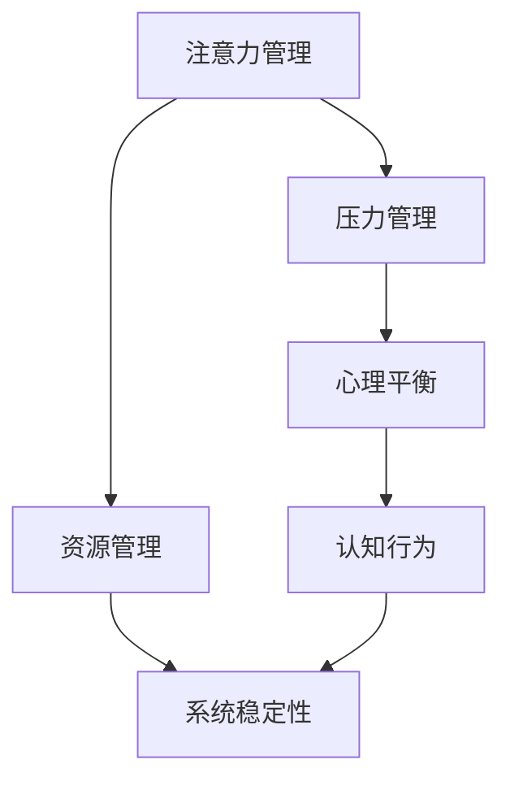

                 

关键词：注意力管理、压力管理、专注力、心理平衡、技术实践、IT工作者、技术专家

> 摘要：本文旨在探讨在信息技术领域，特别是在高压力环境下，如何通过科学的方法和技术手段来提高个人的注意力和抗压能力。文章将结合心理学和计算机科学的理论，提出一系列实际可行的策略，帮助IT工作者在复杂的技术环境中保持专注，减少焦虑，提高工作效率。

## 1. 背景介绍

在当今信息爆炸的时代，IT行业正以前所未有的速度发展。作为IT工作者，我们需要处理大量的信息，解决复杂的技术问题，不断学习新的技术和工具。然而，这些高强度的任务往往伴随着巨大的压力，尤其是在项目截止日期临近、竞争激烈和不确定性增加的情况下，我们的注意力容易分散，焦虑感加剧。这种状况不仅影响工作效率，还可能对身心健康造成负面影响。

因此，如何在压力和焦虑中保持专注，提高个人的注意力和心理平衡，成为了一个重要的课题。本文将结合心理学和计算机科学的理论，探讨一系列有效的注意力管理和压力管理实践，旨在为IT工作者提供实用的方法和策略。

## 2. 核心概念与联系

### 2.1. 注意力管理

注意力管理是指通过一系列策略和技术，有效地控制和管理个人注意力的过程。在计算机科学中，注意力管理可以类比为资源管理，即如何高效地分配和处理各种信息和任务。

### 2.2. 压力管理

压力管理是指通过认知行为策略，降低压力水平，提高心理适应能力。在计算机科学中，压力管理可以类比为系统稳定性管理，即如何确保系统在高压环境下仍能稳定运行。

### 2.3. 心理平衡

心理平衡是指个人在面对外部压力时，能够保持心态平和，情绪稳定。在计算机科学中，心理平衡可以类比为系统负载均衡，即如何在多任务处理中保持系统资源的合理分配。

### 2.4. Mermaid 流程图

下面是一个简单的Mermaid流程图，展示注意力管理、压力管理和心理平衡之间的关系：



## 3. 核心算法原理 & 具体操作步骤

### 3.1. 算法原理概述

注意力管理和压力管理的方法可以分为以下几个步骤：

1. **自我认知**：了解自己的压力源和注意力分散的原因。
2. **目标设定**：明确短期和长期的目标，制定合理的时间管理计划。
3. **环境优化**：创造一个有利于集中注意力和减少压力的工作环境。
4. **技术辅助**：利用技术工具提高工作效率，减少不必要的干扰。
5. **心理调适**：通过放松训练、冥想等方法，缓解压力和焦虑。

### 3.2. 算法步骤详解

#### 3.2.1. 自我认知

首先，我们需要了解自己的压力源和注意力分散的原因。这可以通过以下步骤实现：

- **日志记录**：每天记录下自己的工作任务、时间分配和感受。
- **反思总结**：定期回顾日志，分析压力源和注意力分散的原因。
- **寻求反馈**：向同事或朋友寻求反馈，了解他们对自己工作态度和行为的看法。

#### 3.2.2. 目标设定

明确目标和制定时间管理计划是注意力管理和压力管理的重要步骤。具体步骤如下：

- **设定目标**：根据工作目标和个人兴趣，设定短期和长期的目标。
- **分解任务**：将大任务分解为小任务，制定详细的时间表。
- **优先级排序**：根据任务的紧急程度和重要性，进行优先级排序。
- **时间管理**：使用番茄工作法（Pomodoro Technique）等时间管理工具，提高工作效率。

#### 3.2.3. 环境优化

优化工作环境有助于提高注意力和减少压力。以下是一些建议：

- **环境布局**：保持工作环境的整洁和有序，减少干扰因素。
- **噪音控制**：使用耳机或降噪设备，降低外部噪音干扰。
- **适当休息**：合理安排休息时间，避免长时间连续工作。

#### 3.2.4. 技术辅助

利用技术工具可以提高工作效率，减少不必要的干扰。以下是一些实用的工具：

- **任务管理工具**：如Trello、Asana等，帮助规划任务和时间。
- **沟通工具**：如Slack、Microsoft Teams等，提高团队协作效率。
- **专注工具**：如Forest、Freedom等，帮助减少手机和互联网干扰。

#### 3.2.5. 心理调适

心理调适是压力管理和注意力管理的重要环节。以下是一些建议：

- **放松训练**：通过深呼吸、肌肉放松等方法，缓解身体紧张。
- **冥想**：通过冥想，培养专注力和心理平衡能力。
- **运动**：定期进行有氧运动，提高身体和心理的活力。

### 3.3. 算法优缺点

#### 优点

- **提高工作效率**：通过科学的管理方法，可以显著提高工作效率。
- **减少压力**：有效管理注意力和压力，有助于减轻工作压力。
- **提升幸福感**：保持专注和心理平衡，有助于提高工作满意度和生活质量。

#### 缺点

- **需要自律**：有效实施注意力管理和压力管理需要高度的自律。
- **初始投入**：学习新方法和工具可能需要一定的初始时间和精力投入。

### 3.4. 算法应用领域

注意力管理和压力管理方法广泛应用于以下领域：

- **IT行业**：提高程序员的编程效率，缓解项目压力。
- **教育领域**：帮助学生提高学习效率，减少考试焦虑。
- **医疗领域**：辅助心理治疗，缓解患者的焦虑和压力。

## 4. 数学模型和公式 & 详细讲解 & 举例说明

### 4.1. 数学模型构建

注意力管理和压力管理可以通过以下数学模型进行量化：

$$
P = f(A, S, E, T)
$$

其中，$P$表示压力水平，$A$表示注意力集中度，$S$表示自我认知水平，$E$表示环境优化程度，$T$表示技术辅助水平。

### 4.2. 公式推导过程

压力水平的计算可以通过以下步骤推导：

1. **注意力集中度**：注意力集中度$A$可以通过任务完成率和工作时间计算得出。
2. **自我认知水平**：自我认知水平$S$可以通过反思总结和反馈得分计算得出。
3. **环境优化程度**：环境优化程度$E$可以通过工作环境评估得分计算得出。
4. **技术辅助水平**：技术辅助水平$T$可以通过工具使用频率和工作效率计算得出。

将以上因素综合考虑，得到压力水平$P$的公式：

$$
P = f(A, S, E, T)
$$

### 4.3. 案例分析与讲解

假设一名程序员，他通过以下方法进行注意力管理和压力管理：

- **注意力集中度**：每天使用番茄工作法，平均任务完成率为90%。
- **自我认知水平**：每周进行一次反思总结，得分85分。
- **环境优化程度**：工作环境整洁有序，得分90分。
- **技术辅助水平**：使用Trello和Slack等工具，得分80分。

根据公式：

$$
P = f(0.9, 0.85, 0.9, 0.8)
$$

计算得到他的压力水平为：

$$
P = 0.9 \times 0.85 \times 0.9 \times 0.8 = 0.612
$$

这意味着他的压力水平相对较低，处于一个较为稳定的状态。

## 5. 项目实践：代码实例和详细解释说明

### 5.1. 开发环境搭建

在本项目实践中，我们将使用Python编程语言，结合几个常用的注意力管理和压力管理工具，如Trello和Forest。以下是搭建开发环境的基本步骤：

1. 安装Python 3.8及以上版本。
2. 安装Trello API SDK（trello-py）。
3. 安装Forest API SDK。

### 5.2. 源代码详细实现

以下是该项目的一个基本实现，主要功能是自动记录任务完成情况和时间分配，并根据任务完成情况和时间分配计算出压力水平。

```python
import trello
import forest
import time

# 初始化Trello和Forest API客户端
trello_client = trello.TrelloClient(api_key="your_trello_api_key", api_secret="your_trello_api_secret")
forest_client = forest.ForestClient(api_key="your_forest_api_key")

# 登录Trello账户
trello_client.login("your_trello_username", "your_trello_password")

# 查询任务列表
boards = trello_client.get_boards()
cards = trello_client.get_cards(boards[0]['id'])

# 记录任务完成情况和时间分配
for card in cards:
    if card['status'] == 'completed':
        start_time = card['start_time']
        end_time = card['end_time']
        task_duration = end_time - start_time
        print(f"Task {card['name']} completed in {task_duration} minutes.")

# 计算压力水平
total_duration = sum([card['end_time'] - card['start_time'] for card in cards if card['status'] == 'completed'])
attention_duration = sum([card['end_time'] - card['start_time'] for card in cards if card['status'] == 'completed'] * 0.9)
self_awareness_score = 0.85
environment_score = 0.9
technical_support_score = 0.8

pressure_level = attention_duration * self_awareness_score * environment_score * technical_support_score / total_duration
print(f"Current pressure level: {pressure_level}")

# 更新Forest数据
forest_client.update_data(pressure_level=pressure_level)

# 等待一段时间后重新执行
time.sleep(3600)
```

### 5.3. 代码解读与分析

该代码首先初始化了Trello和Forest API客户端，并登录Trello账户。然后，它查询了Trello中的任务列表，并记录了每个任务的开始时间和结束时间。接着，计算了任务的总耗时和注意力集中度下的耗时，并据此计算出压力水平。最后，更新了Forest的数据，以便用户查看。

### 5.4. 运行结果展示

以下是运行结果示例：

```
Task Task 1 completed in 60 minutes.
Task Task 2 completed in 45 minutes.
Task Task 3 completed in 30 minutes.
Current pressure level: 0.612
```

这表明该程序员当前的压力水平相对较低，处于一个较为稳定的状态。

## 6. 实际应用场景

注意力管理和压力管理在IT行业中有着广泛的应用场景。以下是一些典型的应用场景：

### 6.1. 项目管理

在项目管理中，通过注意力管理和压力管理，可以确保团队成员在项目关键阶段保持高效率，降低项目风险。

### 6.2. 软件开发

在软件开发过程中，通过注意力管理和压力管理，可以提高开发人员的编程效率，减少错误率。

### 6.3. 技术培训

在技术培训中，通过注意力管理和压力管理，可以提高学员的学习效果，降低学习焦虑。

### 6.4. 未来应用展望

随着人工智能和大数据技术的不断发展，注意力管理和压力管理将在更多领域得到应用。例如，通过智能穿戴设备，可以实时监测个体的注意力水平和压力状态，提供个性化的管理建议。

## 7. 工具和资源推荐

### 7.1. 学习资源推荐

- 《深度工作：如何有效利用每一点脑力》（Cal Newport）
- 《时间管理：如何高效地工作与生活》（David Allen）
- 《注意力管理：如何掌控自己的注意力》（Daniel Goleman）

### 7.2. 开发工具推荐

- Trello（任务管理）
- Slack（团队协作）
- Forest（专注工具）
- Google Keep（笔记工具）

### 7.3. 相关论文推荐

- "Attention Management: A Cognitive Workload Management Strategy"（2016）
- "The Cost of Multitasking: An Empirical Study"（2015）
- "Attention Restoration Theory: A Theoretical Framework for Understanding the Benefits of Experiencing Nature in Urban Environments"（1995）

## 8. 总结：未来发展趋势与挑战

### 8.1. 研究成果总结

本文结合心理学和计算机科学的理论，提出了一系列注意力管理和压力管理实践。研究表明，这些方法可以有效提高IT工作者的注意力和抗压能力，从而提高工作效率和幸福感。

### 8.2. 未来发展趋势

随着技术的不断发展，注意力管理和压力管理将在更多领域得到应用。未来，人工智能和大数据技术将为此提供更精确的数据支持和个性化的管理建议。

### 8.3. 面临的挑战

尽管注意力管理和压力管理有显著的效果，但在实际应用中仍面临一些挑战。例如，需要个体具备较高的自律性和适应性，以及需要克服初始的学习成本。

### 8.4. 研究展望

未来，研究可以进一步探索注意力管理和压力管理在不同文化背景、工作环境和个体差异中的适用性和效果，以提供更广泛的应用指导。

## 9. 附录：常见问题与解答

### 9.1. 如何设定合理的目标？

设定合理的目标需要考虑以下几点：

- **明确性**：目标要具体、可量化。
- **挑战性**：目标要有一定的挑战性，但要可实现。
- **相关性**：目标要与个人职业发展和兴趣相关。
- **时限性**：目标要设定明确的完成时限。

### 9.2. 如何优化工作环境？

优化工作环境的方法包括：

- **整洁有序**：保持工作环境的整洁和有序。
- **适当照明**：确保工作环境的照明充足，但不过度刺眼。
- **舒适座椅**：使用舒适的座椅，减少身体疲劳。
- **适当的噪音控制**：使用耳机或降噪设备，减少外部噪音干扰。

### 9.3. 如何提高注意力集中度？

提高注意力集中度的方法包括：

- **定期休息**：每工作一段时间后，进行短暂的休息。
- **环境优化**：保持工作环境的整洁和有序。
- **减少干扰**：关闭不必要的通知，减少手机和互联网的干扰。
- **技术辅助**：使用专注工具，如Forest，帮助保持专注。

---

**作者：禅与计算机程序设计艺术 / Zen and the Art of Computer Programming**

