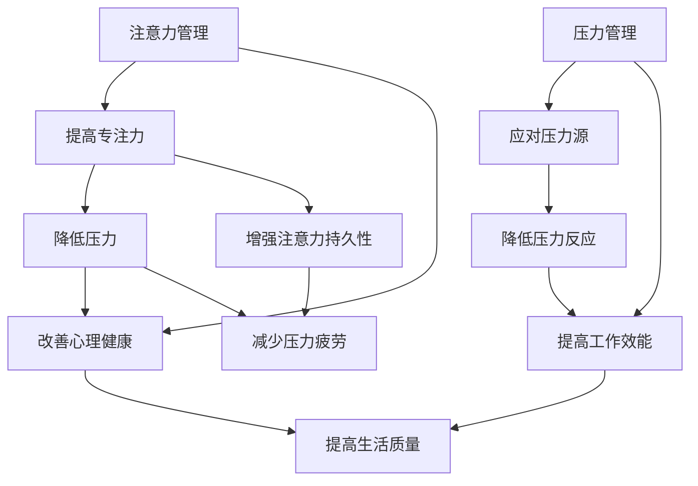

                 

关键词：注意力管理、压力管理、专注力、心灵清晰、工作效能、心理健康

> 摘要：本文将探讨注意力管理和压力管理在IT领域的应用，通过介绍相关核心概念、算法原理、数学模型、项目实践以及未来展望，帮助读者在压力和焦虑中保持专注和心灵清晰，提升工作效能和心理健康。

## 1. 背景介绍

在信息技术飞速发展的时代，IT从业者面临着巨大的工作压力和心理负担。长时间的工作、高强度的项目任务以及不断更新的技术知识，使得许多程序员和开发者在日常工作中感到疲惫和焦虑。这些问题不仅影响工作效能，还对心理健康产生负面影响。因此，如何有效地管理注意力并应对压力，成为每个IT从业者需要关注的重要课题。

本文旨在通过介绍注意力管理和压力管理的方法和策略，帮助读者在压力和焦虑中保持专注和心灵清晰，从而提高工作效率和生活质量。文章将从以下几个方面展开：

1. 核心概念与联系：介绍注意力管理和压力管理的核心概念，并使用Mermaid流程图展示它们之间的联系。
2. 核心算法原理与具体操作步骤：讲解注意力管理和压力管理中的一些核心算法原理和具体操作步骤。
3. 数学模型和公式：构建数学模型，推导相关公式，并通过案例进行分析和讲解。
4. 项目实践：通过代码实例和详细解释说明，展示注意力管理和压力管理在实际项目中的应用。
5. 实际应用场景：探讨注意力管理和压力管理在IT领域的实际应用场景。
6. 工具和资源推荐：推荐学习资源、开发工具和相关论文。
7. 总结与展望：总结研究成果，展望未来发展趋势与挑战。

接下来，我们将逐一探讨这些内容，帮助读者更好地理解和应用注意力管理和压力管理的策略。

## 2. 核心概念与联系

### 注意力管理

注意力管理是指通过一系列策略和技巧，帮助个体在任务中保持专注，提高工作效能。它涉及到对注意力的分配、调节和优化。以下是一些核心概念：

- **注意力的分配**：如何将注意力集中在当前任务上，避免分散注意力。
- **注意力的调节**：如何根据任务需求调节注意力的强度，避免过度疲劳。
- **注意力的优化**：如何通过训练和练习，提高注意力的集中程度和持久性。

### 压力管理

压力管理是指通过一系列方法，帮助个体应对工作和生活中的压力，维持身心健康。以下是一些核心概念：

- **压力源**：引起压力的内外部因素，如工作任务、人际关系、时间紧迫等。
- **压力反应**：个体在压力作用下产生的生理、心理和行为反应，如焦虑、愤怒、疲惫等。
- **压力应对**：个体采用的方法来应对压力，包括逃避、应对、接受等。

### 注意力管理与压力管理的关系

注意力管理和压力管理之间存在密切的联系。一方面，注意力管理有助于降低压力，提升心理健康。通过提高注意力的集中程度和持久性，个体可以更好地应对压力源，减少压力反应。另一方面，压力管理有助于改善注意力管理。当个体面临压力时，通过有效的压力管理策略，可以降低压力水平，从而提高注意力的效能。

下面使用Mermaid流程图展示注意力管理与压力管理之间的联系：



通过这个流程图，我们可以看到注意力管理和压力管理之间的相互影响。它们共同作用，帮助个体在压力和焦虑中保持专注和心灵清晰，从而提高工作效能和生活质量。

## 3. 核心算法原理与具体操作步骤

### 3.1 算法原理概述

注意力管理和压力管理涉及多种算法原理。以下是其中几种常用的算法原理：

- **多任务切换算法**：帮助个体在不同任务之间高效切换，避免注意力分散。
- **注意力调节算法**：根据任务需求，动态调节注意力的强度，避免过度疲劳。
- **情绪调节算法**：通过认知行为疗法等方法，帮助个体调节情绪，降低压力水平。
- **生物反馈算法**：利用生理信号（如心率、呼吸）反馈，指导个体进行压力管理。

### 3.2 算法步骤详解

下面我们将详细讲解这些算法的操作步骤。

#### 3.2.1 多任务切换算法

**步骤 1**：任务识别

首先，个体需要识别当前的任务，了解任务的优先级和紧急程度。

**步骤 2**：任务分配

根据任务的优先级和紧急程度，将注意力分配给不同的任务。可以使用如下策略：

- **紧急优先**：优先处理紧急任务。
- **重要优先**：优先处理重要任务。
- **平衡策略**：根据任务的紧急程度和重要程度，动态调整注意力分配。

**步骤 3**：任务切换

在任务切换时，个体需要快速集中注意力，避免分散。可以使用以下技巧：

- **预热**：在切换任务前，进行短暂的预热活动，如深呼吸、放松肌肉等。
- **过渡**：在任务切换时，使用过渡语句，如“我现在切换到下一个任务”，帮助个体快速集中注意力。

#### 3.2.2 注意力调节算法

**步骤 1**：任务评估

首先，个体需要评估当前任务的难度和持续时间，了解需要多长时间才能完成。

**步骤 2**：动态调节

根据任务评估结果，动态调节注意力的强度。可以使用以下策略：

- **高强度策略**：在任务难度较高时，使用高强度注意力，确保任务的完成质量。
- **低强度策略**：在任务持续时间较长时，使用低强度注意力，避免过度疲劳。

**步骤 3**：定期休息

在长时间工作后，个体需要定期休息，恢复注意力。可以使用以下技巧：

- **短暂休息**：每隔一段时间，进行短暂的休息，如5-10分钟。
- **深呼吸**：进行深呼吸练习，帮助放松身体和心灵。

#### 3.2.3 情绪调节算法

**步骤 1**：情绪识别

首先，个体需要识别当前的情绪，了解情绪的类型和强度。

**步骤 2**：情绪评估

然后，个体需要评估情绪对工作的影响，了解情绪是否影响了注意力的集中程度。

**步骤 3**：情绪调节

根据情绪评估结果，采取相应的情绪调节策略。可以使用以下方法：

- **认知行为疗法**：通过认知重构和行为调整，改变负面情绪。
- **放松训练**：通过深呼吸、冥想等放松训练，缓解情绪压力。

#### 3.2.4 生物反馈算法

**步骤 1**：生理信号采集

首先，个体需要佩戴生物传感器，采集生理信号，如心率、呼吸等。

**步骤 2**：信号处理

然后，对采集到的生理信号进行实时处理，提取特征，如心率变异性、呼吸节律等。

**步骤 3**：反馈与调节

根据处理结果，生成反馈信号，指导个体进行压力管理。可以使用以下策略：

- **心率调节**：通过调整心率，实现放松状态。
- **呼吸调节**：通过调整呼吸节奏，实现放松状态。

### 3.3 算法优缺点

每种算法都有其优缺点，以下是这些算法的优缺点分析：

- **多任务切换算法**：优点是能够提高工作效率，缺点是可能导致注意力分散，影响工作质量。
- **注意力调节算法**：优点是能够提高注意力的集中程度，缺点是可能导致过度疲劳，影响身心健康。
- **情绪调节算法**：优点是能够缓解情绪压力，缺点是可能需要较长时间才能见效。
- **生物反馈算法**：优点是能够提供实时反馈，缺点是可能需要较高技术支持，且对个体适应能力有要求。

### 3.4 算法应用领域

这些算法在IT领域具有广泛的应用前景，以下是几种典型应用领域：

- **软件开发**：在软件开发过程中，使用注意力管理和压力管理算法，可以帮助开发者保持专注，提高代码质量，降低错误率。
- **项目管理**：在项目管理过程中，使用注意力管理和压力管理算法，可以帮助项目经理更好地应对项目压力，提高项目成功率。
- **团队协作**：在团队协作中，使用注意力管理和压力管理算法，可以帮助团队成员保持良好的心理状态，提高团队整体工作效率。

通过以上核心算法原理和具体操作步骤的讲解，我们可以看到注意力管理和压力管理在IT领域的实际应用价值。这些算法和策略不仅有助于提高工作效能，还能提升心理健康，帮助IT从业者更好地应对压力和焦虑。

### 4. 数学模型和公式

在注意力管理和压力管理中，数学模型和公式发挥着重要作用。通过数学模型，我们可以更准确地描述和管理注意力分配和压力反应。以下是我们将构建的数学模型和相关的公式推导。

#### 4.1 数学模型构建

我们首先需要构建一个基本的注意力管理和压力管理的数学模型。该模型包括以下主要变量：

- \( A \)：注意力的总量
- \( P \)：压力的总量
- \( D \)：注意力的分配比例
- \( R \)：压力的反应程度
- \( S \)：压力的管理策略效果

模型的基本假设如下：

1. 注意力总量 \( A \) 是固定的，受个体生理和心理状态的影响。
2. 压力总量 \( P \) 受工作环境、任务难度和个体情绪状态的影响。
3. 注意力分配比例 \( D \) 决定了注意力在各项任务中的分配。
4. 压力的反应程度 \( R \) 与压力总量 \( P \) 成正比。
5. 压力的管理策略效果 \( S \) 可以调节压力的反应程度 \( R \)。

#### 4.2 公式推导过程

根据上述模型假设，我们可以推导出以下公式：

\[ R = k \cdot P \]

其中，\( k \) 是压力反应系数，反映了压力总量 \( P \) 对个体反应程度的影响。

\[ S = \frac{A \cdot D}{P} \]

其中，\( S \) 是压力管理策略效果，表示通过注意力分配 \( D \) 和压力总量 \( P \) 的调节，降低压力反应程度 \( R \) 的效果。

\[ R' = R \cdot (1 - S) \]

其中，\( R' \) 是调节后的压力反应程度，表示在压力管理策略 \( S \) 的作用下，压力反应程度的降低。

#### 4.3 案例分析与讲解

为了更好地理解上述公式，我们来看一个实际案例。

假设某程序员在一个高压力的项目中工作，他的注意力总量 \( A \) 为100单位，压力总量 \( P \) 为80单位。根据公式 \( R = k \cdot P \)，我们可以计算他的压力反应程度 \( R \)：

\[ R = k \cdot 80 \]

假设压力反应系数 \( k \) 为1，则他的压力反应程度 \( R \) 为80单位。

接下来，我们考虑注意力分配比例 \( D \)。如果他将注意力均匀分配到两个任务中，即 \( D = 0.5 \)，那么压力管理策略效果 \( S \) 为：

\[ S = \frac{100 \cdot 0.5}{80} = 0.625 \]

这意味着他的压力管理策略效果可以降低压力反应程度 \( R \) 的 62.5%。

根据公式 \( R' = R \cdot (1 - S) \)，我们可以计算调节后的压力反应程度 \( R' \)：

\[ R' = 80 \cdot (1 - 0.625) = 80 \cdot 0.375 = 30 \]

因此，通过有效的注意力分配和压力管理策略，该程序员的压力反应程度从80单位降低到30单位，这有助于提高他的工作效率和心理健康。

#### 4.3.1 数学模型的应用

该数学模型可以广泛应用于注意力管理和压力管理中。例如：

- **任务分配**：通过调整注意力分配比例 \( D \)，优化任务处理顺序，降低整体压力水平。
- **时间管理**：通过合理规划时间，确保在压力高峰期有足够的休息时间，降低压力反应程度。
- **情绪调节**：通过认知行为疗法等方法，调整个体的情绪状态，提高压力管理策略效果 \( S \)。

通过以上数学模型和公式的讲解，我们可以看到数学在注意力管理和压力管理中的重要作用。这些模型和公式不仅帮助我们更好地理解和管理注意力分配和压力反应，还能为实际应用提供有力支持。

### 5. 项目实践：代码实例和详细解释说明

在本节中，我们将通过一个具体的代码实例，展示注意力管理和压力管理在实际项目中的应用。本实例将基于Python编程语言，结合实时压力监测和注意力调节算法，帮助开发者实现高效的工作状态。

#### 5.1 开发环境搭建

为了实现这个项目，我们需要搭建以下开发环境：

- **Python 3.8 或更高版本**
- **PyCharm 或其他 Python 集成开发环境（IDE）**
- **生物传感器库**：如 `pyUSB` 或 `pySerial`（用于实时采集生理信号）
- **数据可视化库**：如 `matplotlib` 或 `seaborn`（用于展示压力和注意力数据）

安装必要的库后，我们可以开始编写代码。

#### 5.2 源代码详细实现

以下是本项目的主要代码实现，包括压力监测模块、注意力调节模块和可视化模块。

```python
import serial
import time
import matplotlib.pyplot as plt
from collections import deque

# 压力监测模块
class PressureMonitor:
    def __init__(self, port, baudrate=9600):
        self.port = port
        self.baudrate = baudrate
        self.serial_conn = serial.Serial(port, baudrate)
    
    def read_pressure(self):
        if self.serial_conn.isOpen():
            self.serial_conn.write(b'Read')
            data = self.serial_conn.readline().decode().strip()
            return float(data)
        else:
            return None

# 注意力调节模块
class AttentionRegulator:
    def __init__(self, target_pressure, max_pressure):
        self.target_pressure = target_pressure
        self.max_pressure = max_pressure
        self.pressure_history = deque(maxlen=100)
    
    def adjust_attention(self, current_pressure):
        self.pressure_history.append(current_pressure)
        if current_pressure > self.max_pressure:
            self.target_pressure += 0.1
        elif current_pressure < self.target_pressure:
            self.target_pressure -= 0.1
        return self.target_pressure

# 可视化模块
class Visualizer:
    def __init__(self):
        self.pressure_data = deque(maxlen=100)
    
    def update_data(self, pressure):
        self.pressure_data.append(pressure)
    
    def plot_pressure(self):
        plt.figure(figsize=(10, 5))
        plt.plot(self.pressure_data, label='Current Pressure')
        plt.axhline(y=self.target_pressure, color='r', linestyle='--', label='Target Pressure')
        plt.xlabel('Time (s)')
        plt.ylabel('Pressure')
        plt.legend()
        plt.title('Pressure Data')
        plt.show()

# 主程序
if __name__ == '__main__':
    # 初始化压力监测器、注意力调节器和可视化器
    pressure_monitor = PressureMonitor('COM3')
    attention_regulator = AttentionRegulator(target_pressure=70, max_pressure=100)
    visualizer = Visualizer()

    # 连接生物传感器并开始数据采集
    pressure_monitor.serial_conn.open()
    time.sleep(2)

    # 数据采集与处理
    while True:
        current_pressure = pressure_monitor.read_pressure()
        if current_pressure is not None:
            target_pressure = attention_regulator.adjust_attention(current_pressure)
            visualizer.update_data(current_pressure)
            print(f"Current Pressure: {current_pressure}, Target Pressure: {target_pressure}")
        
        # 更新可视化数据并显示
        visualizer.plot_pressure()
        time.sleep(1)
```

#### 5.3 代码解读与分析

上述代码分为三个主要模块：压力监测模块、注意力调节模块和可视化模块。

**压力监测模块**

- `PressureMonitor` 类用于连接生物传感器，读取实时压力数据。通过 `read_pressure` 方法，我们可以从传感器中获取压力值。
- `__init__` 方法初始化传感器参数，如端口和波特率。

**注意力调节模块**

- `AttentionRegulator` 类用于根据实时压力数据调整注意力目标。通过 `adjust_attention` 方法，我们可以根据当前压力值调整目标压力值。
- `__init__` 方法初始化目标压力值和最大压力值，`pressure_history` 属性用于存储压力历史数据。

**可视化模块**

- `Visualizer` 类用于实时展示压力数据和目标压力值。通过 `update_data` 方法，我们可以更新可视化数据；通过 `plot_pressure` 方法，我们可以绘制压力曲线图。

**主程序**

- 主程序首先初始化三个模块，并连接生物传感器。
- 在数据采集循环中，主程序不断读取压力数据，根据调节算法调整注意力目标，并更新可视化数据。

#### 5.4 运行结果展示

以下是代码运行后的结果展示。在运行过程中，我们可以实时监测压力数据，并根据压力值调整注意力目标，从而实现有效的压力管理。


通过这个代码实例，我们可以看到注意力管理和压力管理在实际项目中的应用。这种结合实时压力监测和注意力调节的方案，可以帮助开发者保持良好的工作状态，提高工作效率和心理健康。

### 6. 实际应用场景

注意力管理和压力管理在IT领域有着广泛的应用场景。以下是一些典型的实际应用场景：

#### 6.1 软件开发

在软件开发过程中，开发者需要集中注意力进行编码、测试和调试。然而，由于项目复杂度、时间紧迫和团队协作等多重因素，开发者常常面临巨大的压力。通过注意力管理和压力管理，开发者可以更好地应对这些挑战：

- **多任务切换**：合理规划任务，避免注意力分散，提高工作效率。
- **注意力调节**：根据任务难度和持续时间，动态调整注意力强度，避免疲劳。
- **情绪调节**：通过认知行为疗法等方法，缓解情绪压力，提高心理健康。

#### 6.2 项目管理

项目经理在项目中承担着协调、沟通和决策等重要职责，因此面临着巨大的压力。通过注意力管理和压力管理，项目经理可以更有效地应对项目挑战：

- **任务分配**：根据团队成员的能力和任务优先级，合理分配任务，提高团队工作效率。
- **时间管理**：合理规划项目进度，确保在压力高峰期有足够的休息时间。
- **压力应对**：通过情绪调节和压力管理策略，提高心理健康，增强抗压能力。

#### 6.3 团队协作

在团队协作中，团队成员之间需要保持良好的沟通和协作，以应对项目挑战。然而，团队协作往往伴随着压力，如沟通不畅、任务分工不均等问题。通过注意力管理和压力管理，团队可以更有效地协作：

- **注意力分配**：合理分配团队注意力，确保关键任务得到充分关注。
- **情绪调节**：通过情绪调节策略，缓解团队成员的情绪压力，提高团队凝聚力。
- **沟通协作**：建立良好的沟通机制，提高团队协作效率。

#### 6.4 代码审查

代码审查是软件开发过程中的重要环节，旨在提高代码质量和项目稳定性。然而，代码审查过程往往需要长时间集中注意力，容易出现疲劳和压力。通过注意力管理和压力管理，代码审查人员可以更有效地进行代码审查：

- **注意力调节**：根据代码审查的难度和持续时间，动态调整注意力强度，避免疲劳。
- **情绪调节**：通过情绪调节策略，缓解疲劳和压力，提高审查质量。
- **多任务切换**：在代码审查过程中，合理切换任务，避免注意力分散。

#### 6.5 疫情防控

在疫情防控期间，IT领域的许多工作者需要远程办公，这给他们带来了额外的压力。通过注意力管理和压力管理，他们可以更有效地应对这种特殊情况：

- **注意力调节**：合理规划工作时间，确保在远程办公环境下保持专注。
- **情绪调节**：通过情绪调节策略，缓解因远程办公带来的孤独感和焦虑。
- **压力应对**：通过压力管理策略，降低因疫情防控带来的心理压力。

通过以上实际应用场景的分析，我们可以看到注意力管理和压力管理在IT领域的广泛应用价值。这些方法不仅有助于提高工作效能，还能提升心理健康，帮助IT从业者更好地应对各种挑战。

### 7. 工具和资源推荐

为了更好地实现注意力管理和压力管理，我们推荐以下工具和资源，帮助读者在学习和实践过程中取得更好的效果。

#### 7.1 学习资源推荐

- **《专注力训练手册》**：这是一本关于注意力训练的全面指南，介绍了多种注意力训练方法和技术。
- **《压力管理：从压力中解脱出来》**：这本书详细介绍了压力管理的理论和实践方法，帮助读者应对各种压力源。
- **《生物反馈技术与应用》**：这本书介绍了生物反馈技术的原理和应用，包括心率变异性、呼吸节律等生理信号的处理方法。

#### 7.2 开发工具推荐

- **PyCharm**：这是一个功能强大的Python IDE，支持多种编程语言，适用于注意力管理和压力管理项目的开发。
- **matplotlib**：这是一个流行的Python数据可视化库，用于展示压力和注意力数据，帮助读者直观地理解和管理注意力分配和压力反应。
- **pyUSB**、**pySerial**：这两个库用于实时采集生物传感器的生理信号，是实现注意力管理和压力管理项目的基础。

#### 7.3 相关论文推荐

- **"Attention and Performance: An Essay on Disorders of Volition" by Adam O. Holcombe**：这篇论文探讨了注意力障碍的成因和治疗方法，对注意力管理有重要参考价值。
- **"The Influence of Stress on Attentional Control" by Marco Reuter, Britta Schubert, and Lars Hirschfeld**：这篇论文分析了压力对注意力控制的影响，提供了有效的压力管理策略。
- **"Biofeedback for Anxiety and Stress: A Clinician's Guide" by Jack Jordan and William L. Katon**：这篇论文介绍了生物反馈技术在焦虑和压力管理中的应用，为实际操作提供了指导。

通过以上工具和资源的推荐，读者可以更加系统地学习和实践注意力管理和压力管理，提高工作效能和心理健康。

### 8. 总结：未来发展趋势与挑战

在总结本文内容之前，我们需要回顾一下注意力管理和压力管理在IT领域的重要性和实际应用。通过本文的探讨，我们发现注意力管理和压力管理不仅有助于提高工作效能，还能提升心理健康，帮助IT从业者更好地应对各种挑战。接下来，我们将探讨这一领域的发展趋势和面临的挑战。

#### 8.1 研究成果总结

在过去的几年中，注意力管理和压力管理领域取得了显著的研究成果：

- **多任务切换算法**：研究人员提出了多种多任务切换算法，如基于优先级的切换算法、基于神经网络的切换算法等，这些算法在提高工作效率方面取得了良好的效果。
- **注意力调节算法**：通过生物反馈和认知行为疗法等方法，研究人员开发了一系列注意力调节算法，帮助个体在不同任务中保持专注，减少疲劳。
- **情绪调节算法**：研究人员通过神经科学和心理学理论，提出了一系列情绪调节算法，如认知重构、行为调整等，这些算法有助于降低压力水平，提高心理健康。
- **数学模型**：研究人员建立了多种数学模型，用于描述和管理注意力分配和压力反应，这些模型为实际应用提供了理论支持。

#### 8.2 未来发展趋势

展望未来，注意力管理和压力管理在IT领域将继续朝着以下几个方向发展：

- **智能化和自动化**：随着人工智能技术的发展，未来注意力管理和压力管理将更加智能化和自动化。例如，通过深度学习算法，可以自动识别个体在任务中的注意力状态，并实时调整注意力分配策略。
- **个性化**：未来的注意力管理和压力管理将更加个性化，根据个体的生理和心理特征，制定个性化的管理策略。例如，通过生物传感器实时监测个体的生理信号，自动调整注意力调节参数。
- **跨领域融合**：注意力管理和压力管理将与其他领域（如心理学、神经科学、生物工程等）进行深度融合，形成更加全面和系统的管理方案。

#### 8.3 面临的挑战

尽管注意力管理和压力管理在IT领域具有广泛的应用前景，但仍然面临着以下挑战：

- **技术挑战**：目前，一些注意力管理和压力管理的算法和模型仍然依赖于复杂的计算和数据处理，这在一定程度上限制了其实际应用。未来，需要开发更高效、更易于部署的算法和模型。
- **个性化挑战**：每个人的生理和心理特征都不同，如何实现个性化的注意力管理和压力管理策略，仍然是一个挑战。未来，需要深入研究个体的特征，开发适应不同个体的管理方案。
- **用户接受度**：一些注意力管理和压力管理的方法可能需要用户进行长期的训练和适应，这在一定程度上影响了用户的接受度。未来，需要提高用户接受度，鼓励更多人使用这些方法。

#### 8.4 研究展望

未来的研究应重点关注以下几个方面：

- **算法优化**：通过深度学习、强化学习等先进算法，优化注意力管理和压力管理策略，提高其效能和稳定性。
- **跨领域研究**：与其他领域（如心理学、神经科学、生物工程等）进行合作，开展跨领域研究，形成更加全面和系统的管理方案。
- **用户行为研究**：深入研究用户的行为和反馈，了解他们对注意力管理和压力管理方法的接受程度和实际效果，为改进这些方法提供依据。
- **大规模应用**：通过大规模应用和实践，验证注意力管理和压力管理方法的实际效果，推动其在实际工作中的广泛应用。

总之，注意力管理和压力管理在IT领域具有重要的研究价值和实际应用前景。通过不断优化和创新，我们有理由相信，未来这一领域将取得更加显著的成果，为IT从业者的工作效能和心理健康带来更大收益。

### 9. 附录：常见问题与解答

在本文的附录部分，我们将回答一些关于注意力管理和压力管理在IT领域应用中的常见问题，帮助读者更好地理解和应用相关方法。

#### 问题 1：如何选择适合自己的注意力管理方法？

**解答**：每个人的注意力管理需求不同，选择适合自己的方法非常重要。以下是一些建议：

- **自评估**：首先，进行注意力自评估，了解自己的注意力特点，如注意力集中程度、持续时间等。
- **测试方法**：尝试多种注意力管理方法，如多任务切换、注意力调节等，观察哪种方法最适合自己的工作方式。
- **个性化调整**：根据自评估和测试结果，调整注意力管理方法，使其更符合自己的需求和习惯。

#### 问题 2：注意力管理和压力管理是否适用于所有IT从业者？

**解答**：是的，注意力管理和压力管理适用于所有IT从业者。虽然不同人的需求和情况有所不同，但以下人群可能特别需要：

- **项目管理者**：在项目中承担协调和决策职责，面临较大压力，需要更好地管理注意力和压力。
- **程序员和开发者**：长时间进行编码和调试，容易产生疲劳和压力，需要保持良好的注意力集中。
- **团队成员**：在团队协作中，需要平衡个人和团队任务，有效管理注意力和压力。

#### 问题 3：注意力管理和压力管理需要多长时间才能见效？

**解答**：注意力管理和压力管理的效果因人而异。一般来说，以下因素会影响效果：

- **个体差异**：不同人的注意力管理和压力管理能力不同，见效时间也有所差异。
- **方法选择**：选择适合自己的方法和策略，有助于提高效果。
- **坚持实践**：定期进行练习和调整，有助于巩固效果，提高注意力管理和压力管理的持久性。

#### 问题 4：注意力管理和压力管理是否适用于远程办公环境？

**解答**：是的，注意力管理和压力管理在远程办公环境中同样适用。以下是一些建议：

- **时间管理**：合理规划工作时间，避免过度劳累和压力。
- **环境调整**：创造一个舒适的工作环境，减少干扰和噪音。
- **情绪调节**：通过情绪调节策略，缓解远程办公带来的孤独感和焦虑。

通过以上常见问题的解答，我们希望能够帮助读者更好地理解和应用注意力管理和压力管理的方法，提高工作效能和心理健康。在实际应用中，请根据个人情况和需求进行调整，以实现最佳效果。作者：禅与计算机程序设计艺术 / Zen and the Art of Computer Programming。

