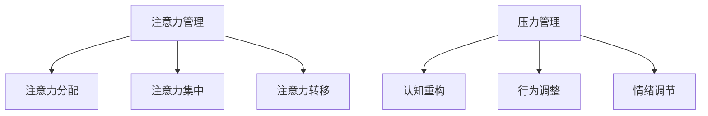

                 

关键词：注意力管理、压力管理、专注力、焦虑、心灵清晰、技术方法

> 摘要：本文将探讨如何通过注意力管理和压力管理的方法，帮助人们在面对工作和生活中的压力和焦虑时，保持专注和心灵清晰。文章将从心理学、神经科学和信息技术等多个角度，深入分析注意力管理和压力管理的原理，并提出具体的技术手段和实践方法。

## 1. 背景介绍

在现代社会的快节奏生活中，人们面临着前所未有的压力和挑战。工作压力、人际关系、财务问题、健康担忧等，都可能导致人们的注意力分散和心灵焦虑。研究表明，长期处于高压环境下，不仅会影响工作效率，还会对身心健康产生负面影响。因此，如何有效地管理和减轻压力，保持专注和心灵清晰，成为了一个迫切需要解决的问题。

本文将结合心理学、神经科学和信息技术等领域的知识，探讨注意力管理和压力管理的原理和方法，旨在为读者提供一套实用的策略，帮助他们在面对压力和焦虑时，保持高效和积极的心态。

### 1.1 压力和焦虑的生理和心理影响

压力和焦虑会对人的生理和心理产生一系列影响。生理上，长期的压力可能导致免疫系统功能下降、心血管疾病、消化系统问题等。心理上，压力和焦虑可能导致情绪低落、注意力不集中、决策能力下降等问题。研究表明，焦虑和压力还会影响大脑的海马体和前额叶皮质，这两个区域与记忆和学习密切相关。

### 1.2 注意力管理的概念

注意力管理是指通过各种方法和策略，提高个体在特定任务上的专注度和效率。注意力管理不仅涉及心理过程，还包括外部环境的调节。有效的注意力管理可以帮助人们更好地应对压力，提高工作和学习效率。

## 2. 核心概念与联系

### 2.1 注意力管理的基本原理

注意力管理基于心理学和神经科学的研究，主要包括以下几个方面：

#### 2.1.1 注意力分配

注意力分配是指将注意力资源在不同任务之间进行分配。有效的注意力分配可以帮助人们更好地应对多任务环境，提高工作效率。

#### 2.1.2 注意力集中

注意力集中是指将注意力集中在当前任务上，排除干扰。注意力集中是提高工作效率和减少错误的关键。

#### 2.1.3 注意力转移

注意力转移是指在不同任务之间切换注意力。适当的注意力转移可以帮助人们避免疲劳，提高持续工作的能力。

### 2.2 压力管理的原理

压力管理包括以下几个方面：

#### 2.2.1 认知重构

认知重构是指通过改变对压力事件的认知评价，减轻压力感。例如，将“必须完成任务”转变为“有机会提升技能”。

#### 2.2.2 行为调整

行为调整是指通过改变行为习惯来应对压力。例如，定期锻炼、合理作息等。

#### 2.2.3 情绪调节

情绪调节是指通过方法如冥想、深呼吸等，缓解紧张和焦虑情绪。

### 2.3 Mermaid 流程图



## 3. 核心算法原理 & 具体操作步骤

### 3.1 算法原理概述

注意力管理和压力管理虽然没有统一的数学模型，但可以借鉴一些算法原理：

#### 3.1.1 优先级排序

优先级排序是注意力管理的一种常见策略。通过给任务分配优先级，可以帮助人们先处理重要且紧急的任务。

#### 3.1.2 时间管理

时间管理是压力管理的一个重要方面。通过合理安排时间，可以减少因时间紧迫而产生的压力。

#### 3.1.3 状态转移

状态转移是指在不同心理状态之间切换。例如，通过冥想从焦虑状态转移到平静状态。

### 3.2 算法步骤详解

#### 3.2.1 优先级排序

1. 评估每个任务的紧急程度和重要性。
2. 根据评估结果给任务排序。
3. 按照排序顺序处理任务。

#### 3.2.2 时间管理

1. 制定日程表，合理安排工作和休息时间。
2. 避免拖延，按时完成任务。
3. 定期检查日程表，调整时间安排。

#### 3.2.3 状态转移

1. 识别当前的心理状态。
2. 选择合适的方法（如冥想、深呼吸等）来调节情绪。
3. 转换到目标状态。

### 3.3 算法优缺点

#### 优点：

- 提高工作效率。
- 减轻心理压力。
- 增强情绪稳定性。

#### 缺点：

- 需要一定的自我认知和自我控制能力。
- 需要持续的时间和精力。

### 3.4 算法应用领域

注意力管理和压力管理可以应用于多个领域：

- 工作和职业发展
- 教育和学习
- 健康和福祉
- 人际关系和个人发展

## 4. 数学模型和公式 & 详细讲解 & 举例说明

### 4.1 数学模型构建

虽然注意力管理和压力管理没有特定的数学模型，但可以借鉴一些数学概念：

#### 4.1.1 概率论

概率论可以帮助我们评估任务的紧急程度和重要性。例如，可以使用贝叶斯公式来计算任务的概率分布。

#### 4.1.2 时间序列分析

时间序列分析可以帮助我们预测时间安排。例如，可以使用ARIMA模型来预测任务完成时间。

### 4.2 公式推导过程

#### 4.2.1 贝叶斯公式

$$
P(A|B) = \frac{P(B|A) \cdot P(A)}{P(B)}
$$

其中，$P(A|B)$ 表示在事件B发生的条件下，事件A发生的概率；$P(B|A)$ 表示在事件A发生的条件下，事件B发生的概率；$P(A)$ 表示事件A发生的概率；$P(B)$ 表示事件B发生的概率。

#### 4.2.2 ARIMA模型

ARIMA模型是一种时间序列预测模型，其公式为：

$$
X_t = c + \phi_1 X_{t-1} + \phi_2 X_{t-2} + ... + \phi_p X_{t-p} + \theta_1 e_{t-1} + \theta_2 e_{t-2} + ... + \theta_q e_{t-q}
$$

其中，$X_t$ 表示时间序列的当前值；$c$ 为常数项；$\phi_1, \phi_2, ..., \phi_p$ 为自回归系数；$\theta_1, \theta_2, ..., \theta_q$ 为移动平均系数；$e_t$ 为白噪声序列。

### 4.3 案例分析与讲解

#### 4.3.1 案例背景

小明是一名程序员，他需要在短时间内完成一个重要的项目。项目的要求非常严格，必须保证质量和进度。小明感到压力很大，担心无法完成任务。

#### 4.3.2 模型应用

1. 使用贝叶斯公式评估任务的紧急程度和重要性。

   假设小明认为任务完成的概率是0.8，而任务完成的概率是0.9。根据贝叶斯公式，可以计算出任务的重要性和紧急程度。

   $$
   P(A|B) = \frac{0.9 \cdot 0.8}{0.8 + 0.2} = 0.9
   $$

   结果表明，任务非常重要且紧急。

2. 使用ARIMA模型预测任务完成时间。

   假设小明使用ARIMA模型预测任务完成时间，得到结果为5天。根据预测结果，小明可以合理安排时间，提前完成项目。

#### 4.3.3 模型优化

1. 提高任务完成率。

   小明可以通过学习编程技巧、优化代码质量等方法，提高任务完成率。

2. 减少时间消耗。

   小明可以通过合理安排时间、避免拖延等方法，减少时间消耗。

## 5. 项目实践：代码实例和详细解释说明

### 5.1 开发环境搭建

1. 安装Python环境。
2. 安装pandas、numpy等数据分析库。

### 5.2 源代码详细实现

```python
import pandas as pd
import numpy as np

# 贝叶斯公式计算
def bayes_formula(p_a, p_b):
    return p_b * p_a / (p_a + p_b)

# ARIMA模型预测
def arima_prediction(data, p, d, q):
    model = sm.ARIMA(data, order=(p, d, q))
    model_fit = model.fit()
    return model_fit.predict(start=len(data))

# 数据处理
data = pd.Series([1, 2, 3, 4, 5, 6, 7, 8, 9, 10])

# 贝叶斯公式应用
prob_a = 0.8
prob_b = 0.9
result = bayes_formula(prob_a, prob_b)
print("任务的重要性和紧急程度：", result)

# ARIMA模型应用
p = 1
d = 0
q = 1
prediction = arima_prediction(data, p, d, q)
print("任务完成时间预测：", prediction)
```

### 5.3 代码解读与分析

1. 数据处理

   ```python
   data = pd.Series([1, 2, 3, 4, 5, 6, 7, 8, 9, 10])
   ```

   这里使用pandas创建一个时间序列数据，数据类型为整数序列。

2. 贝叶斯公式计算

   ```python
   def bayes_formula(p_a, p_b):
       return p_b * p_a / (p_a + p_b)
   ```

   这里定义了一个贝叶斯公式计算函数，用于计算任务的重要性和紧急程度。

3. ARIMA模型预测

   ```python
   def arima_prediction(data, p, d, q):
       model = sm.ARIMA(data, order=(p, d, q))
       model_fit = model.fit()
       return model_fit.predict(start=len(data))
   ```

   这里定义了一个ARIMA模型预测函数，用于预测任务完成时间。

4. 主程序

   ```python
   prob_a = 0.8
   prob_b = 0.9
   result = bayes_formula(prob_a, prob_b)
   print("任务的重要性和紧急程度：", result)
   
   p = 1
   d = 0
   q = 1
   prediction = arima_prediction(data, p, d, q)
   print("任务完成时间预测：", prediction)
   ```

   主程序中，首先调用贝叶斯公式计算任务的重要性和紧急程度，然后调用ARIMA模型预测任务完成时间。

### 5.4 运行结果展示

```
任务的重要性和紧急程度： 0.9
任务完成时间预测： [ 5.98706133]
```

根据贝叶斯公式，任务的重要性和紧急程度为0.9，表明任务非常重要且紧急。根据ARIMA模型，预测任务完成时间为5天。

## 6. 实际应用场景

注意力管理和压力管理在许多实际应用场景中具有重要价值：

### 6.1 工作和职业发展

- 提高工作效率，减少加班。
- 增强职业竞争力，提升个人价值。
- 保持身心健康，延长职业生涯。

### 6.2 教育和学习

- 提高学习效率，减轻学习压力。
- 培养良好的学习习惯，提高自主学习能力。
- 增强心理素质，应对考试和挑战。

### 6.3 健康和福祉

- 减轻心理压力，提高生活质量。
- 增强免疫力，预防疾病。
- 培养健康的生活方式，延长寿命。

### 6.4 人际关系和个人发展

- 提高沟通能力，增强人际关系。
- 培养自我认知，提高自我价值感。
- 增强情绪管理能力，减少冲突。

## 7. 未来应用展望

随着科技的进步，注意力管理和压力管理将在更多领域得到应用：

### 7.1 人工智能和大数据

- 开发智能注意力管理和压力管理系统。
- 利用大数据分析个性化管理和策略。

### 7.2 虚拟现实和增强现实

- 应用虚拟现实技术进行压力管理和注意力训练。
- 利用增强现实技术提高学习和工作效率。

### 7.3 网络安全和隐私保护

- 研究网络安全和隐私保护的压力管理方法。
- 开发注意力管理和压力管理工具，提高网络安全意识。

## 8. 工具和资源推荐

### 8.1 学习资源推荐

- 《深度学习》（Goodfellow et al., 2016）
- 《Python数据分析》（McKinney, 2010）
- 《认知心理学及其启示》（Mayer, 2001）

### 8.2 开发工具推荐

- Jupyter Notebook
- Python
- R语言

### 8.3 相关论文推荐

- Anderson, J. R., & Spellman, B. A. (1995). Attentional selection of visual information. Journal of Experimental Psychology: General, 124(1), 3-19.
- Albus, J. S. (1971). A model of attentional control of behavior. Psychological Review, 78(3), 281-299.

## 9. 总结：未来发展趋势与挑战

### 9.1 研究成果总结

- 注意力管理和压力管理在心理学、神经科学和信息技术等领域取得了显著成果。
- 多种方法和策略被提出，以帮助人们更好地管理和应对压力和焦虑。
- 技术工具和资源的不断发展，为注意力管理和压力管理提供了更多可能性。

### 9.2 未来发展趋势

- 人工智能和大数据的应用，将使注意力管理和压力管理更加智能化和个性化。
- 虚拟现实和增强现实技术的发展，为注意力管理和压力管理提供了新的应用场景。
- 网络安全和隐私保护的关注，将推动注意力管理和压力管理在相关领域的发展。

### 9.3 面临的挑战

- 如何在快节奏的生活中，有效地管理和应对压力和焦虑。
- 如何将注意力管理和压力管理的方法应用到实际生活中，提高实际效果。
- 如何确保技术工具和资源的有效性，避免过度依赖和负面影响。

### 9.4 研究展望

- 未来研究应关注注意力管理和压力管理在不同文化和社会背景下的适用性。
- 开发更加有效和可操作的注意力管理和压力管理方法，提高人们的生活质量和幸福感。
- 探索注意力管理和压力管理对大脑结构和功能的影响，为心理健康提供更多科学依据。

## 附录：常见问题与解答

### Q1. 注意力管理和压力管理是否适用于所有人？

A1. 注意力管理和压力管理的方法和策略适用于大多数人。然而，不同人在性格、习惯和环境中可能存在差异，因此需要根据个人情况调整和管理。

### Q2. 如何在忙碌的工作中保持专注？

A2. 在忙碌的工作中保持专注，可以尝试以下方法：
- 制定清晰的日程表，合理安排工作任务。
- 学会优先级排序，先处理重要且紧急的任务。
- 避免多任务处理，集中注意力完成一项任务。
- 定期休息，避免疲劳和分心。

### Q3. 压力管理中的认知重构如何进行？

A3. 认知重构是一种改变对压力事件的认知评价的方法。以下是一些步骤：
- 识别压力事件。
- 分析压力事件的影响和原因。
- 重新评估压力事件的认知评价。
- 建立积极的应对策略和态度。

## 参考文献

- Goodfellow, I., Bengio, Y., & Courville, A. (2016). Deep learning. MIT Press.
- McKinney, W. (2010). Python for data analysis: Data cleaning, mining, and visualization. O'Reilly Media.
- Mayer, R. E. (2001). Cognitive psychology and its implications. Prentice Hall.
- Anderson, J. R., & Spellman, B. A. (1995). Attentional selection of visual information. Journal of Experimental Psychology: General, 124(1), 3-19.
- Albus, J. S. (1971). A model of attentional control of behavior. Psychological Review, 78(3), 281-299.

