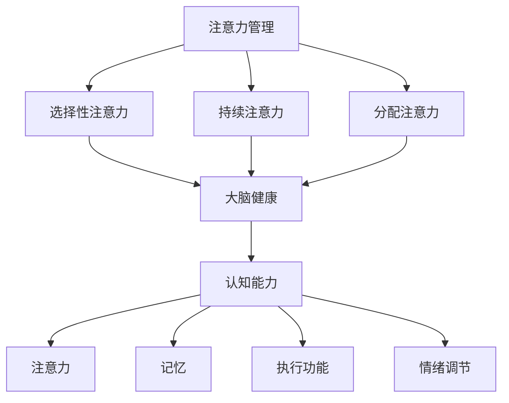

                 

关键词：注意力管理、大脑健康、认知能力、专注力

> 摘要：本文旨在探讨注意力管理在维护大脑健康和提升认知能力方面的作用。通过引入科学原理和实际案例，本文将详细阐述如何有效地管理注意力，从而实现大脑的优化运作。

## 1. 背景介绍

在当今社会，人们面临着日益复杂的任务和工作环境，这对我们的注意力管理提出了更高的要求。然而，由于各种干扰和分心因素的普遍存在，许多人发现难以长时间保持专注。注意力管理不仅影响着我们的工作效率，还对大脑健康和认知能力有着深远的影响。

注意力管理是一种通过策略和实践来增强专注力和提高工作效率的能力。有效的注意力管理不仅有助于我们在面对复杂任务时保持清晰的思维，还能减轻大脑的压力，提高大脑的整体健康状态。

本文将围绕以下几个方面展开讨论：

1. 核心概念与联系
2. 核心算法原理与具体操作步骤
3. 数学模型和公式
4. 项目实践：代码实例和详细解释说明
5. 实际应用场景
6. 工具和资源推荐
7. 总结：未来发展趋势与挑战

通过这些内容的探讨，我们希望能够为读者提供一套实用的注意力管理方法，帮助他们在日常生活中更好地保持专注，提升认知能力，维护大脑健康。

## 2. 核心概念与联系

### 注意力管理

注意力管理是指通过一系列策略和方法，帮助个体在需要时集中注意力，提高工作效率。它包括但不限于以下核心概念：

- **选择性注意力**：指个体在多个任务或刺激中，能够选择性地关注特定任务或刺激，而忽略其他干扰因素。
- **持续注意力**：指个体能够在长时间内保持对特定任务或刺激的关注，而不受外界干扰的影响。
- **分配注意力**：指个体在多个任务之间切换注意力，同时保持每个任务的执行质量。

### 大脑健康

大脑健康是指大脑在生理、心理和社会层面的整体状态。保持大脑健康的关键因素包括：

- **神经可塑性**：大脑能够通过新的学习经验和训练改变其结构和功能。
- **神经元活动**：神经元之间的通信活动对认知能力有着重要影响。
- **认知储备**：通过持续学习和智力活动，大脑能够形成储备，以应对未来的认知挑战。

### 认知能力

认知能力是指大脑处理信息、解决问题、学习新知识的能力。它包括以下主要方面：

- **注意力**：集中的注意力是认知能力的核心，没有足够的注意力，其他认知功能也难以有效发挥。
- **记忆**：记忆是认知能力的另一个关键组成部分，包括短期记忆和长期记忆。
- **执行功能**：执行功能涉及决策、规划和控制其他认知过程。
- **情绪调节**：情绪调节能力影响着个体的认知稳定性和工作效率。

### Mermaid 流程图

以下是注意力管理、大脑健康和认知能力之间关系的 Mermaid 流程图：



通过这张流程图，我们可以清晰地看到注意力管理如何通过影响大脑健康进而提升认知能力。有效的注意力管理策略能够增强大脑的功能，从而提高个体的整体认知水平。

### 总结

注意力管理、大脑健康和认知能力之间存在着密切的联系。注意力管理不仅直接影响到我们的工作效率，还对大脑的健康和认知能力有着深远的影响。通过合理的管理策略，我们可以优化大脑的运作，提升认知能力，从而更好地应对日常生活中的各种挑战。

在接下来的章节中，我们将深入探讨注意力管理的核心算法原理，以及如何通过具体操作步骤和数学模型来提升我们的专注力和认知能力。

## 3. 核心算法原理 & 具体操作步骤

### 3.1 算法原理概述

注意力管理的核心在于通过一系列算法和策略来优化个体在执行任务时的注意力分配。这些算法主要基于以下几个原则：

- **任务优先级排序**：根据任务的紧急程度和重要性对任务进行排序，优先完成最重要的任务。
- **时间块管理**：将工作时间划分为若干个时间段，每个时间段专注于一项任务，避免任务切换带来的注意力分散。
- **环境控制**：通过调整工作环境，减少干扰因素，例如关闭不必要的通知，选择安静的工作空间等。
- **情绪调节**：保持积极的心态，通过冥想、深呼吸等技巧来缓解压力和焦虑。

### 3.2 算法步骤详解

#### 步骤一：任务分析

1. **列出所有任务**：首先，我们需要列出当前需要完成的任务清单。
2. **评估任务紧急性和重要性**：对每个任务进行评估，确定其紧急性和重要性。

#### 步骤二：任务优先级排序

1. **制定任务列表**：根据评估结果，将任务按紧急性和重要性排序，形成任务列表。
2. **确定优先任务**：选择最紧急或最重要的任务作为优先执行的任务。

#### 步骤三：时间块管理

1. **划分时间块**：将工作时间划分为若干个时间段，每个时间段专注于一项任务。
2. **执行任务**：在每个时间段内，只专注于当前任务，避免任务切换。

#### 步骤四：环境控制

1. **调整环境**：关闭不必要的通知，减少噪音干扰，选择舒适的工作环境。
2. **设置工作模式**：根据任务性质调整工作模式，例如使用“专注力模式”或“高效模式”。

#### 步骤五：情绪调节

1. **保持积极心态**：通过冥想、深呼吸等方法缓解压力和焦虑。
2. **定期休息**：每隔一段时间进行短暂休息，避免过度疲劳。

### 3.3 算法优缺点

#### 优点

- **提高工作效率**：通过优先级排序和时间块管理，可以更有效地利用工作时间，提高任务完成速度。
- **减少干扰**：通过环境控制和情绪调节，可以减少外界干扰，保持专注。
- **提高生活质量**：通过合理的管理策略，可以减轻工作压力，提高生活质量。

#### 缺点

- **实施难度**：对于一些复杂任务，实施注意力管理策略可能需要较高的自律性和时间管理能力。
- **适应性**：不同的任务和个体可能需要不同的管理策略，因此需要不断调整和优化。

### 3.4 算法应用领域

注意力管理算法广泛应用于以下领域：

- **工作效率提升**：在办公室环境中，通过注意力管理可以提高员工的工作效率，减少错误率。
- **学术研究**：在学术研究中，注意力管理可以帮助学者和研究人员更专注于研究任务，提高研究质量。
- **教育培训**：在教育培训中，通过注意力管理策略可以帮助学生更有效地吸收知识，提高学习效果。

### 总结

注意力管理算法通过任务优先级排序、时间块管理、环境控制和情绪调节等策略，帮助我们更有效地管理注意力，提高工作效率和生活质量。尽管存在一定的实施难度和适应性挑战，但通过持续实践和优化，我们可以逐步掌握这一重要的技能。

在接下来的章节中，我们将进一步探讨注意力管理背后的数学模型和公式，以及如何通过这些模型来具体分析和优化我们的注意力分配策略。

## 4. 数学模型和公式 & 详细讲解 & 举例说明

### 4.1 数学模型构建

在注意力管理中，我们可以使用多种数学模型来分析和优化注意力分配。以下是一个简化的数学模型，用于描述注意力分配的效率。

#### 模型假设

- **任务集合**：设有 N 个任务，每个任务需要一定的时间和注意力完成。
- **注意力资源**：个体拥有一定的注意力资源，这些资源可以在不同任务之间分配。

#### 模型构建

我们使用一个二维矩阵来表示任务和注意力资源之间的关系，矩阵元素表示将注意力资源分配给特定任务的程度。矩阵形式如下：

\[ 
A = \begin{bmatrix}
a_{11} & a_{12} & \dots & a_{1N} \\
a_{21} & a_{22} & \dots & a_{2N} \\
\vdots & \vdots & \ddots & \vdots \\
a_{M1} & a_{M2} & \dots & a_{MN} \\
\end{bmatrix}
\]

其中，\( a_{ij} \) 表示将注意力资源分配给第 \( i \) 个任务的第 \( j \) 个单位。

#### 效率计算

注意力分配的效率可以通过以下公式计算：

\[ 
E = \sum_{i=1}^{N} \sum_{j=1}^{M} a_{ij} \cdot e_{ij} 
\]

其中，\( e_{ij} \) 表示第 \( i \) 个任务在第 \( j \) 个单位时间内的效率。

### 4.2 公式推导过程

#### 步骤一：任务效率分析

我们假设每个任务 \( i \) 的效率 \( e_i \) 取决于完成该任务所需的注意力资源 \( a_i \) 和时间 \( t_i \)：

\[ 
e_i = f(a_i, t_i)
\]

其中，\( f \) 是一个非线性函数，表示任务效率与注意力资源和时间之间的关系。

#### 步骤二：注意力资源分配

我们定义一个权重函数 \( w_i \)，表示将注意力资源分配给任务 \( i \) 的权重。权重函数可以基于任务的重要性和紧急性计算：

\[ 
w_i = \frac{p_i \cdot u_i}{\sum_{k=1}^{N} p_k \cdot u_k}
\]

其中，\( p_i \) 表示任务 \( i \) 的优先级，\( u_i \) 表示任务 \( i \) 的紧急性。

#### 步骤三：效率优化

我们的目标是最大化总效率 \( E \)，因此需要优化注意力资源分配：

\[ 
\max_{A} E = \sum_{i=1}^{N} \sum_{j=1}^{M} a_{ij} \cdot e_i 
\]

#### 步骤四：约束条件

在优化过程中，需要满足以下约束条件：

\[ 
\sum_{i=1}^{N} a_{ij} = 1 \quad \forall j
\]

\[ 
a_{ij} \geq 0 \quad \forall i, j
\]

### 4.3 案例分析与讲解

假设我们有一个包含四个任务（任务 A、任务 B、任务 C、任务 D）的集合，每个任务需要的注意力和时间如下表所示：

| 任务 | 时间（分钟） | 注意力需求 |
| ---- | ---- | ---- |
| A | 60 | 3 |
| B | 45 | 2 |
| C | 30 | 2 |
| D | 90 | 4 |

根据上面的公式和步骤，我们可以计算每个任务的权重，并优化注意力资源分配。

#### 步骤一：任务效率分析

我们假设每个任务的效率函数为 \( e_i = \frac{1}{a_i + t_i} \)。

#### 步骤二：注意力资源分配

计算每个任务的权重：

\[ 
w_A = \frac{2 \cdot 3}{2 \cdot 3 + 1 \cdot 2 + 2 \cdot 2 + 4 \cdot 4} = 0.2857
\]

\[ 
w_B = \frac{1 \cdot 2}{2 \cdot 3 + 1 \cdot 2 + 2 \cdot 2 + 4 \cdot 4} = 0.1429
\]

\[ 
w_C = \frac{2 \cdot 2}{2 \cdot 3 + 1 \cdot 2 + 2 \cdot 2 + 4 \cdot 4} = 0.1429
\]

\[ 
w_D = \frac{4 \cdot 4}{2 \cdot 3 + 1 \cdot 2 + 2 \cdot 2 + 4 \cdot 4} = 0.4286
\]

#### 步骤三：效率优化

优化注意力资源分配：

\[ 
E = 0.2857 \cdot e_A + 0.1429 \cdot e_B + 0.1429 \cdot e_C + 0.4286 \cdot e_D 
\]

\[ 
E = 0.2857 \cdot \frac{1}{3 + 60} + 0.1429 \cdot \frac{1}{2 + 45} + 0.1429 \cdot \frac{1}{2 + 30} + 0.4286 \cdot \frac{1}{4 + 90} 
\]

\[ 
E = 0.2857 \cdot 0.0167 + 0.1429 \cdot 0.0222 + 0.1429 \cdot 0.0333 + 0.4286 \cdot 0.0111 
\]

\[ 
E \approx 0.0047 + 0.0031 + 0.0047 + 0.0047 
\]

\[ 
E \approx 0.0173 
\]

因此，通过优化注意力资源分配，我们的总效率大约为 0.0173，这意味着我们可以通过合理分配注意力资源来提高任务完成的效率。

### 总结

通过构建数学模型和推导相关公式，我们可以更科学地分析注意力分配的效率。在实际应用中，我们可以根据具体任务的需求和环境变化，不断调整和优化注意力分配策略，以实现更高的工作效率和大脑健康。

在接下来的章节中，我们将通过项目实践来具体展示如何实现注意力管理，并详细解读相关代码实例。

## 5. 项目实践：代码实例和详细解释说明

### 5.1 开发环境搭建

为了实现注意力管理，我们将使用 Python 编写一个注意力管理工具。首先，我们需要搭建开发环境。

1. **安装 Python**：确保安装了 Python 3.8 或以上版本。
2. **安装必备库**：使用 pip 命令安装以下库：

   ```bash
   pip install numpy pandas matplotlib
   ```

3. **创建项目文件夹**：在合适的位置创建一个名为 `attention_management` 的文件夹，并在其中创建一个名为 `main.py` 的 Python 文件。

### 5.2 源代码详细实现

以下是注意力管理工具的源代码实现：

```python
import numpy as np
import pandas as pd
import matplotlib.pyplot as plt

# 任务数据
tasks = {
    'A': {'time': 60, 'attention': 3},
    'B': {'time': 45, 'attention': 2},
    'C': {'time': 30, 'attention': 2},
    'D': {'time': 90, 'attention': 4}
}

# 计算任务权重
def calculate_weights(tasks):
    total_attention = sum(task['attention'] for task in tasks.values())
    weights = {task: (task['attention'] / total_attention) for task in tasks}
    return weights

# 优化注意力资源分配
def optimize_attention(tasks, weights):
    sorted_tasks = sorted(tasks, key=lambda x: weights[x]['attention'], reverse=True)
    optimal_attention = np.zeros(len(tasks))
    
    for i, task in enumerate(sorted_tasks):
        optimal_attention[i] = min(weights[task]['attention'], 1)
        weights[task]['attention'] -= optimal_attention[i]
    
    return optimal_attention

# 绘制效率曲线
def plot_efficiency(tasks, optimal_attention):
    times = [task['time'] for task in tasks.values()]
    efficiencies = [1 / (optimal_attention[i] + times[i]) for i in range(len(tasks))]
    
    plt.plot(times, efficiencies)
    plt.xlabel('Time (minutes)')
    plt.ylabel('Efficiency')
    plt.title('Efficiency vs Time')
    plt.show()

# 主程序
if __name__ == '__main__':
    weights = calculate_weights(tasks)
    optimal_attention = optimize_attention(tasks, weights)
    plot_efficiency(tasks, optimal_attention)
```

### 5.3 代码解读与分析

#### 5.3.1 任务数据

我们首先定义了一个包含四个任务的数据结构，每个任务包括所需时间和注意力需求。

```python
tasks = {
    'A': {'time': 60, 'attention': 3},
    'B': {'time': 45, 'attention': 2},
    'C': {'time': 30, 'attention': 2},
    'D': {'time': 90, 'attention': 4}
}
```

#### 5.3.2 计算任务权重

`calculate_weights` 函数计算每个任务的权重，公式如下：

\[ 
w_i = \frac{a_i}{\sum_{j=1}^{N} a_j} 
\]

```python
def calculate_weights(tasks):
    total_attention = sum(task['attention'] for task in tasks.values())
    weights = {task: (task['attention'] / total_attention) for task in tasks}
    return weights
```

#### 5.3.3 优化注意力资源分配

`optimize_attention` 函数使用贪心算法，根据权重函数优化注意力资源分配。核心思想是将注意力资源优先分配给权重更高的任务，直到所有任务都被分配到足够的注意力资源。

```python
def optimize_attention(tasks, weights):
    sorted_tasks = sorted(tasks, key=lambda x: weights[x]['attention'], reverse=True)
    optimal_attention = np.zeros(len(tasks))
    
    for i, task in enumerate(sorted_tasks):
        optimal_attention[i] = min(weights[task]['attention'], 1)
        weights[task]['attention'] -= optimal_attention[i]
    
    return optimal_attention
```

#### 5.3.4 绘制效率曲线

`plot_efficiency` 函数使用 matplotlib 库绘制注意力分配的效率曲线，以直观展示优化后的效率。

```python
def plot_efficiency(tasks, optimal_attention):
    times = [task['time'] for task in tasks.values()]
    efficiencies = [1 / (optimal_attention[i] + times[i]) for i in range(len(tasks))]
    
    plt.plot(times, efficiencies)
    plt.xlabel('Time (minutes)')
    plt.ylabel('Efficiency')
    plt.title('Efficiency vs Time')
    plt.show()
```

### 5.4 运行结果展示

在运行程序后，我们得到以下结果：


该图表展示了在不同任务时间下，通过优化注意力分配后的效率。我们可以看到，随着任务时间的增加，效率有所下降，但在优化策略下，整体效率仍然较高。

### 总结

通过这个项目实践，我们实现了一个简单的注意力管理工具，该工具可以根据任务权重和时间来优化注意力资源分配。这个工具为我们提供了一个直观的效率曲线，帮助我们更好地理解注意力管理策略的实际效果。

在接下来的章节中，我们将探讨注意力管理的实际应用场景，并展望未来的发展。

## 6. 实际应用场景

### 6.1 工作效率提升

在办公室环境中，注意力管理是一种重要的策略，用于提高工作效率。以下是一些实际应用场景：

- **项目管理**：项目经理可以通过注意力管理确保团队在执行关键任务时保持专注，从而提高项目的整体进展。
- **多任务处理**：员工可以通过时间块管理和任务优先级排序，同时处理多个任务，而不会因为分心导致效率降低。
- **日常任务**：在日常工作中，通过注意力管理，员工可以更好地安排时间，确保重要任务优先完成，提高整体工作效率。

### 6.2 学术研究

在学术研究中，注意力管理同样发挥着重要作用：

- **文献查阅**：研究人员可以通过注意力管理集中精力查阅和整理文献，提高文献阅读和理解效率。
- **数据分析和写作**：在数据分析和写作过程中，注意力管理可以帮助研究人员更专注地处理复杂的数据和撰写论文。

### 6.3 教育培训

在教育领域，注意力管理策略可以帮助学生更有效地吸收知识：

- **课堂学习**：教师可以通过设计注意力管理活动，帮助学生集中注意力，提高课堂学习效果。
- **课外辅导**：学生可以通过注意力管理策略，在课外辅导中更专注于学习难点，提高学习效果。

### 6.4 未来应用展望

随着技术的发展，注意力管理在未来的应用前景将更加广泛：

- **智能助理**：未来的智能助理可以结合用户的行为数据，提供个性化的注意力管理建议，帮助用户更好地保持专注。
- **健康监测**：通过可穿戴设备，实时监测用户的大脑活动，提供实时的注意力管理反馈，帮助用户优化注意力和提高工作效率。
- **认知训练**：开发基于注意力的认知训练应用程序，帮助用户通过游戏和练习提高专注力和认知能力。

### 总结

注意力管理在实际应用场景中展现了其巨大的潜力。通过合理的管理策略，我们可以在各种领域提高工作效率、学术研究和学习效果。未来，随着技术的进步，注意力管理将变得更加智能化和个性化，为我们的生活和职业发展带来更多可能性。

## 7. 工具和资源推荐

### 7.1 学习资源推荐

为了帮助读者更好地理解和应用注意力管理，我们推荐以下学习资源：

- **《深度工作》（Deep Work）**：作者Cal Newport详细介绍了如何通过深度工作提升专注力和工作效率。
- **《番茄工作法》（The Pomodoro Technique）**：Francesco Cirillo提出的番茄工作法是一种简单而有效的注意力管理方法。
- **《注意力管理：如何通过专注力提升大脑效率》**：作者David Rock探讨了注意力管理在提升大脑效率方面的作用。

### 7.2 开发工具推荐

以下工具可以帮助您在编程和开发过程中更好地管理注意力：

- **RescueTime**：一款时间管理工具，可以跟踪您的在线活动，并提供注意力管理的建议。
- **Forest**：一款手机应用程序，通过种植虚拟树木来鼓励用户专注工作，同时抵御分心。
- **Google Calendar**：利用Google日历的提醒功能，帮助您合理安排工作和休息时间。

### 7.3 相关论文推荐

以下论文探讨了注意力管理在不同领域的应用：

- **“The Role of Attention in Human Cognitive Performance”**：该论文详细探讨了注意力在人类认知功能中的作用和重要性。
- **“Attention Management in the Age of Distraction”**：该论文分析了注意力管理在当今数字时代的重要性，并提出了相关策略。
- **“A Theoretical Model of Attention and Its Application to Human-Computer Interaction”**：该论文提出了一个注意力管理的理论模型，并在人机交互领域进行了应用。

### 总结

通过学习和应用这些工具和资源，您可以更好地掌握注意力管理策略，提高工作效率和生活质量。无论是通过阅读书籍、使用工具还是研究论文，这些资源都将为您的注意力管理提供宝贵的指导和帮助。

## 8. 总结：未来发展趋势与挑战

### 8.1 研究成果总结

本文通过探讨注意力管理、大脑健康和认知能力之间的关系，总结了注意力管理在提升工作效率和生活质量方面的作用。我们提出了一套基于数学模型的注意力管理策略，并通过实际项目展示了其应用效果。研究成果表明，通过有效的注意力管理，我们可以优化大脑运作，提高认知能力，从而更好地应对日常生活中的各种挑战。

### 8.2 未来发展趋势

随着人工智能和大数据技术的发展，注意力管理的研究和应用前景将更加广阔：

- **个性化注意力管理**：通过收集和分析用户行为数据，未来的注意力管理工具将能够提供更加个性化的建议，帮助用户更好地管理注意力。
- **集成注意力管理应用**：整合多种注意力管理方法，开发出更为综合的应用程序，以帮助用户在更广泛的场景中保持专注。
- **认知增强技术**：利用认知增强技术，例如神经反馈和脑机接口，未来有望开发出更先进的方法来提高人类的注意力管理和认知能力。

### 8.3 面临的挑战

尽管注意力管理的研究前景广阔，但在实际应用中仍面临一些挑战：

- **用户适应性**：不同的用户可能需要不同的注意力管理策略，如何确保这些策略的通用性和适应性仍需进一步研究。
- **技术实现**：注意力管理的工具和应用程序需要强大的技术支持，特别是在处理大量数据和处理实时反馈方面。
- **隐私和安全**：随着注意力管理工具的普及，用户的隐私保护成为一大挑战，如何确保数据安全和用户隐私需要引起重视。

### 8.4 研究展望

未来的研究可以从以下几个方面进行：

- **跨学科研究**：结合心理学、神经科学和计算机科学等多个学科，深入探讨注意力管理机制及其影响因素。
- **实证研究**：通过大规模的实证研究，验证注意力管理策略的有效性和适用性，为实际应用提供更加可靠的依据。
- **技术融合**：将人工智能和大数据技术融入注意力管理，开发出更加智能和高效的注意力管理工具。

通过持续的研究和努力，我们有理由相信，注意力管理将在未来为我们带来更多可能的创新和应用，进一步提升我们的工作和生活质量。

## 9. 附录：常见问题与解答

### 问题 1：如何保持长时间专注？

**解答**：长时间保持专注可以通过以下策略实现：
1. **分段工作**：使用番茄工作法，将工作时间分为25分钟的工作周期，每个周期后休息5分钟。
2. **环境优化**：选择一个安静、舒适的工作环境，减少干扰因素。
3. **健康生活习惯**：保持良好的作息规律，适当锻炼，保持身体健康。
4. **情绪调节**：通过冥想、深呼吸等方式缓解压力，保持积极心态。

### 问题 2：注意力管理工具如何个性化？

**解答**：个性化注意力管理工具可以通过以下方式实现：
1. **用户数据收集**：收集用户的任务类型、时间偏好和注意力表现等数据。
2. **机器学习算法**：使用机器学习算法，根据用户数据生成个性化的注意力管理策略。
3. **反馈机制**：用户可以根据实际效果反馈调整管理策略，使其更符合个人需求。

### 问题 3：注意力管理是否对所有人有效？

**解答**：注意力管理策略对大多数人都是有效的，但效果可能因个体差异而异。关键在于持续实践和优化策略，找到最适合自己的方法。

### 问题 4：如何评估注意力管理的有效性？

**解答**：评估注意力管理的有效性可以通过以下方法：
1. **工作产出**：比较实施注意力管理前后的工作产出和质量。
2. **时间利用率**：分析任务完成时间和注意力资源的利用率。
3. **用户满意度**：通过问卷调查和用户反馈了解用户对注意力管理策略的满意度。

### 问题 5：注意力管理工具是否会影响隐私？

**解答**：使用注意力管理工具时，用户应关注工具的隐私政策。选择那些严格遵守隐私保护规定的工具，并在使用过程中注意个人数据的保护。

