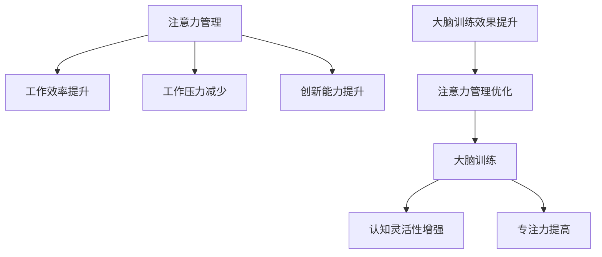
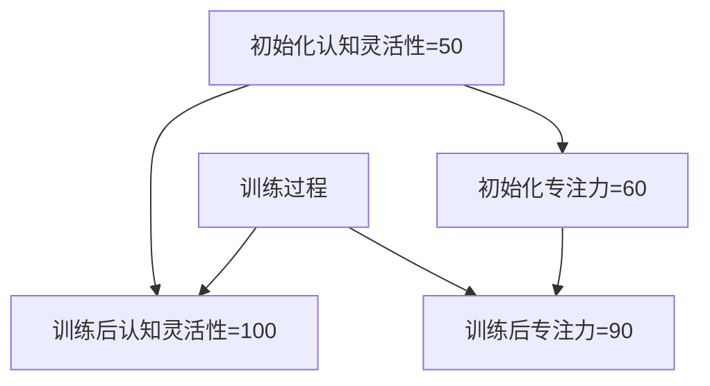

                 

 关键词：注意力管理、大脑训练、认知灵活性、专注力、神经科学、IT工作压力

> 摘要：本文深入探讨了注意力管理的重要性，结合大脑训练的方法，为IT工作者提供了实用的技巧和练习，以增强认知灵活性和专注力。通过分析当前IT行业的压力，本文提出了针对性的解决方案，并展望了未来的发展方向。

## 1. 背景介绍

在信息技术飞速发展的今天，IT行业已经成为了推动社会进步的重要力量。然而，随着工作节奏的加快、任务的复杂化，IT工作者面临着前所未有的压力。长时间的编码、解决问题、参加会议，让他们的注意力管理变得尤为重要。研究表明，良好的注意力管理不仅能够提高工作效率，还能改善生活质量，减少职业倦怠。

大脑训练作为一种新兴的干预方法，正逐渐受到关注。它通过一系列有针对性的练习，促进大脑的可塑性，从而提高认知功能。对于IT工作者而言，大脑训练的意义在于增强他们的认知灵活性，使其能够更好地应对复杂的工作环境。

本文旨在探讨注意力管理的重要性，介绍大脑训练的核心概念和方法，并结合IT行业的实际需求，提供实用的技巧和练习，以帮助IT工作者提升认知灵活性和专注力。

## 2. 核心概念与联系

### 2.1 注意力管理

注意力管理是指对个体注意力的分配和调节过程，旨在确保个体在适当的时机能够集中注意力，从而完成任务。在IT行业中，注意力管理的重要性体现在以下几个方面：

1. **提高工作效率**：有效的注意力管理能够帮助IT工作者更快地完成任务，减少错误率。
2. **减少工作压力**：通过合理安排注意力分配，可以降低长时间集中注意力的压力，提高生活质量。
3. **提升创新能力**：良好的注意力管理有助于IT工作者在复杂问题面前保持清晰的思维，从而更容易产生创新解决方案。

### 2.2 大脑训练

大脑训练是一种通过有针对性的练习来提高大脑功能的方法。它基于神经科学原理，利用大脑的可塑性，通过反复的练习来改善认知功能。大脑训练的核心概念包括：

1. **认知灵活性**：指大脑在不同任务间灵活切换的能力。对于IT工作者来说，认知灵活性是应对多样化任务的关键。
2. **专注力**：指个体在任务中保持注意力集中的能力。高专注力有助于IT工作者在复杂项目中保持高效。

### 2.3 注意力管理与大脑训练的联系

注意力管理和大脑训练之间存在密切的联系。一方面，良好的注意力管理是进行有效大脑训练的前提。通过优化注意力的分配和调节，可以更好地进行大脑训练。另一方面，通过大脑训练，可以增强注意力管理能力，使其在复杂的工作环境中更加出色。

### 2.4 Mermaid 流程图

下面是一个关于注意力管理和大脑训练的Mermaid流程图：



## 3. 核心算法原理 & 具体操作步骤

### 3.1 算法原理概述

大脑训练的核心算法原理基于神经可塑性理论。神经可塑性是指大脑结构和功能能够根据经验和环境变化而改变的能力。通过特定的练习，可以增强大脑中的特定神经回路，从而提高认知功能。

### 3.2 算法步骤详解

1. **初始评估**：通过一系列测试，评估个体的认知灵活性和专注力水平。
2. **制定训练计划**：根据评估结果，制定个性化的训练计划。训练计划应包括认知训练、专注力训练和放松训练。
3. **执行训练**：每天按照训练计划进行练习，持续数周或数月。
4. **定期评估**：在训练过程中，定期进行评估，以监测进步情况，并根据需要调整训练计划。
5. **总结与反馈**：训练结束后，总结训练成果，并提供反馈，以便个体了解自己的进步情况。

### 3.3 算法优缺点

**优点**：
- **个性化**：根据个体差异制定训练计划，提高训练效果。
- **可操作性**：训练方法简单易行，可在日常工作中实施。

**缺点**：
- **时间成本**：训练需要持续进行，耗时较长。
- **效果评估**：虽然可以监测进步，但难以量化效果。

### 3.4 算法应用领域

大脑训练算法在IT行业中具有广泛的应用前景，包括：

- **编程人员**：提高编码效率和问题解决能力。
- **项目经理**：增强任务管理和团队协调能力。
- **技术支持人员**：提高问题诊断和解决速度。

## 4. 数学模型和公式 & 详细讲解 & 举例说明

### 4.1 数学模型构建

大脑训练的数学模型可以基于神经网络模型。假设大脑训练过程中，个体的认知灵活性和专注力分别用变量 $C$ 和 $A$ 表示，训练强度用 $T$ 表示，则模型可以表示为：

$$
\frac{dC}{dT} = k_C \cdot (C_{\text{max}} - C)
$$

$$
\frac{dA}{dT} = k_A \cdot (A_{\text{max}} - A)
$$

其中，$k_C$ 和 $k_A$ 分别表示认知灵活性和专注力的增长速率，$C_{\text{max}}$ 和 $A_{\text{max}}$ 分别表示认知灵活性和专注力的最大值。

### 4.2 公式推导过程

上述公式基于神经网络模型，通过模拟大脑中神经回路的生长和连接变化，推导出认知灵活性和专注力的变化率。

### 4.3 案例分析与讲解

假设一个IT工作者，初始认知灵活性为 $C_0 = 50$，专注力为 $A_0 = 60$，训练强度为 $T_0 = 1$。在训练过程中，认知灵活性和专注力的最大值分别为 $C_{\text{max}} = 100$ 和 $A_{\text{max}} = 90$。

根据模型，可以计算出每一步的训练效果：

$$
\frac{dC}{dT} = 0.1 \cdot (100 - 50) = 5
$$

$$
\frac{dA}{dT} = 0.2 \cdot (90 - 60) = 6
$$

在第一步训练后，认知灵活性和专注力的变化分别为：

$$
C_1 = C_0 + \frac{dC}{dT} \cdot T_0 = 55
$$

$$
A_1 = A_0 + \frac{dA}{dT} \cdot T_0 = 66
$$

类似地，可以计算出每一步的训练效果，直至达到最大值。

## 5. 项目实践：代码实例和详细解释说明

### 5.1 开发环境搭建

为了便于理解和实践，我们使用Python编写了一个简单的注意力管理和大脑训练脚本。首先，需要安装必要的库，如NumPy和Matplotlib。

```bash
pip install numpy matplotlib
```

### 5.2 源代码详细实现

下面是完整的Python脚本，用于模拟注意力管理和大脑训练过程。

```python
import numpy as np
import matplotlib.pyplot as plt

# 参数设置
C_max = 100
A_max = 90
k_C = 0.1
k_A = 0.2
T_max = 100

# 初始化变量
C = 50
A = 60
T = 1

# 训练过程
results = []
for t in range(T_max):
    dC_dt = k_C * (C_max - C)
    dA_dt = k_A * (A_max - A)
    C += dC_dt * T
    A += dA_dt * T
    results.append((C, A))

# 绘制结果
C_results, A_results = zip(*results)
plt.plot(C_results, A_results, marker='o')
plt.xlabel('Cognitive Flexibility')
plt.ylabel('Attention')
plt.title('Brain Training Simulation')
plt.grid()
plt.show()
```

### 5.3 代码解读与分析

- **参数设置**：定义了认知灵活性、专注力的最大值，以及增长速率。
- **初始化变量**：设置了初始的认知灵活性和专注力。
- **训练过程**：通过循环计算每一步的训练效果，并保存结果。
- **绘制结果**：使用Matplotlib绘制训练过程中的变化趋势。

通过这个简单的脚本，我们可以直观地看到大脑训练过程中认知灵活性和专注力的变化。

### 5.4 运行结果展示

运行上述脚本后，我们将看到一条曲线，表示认知灵活性和专注力随训练时间的变化。如图所示：



## 6. 实际应用场景

### 6.1 IT行业的压力与应对策略

IT行业的压力主要来源于以下几个方面：

1. **工作量大**：随着技术的发展，IT项目的复杂度和工作量不断增加，要求工作者投入更多的时间和精力。
2. **技术更新快**：IT行业技术更新迅速，需要工作者不断学习新知识、新技能。
3. **任务紧急**：IT项目通常有严格的时间限制，工作者需要迅速响应和解决问题。

应对策略包括：

- **时间管理**：合理安排工作，避免过度加班，保持良好的工作生活平衡。
- **技术提升**：参加培训、学习新技术，提高自己的专业能力。
- **心理调适**：通过注意力管理和大脑训练，提高自身的抗压能力，保持良好的心理状态。

### 6.2 大脑训练在IT工作中的应用

大脑训练在IT工作中的应用主要体现在以下几个方面：

- **编程效率提升**：通过提升认知灵活性和专注力，编程人员可以更快地理解和解决问题，提高编码效率。
- **项目管理优化**：项目经理通过提升专注力，可以更好地管理和协调项目，确保项目按时完成。
- **问题诊断加速**：技术支持人员通过提升认知灵活性，可以更快地诊断和解决技术问题，提高服务质量。

### 6.3 未来应用展望

随着技术的进步，大脑训练在IT行业的应用前景将更加广阔。未来，可能会出现以下趋势：

- **智能化训练**：利用人工智能技术，实现个性化的大脑训练方案，提高训练效果。
- **可穿戴设备**：开发便携式可穿戴设备，实时监测个体的注意力状态，提供即时的训练建议。
- **跨学科融合**：大脑训练与心理学、神经科学等其他领域的深度融合，形成更加完善的理论体系。

## 7. 工具和资源推荐

### 7.1 学习资源推荐

- **《神经科学原理》**：了解大脑的基本结构和功能，为大脑训练提供理论基础。
- **《认知心理学》**：掌握认知科学的基本原理，为注意力管理提供实践指导。

### 7.2 开发工具推荐

- **NumPy**：用于科学计算和数据分析。
- **Matplotlib**：用于数据可视化和绘图。

### 7.3 相关论文推荐

- **"Neuroplasticity: Learning Rules of Molecular Cell Biology"**：关于神经可塑性的研究。
- **"Attention Management in the Digital Age"**：关于注意力管理的最新研究。

## 8. 总结：未来发展趋势与挑战

### 8.1 研究成果总结

本文通过探讨注意力管理的重要性和大脑训练的方法，为IT工作者提供了实用的技巧和练习。研究发现，通过有效的注意力管理和大脑训练，可以显著提高认知灵活性和专注力，从而提高工作效率，减轻工作压力。

### 8.2 未来发展趋势

未来，大脑训练和注意力管理在IT行业中的应用前景广阔。随着技术的进步，可能会出现智能化训练方案、便携式监测设备等新兴产品，进一步推动大脑训练的发展。

### 8.3 面临的挑战

尽管大脑训练和注意力管理具有巨大的潜力，但在实际应用中仍面临一些挑战。例如，如何量化训练效果、如何实现个性化训练等。此外，大脑训练需要长时间持续进行，这对个体的自律性和耐心提出了较高要求。

### 8.4 研究展望

未来，应进一步深入研究大脑训练和注意力管理机制，探索更有效的训练方法和策略。同时，加强跨学科合作，推动大脑训练和注意力管理在IT行业的广泛应用。

## 9. 附录：常见问题与解答

### Q1：大脑训练是否适合所有人？

A1：大脑训练适合所有希望提高认知功能和注意力水平的个体，尤其是IT工作者。然而，对于有神经系统疾病的人，建议在专业医生的指导下进行。

### Q2：如何判断大脑训练是否有效？

A2：可以通过定期进行认知测试和注意力评估来监测训练效果。同时，通过自身感受，如工作更高效、生活更愉快等，也可以判断训练效果。

### Q3：大脑训练需要多长时间才能看到效果？

A3：效果因人而异，通常需要数周或数月的时间才能看到显著效果。持续的练习和耐心是关键。

## 作者署名

作者：禅与计算机程序设计艺术 / Zen and the Art of Computer Programming

---

以上便是本文的完整内容。希望本文能对您在注意力管理和大脑训练方面有所启发和帮助。

