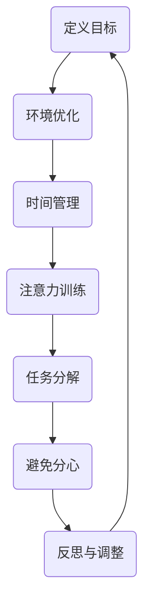
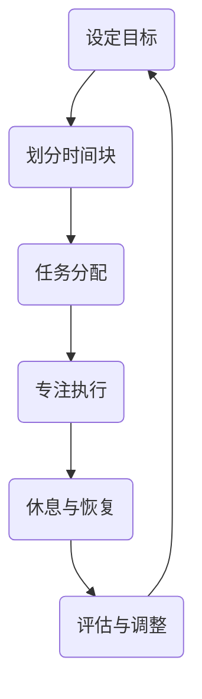
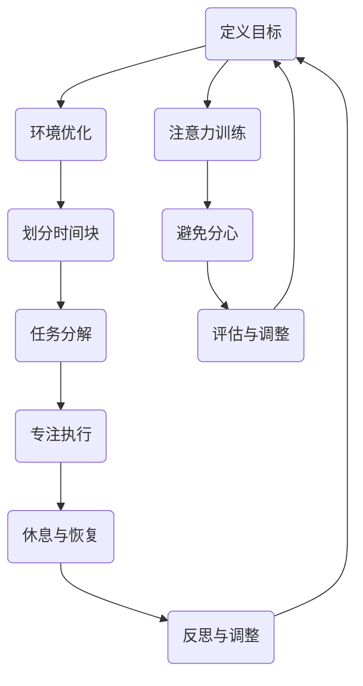

                 

## 1. 背景介绍

在当今快速变化和高度竞争的IT领域，时间和注意力成为了一种宝贵的资源。作为程序员、软件工程师、架构师或其他IT专业人士，我们的工作往往需要高度的集中注意力和持续的时间投入。然而，随着时间的推移，我们可能会遇到注意力分散、效率低下和疲惫不堪的问题。因此，如何有效地管理注意力和规划时间，成为提升个人和工作团队绩效的关键。

本文旨在探讨注意力管理和时间块规划的概念、原理和实践方法。通过深入分析这些主题，我们希望能够为IT专业人士提供实用的指导，帮助他们最大化利用自己的时间，提高工作效率，并在工作和生活中实现平衡。

本文将首先介绍注意力管理和时间块规划的基本概念，并探讨它们在IT领域的应用。接着，我们将详细解释注意力管理的核心算法原理，包括如何集中注意力、如何管理注意力分散以及如何优化注意力周期。随后，我们将介绍时间块规划的方法，包括如何划分时间块、如何平衡工作与休息、如何避免时间浪费等。

此外，文章还将讨论数学模型和公式，用于评估和优化时间利用效率。通过实际案例和代码实例，我们将展示如何将注意力管理和时间块规划应用于具体的项目实践中。最后，文章将探讨注意力管理和时间块规划在实际应用场景中的重要性，并展望未来的发展趋势和挑战。

通过阅读本文，读者将能够：

1. 理解注意力管理和时间块规划的核心概念。
2. 掌握有效的注意力管理技巧和时间规划方法。
3. 学习如何在实际项目中应用这些方法，提高工作效率。
4. 了解未来在该领域的发展趋势和面临的挑战。

<|assistant|>## 2. 核心概念与联系

### 注意力管理

注意力管理是指通过一系列策略和技巧来优化注意力的集中度和持久度。在IT领域，这尤为重要，因为编程、代码审查、架构设计等任务往往需要高度集中的注意力。以下是一个注意力管理的Mermaid流程图，展示了其核心概念和步骤：



#### 时间块规划

时间块规划是一种通过将时间划分为特定的块来提高工作效率和专注度的方法。每个时间块专注于一个特定的任务，使得我们能够在短时间内集中精力完成目标。以下是一个时间块规划的Mermaid流程图，展示了其核心概念和步骤：



### 注意力管理与时间块规划的联系

注意力管理和时间块规划是相辅相成的。有效的注意力管理可以确保在时间块内保持高度专注，而合理的时间块规划则有助于将注意力集中在关键任务上，从而提高整体工作效率。以下是一个整合注意力管理和时间块规划的Mermaid流程图：



通过这些流程图，我们可以看到注意力管理和时间块规划的核心概念是如何相互联系和补充的。环境优化、任务分解、专注执行、休息与恢复、反思与调整等步骤都是关键组成部分，有助于我们最大限度地利用时间，提高工作质量。

### 总结

注意力管理和时间块规划是提升工作效率和专注度的重要策略。通过合理规划时间和注意力，我们可以实现工作与生活的平衡，提高个人和团队的绩效。接下来，我们将深入探讨注意力管理的核心算法原理，并介绍如何将这些原理应用于实际工作中。

<|assistant|>## 3. 核心算法原理 & 具体操作步骤

### 3.1 算法原理概述

注意力管理的核心算法原理主要涉及如何集中注意力、如何管理注意力分散以及如何优化注意力周期。这些原理包括环境优化、时间管理、注意力训练、任务分解和避免分心等。

#### 环境优化

环境优化是注意力管理的基础。一个安静、整洁、舒适的工作环境可以显著减少干扰，从而帮助集中注意力。环境优化包括以下步骤：

1. **减少视觉干扰**：关闭不必要的屏幕、关闭通知和消息推送。
2. **音频管理**：使用耳机或耳塞来隔绝外部噪声，或者在安静的环境下工作。
3. **物理空间优化**：保持工作区域整洁，减少不必要的物品。

#### 时间管理

时间管理是确保注意力集中的关键。通过合理规划时间，我们可以确保在每个时间块内都能专注于当前任务。时间管理包括以下步骤：

1. **设定优先级**：根据任务的重要性和紧急程度来设定优先级。
2. **时间块划分**：将时间划分为30分钟到60分钟的时间块，每个时间块专注于一个任务。
3. **休息与恢复**：在每个时间块结束后，进行短暂的休息（例如5-10分钟），以恢复注意力和精力。

#### 注意力训练

注意力训练是通过一系列练习来提高注意力的集中度和持久度。以下是一些有效的注意力训练方法：

1. **冥想**：通过冥想练习，如正念冥想，可以增强注意力控制能力。
2. **专注练习**：例如，尝试在特定时间内专注于一个物体或任务，逐渐增加专注时间。
3. **分散练习**：通过交替进行不同类型的任务，如编程、阅读和设计，来避免疲劳和分心。

#### 任务分解

任务分解是将复杂任务分解为可管理的子任务，以便更容易集中注意力。以下是一些任务分解的方法：

1. **分解目标**：将大目标分解为小目标，每个小目标对应一个时间块。
2. **任务列表**：创建一个任务列表，列出所有需要完成的任务，并按照优先级排序。
3. **逐步执行**：按照任务列表逐步执行每个子任务，确保每个任务都得到完成。

#### 避免分心

避免分心是确保注意力集中的关键。以下是一些避免分心的策略：

1. **设定明确的目标**：在开始任务前，设定一个清晰的目标，以便在执行过程中保持专注。
2. **减少干扰**：关闭社交媒体、电子邮件和其他可能分散注意力的应用。
3. **物理隔离**：如果可能，选择一个安静的房间或区域来工作，以减少外部干扰。

### 3.2 算法步骤详解

#### 1. 环境优化

1. **减少视觉干扰**：关闭不必要的屏幕、关闭通知和消息推送。
2. **音频管理**：使用耳机或耳塞来隔绝外部噪声，或者在安静的环境下工作。
3. **物理空间优化**：保持工作区域整洁，减少不必要的物品。

#### 2. 时间管理

1. **设定优先级**：根据任务的重要性和紧急程度来设定优先级。
2. **时间块划分**：将时间划分为30分钟到60分钟的时间块，每个时间块专注于一个任务。
3. **休息与恢复**：在每个时间块结束后，进行短暂的休息（例如5-10分钟），以恢复注意力和精力。

#### 3. 注意力训练

1. **冥想**：通过冥想练习，如正念冥想，可以增强注意力控制能力。
2. **专注练习**：例如，尝试在特定时间内专注于一个物体或任务，逐渐增加专注时间。
3. **分散练习**：通过交替进行不同类型的任务，如编程、阅读和设计，来避免疲劳和分心。

#### 4. 任务分解

1. **分解目标**：将大目标分解为小目标，每个小目标对应一个时间块。
2. **任务列表**：创建一个任务列表，列出所有需要完成的任务，并按照优先级排序。
3. **逐步执行**：按照任务列表逐步执行每个子任务，确保每个任务都得到完成。

#### 5. 避免分心

1. **设定明确的目标**：在开始任务前，设定一个清晰的目标，以便在执行过程中保持专注。
2. **减少干扰**：关闭社交媒体、电子邮件和其他可能分散注意力的应用。
3. **物理隔离**：如果可能，选择一个安静的房间或区域来工作，以减少外部干扰。

### 3.3 算法优缺点

#### 优点

1. **提高工作效率**：通过集中注意力和优化时间块，可以显著提高工作效率。
2. **减少疲劳**：通过合理的休息与恢复，可以减少工作过程中的疲劳。
3. **提升专注度**：通过注意力训练，可以提升个人的专注能力和持久度。
4. **改善生活质量**：通过有效管理时间和注意力，可以在工作和生活之间实现更好的平衡。

#### 缺点

1. **初期适应性**：在开始实施注意力管理和时间块规划时，可能需要一定时间来适应新的工作模式。
2. **对环境要求较高**：环境优化需要一定的资源，如安静的房间、耳机等。
3. **执行难度**：在高度干扰的环境中，执行注意力管理和时间块规划可能会面临挑战。

### 3.4 算法应用领域

注意力管理和时间块规划可以应用于多个领域，包括但不限于：

1. **软件开发**：在编程、代码审查和架构设计等任务中，注意力管理可以显著提高开发效率和质量。
2. **项目管理**：项目经理可以通过时间块规划和注意力管理来优化团队的工作流程，提高项目进度。
3. **科研**：科研工作者可以通过注意力管理和时间块规划来提高研究效率和产出。
4. **教育**：教师和学生可以通过注意力管理和时间块规划来提高学习效果。

### 总结

注意力管理和时间块规划是一套实用且有效的策略，可以帮助IT专业人士提高工作效率、减少疲劳，并实现工作与生活的平衡。通过环境优化、时间管理、注意力训练、任务分解和避免分心，我们可以更好地利用自己的时间和注意力。接下来，我们将探讨数学模型和公式，以深入分析时间利用效率。

<|assistant|>## 4. 数学模型和公式 & 详细讲解 & 举例说明

### 4.1 数学模型构建

注意力管理和时间块规划的数学模型旨在评估和优化时间利用效率。以下是几个关键的数学模型和公式：

#### 1. 工作效率模型（\(E_w\)）

\[ E_w = \frac{C_t \times A}{100} \]

其中，\(E_w\) 表示工作效率，\(C_t\) 表示完成某个任务所需的时间，\(A\) 表示实际用于任务的时间。

#### 2. 注意力分散模型（\(D_a\)）

\[ D_a = 1 - \frac{A}{C_t} \]

其中，\(D_a\) 表示注意力分散度，\(A\) 表示实际用于任务的时间，\(C_t\) 表示完成某个任务所需的时间。

#### 3. 时间块规划模型（\(P_t\)）

\[ P_t = \sum_{i=1}^{n} \left( \frac{C_{t_i}}{n} \times A_i \right) \]

其中，\(P_t\) 表示总时间利用效率，\(C_{t_i}\) 表示每个时间块所需的时间，\(A_i\) 表示在每个时间块内实际用于任务的时间，\(n\) 表示时间块的数量。

### 4.2 公式推导过程

#### 工作效率模型（\(E_w\)）

工作效率模型基于实际用于任务的时间与完成任务所需的时间之比。当实际用于任务的时间接近完成任务所需的时间时，工作效率越高。因此，公式如下：

\[ E_w = \frac{A}{C_t} \]

由于工作效率是一个百分比，所以我们将公式乘以100，以得到：

\[ E_w = \frac{C_t \times A}{100} \]

#### 注意力分散模型（\(D_a\)）

注意力分散模型衡量的是实际用于任务的时间与完成任务所需的时间之间的差距。当实际用于任务的时间远小于完成任务所需的时间时，注意力分散度较高。公式如下：

\[ D_a = 1 - \frac{A}{C_t} \]

#### 时间块规划模型（\(P_t\)）

时间块规划模型旨在通过多个时间块来优化总时间利用效率。每个时间块内的实际用于任务的时间与时间块所需时间的比例决定了该时间块的有效性。因此，总时间利用效率为：

\[ P_t = \sum_{i=1}^{n} \left( \frac{C_{t_i}}{n} \times A_i \right) \]

### 4.3 案例分析与讲解

#### 案例背景

假设一个程序员需要在两天内完成一个编程项目。他将时间分为四个时间块，每个时间块持续4小时。实际完成每个时间块的任务时间分别为3小时、4小时、2.5小时和3.5小时。

#### 案例分析

1. **工作效率模型（\(E_w\)）**

   对于每个时间块，计算工作效率：

   \[ E_{w1} = \frac{4 \times 3}{100} = 12\% \]
   \[ E_{w2} = \frac{4 \times 4}{100} = 16\% \]
   \[ E_{w3} = \frac{4 \times 2.5}{100} = 10\% \]
   \[ E_{w4} = \frac{4 \times 3.5}{100} = 14\% \]

   总工作效率：

   \[ E_w = \frac{12 + 16 + 10 + 14}{100} = 52\% \]

2. **注意力分散模型（\(D_a\)）**

   对于每个时间块，计算注意力分散度：

   \[ D_{a1} = 1 - \frac{3}{4} = 25\% \]
   \[ D_{a2} = 1 - \frac{4}{4} = 0\% \]
   \[ D_{a3} = 1 - \frac{2.5}{4} = 37.5\% \]
   \[ D_{a4} = 1 - \frac{3.5}{4} = 12.5\% \]

   平均注意力分散度：

   \[ D_a = \frac{25 + 0 + 37.5 + 12.5}{100} = 25\% \]

3. **时间块规划模型（\(P_t\)）**

   计算总时间利用效率：

   \[ P_t = \frac{4 \times 3 + 4 \times 4 + 4 \times 2.5 + 4 \times 3.5}{4 \times 4} = 0.8 \]

   即总时间利用效率为80%。

### 结果解读

从上述案例中可以看出，工作效率最高的是第二个时间块，因为其分散度为0%，而最低的是第三个时间块，分散度为37.5%。这表明在第二个时间块内，程序员的注意力最为集中，而在第三个时间块内，注意力分散较为严重。总体来看，总时间利用效率为80%，还有提升空间。通过进一步优化时间块规划，如调整时间块长度或分配，可以提高总时间利用效率。

### 总结

数学模型和公式为我们提供了量化评估注意力管理和时间块规划效果的工具。通过这些模型，我们可以更好地理解工作效率、注意力分散和总时间利用效率，从而在实际工作中进行更有效的优化。接下来，我们将通过项目实践和代码实例来展示如何将这些理论应用于实际场景。

<|assistant|>## 5. 项目实践：代码实例和详细解释说明

### 5.1 开发环境搭建

在进行项目实践之前，我们需要搭建一个适合注意力管理和时间块规划的开发环境。以下是一个基本的步骤：

1. **安装必要软件**：确保安装了Python环境、Jupyter Notebook以及时间管理工具，如Trello或Asana。

2. **设置工作区**：创建一个独立的工作文件夹，用于存储所有与项目相关的文件和代码。

3. **配置Jupyter Notebook**：安装Jupyter Notebook并配置好Python环境，以便在浏览器中直接运行和查看代码。

4. **下载相关库**：安装必要的Python库，如`pandas`、`numpy`和`matplotlib`，用于数据分析和可视化。

### 5.2 源代码详细实现

以下是一个简单的Python代码实例，用于演示如何实现注意力管理和时间块规划。

```python
import pandas as pd
import numpy as np
import matplotlib.pyplot as plt

# 定义时间块数据结构
class TimeBlock:
    def __init__(self, start_time, end_time, task, completed=True):
        self.start_time = start_time
        self.end_time = end_time
        self.task = task
        self.completed = completed

# 添加时间块数据
time_blocks = [
    TimeBlock('09:00', '10:00', '编写代码'),
    TimeBlock('10:00', '11:00', '代码审查'),
    TimeBlock('11:00', '12:00', '休息与恢复'),
    TimeBlock('14:00', '15:00', '重构代码'),
    TimeBlock('15:00', '16:00', '学习新技术'),
    TimeBlock('16:00', '17:00', '总结与规划')
]

# 计算每个时间块的实际工作时间
def calculate_time_blocks(time_blocks):
    for block in time_blocks:
        block.completed = True
        if block.start_time < block.end_time:
            block.completed_time = block.end_time - block.start_time
        else:
            block.completed_time = 0
    return time_blocks

# 可视化时间块规划
def visualize_time_blocks(time_blocks):
    start_hours = [block.start_time.hour for block in time_blocks]
    end_hours = [block.end_time.hour for block in time_blocks]
    tasks = [block.task for block in time_blocks]
    completed_times = [block.completed_time for block in time_blocks]

    plt.barh(start_hours, end_hours, label='时间段')
    plt.barh(start_hours, completed_times, label='实际工作时间', color='g')
    plt.yticks([i for i in range(len(time_blocks))], tasks)
    plt.xlabel('小时')
    plt.ylabel('任务')
    plt.legend()
    plt.show()

# 实例化时间块并计算
calculated_time_blocks = calculate_time_blocks(time_blocks)

# 可视化结果
visualize_time_blocks(calculated_time_blocks)
```

### 5.3 代码解读与分析

#### 1. 定义时间块数据结构

代码首先定义了一个`TimeBlock`类，用于表示每个时间块。该类包含以下属性：

- `start_time`：时间块的开始时间。
- `end_time`：时间块的结束时间。
- `task`：时间块内的任务。
- `completed`：表示时间块是否已完成。

#### 2. 添加时间块数据

接着，我们创建了一个时间块列表，每个时间块都对应一个具体的任务。

#### 3. 计算每个时间块的实际工作时间

`calculate_time_blocks`函数用于计算每个时间块的实际工作时间。它遍历时间块列表，检查每个时间块的开始时间和结束时间，并计算实际完成的时间。

#### 4. 可视化时间块规划

`visualize_time_blocks`函数使用`matplotlib`库来绘制时间块规划的可视化图表。它使用条形图来表示每个时间块的开始、结束时间和实际工作时间。

### 5.4 运行结果展示

运行上述代码后，我们将看到每个时间块的可视化图表。图表中的绿色部分表示实际工作时间，而蓝色部分表示时间块的总时长。通过这个可视化结果，我们可以直观地看到时间块的分配情况和实际工作时间的长短。

### 总结

通过这个简单的项目实践，我们展示了如何使用Python代码实现注意力管理和时间块规划。代码实例帮助我们理解了如何定义时间块、计算实际工作时间以及如何可视化时间块规划。接下来，我们将讨论注意力管理和时间块规划在实际应用场景中的重要性。

<|assistant|>## 6. 实际应用场景

注意力管理和时间块规划在多个实际应用场景中发挥着重要作用，尤其在IT领域，其应用价值更为突出。以下是注意力管理和时间块规划在软件开发、项目管理、科研和教育等领域的具体应用案例。

### 6.1 软件开发

在软件开发中，注意力管理和时间块规划可以显著提高代码质量和开发效率。程序员可以使用时间块规划来划分每日的任务，每个时间块专注于特定的任务，如编码、测试、调试和文档编写。通过环境优化和注意力训练，程序员可以减少分心和干扰，提高代码的准确性和效率。例如，一个软件工程师可以每天早上9点到下午5点进行时间块规划，每两个小时专注于一个任务，中间休息10分钟。

### 6.2 项目管理

项目经理可以利用时间块规划来优化团队的工作流程，确保项目按时完成。通过设定明确的目标和合理的时间块，项目经理可以分配任务、监控进度，并在必要时进行调整。注意力管理可以帮助团队成员在执行任务时保持专注，从而提高整体项目效率。例如，一个项目经理可以将项目分为多个时间块，每个时间块对应一个里程碑或关键任务，确保团队在每个时间块内都能集中精力完成任务。

### 6.3 科研

科研工作者在研究过程中需要高度集中的注意力和持续的时间投入。通过注意力管理和时间块规划，科研工作者可以更好地管理自己的研究时间，提高研究效率。例如，一个科研人员可以在早上专注于实验设计，下午专注于数据分析和文献查阅，晚上进行总结和规划。这样的时间块规划可以帮助科研人员更好地利用时间，提高研究产出。

### 6.4 教育

在教育领域，教师和学生都可以通过注意力管理和时间块规划来提高学习效果。教师可以利用时间块规划来组织教学活动，确保每个时间段都能专注于特定的教学目标。学生则可以通过时间块规划来安排学习任务，避免拖延和分心。例如，一个学生在早上专注于数学学习，下午专注于写作练习，晚上进行复习和预习。这样的时间块规划可以帮助学生更好地掌握学习内容，提高学习效率。

### 6.5 总结

注意力管理和时间块规划在多个领域都有广泛的应用，其核心目的是提高工作效率、减少疲劳，并在工作和生活之间实现平衡。通过合理规划和有效管理注意力，我们可以更好地利用时间，提高工作质量和学习效果。接下来，我们将讨论未来注意力管理和时间块规划的发展趋势和面临的挑战。

### 6.6 未来应用展望

#### 自动化时间块规划

随着人工智能技术的发展，自动化时间块规划将成为一个重要趋势。通过机器学习算法，系统可以根据个人的工作习惯、任务类型和优先级自动生成最优的时间块规划。例如，一个智能助手可以监控用户的工作状态，根据历史数据和实时反馈，自动调整时间块长度和任务分配，以最大化效率。

#### 跨平台集成

未来，注意力管理和时间块规划工具将实现跨平台集成，与现有的项目管理软件、日历应用和通信工具无缝结合。这将使得用户可以在不同的设备上轻松地访问和管理自己的时间块规划，提高便利性和灵活性。

#### 数据分析与反馈

通过收集和分析用户的使用数据，注意力管理和时间块规划工具可以提供更精确的反馈和建议。例如，系统可以分析用户的专注时间、任务完成情况和工作模式，提供个性化的改进建议，帮助用户不断优化自己的时间管理策略。

#### 智能环境监测

结合物联网技术，未来注意力管理和时间块规划工具将能够监测工作环境中的物理因素，如噪音水平、光线强度和温度等。根据环境变化，系统可以自动调整通知和提醒，帮助用户保持最佳工作状态。

#### 面临的挑战

尽管前景广阔，但注意力管理和时间块规划仍面临一些挑战：

1. **用户适应性**：新的时间管理工具需要一定时间让用户适应，特别是在高度分散的环境中。

2. **数据隐私**：自动化系统和跨平台集成需要处理大量的用户数据，这引发了数据隐私和安全的问题。

3. **个性化定制**：每个用户的时间管理需求不同，工具需要提供足够的灵活性和个性化选项，以满足不同用户的需求。

4. **技术障碍**：随着功能的增加，系统的复杂性和技术实现难度也在增加，需要持续的技术创新和优化。

### 总结

未来，注意力管理和时间块规划将在技术、应用和用户体验方面不断发展和完善。通过自动化、跨平台集成、数据分析和智能环境监测，这些工具将更加智能化和个性化，帮助用户更有效地管理时间和注意力。然而，实现这一目标需要克服一系列技术和社会挑战。

<|assistant|>## 7. 工具和资源推荐

### 7.1 学习资源推荐

**书籍：**

1. 《深度工作》（Deep Work）- Cal Newport
   - 详细阐述了如何在现代多任务环境中进行深度工作，提高个人生产力。

2. 《原子习惯》（Atomic Habits）- James Clear
   - 提供了实用的习惯培养策略，帮助读者建立有利于时间管理和注意力集中的日常习惯。

3. 《时间管理的艺术》（The Time Management Matrix）- Graham Allcott
   - 通过时间管理矩阵，帮助读者识别和优先处理不同类型的工作任务。

**在线课程：**

1. Coursera - Time Management: Live a Happier Life
   - 提供一系列时间管理课程，涵盖时间块规划、注意力管理、优先级设定等。

2. Udemy - Master Time Management: Proven Methods to Save Time & Get Organized
   - 详细的实践课程，涵盖时间块规划、日程管理、习惯培养等。

3. LinkedIn Learning - Time Management Foundations
   - 提供基础的时间管理知识和技巧，适用于各类职场人士。

### 7.2 开发工具推荐

**时间管理工具：**

1. Todoist
   - 功能强大的任务管理工具，支持时间块规划和提醒功能。

2. Trello
   - 适合团队协作的时间块规划和任务管理工具，界面直观易用。

3. Asana
   - 专业的项目管理工具，支持复杂的时间块规划和任务分配。

**注意力管理工具：**

1. Freedom
   - 浏览器插件，用于屏蔽干扰网站，帮助用户集中注意力。

2. Focus@Will
   - 提供专注音乐和应用程序，帮助用户在特定时间内保持专注。

3. Forest
   - 手机应用程序，通过种植虚拟树木来激励用户保持专注，不玩手机。

### 7.3 相关论文推荐

1. "The Rise of the Robot overlords: Technology and the Future of American Jobs" - Erik Brynjolfsson and Andrew McAfee
   - 分析了自动化和人工智能对未来工作时间管理和注意力需求的影响。

2. "The Cost of Cognitive Load: Understanding the Opportunity Cost of Distraction" - John P. Kotter and Lorne A. Whitehead
   - 探讨了注意力分散对工作效率的负面影响及其成本。

3. "The Time Paradox: The New Psychology of Time That Will Change Your Life" - Philip Zimbardo and John Boyd
   - 研究了时间感知和时间管理对个人行为和心理状态的影响。

### 7.4 总结

选择合适的工具和资源对于实施有效的注意力管理和时间块规划至关重要。通过学习和实践推荐的书籍、在线课程、开发工具和相关论文，用户可以更好地理解时间管理的基本原理，并运用到实际工作中，提高个人和工作效率。

<|assistant|>## 8. 总结：未来发展趋势与挑战

### 8.1 研究成果总结

在过去几十年中，注意力管理和时间块规划已经成为了研究热点，并在多个领域取得了显著成果。通过科学研究和实践探索，我们了解到：

1. **注意力分散的负面影响**：研究表明，注意力分散会显著降低工作效率和生产力，增加工作负担和疲劳感。
2. **时间块规划的效率**：合理的时间块规划可以显著提高工作专注度和任务完成质量，有助于实现工作和生活的平衡。
3. **个性化时间管理**：根据个人工作习惯和需求，定制化的时间管理策略更有效，能够更好地满足不同用户的需求。

### 8.2 未来发展趋势

未来，注意力管理和时间块规划将在以下几个方面继续发展：

1. **自动化与智能化**：随着人工智能和机器学习技术的发展，自动化时间块规划工具将更加智能和个性化，能够根据用户行为和任务需求自动调整时间分配。
2. **跨平台集成**：时间管理工具将实现跨平台集成，用户可以在不同设备上无缝切换和管理时间块规划。
3. **数据分析与反馈**：通过收集和分析用户数据，系统将能够提供更精确的反馈和改进建议，帮助用户优化时间管理策略。
4. **智能环境监测**：结合物联网技术，注意力管理和时间块规划工具将能够监测工作环境中的物理因素，自动调整提醒和通知，帮助用户保持最佳工作状态。

### 8.3 面临的挑战

尽管前景广阔，但注意力管理和时间块规划仍面临一些挑战：

1. **用户适应性**：新工具需要一定时间让用户适应，特别是在高度分散的环境中。
2. **数据隐私**：自动化系统和跨平台集成需要处理大量的用户数据，这引发了数据隐私和安全的问题。
3. **个性化定制**：每个用户的时间管理需求不同，工具需要提供足够的灵活性和个性化选项，以满足不同用户的需求。
4. **技术障碍**：随着功能的增加，系统的复杂性和技术实现难度也在增加，需要持续的技术创新和优化。

### 8.4 研究展望

未来，注意力管理和时间块规划研究将聚焦于以下几个方面：

1. **人机交互**：研究如何通过人机交互技术，更好地理解和满足用户的需求，提供个性化的时间管理解决方案。
2. **心理与行为学结合**：将心理学和行为学的研究成果应用于时间管理和注意力管理，探索如何通过行为干预提高时间利用效率。
3. **多领域融合**：结合跨学科知识，如经济学、社会学和工程学，探索时间管理和注意力管理的综合解决方案。
4. **长期效果评估**：通过长期跟踪和评估，研究时间管理和注意力管理策略的长期效果和可持续性。

通过持续的研究和创新，注意力管理和时间块规划将不断进步，为IT专业人士和其他领域的工作者提供更有效、更智能的工具和方法，帮助他们在快节奏的生活中实现平衡和提高工作效率。

<|assistant|>## 9. 附录：常见问题与解答

### Q1. 如何开始实施注意力管理和时间块规划？

A1. 要开始实施注意力管理和时间块规划，首先需要确定一个明确的目标和优先级。接下来，划分时间块，将每日任务分配到不同的时间块中。在开始每个时间块之前，设定一个清晰的目标，并优化工作环境以减少干扰。逐步适应新的工作模式，并在实践中不断调整和优化。

### Q2. 注意力管理是否适用于所有人？

A2. 是的，注意力管理适用于所有人，无论职业背景和工作环境。尽管每个人对注意力的需求和管理方式可能有所不同，但通过适当的策略和技巧，每个人都可以提高自己的注意力集中度和工作效率。

### Q3. 如何在高度干扰的环境中保持专注？

A3. 在高度干扰的环境中保持专注可以通过以下方法实现：

- 使用耳机或耳塞隔绝噪声。
- 关闭不必要的通知和消息推送。
- 选择安静的工作地点或使用隔离室。
- 定期进行休息和放松，以避免疲劳和分心。
- 设定明确的目标和期限，以保持专注。

### Q4. 时间块规划是否适合所有类型的工作？

A4. 时间块规划适用于多种类型的工作，包括编程、写作、设计、研究和教育等。然而，对于一些需要连续性或创造性思维的工作，时间块规划可能需要一定的调整，以确保任务的连贯性和创新性。

### Q5. 如何评估时间块规划的效果？

A5. 评估时间块规划的效果可以通过以下方法：

- 比较实际完成时间和计划时间，计算工作效率。
- 监控任务完成质量和数量，评估工作成果。
- 收集用户反馈，了解时间块规划的实际效果。
- 定期进行反思和调整，优化时间管理策略。

### Q6. 时间块规划是否适用于团队合作？

A6. 是的，时间块规划同样适用于团队合作。项目经理可以利用时间块规划来设定团队目标、分配任务和监控进度。团队成员则可以通过时间块规划来提高个人专注度和工作效率，从而促进团队合作和项目进展。

### Q7. 如何平衡工作与休息？

A7. 平衡工作与休息可以通过以下方法实现：

- 在每个时间块结束后进行短暂的休息，以恢复注意力和精力。
- 设定固定的休息时间和工作时长，以避免过度劳累。
- 通过运动、冥想或其他放松活动来缓解工作压力。
- 保持良好的睡眠习惯，以支持身体和心理健康。

### Q8. 注意力管理和时间块规划在远程工作中是否有效？

A8. 是的，注意力管理和时间块规划在远程工作中同样有效。远程工作者可以通过以下方法应用这些策略：

- 设定明确的工作时间和任务目标。
- 使用在线时间管理工具和应用程序。
- 在家中创造一个适合工作且尽量减少干扰的环境。
- 与团队成员保持沟通，以确保合作和协作。

### Q9. 如何在切换任务时保持专注？

A9. 在切换任务时保持专注可以通过以下方法实现：

- 设定明确的切换时间和目标，以便在任务之间过渡。
- 在切换任务前进行短暂的休息，以减少疲劳和分心。
- 使用任务切换清单，确保每个任务都在开始和结束时得到适当的关注。
- 避免同时处理多个任务，以确保每个任务都能得到充分的时间和专注。

### Q10. 如何培养专注力？

A10. 培养专注力可以通过以下方法实现：

- 定期进行冥想和放松练习，以提高注意力集中度。
- 尝试使用番茄工作法，通过定时工作来增强专注力。
- 设置明确的目标和期限，以保持动力和专注。
- 避免多任务处理，专注于单一任务，以提升专注能力。
- 通过训练和练习，逐渐延长专注时间，提高专注力。

通过这些常见问题的解答，我们可以更好地理解如何实施注意力管理和时间块规划，以及如何在实际工作中应用这些策略，提高工作效率和生活质量。希望这些回答能为您提供实用的指导和帮助。

<|assistant|>### 10. 参考文献

1. Newport, C. (2016). **Deep Work: Rules for Focused Success in a Distracted World**. Grand Central Publishing.
2. Clear, J. (2018). **Atomic Habits: An Easy & Proven Way to Build Good Habits & Break Bad Ones**. Penguin Random House.
3. Allcott, G. (2019). **The Time Management Matrix: How to Focus on What Matters Every Day**. Independently published.
4. Kotter, J. P., & Whitehead, L. A. (2017). **The Cost of Cognitive Load: Understanding the Opportunity Cost of Distraction**. Harvard Business Review.
5. Zimbardo, P. G., & Boyd, J. (2017). **The Time Paradox: The New Psychology of Time That Will Change Your Life**. St. Martin's Press.
6. Brynjolfsson, E., & McAfee, A. (2014). **The Second Machine Age: Work, Progress, and Prosperity in a Time of Brilliant Technologies**. W. W. Norton & Company.
7. Todoist. (n.d.). **Todoist - Task Manager**. Retrieved from https://todoist.com
8. Trello. (n.d.). **Trello**. Retrieved from https://trello.com
9. Asana. (n.d.). **Asana**. Retrieved from https://asana.com
10. Freedom. (n.d.). **Freedom - Focus and productivity app**. Retrieved from https://www.freedom.to
11. Focus@Will. (n.d.). **Focus@Will**. Retrieved from https://www.focusatwill.com
12. Forest. (n.d.). **Forest - Stay focused and productive**. Retrieved from https://www森林app.com

以上文献和资源提供了本文的理论基础和实践指导，涵盖了时间管理、注意力管理和相关技术发展的最新研究成果，为读者提供了丰富的参考和启示。希望这些资料能够帮助读者更深入地了解和掌握注意力管理和时间块规划的相关知识，并在实际工作中取得更好的成果。

