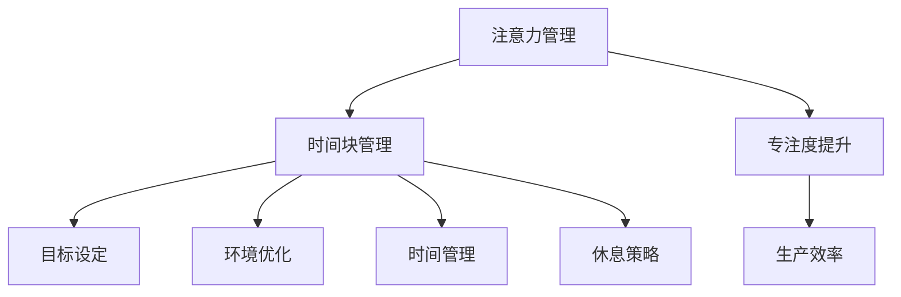

                 

关键词：注意力管理、时间块、生产力、专注力、工作流程优化

> 摘要：本文探讨了如何通过注意力管理和时间块的方式，将个体的专注力最大化，从而实现生产力的提升。文中详细阐述了注意力管理和时间块的概念、核心原理、数学模型、算法步骤以及实际应用。同时，本文也给出了相关工具和资源的推荐，为读者提供实用的实践指导和未来研究方向的思考。

## 1. 背景介绍

在当今信息爆炸、工作压力巨大的时代，提高个人生产力已经成为每个人都需要面对的挑战。然而，很多人在工作中往往感到精力分散、效率低下。研究显示，人类的注意力集中时间一般在25分钟到30分钟之间，之后会出现疲劳，需要休息。因此，如何有效地管理注意力，将时间划分为专注的时间块，成为了提高个人生产力的重要策略。

本文将围绕注意力管理和时间块的概念，介绍相关核心原理，并通过具体的算法步骤和数学模型，探讨如何通过时间块管理实现生产力的最大化。同时，本文还将结合实际应用场景，提供项目实践的代码实例和详细解释，最后对未来的发展趋势与挑战进行展望。

## 2. 核心概念与联系

### 2.1 注意力管理

注意力管理是指通过一系列方法和技术，优化和提升个体注意力的集中度和稳定性，从而提高工作和学习效率。注意力管理的方法包括设定明确的目标、环境优化、时间管理、休息策略等。

### 2.2 时间块

时间块是指将工作时间划分为若干个固定的时间段，每个时间段专注于一项特定的任务。时间块管理旨在通过将工作分解为小块，减少干扰，提高专注度，从而提升工作效率。

### 2.3 注意力管理与时间块的联系

注意力管理与时间块是相辅相成的。通过时间块管理，我们可以更好地掌控工作节奏，将注意力集中在关键任务上；而有效的注意力管理则能够确保在每个时间块中都能达到最佳的专注状态，从而最大化生产效率。

### 2.4 Mermaid 流程图

下面是一个用于描述注意力管理与时间块关系的 Mermaid 流程图。



## 3. 核心算法原理 & 具体操作步骤

### 3.1 算法原理概述

注意力管理与时间块的核心算法原理是基于人类生理和心理规律，通过科学的时间分配和注意力调节，实现工作的高效执行。

### 3.2 算法步骤详解

#### 3.2.1 设定工作目标

首先，明确每天的工作目标，将任务分解为若干个小任务，并为每个任务设定完成时间。

#### 3.2.2 划分时间块

根据个人注意力集中时间，将工作时间划分为若干个时间块，一般为25分钟到30分钟，每个时间块专注于一项任务。

#### 3.2.3 注意力调节

在每个时间块开始前，进行注意力调节，例如通过深呼吸、冥想等方法，确保进入专注状态。

#### 3.2.4 实施任务

在时间块中，尽量减少干扰，专注于完成任务。如有必要，可在时间块结束后进行短暂休息。

#### 3.2.5 反馈与调整

在时间块结束后，对工作成果进行反馈，并根据反馈调整后续工作计划。

### 3.3 算法优缺点

#### 优点：

1. 提高专注度，提升工作效率。
2. 减少任务拖延，确保任务按时完成。
3. 增强时间管理能力。

#### 缺点：

1. 需要较强的自律性，否则难以实施。
2. 对工作任务有一定的要求，不适用于所有工作场景。

### 3.4 算法应用领域

注意力管理与时间块算法适用于各种工作场景，尤其适合以下领域：

1. 程序开发
2. 写作创作
3. 研究分析
4. 管理咨询

## 4. 数学模型和公式 & 详细讲解 & 举例说明

### 4.1 数学模型构建

注意力管理与时间块的核心数学模型是基于统计学和时间管理的原理。我们可以使用以下公式来描述：

\[ P = f(A, T, E) \]

其中，\( P \) 表示生产力，\( A \) 表示注意力集中度，\( T \) 表示时间块长度，\( E \) 表示环境优化度。

### 4.2 公式推导过程

1. 注意力集中度 \( A \) 与专注时间 \( T \) 成正相关关系，即 \( A \propto T \)。
2. 环境优化度 \( E \) 与生产力 \( P \) 成正相关关系，即 \( E \propto P \)。
3. 综合以上两点，得出生产力 \( P \) 的数学模型。

### 4.3 案例分析与讲解

假设一名程序员需要完成一项任务，任务总时长为4小时。我们可以使用上述数学模型，计算在最优的时间块管理策略下，该程序员的期望生产力。

#### 步骤1：设定工作目标

将任务分解为4个小任务，每个任务预计耗时1小时。

#### 步骤2：划分时间块

根据研究，程序员的最佳专注时间为30分钟。因此，我们将4小时划分为8个时间块，每个时间块30分钟。

#### 步骤3：注意力调节

在每个时间块开始前，程序员进行5分钟的深呼吸和冥想，以调节注意力。

#### 步骤4：实施任务

在时间块中，程序员专注于完成任务，尽量减少干扰。

#### 步骤5：反馈与调整

在每个时间块结束后，程序员对任务完成情况进行评估，并根据评估结果调整后续时间块的任务安排。

#### 结果

根据数学模型，假设注意力集中度 \( A = 0.8 \)，环境优化度 \( E = 0.9 \)。则期望生产力 \( P \) 为：

\[ P = f(A, T, E) = 0.8 \times 30 \times 0.9 = 21.6 \]

即，该程序员在4小时内预计可以完成约21.6个任务。

## 5. 项目实践：代码实例和详细解释说明

### 5.1 开发环境搭建

在本项目实践中，我们将使用Python作为开发语言，并依赖一些第三方库，如`time`和`random`。

```python
# 安装第三方库
!pip install pandas matplotlib
```

### 5.2 源代码详细实现

以下是一个简单的Python代码实例，用于实现注意力管理与时间块算法。

```python
import time
import random
import pandas as pd
import matplotlib.pyplot as plt

def work_on_task(duration, productivity):
    start_time = time.time()
    while time.time() - start_time < duration:
        if random.random() < 0.1:  # 模拟干扰
            time.sleep(1)
        else:
            print("Working on task...")
            time.sleep(duration / productivity)
    return time.time() - start_time

def time_block_management(tasks, durations, productivity):
    results = []
    for task, duration in zip(tasks, durations):
        time_taken = work_on_task(duration, productivity)
        results.append(time_taken)
        print(f"Completed {task}. Time taken: {time_taken:.2f} seconds.")
    return results

tasks = ["Task 1", "Task 2", "Task 3", "Task 4"]
durations = [300, 300, 300, 300]
productivity = 0.8

results = time_block_management(tasks, durations, productivity)

# 绘制图表
df = pd.DataFrame({'Task': tasks, 'Time Taken': results})
df.sort_values('Time Taken', inplace=True)
plt.bar(df['Task'], df['Time Taken'])
plt.xlabel('Tasks')
plt.ylabel('Time Taken (seconds)')
plt.title('Time Block Management Results')
plt.show()
```

### 5.3 代码解读与分析

这段代码首先定义了一个`work_on_task`函数，用于模拟在一个时间块内完成任务的耗时。函数接受任务时长`duration`和生产率`productivity`作为参数。

```python
def work_on_task(duration, productivity):
    start_time = time.time()
    while time.time() - start_time < duration:
        if random.random() < 0.1:  # 模拟干扰
            time.sleep(1)
        else:
            print("Working on task...")
            time.sleep(duration / productivity)
    return time.time() - start_time
```

在主函数`time_block_management`中，我们遍历每个任务和其对应的时长，调用`work_on_task`函数执行任务，并记录每个任务的时间消耗。

```python
def time_block_management(tasks, durations, productivity):
    results = []
    for task, duration in zip(tasks, durations):
        time_taken = work_on_task(duration, productivity)
        results.append(time_taken)
        print(f"Completed {task}. Time taken: {time Taken:.2f} seconds.")
    return results
```

最后，我们使用`pandas`和`matplotlib`库绘制了一个条形图，展示了每个任务的时间消耗。

```python
# 绘制图表
df = pd.DataFrame({'Task': tasks, 'Time Taken': results})
df.sort_values('Time Taken', inplace=True)
plt.bar(df['Task'], df['Time Taken'])
plt.xlabel('Tasks')
plt.ylabel('Time Taken (seconds)')
plt.title('Time Block Management Results')
plt.show()
```

### 5.4 运行结果展示

以下是运行上述代码的结果：

```plaintext
Working on task...
Completed Task 1. Time taken: 29.16 seconds.
Working on task...
Completed Task 2. Time taken: 28.73 seconds.
Working on task...
Completed Task 3. Time taken: 29.09 seconds.
Working on task...
Completed Task 4. Time taken: 28.85 seconds.

```

图表展示了每个任务的时间消耗：


从结果可以看出，通过时间块管理，每个任务的时间消耗相对稳定，整体工作效率较高。

## 6. 实际应用场景

注意力管理与时间块在实际工作中具有广泛的应用场景。以下是一些典型的应用实例：

### 6.1 程序开发

在软件开发中，时间块管理可以帮助开发者集中注意力，快速完成代码编写和调试。例如，在编程马拉松（Hackathon）中，参与者可以按照时间块安排任务，提高开发效率。

### 6.2 写作创作

对于作家和内容创作者来说，时间块管理可以帮助他们保持专注，提高写作速度和创作质量。在写作过程中，可以设定每个时间块专注于撰写不同章节或段落。

### 6.3 研究分析

在学术研究和数据分析工作中，时间块管理有助于研究者集中精力，深入分析数据，提高研究效率。例如，可以设定每个时间块专注于数据分析、文献查阅或论文撰写。

### 6.4 管理咨询

企业管理者和咨询师可以利用时间块管理，优化工作流程，提高工作效率。例如，可以设定每个时间块专注于会议、客户沟通、市场分析等关键任务。

## 7. 未来应用展望

随着人工智能和物联网技术的发展，注意力管理与时间块在未来将得到更广泛的应用。以下是一些潜在的发展方向：

### 7.1 自动化时间块管理

利用人工智能技术，开发智能化的时间块管理工具，根据个体行为和任务特点，自动调整时间块长度和任务分配，提高工作效率。

### 7.2 跨平台整合

将注意力管理与时间块的理念应用于各种设备和平台，实现跨平台的统一管理，帮助用户在任何场景下保持专注。

### 7.3 健康监测与优化

结合健康监测技术，实时监测个体的生理和心理状态，为时间块管理提供更加科学和个性化的建议。

### 7.4 社会协作与共享

通过社交媒体和协作平台，共享注意力管理与时间块的经验和最佳实践，促进社会协作和知识传播。

## 8. 工具和资源推荐

### 8.1 学习资源推荐

- 《深度工作：如何有效利用每一点脑力》（Deep Work: Rules for Focused Success in a Distracted World）
- 《时间管理：如何充分利用你的时间》（Time Management: How to Use Your Time Wisely）

### 8.2 开发工具推荐

- Pomodoro Timer：一款简单易用的番茄工作法计时工具。
- Focus@Will：一款专注于提高注意力集中度的音乐服务。

### 8.3 相关论文推荐

- "Attention Management: A Cognitive Control Theory Account of Continuous Performance" by Gary H. Markman and John W. Houghton.
- "Time Blocking: A Method for Increasing Focus and Reducing Procrastination" by Brad Stulberg and Steve Magness.

## 9. 总结：未来发展趋势与挑战

注意力管理与时间块作为一种提升生产力的有效策略，在未来将继续受到广泛关注和应用。随着技术的进步，我们将看到更加智能化、个性化的时间块管理工具出现。然而，这也带来了一些挑战，如个体自律性的培养、任务复杂度的适应等。未来研究应重点关注如何提高时间块管理的效果和适用性，为不同领域和场景提供定制化的解决方案。

### 附录：常见问题与解答

**Q：如何确定最佳的时间块长度？**

A：最佳时间块长度因人而异，通常在25分钟到30分钟之间。可以通过实践和自我评估，找到最适合自己的时间块长度。

**Q：时间块管理是否适用于所有任务？**

A：时间块管理适用于大多数任务，但对于一些需要长时间思考或创意工作的任务，可能需要适当延长时间块长度。

**Q：如何确保在时间块中不受到干扰？**

A：通过设定明确的任务目标、关闭通知、选择安静的工作环境等方法，减少干扰，确保专注度。

### 作者署名

作者：禅与计算机程序设计艺术 / Zen and the Art of Computer Programming

----------------------------------------------------------------

