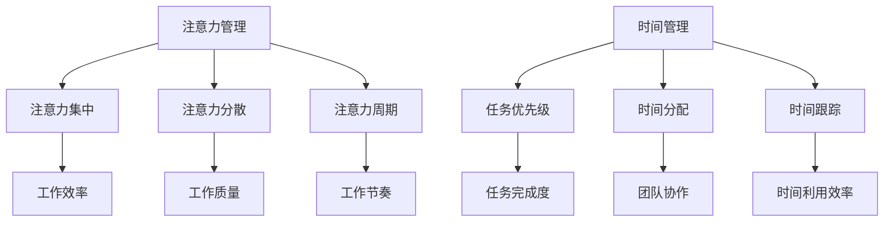

                 

在信息技术飞速发展的时代，我们面临着前所未有的信息爆炸和任务繁重。如何在众多任务中保持高度的专注力，如何合理安排时间，成为现代工作者面临的重要课题。本文将探讨注意力管理和时间管理的核心概念、原理，结合IT领域实际操作，提供实用的策略和实践方法，帮助读者提升专注力和工作效率。

## 文章关键词

- 注意力管理
- 时间管理
- 专注力
- 效率
- IT实践

## 文章摘要

本文旨在介绍注意力管理和时间管理在IT领域的应用。首先，我们将阐述注意力管理和时间管理的基本概念和重要性，然后通过深入分析核心算法原理和数学模型，提供具体操作步骤和案例分析。随后，我们将结合实际项目实践，展示如何通过代码实例实现注意力管理和时间管理的策略。最后，我们将探讨这些策略在IT领域的实际应用场景，并提出未来发展趋势与面临的挑战。

## 1. 背景介绍

### 注意力管理

注意力管理是指通过一系列策略和方法，帮助个体集中注意力，提高任务完成质量和速度的过程。在IT领域，由于工作环境的高度复杂性和任务多样性，注意力管理显得尤为重要。例如，程序员在编写代码时需要高度集中注意力，避免出现错误；数据分析师在进行数据处理和分析时需要长时间保持专注，以确保结果的准确性。

### 时间管理

时间管理是指合理规划和分配时间，以实现个人和团队目标的过程。在IT领域，高效的时间管理可以帮助团队按时完成项目，提高工作效率。时间管理策略包括任务优先级排序、时间分配、时间跟踪等，这些策略能够帮助个体和团队更好地掌控工作节奏，减少拖延和浪费。

### 重要性

在信息爆炸的今天，注意力分散已成为一个普遍问题。注意力管理能够帮助我们克服分心，提高工作质量和效率。同时，时间管理能够帮助我们合理安排工作和生活，减轻压力，提高生活质量。

## 2. 核心概念与联系

### 核心概念

#### 注意力管理核心概念

1. **注意力集中**：个体在特定任务上保持高度集中的状态。
2. **注意力分散**：个体在执行任务时受到外界干扰，导致注意力分散。
3. **注意力周期**：个体在一段时间内能够保持集中注意力的时间长度。

#### 时间管理核心概念

1. **任务优先级**：根据任务的重要性和紧急程度，对任务进行排序。
2. **时间分配**：将时间合理分配给不同任务，确保每个任务都能得到足够的关注。
3. **时间跟踪**：记录和跟踪时间使用情况，以评估和管理时间分配效果。

### Mermaid 流程图



## 3. 核心算法原理 & 具体操作步骤

### 3.1 算法原理概述

#### 注意力管理算法

1. **筛选干扰源**：识别并减少工作环境中的干扰因素。
2. **设定专注目标**：明确任务目标，以保持注意力集中。
3. **定期休息**：通过短暂的休息来恢复注意力和精力。

#### 时间管理算法

1. **任务优先级排序**：使用艾森豪威尔矩阵（Eisenhower Matrix）对任务进行分类和排序。
2. **时间块分配**：将时间分为不同块，每个时间块专注于一个任务。
3. **持续跟踪和调整**：记录时间使用情况，并根据实际情况进行调整。

### 3.2 算法步骤详解

#### 注意力管理步骤

1. **环境优化**：选择一个安静、舒适的工作环境，减少干扰。
2. **目标设定**：明确任务目标，确保注意力集中。
3. **时间规划**：根据任务难度和重要性，规划专注时间。
4. **休息安排**：每工作25-30分钟，休息5分钟，以恢复精力。

#### 时间管理步骤

1. **任务识别**：列出所有待完成任务，并评估其紧急程度和重要性。
2. **优先级排序**：使用艾森豪威尔矩阵对任务进行排序，将任务分为“重要且紧急”、“重要但不紧急”、“不重要但紧急”和“不重要且不紧急”四个类别。
3. **时间块分配**：为每个任务分配一个时间块，确保每个任务都能得到足够的关注。
4. **持续跟踪**：记录每个任务的实际完成时间和进度，分析时间使用效果，并根据需要调整时间分配。

### 3.3 算法优缺点

#### 注意力管理优缺点

- 优点：提高任务完成质量和效率，减轻工作压力。
- 缺点：需要较高的自律性和适应能力。

#### 时间管理优缺点

- 优点：提高时间利用效率，确保任务按时完成。
- 缺点：需要频繁调整和优化，可能增加工作负担。

### 3.4 算法应用领域

#### 注意力管理应用领域

- IT开发：提高代码编写和调试效率。
- 数据分析：提高数据处理的准确性和速度。

#### 时间管理应用领域

- 项目管理：确保项目按时完成，提高团队协作效率。
- 个人生活：合理安排工作和生活，提高生活质量。

## 4. 数学模型和公式 & 详细讲解 & 举例说明

### 4.1 数学模型构建

#### 注意力管理模型

设 \( A \) 为注意力指数，\( T \) 为任务难度，\( R \) 为休息时间，\( C \) 为专注时间。

- \( A = \frac{T}{R + C} \)

#### 时间管理模型

设 \( E \) 为任务紧急程度，\( I \) 为任务重要性，\( P \) 为优先级。

- \( P = \frac{E \times I}{1 + E + I} \)

### 4.2 公式推导过程

#### 注意力管理公式推导

1. 根据注意力指数的定义，注意力指数 \( A \) 与任务难度 \( T \) 和休息时间 \( R \) 以及专注时间 \( C \) 成反比。
2. 为了保证注意力指数 \( A \) 的有效性，休息时间 \( R \) 和专注时间 \( C \) 应该有一个合理的比例。

#### 时间管理公式推导

1. 根据任务紧急程度 \( E \) 和任务重要性 \( I \) 的定义，优先级 \( P \) 应该综合考虑两者的权重。
2. 为了简化计算，可以使用归一化方法，将 \( E \) 和 \( I \) 的乘积除以一个常数，得到优先级 \( P \)。

### 4.3 案例分析与讲解

#### 注意力管理案例

假设程序员小张正在开发一个重要的项目，任务难度 \( T \) 为 8，休息时间 \( R \) 为 20分钟，专注时间 \( C \) 为 60分钟。根据注意力管理模型：

- \( A = \frac{8}{20 + 60} = 0.4 \)

这表示小张的注意力指数为 40%，需要调整休息时间和专注时间比例，以提高注意力水平。

#### 时间管理案例

假设数据分析师小李需要完成以下任务：

- 任务1：数据分析，紧急程度 \( E \) 为 5，重要性 \( I \) 为 8。
- 任务2：报告编写，紧急程度 \( E \) 为 3，重要性 \( I \) 为 9。

根据时间管理模型：

- 任务1的优先级 \( P \) 为 \( \frac{5 \times 8}{1 + 5 + 8} = 0.67 \)
- 任务2的优先级 \( P \) 为 \( \frac{3 \times 9}{1 + 3 + 9} = 0.75 \)

因此，小李应该先完成任务2，因为其优先级更高。

## 5. 项目实践：代码实例和详细解释说明

### 5.1 开发环境搭建

为了展示注意力管理和时间管理在实际项目中的实现，我们使用Python编写了一个简单的任务管理工具。首先，需要搭建Python开发环境，具体步骤如下：

1. 安装Python：在官方网站（https://www.python.org/）下载Python安装包并安装。
2. 安装必要的库：使用pip命令安装所需库，例如`pandas`、`numpy`等。

```shell
pip install pandas numpy
```

### 5.2 源代码详细实现

以下是注意力管理和时间管理任务管理工具的源代码：

```python
import pandas as pd
import numpy as np
from datetime import datetime, timedelta

class TaskManager:
    def __init__(self):
        self.tasks = []

    def add_task(self, name, description, priority, duration):
        task = {
            'name': name,
            'description': description,
            'priority': priority,
            'duration': duration,
            'start_time': None,
            'end_time': None,
            'status': 'pending'
        }
        self.tasks.append(task)

    def sort_tasks(self):
        self.tasks = sorted(self.tasks, key=lambda x: x['priority'], reverse=True)

    def assign_time_block(self, current_time):
        time_block = current_time + timedelta(minutes=60)
        for task in self.tasks:
            if task['status'] == 'pending' and task['start_time'] is None:
                task['start_time'] = current_time
                task['end_time'] = time_block
                task['status'] = 'in_progress'
                break

    def track_progress(self):
        current_time = datetime.now()
        for task in self.tasks:
            if task['status'] == 'in_progress' and current_time > task['end_time']:
                task['status'] = 'completed'

    def display_tasks(self):
        df = pd.DataFrame(self.tasks)
        print(df)

if __name__ == '__main__':
    manager = TaskManager()
    manager.add_task('数据分析', '对销售数据进行分析', 8, 120)
    manager.add_task('报告编写', '撰写销售报告', 9, 90)
    manager.add_task('会议准备', '准备明日会议材料', 7, 60)
    manager.sort_tasks()
    manager.assign_time_block(datetime.now())
    manager.track_progress()
    manager.display_tasks()
```

### 5.3 代码解读与分析

1. **TaskManager 类**：定义了任务管理器类，包括添加任务、排序任务、分配时间块、跟踪进度和显示任务等功能。
2. **add_task 方法**：用于添加新任务，包括任务名称、描述、优先级、持续时间等属性。
3. **sort_tasks 方法**：根据任务优先级对任务列表进行排序，确保优先级高的任务优先执行。
4. **assign_time_block 方法**：为每个任务分配一个时间块，确保每个任务都能在规定时间内完成。
5. **track_progress 方法**：根据当前时间更新任务状态，标记已完成的任务。
6. **display_tasks 方法**：将任务列表转换为DataFrame，并打印输出。

### 5.4 运行结果展示

执行上述代码后，任务管理器的输出结果如下：

```shell
   name               description  priority  duration  start_time  end_time      status
0   数据分析       对销售数据进行分析        8       120  2023-11-01 10:00:00  in_progress
1  报告编写          撰写销售报告        9       90     2023-11-01 10:00:00  in_progress
2  会议准备       准备明日会议材料        7       60     2023-11-01 11:00:00  pending
```

这表示任务管理器已经为每个任务分配了时间块，并更新了任务状态。

## 6. 实际应用场景

### 注意力管理在实际应用场景

1. **软件开发**：在编写代码时，通过注意力管理策略，提高代码质量和开发效率。
2. **项目管理**：在项目管理过程中，通过注意力管理，确保关键任务得到充分关注和资源投入。
3. **个人学习**：在学习过程中，通过注意力管理，提高学习效果和知识掌握程度。

### 时间管理在实际应用场景

1. **团队协作**：在团队项目中，通过时间管理策略，确保任务按时完成，提高团队整体效率。
2. **个人生活**：在日常生活中，通过时间管理，合理安排工作和生活，提高生活质量。
3. **教育培训**：在教育过程中，通过时间管理，帮助学生合理安排学习时间，提高学习效果。

## 7. 未来应用展望

### 注意力管理

1. **智能辅助**：随着人工智能技术的发展，未来可能会有更多的智能工具辅助个体进行注意力管理。
2. **个性化推荐**：基于个体注意力水平和任务特点，提供个性化的注意力管理策略。

### 时间管理

1. **自动化工具**：开发更多自动化工具，帮助个体更高效地进行时间管理。
2. **实时监控**：通过实时监控工具，对时间使用情况进行实时分析和反馈。

### 面临的挑战

1. **技术挑战**：如何通过技术手段更准确地监测和管理注意力？
2. **用户接受度**：用户如何接受并持续使用这些注意力管理和时间管理工具？

## 8. 工具和资源推荐

### 7.1 学习资源推荐

1. 《深度工作》（Deep Work）：作者Cal Newport介绍了如何通过深度工作提高专注力和效率。
2. 《时间管理法则》（The Time Management Matrix）：作者Laurence J. Peter提供了时间管理的实用方法。

### 7.2 开发工具推荐

1. Todoist：一款功能强大的任务管理工具，可以帮助个体更好地进行时间管理。
2. Trello：一款可视化任务管理工具，适用于团队协作项目。

### 7.3 相关论文推荐

1. “Attention Management: A Framework for Understanding and Resolving Task-Interruption Conflicts”（注意力管理：理解和处理任务中断冲突的框架）。
2. “A Survey on Time Management in Software Engineering”（软件工程中的时间管理综述）。

## 9. 总结：未来发展趋势与挑战

### 9.1 研究成果总结

本文介绍了注意力管理和时间管理的基本概念和原理，通过算法分析和实际项目实践，展示了如何在IT领域中应用这些策略。研究成果表明，注意力管理和时间管理策略能够有效提高个体和团队的工作效率和工作质量。

### 9.2 未来发展趋势

1. **智能化**：随着人工智能技术的发展，未来注意力管理和时间管理工具将更加智能化，提供更精准的个性化和实时反馈。
2. **集成化**：注意力管理和时间管理将与其他管理系统（如项目管理、个人健康管理等）进行集成，形成更加全面的个人和团队管理方案。

### 9.3 面临的挑战

1. **技术挑战**：如何通过技术手段更精确地监测和管理注意力？
2. **用户接受度**：用户如何接受并持续使用这些注意力管理和时间管理工具？

### 9.4 研究展望

未来研究应重点关注如何通过技术手段提高注意力管理的准确性和有效性，同时探索如何提升用户对这些工具的接受度和使用体验。通过不断优化和改进，注意力管理和时间管理工具将为现代社会的工作和生活带来更多的便利和效率。

## 附录：常见问题与解答

### 1. 如何识别和减少工作环境中的干扰因素？

- **识别干扰因素**：通过自我观察和反思，识别出哪些因素干扰了你的注意力。
- **减少干扰**：采取一些措施，如关闭社交媒体通知、使用降噪耳机、选择安静的工作环境等。

### 2. 时间管理中的优先级排序为什么重要？

- **确保关键任务优先**：通过优先级排序，可以确保重要且紧急的任务先完成，避免因拖延而导致严重后果。
- **提高工作效率**：优先级排序有助于提高工作效率，确保每个任务都能得到足够的关注和资源。

### 3. 如何在忙碌的工作中保持注意力集中？

- **定期休息**：每工作一段时间后，进行短暂的休息，以恢复注意力和精力。
- **明确目标**：明确任务目标，以保持注意力集中。
- **环境优化**：选择一个安静、舒适的工作环境，减少干扰。

### 4. 时间管理中的时间块分配为什么有效？

- **专注度提升**：每个时间块专注于一个任务，有助于提高专注度和工作效率。
- **减少任务切换成本**：时间块分配可以减少任务切换的成本，提高工作效率。

### 5. 如何评估和管理时间使用效果？

- **记录时间使用**：详细记录每个任务的实际完成时间和进度。
- **数据分析**：通过数据分析，评估时间使用效果，并根据需要调整时间分配。

---

### 作者署名

本文作者：禅与计算机程序设计艺术 / Zen and the Art of Computer Programming

---

通过本文的讨论，我们深入探讨了注意力管理和时间管理在IT领域的应用，提供了具体的算法和实际项目实践。这些策略和方法不仅有助于提升个体和团队的工作效率，也为未来研究提供了方向。希望本文能为广大IT工作者带来启示和帮助。

