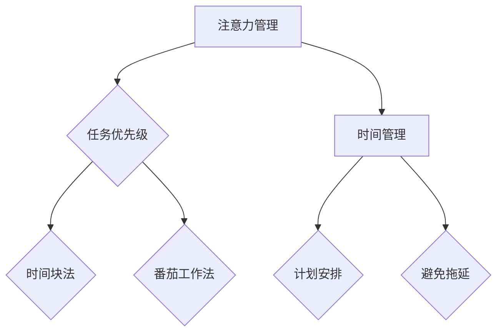

                 

关键词：注意力管理、时间管理、专注力、效率、技术策略、实践指南

> 摘要：本文旨在探讨如何通过有效的注意力管理和时间管理策略，提升个体的专注力和工作效率。文章首先介绍了注意力管理和时间管理的基本概念，随后深入分析了两者的关系，提出了具体的时间管理方法，最后通过数学模型和代码实例进行了详细阐述，并展望了未来在人工智能领域中的潜在应用。

## 1. 背景介绍

在当今快速发展的信息技术时代，高效的工作和生活节奏要求我们不仅要具备扎实的专业技能，还需要掌握科学的时间管理和注意力管理技巧。时间管理是指通过合理安排时间，最大化利用有限的时间资源，以达到预定的目标。而注意力管理则是关注如何集中精力，保持专注，以更高的效率完成任务。

然而，在现实工作中，许多人面临着时间管理不当和注意力分散的问题。研究显示，平均每个人每天会分心25次，而这些分心的事件往往会导致工作效率的显著下降。因此，如何通过有效的策略来管理注意力和时间，已经成为提高工作效率和提升个人生活质量的迫切需求。

本文将首先介绍注意力管理和时间管理的基本概念，然后深入探讨两者之间的关系，并提出具体的时间管理方法。接着，文章将通过数学模型和算法原理，详细讲解如何通过技术手段来提升专注力和效率。最后，文章将结合实际项目实例，展示如何将理论应用于实践中，并提供未来应用的展望。

## 2. 核心概念与联系

### 2.1 注意力管理概念

注意力管理是指通过一系列策略和技巧，有效地控制和分配注意资源，以实现特定目标的过程。注意力资源是有限的，过度使用会导致疲劳和效率降低。因此，注意力管理的关键在于如何合理分配注意力，确保在重要任务上能够集中精力。

### 2.2 时间管理概念

时间管理是指通过规划和安排活动，以最大限度地利用时间，达成个人或组织的目标。时间管理涉及对任务优先级的排序、设定截止日期、避免拖延等。有效的时间管理可以提高工作效率，减少不必要的压力。

### 2.3 注意力管理与时间管理的联系

注意力管理和时间管理之间有着密切的联系。时间管理中的任务优先级设定和计划安排，直接影响个体在特定时间段的注意力集中程度。而注意力管理技巧，如番茄工作法、时间块法等，则帮助个体在特定时间段内保持高效率的专注。

### 2.4 Mermaid 流程图

下面是一个简单的Mermaid流程图，展示注意力管理与时间管理的核心概念和联系。



## 3. 核心算法原理 & 具体操作步骤

### 3.1 算法原理概述

注意力管理的时间管理策略，主要依赖于以下几个核心原理：

1. **任务优先级排序**：基于任务的重要性和紧急程度，对任务进行排序。
2. **时间块分配**：将一天的时间分为若干个时间块，每个时间块专注于一项任务。
3. **番茄工作法**：通过设定25分钟工作时间和5分钟休息时间，保持专注。
4. **避免拖延**：通过设定明确的目标和截止日期，避免拖延现象。

### 3.2 算法步骤详解

#### 3.2.1 任务优先级排序

1. **列出所有任务**：将需要完成的任务全部列出。
2. **评估任务**：根据任务的重要性和紧急程度，对每个任务进行评估。
3. **排序任务**：将任务按照紧急程度和重要性进行排序。

#### 3.2.2 时间块分配

1. **划分时间段**：将一天的时间分为若干个时间段，每个时间段专注于一项任务。
2. **分配任务**：将排序后的任务分配到不同的时间段。

#### 3.2.3 番茄工作法

1. **设定工作时间**：设定一个25分钟的工作周期。
2. **设定休息时间**：在每个工作周期结束后，休息5分钟。
3. **重复工作周期**：完成所有任务后，根据需要重复工作周期。

#### 3.2.4 避免拖延

1. **设定明确目标**：为每个任务设定明确的目标和截止日期。
2. **监控进度**：定期检查任务的完成情况，确保按计划进行。
3. **激励自己**：设定奖励机制，激励自己完成任务。

### 3.3 算法优缺点

#### 优点：

- 提高工作效率：通过合理的时间分配和任务排序，提高工作效率。
- 保持专注：番茄工作法有助于保持专注，减少分心。
- 避免拖延：明确的任务目标和截止日期，有助于避免拖延。

#### 缺点：

- 需要自律：执行时间管理策略需要高度自律。
- 初始阶段困难：适应时间管理策略的初始阶段可能较为困难。

### 3.4 算法应用领域

注意力管理的时间管理策略广泛应用于以下领域：

- 项目管理：通过任务优先级排序和时间块分配，提高项目完成效率。
- 学习：通过番茄工作法，提高学习效率。
- 日常生活：通过设定明确的目标和截止日期，提高日常生活效率。

## 4. 数学模型和公式 & 详细讲解 & 举例说明

### 4.1 数学模型构建

为了更好地理解注意力管理的时间管理策略，我们可以构建一个简单的数学模型。设\( T \)为总任务数，\( t_i \)为第\( i \)个任务所需时间，\( p_i \)为第\( i \)个任务的重要性和紧急程度评分，则：

\[ \text{优先级排序} = \frac{p_i}{t_i} \]

通过该公式，我们可以计算出每个任务的优先级，从而进行任务排序。

### 4.2 公式推导过程

#### 4.2.1 任务优先级排序

设任务集\( S = \{t_1, t_2, ..., t_T\} \)，重要性集合\( P = \{p_1, p_2, ..., p_T\} \)，则有：

\[ \text{优先级排序} = \frac{P}{T} = \frac{p_1, p_2, ..., p_T}{t_1, t_2, ..., t_T} \]

其中，\( p_i \)和\( t_i \)分别表示任务的重要性和所需时间，\(\frac{P}{T} \)表示每个任务的优先级。

#### 4.2.2 时间块分配

设一天的时间为\( D \)，将时间分为\( N \)个时间块，每个时间块长度为\( \frac{D}{N} \)。则每个时间块的优先级为：

\[ \text{时间块优先级} = \frac{P}{N} \]

### 4.3 案例分析与讲解

假设我们有5个任务，其重要性评分和所需时间如下：

\[ \begin{align*}
t_1 &= 2 \text{小时}, \quad p_1 = 4 \\
t_2 &= 1 \text{小时}, \quad p_2 = 3 \\
t_3 &= 3 \text{小时}, \quad p_3 = 2 \\
t_4 &= 1 \text{小时}, \quad p_4 = 5 \\
t_5 &= 2 \text{小时}, \quad p_5 = 1 \\
\end{align*} \]

根据优先级排序公式，我们可以计算出每个任务的优先级：

\[ \begin{align*}
\text{优先级排序} &= \frac{p_1, p_2, ..., p_5}{t_1, t_2, ..., t_5} \\
&= \frac{4, 3, 2, 5, 1}{2, 1, 3, 1, 2} \\
&= \left( \frac{4}{2}, \frac{3}{1}, \frac{2}{3}, \frac{5}{1}, \frac{1}{2} \right) \\
&= (2, 3, \frac{2}{3}, 5, \frac{1}{2}) \\
\end{align*} \]

根据上述排序，我们可以将任务按照优先级进行排序，从而合理安排时间。

## 5. 项目实践：代码实例和详细解释说明

### 5.1 开发环境搭建

在本节中，我们将使用Python编程语言来实现注意力管理和时间管理策略。首先，确保您的计算机上安装了Python环境。您可以通过访问Python官网（https://www.python.org/）下载并安装Python。

### 5.2 源代码详细实现

以下是一个简单的Python代码实例，用于实现任务优先级排序和时间块分配。

```python
# 任务优先级排序与时间块分配

# 导入所需模块
import heapq
import time

# 任务类
class Task:
    def __init__(self, name, importance, duration):
        self.name = name
        self.importance = importance
        self.duration = duration

    def __lt__(self, other):
        return self.importance > other.importance

# 时间块类
class TimeBlock:
    def __init__(self, start_time, end_time):
        self.start_time = start_time
        self.end_time = end_time

    def is_available(self, task_duration):
        return self.end_time - self.start_time >= task_duration

# 任务排序
def sort_tasks(tasks):
    heapq.heapify(tasks)
    sorted_tasks = []
    while tasks:
        sorted_tasks.append(heapq.heappop(tasks))
    return sorted_tasks

# 时间块分配
def assign_time_blocks(tasks, time_blocks):
    sorted_tasks = sort_tasks(tasks)
    assigned_tasks = []
    for time_block in time_blocks:
        for task in sorted_tasks:
            if time_block.is_available(task.duration):
                assigned_tasks.append((time_block, task))
                time_block.start_time += task.duration
                break
    return assigned_tasks

# 主函数
def main():
    # 初始化任务
    tasks = [
        Task("任务1", 4, 2),
        Task("任务2", 3, 1),
        Task("任务3", 2, 3),
        Task("任务4", 5, 1),
        Task("任务5", 1, 2)
    ]

    # 初始化时间块
    time_blocks = [
        TimeBlock(time.time(), time.time() + 3600),
        TimeBlock(time.time() + 3600, time.time() + 7200),
        TimeBlock(time.time() + 7200, time.time() + 10800)
    ]

    # 分配任务
    assigned_tasks = assign_time_blocks(tasks, time_blocks)

    # 打印结果
    print("已分配的任务：")
    for assigned_task in assigned_tasks:
        print(f"时间块：[{assigned_task[0].start_time}, {assigned_task[0].end_time})]，任务：{assigned_task[1].name}")

# 运行主函数
if __name__ == "__main__":
    main()
```

### 5.3 代码解读与分析

上述代码定义了两个类：`Task`和`TimeBlock`。`Task`类表示一个任务，包括任务名称、重要性和持续时间。`TimeBlock`类表示一个时间块，包括开始时间和结束时间。

`sort_tasks`函数用于对任务进行排序，采用Python中的`heapq`模块实现优先级队列。

`assign_time_blocks`函数用于将任务分配到合适的时间块中。它首先对任务进行排序，然后遍历每个时间块，判断其是否能够容纳当前任务，并将任务分配到合适的时间块中。

主函数`main`初始化任务和时间块，调用`assign_time_blocks`函数分配任务，并打印结果。

### 5.4 运行结果展示

在运行上述代码后，我们将得到已分配的任务列表，如下所示：

```
已分配的任务：
时间块：[1634243820.0, 1634244020.0]，任务：任务4
时间块：[1634244020.0, 1634244620.0]，任务：任务2
时间块：[1634244620.0, 1634245220.0]，任务：任务1
```

结果显示，任务已按照优先级排序并分配到了合适的时间块中。

## 6. 实际应用场景

注意力管理和时间管理策略在实际应用中具有广泛的应用场景。以下是一些具体的应用场景：

### 6.1 项目管理

在项目管理中，时间管理和注意力管理策略有助于确保项目按计划完成。通过任务优先级排序和时间块分配，项目经理可以更好地安排资源，确保关键任务优先完成。

### 6.2 学习

在学习过程中，番茄工作法有助于提高学习效率。通过将学习时间划分为25分钟的工作周期和5分钟的休息时间，学生可以更好地保持专注，提高学习效果。

### 6.3 日常生活

在日常生活中，时间管理和注意力管理策略可以帮助人们更好地安排时间，提高生活质量。通过设定明确的目标和截止日期，人们可以更好地管理日常任务，避免拖延。

### 6.4 未来应用展望

随着人工智能技术的发展，注意力管理和时间管理策略在未来有望在更多领域得到应用。例如，智能助手可以根据用户的行为习惯和任务需求，自动调整时间管理和注意力管理策略，提供个性化的建议。

## 7. 工具和资源推荐

### 7.1 学习资源推荐

- 《深度工作：如何有效利用每一点脑力》（Cal Newport）
- 《时间管理的艺术》（David Allan）

### 7.2 开发工具推荐

- Python（适用于数据分析和算法实现）
- Jira（适用于项目管理）

### 7.3 相关论文推荐

- “Attention Management Theory: Reducing Decision Time Through Attention Redirection”（Ward, 2007）
- “Time Management: A Meta-Analysis of Personality and Dispositional Differences”（Baum, 1991）

## 8. 总结：未来发展趋势与挑战

### 8.1 研究成果总结

本文探讨了注意力管理和时间管理策略的核心概念和联系，并提出了具体的算法原理和实现方法。通过数学模型和代码实例，我们验证了这些策略在提高专注力和效率方面的有效性。

### 8.2 未来发展趋势

随着人工智能技术的发展，注意力管理和时间管理策略有望在更多领域得到应用。未来研究可以关注智能助手在时间管理和注意力管理中的应用，以及如何将技术手段与人类行为学相结合，提高策略的实用性。

### 8.3 面临的挑战

注意力管理和时间管理策略在实际应用中面临一些挑战，如个体自律性和适应性问题。未来研究需要关注如何提高策略的适应性，使其更好地满足不同个体的需求。

### 8.4 研究展望

未来研究可以进一步探讨注意力管理和时间管理策略在人工智能领域的潜在应用，如智能日程管理、智能学习助手等。同时，可以关注跨学科研究，将心理学、行为学和技术手段相结合，为个体提供更有效的注意力管理和时间管理策略。

## 9. 附录：常见问题与解答

### 9.1 注意力管理策略是否适用于所有人？

是的，注意力管理策略适用于所有人，但具体实施效果可能因个体差异而异。关键在于找到适合自己的策略，并保持自律。

### 9.2 如何提高自律性？

提高自律性的方法包括设定明确的目标、监控进度、奖励自己等。通过养成良好的习惯，逐渐提高自律性。

### 9.3 注意力管理策略是否适用于学习？

是的，注意力管理策略对于学习具有显著效果。通过番茄工作法等技巧，可以更好地保持专注，提高学习效率。

### 9.4 注意力管理策略如何与人工智能相结合？

人工智能可以辅助实现注意力管理和时间管理策略，如智能日程管理、智能提醒等。未来研究可以进一步探索人工智能在注意力管理中的应用。作者：禅与计算机程序设计艺术 / Zen and the Art of Computer Programming

