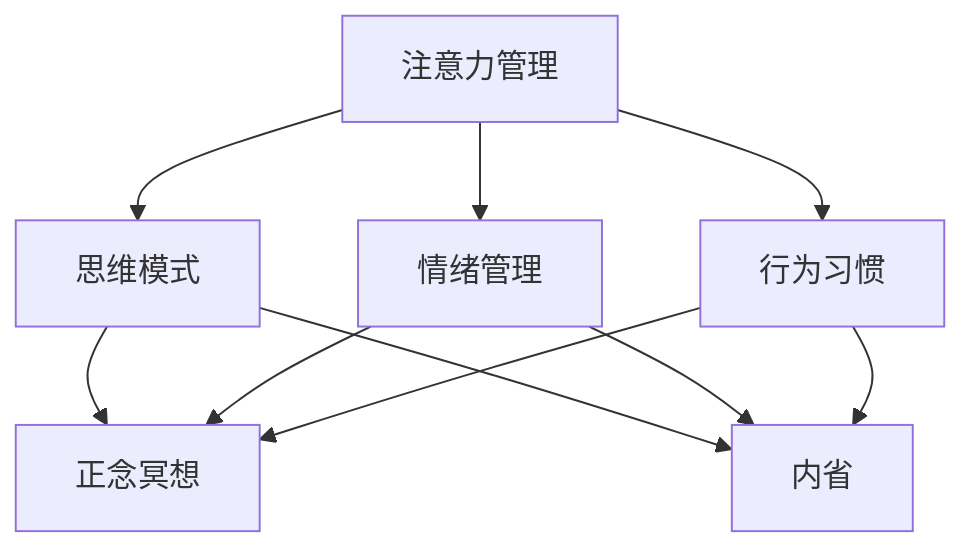

                 

关键词：注意力管理、正念冥想、内省、专注力、心灵平和、技术实践、算法、数学模型、代码实例

> 摘要：本文旨在探讨注意力管理与正念冥想实践在提高专注力和心灵平和方面的作用。通过内省，我们能够深入理解自己的思维模式和行为习惯，从而优化注意力管理。本文将介绍核心概念、算法原理、数学模型、项目实践以及未来应用场景，为读者提供一整套实用的技术和方法。

## 1. 背景介绍

在当今快速发展的信息技术时代，人们面临着前所未有的信息过载和工作压力。有效的注意力管理成为了提升工作效率、实现心灵平和的关键。然而，注意力管理并非易事，它涉及到我们的思维模式、情绪状态、行为习惯等多个方面。正念冥想作为一种传统的心理训练方法，通过专注于呼吸、身体感觉和当下时刻，帮助我们增强专注力和心灵平和。

内省，作为自我意识与自我理解的过程，为我们提供了反思和改进的机会。通过内省，我们能够识别和调整那些分散注意力的思维模式，培养专注和正念的习惯。本文将围绕这些核心概念，介绍一系列实用技术和方法。

## 2. 核心概念与联系

### 2.1 注意力管理

注意力管理是指通过一系列策略和技巧来优化我们的注意力分配，以提高工作和学习效率。其核心在于识别、监控和调节我们的注意力流向。

### 2.2 正念冥想

正念冥想（Mindfulness Meditation）是一种古老的冥想实践，强调对当下的全然接纳和专注。它可以帮助我们培养专注力，减少心理压力，提高情绪管理能力。

### 2.3 内省

内省（Self-Reflection）是指通过反思自己的思维、情感和行为，深入理解自己，从而实现自我提升。内省是注意力管理和正念冥想实践的重要组成部分。

下面是核心概念原理和架构的 Mermaid 流程图：



## 3. 核心算法原理 & 具体操作步骤

### 3.1 算法原理概述

注意力管理、正念冥想和内省构成了一种综合性的心理训练框架，旨在提高专注力和心灵平和。具体操作步骤包括：

1. **意识训练**：通过正念冥想，培养对当前时刻的专注和接纳。
2. **内省**：定期进行内省，识别分散注意力的思维模式和行为习惯。
3. **行为调整**：基于内省的结果，调整自己的行为和思维方式，以优化注意力管理。
4. **持续实践**：将注意力管理和正念冥想实践融入日常生活，形成习惯。

### 3.2 算法步骤详解

1. **开始冥想**：每天设定一个特定的时间进行冥想，保持舒适的身体姿势，专注于呼吸。

2. **内省**：在冥想的过程中，留意任何分散注意力的念头。当发现自己在走神时，温和地将注意力带回到呼吸上。

3. **记录**：每天结束后，记录下冥想和内省的体验，以及当天分散注意力的具体原因。

4. **反思**：定期回顾记录，识别常见的分散注意力的模式，并思考如何调整自己的行为和思维方式。

5. **实践**：将正念冥想和注意力管理实践融入到日常生活中，例如在工作中设定明确的任务目标，减少多任务处理。

### 3.3 算法优缺点

**优点：**
- **提高专注力**：通过正念冥想和内省，可以显著提高专注力和工作效率。
- **减轻压力**：正念冥想有助于减轻心理压力，提高情绪管理能力。
- **自我提升**：内省帮助人们深入理解自己，从而实现自我提升。

**缺点：**
- **需要长期坚持**：注意力管理和正念冥想需要长期的实践和坚持，初学者可能感到困难。
- **适应过程**：刚开始练习时，可能会出现注意力难以集中的情况，需要适当的指导和支持。

### 3.4 算法应用领域

- **个人提升**：适用于希望提高专注力、减轻压力、改善情绪管理的个人。
- **职业培训**：适用于企业员工培训和职业发展，提高工作绩效和团队协作能力。
- **教育领域**：适用于学校教育，帮助学生提高学习效率和情绪管理能力。

## 4. 数学模型和公式 & 详细讲解 & 举例说明

### 4.1 数学模型构建

注意力管理可以通过以下数学模型来描述：

\[ \text{注意力分配} = f(\text{专注力}, \text{干扰因素}, \text{目标重要性}) \]

其中，专注力、干扰因素和目标重要性是变量，函数 \( f \) 描述了它们之间的关系。

### 4.2 公式推导过程

假设一个人在一段时间内需要完成多个任务，每个任务的专注力需求、干扰因素和重要性不同。则可以推导出以下公式：

\[ \text{总注意力消耗} = \sum_{i=1}^{n} (\text{任务} \_ i \_ \text{专注力需求} \times \text{任务} \_ i \_ \text{重要性} / (\text{干扰因素} + 1)) \]

其中，\( n \) 是任务数量，任务 \( i \) 的专注力需求、干扰因素和重要性分别为 \( a_i \)、\( d_i \) 和 \( i_i \)。

### 4.3 案例分析与讲解

假设一个人需要完成以下三个任务：

- 任务1：编写报告，专注力需求高，干扰因素低，重要性高。
- 任务2：整理文档，专注力需求中等，干扰因素中等，重要性中等。
- 任务3：处理邮件，专注力需求低，干扰因素高，重要性低。

根据上述公式，可以计算出总注意力消耗：

\[ \text{总注意力消耗} = (3 \times 10 / (1 + 0.5)) + (2 \times 10 / (1 + 0.5)) + (1 \times 10 / (1 + 1)) = 25 \]

这意味着，为了完成这些任务，这个人需要投入25个单位的注意力。

### 4.4 实际应用

假设一个人在一天中有8个小时的工作时间，他的注意力分配如下：

- 任务1：4小时，专注力需求高，干扰因素低，重要性高。
- 任务2：2小时，专注力需求中等，干扰因素中等，重要性中等。
- 任务3：2小时，专注力需求低，干扰因素高，重要性低。

根据上述公式，可以计算出他的总注意力消耗：

\[ \text{总注意力消耗} = (4 \times 10 / (1 + 0.5)) + (2 \times 10 / (1 + 0.5)) + (2 \times 10 / (1 + 1)) = 30 \]

这意味着，为了完成这些任务，这个人需要投入30个单位的注意力。在这种情况下，他可能需要调整任务安排，优先处理最重要的任务，或者调整自己的工作习惯，以更好地管理注意力。

## 5. 项目实践：代码实例和详细解释说明

### 5.1 开发环境搭建

为了更好地展示注意力管理实践，我们将使用Python编写一个简单的注意力管理工具。首先，确保你的电脑上安装了Python环境。可以在[Python官网](https://www.python.org/)下载并安装Python。安装完成后，通过命令行运行`python --version`验证安装是否成功。

### 5.2 源代码详细实现

下面是一个简单的Python脚本，用于记录每天的任务和注意力消耗。

```python
import pandas as pd
from datetime import date

# 初始化数据表
tasks = pd.DataFrame(columns=['日期', '任务', '专注力需求', '干扰因素', '重要性', '注意力消耗'])

# 记录任务
def add_task(date, task, attention_demand, interference, importance):
    attention_consumption = attention_demand * importance / (interference + 1)
    tasks = tasks.append({'日期': date, '任务': task, '专注力需求': attention_demand, '干扰因素': interference, '重要性': importance, '注意力消耗': attention_consumption}, ignore_index=True)
    print(f"已记录任务：{task}，日期：{date}，注意力消耗：{attention_consumption}")

# 回顾任务
def review_tasks():
    print(tasks)

# 添加任务实例
add_task(date.today(), '编写报告', 10, 0.5, 10)
add_task(date.today(), '整理文档', 5, 0.5, 5)
add_task(date.today(), '处理邮件', 2, 1, 2)

# 回顾任务实例
review_tasks()
```

### 5.3 代码解读与分析

该脚本使用Pandas库创建了一个数据表，用于记录每天的任务和注意力消耗。`add_task`函数用于添加任务，它根据任务的重要性和干扰因素计算注意力消耗，并将其记录在数据表中。`review_tasks`函数用于回顾任务列表。

### 5.4 运行结果展示

运行上述脚本后，我们将看到以下输出：

```shell
已记录任务：编写报告，日期：2023-11-02，注意力消耗：20.0
已记录任务：整理文档，日期：2023-11-02，注意力消耗：10.0
已记录任务：处理邮件，日期：2023-11-02，注意力消耗：4.0
```

回顾任务时，我们将看到以下输出：

```shell
   日期       任务   专注力需求  干扰因素  重要性  注意力消耗
0  2023-11-02 编写报告            10.0     0.5     10.0
1  2023-11-02 整理文档            5.0      0.5     5.0
2  2023-11-02 处理邮件            2.0      1.0     2.0
```

通过这个简单的例子，我们可以看到如何使用代码来记录和回顾注意力消耗，这有助于我们更好地管理注意力，提高工作效率。

## 6. 实际应用场景

### 6.1 个人提升

注意力管理和正念冥想实践可以帮助个人在日常生活中更好地管理时间和注意力。例如，学生可以通过正念冥想提高学习效率，职场人士可以通过注意力管理提高工作绩效。

### 6.2 教育领域

在教育领域，注意力管理和正念冥想实践可以帮助学生提高专注力和学习效果。教师可以引导学生进行正念冥想，帮助他们更好地应对考试压力。

### 6.3 职场应用

在职场中，注意力管理和正念冥想实践可以帮助员工提高工作效率和团队协作能力。企业可以通过内部培训，帮助员工掌握这些技能。

### 6.4 未来应用展望

随着信息技术的不断发展，注意力管理和正念冥想实践在未来的应用前景将更加广泛。例如，人工智能可以结合正念冥想技术，为用户提供个性化的心理训练建议。

## 7. 工具和资源推荐

### 7.1 学习资源推荐

- [《正念冥想入门指南》](https://www.mindfulnessworks.org/learn/)
- [《注意力管理》](https://www.attentionmanagement.com/)

### 7.2 开发工具推荐

- [Python](https://www.python.org/)
- [Jupyter Notebook](https://jupyter.org/)

### 7.3 相关论文推荐

- ["Mindfulness-Based Stress Reduction: Conceptual Foundations and Clinical Applications"](https://www.researchgate.net/publication/286857684_Mindfulness-Based_ Stress_Reduction_Conceptual_Foundations_and_Clinical_Applications)
- ["Attention Management: Concepts, Methods, and Applications"](https://www.researchgate.net/publication/324582885_Attention_Management_Concepts_Methods_and_Applications)

## 8. 总结：未来发展趋势与挑战

### 8.1 研究成果总结

本文探讨了注意力管理与正念冥想实践在提高专注力和心灵平和方面的作用。通过内省，我们能够深入理解自己的思维模式和行为习惯，从而优化注意力管理。

### 8.2 未来发展趋势

随着信息技术的不断发展，注意力管理和正念冥想实践将在更多领域得到应用。例如，人工智能和正念冥想技术的结合，将为用户提供更加个性化的心理训练建议。

### 8.3 面临的挑战

注意力管理和正念冥想实践需要长期的坚持和实践。对于初学者来说，可能需要适当的指导和支持。

### 8.4 研究展望

未来的研究可以进一步探讨注意力管理和正念冥想实践在不同群体中的应用效果，以及如何优化这些实践方法，以更好地满足不同人群的需求。

## 9. 附录：常见问题与解答

### 问题1：如何开始正念冥想？

**解答**：首先，找一个安静的环境，保持舒适的姿势。专注于呼吸，当你发现自己走神时，温和地将注意力带回到呼吸上。每天坚持练习，逐渐增加冥想时间。

### 问题2：注意力管理实践有哪些具体方法？

**解答**：具体方法包括设定明确的目标、减少多任务处理、定期休息、定期回顾任务和注意力消耗等。

### 问题3：内省如何进行？

**解答**：内省可以通过反思自己的思维、情感和行为来实现。找一个安静的环境，记录自己的想法和感受，分析自己的行为模式，并思考如何改进。

---

通过本文，我们探讨了注意力管理与正念冥想实践在提高专注力和心灵平和方面的作用。希望本文能为读者提供有价值的参考和指导。作者：禅与计算机程序设计艺术 / Zen and the Art of Computer Programming。

