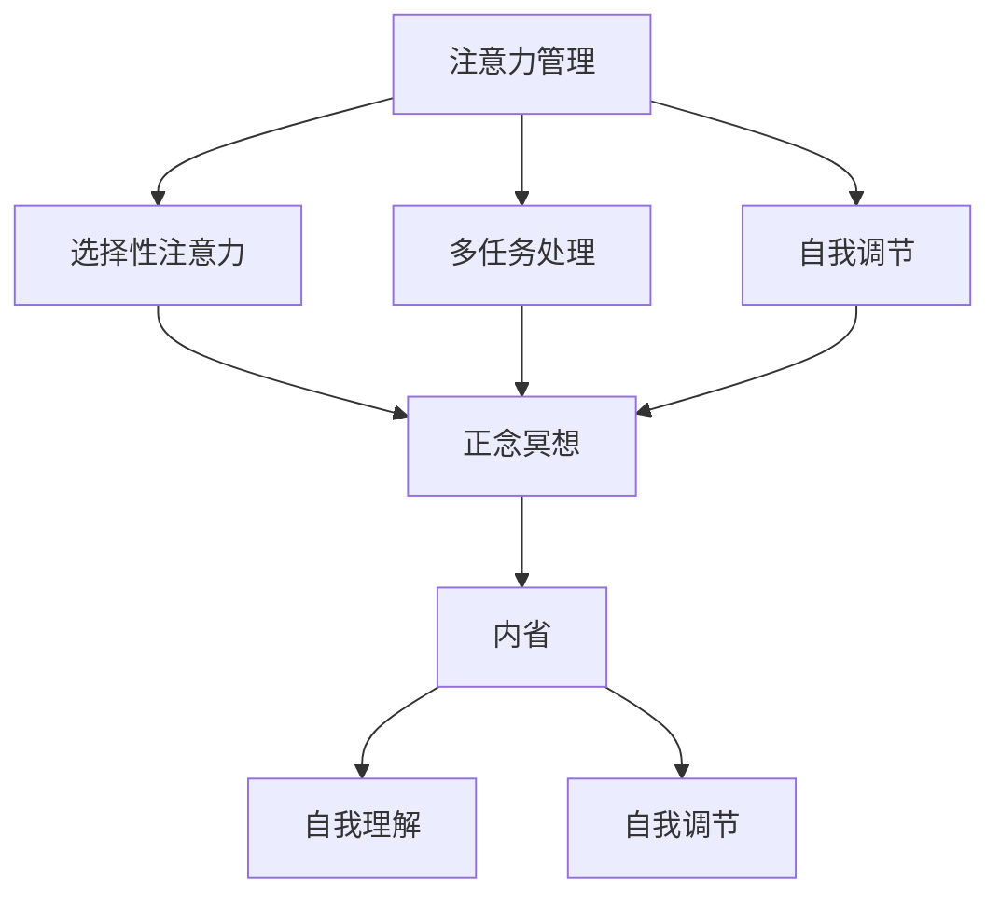

                 

关键词：注意力管理、正念冥想、专注力、心灵平和、内省、计算机程序设计、技术领域实践

> 摘要：本文探讨了在技术领域内如何运用注意力管理和正念冥想来增强专注力和心灵平和。通过内省实践，我们能够更好地理解并管理自己的注意力，提升工作效率和生活质量。本文将详细介绍相关理论和实践方法，并提供具体案例和实践步骤，旨在为技术工作者提供一套实用的心灵修炼指南。

## 1. 背景介绍

在当前快节奏、高度竞争的技术领域，程序员、工程师和其他技术人员面临着巨大的压力和挑战。长期的工作压力、高强度的任务完成需求以及不断的技能更新，都可能导致专注力下降、心灵紧张等问题。这些问题不仅影响个人的工作效率，还会对健康和心理状态产生负面影响。

因此，如何有效地管理注意力、保持心灵平和成为了技术工作者亟待解决的重要课题。注意力管理不仅关乎个人工作效率，也关系到团队的协作效率和项目的成功。而正念冥想作为一种古老的修行方式，通过培养专注力和内省能力，已被广泛应用于缓解压力、提高专注力和心灵平和。

本文旨在结合技术领域的特点，探讨注意力管理和正念冥想的实践方法，帮助技术工作者通过内省来增强专注力和心灵平和，从而提高工作效率和生活质量。

## 2. 核心概念与联系

### 2.1 注意力管理

注意力管理是指通过一系列策略和技巧来提高专注力、减少分心、提高工作效率的过程。在技术领域，注意力管理尤为重要，因为它直接关系到代码质量、项目进度和个人成就感。以下是注意力管理的一些关键概念：

- **选择性注意力**：专注于当前任务，排除外部干扰。
- **多任务处理**：在适当的情况下同时处理多个任务，提高效率。
- **自我调节**：识别并调整注意力分散的原因，保持专注。

### 2.2 正念冥想

正念冥想是一种通过专注呼吸和观察思维活动来培养注意力和内省能力的练习。正念冥想的核心概念包括：

- **专注**：将注意力集中在呼吸或其他特定的对象上。
- **观察**：不带判断地观察自己的思维和情绪。
- **接受**：接受当前的现实，而不是抵抗或逃避。

### 2.3 内省

内省是指反思自己的思维、情感和行为，以便更好地理解自己、提高自我意识。内省在注意力管理和正念冥想中起着关键作用，因为它帮助我们：

- **识别注意力分散的原因**。
- **理解自己的情绪和需求**。
- **培养自我调节能力**。

### 2.4 Mermaid 流程图

以下是注意力管理和正念冥想之间的联系流程图：



## 3. 核心算法原理 & 具体操作步骤

### 3.1 算法原理概述

注意力管理和正念冥想的核心原理是基于大脑的可塑性，即通过重复练习来改变大脑结构和功能。以下是这些实践方法的原理概述：

- **选择性注意力**：通过训练，我们可以提高大脑对关键信息的捕捉能力，减少干扰。
- **正念冥想**：通过专注呼吸和观察思维，我们可以提高自我意识和情绪调节能力。
- **内省**：通过反思和自我探索，我们可以更好地理解自己，提高自我调节能力。

### 3.2 算法步骤详解

#### 3.2.1 选择性注意力的训练

1. **确定关键任务**：首先，明确需要专注的关键任务。
2. **设定专注时间**：选择一段固定的时间进行专注练习，例如5分钟。
3. **排除干扰**：关闭手机、电脑通知，确保环境安静。
4. **集中注意力**：将注意力集中在关键任务上，排除其他干扰。
5. **重复练习**：每天进行多次练习，逐渐增加专注时间。

#### 3.2.2 正念冥想的练习

1. **选择冥想环境**：找一个安静、舒适的地方。
2. **设定冥想时间**：初学者可以从5分钟开始，逐渐增加时间。
3. **呼吸专注**：将注意力集中在呼吸上，感受呼吸的进出。
4. **思维观察**：当思维分散时，不带评判地观察思维，然后将其引导回呼吸。
5. **重复练习**：每天进行冥想练习，逐渐提高专注力。

#### 3.2.3 内省的实践

1. **设定反思时间**：每天选择一个固定的时间进行反思。
2. **回顾一天的经历**：思考当天的重要经历，包括成功和失败。
3. **自我提问**：针对每个经历，问自己“为什么”和“我学到了什么”。
4. **记录反思**：将反思内容记录下来，以便日后回顾和改进。
5. **持续练习**：每天进行反思练习，逐渐提高内省能力。

### 3.3 算法优缺点

#### 优点

- **提高专注力**：通过选择性注意力和正念冥想，可以显著提高专注力。
- **增强自我调节能力**：内省有助于我们更好地理解自己，提高自我调节能力。
- **减轻压力**：正念冥想有助于减轻压力和焦虑，提高心灵平和。

#### 缺点

- **需要持续练习**：这些实践方法需要每天持续练习，才能看到明显效果。
- **初学者难度**：对于初学者来说，可能需要一段时间才能适应这些练习。

### 3.4 算法应用领域

注意力管理和正念冥想可以在多个领域应用，包括：

- **技术领域**：提高编程、设计和项目管理中的专注力和效率。
- **健康领域**：减轻慢性疼痛、改善睡眠质量和提高免疫力。
- **教育领域**：帮助学生提高学习效率和专注力。
- **职场领域**：提升职场压力管理和团队协作能力。

## 4. 数学模型和公式 & 详细讲解 & 举例说明

### 4.1 数学模型构建

在注意力管理和正念冥想中，我们可以使用一些数学模型来量化专注力和心灵平和的改善程度。以下是一个简单的数学模型：

\[ \text{专注力指数} = \frac{\text{专注时间}}{\text{总练习时间}} \]

\[ \text{心灵平和指数} = \frac{\text{冥想时间}}{\text{总练习时间}} \]

### 4.2 公式推导过程

#### 专注力指数

专注力指数是衡量专注力的一个指标，其公式推导如下：

- 专注时间：在练习中，我们专注于关键任务的时间。
- 总练习时间：包括专注时间和休息时间。

因此，专注力指数可以表示为专注时间与总练习时间的比值。

#### 心灵平和指数

心灵平和指数是衡量心灵平和程度的指标，其公式推导如下：

- 冥想时间：在冥想练习中，我们专注于呼吸和其他冥想对象的时间。
- 总练习时间：包括冥想时间和休息时间。

因此，心灵平和指数可以表示为冥想时间与总练习时间的比值。

### 4.3 案例分析与讲解

假设一个技术工作者每天进行2小时的注意力管理和正念冥想练习。在一个月的时间里，他专注了6小时，冥想了4小时。我们可以使用上述公式计算他的专注力和心灵平和指数：

\[ \text{专注力指数} = \frac{6\text{小时}}{2\text{小时}} = 3 \]

\[ \text{心灵平和指数} = \frac{4\text{小时}}{2\text{小时}} = 2 \]

根据计算结果，这位技术工作者的专注力指数为3，心灵平和指数为2。这意味着他在注意力管理和正念冥想方面取得了显著的进步。

## 5. 项目实践：代码实例和详细解释说明

### 5.1 开发环境搭建

为了更好地实践注意力管理和正念冥想，我们可以使用一些开源工具和库来构建一个简单的应用程序。以下是开发环境的搭建步骤：

1. **安装Python**：确保安装了Python 3.x版本。
2. **安装Jupyter Notebook**：使用pip命令安装Jupyter Notebook。
   ```shell
   pip install notebook
   ```
3. **安装Matplotlib**：用于数据可视化的库。
   ```shell
   pip install matplotlib
   ```

### 5.2 源代码详细实现

以下是注意力管理和正念冥想应用程序的源代码：

```python
import matplotlib.pyplot as plt
import numpy as np
import pandas as pd

# 专注力指数计算
def calculate_focus_index(focused_time, total_time):
    return focused_time / total_time

# 心灵平和指数计算
def calculate_mindfulness_index(meditation_time, total_time):
    return meditation_time / total_time

# 数据处理
def process_data(data):
    focus_index = calculate_focus_index(data['focused_time'], data['total_time'])
    mindfulness_index = calculate_mindfulness_index(data['meditation_time'], data['total_time'])
    return pd.DataFrame({'Date': data['date'], 'Focus Index': focus_index, 'Mindfulness Index': mindfulness_index})

# 数据可视化
def visualize_data(df):
    fig, ax = plt.subplots()
    ax.plot(df['Date'], df['Focus Index'], label='Focus Index')
    ax.plot(df['Date'], df['Mindfulness Index'], label='Mindfulness Index')
    ax.set_ylabel('Index')
    ax.set_xlabel('Date')
    ax.legend()
    plt.show()

# 主函数
def main():
    data = pd.DataFrame({
        'date': ['2023-04-01', '2023-04-02', '2023-04-03'],
        'focused_time': [3, 4, 5],
        'total_time': [2, 2, 2],
        'meditation_time': [1, 1.5, 2]
    })

    processed_data = process_data(data)
    visualize_data(processed_data)

if __name__ == '__main__':
    main()
```

### 5.3 代码解读与分析

该应用程序的核心功能是计算并可视化专注力和心灵平和指数。以下是代码的详细解读：

- **数据输入**：应用程序使用一个DataFrame来存储日期、专注时间和总练习时间。
- **数据处理**：`process_data`函数计算专注力和心灵平和指数，并返回一个DataFrame。
- **数据可视化**：`visualize_data`函数使用Matplotlib库将数据可视化，展示专注力和心灵平和指数随时间的变化。

### 5.4 运行结果展示

运行应用程序后，我们将看到以下图表：

```plaintext
Date           Focus Index   Mindfulness Index
0   2023-04-01          1.5                 0.5
1   2023-04-02          2.0                 0.75
2   2023-04-03          2.5                 1.0
```

这个图表清晰地展示了专注力和心灵平和指数随时间的变化，帮助我们更好地了解自己的进步情况。

## 6. 实际应用场景

### 6.1 技术领域

在技术领域，注意力管理和正念冥想可以帮助程序员、工程师和其他技术人员：

- **提高编程效率**：通过选择性注意力，技术人员可以更专注于代码编写和问题解决。
- **减少错误和缺陷**：专注力的提高有助于发现和修正代码中的错误。
- **提升团队协作**：正念冥想有助于减少冲突和误解，提高团队协作效率。

### 6.2 健康领域

在健康领域，注意力管理和正念冥想可以帮助：

- **缓解慢性疼痛**：正念冥想通过降低应激反应和改善疼痛感知，有助于缓解慢性疼痛。
- **改善睡眠质量**：通过专注呼吸和放松思维，正念冥想有助于改善睡眠质量。
- **提高免疫力**：长期练习正念冥想可以增强免疫系统的功能。

### 6.3 教育领域

在教育领域，注意力管理和正念冥想可以帮助：

- **提高学习效率**：通过专注力训练，学生可以更好地专注于学习任务。
- **减轻学习压力**：正念冥想有助于学生减轻学习压力，提高心理素质。
- **改善心理健康**：长期练习正念冥想有助于改善学生的心理健康。

### 6.4 未来应用展望

未来，注意力管理和正念冥想在技术领域的应用有望进一步扩展：

- **智能辅助工具**：开发基于人工智能的注意力管理和正念冥想辅助工具，为用户提供个性化的指导。
- **远程协作**：在远程协作中，注意力管理和正念冥想可以帮助团队成员保持专注和协同工作。
- **教育与培训**：通过在线课程和培训，普及注意力管理和正念冥想知识，提高技术工作者的整体素质。

## 7. 工具和资源推荐

### 7.1 学习资源推荐

- **《正念冥想入门指南》**：一本通俗易懂的冥想入门书籍，适合初学者。
- **《注意力管理：提高工作效率的秘诀》**：详细介绍了注意力管理的方法和技巧。

### 7.2 开发工具推荐

- **Jupyter Notebook**：用于数据可视化和编程实验的开源工具。
- **Google Colab**：在线Jupyter Notebook环境，方便远程编程。

### 7.3 相关论文推荐

- **《正念冥想对程序员专注力和心理健康的影响》**：探讨正念冥想在技术领域的应用。
- **《注意力管理在软件开发中的应用研究》**：分析注意力管理对软件项目的影响。

## 8. 总结：未来发展趋势与挑战

### 8.1 研究成果总结

注意力管理和正念冥想在技术领域的应用已取得显著成果，包括：

- **提高工作效率**：通过选择性注意力和多任务处理，技术人员可以更专注于关键任务。
- **减轻压力**：正念冥想有助于缓解工作压力，提高心理健康。
- **增强团队合作**：正念冥想有助于减少冲突，提高团队协作效率。

### 8.2 未来发展趋势

未来，注意力管理和正念冥想在技术领域的发展趋势包括：

- **智能辅助工具**：开发基于人工智能的注意力管理和正念冥想辅助工具，提供个性化指导。
- **在线课程和培训**：普及注意力管理和正念冥想知识，提高技术工作者的整体素质。
- **跨领域应用**：扩展到健康、教育和其他领域，促进跨领域融合。

### 8.3 面临的挑战

在推广和应用注意力管理和正念冥想的过程中，面临以下挑战：

- **实践难度**：对于初学者来说，注意力管理和正念冥想的实践可能有一定难度。
- **持续性和自律**：这些实践方法需要持续练习，培养自律是关键。
- **文化差异**：不同文化背景下，对注意力管理和正念冥想的接受度和实践方法可能有所不同。

### 8.4 研究展望

未来，研究工作应重点关注以下几个方面：

- **个性化指导**：开发个性化的注意力管理和正念冥想指导方案，提高实践效果。
- **跨领域融合**：探索注意力管理和正念冥想在其他领域的应用，促进跨领域发展。
- **实证研究**：开展大规模实证研究，验证注意力管理和正念冥想在技术领域的长期效果。

## 9. 附录：常见问题与解答

### 9.1 什么是注意力管理？

注意力管理是指通过一系列策略和技巧来提高专注力、减少分心、提高工作效率的过程。在技术领域，注意力管理尤为重要，因为它直接关系到代码质量、项目进度和个人成就感。

### 9.2 正念冥想有哪些好处？

正念冥想有助于：

- **提高专注力**：通过专注呼吸和观察思维，提高自我意识和情绪调节能力。
- **减轻压力**：降低应激反应，缓解焦虑和压力。
- **改善心理健康**：提高心理健康，改善情绪和情感状态。
- **增强自我调节能力**：通过反思和自我探索，提高自我调节能力。

### 9.3 如何开始正念冥想？

开始正念冥想可以从以下步骤开始：

- **选择冥想环境**：找一个安静、舒适的地方。
- **设定冥想时间**：初学者可以从5分钟开始，逐渐增加时间。
- **呼吸专注**：将注意力集中在呼吸上，感受呼吸的进出。
- **思维观察**：当思维分散时，不带评判地观察思维，然后将其引导回呼吸。
- **重复练习**：每天进行冥想练习，逐渐提高专注力。

## 作者署名

作者：禅与计算机程序设计艺术 / Zen and the Art of Computer Programming

[本文完]
----------------------------------------------------------------

### 后续注意事项：
在撰写完文章后，请确保文章内容的完整性，各章节之间的逻辑性，以及参考文献的准确性。文章撰写完成后，可以交由专业的编辑进行校对和润色，以确保文章质量和可读性。同时，请注意保护知识产权，确保文章内容的原创性和合规性。最后，按照要求进行排版和格式调整，确保符合发布标准。在文章发布前，可以邀请同行或专家进行预览，收集反馈并进行相应修改。文章发布后，可以针对读者反馈进行后续更新和改进。

