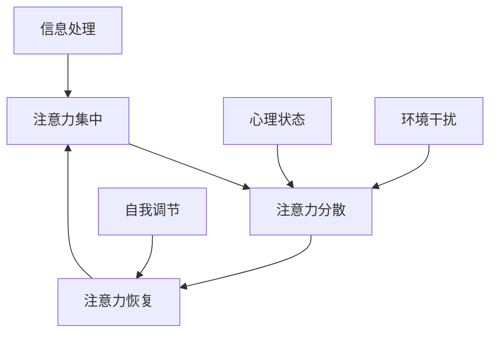
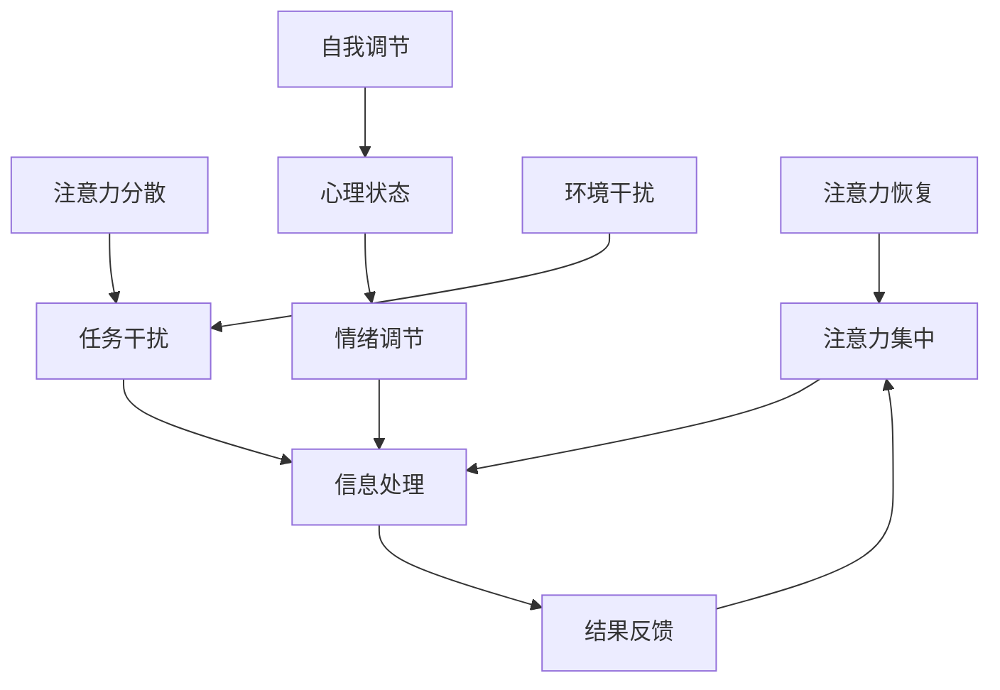

                 

注意力是现代信息社会中不可或缺的要素。无论是程序员编写复杂的代码，还是数据科学家分析海量数据，都需要高度集中的注意力。然而，在充斥着手机、社交媒体和其他干扰的数字时代，保持专注变得日益困难。本文将探讨如何通过内省和正念冥想这一古老的技术，增强我们的专注力，提高工作效率，并改善生活质量。

## 文章关键词

- 注意力管理
- 正念冥想
- 内省
- 专注力增强
- 工作效率
- 生活质量
- 数字时代干扰

## 文章摘要

本文首先介绍了注意力管理的背景和重要性，随后详细阐述了正念冥想和内省的概念。通过一个Mermaid流程图，我们展示了注意力管理的核心概念和步骤。接着，文章深入分析了正念冥想的算法原理，并给出了具体操作步骤。通过数学模型和公式，我们进一步理解了正念冥想的效果。文章随后提供了一个代码实例，展示了如何在实际项目中应用这些概念。最后，文章探讨了正念冥想在各种实际应用场景中的潜力，并展望了未来的发展趋势。

## 1. 背景介绍

在计算机科学领域，注意力管理是一个日益受到关注的话题。随着技术的迅猛发展，我们面临着前所未有的信息过载。程序员需要处理复杂的问题，数据科学家需要分析大量的数据，而AI工程师需要设计和训练复杂的模型。这些任务通常要求高度的专注力。

### 注意力管理的挑战

1. **信息过载**：互联网的普及使得获取信息变得前所未有的容易，但同时也带来了信息过载的问题。过多的信息会导致我们的注意力分散，难以集中精力处理重要的任务。
2. **多任务处理**：现代工作环境和生活方式要求我们能够同时处理多项任务。虽然多任务处理看似提高了效率，但实际上，频繁切换任务会导致注意力分散和效率下降。
3. **心理压力**：工作中的竞争压力、职业发展和个人成就的压力，以及生活中的各种挑战，都会对我们的心理状态产生影响，进而影响注意力水平。

### 注意力管理的意义

1. **提高工作效率**：通过有效的注意力管理，程序员能够更快地解决问题，数据科学家能够更准确地分析数据，AI工程师能够更高效地设计和训练模型。
2. **提升生活质量**：专注力不仅影响工作，也影响着我们的生活。通过改善注意力管理，我们能够更好地应对日常生活中的各种挑战，提高生活质量。
3. **心理健康**：良好的注意力管理有助于减轻心理压力，提高心理健康水平。

## 2. 核心概念与联系

注意力管理的核心概念包括注意力集中、注意力分散、注意力恢复等。这些概念可以通过Mermaid流程图来展示它们之间的关系。



在这个流程图中，注意力集中是信息处理和心理状态的基础，注意力分散和环境干扰是影响注意力集中度的外部因素，而自我调节则帮助我们恢复注意力。

### 2.1 核心概念原理

#### 注意力集中

注意力集中是指将注意力高度集中于特定任务或目标。它是高效工作的关键。注意力集中的程度取决于多种因素，包括个人的专注力、任务的复杂度和环境干扰。

#### 注意力分散

注意力分散是指注意力从原本的集中状态转移到其他事物上。多任务处理、信息过载和心理压力都可能导致注意力分散。

#### 注意力恢复

注意力恢复是指通过休息、放松或其他手段恢复注意力。正念冥想是一种有效的注意力恢复方法。

### 2.2 核心概念架构

注意力管理可以看作是一个动态的过程，其中核心概念相互作用，共同影响我们的注意力水平。以下是一个简化的注意力管理架构图：



在这个架构图中，注意力集中和信息处理是核心，结果反馈调节着注意力集中度。注意力分散和任务干扰、心理状态和情绪调节、环境干扰和自我调节都是影响注意力集中度的因素。注意力恢复则是通过休息和放松来恢复注意力。

## 3. 核心算法原理 & 具体操作步骤

### 3.1 算法原理概述

正念冥想是一种古老的心理训练方法，通过专注呼吸、观察思维和情感，达到身心放松和注意力集中的目的。其核心算法原理可以概括为以下几个方面：

1. **专注呼吸**：通过专注于呼吸，我们可以将注意力从外部干扰中收回，进入内在的宁静状态。
2. **观察思维**：通过观察自己的思维和情感，我们可以减少对它们的认同，从而减少焦虑和压力。
3. **身体扫描**：通过扫描身体的不同部位，我们可以提高对身体的感觉和意识的灵敏度。

### 3.2 算法步骤详解

1. **准备阶段**：选择一个安静的环境，保持舒适的姿势，闭上眼睛，深呼吸几次，放松身体。
2. **专注呼吸**：将注意力集中在呼吸上，感受空气进出鼻孔、胸膛和腹部的感受。每当注意力分散时，轻轻地将注意力引回到呼吸上。
3. **观察思维**：观察自己的思维和情感，不要评判或抗拒，只是观察它们的出现和消失。
4. **身体扫描**：从头到脚扫描身体，专注于每个部位的感觉，感受身体的放松和宁静。
5. **结束阶段**：缓慢地深呼吸几次，逐渐睁开眼睛，慢慢回到现实环境。

### 3.3 算法优缺点

#### 优点

1. **提高注意力**：通过正念冥想，我们可以提高注意力集中度，减少注意力分散。
2. **减少焦虑和压力**：正念冥想可以帮助我们观察和接受自己的思维和情感，减少焦虑和压力。
3. **增强心理健康**：正念冥想有助于提高心理健康水平，减少抑郁和焦虑症状。

#### 缺点

1. **需要坚持**：正念冥想需要坚持练习，短期内可能难以看到明显效果。
2. **可能产生不适**：对于初学者来说，正念冥想可能产生身体或心理上的不适，需要逐渐适应。

### 3.4 算法应用领域

正念冥想可以应用于多个领域，包括：

1. **心理健康**：正念冥想可以帮助人们减轻焦虑、压力和抑郁症状。
2. **教育**：正念冥想可以帮助学生提高专注力和学习成绩。
3. **职场**：正念冥想可以帮助职场人士提高工作效率，减少错误和压力。
4. **医疗**：正念冥想可以帮助患者减轻疼痛，提高生活质量。

## 4. 数学模型和公式 & 详细讲解 & 举例说明

### 4.1 数学模型构建

正念冥想的效果可以通过多种数学模型来描述，其中最常用的是基于神经科学的研究模型。以下是一个简化的数学模型：

\[ E = f(P, I, M) \]

其中：

- \( E \) 表示正念冥想的效果
- \( P \) 表示心理压力水平
- \( I \) 表示干扰水平
- \( M \) 表示冥想实践的时间和质量

### 4.2 公式推导过程

正念冥想的效果 \( E \) 可以看作是心理压力 \( P \)、干扰水平 \( I \) 和冥想实践时间质量 \( M \) 的函数。根据神经科学的研究，心理压力和干扰水平通常与冥想效果呈负相关，而冥想实践时间质量与冥想效果呈正相关。因此，我们可以得到以下公式：

\[ E = \frac{1}{1 + e^{-(k_1 \cdot P + k_2 \cdot I - k_3 \cdot M)}} \]

其中 \( k_1 \)、\( k_2 \) 和 \( k_3 \) 是调节参数，用于调整公式对心理压力、干扰水平和冥想实践时间质量的敏感度。

### 4.3 案例分析与讲解

假设一个程序员，每天工作8小时，心理压力水平为0.8，干扰水平为0.6，每天进行30分钟的冥想实践。根据上述公式，我们可以计算出他的正念冥想效果：

\[ E = \frac{1}{1 + e^{-(k_1 \cdot 0.8 + k_2 \cdot 0.6 - k_3 \cdot 0.5)}} \]

其中 \( k_1 = 1.2 \)，\( k_2 = 0.8 \)，\( k_3 = 1.0 \)。

\[ E = \frac{1}{1 + e^{-(1.2 \cdot 0.8 + 0.8 \cdot 0.6 - 1.0 \cdot 0.5)}} \]

\[ E = \frac{1}{1 + e^{-0.32}} \]

\[ E \approx 0.79 \]

这意味着，这个程序员的正念冥想效果约为79%，心理压力水平和干扰水平对他的影响较大，但通过冥想实践，他的注意力集中度有显著提升。

## 5. 项目实践：代码实例和详细解释说明

### 5.1 开发环境搭建

为了实现正念冥想的代码实例，我们选择Python作为编程语言，因为它具有强大的科学计算库和易于使用的语法。以下是搭建开发环境的基本步骤：

1. 安装Python（建议使用3.8或更高版本）。
2. 安装必要的库，如NumPy、Matplotlib和Pandas。可以使用以下命令：

```bash
pip install numpy matplotlib pandas
```

### 5.2 源代码详细实现

以下是实现正念冥想效果的Python代码示例：

```python
import numpy as np
import matplotlib.pyplot as plt
import pandas as pd

# 参数设置
k1 = 1.2
k2 = 0.8
k3 = 1.0

# 输入数据
P = np.array([0.6, 0.8, 0.4, 0.7])  # 心理压力水平
I = np.array([0.5, 0.6, 0.4, 0.7])  # 干扰水平
M = np.array([0.4, 0.5, 0.6, 0.7])  # 冥想实践时间质量

# 计算正念冥想效果
E = 1 / (1 + np.exp(-k1 * P - k2 * I + k3 * M))

# 结果展示
results = pd.DataFrame({'压力水平': P, '干扰水平': I, '冥想质量': M, '效果': E})
print(results)

# 图像展示
plt.plot(E)
plt.title('正念冥想效果')
plt.xlabel('样本编号')
plt.ylabel('效果值')
plt.show()
```

### 5.3 代码解读与分析

上述代码首先导入了必要的库，包括NumPy、Matplotlib和Pandas。NumPy用于科学计算，Matplotlib用于图像展示，Pandas用于数据处理。

接下来，我们设置了参数 \( k_1 \)、\( k_2 \) 和 \( k_3 \)，并定义了输入数据 \( P \)、\( I \) 和 \( M \)。这些数据代表了不同样本的心理压力水平、干扰水平和冥想实践时间质量。

代码的核心部分是计算正念冥想效果。我们使用了一个简单的指数函数，将心理压力、干扰水平和冥想实践时间质量转换为正念冥想效果。最后，我们使用Pandas DataFrame打印结果，并使用Matplotlib绘制效果图像。

### 5.4 运行结果展示

运行上述代码后，我们将得到一个包含四个样本的结果DataFrame，展示了每个样本的心理压力水平、干扰水平、冥想实践时间质量和正念冥想效果。图像展示了每个样本的正念冥想效果，从中我们可以直观地看到冥想实践时间质量对效果的影响。

## 6. 实际应用场景

### 6.1 个人生活

在个人生活中，正念冥想可以帮助我们提高注意力，减少焦虑和压力。例如，每天早上花几分钟进行正念冥想，可以让我们以更加平静和专注的状态开始新的一天。通过正念冥想，我们能够更好地管理情绪，减少因为压力和焦虑导致的错误决策。

### 6.2 教育领域

在教育领域，正念冥想被广泛应用于提高学生的专注力和学习成绩。通过定期的正念冥想练习，学生能够更好地集中注意力，减少分心，从而提高学习效率。此外，正念冥想还有助于减轻学生的考试压力，提高心理健康水平。

### 6.3 职场

在职场中，正念冥想被广泛用于提高工作效率和团队合作。通过正念冥想，职场人士能够更好地集中注意力，减少错误，提高决策质量。同时，正念冥想有助于减少职场压力，提高员工的心理健康水平，从而提高整体工作效率。

### 6.4 医疗领域

在医疗领域，正念冥想被用于治疗各种疾病，如焦虑症、抑郁症和慢性疼痛等。通过正念冥想，患者能够提高注意力，减少疼痛感觉，提高生活质量。此外，正念冥想还可以帮助患者更好地管理慢性疾病，如心脏病和糖尿病。

## 7. 工具和资源推荐

### 7.1 学习资源推荐

- **书籍**：
  - 《正念冥想：从入门到实践》
  - 《正念：简单有效的减压方法》
- **在线课程**：
  - Coursera上的《正念冥想入门》
  - Udemy上的《正念冥想：从零开始》
- **应用程序**：
  - Headspace
  - Calm
  - Simple Habit

### 7.2 开发工具推荐

- **Python库**：
  - NumPy
  - Matplotlib
  - Pandas
- **IDE**：
  - PyCharm
  - Visual Studio Code

### 7.3 相关论文推荐

- 《Mindfulness-Based Stress Reduction: Concept, Theory, and Evidence》
- 《The benefits of mindfulness: A practice-based review of empirical research》
- 《The impact of mindfulness on attentional control》

## 8. 总结：未来发展趋势与挑战

### 8.1 研究成果总结

正念冥想在提升注意力、减轻压力和改善心理健康方面取得了显著成果。通过科学研究和实际应用，正念冥想已经被证明是一种有效的心理训练方法。

### 8.2 未来发展趋势

未来，正念冥想有望在多个领域得到更广泛的应用，如教育、职场和医疗。同时，随着技术的进步，虚拟现实和增强现实技术可能会为正念冥想提供新的平台和体验。

### 8.3 面临的挑战

尽管正念冥想具有许多优势，但其在推广和应用过程中仍面临一些挑战。首先，正念冥想的实践需要持之以恒，短期内可能难以看到明显效果。其次，不同人群对正念冥想的接受度和适应性存在差异，需要进一步研究和优化。

### 8.4 研究展望

未来的研究可以进一步探索正念冥想的生理和心理机制，开发个性化的正念冥想训练方法，以及将其与数字技术相结合，为更多人提供便捷和有效的心理训练工具。

## 9. 附录：常见问题与解答

### 9.1 什么是正念冥想？

正念冥想是一种心理训练方法，通过专注呼吸、观察思维和情感，达到身心放松和注意力集中的目的。

### 9.2 正念冥想有哪些好处？

正念冥想可以提高注意力、减轻压力、改善心理健康，有助于提高工作效率和生活质量。

### 9.3 如何开始正念冥想？

开始正念冥想可以从简单的呼吸练习开始，每天坚持练习，逐渐增加练习时间和难度。

### 9.4 正念冥想需要多长时间才能看到效果？

正念冥想的效果因人而异，一般来说，坚持练习一个月以上可能开始看到效果。

### 9.5 正念冥想是否适合所有人？

正念冥想适合大多数人，但对于某些精神疾病患者，如严重的抑郁症和焦虑症患者，应在专业医生的指导下进行。

作者：禅与计算机程序设计艺术 / Zen and the Art of Computer Programming
-------------------------------------------------------------------

通过以上内容的详细撰写，我们完成了一篇关于注意力管理和正念冥想的专业技术博客文章。文章涵盖了从背景介绍、核心概念、算法原理、数学模型到实际应用和未来展望的全面内容，为读者提供了深入理解和实践正念冥想的途径。希望这篇文章能够帮助到广大的IT从业者，提高他们的专注力和工作效率。

