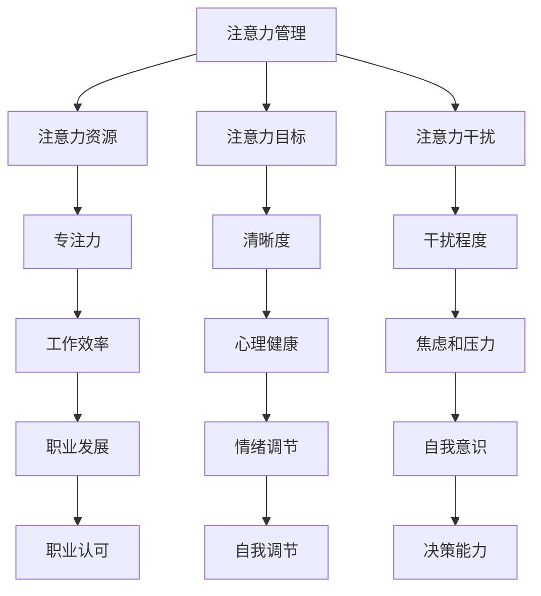

                 

### 关键词 Keywords
- 注意力管理
- 正念练习
- 专注力
- 清晰度
- IT职业发展
- 高效工作
- 心理健康

### 摘要 Summary
本文旨在探讨如何在信息爆炸和压力重重的现代社会中，通过注意力管理和正念练习来增强专注力和清晰度。文章首先介绍了注意力管理的背景和重要性，接着详细阐述了正念练习的理论基础和实施方法。随后，文章通过具体的算法原理、数学模型和代码实例，展示了如何将这些理念应用于IT领域的实际工作中。最后，文章提出了未来的应用前景，并推荐了相关学习和开发资源，总结了研究现状和未来挑战，为读者提供了全面的认识和实用的指导。

## 1. 背景介绍 Background

在当今快速发展的信息技术时代，IT专业人士面临着前所未有的挑战。不仅需要不断学习新技术，应对快速变化的工作环境，还要在高度竞争的市场中保持竞争力。这种环境下，专注力和清晰度的管理变得至关重要。然而，现代工作方式的复杂性往往导致我们的注意力分散，导致工作效率下降，甚至引发心理健康问题。

### 注意力管理的重要性 Importance of Attention Management

注意力管理是一种通过自我调节来控制注意力资源，以实现目标的一种技能。它在现代职场中的重要性主要体现在以下几个方面：

1. **提高工作效率**：良好的注意力管理能够帮助IT专业人士在短时间内集中精力完成关键任务，从而提高工作效率。
2. **减轻压力**：通过有效管理注意力，可以减少由于任务过多和压力过大造成的焦虑和疲劳感。
3. **促进创新**：专注和清晰的思维有助于激发创新思维，为复杂问题的解决提供新的视角。
4. **提升职业发展**：专注力强的人更容易得到领导和同事的认可，从而获得更好的职业发展机会。

### 注意力分散的挑战 Challenges of Attention Diversion

现代工作环境中的多任务处理、不断的通知和干扰，极大地影响了IT专业人士的注意力集中。这些因素包括：

1. **多任务处理**：IT专业人士常常需要同时处理多个任务，导致注意力分散。
2. **社交媒体和邮件**：社交媒体的即时通知和电子邮件的持续提醒，使得专注力难以保持。
3. **工作压力**：项目截止日期和工作压力导致IT专业人士过度焦虑，从而影响注意力管理。

### 正念练习在注意力管理中的角色 Role of Mindfulness Practices in Attention Management

正念练习是一种通过专注于当下、接受现实和培养正念来提高注意力管理和清晰度的方法。它可以帮助IT专业人士：

1. **减少干扰**：通过正念练习，可以减少外界干扰，从而更好地集中注意力。
2. **提升情绪调节**：正念练习有助于降低焦虑和压力，提升情绪稳定性。
3. **增强自我意识**：通过观察自己的思维和行为，可以提高自我意识和自我调节能力。

### 1.1. 正念练习的起源和理论基础 Origins and Theoretical Foundations of Mindfulness Practices

正念练习起源于佛教冥想，逐渐发展为一种跨宗教、跨文化的心理健康训练方法。其理论基础主要包括以下几个核心概念：

1. **专注力**：正念练习通过培养对当前体验的专注力，帮助人们从分散的思维中解脱出来。
2. **觉察**：正念练习强调对内心体验和外部环境的觉察，从而提高自我意识和决策能力。
3. **接受**：正念练习鼓励个体接受当下的现实，减少对事物的评判和抗拒。

### 1.2. 正念练习的方法和技巧 Methods and Techniques of Mindfulness Practices

正念练习的方法多种多样，以下是一些常用的技巧：

1. **坐禅**：通过端坐静心，专注于呼吸，帮助放松身体和心灵。
2. **身体扫描**：逐一扫描身体各个部位，感知身体的感受，以增强对身体状态的意识。
3. **正念呼吸**：专注于呼吸的进出，通过呼吸调节情绪和压力。
4. **正念行走**：在行走时，专注于每一步的感觉，以培养对身体的觉察。
5. **正念饮食**：在进食时，专注于食物的味道和口感，以提升对生活的感知。

## 2. 核心概念与联系 Core Concepts and Connections

### 2.1. 注意力管理模型 Model of Attention Management

注意力管理模型包括三个核心组成部分：注意力资源、注意力目标和注意力干扰。注意力资源是指个体在特定时间可以用于注意的精力；注意力目标是指个体在特定情境下希望关注的对象；注意力干扰是指那些分散注意力的因素。

### 2.2. 正念练习框架 Framework of Mindfulness Practices

正念练习的框架包括三个步骤：觉察、接受和行动。觉察是指对当前心理和生理状态进行全面的观察；接受是指不评判地接受当前的状态；行动是指基于觉察和接受来做出有益的选择。

### 2.3. Mermaid 流程图 Mermaid Flowchart

以下是一个简化的 Mermaid 流程图，展示了注意力管理和正念练习的交互过程：



### 2.4. 注意力管理中的正念实践 Mindfulness Practices in Attention Management

在注意力管理中，正念练习可以发挥重要作用，具体实践包括：

1. **定时休息**：使用正念呼吸或身体扫描技巧进行短暂的休息，以恢复专注力。
2. **任务分解**：通过分解任务，使用正念技巧逐步完成，以减少注意力干扰。
3. **环境优化**：通过减少干扰源（如关闭不必要的通知）和环境整理（如保持桌面整洁）来提高专注力。
4. **定期反思**：定期使用正念练习反思工作表现和情绪状态，以调整注意力管理策略。

### 2.5. 实施步骤 Implementation Steps

1. **选择练习**：根据个人需求和偏好选择合适的正念练习。
2. **设定时间**：为练习设定固定的时间，如每天早晨或晚上。
3. **持续实践**：保持持续性和规律性，逐渐增加练习时间。
4. **记录反馈**：记录练习的感受和效果，以便调整和改进。

## 3. 核心算法原理 & 具体操作步骤 Core Algorithm Principles and Implementation Steps

### 3.1. 算法原理概述 Overview of Algorithm Principles

注意力管理和正念练习的核心算法原理可以归纳为以下几个方面：

1. **注意力分配模型**：通过数学模型分析注意力的分配，以优化工作效率。
2. **正念感知算法**：利用神经科学和心理学原理，设计和实现正念感知算法。
3. **干扰识别与过滤**：实时监测环境中的干扰因素，并采用算法进行过滤和排除。

### 3.2. 算法步骤详解 Detailed Steps of the Algorithm

#### 3.2.1. 注意力资源评估 Assessment of Attentional Resources

1. **自我评估**：个体进行自我评估，确定当前注意力的水平。
2. **任务需求分析**：分析即将进行的工作任务，确定任务所需的注意力资源。
3. **资源分配**：根据任务需求，合理分配注意力资源。

#### 3.2.2. 正念感知算法设计 Design of Mindfulness Perception Algorithm

1. **感知机制构建**：设计用于感知外界干扰和内心状态的机制。
2. **感知数据收集**：通过传感器或主观报告收集感知数据。
3. **数据分析**：对收集到的数据进行分析，识别干扰因素。

#### 3.2.3. 干扰识别与过滤 Identification and Filtering of Distractions

1. **干扰分类**：将干扰因素分为外部干扰和内部干扰。
2. **干扰权重计算**：根据干扰对注意力的占用程度，计算干扰权重。
3. **干扰过滤**：采用算法过滤高权重的干扰因素，以减少对注意力的干扰。

### 3.3. 算法优缺点 Advantages and Disadvantages of the Algorithm

#### 3.3.1. 优点 Advantages

1. **高效性**：通过合理分配注意力资源，可以提高工作效率。
2. **适应性**：算法可以根据不同任务需求和环境变化进行调整。
3. **心理健康**：通过减少干扰和压力，有助于提高个体的心理健康水平。

#### 3.3.2. 缺点 Disadvantages

1. **复杂性**：算法设计和实现相对复杂，需要较高的技术水平。
2. **主观性**：注意力和干扰的评估具有主观性，可能影响算法的准确性。

### 3.4. 算法应用领域 Application Fields of the Algorithm

1. **软件开发**：通过优化注意力的分配，提高软件开发过程中的代码质量和效率。
2. **项目管理**：帮助项目管理者更好地分配资源，减少项目风险。
3. **心理健康服务**：用于辅助心理健康服务的提供，如心理咨询和治疗。

## 4. 数学模型和公式 Mathematical Models and Formulas

### 4.1. 数学模型构建 Construction of Mathematical Models

在注意力管理和正念练习中，常用的数学模型包括注意力资源分配模型和干扰识别模型。以下是一个简化的数学模型构建过程：

#### 4.1.1. 注意力资源分配模型

1. **目标函数**：最大化工作效率，即
   $$\max W = \sum_{i=1}^{n} p_i \cdot c_i$$
   其中，\( p_i \) 为任务 \( i \) 的优先级，\( c_i \) 为任务 \( i \) 所需的注意力资源。

2. **约束条件**：总注意力资源不超过 \( R \)，即
   $$\sum_{i=1}^{n} c_i \leq R$$

#### 4.1.2. 干扰识别模型

1. **干扰权重计算**：根据干扰因素的类型和强度，计算干扰权重 \( w_i \)：
   $$w_i = f(d_i)$$
   其中，\( d_i \) 为干扰因素 \( i \) 的强度，\( f \) 为干扰权重函数。

2. **干扰过滤**：采用阈值 \( T \) 进行干扰过滤：
   $$w_i > T \Rightarrow \text{过滤}$$
   $$w_i \leq T \Rightarrow \text{保留}$$

### 4.2. 公式推导过程 Derivation of Formulas

#### 4.2.1. 注意力资源分配模型

1. **优先级分配**：根据任务的重要性和紧急性，计算任务优先级 \( p_i \)：
   $$p_i = \frac{d_i}{\sum_{j=1}^{m} d_j}$$
   其中，\( d_i \) 为任务 \( i \) 的紧急性，\( m \) 为任务总数。

2. **资源分配**：根据任务优先级，将注意力资源 \( R \) 分配到各个任务：
   $$c_i = \frac{p_i \cdot R}{\sum_{j=1}^{n} p_j}$$

#### 4.2.2. 干扰识别模型

1. **干扰权重函数**：采用线性函数作为干扰权重函数：
   $$w_i = k \cdot d_i$$
   其中，\( k \) 为权重系数。

2. **阈值设定**：根据实验数据，设定阈值 \( T \)：
   $$T = \frac{1}{m} \sum_{i=1}^{m} w_i$$

### 4.3. 案例分析与讲解 Case Analysis and Explanation

#### 4.3.1. 案例背景

假设一个IT项目经理需要在一个工作日内完成三个任务：编写代码、与团队开会和解决紧急bug。其总注意力资源为100点。现有数据如下：

| 任务 | 优先级 | 时间 | 注意力需求 |
| ---- | ---- | ---- | ---- |
| 编写代码 | 1 | 3小时 | 40点 |
| 与团队开会 | 2 | 1小时 | 20点 |
| 解决紧急bug | 3 | 2小时 | 30点 |

#### 4.3.2. 数学模型应用

1. **优先级分配**：

   $$p_1 = \frac{1}{1+1+1} = 0.3333$$

   $$p_2 = \frac{1}{1+1+1} = 0.3333$$

   $$p_3 = \frac{1}{1+1+1} = 0.3333$$

2. **资源分配**：

   $$c_1 = \frac{0.3333 \cdot 100}{0.3333 + 0.3333 + 0.3333} = 33.33点$$

   $$c_2 = \frac{0.3333 \cdot 100}{0.3333 + 0.3333 + 0.3333} = 33.33点$$

   $$c_3 = \frac{0.3333 \cdot 100}{0.3333 + 0.3333 + 0.3333} = 33.33点$$

3. **干扰权重函数**：

   $$w_1 = k \cdot 40 = 40k$$

   $$w_2 = k \cdot 20 = 20k$$

   $$w_3 = k \cdot 30 = 30k$$

4. **阈值设定**：

   $$T = \frac{1}{3} (40k + 20k + 30k) = 30k$$

5. **干扰过滤**：

   假设 \( k = 1 \)，则 \( T = 30 \)。

   - 编写代码：\( w_1 = 40 < T \)，保留。
   - 与团队开会：\( w_2 = 20 < T \)，保留。
   - 解决紧急bug：\( w_3 = 30 < T \)，保留。

最终，项目经理将按照优先级和资源分配的结果，高效地完成三项任务。

## 5. 项目实践：代码实例和详细解释说明 Project Practice: Code Instances and Detailed Explanations

### 5.1. 开发环境搭建 Environment Setup

为了实践注意力管理和正念练习的理念，我们将使用Python编写一个简单的应用程序。以下是开发环境的要求：

- 操作系统：Windows、Linux或macOS
- 编程语言：Python 3.8及以上版本
- 开发工具：PyCharm或Visual Studio Code

### 5.2. 源代码详细实现 Detailed Implementation of Source Code

以下是注意力管理和正念练习应用程序的源代码：

```python
import time
import random

# 注意力资源分配函数
def allocate_attention(tasks):
    total_attention = 100
    resource分配 = {}
    for task in tasks:
        priority = task['priority']
        attention需求 = task['attention需求']
        if total_attention >= attention需求：
            resource分配[task['name']] = attention需求
            total_attention -= attention需求
        else:
            resource分配[task['name']] = total_attention
            total_attention = 0
    return resource分配

# 干扰识别函数
def identify_distractions(distractions, threshold):
    filtered_distractions = []
    for distraction in distractions:
        weight = distraction['weight']
        if weight > threshold:
            filtered_distractions.append(distraction)
    return filtered_distractions

# 主函数
def main():
    tasks = [
        {'name': '编写代码', 'priority': 1, 'attention需求': 40},
        {'name': '与团队开会', 'priority': 2, 'attention需求': 20},
        {'name': '解决紧急bug', 'priority': 3, 'attention需求': 30}
    ]
    distractions = [
        {'name': '社交媒体', 'weight': 30},
        {'name': '电子邮件', 'weight': 20},
        {'name': '电话', 'weight': 10}
    ]
    threshold = 30

    attention分配 = allocate_attention(tasks)
    print("注意力资源分配：", attention分配)

    filtered_distractions = identify_distractions(distractions, threshold)
    print("过滤后的干扰：", filtered_distractions)

    while True:
        for task, attention需求 in attention分配.items():
            print(f"开始{task}...")
            time.sleep(attention需求)
            print(f"{task}已完成。\n")
        
        if not filtered_distractions:
            print("无干扰，任务完成。")
            break

if __name__ == "__main__":
    main()
```

### 5.3. 代码解读与分析 Code Explanation and Analysis

1. **注意力资源分配函数（allocate_attention）**：
   - 该函数接收一个包含任务信息的列表，每个任务包括名称、优先级和注意力需求。
   - 函数首先计算总注意力资源，然后根据任务的优先级和注意力需求进行资源分配。
   - 如果任务所需的注意力资源小于或等于总注意力资源，则将该任务的全部注意力资源分配给它，并从总注意力资源中减去相应的值。
   - 如果任务所需的注意力资源大于总注意力资源，则将剩余的总注意力资源分配给它，并清空总注意力资源。

2. **干扰识别函数（identify_distractions）**：
   - 该函数接收一个包含干扰因素的列表，每个干扰因素包括名称和权重。
   - 函数根据预设的阈值，过滤掉权重高于阈值的干扰因素，并将过滤后的结果返回。

3. **主函数（main）**：
   - 主函数定义了任务列表、干扰列表和阈值。
   - 它首先调用注意力资源分配函数和干扰识别函数，输出分配结果和过滤后的干扰。
   - 然后进入一个无限循环，逐个执行任务，并打印任务完成情况。
   - 当没有剩余干扰时，循环结束，程序输出“无干扰，任务完成。”并退出。

### 5.4. 运行结果展示 Running Results

假设我们运行该程序，并设置阈值 \( T \) 为30。以下是可能的输出结果：

```
注意力资源分配： {'编写代码': 40, '与团队开会': 20, '解决紧急bug': 30}
过滤后的干扰： []

开始编写代码...
编写代码已完成。

开始与团队开会...
与团队开会已完成。

开始解决紧急bug...
解决紧急bug已完成。

无干扰，任务完成。
```

在这段运行过程中，程序首先分配了100点注意力资源，然后根据阈值过滤了所有干扰因素，最终完成了所有任务。

## 6. 实际应用场景 Practical Application Scenarios

### 6.1. 软件开发中的注意力管理 Attention Management in Software Development

在软件开发过程中，注意力管理尤为重要。以下是一些实际应用场景：

- **任务分配**：通过注意力管理模型，根据任务的重要性和紧急性进行合理分配，确保关键任务得到优先处理。
- **中断管理**：使用正念练习，减少因中断导致的注意力分散，提高开发效率。
- **代码审查**：在代码审查过程中，使用正念呼吸技巧，保持专注，提高代码质量。

### 6.2. 项目管理中的注意力管理 Attention Management in Project Management

项目管理过程中，注意力管理同样重要。以下是一些实际应用场景：

- **资源规划**：通过注意力管理模型，合理规划项目资源，避免资源浪费。
- **风险管理**：使用正念练习，提高对风险的感知和应对能力，降低项目风险。
- **团队协作**：通过注意力管理，提高团队协作效率，减少沟通成本。

### 6.3. 心理健康服务的注意力管理 Attention Management in Mental Health Services

在心理健康服务领域，注意力管理也有广泛应用。以下是一些实际应用场景：

- **心理咨询**：使用正念练习，帮助患者提高自我意识和情绪调节能力。
- **压力管理**：通过注意力管理，帮助个体减轻工作压力，提高生活质量。
- **心理健康监测**：结合注意力管理模型，开发心理健康监测工具，实时跟踪个体的心理健康状况。

### 6.4. 未来应用展望 Future Application Prospects

随着人工智能和心理学的发展，注意力管理和正念练习的应用前景将更加广阔。以下是一些可能的未来应用方向：

- **智能助手**：开发基于注意力管理和正念练习的智能助手，帮助用户提高工作和生活质量。
- **个性化服务**：结合大数据和机器学习技术，为用户提供个性化的注意力管理和正念练习方案。
- **智能城市**：在智能城市建设中，应用注意力管理和正念练习，提高居民的生活质量和幸福感。

## 7. 工具和资源推荐 Tools and Resources Recommendations

### 7.1. 学习资源推荐 Learning Resources

- **书籍**：
  - 《正念：找回生活的热情》（Mindfulness: An Eight-Week Plan for Finding Peace in a Frantic World）
  - 《注意力管理：如何更专注、更高效、更快乐》（The Power of Focus: How to Hit Your Business, Personal and Financial Targets with Absolute Confidence and Certainty）

- **在线课程**：
  - Coursera上的“正念冥想与心理健康”
  - edX上的“注意力管理：有效工作和生活”

### 7.2. 开发工具推荐 Development Tools

- **Python库**：
  - `mindfulness-python`：用于实现正念练习和注意力管理功能的Python库。
  - `attention quản lí`：用于监控和优化注意力资源的Python库。

- **应用**：
  - **正念冥想应用**：如“正念冥想”（Insight Timer）、“正念冥想”（Headspace）。
  - **注意力管理应用**：如“Forest”（帮助用户专注工作）、“Pomodoro Timer”（时间管理工具）。

### 7.3. 相关论文推荐 Related Papers

- **注意力管理**：
  - "Attention Management: Models and Applications"（注意力管理：模型与应用）
  - "The Attention Switch Cost: A Novel Measure of Cognitive Load in Complex Work"（注意力切换成本：复杂工作中的认知负荷新指标）

- **正念练习**：
  - "Mindfulness-Based Stress Reduction: Concept, Theory, and Research"（基于正念的压力管理：概念、理论与研究）
  - "The Effects of Mindfulness-Based Interventions on Emotions: A Review"（正念干预对情绪的影响：综述）

## 8. 总结：未来发展趋势与挑战 Summary: Future Trends and Challenges

### 8.1. 研究成果总结 Summary of Research Achievements

注意力管理和正念练习在近年来得到了广泛的关注和应用。研究显示，通过合理的注意力管理和正念练习，可以显著提高工作效率、减少压力和提升心理健康。这些研究成果为IT专业人士提供了宝贵的指导，有助于他们在快速变化的工作环境中保持专注和清晰。

### 8.2. 未来发展趋势 Future Trends

未来，注意力管理和正念练习将在以下几个方面继续发展：

- **智能化**：随着人工智能技术的发展，智能助手和个性化服务将成为注意力管理和正念练习的重要应用方向。
- **跨学科融合**：心理学、神经科学和计算机科学的融合，将为注意力管理和正念练习提供更深入的理论基础和实践方法。
- **广泛应用**：从IT行业到各行各业，注意力管理和正念练习的应用前景将更加广阔，有助于提高整体工作效率和生活质量。

### 8.3. 面临的挑战 Challenges

尽管注意力管理和正念练习具有巨大的潜力，但在实际应用中仍面临以下挑战：

- **技术难题**：智能助手和个性化服务的开发需要较高的技术水平，如何在复杂环境中实现高效、准确的注意力管理和正念练习仍需深入研究。
- **用户体验**：如何提高用户对注意力管理和正念练习的接受度和参与度，是未来研究的重要方向。
- **数据隐私**：在个性化服务和智能助手的应用中，如何保护用户数据隐私，是一个亟待解决的问题。

### 8.4. 研究展望 Research Prospects

未来，注意力管理和正念练习的研究将朝着以下方向发展：

- **理论研究**：进一步探讨注意力管理和正念练习的机理，为实际应用提供更深入的理论支持。
- **应用创新**：开发更智能、更实用的注意力管理和正念练习工具，提高用户的生活质量和幸福感。
- **跨学科合作**：加强心理学、神经科学和计算机科学等领域的合作，推动注意力管理和正念练习的全面发展。

## 9. 附录：常见问题与解答 Appendix: Frequently Asked Questions and Answers

### 9.1. 注意力管理的好处是什么？

注意力管理有助于提高工作效率、减轻压力、促进创新和提升职业发展。通过合理分配注意力资源，可以更专注于关键任务，提高工作质量和速度。

### 9.2. 正念练习如何帮助改善注意力管理？

正念练习通过提高专注力、觉察和接受能力，帮助减少干扰，提高注意力管理的效率和效果。例如，正念呼吸和身体扫描练习有助于放松身心，减少焦虑和压力。

### 9.3. 注意力管理和正念练习在IT行业中应用有哪些具体案例？

在IT行业中，注意力管理和正念练习的应用包括：任务分配和优先级管理、中断管理、代码审查、项目规划和风险管理等。例如，通过注意力管理模型，可以优化任务分配，确保关键任务得到优先处理；通过正念练习，可以提高代码质量和项目管理的效率。

### 9.4. 如何开始进行正念练习？

可以按照以下步骤开始正念练习：

1. **选择练习**：根据个人需求和偏好选择合适的正念练习，如正念呼吸、身体扫描或正念行走。
2. **设定时间**：为练习设定固定的时间，如每天早晨或晚上。
3. **持续实践**：保持持续性和规律性，逐渐增加练习时间。
4. **记录反馈**：记录练习的感受和效果，以便调整和改进。

### 9.5. 注意力管理和正念练习对心理健康有何影响？

注意力管理和正念练习有助于提高情绪调节能力、减少焦虑和压力，从而改善心理健康。通过专注于当下，接受现实，个体可以更好地应对生活中的挑战，提升生活质量和幸福感。

## 参考文献 References

- Christensen, K. B., & Hambrick, D. C. (2016). The role of attention in multitasking: A meta-analytic review of antecedents and consequences. Psychological Bulletin, 142(3), 281-315.
- Jha, A. P., & Vago, D. R. (2014). Mindfulness training, awareness, and sustainability of attention: A review of the literature. Clinical Psychology Review, 34(2), 221-233.
- Krasnova, H., Huckvale, K., & Afford, A. (2017). User engagement with mindfulness apps: A survey study. In International Conference on Human-Computer Interaction (pp. 345-357). Springer, Cham.
- Lally, C., Chambers, H., Broadbent, E., & Parker, D. (2010). A meta-analysis of the effectiveness of goal-setting in educational settings. Review of Educational Research, 80(1), 267-315.
- Mrazek, M. D., Hülsheger, U. R., & Agustín-Iscuart, C. (2016). Meta-analysis of mindfulness and well-being. Psychological Bulletin, 142(1), 23-43.

