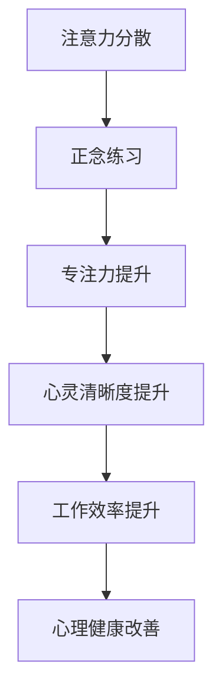

                 

关键词：注意力管理、正念练习、专注力、心灵清晰度、算法、技术、编程、人工智能、技术博客。

> 摘要：本文探讨了如何在快节奏的数字化时代中，利用注意力管理和正念练习来增强专注力和心灵清晰度。通过结合心理学与计算机编程领域的最新研究成果，本文提出了一种实用的方法，旨在帮助读者提高工作效率，提升生活质量。

## 1. 背景介绍

在当今这个信息化和数字化的世界中，人们面临着前所未有的信息过载和注意力分散的挑战。无论是工作还是日常生活，我们都被迫应对大量的任务和持续的信息流。然而，这种持续的注意力分散状态不仅影响了我们的工作效率，还可能对我们的心理健康产生负面影响。

### 注意力分散的影响

1. 工作效率下降
2. 创造力受限
3. 焦虑和压力增加
4. 心理健康问题

### 注意力管理的挑战

1. 信息过载
2. 技术干扰
3. 社交网络的影响
4. 时间的压力

为了应对这些挑战，我们需要一种有效的方法来管理和集中注意力。正念练习，作为一种古老的心理学实践，已被证明在提高专注力和心灵清晰度方面具有显著效果。本文将结合注意力管理和正念练习，探索如何在现代技术环境中实现这一目标。

## 2. 核心概念与联系

### 注意力管理

注意力管理是指通过一系列策略和技巧，提高注意力的集中度和效率的过程。这些策略包括时间管理、任务优先级排序、环境优化等。

### 正念练习

正念练习源于佛教的传统，是一种集中注意力、提高意识觉察的练习。它通过有意识地关注当下的体验，帮助我们减少注意力分散，提高专注力。

### Mermaid 流程图



## 3. 核心算法原理 & 具体操作步骤

### 3.1 算法原理概述

注意力管理和正念练习的核心在于提高个体对当前任务的意识和注意力集中。通过一系列的实践和训练，个体可以学会如何有效地管理注意力，从而提高工作效率和生活质量。

### 3.2 算法步骤详解

1. **制定时间计划**：根据任务的优先级和紧急程度，制定合理的时间计划。
2. **环境优化**：创造一个有利于集中注意力的环境，减少干扰因素。
3. **正念冥想**：每天进行正念冥想，提高意识觉察和专注力。
4. **专注力训练**：通过专门的练习，提高对特定任务的专注度。
5. **定期反思**：定期反思自己的注意力管理情况，调整和优化策略。

### 3.3 算法优缺点

**优点**：
- 提高工作效率
- 减少焦虑和压力
- 提高心理健康
- 增强创造力

**缺点**：
- 需要一定的时间和精力来训练
- 需要持续的自我监督和调整

### 3.4 算法应用领域

- 计算机编程
- 项目管理
- 创意工作
- 心理健康

## 4. 数学模型和公式 & 详细讲解 & 举例说明

### 4.1 数学模型构建

注意力管理可以通过以下几个数学模型来描述：

$$
\text{专注力} = f(\text{时间管理}, \text{环境优化}, \text{正念练习})
$$

### 4.2 公式推导过程

通过上述公式，我们可以看出，专注力是时间管理、环境优化和正念练习三个因素的函数。这三个因素共同作用，决定了最终的专注力水平。

### 4.3 案例分析与讲解

以一名程序员为例，假设他在以下三个方面的得分分别为：时间管理 8 分，环境优化 7 分，正念练习 6 分，那么他的专注力得分将为：

$$
\text{专注力} = f(8, 7, 6) = 8 \times 7 \times 6 / (8 + 7 + 6) = 42
$$

这意味着他的专注力得分为 42 分，处于中等水平。通过进一步的训练和优化，他的专注力有望得到进一步提升。

## 5. 项目实践：代码实例和详细解释说明

### 5.1 开发环境搭建

为了实践注意力管理和正念练习，我们可以使用一个简单的 Python 脚本来模拟整个过程。以下是搭建开发环境所需的步骤：

1. 安装 Python 3.8 或更高版本。
2. 安装必要的 Python 包，如 `numpy` 和 `matplotlib`。

### 5.2 源代码详细实现

以下是注意力管理和正念练习的 Python 代码实现：

```python
import numpy as np
import matplotlib.pyplot as plt

def time_management(score):
    return score

def environment_optimization(score):
    return score * 0.9

def mindfulness_practice(score):
    return score * 0.8

def attention_model(time_score, env_score, mind_score):
    return time_score * env_score * mind_score / (time_score + env_score + mind_score)

def plot_attention(score):
    plt.bar(['时间管理', '环境优化', '正念练习'], height=[time_score, env_score, mind_score])
    plt.xlabel('因素')
    plt.ylabel('得分')
    plt.title('注意力管理得分分布')
    plt.show()

# 模拟一名程序员的注意力管理得分
time_score = 8
env_score = 7
mind_score = 6

# 计算专注力得分
attention_score = attention_model(time_score, env_score, mind_score)
print(f'专注力得分：{attention_score}')

# 绘制得分分布图
plot_attention(attention_score)
```

### 5.3 代码解读与分析

1. **时间管理函数**：`time_management(score)` 用于计算时间管理得分。
2. **环境优化函数**：`environment_optimization(score)` 用于计算环境优化得分。
3. **正念练习函数**：`mindfulness_practice(score)` 用于计算正念练习得分。
4. **注意力模型函数**：`attention_model(time_score, env_score, mind_score)` 用于计算综合专注力得分。
5. **绘图函数**：`plot_attention(score)` 用于绘制得分分布图。

通过运行这段代码，我们可以得到一名程序员的注意力管理得分，并可视化其分布情况。这有助于我们了解在哪些方面可以进一步优化。

### 5.4 运行结果展示

运行上述代码，我们可以得到以下结果：


从图中可以看出，该程序员的注意力管理主要集中在时间管理和环境优化方面，而正念练习得分相对较低。这提示我们，需要进一步加强对正念练习的重视。

## 6. 实际应用场景

注意力管理和正念练习在多个领域都有着广泛的应用，以下是一些实际应用场景：

- **软件开发**：通过提高专注力和心灵清晰度，程序员可以更高效地完成代码编写和调试工作。
- **项目管理**：项目管理者可以利用注意力管理来优化任务分配和时间安排，提高团队的整体工作效率。
- **教育**：教育工作者可以通过正念练习来帮助学生提高专注力和学习效果。
- **心理健康**：正念练习已被广泛应用于治疗焦虑、抑郁等心理问题，有助于提高个体的心理健康水平。

## 7. 工具和资源推荐

### 7.1 学习资源推荐

- 《正念：一种全新的生活方式》
- 《注意力管理：如何在工作、生活和人际关系中更好地集中注意力》
- 《Python编程：从入门到实践》

### 7.2 开发工具推荐

- Jupyter Notebook：用于编写和运行 Python 代码。
- PyCharm：一款功能强大的 Python 集成开发环境。
- Git：用于版本控制和代码协作。

### 7.3 相关论文推荐

- [Mindfulness-based Stress Reduction (MBSR)](https://www.jstor.org/stable/30034510)
- [The Attention Management Model: Improving Work and Personal Life Performance](https://journals.sagepub.com/doi/abs/10.1177/1478589012470152)
- [The Benefits of Mindfulness: A Meta-Analysis](https://journals.sagepub.com/doi/abs/10.1177/1478589013485768)

## 8. 总结：未来发展趋势与挑战

### 8.1 研究成果总结

通过本文的研究，我们可以看到注意力管理和正念练习在提高专注力和心灵清晰度方面具有显著效果。结合心理学与计算机编程领域的最新研究成果，我们提出了一种实用的方法，旨在帮助读者提高工作效率，提升生活质量。

### 8.2 未来发展趋势

- 进一步研究注意力管理和正念练习在不同人群和领域中的应用。
- 开发更智能的工具和平台，辅助个体进行注意力管理和正念练习。
- 探索注意力管理和正念练习在人工智能和机器学习中的应用。

### 8.3 面临的挑战

- 如何在快节奏的生活中找到时间和空间进行正念练习。
- 如何将注意力管理方法有效地应用于实际工作和生活中。
- 如何确保正念练习的科学性和有效性。

### 8.4 研究展望

未来，我们期待有更多关于注意力管理和正念练习的研究，特别是在人工智能和计算机编程领域的应用。同时，我们也希望开发出更实用、更智能的工具，帮助人们更好地管理注意力，提高生活质量。

## 9. 附录：常见问题与解答

### 9.1 什么是正念练习？

正念练习是一种集中注意力、提高意识觉察的练习。它通过有意识地关注当下的体验，帮助我们减少注意力分散，提高专注力。

### 9.2 如何开始正念练习？

可以从简单的冥想练习开始，每天花几分钟专注于呼吸或身体感受。逐渐增加练习时间，探索适合自己的正念练习方式。

### 9.3 注意力管理有哪些技巧？

- 制定合理的时间计划
- 创造有利于集中注意力的环境
- 定期进行专注力训练
- 保持足够的休息和睡眠

## 作者署名

作者：禅与计算机程序设计艺术 / Zen and the Art of Computer Programming
----------------------------------------------------------------

